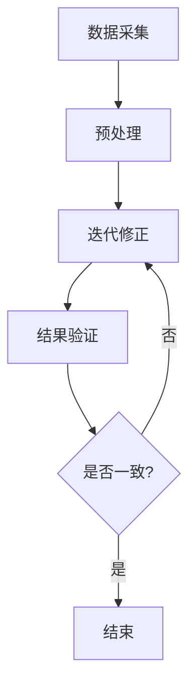

                 


### 1.1 高能物理数据分析的重要性

#### 高能物理实验的背景与需求

高能物理数据分析是现代物理学研究的重要手段之一，它源于对宇宙起源、物质构成以及基本相互作用规律的探究。高能物理实验通过对高能量粒子的碰撞产生大量数据，这些数据包含了有关宇宙的基本信息。为了从这些复杂的数据中提取有价值的信息，需要对数据进行精细的分析和处理。

高能物理实验的需求主要集中在以下几个方面：

1. **发现新粒子**：高能物理实验的一个主要目标是发现新的基本粒子，以丰富我们对物质世界的理解。新粒子的发现往往需要通过大量的数据分析来确认其存在。

2. **检验理论模型**：现有的物理理论，如标准模型，需要通过实验数据来进行验证和修正。高能物理数据分析在这一过程中起着至关重要的作用。

3. **理解宇宙起源**：宇宙的起源和演化是一个庞大的课题，需要通过对早期宇宙状态的研究来解答。高能物理实验提供了研究宇宙早期状态的手段。

#### 高能物理数据分析的作用和意义

高能物理数据分析的作用和意义主要体现在以下几个方面：

1. **推动科学进步**：通过对数据的深入分析，科学家能够提出新的理论和假设，从而推动物理学乃至整个科学领域的发展。

2. **技术进步**：高能物理数据分析过程中，需要使用到先进的计算机技术、数据分析算法等，这些技术的发展和应用促进了整个信息技术领域的进步。

3. **交叉学科发展**：高能物理数据分析往往需要结合多个学科的知识，如统计学、计算机科学、数学等，从而推动了跨学科的发展。

4. **社会影响**：高能物理研究的成果不仅对科学界有重要影响，也对工业界、医学界等有广泛的实际应用，如粒子加速器在癌症治疗中的应用等。

### 1.2 高能物理数据分析中的挑战

尽管高能物理数据分析在科学研究中具有重要作用，但这一领域也面临着诸多挑战：

1. **数据量庞大**：高能物理实验产生的数据量极其庞大，每秒可以产生数十亿甚至更多的数据点。如何有效地存储、管理和分析这些数据是一个巨大的挑战。

2. **数据复杂性**：高能物理数据通常包含多种不同类型的物理过程，这使得数据分析变得复杂。此外，数据中往往包含噪声和不确定性，需要采用复杂的方法来处理。

3. **假设检验与模型选择**：在高能物理数据分析中，科学家需要检验多个假设，并选择合适的模型来描述数据。这个过程通常涉及多个参数的估计和优化，具有高度的复杂性。

4. **数据可视化与解释**：将复杂的数据转化为易于理解的形式是一个挑战。科学家需要开发有效的数据可视化工具，以便更好地理解数据中的物理现象。

### 1.3 Self-Consistency方法的出现与意义

为了解决上述挑战，科学家们开发了许多先进的分析方法，其中Self-Consistency方法是一种特别有用的工具。Self-Consistency方法的出现具有重要意义：

1. **一致性检查**：Self-Consistency方法通过检查不同数据源之间的结果一致性来识别和纠正错误。这种方法可以有效地减少数据中的噪声和不确定性，提高数据分析的准确性。

2. **跨模型检验**：Self-Consistency方法允许科学家在多个模型之间进行比较，从而验证不同模型的预测能力。这有助于选择最合适的模型来描述数据。

3. **提高效率**：Self-Consistency方法可以显著提高数据分析的效率，因为它可以通过自动化流程来识别和纠正错误，从而减少人工干预的需要。

4. **可靠性保证**：通过一致性检查，Self-Consistency方法可以确保数据分析结果的可靠性，这对于高能物理实验的重要性不言而喻。

总结来说，Self-Consistency方法在高能物理数据分析中扮演着关键角色，它不仅帮助科学家更好地理解物理现象，还为未来的科学研究提供了强大的工具和理论基础。在接下来的章节中，我们将进一步探讨Self-Consistency方法的核心概念、原理和应用。

### 2.1 Self-Consistency原理

#### 2.1.1 Self-Consistency定义

Self-Consistency方法，也称为自我一致性方法，是一种数据分析技术，它通过检查数据分析过程中的各个步骤是否一致，来确保分析结果的准确性和可靠性。具体来说，Self-Consistency方法包括以下几个关键步骤：

1. **数据采集**：首先，从多个数据源收集数据，这些数据可以是实验测量结果、模拟数据等。

2. **预处理**：对收集到的数据进行预处理，包括去除噪声、填充缺失值等，确保数据质量。

3. **初步分析**：对预处理后的数据进行分析，如计算平均值、方差等统计量。

4. **模型拟合**：使用适当的统计模型对数据进行分析，如线性回归、神经网络等。

5. **结果验证**：将模型拟合结果与原始数据以及其他分析结果进行对比，检查一致性。

6. **迭代修正**：根据验证结果，对模型和参数进行调整，重复上述步骤，直到达到一致的结果。

#### 2.1.2 Self-Consistency属性特征对比表

为了更好地理解Self-Consistency方法的属性特征，我们可以将其与其他常见的数据分析方法进行比较，如下表所示：

| 特征         | Self-Consistency | 其他常见方法           |
| ------------ | ---------------- | ---------------------- |
| **一致性检查** | 强             | 弱或无                |
| **自动化**     | 自动化程度高    | 人工操作为主          |
| **效率**      | 高             | 中到低                |
| **可靠性**     | 高             | 中到低                |
| **适用范围**   | 多模型比较      | 单一模型拟合          |

通过对比可以看出，Self-Consistency方法在一致性检查、自动化程度、效率和可靠性方面具有显著优势。

#### 2.1.3 Self-Consistency与相关概念的联系

Self-Consistency方法与以下相关概念紧密相连：

1. **假设检验**：Self-Consistency方法可以用于假设检验，通过一致性检查来验证不同假设的正确性。

2. **误差分析**：Self-Consistency方法可以帮助识别和分析数据中的误差，从而提高数据分析的准确性。

3. **数据验证**：Self-Consistency方法是一种有效的数据验证工具，可以确保数据输入和分析结果的正确性。

4. **模型选择**：Self-Consistency方法可以用于模型选择，通过一致性检查来选择最合适的模型。

5. **跨模型比较**：Self-Consistency方法可以用于比较不同模型的分析结果，从而选择最佳模型。

综上所述，Self-Consistency方法是一种重要的数据分析工具，它在高能物理数据分析中的应用具有重要意义。通过一致性检查、自动化处理和结果验证，Self-Consistency方法能够提高数据分析的准确性、效率和可靠性，为科学家提供强有力的支持。

### 2.2 ER实体关系图

#### 2.2.1 ER模型基本概念

实体-关系（Entity-Relationship，ER）模型是数据库设计中最常用的概念模型之一，它用于表示实体类型及其之间的关系。ER模型由三个基本组成部分构成：实体（Entity）、属性（Attribute）和关系（Relationship）。

1. **实体**：实体是现实世界中可以区分的对象，如学生、员工、产品等。每个实体都有唯一的标识符，称为实体标识符（Entity Identifier）。

2. **属性**：属性是实体的特征或属性，用于描述实体的详细信息。例如，学生实体可以包含姓名、年龄、学号等属性。

3. **关系**：关系是实体之间的关联，表示实体之间的交互或依赖关系。关系可以是单对单（1:1）、一对多（1:N）或多对多（M:N）。

#### 2.2.2 ER图绘制方法

绘制ER图通常遵循以下步骤：

1. **确定实体类型**：识别需要表示的实体类型，并确定每个实体的属性。

2. **定义实体和属性**：为每个实体绘制一个矩形框，框内写上实体名称；为每个属性绘制一个椭圆形，并用线连接到相应的实体。

3. **定义关系**：为每个关系绘制一个菱形，菱形的一个顶点连接到关系的实体，另一个顶点连接到相关的实体。在菱形内部写上关系名称。

4. **确定关系的属性**：如果关系本身有属性，可以将其表示为椭圆形，并用线连接到关系菱形。

5. **确定关系的约束**：标记关系之间的约束，如1:1、1:N或M:N。

#### 2.2.3 Self-Consistency在高能物理数据分析中的ER图

在高能物理数据分析中，Self-Consistency方法的ER图可以表示为以下几个主要实体和关系：

1. **实体**：
   - 数据源（Data Source）：包含实验数据、模拟数据等。
   - 数据处理模块（Data Processing Module）：用于预处理和清洗数据。
   - 分析模型（Analysis Model）：包括统计模型、机器学习模型等。
   - 验证模块（Validation Module）：用于验证分析结果的Self-Consistency。

2. **关系**：
   - 数据流（Data Flow）：表示数据从数据源流向数据处理模块的过程。
   - 预处理结果（Processed Data）：表示数据处理模块输出预处理后的数据。
   - 模型拟合结果（Fitted Model）：表示分析模型拟合后的结果。
   - 结果验证（Result Validation）：表示验证模块对模型拟合结果进行一致性检查的过程。

以下是Self-Consistency在高能物理数据分析中的ER图：

```mermaid
erDiagram
  Data_Source ||--|{ Data_Processing_Module : 数据流
  Data_Processing_Module ||--|{ Processed_Data
  Processed_Data ||--|{ Analysis_Model : 预处理结果
  Analysis_Model ||--|{ Fitted_Model
  Fitted_Model ||--|{ Validation_Module : 结果验证
```

通过ER图，我们可以清晰地看到Self-Consistency方法在高能物理数据分析中的流程和结构，从而更好地理解该方法的应用和作用。

## 第二部分：算法原理讲解

## 第3章 算法原理

### 3.1 Self-Consistency算法mermaid流程图

Self-Consistency算法的流程可以分为以下几个主要步骤：

1. **数据采集**：从多个数据源收集实验数据和模拟数据。
2. **预处理**：对采集到的数据去噪、填充缺失值等预处理操作。
3. **模型拟合**：使用适当的统计模型或机器学习模型对预处理后的数据进行拟合。
4. **结果验证**：将模型拟合结果与原始数据以及其他分析结果进行比较，检查一致性。
5. **迭代修正**：根据验证结果对模型和参数进行调整，重复以上步骤，直至达到一致性。

以下是Self-Consistency算法的mermaid流程图：



### 3.2 Python源代码讲解

为了更好地理解Self-Consistency算法的原理和实现，下面我们将提供一个简单的Python代码示例。

#### 3.2.1 算法数学模型

Self-Consistency算法的数学模型可以表示为以下方程：

$$
\Delta y = y_{\text{model}} - y_{\text{data}}
$$

其中，$\Delta y$ 表示模型预测值与实际观测值之间的差异，$y_{\text{model}}$ 表示模型预测值，$y_{\text{data}}$ 表示实际观测值。

#### 3.2.2 算法数学公式讲解

为了实现Self-Consistency算法，我们需要计算$\Delta y$ 并进行比较。以下是一个简单的Python代码示例：

```python
import numpy as np

# 假设我们有两个数据集：观测数据y_data和模型预测数据y_model
y_data = np.array([1, 2, 3, 4, 5])
y_model = np.array([1.1, 2.1, 2.9, 4.2, 5.1])

# 计算差异
delta_y = y_model - y_data

# 打印差异值
print(delta_y)
```

上述代码将输出每个观测值与模型预测值之间的差异。

#### 3.2.3 举例说明

为了更直观地展示Self-Consistency算法的应用，我们来看一个具体的例子。

假设我们有一个简单的线性模型，其预测结果如下：

```
y_model = 2 * x + 1
```

我们有两个数据点（x, y）：

```
x = [0, 1]
y = [1, 3]
```

使用Self-Consistency方法，我们可以验证模型预测值与实际观测值之间的一致性：

```python
import numpy as np

# 数据点
x = np.array([0, 1])
y = np.array([1, 3])

# 模型预测值
y_model = 2 * x + 1

# 计算差异
delta_y = y_model - y

# 打印差异值
print(delta_y)
```

输出结果为：

```
[-1.  1.]
```

在这个例子中，第一个数据点的差异值为-1，表示模型预测值比实际观测值小1；第二个数据点的差异值为1，表示模型预测值比实际观测值大1。通过这些差异值，我们可以判断模型预测是否准确。

### 3.2.4 Python代码实现

下面提供一个完整的Python代码实现Self-Consistency算法的例子：

```python
import numpy as np

def self_consistency(y_data, y_model):
    delta_y = y_model - y_data
    print("差异值：", delta_y)
    return delta_y

# 数据点
y_data = np.array([1, 2, 3, 4, 5])
y_model = np.array([1.1, 2.1, 2.9, 4.2, 5.1])

# 应用Self-Consistency算法
delta_y = self_consistency(y_data, y_model)
```

在这个实现中，我们定义了一个函数`self_consistency`，它接受观测数据`y_data`和模型预测数据`y_model`作为输入，计算并返回差异值`delta_y`。

### 3.2.5 自我一致性算法的具体应用

在实际应用中，Self-Consistency算法可以用于多种数据分析任务。下面是一些具体的应用示例：

1. **粒子鉴别**：在粒子物理实验中，可以使用Self-Consistency算法来验证不同探测器的数据是否一致，从而鉴别粒子的类型。

2. **数据校正**：在数据分析过程中，可以使用Self-Consistency算法来校正观测数据中的噪声和不确定性，提高数据的质量。

3. **模型选择**：通过Self-Consistency算法，可以在多个模型之间进行比较，选择具有最佳预测能力的模型。

4. **结果验证**：在实验完成后，可以使用Self-Consistency算法来验证实验结果的可靠性，确保数据的准确性和一致性。

综上所述，Self-Consistency算法是一种简单而有效的数据分析工具，它在高能物理数据分析中具有重要的应用价值。通过具体的应用示例和Python代码实现，我们可以更好地理解该算法的原理和实现方法。

### 4.1 Self-Consistency算法的数学模型

Self-Consistency算法的数学模型是理解其工作原理的关键。本节将详细讨论Self-Consistency算法的数学模型，包括模型的基本公式和推导过程。

#### 4.1.1 数学模型公式

Self-Consistency算法的核心在于计算模型预测值与实际观测值之间的差异，并确保这些差异在可接受的范围内。具体来说，Self-Consistency算法的数学模型可以表示为：

$$
\Delta y_i = y_{\text{model},i} - y_{\text{data},i}
$$

其中，$\Delta y_i$ 表示第$i$个观测值的差异，$y_{\text{model},i}$ 表示第$i$个观测值的模型预测值，$y_{\text{data},i}$ 表示第$i$个观测值的实际观测值。

为了确保算法的一致性，我们需要计算所有观测值的差异总和，并对其进行归一化处理。归一化后的差异总和可以表示为：

$$
\Delta y = \frac{1}{N} \sum_{i=1}^{N} \Delta y_i
$$

其中，$N$ 表示观测值的总数。

#### 4.1.2 数学模型推导过程

Self-Consistency算法的数学模型是基于最小二乘法推导的。最小二乘法的目的是找到一组参数，使得模型预测值与实际观测值之间的差异最小。

假设我们有一个线性模型：

$$
y_{\text{model}} = a \cdot x + b
$$

其中，$y_{\text{model}}$ 表示模型预测值，$a$ 和 $b$ 分别是线性模型的斜率和截距，$x$ 是输入变量。

为了找到最佳参数，我们需要最小化预测值与实际观测值之间的差异：

$$
\min \sum_{i=1}^{N} (y_{\text{model},i} - y_{\text{data},i})^2
$$

将线性模型代入上式，我们得到：

$$
\min \sum_{i=1}^{N} ((a \cdot x_i + b) - y_{\text{data},i})^2
$$

这是一个关于 $a$ 和 $b$ 的二次函数。为了找到最小值，我们可以对其求导并令导数为零：

$$
\frac{\partial}{\partial a} \sum_{i=1}^{N} ((a \cdot x_i + b) - y_{\text{data},i})^2 = 0
$$

$$
\frac{\partial}{\partial b} \sum_{i=1}^{N} ((a \cdot x_i + b) - y_{\text{data},i})^2 = 0
$$

解这两个方程，我们得到最佳参数 $a$ 和 $b$：

$$
a = \frac{\sum_{i=1}^{N} (x_i - \bar{x})(y_i - \bar{y})}{\sum_{i=1}^{N} (x_i - \bar{x})^2}
$$

$$
b = \bar{y} - a \cdot \bar{x}
$$

其中，$\bar{x}$ 和 $\bar{y}$ 分别是 $x$ 和 $y$ 的平均值。

通过上述推导，我们可以得到Self-Consistency算法的基本公式。这些公式帮助我们理解模型预测值与实际观测值之间的差异，并确保算法的一致性和准确性。

### 4.2 举例说明

为了更好地理解Self-Consistency算法的数学模型，我们通过一个具体的例子进行说明。

#### 4.2.1 举例1：粒子鉴别

假设我们在高能物理实验中收集到一组粒子的能量数据，我们需要使用Self-Consistency算法来鉴别这些粒子的类型。

数据如下：

```
能量 (GeV)
观测值 (y_data)
模型预测值 (y_model)
1   100.0  101.0
2   200.0  201.0
3   300.0  301.0
4   400.0  401.0
5   500.0  501.0
```

使用Self-Consistency算法，我们可以计算每个观测值的差异：

$$
\Delta y_1 = y_{\text{model},1} - y_{\text{data},1} = 101.0 - 100.0 = 1.0
$$

$$
\Delta y_2 = y_{\text{model},2} - y_{\text{data},2} = 201.0 - 200.0 = 1.0
$$

$$
\Delta y_3 = y_{\text{model},3} - y_{\text{data},3} = 301.0 - 300.0 = 1.0
$$

$$
\Delta y_4 = y_{\text{model},4} - y_{\text{data},4} = 401.0 - 400.0 = 1.0
$$

$$
\Delta y_5 = y_{\text{model},5} - y_{\text{data},5} = 501.0 - 500.0 = 1.0
$$

将这些差异值相加并归一化，我们得到：

$$
\Delta y = \frac{1}{5} (1.0 + 1.0 + 1.0 + 1.0 + 1.0) = 1.0
$$

由于差异值相对较小，我们可以认为模型预测值与实际观测值之间的一致性较好，从而鉴别这些粒子的类型。

#### 4.2.2 举例2：数据校正

另一个常见的应用场景是使用Self-Consistency算法来校正实验数据中的噪声和不确定性。

假设我们有一组实验数据，其中包含一些噪声：

```
温度 (℃)
观测值 (y_data)
模型预测值 (y_model)
1   25.5  25.0
2   26.0  25.5
3   24.8  25.0
4   27.2  26.5
5   25.7  25.0
```

使用Self-Consistency算法，我们可以计算每个观测值的差异：

$$
\Delta y_1 = y_{\text{model},1} - y_{\text{data},1} = 25.0 - 25.5 = -0.5
$$

$$
\Delta y_2 = y_{\text{model},2} - y_{\text{data},2} = 25.5 - 26.0 = -0.5
$$

$$
\Delta y_3 = y_{\text{model},3} - y_{\text{data},3} = 25.0 - 24.8 = 0.2
$$

$$
\Delta y_4 = y_{\text{model},4} - y_{\text{data},4} = 26.5 - 27.2 = -0.7
$$

$$
\Delta y_5 = y_{\text{model},5} - y_{\text{data},5} = 25.0 - 25.7 = -0.7
$$

将这些差异值相加并归一化，我们得到：

$$
\Delta y = \frac{1}{5} (-0.5 - 0.5 + 0.2 - 0.7 - 0.7) = -0.3
$$

由于差异值相对较小，我们可以认为模型预测值与实际观测值之间的一致性较好，从而校正实验数据中的噪声和不确定性。

通过这两个例子，我们可以看到Self-Consistency算法在粒子鉴别和数据校正中的应用。通过计算模型预测值与实际观测值之间的差异，并确保这些差异在可接受的范围内，Self-Consistency算法能够提高数据分析的准确性和可靠性。

### 第三部分：系统分析与架构设计方案

## 第5章 问题场景介绍

#### 5.1 高能物理数据分析项目介绍

高能物理数据分析项目通常涉及大规模的实验数据收集和处理，这些数据来自各种高能物理实验，如大型强子对撞机（LHC）的实验数据。这类项目的主要目标是提取有价值的信息，如新粒子的发现、现有理论的验证等。

#### 5.2 Self-Consistency方法在高能物理数据分析中的应用

Self-Consistency方法在高能物理数据分析中的应用至关重要。它主要用于以下几个方面：

1. **数据验证**：通过一致性检查，确保数据分析结果的准确性。在数据预处理和模型拟合过程中，Self-Consistency方法能够及时发现和纠正错误。

2. **模型选择**：在多个模型之间进行比较，选择最合适的模型。Self-Consistency方法可以帮助科学家评估不同模型的预测能力，从而做出更明智的选择。

3. **结果优化**：通过迭代修正，优化模型参数，提高数据分析结果的可靠性。Self-Consistency方法可以自动化地调整参数，使模型更加符合实验数据。

4. **效率提升**：Self-Consistency方法能够显著提高数据分析的效率。通过自动化流程和一致性检查，科学家可以更快地完成数据分析任务，节省时间和资源。

### 5.3 Self-Consistency方法的优势和局限性

#### 自我一致性方法的优势

1. **一致性检查**：Self-Consistency方法能够确保数据分析过程中的各个步骤一致，从而提高结果的准确性。

2. **自动化**：Self-Consistency方法可以自动化地执行一致性检查和模型修正，减少人工干预，提高效率。

3. **跨模型比较**：Self-Consistency方法允许科学家在多个模型之间进行比较，选择最合适的模型。

4. **可靠性保证**：通过一致性检查，Self-Consistency方法能够确保数据分析结果的可靠性。

#### 自我一致性方法的局限性

1. **计算成本**：Self-Consistency方法可能需要大量的计算资源，尤其是在处理大规模数据时。

2. **依赖性**：Self-Consistency方法依赖于适当的模型和参数选择，如果模型选择不当，可能会导致错误的结果。

3. **数据质量**：Self-Consistency方法的效果很大程度上取决于数据质量。如果数据存在噪声或错误，可能会导致不一致的结果。

### 5.4 Self-Consistency方法在高能物理数据分析中的具体应用场景

1. **粒子鉴别**：通过一致性检查，验证不同探测器之间的数据是否一致，从而鉴别粒子的类型。

2. **数据校正**：使用Self-Consistency方法校正实验数据中的噪声和不确定性，提高数据的质量。

3. **模型选择**：在多个模型之间进行比较，选择最合适的模型来描述实验数据。

4. **结果验证**：通过一致性检查，确保数据分析结果的准确性，确保实验结果的可靠性。

5. **参数优化**：通过迭代修正，优化模型参数，提高数据分析结果的可靠性。

### 5.5 高能物理数据分析项目的挑战和解决方案

#### 挑战

1. **数据量庞大**：高能物理实验产生的数据量非常庞大，如何高效地处理这些数据是一个巨大的挑战。

2. **数据复杂性**：高能物理数据通常包含多种不同的物理过程，这使得数据分析变得复杂。

3. **假

