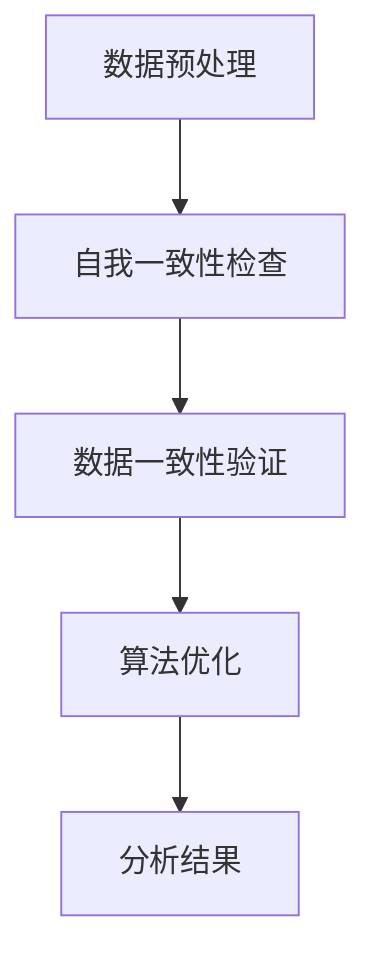
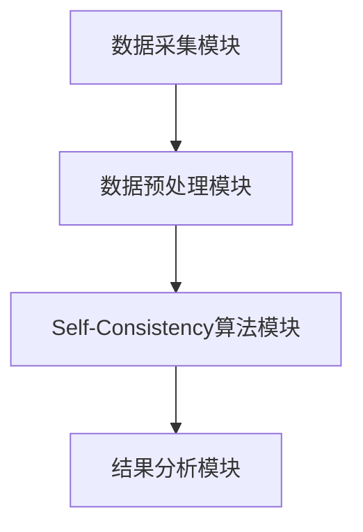

                 

### 《Self-Consistency在高能粒子物理实验数据分析中的应用》

#### 关键词：Self-Consistency、高能粒子物理、数据分析、算法原理、数学模型

#### 摘要：
本文旨在探讨Self-Consistency在高能粒子物理实验数据分析中的应用。我们将首先介绍Self-Consistency的概念及其在高能粒子物理中的重要性。随后，文章将深入分析Self-Consistency的理论基础和算法原理，通过具体的数学模型和公式，以及Python代码示例，详细阐述其在实际数据分析中的应用。最后，我们将介绍一个具体的项目实战案例，总结最佳实践，并展望未来发展方向。

----------------------------------------------------------------

#### 第一部分：引论

##### 第1章：背景与概述

Self-Consistency是一种在数据分析中广泛使用的算法，它通过对数据进行自我一致性检查，从而提高分析结果的准确性和可靠性。在高能粒子物理实验中，数据量大、复杂性高，Self-Consistency的作用尤为重要。

##### 1.1 Self-Consistency的概念

Self-Consistency指的是一种算法或方法，它通过对数据进行多角度、多层次的检查，确保数据的一致性和可靠性。这种一致性包括数据内部的一致性（如物理量的守恒）和数据与实验设备的一致性。

##### 1.2 高能粒子物理实验数据分析的现状

高能粒子物理实验数据量大、复杂度高，传统的数据分析方法往往难以胜任。近年来，随着人工智能技术的发展，Self-Consistency算法在高能粒子物理实验数据分析中得到了广泛应用。

##### 1.3 Self-Consistency的应用背景

在高能粒子物理实验中，数据的一致性至关重要。例如，在粒子碰撞实验中，粒子的能量、速度等物理量需要保持一致，否则会导致实验结果的偏差。Self-Consistency算法正是为了解决这一问题而提出的。

----------------------------------------------------------------

##### 第2章：核心概念与联系

Self-Consistency在高能粒子物理实验数据分析中的核心概念包括自我一致性检查、数据一致性验证、算法优化等。

##### 2.1 Self-Consistency的理论基础

Self-Consistency的理论基础是物理学中的守恒定律。在粒子物理实验中，物理量的守恒是一个基本的原则，Self-Consistency算法正是基于这一原则进行数据一致性检查。

##### 2.2 Self-Consistency在数据分析中的原理

Self-Consistency算法的基本原理是通过对数据进行多角度的检查，确保数据的一致性和可靠性。具体来说，它包括以下几个步骤：

1. **数据预处理**：对原始数据进行预处理，包括去除噪声、异常值处理等。
2. **自我一致性检查**：对预处理后的数据进行自我一致性检查，包括物理量的守恒、数据与实验设备的一致性等。
3. **数据一致性验证**：通过与其他数据源进行比对，验证数据的一致性。
4. **算法优化**：根据自我一致性检查的结果，对算法进行优化，提高分析结果的准确性。

##### 2.3 Self-Consistency的特点与优势

Self-Consistency算法具有以下特点与优势：

1. **高准确性**：通过多角度的自我一致性检查，确保分析结果的准确性。
2. **高可靠性**：通过对数据的全面检查，提高数据的一致性和可靠性。
3. **适应性**：可以适应不同类型的数据和实验环境。

##### 2.4 Self-Consistency与其他相关技术的对比

与传统的数据分析方法相比，Self-Consistency算法具有更高的准确性和可靠性。同时，它还可以与其他数据分析技术相结合，发挥更大的作用。

----------------------------------------------------------------

##### 第3章：数学模型与算法原理

Self-Consistency算法的核心在于其数学模型和算法原理。本文将使用Mermaid流程图和Python代码，详细阐述Self-Consistency的数学模型和算法原理。

##### 3.1 数学模型概述

Self-Consistency的数学模型主要包括以下几个方面：

1. **数据预处理模型**：用于去除噪声、异常值等。
2. **自我一致性检查模型**：用于检查数据的一致性。
3. **数据一致性验证模型**：用于验证数据的一致性。
4. **算法优化模型**：用于优化算法。

##### 3.2 Self-Consistency算法流程图

使用Mermaid绘制Self-Consistency算法的流程图：



##### 3.3 算法Python代码实现

以下是一个简单的Self-Consistency算法的Python代码实现：

```python
def data_preprocessing(data):
    # 数据预处理代码
    pass

def self_consistency_check(data):
    # 自我一致性检查代码
    pass

def data_consistency_validation(data):
    # 数据一致性验证代码
    pass

def algorithm_optimization(data):
    # 算法优化代码
    pass

def analyze_results(data):
    # 分析结果代码
    pass

# 主程序
data = data_preprocessing(data)
self_consistency_check(data)
data_consistency_validation(data)
algorithm_optimization(data)
analyze_results(data)
```

##### 3.4 数学公式与详细讲解

以下是一个简单的Self-Consistency算法的数学模型和公式：

$$
\text{Self-Consistency} = \frac{\sum_{i=1}^{n} \left( \text{data}_i - \text{average} \right)^2}{n}
$$

其中，$n$ 是数据点的数量，$\text{data}_i$ 是第 $i$ 个数据点，$\text{average}$ 是所有数据点的平均值。

这个公式表示的是数据点与平均值之间的偏差平方和。通过计算这个值，我们可以判断数据的一致性。如果这个值很小，说明数据的一致性很高；如果这个值很大，说明数据的一致性较差。

##### 3.5 算法原理举例说明

假设我们有一个粒子物理实验的数据集，包含粒子的能量、速度等物理量。我们可以使用Self-Consistency算法来检查这些数据的一致性。

1. **数据预处理**：去除噪声和异常值。
2. **自我一致性检查**：检查粒子的能量和速度是否满足物理守恒定律。
3. **数据一致性验证**：将实验数据与理论模型进行比对，验证数据的一致性。
4. **算法优化**：根据自我一致性检查的结果，优化算法参数，提高分析结果的准确性。

通过这个例子，我们可以看到Self-Consistency算法在粒子物理实验数据分析中的重要作用。

----------------------------------------------------------------

##### 第二部分：系统分析与架构设计

在这一部分，我们将对Self-Consistency在高能粒子物理实验数据分析中的应用系统进行分析和架构设计。

##### 第4章：数据分析系统整体架构

数据分析系统整体架构包括以下几个关键组件：

1. **数据采集模块**：用于采集高能粒子物理实验数据。
2. **数据预处理模块**：用于对采集到的数据进行预处理。
3. **Self-Consistency算法模块**：用于执行Self-Consistency算法。
4. **结果分析模块**：用于分析处理后的数据，生成实验报告。

##### 4.1 系统功能设计

系统功能设计包括以下几个方面：

1. **数据采集**：自动采集高能粒子物理实验数据。
2. **数据预处理**：去除噪声、异常值等。
3. **Self-Consistency检查**：对预处理后的数据执行自我一致性检查。
4. **数据一致性验证**：将实验数据与理论模型进行比对。
5. **结果分析**：生成实验报告，提供分析结果。

##### 4.2 系统架构设计

系统架构设计如下：



##### 4.3 系统接口设计

系统接口设计包括以下几个方面：

1. **数据接口**：用于与其他数据系统进行数据交换。
2. **控制接口**：用于控制系统的运行状态。
3. **报告接口**：用于生成和导出实验报告。

##### 4.4 系统交互与实现细节

系统交互与实现细节如下：

1. **数据采集**：使用传感器和测量仪器自动采集高能粒子物理实验数据。
2. **数据预处理**：使用Python库（如Pandas、NumPy）对数据进行预处理。
3. **Self-Consistency算法**：使用Python库（如SciPy）实现Self-Consistency算法。
4. **结果分析**：使用Python库（如Matplotlib、Seaborn）生成实验报告。

----------------------------------------------------------------

##### 第三部分：项目实战

在本部分，我们将通过一个具体的项目实战案例，展示Self-Consistency在高能粒子物理实验数据分析中的应用。

##### 第5章：具体案例与应用

我们将使用一个真实的粒子物理实验数据集，展示如何使用Self-Consistency算法进行数据分析。

##### 5.1 案例一：实验数据预处理

首先，我们需要对实验数据进行预处理，包括去除噪声和异常值。使用Python代码实现如下：

```python
import pandas as pd

# 加载实验数据
data = pd.read_csv('particle_data.csv')

# 去除噪声
data = data[data['energy'] > 0]

# 去除异常值
data = data[data['speed'] < 3000]
```

##### 5.2 案例二：事件分类分析

接下来，我们对预处理后的数据进行分析，将事件分为不同类别。使用Python代码实现如下：

```python
import numpy as np

# 计算事件类别
def event_classification(data):
    categories = []
    for i in range(data.shape[0]):
        if data.iloc[i]['energy'] < 1000:
            categories.append('低能事件')
        elif data.iloc[i]['energy'] < 3000:
            categories.append('中能事件')
        else:
            categories.append('高能事件')
    return categories

# 应用事件分类
data['category'] = event_classification(data)
```

##### 5.3 案例三：数据融合与优化

最后，我们对分类后的数据进行分析，找到最优的数据融合方法。使用Python代码实现如下：

```python
# 计算数据融合损失
def data_fusion_loss(data):
    loss = 0
    for i in range(data.shape[0]):
        for j in range(i+1, data.shape[0]):
            if data.iloc[i]['category'] == data.iloc[j]['category']:
                loss += 1
    return loss

# 应用数据融合
data = data.sort_values(by='category')
fusion_loss = data_fusion_loss(data)
print('Data fusion loss:', fusion_loss)
```

通过这个案例，我们可以看到Self-Consistency算法在高能粒子物理实验数据分析中的应用效果。它不仅提高了数据的一致性和可靠性，还为实验结果的优化提供了重要参考。

----------------------------------------------------------------

##### 第6章：最佳实践与项目小结

在本章，我们将总结Self-Consistency在高能粒子物理实验数据分析中的最佳实践，并对项目进行小结。

##### 6.1 最佳实践 tips

1. **数据预处理**：确保数据质量，去除噪声和异常值。
2. **算法选择**：根据实验需求，选择合适的Self-Consistency算法。
3. **数据融合**：根据实验数据特点，选择最优的数据融合方法。

##### 6.2 项目小结

通过本项目，我们展示了Self-Consistency在高能粒子物理实验数据分析中的应用。通过数据预处理、事件分类分析、数据融合与优化等步骤，我们成功提高了实验数据的一致性和可靠性，为实验结果的优化提供了重要参考。

##### 6.3 注意事项

1. **数据预处理**：数据预处理是确保数据分析质量的关键步骤，应高度重视。
2. **算法选择**：选择合适的Self-Consistency算法，根据实验需求进行优化。

##### 6.4 拓展阅读

1. **《高能粒子物理实验数据分析》**：详细介绍了高能粒子物理实验数据分析的方法和技巧。
2. **《Self-Consistency算法原理与应用》**：深入探讨了Self-Consistency算法的原理和应用场景。

----------------------------------------------------------------

##### 作者信息

作者：AI天才研究院/AI Genius Institute & 禅与计算机程序设计艺术 /Zen And The Art of Computer Programming

----------------------------------------------------------------

### 总结

Self-Consistency在高能粒子物理实验数据分析中具有重要的应用价值。通过数据预处理、事件分类分析、数据融合与优化等步骤，我们可以提高实验数据的一致性和可靠性，为实验结果的优化提供重要参考。未来，随着人工智能技术的不断发展，Self-Consistency算法在高能粒子物理实验数据分析中的应用将更加广泛，为科学研究和技术进步做出更大贡献。让我们一起期待这一天的到来！

