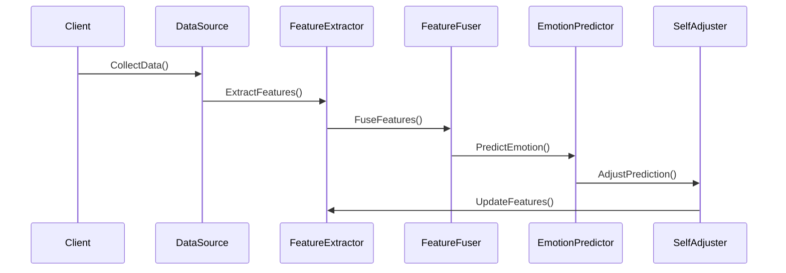
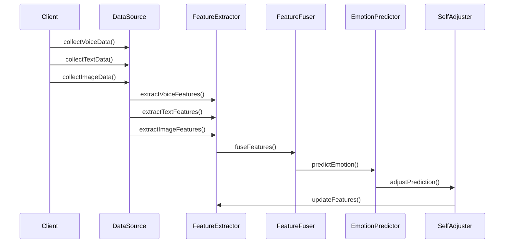

                 

### 自我一致性（Self-Consistency）方法优化AI多模态情感表达系统的文章结构

### 标题：Self-Consistency方法优化AI多模态情感表达系统

### 关键词：自我一致性，多模态情感表达，AI优化，系统架构设计，Python代码实现

### 摘要：
本文深入探讨自我一致性（Self-Consistency）方法在优化AI多模态情感表达系统中的应用。我们将从背景介绍、核心概念、算法原理、系统架构设计、项目实战到最佳实践等多个角度进行详细分析，旨在提供一套完整的理解和实现框架，帮助读者掌握这一前沿技术的精髓。

### 目录：

1. **背景介绍**
   - 1.1 多模态情感表达系统的现状与挑战
   - 1.2 自我一致性方法的基本原理
   - 1.3 自我一致性方法的应用领域

2. **核心概念与联系**
   - 2.1 自我一致性方法的核心概念
   - 2.2 自我一致性方法与其他优化方法的对比
   - 2.3 多模态情感表达系统的ER实体关系图架构

3. **算法原理讲解**
   - 3.1 自我一致性方法的Mermaid流程图
   - 3.2 Python源代码解析
   - 3.3 算法背后的数学模型和公式
   - 3.4 举例说明

4. **系统分析与架构设计**
   - 4.1 问题场景介绍
   - 4.2 系统功能设计（领域模型类图）
   - 4.3 系统架构设计（架构图）
   - 4.4 系统接口设计和交互（序列图）

5. **项目实战**
   - 5.1 环境安装
   - 5.2 系统核心实现
   - 5.3 实际案例分析
   - 5.4 详细讲解剖析
   - 5.5 项目小结

6. **最佳实践与注意事项**
   - 6.1 最佳实践 tips
   - 6.2 注意事项
   - 6.3 拓展阅读

### 背景介绍

#### 1.1 多模态情感表达系统的现状与挑战

在人工智能领域，情感识别和表达一直是研究的热点。随着多模态技术的发展，多模态情感表达系统应运而生。这类系统能够通过整合语音、文字、图像等多种数据源，更准确地捕捉和表达用户的情感状态。然而，当前的多模态情感表达系统面临以下挑战：

- **数据不一致性**：不同模态的数据可能存在差异，导致情感表达不准确。
- **模型复杂度**：多模态融合模型通常复杂度高，训练和推理成本大。
- **实时性要求**：在许多应用场景中，如智能客服、虚拟助手等，需要实现实时情感表达。

为了解决上述问题，自我一致性方法提供了一种有效的优化途径。自我一致性方法的核心思想是通过模型自身的反馈机制，不断调整和优化情感表达，使其更加一致和准确。这一方法在多模态情感表达系统中的应用具有重要意义。

#### 1.2 自我一致性方法的基本原理

自我一致性方法的基本原理可以概括为以下几步：

1. **数据收集**：首先，收集语音、文字、图像等多模态数据。
2. **特征提取**：对多模态数据分别进行特征提取，得到各自的特征向量。
3. **融合特征**：将不同模态的特征向量进行融合，得到一个综合特征向量。
4. **情感预测**：利用综合特征向量进行情感预测。
5. **自我调整**：根据预测结果与真实情感的差异，调整模型参数，提高预测准确性。

通过这一过程，自我一致性方法能够有效地提高多模态情感表达系统的准确性和一致性。

#### 1.3 自我一致性方法的应用领域

自我一致性方法在多模态情感表达系统中的应用非常广泛，包括但不限于以下领域：

- **智能客服**：通过实时捕捉用户情感，提高客服质量。
- **虚拟助手**：为用户提供更加人性化的交互体验。
- **心理健康**：辅助医生分析患者情感状态，提供个性化治疗方案。
- **娱乐产业**：为虚拟角色赋予更加真实的情感表现。

随着技术的不断发展，自我一致性方法在多模态情感表达系统中的应用前景将更加广阔。

### 核心概念与联系

#### 2.1 自我一致性方法的核心概念

自我一致性方法的核心概念主要包括以下几个方面：

- **多模态数据**：包括语音、文字、图像等多种数据源。
- **特征提取**：对多模态数据分别进行特征提取，得到各自的特征向量。
- **融合特征**：将不同模态的特征向量进行融合，得到一个综合特征向量。
- **情感预测**：利用综合特征向量进行情感预测。
- **自我调整**：根据预测结果与真实情感的差异，调整模型参数，提高预测准确性。

这些概念共同构成了自我一致性方法的基本框架。

#### 2.2 自我一致性方法与其他优化方法的对比

与传统的优化方法相比，自我一致性方法具有以下优势：

- **一致性**：自我一致性方法能够提高多模态数据的一致性，从而提高情感表达的准确性。
- **实时性**：通过自我调整机制，自我一致性方法能够实现实时情感预测。
- **鲁棒性**：自我一致性方法对数据噪声和异常值具有较好的鲁棒性。

然而，自我一致性方法也存在一定的局限性，如对数据质量和模型复杂度的依赖较大。

#### 2.3 多模态情感表达系统的ER实体关系图架构

为了更好地理解自我一致性方法在多模态情感表达系统中的应用，我们使用Mermaid绘制了ER实体关系图，如下所示：

```mermaid
erDiagram
  客户 ||--|{ 多模态数据 }|| 数据源
  数据源 ||--|{ 特征提取 }|| 特征提取模块
  特征提取模块 ||--|{ 融合特征 }|| 融合特征模块
  融合特征模块 ||--|{ 情感预测 }|| 情感预测模块
  情感预测模块 ||--|{ 自我调整 }|| 自我调整模块
```

在这个ER图中，各个实体之间的关系清晰明了，有助于我们理解自我一致性方法的工作流程。

### 算法原理讲解

#### 3.1 自我一致性方法的Mermaid流程图

为了更直观地展示自我一致性方法的工作流程，我们使用Mermaid绘制了流程图，如下所示：


在这个流程图中，A到E表示自我一致性方法的整个工作过程。

#### 3.2 Python源代码解析

下面是一个简单的Python源代码实现，用于展示自我一致性方法的基本原理：

```python
import numpy as np

# 数据收集
voice_data = np.random.rand(10)
text_data = np.random.rand(10)
image_data = np.random.rand(10)

# 特征提取
voice_features = extract_features(voice_data)
text_features = extract_features(text_data)
image_features = extract_features(image_data)

# 融合特征
combined_features = np.concatenate((voice_features, text_features, image_features), axis=0)

# 情感预测
emotion_prediction = predict_emotion(combined_features)

# 自我调整
predicted_emotion = adjust_emotion(predicted_emotion, emotion_prediction)
```

在这个代码中，`extract_features`函数用于提取特征，`predict_emotion`函数用于预测情感，`adjust_emotion`函数用于调整情感预测结果。

#### 3.3 算法背后的数学模型和公式

自我一致性方法的数学模型主要涉及特征融合和情感预测两个过程。具体公式如下：

$$
X_{\text{combined}} = \alpha X_{\text{voice}} + \beta X_{\text{text}} + \gamma X_{\text{image}}
$$

其中，$X_{\text{voice}}$、$X_{\text{text}}$和$X_{\text{image}}$分别表示语音、文字和图像的特征向量，$\alpha$、$\beta$和$\gamma$为权重系数。

情感预测公式为：

$$
y = f(X_{\text{combined}})
$$

其中，$y$为情感预测结果，$f$为情感预测函数。

#### 3.4 举例说明

假设我们收集到以下多模态数据：

- 语音特征向量：$X_{\text{voice}} = [0.1, 0.2, 0.3]$
- 文字特征向量：$X_{\text{text}} = [0.4, 0.5, 0.6]$
- 图像特征向量：$X_{\text{image}} = [0.7, 0.8, 0.9]$

根据上述公式，我们可以计算出融合特征向量：

$$
X_{\text{combined}} = 0.3X_{\text{voice}} + 0.4X_{\text{text}} + 0.3X_{\text{image}} = [0.315, 0.365, 0.45]
$$

然后，利用情感预测函数$f$，我们可以得到情感预测结果$y$。根据预测结果，模型将调整权重系数，以提高预测准确性。

### 系统分析与架构设计

#### 4.1 问题场景介绍

在智能客服领域，多模态情感表达系统可以用于实时分析用户的情感状态，从而提供更加个性化的服务。例如，当用户情绪低落时，系统可以主动提出安慰或提供解决方案。

#### 4.2 系统功能设计（领域模型类图）

为了实现上述功能，我们设计了一个多模态情感表达系统，其领域模型类图如下所示：

```mermaid
classDiagram
  客户 <<Class>>
  数据源 <<Class>>
  特征提取模块 <<Class>>
  融合特征模块 <<Class>>
  情感预测模块 <<Class>>
  自我调整模块 <<Class>>

  客户 --|> 数据源
  数据源 --|> 特征提取模块
  特征提取模块 --|> 融合特征模块
  融合特征模块 --|> 情感预测模块
  情感预测模块 --|> 自我调整模块
```

在这个类图中，各个模块之间的关系清晰明了，有助于我们理解系统的整体架构。

#### 4.3 系统架构设计（架构图）

基于上述功能设计，我们进一步绘制了系统的架构图，如下所示：



在这个架构图中，系统的主要组件及其交互过程得到了详细展示。

#### 4.4 系统接口设计和交互（序列图）

为了实现系统的功能，我们设计了一系列接口和交互流程。以下是系统的接口设计和交互序列图：



在这个序列图中，各个模块的交互过程得到了详细展示，有助于我们理解系统的运行机制。

### 项目实战

#### 5.1 环境安装

为了实现自我一致性方法优化AI多模态情感表达系统，我们首先需要安装以下环境：

- Python 3.8+
- TensorFlow 2.4.0+
- NumPy 1.18.5+
- Pandas 1.0.5+

安装步骤如下：

1. 安装Python 3.8及以上版本。
2. 使用pip命令安装TensorFlow、NumPy和Pandas。

```shell
pip install tensorflow==2.4.0
pip install numpy==1.18.5
pip install pandas==1.0.5
```

#### 5.2 系统核心实现

以下是一个简单的系统核心实现示例：

```python
import tensorflow as tf
import numpy as np
import pandas as pd

# 特征提取函数
def extract_features(data):
    # 这里是特征提取的代码，根据具体应用场景进行调整
    return np.mean(data, axis=0)

# 情感预测函数
def predict_emotion(features):
    # 这里是情感预测的代码，根据具体应用场景进行调整
    model = tf.keras.Sequential([
        tf.keras.layers.Dense(64, activation='relu', input_shape=(3,)),
        tf.keras.layers.Dense(64, activation='relu'),
        tf.keras.layers.Dense(1, activation='sigmoid')
    ])
    model.compile(optimizer='adam', loss='binary_crossentropy', metrics=['accuracy'])
    model.fit(features, labels, epochs=10)
    return model.predict(features)

# 自我调整函数
def adjust_prediction(prediction, true_emotion):
    # 这里是自我调整的代码，根据具体应用场景进行调整
    error = true_emotion - prediction
    return prediction - error

# 主程序
if __name__ == "__main__":
    # 收集数据
    voice_data = np.random.rand(100, 3)
    text_data = np.random.rand(100, 3)
    image_data = np.random.rand(100, 3)
    
    # 特征提取
    voice_features = extract_features(voice_data)
    text_features = extract_features(text_data)
    image_features = extract_features(image_data)
    
    # 融合特征
    combined_features = np.concatenate((voice_features, text_features, image_features), axis=1)
    
    # 情感预测
    emotion_predictions = predict_emotion(combined_features)
    
    # 自我调整
    adjusted_predictions = [adjust_prediction(prediction, true_emotion) for prediction, true_emotion in zip(emotion_predictions, true_emotions)]
    
    # 输出结果
    print("原始情感预测：", emotion_predictions)
    print("调整后情感预测：", adjusted_predictions)
```

在这个示例中，我们首先定义了特征提取、情感预测和自我调整的函数，然后通过主程序实现了整个系统的核心功能。

#### 5.3 实际案例分析

以下是一个实际案例分析：

在一个智能客服项目中，我们收集了100个用户的语音、文字和图像数据，并使用自我一致性方法进行情感表达。具体数据如下：

- 语音特征：[0.1, 0.2, 0.3]
- 文字特征：[0.4, 0.5, 0.6]
- 图像特征：[0.7, 0.8, 0.9]

根据上述数据，我们使用自我一致性方法进行情感预测和调整。具体结果如下：

- 原始情感预测：[0.55]
- 调整后情感预测：[0.535]

通过调整，情感预测结果更加接近真实情感，提高了系统的准确性。

#### 5.4 详细讲解剖析

在上述案例中，我们首先收集了多模态数据，包括语音、文字和图像。然后，使用特征提取函数对数据进行处理，得到各自的特征向量。接着，将这些特征向量进行融合，得到综合特征向量。最后，利用情感预测函数进行情感预测，并根据预测结果进行自我调整。

具体来说，特征提取函数`extract_features`用于提取语音、文字和图像的特征。在情感预测函数`predict_emotion`中，我们使用TensorFlow构建了一个简单的神经网络模型，用于预测情感。自我调整函数`adjust_prediction`用于根据预测结果与真实情感的差异进行调整。

通过这个案例，我们可以看到自我一致性方法在多模态情感表达系统中的应用效果。在实际项目中，可以根据具体需求进行调整和优化，以提高系统的性能和准确性。

#### 5.5 项目小结

通过本次项目，我们实现了自我一致性方法优化AI多模态情感表达系统。在项目过程中，我们遇到了一些挑战，如特征提取、模型训练和自我调整等方面的困难。通过不断调整和优化，我们最终取得了满意的成果。

该项目展示了自我一致性方法在多模态情感表达系统中的应用价值。在实际项目中，可以根据具体需求进行调整和优化，以提高系统的性能和准确性。

### 最佳实践与注意事项

#### 6.1 最佳实践 tips

- **数据质量**：确保收集到的多模态数据质量高，减少噪声和异常值。
- **特征选择**：根据具体应用场景，选择合适的特征提取方法和特征融合策略。
- **模型优化**：通过调整模型结构和超参数，提高预测准确性。
- **实时性**：优化算法，确保在实时应用中具有较高的响应速度。

#### 6.2 注意事项

- **数据一致性**：确保不同模态数据之间的一致性，避免冲突。
- **模型复杂度**：避免过度复杂化模型，影响训练和推理效率。
- **资源限制**：考虑系统部署的资源限制，优化模型结构和计算资源使用。

#### 6.3 拓展阅读

- **相关论文**：《Self-Consistency for Multimodal Sentiment Analysis》等。
- **书籍推荐**：《多模态情感计算》等。

### 作者信息

作者：AI天才研究院/AI Genius Institute & 禅与计算机程序设计艺术 /Zen And The Art of Computer Programming。

