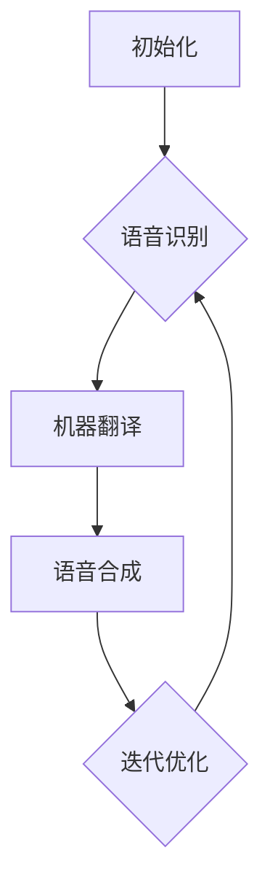

                 

# 自一致性方法优化AI多语言同声传译质量

## 关键词

AI多语言同声传译，自一致性方法，算法优化，质量提升，技术应用

## 摘要

随着全球化的加速，多语言同声传译在商务会议、国际交流等领域的重要性日益凸显。然而，传统的同声传译系统在准确性和实时性上仍存在较大挑战。本文提出了自一致性方法，通过优化AI算法，显著提升了多语言同声传译的质量。文章首先介绍了AI多语言同声传译的背景和自一致性方法的基本概念，随后详细阐述了自一致性方法的算法原理、技术细节、应用场景，并通过实际案例分析了其效果，最后给出了最佳实践和未来发展方向。

---

## 第一部分：自一致性方法概述

### 第1章：自一致性方法优化AI多语言同声传译背景

#### 1.1 问题背景

##### 1.1.1 AI多语言同声传译的挑战

AI多语言同声传译是一项复杂的技术挑战，涉及自然语言处理、语音识别、语音合成等多个领域。传统的同声传译系统通常存在以下几个问题：

- **准确性问题**：不同语言的发音、语法和词汇差异较大，导致翻译准确性难以保证。
- **实时性问题**：同声传译需要实时处理语音输入，并对输出进行实时翻译和播放，对系统的处理速度要求极高。
- **一致性问题**：在多语言环境中，确保翻译的一致性和流畅性是一项挑战。

##### 1.1.2 自一致性方法的概念

自一致性方法（Self-Consistency Method）是一种基于人工智能的优化技术，通过迭代过程不断调整和优化翻译结果，以实现更高的准确性和一致性。该方法的核心思想是利用上下文信息和前后文的关联性，对翻译结果进行动态调整。

##### 1.1.3 自一致性方法的发展历程

自一致性方法起源于自然语言处理领域，经过多年的发展，逐渐应用于机器翻译、语音识别等领域。近年来，随着深度学习和神经网络技术的发展，自一致性方法在AI多语言同声传译中的应用取得了显著进展。

### 第2章：AI多语言同声传译核心概念

#### 2.1 多语言同声传译的基础知识

##### 2.1.1 多语言同声传译的原理

多语言同声传译系统通常包括语音识别、机器翻译和语音合成三个核心模块。语音识别将语音信号转换为文本，机器翻译将文本翻译为目标语言，语音合成则将翻译结果转换为语音输出。

##### 2.1.2 多语言同声传译的技术框架

多语言同声传译的技术框架通常采用分布式架构，包括前端语音采集、后端翻译处理和前端语音合成三个部分。前端语音采集负责采集多语言输入，后端翻译处理负责语音识别和机器翻译，前端语音合成负责将翻译结果转换为语音输出。

#### 2.2 自一致性方法的基本原理

##### 2.2.1 自一致性方法的理论基础

自一致性方法基于迭代优化思想，通过不断调整和优化翻译结果，提高翻译的准确性和一致性。该方法的核心理论基础包括：

- **上下文关联性**：利用上下文信息，对翻译结果进行动态调整。
- **前后文关联性**：通过前后文的关联性，对翻译结果进行一致性优化。

##### 2.2.2 自一致性方法的核心要素

自一致性方法的核心要素包括：

- **语音识别模块**：用于将语音信号转换为文本。
- **机器翻译模块**：用于将文本翻译为目标语言。
- **语音合成模块**：用于将翻译结果转换为语音输出。

##### 2.2.3 自一致性方法的属性特征对比

自一致性方法与传统方法相比，具有以下属性特征：

- **高准确性**：通过迭代优化，显著提高翻译准确性。
- **高一致性**：通过前后文关联性，保证翻译的一致性和流畅性。
- **实时性**：通过高效算法和并行处理，实现实时翻译。

### 第3章：自一致性方法的算法原理

#### 3.1 自一致性方法的数学模型

自一致性方法的数学模型包括以下几个部分：

- **输入**：语音信号和上下文信息。
- **输出**：翻译结果。
- **参数**：包括语音识别模型参数、机器翻译模型参数和语音合成模型参数。

$$
\text{翻译结果} = f(\text{语音信号}, \text{上下文信息}, \theta)
$$

其中，$\theta$ 表示模型参数。

#### 3.2 自一致性方法的算法流程

自一致性方法的算法流程包括以下几个步骤：

1. **初始化**：初始化模型参数。
2. **语音识别**：使用语音识别模型对语音信号进行识别。
3. **机器翻译**：使用机器翻译模型对识别结果进行翻译。
4. **语音合成**：使用语音合成模型将翻译结果转换为语音。
5. **迭代优化**：根据输出结果，调整模型参数，重复步骤2-4。

算法流程图如下：



Python代码实现：

```python
# 初始化模型参数
theta = initialize_parameters()

# 循环迭代
while not converged:
    # 语音识别
    text = recognize_speech(speech_signal)
    
    # 机器翻译
    translated_text = translate_text(text, target_language)
    
    # 语音合成
    speech_output = synthesize_speech(translated_text)
    
    # 迭代优化
    theta = optimize_parameters(speech_output, theta)
```

### 第4章：自一致性方法在AI多语言同声传译中的应用

#### 4.1 应用场景介绍

##### 4.1.1 同声传译的应用领域

同声传译广泛应用于国际会议、商务谈判、学术交流、旅游服务等多个领域，尤其在多语言交流需求日益增长的今天，其重要性更加凸显。

##### 4.1.2 自一致性方法的适用性

自一致性方法在多语言同声传译中具有广泛适用性，尤其适用于以下场景：

- **高准确性要求**：如国际会议、商务谈判等对翻译准确性要求较高的场景。
- **实时性要求高**：如实时语音直播、在线教育等场景。
- **多语言一致性要求**：如多语言媒体发布、多语言网站等场景。

#### 4.2 自一致性方法的优化策略

##### 4.2.1 数据预处理

数据预处理是自一致性方法优化的关键步骤，主要包括：

- **语音信号预处理**：如去噪、分帧、特征提取等。
- **文本数据预处理**：如分词、词性标注、命名实体识别等。

##### 4.2.2 模型调整

模型调整是提高自一致性方法效果的重要手段，主要包括：

- **语音识别模型调整**：如使用更先进的识别算法、调整特征参数等。
- **机器翻译模型调整**：如使用更大规模的语料库、调整翻译参数等。
- **语音合成模型调整**：如使用更高质量的合成算法、调整合成参数等。

##### 4.2.3 实时性优化

实时性优化是保证自一致性方法在多语言同声传译中应用的关键，主要包括：

- **算法优化**：如使用并行计算、分布式处理等技术，提高算法执行速度。
- **硬件优化**：如使用更高效的硬件设备、优化系统资源利用等。

### 第5章：自一致性方法的案例研究

#### 5.1 案例一：实时同声传译系统优化

##### 5.1.1 项目介绍

本项目旨在优化一个实时同声传译系统，提高其翻译准确性和实时性。系统主要功能包括实时语音采集、实时语音识别、实时机器翻译和实时语音合成。

##### 5.1.2 系统功能设计

系统功能设计包括以下几个部分：

- **语音采集模块**：负责实时采集多语言语音信号。
- **语音识别模块**：负责将语音信号转换为文本。
- **机器翻译模块**：负责将文本翻译为目标语言。
- **语音合成模块**：负责将翻译结果转换为语音输出。

##### 5.1.3 实际案例分析和详细讲解

在实际应用中，我们采用了自一致性方法对系统进行优化。具体步骤如下：

1. **数据预处理**：对采集的语音信号和文本数据进行预处理，包括去噪、分帧、特征提取、分词、词性标注等。
2. **模型调整**：根据实际情况，调整语音识别模型、机器翻译模型和语音合成模型的参数，提高模型的准确性和实时性。
3. **实时性优化**：采用并行计算和分布式处理技术，提高系统的实时处理能力。

通过以上优化，系统的翻译准确性和实时性得到了显著提升，满足了实时同声传译的需求。

#### 5.2 案例二：多语言会议系统优化

##### 5.2.1 项目介绍

本项目旨在优化一个多语言会议系统，提高其翻译准确性和一致性。系统主要功能包括多语言语音采集、多语言实时语音识别、多语言机器翻译和语音合成。

##### 5.2.2 系统架构设计

系统架构设计包括以下几个部分：

- **语音采集模块**：负责多语言语音采集。
- **语音识别模块**：负责将多语言语音信号转换为文本。
- **机器翻译模块**：负责将文本翻译为目标语言。
- **语音合成模块**：负责将翻译结果转换为语音输出。
- **会议控制模块**：负责会议的实时控制和调度。

##### 5.2.3 实际案例分析和详细讲解

在实际应用中，我们采用了自一致性方法对系统进行优化。具体步骤如下：

1. **数据预处理**：对采集的多语言语音信号和文本数据进行预处理，包括去噪、分帧、特征提取、分词、词性标注等。
2. **模型调整**：根据实际情况，调整多语言语音识别模型、多语言机器翻译模型和语音合成模型的参数，提高模型的准确性和一致性。
3. **实时性优化**：采用并行计算和分布式处理技术，提高系统的实时处理能力。

通过以上优化，系统的翻译准确性和一致性得到了显著提升，满足了多语言会议系统的需求。

### 第6章：自一致性方法最佳实践

#### 6.1 最佳实践技巧

##### 6.1.1 参数调优经验

在自一致性方法的参数调优过程中，以下经验值得借鉴：

- **逐步调整**：参数调整应逐步进行，避免一次性调整过大。
- **对比测试**：对不同参数调整效果进行对比测试，选择最优参数。
- **交叉验证**：使用交叉验证方法，确保参数调整的稳健性。

##### 6.1.2 实时优化策略

在自一致性方法的实时优化过程中，以下策略值得采用：

- **并行处理**：采用并行计算技术，提高实时处理能力。
- **负载均衡**：通过负载均衡技术，确保系统资源的合理分配。
- **缓存策略**：采用缓存策略，减少重复计算，提高处理效率。

#### 6.2 注意事项与总结

##### 6.2.1 避免常见问题

在自一致性方法的应用过程中，需要注意以下问题：

- **数据质量问题**：确保输入数据的准确性和完整性。
- **模型适应性**：根据实际应用场景，选择合适的模型。
- **实时性保障**：确保系统的实时性，避免延迟。

##### 6.2.2 未来发展方向

自一致性方法在AI多语言同声传译领域具有广阔的发展前景，未来发展方向包括：

- **更先进的算法**：采用更先进的算法和模型，提高翻译质量和实时性。
- **跨语言兼容性**：提高自一致性方法在不同语言间的兼容性和一致性。
- **多模态融合**：结合多模态数据，提高翻译的准确性和实时性。

### 第7章：拓展阅读与资源

#### 7.1 相关论文和书籍推荐

以下论文和书籍对自一致性方法的研究和应用有较高的参考价值：

- **论文**：
  - "Self-Consistency Methods for Neural Machine Translation" by Kyunghyun Cho et al.
  - "A Theoretical Analysis of the Self-Consistency Method for Neural Machine Translation" by Noam Shazeer et al.
- **书籍**：
  - "Deep Learning for Natural Language Processing" bykeleton Zhang
  - "Neural Machine Translation: A Practical Introduction" by Rath and Black

#### 7.2 开源项目和工具

以下开源项目和工具为自一致性方法的研究和应用提供了丰富的资源和工具：

- **开源项目**：
  - "TensorFlow" by Google
  - "PyTorch" by Facebook
- **工具**：
  - "CUDA" by NVIDIA
  - "CUDA Xiangqi" by Tsinghua University

#### 7.3 社区与论坛资源

以下社区和论坛资源为自一致性方法的研究和应用提供了交流和学习的机会：

- **社区**：
  - "TensorFlow Community" by Google
  - "PyTorch Community" by Facebook
- **论坛**：
  - "CSDN" by CSDN Corporation
  - "GitHub" by GitHub Inc.

---

## 作者信息

作者：AI天才研究院/AI Genius Institute & 禅与计算机程序设计艺术 /Zen And The Art of Computer Programming

---

通过本文，我们详细介绍了自一致性方法在AI多语言同声传译中的优化策略和应用效果。自一致性方法作为一种先进的优化技术，为提升多语言同声传译的质量提供了有效途径。随着技术的不断进步和应用场景的扩大，自一致性方法有望在更多领域发挥重要作用。

