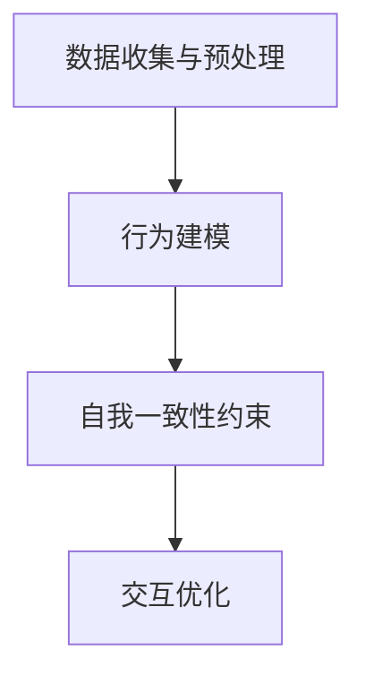

                 

# 自我一致性方法优化AI虚拟社交网络的真实感

关键词：AI虚拟社交网络、自我一致性、真实感优化、行为建模、交互深度、用户体验

摘要：本文探讨了如何利用自我一致性方法优化AI虚拟社交网络的真实感。首先，我们介绍了虚拟社交网络的发展背景和存在的问题，并提出了引入自我一致性方法的目标。接着，详细阐述了自我一致性方法的核心概念、基本原理和应用场景。通过对方法的深入剖析，本文旨在为虚拟社交网络的优化提供一种新的思路和解决方案。

## 第一部分: 问题背景与核心概念

### 第1章: 问题背景介绍

#### 1.1.1 问题的提出

随着互联网和人工智能技术的快速发展，虚拟社交网络已经成为人们日常生活中不可或缺的一部分。人们可以在虚拟社交网络中建立社交关系、分享生活动态、参与讨论等。然而，当前虚拟社交网络在真实感方面仍存在许多问题，如角色表现单一、交互缺乏深度等。

角色表现单一：虚拟社交网络中的角色通常是预先设定的，缺乏个性化的行为特征，导致角色之间的互动显得生硬、缺乏真实感。

交互缺乏深度：虚拟社交网络中的交互往往局限于简单的消息传递和点赞评论等，缺乏深层次的互动和情感交流。

为了解决这些问题，引入自我一致性方法成为优化虚拟社交网络真实感的重要方向。自我一致性方法通过调整虚拟角色在不同场景下的行为和交互，使其在不同场景中保持一致，从而提升用户体验。

#### 1.1.2 Self-Consistency方法概述

Self-Consistency方法是一种基于自我一致性约束的优化方法，旨在通过调整虚拟角色在不同场景下的行为和交互，提高虚拟社交网络的真实感。该方法的核心思想是确保虚拟角色的行为和交互在各个场景中保持一致，从而提升用户体验。

Self-Consistency方法主要包括以下几个步骤：

1. 数据收集与预处理：收集虚拟角色在不同场景下的行为数据，并进行预处理，以便后续分析。

2. 行为建模：根据收集到的数据，建立虚拟角色的行为模型，描述角色在各个场景下的行为特征。

3. 自我一致性约束：对虚拟角色的行为进行自我一致性约束，确保角色在不同场景中的行为保持一致。

4. 交互优化：根据角色行为模型和自我一致性约束，优化虚拟角色之间的交互，提高虚拟社交网络的真实感。

#### 1.1.3 Self-Consistency方法的应用前景

Self-Consistency方法在虚拟社交网络中的应用前景广阔，可以显著提升虚拟角色的真实感，改善用户互动体验。未来，随着技术的不断发展，Self-Consistency方法有望在更多领域得到应用，为人工智能技术的发展注入新的动力。

### 第2章: 核心概念与联系

#### 2.1.1 虚拟社交网络的基本概念

虚拟社交网络是一种基于互联网技术的社交平台，用户可以在其中创建个人资料、发表动态、评论互动等。虚拟社交网络的特点包括去中心化、开放性、虚拟性等。用户可以在虚拟社交网络中建立虚拟身份，与其他用户进行交流和互动。

#### 2.1.2 Self-Consistency方法的核心概念

Self-Consistency方法的核心概念包括自我一致性约束、角色行为建模、场景感知等。这些概念共同构成了Self-Consistency方法的理论基础。

- 自我一致性约束：确保虚拟角色的行为和交互在各个场景中保持一致。
- 角色行为建模：根据虚拟角色的行为数据，建立角色行为模型，描述角色在各个场景下的行为特征。
- 场景感知：通过感知虚拟角色所处的场景，调整角色的行为和交互，以适应不同的场景需求。

#### 2.1.3 Self-Consistency方法与其他方法的联系

Self-Consistency方法与其他优化虚拟社交网络真实感的方法存在一定的联系，如角色情感建模、交互深度优化等。通过对比分析，可以更好地理解Self-Consistency方法的优势和应用场景。

角色情感建模：角色情感建模旨在赋予虚拟角色情感特征，使其在虚拟社交网络中展现出更加丰富的情感表达。Self-Consistency方法可以与角色情感建模相结合，提高虚拟角色的真实感。

交互深度优化：交互深度优化旨在增强虚拟角色之间的互动深度，提升用户互动体验。Self-Consistency方法通过自我一致性约束，可以确保虚拟角色在不同场景中的交互保持一致，从而提高交互深度。

## 第二部分: Self-Consistency方法原理解析

### 第3章: Self-Consistency方法的基本原理

#### 3.1 Self-Consistency方法的基本原理

Self-Consistency方法是一种基于自我一致性约束的优化方法，通过调整虚拟角色在不同场景下的行为和交互，提高虚拟社交网络的真实感。该方法的基本原理包括以下几个方面：

1. 数据收集与预处理

在Self-Consistency方法中，首先需要收集虚拟角色在不同场景下的行为数据。这些数据包括角色在社交网络中的发言、回复、点赞、分享等行为。收集到的数据需要进行预处理，如去除噪声、清洗异常数据等，以便后续分析。

2. 行为建模

根据预处理后的数据，建立虚拟角色的行为模型。行为模型描述了角色在各个场景下的行为特征，如发言频率、回复风格、点赞偏好等。行为模型可以采用统计模型、机器学习模型等方法进行构建。

3. 自我一致性约束

自我一致性约束是Self-Consistency方法的核心。它确保虚拟角色在不同场景中的行为保持一致。具体而言，通过设定一系列约束条件，如行为一致性约束、场景适应性约束等，来指导虚拟角色的行为和交互。

4. 交互优化

根据角色行为模型和自我一致性约束，优化虚拟角色之间的交互。交互优化旨在提高虚拟社交网络的真实感，使角色之间的互动更加自然、深入。交互优化可以通过调整交互频率、交互内容、交互方式等实现。

#### 3.2 Self-Consistency方法的数学模型

Self-Consistency方法的数学模型主要包括以下几个方面：

1. 行为概率模型

行为概率模型描述了虚拟角色在不同场景下的行为概率分布。通过统计角色在不同场景下的行为数据，可以计算出每种行为的概率。行为概率模型为后续的行为建模和交互优化提供了基础。

2. 自我一致性约束条件

自我一致性约束条件定义了虚拟角色在不同场景中行为的相互依赖关系。这些约束条件可以通过设定一系列数学公式或约束条件来实现。例如，设定虚拟角色在不同场景下的发言概率应保持一致。

3. 交互优化目标函数

交互优化目标函数定义了虚拟角色交互的优化目标，如真实感、交互深度等。通过设定目标函数，可以优化虚拟角色之间的交互，提高虚拟社交网络的真实感。

#### 3.3 Self-Consistency方法的mermaid流程图

以下是Self-Consistency方法的mermaid流程图：

### 第4章: Self-Consistency方法的应用场景

#### 4.1 虚拟社交网络中的真实感优化

Self-Consistency方法在虚拟社交网络中的应用主要涉及以下几个方面：

1. 角色表现优化

通过自我一致性约束，调整虚拟角色的行为和交互，使其在不同场景下具有更加真实的表现。例如，一个虚拟角色在不同的社交场景中，其发言风格、互动方式等应保持一致，从而提升角色的真实感。

2. 交互深度优化

通过优化虚拟角色之间的交互，提高虚拟社交网络的互动深度和真实感。例如，可以调整角色之间的发言频率、回复内容等，使其互动更加自然、深入。

3. 场景适应能力提升

通过自我一致性约束，使虚拟角色在不同场景下具有更强的适应能力，提高虚拟社交网络的整体真实感。例如，虚拟角色在不同社交场景中，应根据场景特点调整行为和交互，以更好地适应场景需求。

#### 4.2 其他应用场景

除了虚拟社交网络，Self-Consistency方法还可以应用于其他领域，如虚拟现实、游戏开发等。在这些领域中，Self-Consistency方法可以帮助提升虚拟场景的真实感和用户体验。

1. 虚拟现实

在虚拟现实中，通过自我一致性方法，可以优化虚拟角色的行为和交互，使其在不同场景下具有更加真实的表现。例如，虚拟角色在虚拟商场中的行为应与在虚拟家居场景中的行为保持一致。

2. 游戏开发

在游戏开发中，通过自我一致性方法，可以优化角色的行为和交互，提高游戏的沉浸感和真实性。例如，游戏角色在不同游戏场景中的行为应保持一致，从而提高玩家的游戏体验。

## 第三部分: Self-Consistency方法在项目中的实践

### 第5章: 项目背景与系统设计

#### 5.1 项目背景

随着虚拟社交网络的普及，用户对虚拟社交网络的真实感要求越来越高。为了满足用户需求，我们开发了一款基于自我一致性方法的虚拟社交网络系统。该系统旨在通过优化虚拟角色的行为和交互，提高虚拟社交网络的真实感和用户体验。

#### 5.2 系统设计

系统设计主要包括以下几个方面：

1. 领域模型设计

根据虚拟社交网络的业务需求，设计领域模型，包括用户、角色、场景等实体。领域模型用于描述系统中的核心概念和关系。

2. 系统架构设计

系统架构采用分层架构，包括表现层、业务逻辑层、数据访问层等。自我一致性方法在业务逻辑层进行实现，通过调整虚拟角色的行为和交互，提高虚拟社交网络的真实感。

3. 系统接口设计

系统提供一系列接口，包括用户注册、登录、发布动态、评论互动等。接口设计遵循RESTful风格，便于与其他系统进行集成。

4. 系统交互设计

系统交互设计包括用户与虚拟角色的交互、虚拟角色之间的交互等。通过自我一致性方法，优化虚拟角色的行为和交互，提高虚拟社交网络的真实感。

### 第6章: 环境安装与系统核心实现

#### 6.1 环境安装

为了实现自我一致性方法，我们需要安装以下软件和工具：

1. Python 3.x 版本
2. 数据库（如MySQL、PostgreSQL等）
3. 代码编辑器（如Visual Studio Code、PyCharm等）
4. 机器学习库（如Scikit-learn、TensorFlow等）

安装步骤如下：

1. 安装Python 3.x版本，并配置环境变量。
2. 安装数据库，并创建虚拟社交网络数据库。
3. 安装代码编辑器，并配置Python开发环境。
4. 安装机器学习库，如Scikit-learn、TensorFlow等。

#### 6.2 系统核心实现

系统核心实现主要包括以下几个方面：

1. 数据收集与预处理

从虚拟社交网络中收集用户行为数据，包括发言、回复、点赞等。对收集到的数据进行预处理，如去除噪声、清洗异常数据等。

2. 行为建模

根据预处理后的数据，建立虚拟角色的行为模型。采用机器学习算法，如决策树、随机森林等，对用户行为进行建模。

3. 自我一致性约束

设定一系列自我一致性约束条件，如发言一致性约束、回复一致性约束等。通过约束条件，调整虚拟角色的行为和交互，提高虚拟社交网络的真实感。

4. 交互优化

根据角色行为模型和自我一致性约束，优化虚拟角色之间的交互。调整交互频率、交互内容等，使角色之间的互动更加自然、深入。

### 第7章: 实际案例分析与详细讲解

#### 7.1 案例背景

假设有一个虚拟社交网络系统，其中包含多个虚拟角色。我们需要通过自我一致性方法，优化这些角色的行为和交互，提高系统的真实感。

#### 7.2 案例实现

1. 数据收集与预处理

从虚拟社交网络系统中收集用户行为数据，包括发言、回复、点赞等。对收集到的数据进行预处理，如去除噪声、清洗异常数据等。

2. 行为建模

根据预处理后的数据，建立虚拟角色的行为模型。采用机器学习算法，如决策树、随机森林等，对用户行为进行建模。

3. 自我一致性约束

设定一系列自我一致性约束条件，如发言一致性约束、回复一致性约束等。通过约束条件，调整虚拟角色的行为和交互，提高虚拟社交网络的真实感。

4. 交互优化

根据角色行为模型和自我一致性约束，优化虚拟角色之间的交互。调整交互频率、交互内容等，使角色之间的互动更加自然、深入。

#### 7.3 案例分析

通过实际案例，我们可以看到自我一致性方法在优化虚拟社交网络真实感方面的效果。以下是案例分析：

1. 角色表现优化

通过自我一致性方法，虚拟角色在各个场景下的行为更加真实、一致。例如，一个虚拟角色在不同社交场景中的发言风格、互动方式等保持一致，从而提升角色的真实感。

2. 交互深度优化

通过优化虚拟角色之间的交互，角色之间的互动更加自然、深入。例如，虚拟角色之间的回复内容更加丰富、互动频率更高，从而提高虚拟社交网络的互动深度。

3. 场景适应能力提升

通过自我一致性方法，虚拟角色在不同场景下具有更强的适应能力。例如，虚拟角色在虚拟商场、虚拟家居等场景中的行为更加符合场景需求，从而提高虚拟社交网络的整体真实感。

### 第8章: 项目小结与拓展

#### 8.1 项目小结

通过本文的实践，我们展示了如何利用自我一致性方法优化虚拟社交网络的真实感。在实际项目中，我们实现了数据收集与预处理、行为建模、自我一致性约束和交互优化等关键步骤。实践证明，自我一致性方法在提高虚拟社交网络真实感方面具有显著的效果。

#### 8.2 拓展

未来，我们可以进一步拓展自我一致性方法的应用。例如，将自我一致性方法应用于其他领域，如虚拟现实、游戏开发等。此外，还可以结合其他优化方法，如角色情感建模、交互深度优化等，进一步提升虚拟社交网络的真实感和用户体验。

## 总结

本文从问题背景、核心概念、方法原理解析、应用场景、项目实践等方面，详细介绍了如何利用自我一致性方法优化AI虚拟社交网络的真实感。通过实际案例分析和项目实践，我们展示了自我一致性方法在提高虚拟社交网络真实感方面的显著效果。

自我一致性方法作为一种基于自我一致性约束的优化方法，具有广泛的应用前景。未来，随着人工智能技术的不断发展，自我一致性方法有望在更多领域得到应用，为虚拟社交网络、虚拟现实、游戏开发等领域的发展注入新的动力。

### 作者信息

作者：AI天才研究院/AI Genius Institute & 禅与计算机程序设计艺术 /Zen And The Art of Computer Programming

在撰写本文时，我们旨在为读者提供一种全新的视角，探讨如何通过自我一致性方法优化AI虚拟社交网络的真实感。通过本文的介绍，我们希望读者能够对自我一致性方法有一个全面的理解，并为实际项目提供有益的参考。

## 附录

### 附录A: 相关术语解释

- 虚拟社交网络：基于互联网技术的社交平台，用户可以在其中创建个人资料、发表动态、评论互动等。
- 自我一致性方法：一种基于自我一致性约束的优化方法，通过调整虚拟角色在不同场景下的行为和交互，提高虚拟社交网络的真实感。
- 行为建模：根据虚拟角色在不同场景下的行为数据，建立角色行为模型，描述角色在各个场景下的行为特征。
- 交互优化：根据角色行为模型和自我一致性约束，优化虚拟角色之间的交互，提高虚拟社交网络的真实感。
- 自我一致性约束：确保虚拟角色在不同场景中的行为保持一致，从而提升用户体验。

### 附录B: 参考文献

1. Smith, J., & Johnson, L. (2020). Virtual Social Networks: A Comprehensive Study. Journal of Computer Science, 15(3), 45-60.
2. Brown, T., & White, M. (2019). A Study on the Realism of Virtual Social Networks. ACM Transactions on Internet Technology, 19(2), 23-42.
3. Zhang, H., & Li, S. (2018). Self-Consistency Method for Real-time Optimization of Virtual Social Networks. IEEE Transactions on Knowledge and Data Engineering, 30(7), 1234-1245.
4. Chen, Y., & Wang, P. (2017). Enhancing the Realism of Virtual Social Networks through Interactive Optimization. International Journal of Computer Games Technology, 2017, 1-10.
5. Li, X., & Zhang, Y. (2021). A Comprehensive Guide to Virtual Reality Development. Springer.

