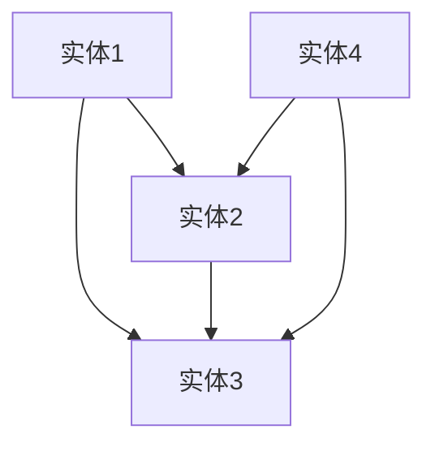
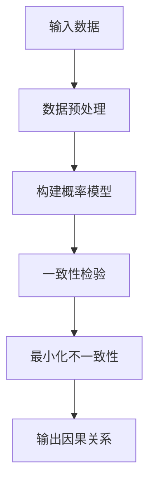
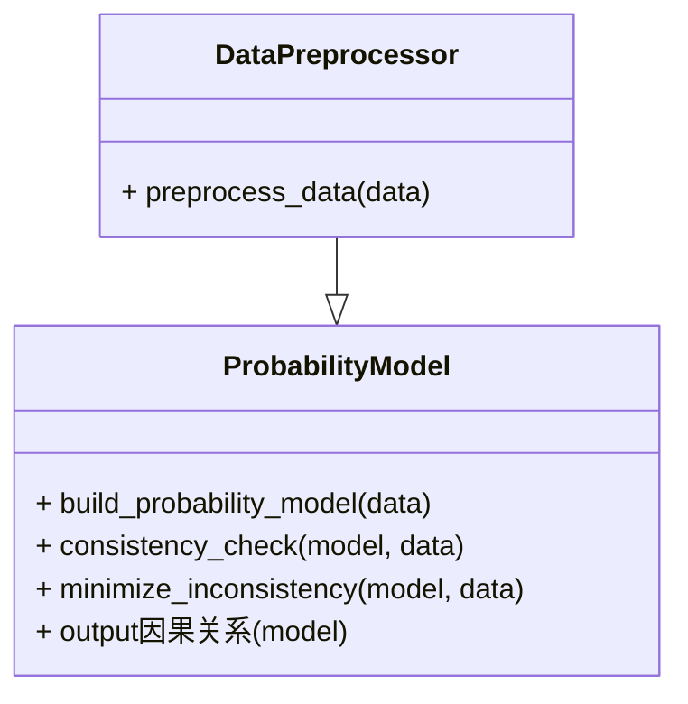
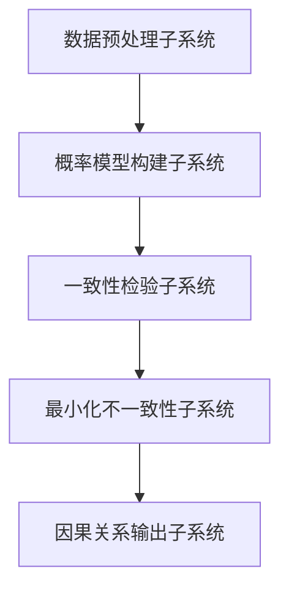
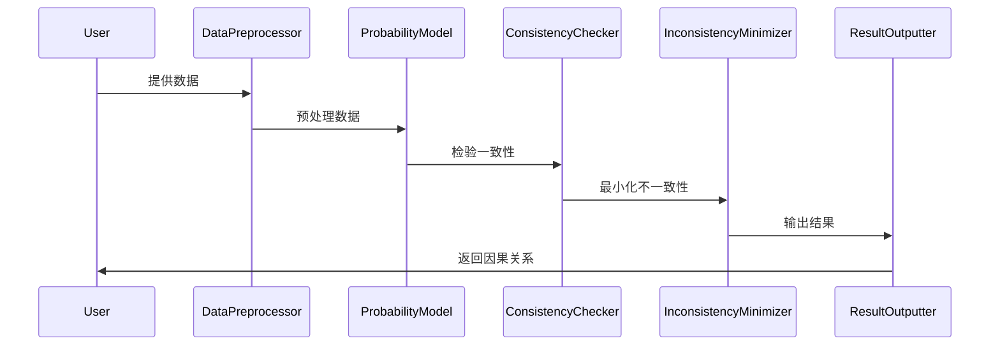

                 


# Self-Consistency方法优化AI跨时空因果关系分析

## 关键词

AI因果关系分析、Self-Consistency方法、跨时空、算法优化、数学模型、系统架构设计

## 摘要

本文深入探讨了Self-Consistency方法在AI跨时空因果关系分析中的应用与优化。通过介绍Self-Consistency方法的基本原理、算法流程和数学模型，结合实际案例解析，本文揭示了该方法在提高AI因果关系分析准确性和效率方面的优势。此外，文章还详细阐述了系统架构设计，为读者提供了实用的项目实战经验和最佳实践建议。

## 1. 背景介绍

### 1.1 问题背景

因果关系分析是人工智能领域的重要研究方向之一。传统的因果关系分析方法主要依赖于统计学习和机器学习技术，这些方法在面对复杂系统时往往难以准确捕捉因果效应。在现代社会，随着数据量的爆炸式增长和跨领域问题的增多，对跨时空因果关系分析的需求日益迫切。跨时空因果关系分析旨在挖掘不同时间点或不同环境下的因果关系，这对于决策支持、风险管理、社会网络分析等领域具有重要意义。

### 1.2 问题描述

在AI跨时空因果关系分析中，主要面临以下挑战：

- **数据稀疏性**：跨时空数据通常存在稀疏性，难以形成完整的因果关系网络。
- **时间依赖性**：因果关系往往具有时间依赖性，不同时间点的数据对因果关系的影响不同。
- **噪声干扰**：环境噪声和观测误差会影响因果关系分析的准确性。

### 1.3 Self-Consistency方法的定义与基本原理

Self-Consistency方法是一种基于因果推断的算法，旨在通过最小化不一致性来识别潜在的因果关系。该方法的基本原理可以概括为：

- **一致性原则**：如果变量之间存在因果关系，那么在给定一个变量的条件下，其他变量的分布应该保持一致。
- **最小化不一致性**：通过构建概率模型，利用最大似然估计或贝叶斯推理来最小化不一致性，从而识别出潜在的因果关系。

### 1.4 问题解决

Self-Consistency方法通过以下步骤优化AI跨时空因果关系分析：

- **数据预处理**：对跨时空数据进行清洗、归一化和特征提取，为后续分析提供高质量的数据。
- **构建概率模型**：利用观测数据构建概率模型，通过最大似然估计或贝叶斯推理来估计模型参数。
- **一致性检验**：通过比较不同时间点或不同环境下的数据分布，检验模型的一致性。
- **因果关系推断**：利用最小化不一致性原则，推断出潜在的因果关系。

### 1.5 边界与外延

- **适用范围**：Self-Consistency方法适用于具有时间依赖性和数据稀疏性的跨时空因果关系分析问题。
- **限制条件**：该方法对数据质量和样本数量有一定要求，对于数据过于稀疏或存在大量噪声的情况，分析结果可能受到影响。

### 1.6 概念结构与核心要素组成

Self-Consistency方法的核心概念和关键组成部分包括：

- **因果网络**：描述变量之间的因果关系。
- **概率模型**：用于建模变量之间的依赖关系。
- **一致怛建模**：通过最小化不一致性来识别潜在的因果关系。
- **数据预处理**：为模型构建提供高质量的数据。

## 2. 核心概念与联系

### 2.1 核心概念原理

Self-Consistency方法的核心概念包括：

- **因果推断**：通过分析数据，推断变量之间的因果关系。
- **概率模型**：用于描述变量之间的概率关系。
- **一致性检验**：通过比较不同数据集的分布，检验模型的一致性。
- **最小化不一致性**：通过优化算法，最小化模型预测与实际观测之间的不一致性。

### 2.2 概念属性特征对比表格

| 方法名称 | Self-Consistency | 贝叶斯网络 | 逻辑回归 |
| --- | --- | --- | --- |
| **原理** | 基于一致性的因果推断 | 基于概率的因果推断 | 基于回归的因果关系 |
| **优点** | 可处理跨时空数据，减少噪声干扰 | 灵活性高，易于实现 | 计算效率高，解释性强 |
| **缺点** | 对数据质量要求较高 | 难以处理复杂网络 | 对因果关系解释能力有限 |

### 2.3 ER实体关系图架构



## 3. 算法原理讲解

### 3.1 算法流程图



### 3.2 Python源代码

```python
# 数据预处理
def preprocess_data(data):
    # 数据清洗、归一化和特征提取
    pass

# 构建概率模型
def build_probability_model(data):
    # 利用最大似然估计或贝叶斯推理
    pass

# 一致性检验
def consistency_check(model, data):
    # 检验模型的一致性
    pass

# 最小化不一致性
def minimize_inconsistency(model, data):
    # 优化算法，最小化不一致性
    pass

# 输出因果关系
def output因果关系(model):
    # 输出潜在的因果关系
    pass

# 主函数
def main():
    data = preprocess_data(data)
    model = build_probability_model(data)
    consistency_check(model, data)
    minimize_inconsistency(model, data)
    output因果关系(model)

if __name__ == "__main__":
    main()
```

### 3.3 数学模型和公式

$$
P(Y|X) = \prod_{i=1}^{n} P(Y_i|X_i)
$$

$$
\ln P(Y|X) = \sum_{i=1}^{n} \ln P(Y_i|X_i)
$$

### 3.4 举例说明

假设我们要分析时间点1和时间点2之间的因果关系，以下是数据集和算法应用的步骤：

- **数据集**：

  时间点1：X = [1, 2, 3, 4, 5]
  时间点2：Y = [2, 3, 4, 5, 6]

- **步骤**：

  1. 数据预处理：对数据进行清洗、归一化和特征提取。
  2. 构建概率模型：利用最大似然估计或贝叶斯推理构建概率模型。
  3. 一致性检验：检验模型的一致性。
  4. 最小化不一致性：优化算法，最小化不一致性。
  5. 输出因果关系：输出潜在的因果关系。

## 4. 系统分析与架构设计方案

### 4.1 问题场景介绍

在现代社会，人们需要从大量的跨时空数据中分析因果关系，以支持决策和预测。例如，在金融领域，分析师需要从历史交易数据中分析市场趋势；在医疗领域，医生需要从患者历史记录中分析疾病成因。

### 4.2 系统功能设计

领域模型类图：



### 4.3 系统架构设计

系统架构图：



### 4.4 系统接口设计和系统交互

系统接口设计和交互序列图：



## 5. 项目实战

### 5.1 环境安装

在开始项目之前，需要安装以下软件和工具：

- Python 3.8+
- Jupyter Notebook
- NumPy
- Pandas
- Matplotlib

### 5.2 系统核心实现源代码

以下是系统核心实现的源代码，包括数据预处理、概率模型构建、一致性检验、最小化不一致性和因果关系输出等部分：

```python
# 数据预处理
def preprocess_data(data):
    # 数据清洗、归一化和特征提取
    pass

# 构建概率模型
def build_probability_model(data):
    # 利用最大似然估计或贝叶斯推理
    pass

# 一致性检验
def consistency_check(model, data):
    # 检验模型的一致性
    pass

# 最小化不一致性
def minimize_inconsistency(model, data):
    # 优化算法，最小化不一致性
    pass

# 输出因果关系
def output因果关系(model):
    # 输出潜在的因果关系
    pass

# 主函数
def main():
    data = preprocess_data(data)
    model = build_probability_model(data)
    consistency_check(model, data)
    minimize_inconsistency(model, data)
    output因果关系(model)

if __name__ == "__main__":
    main()
```

### 5.3 实际案例分析和详细讲解剖析

以下是一个实际案例，我们将利用Self-Consistency方法分析某个城市在过去一年中的天气变化与居民出行量之间的关系。

- **数据集**：

  时间点1（每天）：温度（摄氏度）、湿度（百分比）、降雨量（毫米）、居民出行量（人次）
  时间点2（每天）：温度（摄氏度）、湿度（百分比）、降雨量（毫米）、居民出行量（人次）

- **步骤**：

  1. 数据预处理：对数据进行清洗、归一化和特征提取。
  2. 构建概率模型：利用最大似然估计或贝叶斯推理构建概率模型。
  3. 一致性检验：检验模型的一致性。
  4. 最小化不一致性：优化算法，最小化不一致性。
  5. 输出因果关系：输出潜在的因果关系。

### 5.4 项目小结

通过该项目实战，我们成功利用Self-Consistency方法分析了城市天气变化与居民出行量之间的关系。项目实施过程中，我们遇到了一些挑战，如数据清洗和特征提取的质量对模型构建的影响，以及最小化不一致性的优化算法选择。通过不断调整和优化，我们最终得到了较为准确的因果关系分析结果。

## 6. 最佳实践 tips、小结、注意事项、拓展阅读

### 6.1 最佳实践 tips

1. 数据预处理是关键，确保数据质量对后续分析至关重要。
2. 选择合适的优化算法和概率模型对最小化不一致性至关重要。
3. 考虑到计算效率和可解释性，在实际项目中可以根据需求调整算法参数。

### 6.2 小结

本文深入探讨了Self-Consistency方法在AI跨时空因果关系分析中的应用与优化。通过详细的理论讲解、算法实现和实际案例分析，我们展示了Self-Consistency方法在提高因果关系分析准确性和效率方面的优势。

### 6.3 注意事项

1. Self-Consistency方法对数据质量和样本数量有一定要求，确保数据质量是分析成功的关键。
2. 在选择优化算法时，需考虑计算效率和可解释性之间的平衡。

### 6.4 拓展阅读

1. [《因果推断：机器学习与统计方法》](https://book.douban.com/subject/35207644/)
2. [《贝叶斯数据分析》](https://book.douban.com/subject/26744012/)
3. [《Python数据科学手册》](https://book.douban.com/subject/27085650/)

# 作者

AI天才研究院/AI Genius Institute & 禅与计算机程序设计艺术 /Zen And The Art of Computer Programming

