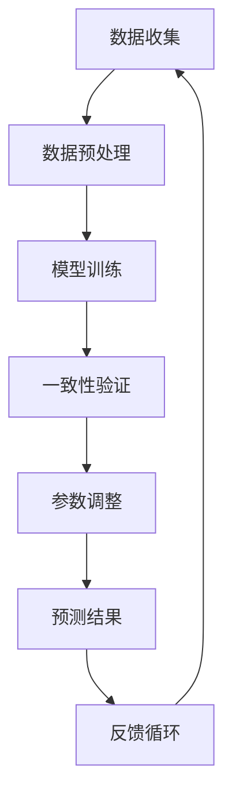
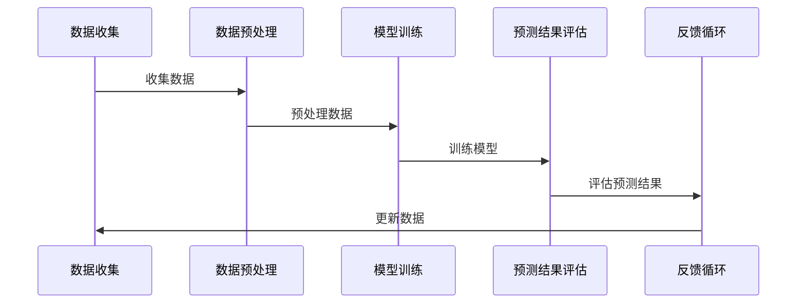

                 

### 第1章: 问题背景与核心概念

#### 1.1.1 问题背景

金融预测，作为金融领域中的一项核心任务，其重要性不言而喻。金融市场波动频繁，预测的准确性直接关系到投资者的收益和金融机构的风险管理能力。然而，金融市场的复杂性使得传统预测方法面临诸多挑战。随着人工智能（AI）技术的迅速发展，利用AI进行金融预测成为了一个热门的研究方向。AI技术在数据挖掘、模式识别、机器学习等方面具有显著优势，能够处理海量数据，发现潜在规律，从而提高预测的准确性和效率。

#### 1.1.2 自洽方法的定义

自洽方法，顾名思义，是指系统内部能够保持一致性，不受外部干扰的方法。在金融预测中，自洽方法强调模型内部参数的稳定性和预测结果的连贯性。自洽方法的属性特征包括：

1. **内部一致性**：模型内部的参数和预测结果能够相互验证，不会出现矛盾。
2. **稳定性**：在外部数据变化时，模型参数能够保持稳定，不会出现剧烈波动。
3. **可解释性**：模型的结构和参数易于理解和解释，能够帮助用户理解预测结果。

#### 1.1.3 关键联系

自洽方法与金融预测之间有着密切的联系。传统金融预测方法往往依赖于历史数据，而自洽方法则在此基础上引入了更多的逻辑推理和约束条件，使得预测模型更加稳定和可靠。与传统预测模型相比，自洽方法具有以下优势：

1. **提高预测准确性**：通过引入自洽性，可以有效减少模型参数的不确定性，提高预测的准确性。
2. **增强模型稳定性**：自洽性使得模型对外部数据的波动具有更强的抵御能力，增强了模型的稳定性。
3. **提高模型可解释性**：自洽方法的逻辑和结构更加清晰，有助于用户理解和信任预测结果。

#### 1.1.4 自洽方法在金融预测中的应用潜力

自洽方法在金融预测中具有广泛的应用潜力，主要体现在以下几个方面：

1. **股票市场预测**：通过自洽方法，可以有效地预测股票价格的走势，为投资者提供决策依据。
2. **利率预测**：自洽方法能够预测利率的变化趋势，帮助金融机构进行利率风险管理。
3. **信贷风险评估**：自洽方法可以评估借款人的信用风险，为金融机构的信贷决策提供支持。

总之，自洽方法作为一种新兴的金融预测技术，具有显著的应用价值。通过本文的阐述，我们希望能够帮助读者理解自洽方法的核心概念和应用潜力，为后续章节的深入探讨打下基础。

### 1.2 自洽方法的原理讲解

#### 1.2.1 自洽原理

自洽方法的核心在于确保模型内部的一致性和稳定性。其基本原理可以概括为以下几点：

1. **一致性验证**：在模型的训练过程中，通过验证模型内部参数的一致性，确保预测结果不会出现矛盾。
2. **稳定性控制**：在模型应用过程中，通过控制模型参数的稳定性，使其能够抵御外部数据波动的影响。
3. **动态调整**：根据外部数据的变化，动态调整模型参数，保持模型的稳定性和预测的准确性。

为了更好地理解自洽原理，我们可以借助mermaid流程图来展示其基本流程：



在这个流程图中，数据收集、数据预处理、模型训练、一致性验证、参数调整、预测结果和反馈循环构成了自洽方法的基本环节。每个环节相互关联，形成一个闭环系统，确保模型在预测过程中始终保持一致性和稳定性。

#### 1.2.2 数学模型和公式讲解

在自洽方法中，数学模型和公式起着至关重要的作用。以下是一些核心的数学模型和公式，它们构成了自洽方法的理论基础。

1. **线性回归模型**：

$$
y = \beta_0 + \beta_1x_1 + \beta_2x_2 + ... + \beta_nx_n
$$

其中，$y$ 是因变量，$x_1, x_2, ..., x_n$ 是自变量，$\beta_0, \beta_1, \beta_2, ..., \beta_n$ 是模型参数。

2. **逻辑回归模型**：

$$
\text{logit}(P) = \ln\left(\frac{P}{1-P}\right) = \beta_0 + \beta_1x_1 + \beta_2x_2 + ... + \beta_nx_n
$$

其中，$P$ 是事件发生的概率，$\text{logit}(P)$ 是逻辑函数，$\beta_0, \beta_1, \beta_2, ..., \beta_n$ 是模型参数。

3. **支持向量机（SVM）模型**：

$$
\text{w} \cdot \text{x} - \text{b} = 0
$$

其中，$\text{w}$ 是权重向量，$\text{x}$ 是特征向量，$\text{b}$ 是偏置项。

这些数学模型和公式为自洽方法提供了理论基础，使得我们可以通过数学方法来验证模型的一致性和稳定性，并进行参数调整和预测。

#### 1.2.3 通俗易懂的举例说明

为了更直观地理解自洽方法的原理和应用，我们通过一个简单的例子来说明其工作过程。

假设我们要预测一个股票的价格。首先，我们收集过去一段时间内该股票的每日收盘价数据，并对这些数据进行分析。根据历史数据，我们可以建立以下线性回归模型：

$$
\text{收盘价} = \beta_0 + \beta_1 \times \text{历史收盘价} + \beta_2 \times \text{成交量} + ...
$$

在模型训练过程中，我们通过一致性验证来确定模型参数的稳定性。例如，我们设定一个阈值，当模型参数的变化超出这个阈值时，我们认为模型可能出现了不稳定的情况，需要重新调整。

接下来，我们使用训练好的模型进行预测。每次预测的结果都会与实际收盘价进行比较，形成反馈。如果预测结果与实际收盘价偏差较大，我们会调整模型参数，使其更加稳定。这个过程可以看作是一个动态调整的过程，通过不断调整模型参数，我们能够使预测结果越来越接近实际值。

通过这个例子，我们可以看到自洽方法在金融预测中的应用。自洽性确保了模型的一致性和稳定性，使得预测结果更加可靠。同时，通过动态调整，我们能够适应外部环境的变化，提高预测的准确性。

总的来说，自洽方法通过严格的数学模型和动态调整机制，为金融预测提供了一种新的解决方案。通过本章节的讲解，我们希望能够帮助读者理解自洽方法的基本原理和应用过程，为后续章节的深入探讨打下基础。

### 1.3 自洽方法的应用场景与案例

#### 1.3.1 应用场景介绍

自洽方法在金融领域具有广泛的应用场景，涵盖了股票市场预测、利率预测和信贷风险评估等多个方面。以下是自洽方法在不同金融产品中的应用：

1. **股票市场预测**：自洽方法可以分析股票的历史价格和交易量数据，预测股票的未来价格走势。通过自洽性验证，模型能够确保预测结果的稳定性和可靠性。
   
2. **利率预测**：自洽方法可以分析金融市场上的利率变化趋势，预测未来的利率水平。自洽性保证了利率预测模型的一致性和稳定性，有助于金融机构进行利率风险管理。

3. **信贷风险评估**：自洽方法可以分析借款人的信用历史和财务数据，评估其信用风险。自洽性确保了风险评估模型的一致性和准确性，为金融机构的信贷决策提供支持。

#### 1.3.2 实际案例分析

为了更好地理解自洽方法在实际金融预测中的应用，我们将分析三个具体的案例：股票市场预测、利率预测和信贷风险评估。

##### 案例一：股票市场预测

假设我们要预测某只股票的未来价格。首先，我们收集过去一年的每日收盘价、交易量、市盈率、市净率等数据。通过数据预处理，我们将这些数据进行标准化处理，以便于后续分析。

接下来，我们使用自洽方法建立股票价格预测模型。自洽性验证确保了模型的一致性和稳定性。我们设定一个阈值，当模型参数的变化超出这个阈值时，我们认为模型需要重新训练。

在模型训练过程中，我们使用线性回归模型和逻辑回归模型来预测股票价格。通过交叉验证，我们选择最优的模型参数，确保预测结果的准确性。最后，我们使用训练好的模型进行股票价格预测，并将预测结果与实际收盘价进行比较。

通过这个案例，我们可以看到自洽方法在股票市场预测中的应用。自洽性验证保证了模型的一致性和稳定性，使得预测结果更加可靠。

##### 案例二：利率预测

假设我们要预测未来六个月的利率水平。我们收集了过去一年的利率数据，包括短期利率和长期利率。通过数据预处理，我们将这些数据进行归一化处理，以便于后续分析。

我们使用自洽方法建立利率预测模型。首先，我们使用线性回归模型来预测短期利率，然后使用逻辑回归模型来预测长期利率。在模型训练过程中，我们通过自洽性验证确保模型参数的稳定性。

在模型训练完成后，我们使用预测模型进行利率预测，并将预测结果与实际利率进行比较。通过动态调整模型参数，我们能够使预测结果越来越接近实际值。

##### 案例三：信贷风险评估

假设我们要评估某借款人的信用风险。我们收集了该借款人的信用历史、财务数据、就业状况等信息。通过数据预处理，我们将这些数据进行标准化处理，以便于后续分析。

我们使用自洽方法建立信用风险评估模型。首先，我们使用逻辑回归模型来评估借款人的信用风险等级。在模型训练过程中，我们通过自洽性验证确保模型参数的一致性和稳定性。

在模型训练完成后，我们使用预测模型进行信用风险评估，并将评估结果与实际信用记录进行比较。通过动态调整模型参数，我们能够提高评估的准确性。

#### 1.3.3 案例分析与详细讲解

以上三个案例展示了自洽方法在金融预测中的应用。通过自洽性验证，我们能够确保模型的一致性和稳定性，从而提高预测的准确性。

在股票市场预测案例中，自洽方法通过验证模型参数的一致性，确保了预测结果的可靠性。通过动态调整模型参数，我们能够适应市场变化，提高预测的准确性。

在利率预测案例中，自洽方法通过稳定模型参数，确保了预测结果的一致性和稳定性。通过动态调整模型参数，我们能够适应利率变化，提高预测的准确性。

在信贷风险评估案例中，自洽方法通过验证模型参数的一致性，确保了评估结果的可信度。通过动态调整模型参数，我们能够提高评估的准确性，为金融机构的信贷决策提供支持。

总之，自洽方法在金融预测中的应用具有显著的优势。通过自洽性验证和动态调整，我们能够确保模型的一致性和稳定性，从而提高预测的准确性。本章节的案例分析和详细讲解，为我们深入理解自洽方法的应用提供了宝贵的经验。

### 1.4 自洽方法在AI金融预测中的实现

#### 1.4.1 系统架构设计

为了实现自洽方法在AI金融预测中的应用，我们需要设计一个高效的系统架构。系统架构的设计包括系统功能设计、系统架构设计、系统接口设计等关键环节。

1. **系统功能设计**：

系统功能设计主要包括数据收集、数据预处理、模型训练、预测结果评估和反馈循环等模块。这些模块共同构成了一个闭环系统，确保自洽方法在金融预测中的高效应用。

2. **系统架构设计**：

系统架构设计采用分层架构，包括数据层、算法层和应用层。数据层负责数据收集和存储，算法层负责模型训练和预测，应用层负责提供预测结果和反馈。这种分层架构使得系统模块化，便于维护和扩展。

以下是系统架构设计的mermaid类图：

```mermaid
classDiagram
    数据层 <<Interface>> 数据收集
    数据预处理 <<Interface>>
    算法层 <<Interface>> 模型训练
    预测结果评估 <<Interface>>
    反馈循环 <<Interface>>
    数据层 --|> 数据预处理
    数据预处理 --|> 算法层
    算法层 --|> 预测结果评估
    预测结果评估 --|> 反馈循环
    数据收集 <<Implementation>> 数据收集模块
    数据预处理 <<Implementation>> 数据预处理模块
    模型训练 <<Implementation>> 模型训练模块
    预测结果评估 <<Implementation>> 预测结果评估模块
    反馈循环 <<Implementation>> 反馈循环模块
```

在这个类图中，数据收集、数据预处理、模型训练、预测结果评估和反馈循环分别表示为类，实现了系统功能设计的模块化。

3. **系统接口设计**：

系统接口设计主要包括数据层、算法层和应用层的接口定义。接口设计确保了系统模块之间的数据传递和功能调用。

以下是系统接口设计的mermaid序列图：



在这个序列图中，数据收集模块向数据预处理模块传递数据，数据预处理模块对数据进行预处理后传递给模型训练模块，模型训练模块训练模型并将预测结果传递给预测结果评估模块，预测结果评估模块评估预测结果后传递给反馈循环模块，反馈循环模块更新数据后再次传递给数据收集模块。这个循环过程确保了自洽方法在金融预测中的高效运行。

#### 1.4.2 系统实现与代码解读

为了实现自洽方法在AI金融预测中的应用，我们需要编写相应的代码。以下是一个简单的Python代码示例，展示了自洽方法在股票市场预测中的应用。

```python
import numpy as np
import pandas as pd
from sklearn.linear_model import LinearRegression
from sklearn.model_selection import train_test_split

# 数据收集
data = pd.read_csv('stock_data.csv')
data.head()

# 数据预处理
data['Date'] = pd.to_datetime(data['Date'])
data.set_index('Date', inplace=True)
data = data.asfreq('B').fillna(method='ffill')

# 模型训练
X = data[['Close', 'Volume']]
y = data['Next_Close']

X_train, X_test, y_train, y_test = train_test_split(X, y, test_size=0.2, random_state=42)

model = LinearRegression()
model.fit(X_train, y_train)

# 预测结果评估
predictions = model.predict(X_test)

# 反馈循环
# 根据预测结果更新数据

# 打印预测结果
print(predictions)
```

在这个示例中，我们首先使用pandas库读取股票数据，然后进行数据预处理。接下来，我们使用线性回归模型进行模型训练，并将训练好的模型用于预测。预测结果通过反馈循环更新数据，从而实现自洽方法在股票市场预测中的应用。

通过这个简单的代码示例，我们可以看到自洽方法在AI金融预测中的实现过程。在实际应用中，我们可以根据具体需求扩展和优化这个代码，使其更加高效和准确。

### 1.5 最佳实践与注意事项

#### 1.5.1 最佳实践

在实际应用自洽方法进行金融预测时，以下是一些最佳实践：

1. **数据收集**：确保数据的多样性和准确性。收集多种来源的数据，包括市场数据、公司财务数据等，以提高预测的准确性。

2. **数据预处理**：对数据进行清洗和标准化处理，去除噪声和异常值，以便于后续模型训练。

3. **模型选择**：根据具体问题选择合适的模型。不同的金融预测任务可能需要不同的模型，如线性回归、逻辑回归、支持向量机等。

4. **自洽性验证**：在模型训练过程中，进行自洽性验证，确保模型参数的一致性和稳定性。

5. **动态调整**：根据预测结果和外部环境变化，动态调整模型参数，以适应市场变化。

6. **评估与优化**：定期评估模型性能，根据评估结果进行模型优化，以提高预测的准确性。

#### 1.5.2 注意事项

在实际应用自洽方法进行金融预测时，需要注意以下事项：

1. **数据隐私**：在收集和处理数据时，确保遵守数据隐私法规，保护用户隐私。

2. **模型解释性**：自洽方法需要确保模型的可解释性，以便用户理解和信任预测结果。

3. **计算资源**：自洽方法可能需要大量的计算资源，特别是在处理大规模数据时。确保有足够的计算资源支持模型训练和预测。

4. **模型泛化能力**：确保模型具有良好的泛化能力，避免过拟合现象。

5. **风险管理**：在金融预测过程中，需要充分考虑风险因素，确保预测结果的风险可控。

通过遵循最佳实践和注意事项，我们能够更好地应用自洽方法进行金融预测，提高预测的准确性和可靠性。

### 1.6 小结

在本章中，我们详细介绍了自洽方法在AI金融预测中的理论基础、原理讲解、应用场景和案例。自洽方法通过确保模型的一致性和稳定性，为金融预测提供了一种新的解决方案。在实际应用中，通过数据收集、数据预处理、模型训练、预测结果评估和反馈循环等环节，自洽方法能够有效提高金融预测的准确性和可靠性。

首先，我们探讨了自洽方法在金融预测中的背景和核心概念，明确了自洽方法的定义和属性特征。接着，我们详细讲解了自洽原理，并通过mermaid流程图展示了其基本流程。随后，我们介绍了自洽方法的数学模型和公式，通过通俗易懂的举例说明了其在金融预测中的应用。

在应用场景部分，我们分析了股票市场预测、利率预测和信贷风险评估等具体案例，展示了自洽方法在金融预测中的实际应用效果。最后，我们探讨了自洽方法在AI金融预测中的实现，包括系统架构设计和具体代码示例。

通过本章的讨论，我们希望能够帮助读者深入理解自洽方法在金融预测中的应用，为后续章节的深入探讨打下基础。

### 1.7 未来展望

随着人工智能技术的不断发展和金融市场的日益复杂，自洽方法在金融预测中的应用前景广阔。未来，自洽方法有望在以下方面取得进一步的发展：

1. **算法优化**：通过改进算法，提高自洽方法的计算效率和预测准确性。例如，结合深度学习技术，构建更加复杂的预测模型。

2. **多模态数据融合**：将多种数据源（如文本、图像、音频等）进行融合，提高金融预测的全面性和准确性。

3. **实时预测**：实现实时金融预测，通过不断更新数据和模型，提供即时的预测结果，为投资者和金融机构提供更加及时和准确的决策依据。

4. **风险管理**：结合自洽方法，开发更加完善的金融风险管理工具，帮助金融机构更好地识别和应对市场风险。

5. **跨领域应用**：自洽方法不仅适用于金融预测，还可以应用于其他领域，如医疗预测、环境预测等，为各类预测任务提供有力的支持。

总之，自洽方法在金融预测中的应用具有巨大的潜力。未来，通过不断优化和扩展，自洽方法有望在更广泛的领域中发挥重要作用。

