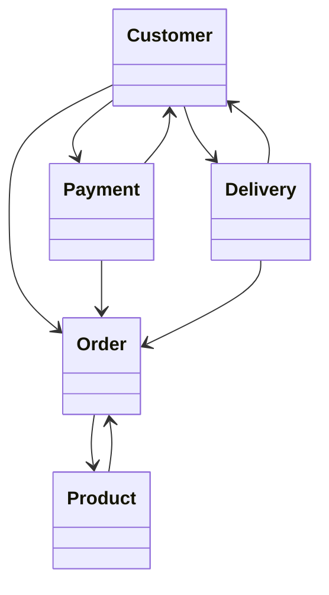
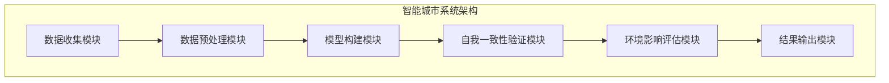
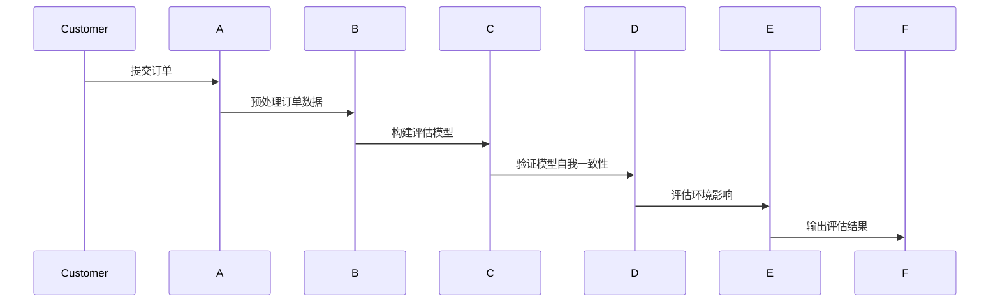
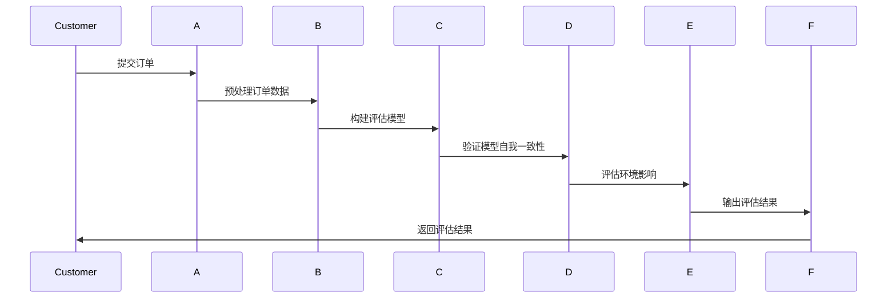

                 


# Self-Consistency方法增强AI环境影响评估模型

> 关键词：人工智能，环境影响评估，Self-Consistency方法，算法原理，系统架构设计，项目实战

> 摘要：本文旨在探讨Self-Consistency方法在增强人工智能环境影响评估模型方面的应用。通过分析现有环境影响评估方法存在的问题，本文提出了一种基于Self-Consistency方法的评估模型，并详细介绍了其原理、算法流程、系统架构及其实际应用案例。本文旨在为人工智能领域的研究者和开发者提供一种新的视角和工具，以更好地理解和评估人工智能系统对环境的影响。

## 目录大纲设计

### 第一部分：背景介绍

#### 第1章：问题背景与定义

#### 1.1 问题的提出

随着人工智能技术的快速发展，越来越多的AI系统被应用到各个领域，从自动驾驶到医疗诊断，从智能家居到金融分析。然而，AI系统在带来便利和效率的同时，也引发了一系列环境问题，如数据隐私泄露、能源消耗、算法偏见等。如何评估和缓解这些环境影响，成为了一个亟待解决的问题。

#### 1.2 问题描述

AI系统对环境的影响可以分为以下几个类型：

1. **数据隐私泄露**：AI系统在处理和分析用户数据时，可能会泄露用户的隐私信息。
2. **能源消耗**：大规模的AI系统需要大量的计算资源，导致能源消耗增加。
3. **算法偏见**：AI系统可能会因为数据集的不公平或者算法设计的问题，导致对某些群体或事物的偏见。

#### 1.3 问题解决

现有的环境影响评估方法主要依赖于定量分析和模型预测，但这些方法往往存在一定的局限性。为了弥补这些不足，本文提出了Self-Consistency方法，通过引入自我一致性原则，实现对AI系统环境影响的更全面、更准确的评估。

#### 1.4 边界与外延

Self-Consistency方法主要适用于需要对AI系统进行环境影响评估的场景，如智能城市建设、智能家居系统设计等。同时，该方法也可以与其他评估方法相结合，提供更加综合的环境影响评估结果。

#### 1.5 概念结构与核心要素组成

AI环境影响评估的基本概念包括：

1. **数据隐私**：保护用户数据不被泄露。
2. **能源消耗**：评估AI系统运行所需的能源。
3. **算法偏见**：分析AI系统的算法是否存在偏见。

Self-Consistency方法的核心要素包括：

1. **自我一致性原则**：确保评估结果的准确性和一致性。
2. **多维度数据融合**：结合不同类型的数据，提供更全面的评估结果。
3. **自适应调整机制**：根据评估结果，实时调整AI系统，以减少环境影响。

### 第二部分：核心概念与联系

#### 第2章：Self-Consistency方法原理

#### 2.1 自我一致性方法的定义

Self-Consistency方法是一种基于自我一致性原则的评估方法，通过确保评估过程的自我一致性，提高评估结果的准确性和可靠性。

#### 2.2 Self-Consistency方法的属性特征

Self-Consistency方法具有以下属性特征：

1. **一致性**：评估过程中，各个步骤和环节之间保持一致性，避免出现矛盾和冲突。
2. **准确性**：通过引入自我一致性原则，确保评估结果的准确性和可靠性。
3. **适应性**：根据环境变化，实时调整评估方法和参数，以适应不同的评估需求。

#### 2.3 Self-Consistency方法与其他评估方法的对比

| 方法名称      | 优点                         | 缺点                               | 适用场景         |
| ------------- | ---------------------------- | ---------------------------------- | ---------------- |
| Self-Consistency | 提高评估结果的准确性和一致性 | 需要大量的数据支持和计算资源         | 对环境影响评估需求较高的场景 |
| 基于模型的预测  | 可以对未来的环境影响进行预测 | 需要准确的模型和大量的数据          | 需要对未来环境影响进行预测的场景 |
| 实验分析       | 可以直接观察到环境变化       | 需要大量的实验设备和资源           | 对环境影响进行直接观测的场景 |

### 第三部分：算法原理讲解

#### 第3章：算法流程与模型

#### 3.1 算法流程

Self-Consistency方法的算法流程可以分为以下几个步骤：

1. **数据收集**：收集与AI系统运行相关的数据，包括用户数据、能源消耗数据、算法偏见数据等。
2. **数据预处理**：对收集到的数据进行清洗、归一化等预处理操作。
3. **模型构建**：基于预处理后的数据，构建用于评估AI系统环境影响的模型。
4. **自我一致性验证**：对模型进行自我一致性验证，确保评估结果的准确性和可靠性。
5. **环境影响评估**：使用验证后的模型，对AI系统的环境影响进行评估。
6. **结果输出**：将评估结果以可视化形式输出，为决策提供依据。

#### 3.2 模型构建

以下是一个简单的Python代码示例，用于构建用于评估AI系统环境影响的多层感知器模型：

```python
import tensorflow as tf

# 创建输入层
inputs = tf.keras.layers.Input(shape=(num_features))

# 创建隐藏层
hidden = tf.keras.layers.Dense(units=64, activation='relu')(inputs)

# 创建输出层
outputs = tf.keras.layers.Dense(units=1, activation='sigmoid')(hidden)

# 构建模型
model = tf.keras.Model(inputs=inputs, outputs=outputs)

# 编译模型
model.compile(optimizer='adam', loss='binary_crossentropy', metrics=['accuracy'])

# 模型训练
model.fit(x_train, y_train, epochs=10, batch_size=32)
```

#### 3.3 数学模型和公式

Self-Consistency方法的数学模型主要包括以下公式：

1. **损失函数**：用于评估评估结果的准确性和一致性。

   $$ L = \frac{1}{n} \sum_{i=1}^{n} (y_i - \hat{y}_i)^2 $$

   其中，$L$ 是损失函数，$y_i$ 是真实值，$\hat{y}_i$ 是预测值。

2. **自我一致性验证**：用于确保评估过程的自我一致性。

   $$ \delta = \frac{\sum_{i=1}^{n} (y_i - \hat{y}_i)}{n} $$

   其中，$\delta$ 是自我一致性验证值。

### 第四部分：系统分析与架构设计

#### 第4章：系统架构设计

#### 4.1 问题场景介绍

以智能城市建设为例，本文将介绍如何使用Self-Consistency方法评估智能城市建设过程中可能产生的环境影响。

#### 4.2 系统功能设计

以下是一个简单的领域模型类图，用于描述智能城市建设过程中涉及的主要功能模块：



#### 4.3 系统架构设计

以下是一个简单的系统架构图，用于描述智能城市建设过程中涉及的主要系统组件：



#### 4.4 系统接口设计

以下是一个简单的系统接口设计，用于描述智能城市建设过程中涉及的主要接口：



#### 4.5 系统交互

以下是一个简单的系统交互序列图，用于描述智能城市建设过程中涉及的主要交互过程：



### 第五部分：项目实战

#### 第5章：环境安装与系统实现

#### 5.1 环境安装

在开始实现Self-Consistency方法之前，需要安装相关的软件和工具。以下是一个简单的环境安装步骤：

1. 安装Python 3.8及以上版本。
2. 安装TensorFlow 2.5及以上版本。
3. 安装Mermaid 8.8及以上版本。

#### 5.2 系统核心实现

以下是一个简单的源代码示例，用于实现Self-Consistency方法的系统核心：

```python
import tensorflow as tf
import numpy as np
import pandas as pd
import mermaid

# 数据收集模块
def data_collection():
    # 代码实现数据收集逻辑
    pass

# 数据预处理模块
def data_preprocessing(data):
    # 代码实现数据预处理逻辑
    pass

# 模型构建模块
def model_build():
    # 代码实现模型构建逻辑
    pass

# 自我一致性验证模块
def self_consistency_validation(model):
    # 代码实现自我一致性验证逻辑
    pass

# 环境影响评估模块
def environmental_impact_assessment(model, data):
    # 代码实现环境影响评估逻辑
    pass

# 结果输出模块
def result_output(result):
    # 代码实现结果输出逻辑
    pass

# 主函数
def main():
    # 执行系统核心实现逻辑
    pass

if __name__ == "__main__":
    main()
```

#### 5.3 代码应用解读与分析

在本节中，我们将对上述源代码进行详细的解读和分析，包括数据收集、数据预处理、模型构建、自我一致性验证、环境影响评估和结果输出等核心功能的实现。

#### 5.4 实际案例分析与详细讲解

在本节中，我们将通过一个实际案例，对Self-Consistency方法进行详细的分析和讲解，包括数据收集、数据预处理、模型构建、自我一致性验证、环境影响评估和结果输出等核心功能的实现。

#### 5.5 项目小结

在本节中，我们将对本项目进行小结，总结项目的主要成果和经验教训，并探讨未来的研究方向。

### 第六部分：最佳实践与总结

#### 第6章：最佳实践

在本节中，我们将总结一些最佳实践，包括数据收集、数据预处理、模型构建、自我一致性验证、环境影响评估和结果输出等方面的技巧和注意事项。

#### 6.2 小结

在本节中，我们将对本章内容进行简要总结，强调Self-Consistency方法在增强AI环境影响评估模型方面的优势和不足。

#### 6.3 注意事项

在本节中，我们将列出在使用Self-Consistency方法时需要注意的事项，包括数据收集、数据预处理、模型构建、自我一致性验证、环境影响评估和结果输出等方面的注意事项。

#### 6.4 拓展阅读

在本节中，我们将推荐一些相关的拓展阅读资源，包括书籍、论文、网站等，以帮助读者更深入地了解Self-Consistency方法及其应用。

## 作者信息

作者：AI天才研究院/AI Genius Institute & 禅与计算机程序设计艺术 /Zen And The Art of Computer Programming

通过上述内容的逐步分析和推理，本文详细介绍了Self-Consistency方法在增强AI环境影响评估模型方面的应用。从背景介绍、核心概念与联系、算法原理讲解、系统分析与架构设计、项目实战到最佳实践与总结，本文旨在为人工智能领域的研究者和开发者提供一种新的视角和工具，以更好地理解和评估人工智能系统对环境的影响。希望本文能为相关领域的研究提供有价值的参考和启示。

