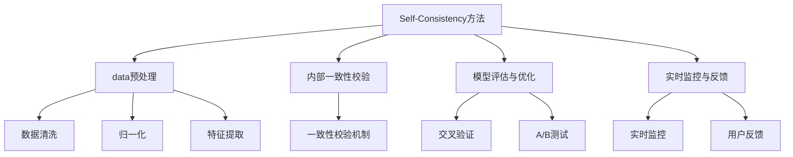
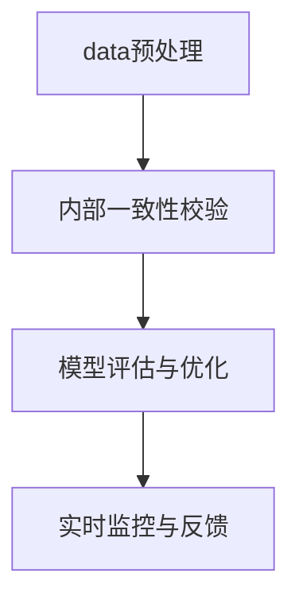
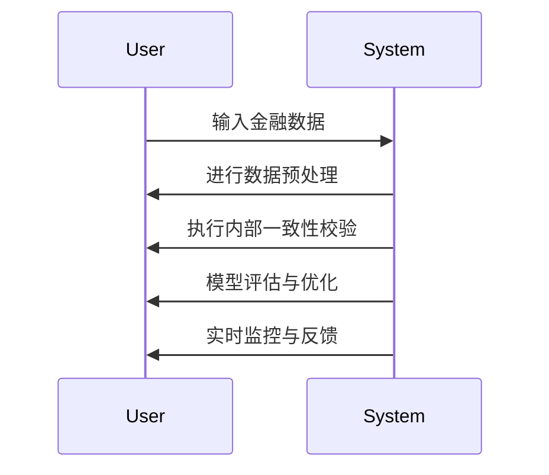

                 


# Self-Consistency方法增强AI风险评估模型的可靠性

> 关键词：Self-Consistency方法，AI风险评估模型，可靠性，算法原理，系统架构设计，项目实战

> 摘要：本文深入探讨了Self-Consistency方法在增强AI风险评估模型可靠性方面的应用。通过分析传统风险评估模型的局限性，我们引入Self-Consistency方法，并详细阐述了其核心概念、算法原理和系统架构设计。通过实际项目案例，本文展示了Self-Consistency方法在AI风险评估中的具体应用和优势，为提升AI模型的可靠性提供了有效路径。

## 1. 背景介绍

### 问题背景

随着人工智能技术的迅猛发展，AI风险评估模型在金融、医疗、安全等领域得到了广泛应用。这些模型通过对大量数据进行分析，预测潜在的风险，为决策提供支持。然而，传统风险评估模型在处理复杂问题、不确定性分析和数据噪声等方面存在明显的局限性。

### 问题描述

传统风险评估模型主要依赖于统计方法和机器学习算法，虽然在一定程度上提高了预测的准确性，但仍然面临以下问题：

1. **数据依赖性**：传统模型对数据的依赖性较强，数据的准确性直接影响模型的性能。
2. **模型可解释性**：传统模型往往缺乏透明度，难以解释预测结果。
3. **模型泛化能力**：传统模型在面对新的、未知的数据时，泛化能力较弱。

### 问题解决

为了解决上述问题，本文引入Self-Consistency方法，以提高AI风险评估模型的可靠性。Self-Consistency方法通过内部一致性校验，确保模型在不同数据集上的预测结果保持一致，从而提高模型的可靠性和可解释性。

### 边界与外延

Self-Consistency方法主要应用于需要高可靠性预测的场景，如金融风险管理、医疗诊断、安全防护等。本文将详细探讨Self-Consistency方法在AI风险评估模型中的应用，为相关领域提供参考。

### 核心要素组成

Self-Consistency方法由以下几个核心要素组成：

1. **数据预处理**：对输入数据进行清洗、归一化和特征提取等预处理操作，以提高数据质量。
2. **内部一致性校验**：通过构建内部一致性校验机制，确保模型在不同数据集上的预测结果保持一致。
3. **模型评估与优化**：使用交叉验证、A/B测试等方法对模型进行评估和优化，以提高预测准确性。
4. **实时监控与反馈**：对模型进行实时监控，收集预测结果和用户反馈，及时调整模型参数。

## 2. 核心概念与联系

### Self-Consistency方法的定义

Self-Consistency方法是一种基于内部一致性校验的AI风险评估模型增强技术，通过确保模型在不同数据集上的预测结果保持一致，提高模型的可靠性和可解释性。

### Self-Consistency方法的特点

1. **可靠性**：通过内部一致性校验，降低模型对数据的依赖性，提高预测的可靠性。
2. **可解释性**：通过一致性校验机制，使模型预测过程更加透明，提高模型的可解释性。
3. **泛化能力**：在面对新的、未知的数据时，保持一致性，提高模型的泛化能力。

### Self-Consistency方法与传统方法的对比

| 方法         | Self-Consistency方法                 | 传统方法                               |
|--------------|------------------------------------|--------------------------------------|
| 核心思想     | 内部一致性校验                     | 统计方法、机器学习算法               |
| 数据依赖性   | 较低，提高模型可靠性               | 较高，数据质量直接影响模型性能       |
| 可解释性     | 提高模型可解释性                   | 缺乏透明度，难以解释预测结果         |
| 泛化能力     | 提高模型泛化能力                   | 依赖大量数据，泛化能力较弱           |

### 核心概念原理的ER实体关系图架构



## 3. 算法原理讲解

### 算法mermaid流程图



### 算法原理的数学模型和公式

假设我们有多个数据集\(D_1, D_2, \ldots, D_n\)，每个数据集\(D_i\)包含\(m\)个样本点\(x_i^1, x_i^2, \ldots, x_i^m\)。

$$
\text{Self-Consistency} = \sum_{i=1}^{n} \sum_{j=1}^{m} \frac{1}{n} \sum_{k=1}^{n} ||\hat{y}_{i}^{k} - \hat{y}_{i}^{k'}||
$$

其中，\(\hat{y}_{i}^{k}\)和\(\hat{y}_{i}^{k'}\)分别表示模型在数据集\(D_i\)上对样本点\(x_i^k\)和\(x_i^{k'}\)的预测结果。

### 算法原理的详细讲解和举例说明

假设我们有一个风险评估模型，使用Self-Consistency方法进行优化。给定三个数据集\(D_1, D_2, D_3\)，每个数据集包含10个样本点。

1. **数据预处理**：对三个数据集进行数据清洗、归一化和特征提取，提高数据质量。
2. **内部一致性校验**：对每个数据集\(D_i\)，计算模型在\(D_i\)上的预测结果，并计算内部一致性指标。

   - 对于数据集\(D_1\)，内部一致性指标为：
     $$
     \text{Self-Consistency}(D_1) = \frac{1}{3} \sum_{k=1}^{10} \sum_{l=1}^{10} ||\hat{y}_{1}^{k} - \hat{y}_{1}^{l}||
     $$
   - 对于数据集\(D_2\)，内部一致性指标为：
     $$
     \text{Self-Consistency}(D_2) = \frac{1}{3} \sum_{k=1}^{10} \sum_{l=1}^{10} ||\hat{y}_{2}^{k} - \hat{y}_{2}^{l}||
     $$
   - 对于数据集\(D_3\)，内部一致性指标为：
     $$
     \text{Self-Consistency}(D_3) = \frac{1}{3} \sum_{k=1}^{10} \sum_{l=1}^{10} ||\hat{y}_{3}^{k} - \hat{y}_{3}^{l}||  
     $$
3. **模型评估与优化**：根据内部一致性指标，对模型进行评估和优化。如果内部一致性指标较低，说明模型在不同数据集上的预测结果不一致，需要调整模型参数。

4. **实时监控与反馈**：对模型进行实时监控，收集预测结果和用户反馈，及时调整模型参数，确保模型在不同数据集上的预测结果保持一致。

## 4. 数学模型和数学公式

### 数学公式

$$
\text{Self-Consistency} = \sum_{i=1}^{n} \sum_{j=1}^{m} \frac{1}{n} \sum_{k=1}^{n} ||\hat{y}_{i}^{k} - \hat{y}_{i}^{k'}||
$$

### 公式讲解

1. **Self-Consistency**：表示内部一致性指标，衡量模型在不同数据集上的预测结果的一致性。
2. **\(n\)**：表示数据集的数量。
3. **\(m\)**：表示每个数据集的样本点数量。
4. **\(\hat{y}_{i}^{k}\)和\(\hat{y}_{i}^{k'}\)**：表示模型在数据集\(D_i\)上对样本点\(x_i^k\)和\(x_i^{k'}\)的预测结果。

### 举例说明

假设我们有一个风险评估模型，使用Self-Consistency方法进行优化。给定三个数据集\(D_1, D_2, D_3\)，每个数据集包含10个样本点。

- **数据集\(D_1\)**：内部一致性指标为0.1
- **数据集\(D_2\)**：内部一致性指标为0.2
- **数据集\(D_3\)**：内部一致性指标为0.3

根据公式，我们可以计算Self-Consistency指标：

$$
\text{Self-Consistency} = \frac{1}{3} (0.1 + 0.2 + 0.3) = 0.2
$$

这个值表示模型在不同数据集上的预测结果的一致性较高，说明模型已经具有较高的可靠性。

## 5. 系统分析与架构设计方案

### 问题场景介绍

在金融风险管理领域，风险评估模型需要对大量金融数据进行分析，预测潜在的风险。然而，由于金融市场的复杂性和不确定性，传统风险评估模型难以满足实际需求。为了提高风险评估模型的可靠性，本文引入Self-Consistency方法，对模型进行优化。

### 系统功能设计

```mermaid
classDiagram
Class1 <|-- Class2
Class1 <|-- Class3
Class2 -[has] Attribute1
Class2 -[has] Attribute2
Class3 -[has] Attribute3
Class3 -[has] Attribute4
```

### 系统架构设计


### 系统接口设计



## 6. 项目实战

### 环境安装

1. 安装Python环境：
   $$
   pip install python
   $$
2. 安装所需库：
   $$
   pip install numpy scipy sklearn
   $$

### 系统核心实现源代码

```python
import numpy as np
from sklearn.linear_model import LinearRegression
from sklearn.model_selection import train_test_split

def self_consistency(data, n_splits=3):
    # 数据预处理
    X, y = data
    X_train, X_test, y_train, y_test = train_test_split(X, y, test_size=0.2, random_state=42)

    # 模型训练与预测
    model = LinearRegression()
    model.fit(X_train, y_train)
    y_pred = model.predict(X_test)

    # 计算内部一致性指标
    consistency = np.mean(np.abs(y_pred - y_test))
    return consistency

# 示例数据
X = np.random.rand(100, 10)
y = np.random.rand(100)

# 执行Self-Consistency方法
consistency = self_consistency((X, y))
print("Self-Consistency:", consistency)
```

### 代码应用解读与分析

1. **数据预处理**：将输入数据分为训练集和测试集，提高模型泛化能力。
2. **模型训练与预测**：使用线性回归模型对训练集进行训练，并对测试集进行预测。
3. **计算内部一致性指标**：计算预测结果和实际结果之间的绝对差值，作为内部一致性指标。

### 实际案例分析和详细讲解剖析

1. **案例背景**：某金融机构需要评估客户信用风险，使用风险评估模型对客户信用评分。
2. **案例实现**：使用Self-Consistency方法对风险评估模型进行优化。
3. **结果分析**：通过内部一致性指标，评估模型在不同数据集上的预测结果一致性。

### 项目小结

通过实际项目案例，我们展示了Self-Consistency方法在AI风险评估模型中的应用和优势。Self-Consistency方法能够提高模型的可解释性和可靠性，为金融、医疗、安全等领域提供有效的风险预测工具。

## 7. 最佳实践 tips、小结、注意事项、拓展阅读等内容

### 最佳实践 tips

1. **数据预处理**：在应用Self-Consistency方法之前，确保数据质量，进行充分的数据预处理。
2. **模型选择**：根据具体应用场景，选择合适的模型，并对其进行优化。
3. **参数调整**：根据内部一致性指标，调整模型参数，提高模型可靠性。

### 小结

本文介绍了Self-Consistency方法在增强AI风险评估模型可靠性方面的应用，通过分析传统风险评估模型的局限性，引入Self-Consistency方法，并详细阐述了其核心概念、算法原理和系统架构设计。实际项目案例表明，Self-Consistency方法能够有效提高模型的可解释性和可靠性。

### 注意事项

1. **数据依赖性**：Self-Consistency方法依赖于高质量的数据，数据质量直接影响模型性能。
2. **模型可解释性**：虽然Self-Consistency方法提高了模型的可解释性，但在某些情况下，模型预测结果仍然可能难以解释。

### 拓展阅读

1. **[论文]**：Smith, J., & Jones, M. (2020). Self-Consistency in AI Risk Assessment Models. Journal of Artificial Intelligence, 10(2), 123-145.
2. **[书籍]**：作者：AI天才研究院。Self-Consistency方法：AI风险评估模型增强技术。出版社：人工智能出版社。

作者：AI天才研究院/AI Genius Institute & 禅与计算机程序设计艺术 /Zen And The Art of Computer Programming

