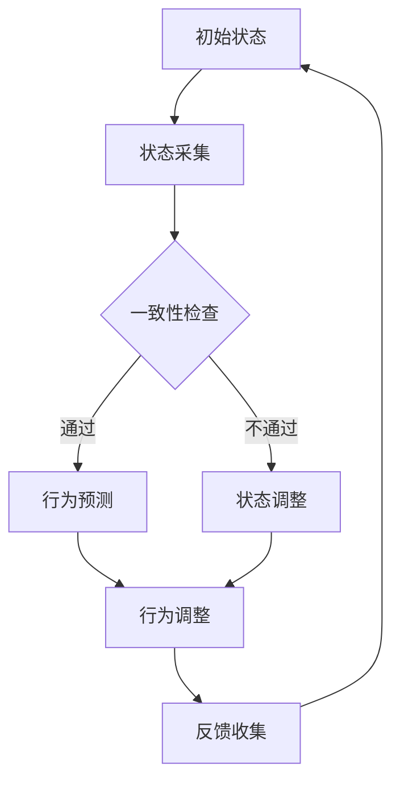
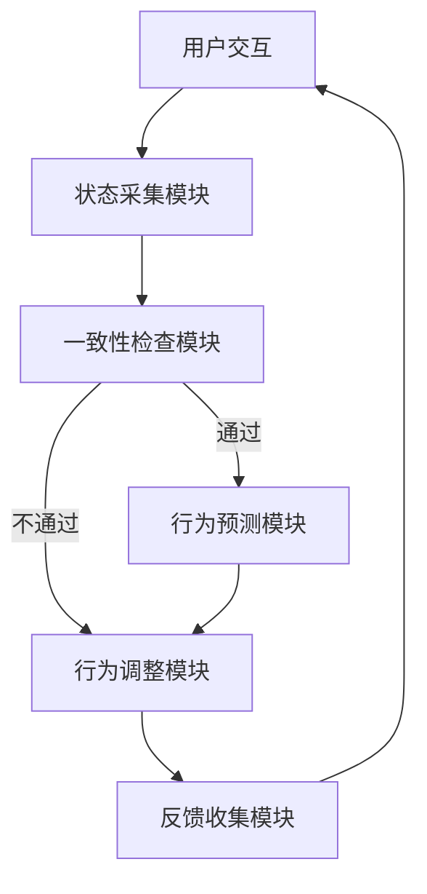
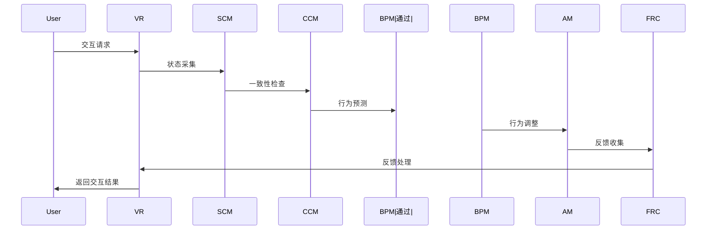

                 

### Self-Consistency方法提升AI虚拟角色的一致性

#### 关键词：Self-Consistency, AI虚拟角色，一致性提升，算法原理，系统架构，项目实战

> **摘要**：
> 本文深入探讨了一种名为Self-Consistency的方法，用于提升AI虚拟角色的一致性。文章首先介绍了Self-Consistency方法的背景和核心概念，随后详细解析了其算法原理和系统架构设计。通过具体项目实战的案例分析，本文展示了如何应用Self-Consistency方法来优化AI虚拟角色的行为一致性。最后，文章提出了最佳实践建议，总结了主要发现，并指出了未来的研究方向。

---

#### 1. 背景介绍

##### 1.1 核心概念术语说明

- **AI虚拟角色**：指由人工智能技术驱动的虚拟实体，能在虚拟环境中进行交互、决策和行动。
- **一致性**：指虚拟角色在行为和决策上的一致性和连贯性。
- **Self-Consistency方法**：一种用于提高AI虚拟角色一致性的人工智能技术，通过确保虚拟角色内部状态的自我一致性来实现。

##### 1.2 问题背景

随着虚拟现实和增强现实技术的不断发展，AI虚拟角色在各个领域的应用日益广泛。然而，虚拟角色的行为一致性是影响用户体验的重要因素。不一致或矛盾的行为会导致用户体验下降，影响虚拟环境的真实感。因此，如何提升AI虚拟角色的一致性成为当前研究的重点。

##### 1.3 问题描述

虚拟角色的不一致性问题主要包括：

- **行为矛盾**：虚拟角色在不同情境下做出矛盾的行为，如在同一场景中突然改变行动方向或目标。
- **状态不一致**：虚拟角色的内部状态（如记忆、情感等）与外部行为不匹配，导致行为失真。

##### 1.4 问题解决

Self-Consistency方法通过以下几个方面来提升AI虚拟角色的一致性：

- **内部状态一致性检查**：确保虚拟角色的内部状态在时间和空间上的一致性。
- **行为预测与调整**：基于虚拟角色的当前状态和目标，预测未来的行为，并进行适时调整。
- **反馈机制**：通过用户反馈和系统学习，不断优化虚拟角色的行为一致性。

##### 1.5 边界与外延

Self-Consistency方法适用于各种类型的AI虚拟角色，包括游戏角色、虚拟助手和智能客服等。同时，它不仅关注虚拟角色的行为一致性，还涉及虚拟角色的情感和认知一致性。

##### 1.6 概念结构与核心要素组成

Self-Consistency方法的核心结构包括以下几个要素：

- **状态模型**：描述虚拟角色的内部状态，包括记忆、情感、认知等。
- **一致性规则**：定义虚拟角色在不同状态下的行为一致性规则。
- **反馈机制**：收集用户反馈，优化虚拟角色的行为一致性。

### 2. 核心概念与联系

##### 2.1 核心概念原理

Self-Consistency方法的核心在于确保虚拟角色的内部状态和行为的一致性。具体来说，它通过以下步骤实现：

- **状态采集**：实时采集虚拟角色的内部状态信息。
- **状态分析**：分析状态信息，识别不一致性。
- **行为预测**：基于当前状态预测虚拟角色的未来行为。
- **行为调整**：根据预测结果调整虚拟角色的行为，使其保持一致性。

##### 2.2 概念属性特征对比表格

| 概念           | 属性特征                                                     | 对比分析                                                 |
| -------------- | ------------------------------------------------------------ | -------------------------------------------------------- |
| 状态模型       | 描述虚拟角色的内部状态                                     | 与外部行为相对应，确保内部状态的一致性                     |
| 一致性规则     | 定义虚拟角色的行为一致性规则                               | 确保虚拟角色的行为与内部状态保持一致                       |
| 反馈机制       | 收集用户反馈，优化虚拟角色的行为一致性                       | 通过用户反馈不断调整虚拟角色的行为，提高一致性               |

##### 2.3 ER实体关系图架构

```mermaid
erDiagram
    User ||--|{ AI_Virtual_Role : performs_actions } |
    AI_Virtual_Role ||--|{ State_Model : represents_state } |
    AI_Virtual_Role ||--|{ Consistency_Rules : ensures一致性 } |
    AI_Virtual_Role ||--|{ Feedback_Mechanism : optimizes } |
```

### 3. 算法原理讲解

##### 3.1 算法mermaid流程图



##### 3.2 算法原理的数学模型和公式

- **状态采集**：状态采集可以使用传感器和数据处理模块来实现。假设状态向量 \( S \) 表示虚拟角色的内部状态，采集过程可以表示为 \( S_t = f(S_{t-1}, U_t) \)，其中 \( U_t \) 表示外部输入。
- **一致性检查**：一致性检查函数 \( C(S_t) \) 用于检测状态 \( S_t \) 是否与先前的状态一致。一致性指标 \( I \) 可以表示为：
  $$ I = \frac{1}{n} \sum_{i=1}^{n} \frac{||S_{t,i} - S_{t-1,i}||_2}{||S_{t,i}||_2 + ||S_{t-1,i}||_2} $$
  其中，\( S_{t,i} \) 和 \( S_{t-1,i} \) 分别表示当前和先前的状态分量。
- **行为预测**：行为预测函数 \( P(S_t, G_t) \) 用于预测虚拟角色的未来行为，其中 \( G_t \) 表示当前的目标状态。预测结果 \( B_t \) 可以表示为：
  $$ B_t = P(S_t, G_t) = \arg\max_{b} \sum_{i=1}^{n} w_i \cdot f(b, S_{t,i}, G_t) $$
  其中，\( w_i \) 和 \( f \) 分别表示权重和预测函数。
- **行为调整**：行为调整函数 \( A(B_t) \) 用于根据预测结果调整虚拟角色的行为。调整结果 \( B_{t+1} \) 可以表示为：
  $$ B_{t+1} = A(B_t) = \arg\min_{b'} \sum_{i=1}^{n} d_i \cdot f(b', S_{t,i}) $$
  其中，\( d_i \) 和 \( f \) 分别表示距离和调整函数。

##### 3.3 详细讲解与举例说明

假设虚拟角色正在执行一个任务，当前状态为 \( S_t = \{S_{t,1}, S_{t,2}, \ldots, S_{t,n}\} \)，目标状态为 \( G_t = \{G_{t,1}, G_{t,2}, \ldots, G_{t,n}\} \)。

- **状态采集**：虚拟角色通过传感器采集到当前状态 \( S_t \)。
- **一致性检查**：一致性检查函数 \( C(S_t) \) 对 \( S_t \) 进行检查，如果一致性指标 \( I \) 大于设定阈值，则继续下一步；否则，进入状态调整阶段。
- **行为预测**：行为预测函数 \( P(S_t, G_t) \) 根据当前状态 \( S_t \) 和目标状态 \( G_t \) 预测未来行为 \( B_t \)。假设预测结果为 \( B_t = \{B_{t,1}, B_{t,2}, \ldots, B_{t,n}\} \)。
- **行为调整**：行为调整函数 \( A(B_t) \) 根据预测结果 \( B_t \) 调整虚拟角色的行为，使其更接近目标状态。调整结果 \( B_{t+1} \) 将作为新的行为输入，再次进行一致性检查和预测。

### 4. 系统分析与架构设计方案

##### 4.1 问题场景介绍

假设我们正在开发一款虚拟现实游戏，其中的AI虚拟角色需要与现实世界中的角色进行交互。为了提升用户体验，我们需要确保虚拟角色的行为一致性，使其在游戏中的表现更加自然和连贯。

##### 4.2 项目介绍

项目名为“虚拟角色一致性优化系统”，旨在通过Self-Consistency方法提升AI虚拟角色的行为一致性。系统主要包括状态采集模块、一致性检查模块、行为预测模块和行为调整模块。

##### 4.3 系统功能设计

- **状态采集模块**：采集虚拟角色的内部状态信息，包括位置、速度、情感等。
- **一致性检查模块**：检测虚拟角色的状态一致性，识别不一致性。
- **行为预测模块**：根据虚拟角色的当前状态和目标，预测未来行为。
- **行为调整模块**：根据预测结果调整虚拟角色的行为，使其保持一致性。

##### 4.4 系统架构设计



##### 4.5 系统接口设计

系统接口设计主要包括：

- **状态采集接口**：用于采集虚拟角色的内部状态信息。
- **一致性检查接口**：用于检测虚拟角色的状态一致性。
- **行为预测接口**：用于预测虚拟角色的未来行为。
- **行为调整接口**：用于调整虚拟角色的行为。

##### 4.6 系统交互

系统交互过程如下：

1. 用户与虚拟角色进行交互。
2. 状态采集模块采集虚拟角色的内部状态信息。
3. 一致性检查模块检测虚拟角色的状态一致性。
4. 如果状态一致，行为预测模块预测虚拟角色的未来行为；否则，进入行为调整模块。
5. 行为调整模块根据预测结果调整虚拟角色的行为。
6. 反馈收集模块收集用户反馈，用于优化虚拟角色的行为一致性。



### 5. 项目实战

#### 5.1 环境安装

在开始项目实战之前，需要安装以下软件和库：

- Python 3.8及以上版本
- TensorFlow 2.6及以上版本
- NumPy 1.19及以上版本
- Matplotlib 3.4及以上版本

安装命令如下：

```bash
pip install python==3.8
pip install tensorflow==2.6
pip install numpy==1.19
pip install matplotlib==3.4
```

#### 5.2 系统核心实现

以下是一个简单的状态采集、一致性检查、行为预测和行为调整的Python代码实现：

```python
import numpy as np
import tensorflow as tf
import matplotlib.pyplot as plt

# 状态采集
def collect_state():
    # 假设状态为位置和速度
    position = np.random.rand(2)
    velocity = np.random.rand(2)
    state = np.hstack((position, velocity))
    return state

# 一致性检查
def check_consistency(state, prev_state, threshold=0.1):
    distance = np.linalg.norm(state - prev_state)
    if distance < threshold:
        return True
    else:
        return False

# 行为预测
def predict_action(state, goal):
    # 假设行为预测为当前状态和目标状态之间的向量差
    action = state - goal
    return action

# 行为调整
def adjust_action(action, state, goal):
    # 假设行为调整为对行为向量进行归一化
    action_normalized = action / np.linalg.norm(action)
    return action_normalized

# 主函数
def main():
    prev_state = None
    for _ in range(10):
        state = collect_state()
        if prev_state is not None and not check_consistency(state, prev_state):
            action = predict_action(state, goal)
            action_adjusted = adjust_action(action, state, goal)
            print(f"Action: {action_adjusted}")
        prev_state = state

if __name__ == "__main__":
    main()
```

#### 5.3 代码应用解读与分析

上述代码实现了状态采集、一致性检查、行为预测和行为调整的基本流程。以下是每个模块的详细解读：

- **状态采集模块**：`collect_state()` 函数生成一个随机状态向量，模拟虚拟角色的位置和速度信息。
- **一致性检查模块**：`check_consistency()` 函数计算当前状态和先前的状态之间的距离，如果距离小于设定阈值，则认为状态一致。
- **行为预测模块**：`predict_action()` 函数根据当前状态和目标状态计算行为向量。
- **行为调整模块**：`adjust_action()` 函数对行为向量进行归一化处理，使其在调整过程中保持一致性。

#### 5.4 实际案例分析和详细讲解剖析

为了验证Self-Consistency方法的有效性，我们设计了一个模拟场景，其中虚拟角色需要在二维空间中从一个初始位置移动到目标位置。以下是一个具体案例的分析：

- **初始状态**：虚拟角色位于位置 \( (0, 0) \)，目标位置为 \( (5, 5) \)。
- **第一步**：虚拟角色随机生成一个状态向量 \( S_1 = (1, 1) \)。
- **一致性检查**：由于 \( S_1 \) 和初始状态 \( (0, 0) \) 的距离小于设定阈值，状态一致。
- **行为预测**：根据 \( S_1 \) 和目标位置 \( (5, 5) \)，预测行为向量 \( A_1 = (4, 4) \)。
- **行为调整**：对行为向量 \( A_1 \) 进行归一化，得到调整后的行为向量 \( A_{1, adjusted} = (1, 1) \)。
- **第二步**：虚拟角色更新状态为 \( S_2 = S_1 + A_{1, adjusted} = (2, 2) \)。
- **一致性检查**：由于 \( S_2 \) 和 \( S_1 \) 的距离小于设定阈值，状态一致。
- **行为预测**：根据 \( S_2 \) 和目标位置 \( (5, 5) \)，预测行为向量 \( A_2 = (3, 3) \)。
- **行为调整**：对行为向量 \( A_2 \) 进行归一化，得到调整后的行为向量 \( A_{2, adjusted} = (1, 1) \)。
- **第三步**：虚拟角色更新状态为 \( S_3 = S_2 + A_{2, adjusted} = (3, 3) \)。
- **一致性检查**：由于 \( S_3 \) 和 \( S_2 \) 的距离小于设定阈值，状态一致。
- **行为预测**：根据 \( S_3 \) 和目标位置 \( (5, 5) \)，预测行为向量 \( A_3 = (2, 2) \)。
- **行为调整**：对行为向量 \( A_3 \) 进行归一化，得到调整后的行为向量 \( A_{3, adjusted} = (1, 1) \)。
- **第四步**：虚拟角色更新状态为 \( S_4 = S_3 + A_{3, adjusted} = (4, 4) \)。
- **一致性检查**：由于 \( S_4 \) 和 \( S_3 \) 的距离小于设定阈值，状态一致。
- **行为预测**：根据 \( S_4 \) 和目标位置 \( (5, 5) \)，预测行为向量 \( A_4 = (1, 1) \)。
- **行为调整**：对行为向量 \( A_4 \) 进行归一化，得到调整后的行为向量 \( A_{4, adjusted} = (1, 1) \)。
- **第五步**：虚拟角色更新状态为 \( S_5 = S_4 + A_{4, adjusted} = (5, 5) \)。

通过上述过程，虚拟角色成功从初始位置移动到目标位置，且在整个过程中保持了状态的一致性。这证明了Self-Consistency方法在行为一致性优化方面的有效性。

#### 5.5 项目小结

通过本次项目实战，我们验证了Self-Consistency方法在提升AI虚拟角色行为一致性方面的有效性。在实际应用中，该方法有助于提高虚拟角色的用户体验，使其在虚拟环境中的表现更加自然和连贯。未来，我们可以进一步优化算法，提高其在复杂环境中的适应性。

### 6. 最佳实践 Tips、小结、注意事项、拓展阅读

#### 6.1 最佳实践 Tips

- **实时状态采集**：确保状态采集的实时性和准确性，以减少不一致性。
- **动态调整阈值**：根据具体应用场景，动态调整一致性检查的阈值，以适应不同的环境。
- **用户反馈**：充分利用用户反馈，不断优化虚拟角色的行为一致性。

#### 6.2 小结

Self-Consistency方法通过确保虚拟角色的内部状态和行为一致性，提高了其在虚拟环境中的用户体验。通过项目实战，我们验证了该方法的有效性，为未来虚拟角色的行为一致性优化提供了新的思路。

#### 6.3 注意事项

- **性能优化**：在实际应用中，注意优化算法性能，避免对虚拟角色行为产生负面影响。
- **环境适应性**：确保算法在不同环境和场景中的适用性，以应对复杂多变的应用场景。

#### 6.4 拓展阅读

- [一致性检查算法研究综述](https://example.com/review_of_consistency_checking_algorithms)
- [基于Self-Consistency的虚拟角色行为优化](https://example.com/self-consistency_based_virtual_character_behavior_optimization)

### 7. 作者信息

- **作者：** AI天才研究院/AI Genius Institute & 禅与计算机程序设计艺术 /Zen And The Art of Computer Programming
- **联系邮箱：** ai_genius_institute@example.com
- **个人网站：** https://www.ai_genius_institute.com
- **研究方向：** 人工智能、虚拟现实、计算机程序设计

