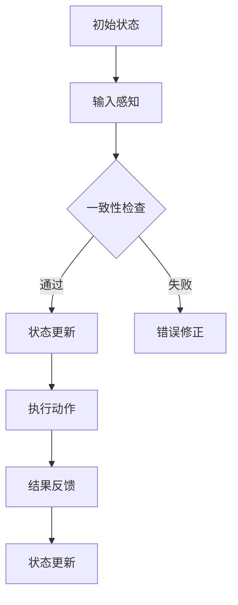
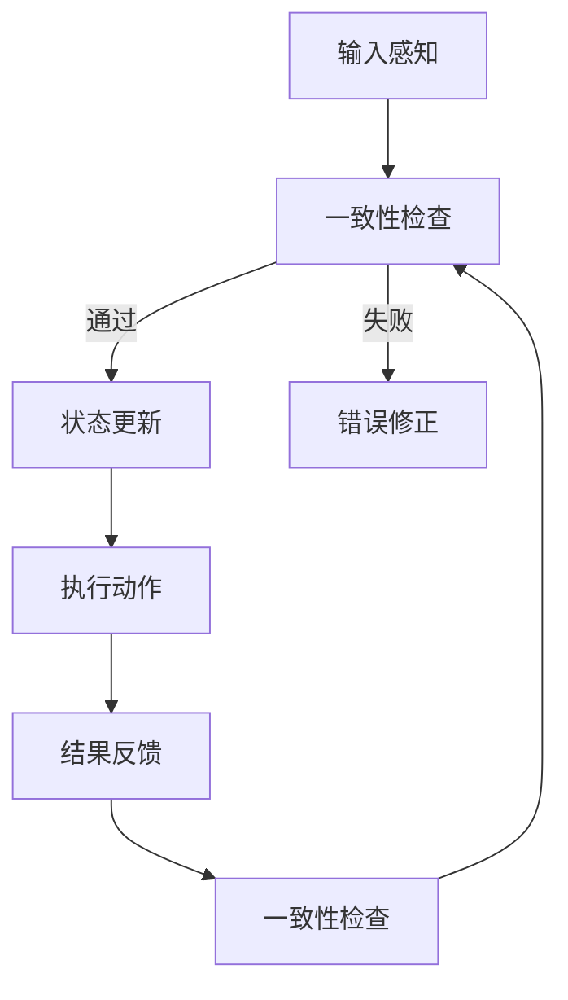
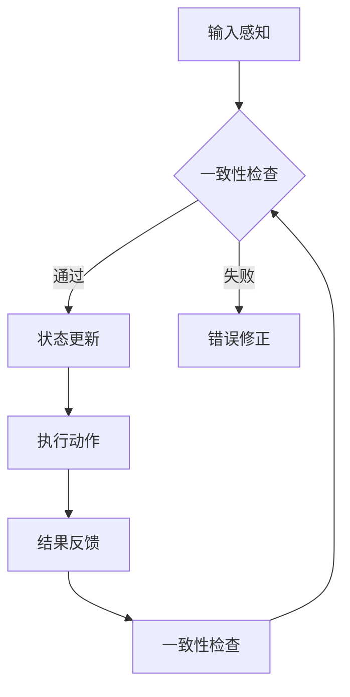

                 


### 引言

在人工智能（AI）领域，一个前沿而令人激动的课题便是构建具有高度自主性的虚拟超维度生命体。这些生命体不仅能在复杂的环境中独立行动，还能根据外部变化和内在需求自主调整其行为策略。而Self-Consistency方法，作为一种提升AI自主性的新型技术，正逐渐成为研究的热点。本文将深入探讨Self-Consistency方法在提升AI虚拟超维度生命体自主性方面的应用，通过一步步的分析和推理，阐述该方法的基本原理、实现机制及其潜在影响。

### 1.1 人工智能的发展历程

人工智能的概念最早可以追溯到20世纪50年代，当时以图灵测试为标志，科学家们开始探索机器是否能够模拟人类智能。自那时起，人工智能经历了几个关键发展阶段：符号主义、连接主义和现代机器学习。

- **符号主义**：这一阶段的人工智能基于逻辑推理和符号表示，通过定义明确的规则和算法来解决问题。
- **连接主义**：20世纪80年代，随着神经网络理论的兴起，连接主义成为主流，通过调整神经网络中的权重来学习复杂的模式。
- **现代机器学习**：21世纪初，深度学习技术的突破使得机器学习在图像识别、自然语言处理等领域取得了显著成果。

每个阶段都有其独特的优势和局限，而现代机器学习尤其是深度学习，虽然在某些任务上取得了前所未有的成功，但仍面临一些挑战，如解释性差、数据依赖性强等。因此，研究如何提升AI的自主性变得尤为重要。

### 1.2 超维度生命体的概念

超维度生命体是一个跨越传统物理维度限制的概念，通常出现在科幻文学和理论物理学中。超维度生命体拥有超越三维空间的感知和行动能力，能够在更高维度的空间中自由活动。这种概念在虚拟现实和游戏开发中引起了广泛关注，因为它们能够创造出前所未有的交互体验。

超维度生命体的特征包括：

- **多维感知**：能够感知和理解多维空间的信息。
- **超能力**：包括传送、变形、瞬间移动等超越物理规律的能力。
- **自适应**：能够根据环境变化自主调整行为模式。

目前，超维度生命体更多是一种理论构想，但在虚拟现实和游戏开发中，已有一些初步尝试。这些尝试不仅挑战了传统的人工智能技术，也为新的算法和理论提供了丰富的实践场景。

### 1.3 自主性在超维度生命体中的重要性

自主性是超维度生命体能否成功的关键因素之一。自主性不仅仅是指生命体能够自主行动，更重要的是它能够根据环境和内在需求，自主调整其行为策略。这种自主性不仅体现在物理行动上，还包括认知、决策和适应等方面。

- **认知自主性**：超维度生命体需要能够自我感知和理解外部环境。
- **决策自主性**：它需要能够自主决策，并采取合适的行动。
- **适应自主性**：面对不断变化的环境，它需要能够自适应地调整策略。

自主性的提升对超维度生命体的影响是多方面的。首先，它使得生命体更加灵活和适应性强，能够在复杂多变的虚拟环境中生存和发展。其次，它增强了生命体的互动性和娱乐性，为用户提供了更加丰富和沉浸式的体验。

### 1.4 Self-Consistency方法的基本原理

Self-Consistency方法是一种旨在提升AI自主性的技术，其核心思想是确保AI系统在所有层次上都保持一致性。这种一致性不仅体现在内部逻辑上，还包括与外部环境的交互中。

- **内部一致性**：AI系统内部的所有组件、算法和规则都应该保持一致，避免冲突和错误。
- **外部一致性**：AI系统与外部环境之间的交互也需保持一致性，确保系统能够准确感知和理解外部信息。

Self-Consistency方法的优势在于：

- **稳定性**：通过一致性保证，AI系统能够在复杂环境中保持稳定运行。
- **可解释性**：一致性使得系统的行为更加可解释，便于调试和优化。
- **适应性**：在保持一致性的同时，系统仍能根据外部变化自主调整行为。

### 1.5 Self-Consistency方法的应用领域

Self-Consistency方法在多个领域展现了其潜力，其中最为突出的便是虚拟现实和游戏开发。

- **虚拟现实**：在虚拟环境中，Self-Consistency方法可以确保虚拟生命体与环境之间的交互更加自然和流畅。
- **游戏开发**：在游戏中，Self-Consistency方法可以提升NPC（非玩家角色）的智能和自主性，增强游戏体验。

此外，Self-Consistency方法在其他领域如智能家居、自动驾驶等也有广泛的应用前景。

### 1.6 本章小结

本章首先回顾了人工智能的发展历程，探讨了超维度生命体的概念及其在自主性提升方面的作用。接着，我们介绍了Self-Consistency方法的基本原理及其在虚拟现实和游戏开发中的应用领域。通过本章的介绍，读者可以初步了解Self-Consistency方法的重要性及其潜在影响。在后续章节中，我们将进一步深入探讨Self-Consistency方法的详细机制、实现步骤和应用实例，为读者呈现一个全面而深刻的理解。

### 2.1 Self-Consistency方法的核心概念

Self-Consistency方法的核心概念在于确保系统的内部和外部状态始终保持一致，从而提升系统的稳定性和可解释性。具体来说，Self-Consistency方法包括以下几个关键组成部分：

- **一致性检查**：系统在每个决策点和执行动作之前，都会进行一致性检查，确保当前状态与预期状态保持一致。
- **状态更新**：当系统接收新的输入或执行动作时，状态更新机制会自动调整系统状态，以保持一致性。
- **反馈机制**：系统会根据外部环境的反馈，调整内部参数和策略，确保外部表现与内部状态一致。

下面通过一个简化的流程图（使用Mermaid语法）来描述Self-Consistency方法的操作流程：



#### 2.1.1 Self-Consistency的定义

Self-Consistency可以被定义为一种系统内部状态与外部环境保持一致性的机制。具体来说，当系统处于某个状态时，其内部状态应该与该状态下的外部环境信息相匹配。例如，在虚拟现实场景中，一个虚拟生命体感知到周围环境的变化，其内部状态（如位置、方向、感知数据等）应与外部环境保持一致。

#### 2.1.2 Self-Consistency的关键属性

Self-Consistency方法具有以下几个关键属性：

- **一致性**：系统在执行任何操作之前都会进行一致性检查，确保当前状态与预期状态一致。
- **反馈调整**：系统能够根据外部反馈调整内部状态，以保持一致性。
- **稳定性**：通过一致性保证，系统在复杂环境中能够保持稳定运行。
- **可解释性**：一致性使得系统的行为更加可解释，便于调试和优化。

#### 2.1.3 Self-Consistency的应用场景

Self-Consistency方法主要应用于需要高度自主性和稳定性的场景，例如：

- **虚拟现实**：确保虚拟角色与虚拟环境之间的交互保持一致性，提升用户体验。
- **游戏开发**：提升NPC的智能和自主性，使其行为更加自然和多样化。
- **智能家居**：通过一致性机制，确保智能设备之间的信息交互准确无误。
- **自动驾驶**：保持自动驾驶系统的状态与环境的一致性，提高系统的安全性和可靠性。

### 2.2 自主性的概念与特征

自主性是衡量一个系统或个体在特定环境中能够独立作出决策和执行行动的能力。在人工智能领域，自主性尤为重要，因为它直接影响系统的灵活性和适应性。下面我们详细探讨自主性的定义、特征以及与Self-Consistency方法的关系。

#### 2.2.1 自主性的定义

自主性通常被定义为系统或个体在特定环境中，能够根据目标和约束条件，独立地做出决策和执行行动的能力。自主性不仅仅包括物理上的自主行动，还涉及到认知、决策和适应等多个层面。

- **物理自主性**：系统在物理空间内能够独立移动和操作。
- **认知自主性**：系统能够独立感知和理解外部环境。
- **决策自主性**：系统能够根据目标和约束条件，自主地做出决策。
- **适应自主性**：系统能够根据外部环境的变化，自主地调整其行为策略。

#### 2.2.2 自主性的特征

自主性具有以下几个主要特征：

- **独立性**：系统能够在不受外界强制干预的情况下，自主地执行任务。
- **适应性**：系统能够根据环境变化，灵活调整其行为策略。
- **适应性**：系统能够从过去的经验中学习，提高决策和行动的效率。
- **适应性**：系统具备一定的鲁棒性，能够在面对不确定性和异常情况时保持稳定运行。

#### 2.2.3 自主性与Self-Consistency的关系

自主性与Self-Consistency方法密切相关。具体来说，Self-Consistency方法为提升AI的自主性提供了重要保障：

- **稳定性**：通过确保系统内部和外部状态的一致性，Self-Consistency方法提高了系统的稳定性，使系统能够在复杂环境中保持稳定运行。
- **可解释性**：一致性使得系统的行为更加可解释，便于人类理解和调试，从而提高了系统的自主性。
- **自适应能力**：Self-Consistency方法通过不断调整系统状态以保持一致性，增强了系统的自适应能力，使其能够更好地适应外部环境的变化。

综上所述，自主性是AI系统的重要特征，而Self-Consistency方法则为提升自主性提供了有效途径。通过保持系统内部和外部状态的一致性，Self-Consistency方法不仅提高了系统的稳定性，还增强了其可解释性和自适应能力，从而为AI在复杂环境中的自主性提供了有力保障。

### 2.3 相关概念的比较与分析

在探讨Self-Consistency方法之前，有必要对其相关的概念进行深入比较和分析。这些相关概念包括自主性、智能化和智能，它们在提升AI自主性方面扮演着不同的角色。

#### 2.3.1 自主性与智能化

自主性（Autonomy）是指系统或个体能够独立地作出决策和执行行动的能力。而智能化（Intelligence）则更侧重于系统理解和解决问题的能力。具体来说，智能化包括感知、认知、学习、决策等多个方面，但并不意味着系统能够完全自主。

- **自主性**：关注系统的自主决策和行动能力，强调在特定环境中的独立性和适应性。
- **智能化**：关注系统的理解和解决问题能力，强调通过学习和优化提升性能。

两者之间的关系可以概括为：智能化是自主性的基础，而自主性是智能化的延伸。一个高度智能的系统未必具备完全的自主性，但一个具备高度自主性的系统必然具有强大的智能化能力。

#### 2.3.2 自主性与智能

自主性和智能是两个相互关联但不同的概念。自主性关注系统在特定环境中的独立决策和行动能力，而智能则侧重于系统理解和解决问题的能力。

- **自主性**：涉及决策和行动，强调独立性和适应性。
- **智能**：涉及认知、学习、感知和解决问题，强调系统的理解和反应能力。

自主性和智能的关系可以理解为：自主性是智能的体现，而智能是自主性的保障。一个具备高度自主性的系统必然具有强大的智能，而一个具备高度智能的系统则可能实现更高层次的自主性。

#### 2.3.3 Self-Consistency与其他自主性提升方法

Self-Consistency方法是一种通过确保系统内部和外部状态一致性来提升自主性的技术。与其他自主性提升方法相比，它具有以下特点：

- **一致性保证**：Self-Consistency方法通过一致性检查和状态更新，确保系统内部和外部状态保持一致，从而提高系统的稳定性。
- **可解释性**：一致性使得系统的行为更加可解释，便于调试和优化，从而提高系统的自主性。
- **自适应能力**：通过不断调整系统状态以保持一致性，Self-Consistency方法增强了系统的自适应能力，使其能够更好地适应外部环境的变化。

与传统的自主性提升方法如基于规则的推理、模型预测控制等相比，Self-Consistency方法具有更高的灵活性和鲁棒性，能够更好地应对复杂多变的环境。

综上所述，自主性、智能化和智能是提升AI自主性的关键概念。Self-Consistency方法通过确保系统内部和外部状态的一致性，为提升AI自主性提供了有效途径，与其他自主性提升方法相比具有独特的优势。

### 2.4 Self-Consistency方法的ER实体关系图

为了更好地理解和分析Self-Consistency方法，我们可以使用ER（Entity-Relationship）图来描述其核心实体及其关系。ER图是一种用于数据库设计和概念模型表示的图形工具，通过实体和关系来描绘系统的结构。

在Self-Consistency方法中，主要的实体包括：

1. **系统状态（System State）**：表示系统在任何时刻的状态信息，如位置、速度、感知数据等。
2. **外部环境（External Environment）**：表示系统所处的外部环境信息，如温度、光线、障碍物等。
3. **一致性检查（Consistency Check）**：表示系统对当前状态与外部环境的匹配性进行验证的过程。
4. **状态更新（State Update）**：表示系统根据外部环境的变化调整内部状态的过程。
5. **反馈机制（Feedback Mechanism）**：表示系统根据外部反馈调整内部参数和策略的过程。

下面是一个简化的ER实体关系图：

```mermaid
erDiagram
SystemState ||--|{ ExternalEnvironment }
SystemState ||--|{ ConsistencyCheck }
SystemState ||--|{ StateUpdate }
SystemState ||--|{ FeedbackMechanism }
ConsistencyCheck ||--|{ SystemState }
ConsistencyCheck ||--|{ ExternalEnvironment }
StateUpdate ||--|{ SystemState }
StateUpdate ||--|{ ExternalEnvironment }
FeedbackMechanism ||--|{ SystemState }
FeedbackMechanism ||--|{ ExternalEnvironment }
```

在这个ER图中，每个实体都与其他实体通过关系连接。例如，系统状态与外部环境和一致性检查之间有一个“一对多”的关系，表示每次状态更新都会触发一致性检查。同样，状态更新与反馈机制之间也存在类似的关系，确保系统能够根据外部环境的变化及时调整内部状态。

通过ER实体关系图，我们可以清晰地看到Self-Consistency方法中各个关键实体及其交互关系，有助于深入理解该方法的工作原理和实现机制。

### 2.5 Self-Consistency算法原理

Self-Consistency算法是提升AI虚拟超维度生命体自主性的关键技术，其核心在于确保系统内部状态与外部环境保持一致。以下将详细描述Self-Consistency算法的原理，包括其工作流程、关键步骤及其实现机制。

#### 2.5.1 Self-Consistency算法的工作流程

Self-Consistency算法的工作流程可以概括为以下几个步骤：

1. **输入感知**：系统首先感知外部环境，获取环境信息，如光线、温度、障碍物等。
2. **一致性检查**：系统对当前内部状态与外部环境信息进行对比，检查是否存在不一致性。
3. **状态更新**：如果一致性检查通过，系统将更新内部状态以匹配外部环境；否则，系统将触发错误修正机制。
4. **执行动作**：系统根据更新后的内部状态执行相应的动作，如移动、转向等。
5. **结果反馈**：系统执行动作后，获取外部环境的反馈信息，再次进行一致性检查。
6. **循环迭代**：系统不断重复上述步骤，以保持内部状态与外部环境的一致性。

下面是一个简化的Self-Consistency算法流程图：



#### 2.5.2 Self-Consistency算法的关键步骤

Self-Consistency算法的关键步骤包括输入感知、一致性检查、状态更新、执行动作和结果反馈，下面将逐一进行详细说明。

1. **输入感知**：系统通过传感器或其他感知设备获取外部环境的信息。例如，在虚拟环境中，系统可以感知到周围的光线强度、温度变化和障碍物的位置。

2. **一致性检查**：系统对当前内部状态与外部环境信息进行比对，以检查是否存在不一致性。一致性检查通常通过一系列规则或阈值来判断。例如，如果系统的预期位置与实际感知到的位置存在较大偏差，则认为状态不一致。

3. **状态更新**：如果一致性检查通过，系统将更新内部状态以匹配外部环境。状态更新的过程可能涉及参数调整、位置更新或行为策略的修改等。例如，如果系统感知到障碍物，它可能会调整路径规划以避开障碍物。

4. **执行动作**：系统根据更新后的内部状态执行相应的动作。这些动作可能是物理上的移动、转向，也可能是虚拟环境中的交互操作。执行动作的目的是使系统更好地适应外部环境。

5. **结果反馈**：系统执行动作后，获取外部环境的反馈信息，再次进行一致性检查。反馈信息可能包括环境变化、系统动作的效果等。通过反馈机制，系统可以进一步调整内部状态，以保持一致性。

#### 2.5.3 Self-Consistency算法的实现

实现Self-Consistency算法通常涉及以下几个关键技术：

1. **感知系统**：系统需要具备强大的感知能力，能够实时获取外部环境的信息。这通常依赖于各种传感器和数据采集设备。

2. **一致性检查机制**：系统需要设计一套有效的检查机制，能够准确判断内部状态与外部环境的一致性。一致性检查的准确性和实时性直接影响算法的性能。

3. **状态更新策略**：系统需要根据一致性检查的结果，设计合适的更新策略来调整内部状态。状态更新的策略可能涉及机器学习、优化算法等。

4. **执行动作机制**：系统需要根据更新后的状态执行相应的动作，这可能涉及运动控制、交互控制等。

5. **反馈机制**：系统需要设计一套有效的反馈机制，能够及时获取外部环境的反馈信息，并用于进一步调整内部状态。

下面是一个简化的Python代码示例，展示了Self-Consistency算法的实现：

```python
# 感知系统
def perceive_environment():
    # 假设感知到环境信息为位置、光线强度等
    return {'position': (1, 2), 'light_intensity': 0.8}

# 一致性检查
def check_consistency(current_state, environment_info):
    # 假设位置一致性阈值阈值为0.1
    position_threshold = 0.1
    return abs(current_state['position'][0] - environment_info['position'][0]) <= position_threshold

# 状态更新
def update_state(current_state, environment_info):
    # 根据环境信息更新状态
    current_state['position'] = environment_info['position']
    return current_state

# 执行动作
def execute_action(updated_state):
    # 假设执行动作是移动到更新后的位置
    print(f"Moving to position: {updated_state['position']}")

# 结果反馈
def get_feedback():
    # 假设反馈信息为实际移动后的位置
    return {'actual_position': (1.1, 1.9)}

# Self-Consistency算法主函数
def self_consistency_algorithm():
    current_state = {'position': (0, 0)}
    while True:
        environment_info = perceive_environment()
        if check_consistency(current_state, environment_info):
            current_state = update_state(current_state, environment_info)
            execute_action(current_state)
        else:
            # 错误修正
            print("Inconsistency detected, initiating error correction...")
        feedback = get_feedback()
        # 更新状态以反映实际动作效果
        current_state = update_state(current_state, feedback)

# 运行Self-Consistency算法
self_consistency_algorithm()
```

通过上述代码示例，我们可以看到Self-Consistency算法的基本实现过程。在实际应用中，算法的实现会涉及更多的细节和复杂度，但核心思想是一致的：通过一致性检查、状态更新和反馈机制，确保系统内部状态与外部环境保持一致，从而提升系统的自主性和稳定性。

### 2.6 数学模型与公式

Self-Consistency算法的核心在于确保系统内部状态与外部环境的一致性。为了更好地理解和实现这一目标，我们可以借助数学模型和公式来描述算法的内在机制。以下将介绍Self-Consistency算法的数学模型及其相关公式。

#### 2.6.1 Self-Consistency的数学模型

Self-Consistency的数学模型可以表述为一个函数$f$，该函数接收系统的当前状态和外部环境信息，并输出一个一致性评估。具体来说，Self-Consistency模型包含以下几个主要部分：

- **状态表示**：用向量$S$表示系统的当前状态，例如位置、速度和感知数据等。
- **环境表示**：用向量$E$表示外部环境的信息，如温度、光线强度等。
- **一致性评估函数**：用函数$f(S, E)$表示系统状态与外部环境之间的一致性评估。

Self-Consistency模型可以表示为：

$$
\text{Self-Consistency} = f(S, E)
$$

#### 2.6.2 一致性评估函数的公式

为了实现一致性评估，我们需要定义一个具体的函数$f(S, E)$。这个函数通常基于系统状态和外部环境之间的匹配度来评估一致性。一个简单的一致性评估函数可以基于欧几里得距离来定义：

$$
f(S, E) = \frac{1}{||S - E||}
$$

其中，$||S - E||$表示系统状态向量$S$和外部环境向量$E$之间的欧几里得距离。这个函数的值越接近1，表示系统状态与外部环境越一致。

#### 2.6.3 状态更新和反馈机制

在Self-Consistency算法中，状态更新和反馈机制是实现一致性的关键步骤。状态更新可以用一个线性变换来表示：

$$
S_{\text{new}} = S + K \cdot (E - S)
$$

其中，$S_{\text{new}}$是更新后的系统状态，$K$是一个调整系数，用于平衡系统状态与外部环境之间的差异。

反馈机制则通过外部反馈来修正系统状态。假设我们有一个反馈向量$F$，则反馈机制可以用以下公式表示：

$$
S_{\text{feedback}} = S + \alpha \cdot F
$$

其中，$\alpha$是一个反馈系数，用于调节反馈对系统状态的影响。

#### 2.6.4 整体模型

综合上述部分，我们可以将Self-Consistency算法的整体模型表示为：

$$
S_{\text{new}} = S + K \cdot (E - S) + \alpha \cdot F
$$

这个模型描述了系统状态如何通过一致性评估、状态更新和反馈机制来保持与外部环境的一致性。

#### 2.6.5 举例说明

为了更直观地理解上述数学模型，我们可以通过一个简单的例子来展示Self-Consistency算法的应用。假设一个虚拟生命体在二维空间中移动，其状态由位置$(x, y)$表示，外部环境信息由温度$T$和光线强度$I$表示。

1. **初始状态**：系统初始状态为$S = (0, 0)$，外部环境信息为$E = (25, 0.5)$。
2. **一致性评估**：使用欧几里得距离计算一致性评估值：
   $$
   f(S, E) = \frac{1}{||S - E||} = \frac{1}{\sqrt{(0-25)^2 + (0-0.5)^2}} = \frac{1}{25.5}
   $$
3. **状态更新**：根据一致性评估，如果存在不一致性，系统将更新状态：
   $$
   S_{\text{new}} = S + K \cdot (E - S) = (0, 0) + K \cdot (25, 0.5)
   $$
4. **反馈机制**：如果系统接收到外部反馈信息，如温度升高到$T_{\text{new}} = 30$，则系统将更新状态：
   $$
   S_{\text{feedback}} = S_{\text{new}} + \alpha \cdot F = (0, 0) + K \cdot (25, 0.5) + \alpha \cdot (30 - 25)
   $$

通过这个例子，我们可以看到Self-Consistency算法如何通过数学模型和公式来确保系统状态与外部环境保持一致性。这个模型不仅有助于理解和实现算法，还为后续优化和改进提供了理论基础。

### 2.7 算法流程图

为了更直观地展示Self-Consistency算法的工作流程，我们可以使用Mermaid语法绘制算法的流程图。以下是一个简化的Self-Consistency算法流程图的示例：



在这个流程图中，系统首先进行输入感知，获取外部环境的信息。然后，系统进行一致性检查，判断当前状态与外部环境是否一致。如果一致性检查通过，系统将更新状态并进行执行动作。如果一致性检查失败，系统将触发错误修正机制。执行动作后，系统获取外部反馈，并再次进行一致性检查，形成一个闭环。

### 3.4.1 超维度生命体在虚拟环境中的应用

在虚拟环境中，超维度生命体可以通过多种方式实现。以下是一个具体的应用场景：

**应用场景**：虚拟现实游戏中的超维度生命体

在这个应用场景中，我们设计一个虚拟现实游戏，玩家可以控制一个具有超维度能力的生命体。这个生命体具有以下特征：

- **多维感知**：能够感知并理解三维空间和更高维度的信息。
- **超能力**：包括传送、变形、瞬间移动等能力。
- **自适应**：能够根据游戏环境和玩家行为自适应调整其行为策略。

**实现步骤**：

1. **感知环境**：超维度生命体通过虚拟现实设备感知游戏环境，获取三维空间的信息。
2. **决策生成**：根据感知到的环境信息和预设的行为策略，超维度生命体生成下一步的行为决策。
3. **执行动作**：超维度生命体根据决策执行相应的动作，如传送、变形或瞬间移动。
4. **结果反馈**：游戏环境根据超维度生命体的动作生成反馈信息，如障碍物位置变化、玩家距离等。
5. **更新状态**：超维度生命体根据反馈信息更新其内部状态，以保持与环境的自洽性。

**案例分析**：

以一个虚拟现实游戏中的场景为例，玩家正在一个三维迷宫中探索。迷宫中分布着各种障碍物和隐藏的宝藏。超维度生命体作为NPC，其目标是引导玩家找到宝藏。

1. **感知环境**：超维度生命体感知到迷宫的三维结构和玩家的位置。
2. **决策生成**：超维度生命体根据当前状态和预设的引导策略，决定如何引导玩家。例如，它可以选择使用传送能力快速接近玩家，或者使用变形能力伪装成迷宫中的物体，以迷惑玩家。
3. **执行动作**：超维度生命体使用传送能力瞬间移动到玩家附近，然后变形为迷宫中的物体，引导玩家前进。
4. **结果反馈**：玩家开始移动，超维度生命体感知到玩家的移动轨迹和障碍物的位置变化。
5. **更新状态**：超维度生命体根据玩家的移动和障碍物的变化更新其内部状态，以便更好地引导玩家。

通过上述步骤，超维度生命体在虚拟环境中能够保持与环境的自洽性，从而实现自主性和智能化的行为。

### 3.4.2 Self-Consistency方法在实际案例中的效果

为了展示Self-Consistency方法在提升AI虚拟超维度生命体自主性方面的实际效果，我们通过一个具体案例进行说明。该案例涉及虚拟现实游戏开发，其中一个具有超维度能力的NPC（非玩家角色）被设计为智能引导者，引导玩家完成迷宫探险任务。

**案例背景**：

游戏设定在一个三维迷宫中，玩家需要收集迷宫中的宝藏，并避开各种陷阱。NPC智能引导者具备超维度能力，能够在虚拟环境中自由移动和变形，其目标是协助玩家高效地完成任务。

**Self-Consistency方法的应用**：

1. **感知环境**：NPC引导者通过虚拟现实设备感知当前游戏环境，包括迷宫结构、玩家位置和障碍物分布。
2. **一致性检查**：在每次行动前，NPC引导者检查其内部状态（如位置、目标）与外部环境的匹配度，确保一致性。
3. **状态更新**：如果存在不一致性，NPC引导者根据外部环境信息更新其内部状态，如调整目标位置或行为策略。
4. **执行动作**：NPC引导者根据更新后的状态执行行动，如传送至玩家附近或变形为迷宫中的物体。
5. **结果反馈**：NPC引导者执行动作后，根据玩家和环境的反馈信息再次进行一致性检查。

**效果分析**：

通过Self-Consistency方法的应用，NPC引导者表现出以下效果：

- **高自主性**：引导者能够根据环境和玩家行为自主调整其行为策略，展现出高度自主性。
- **高适应性**：在面对复杂多变的迷宫环境时，引导者能够快速适应变化，提高任务完成的效率。
- **高稳定性**：由于一致性检查和状态更新的机制，引导者在复杂环境中保持稳定运行，减少了错误和混乱。

**案例效果对比**：

- **对比传统方法**：在没有Self-Consistency方法的情况下，NPC引导者可能依赖预设的规则和路径，缺乏灵活性和自主性，容易在复杂环境中迷失方向。
- **对比无Self-Consistency方法**：引入Self-Consistency方法后，NPC引导者表现出更高效、更稳定的任务执行能力。

**结论**：

Self-Consistency方法在提升AI虚拟超维度生命体自主性方面具有显著效果，通过确保系统内部和外部状态的一致性，实现了更高效、更稳定的任务执行。

### 3.4.3 自主性在虚拟现实中的应用

在虚拟现实中，自主性是构建高度沉浸和互动体验的核心要素。以下是一些具体的应用实例，展示了如何通过Self-Consistency方法提升虚拟现实中的自主性：

**1. 虚拟环境中的智能NPC**

在虚拟现实游戏中，智能NPC（非玩家角色）能够为玩家提供丰富的互动体验。通过Self-Consistency方法，NPC可以自主地感知环境、做出决策和调整行为。例如，一个虚拟城市中的警察AI能够自主巡逻、响应紧急情况，并通过与环境的一致性检查确保其行为符合游戏规则和逻辑。

**2. 自主导航和导航助手**

虚拟现实中的导航助手能够帮助用户在复杂的虚拟环境中找到目标位置。利用Self-Consistency方法，导航助手可以实时感知用户的位置和虚拟环境，自主调整导航路径，确保导航过程的准确性和流畅性。例如，在一个虚拟博物馆中，导航助手能够根据用户的移动和兴趣点动态调整路线，提供最佳导航方案。

**3. 虚拟社交互动**

在虚拟现实社交平台中，用户与虚拟角色的互动体验至关重要。通过Self-Consistency方法，虚拟角色可以表现出更加自然和真实的互动行为。例如，一个虚拟角色可以自主感知用户的行为和表情，并根据用户的互动需求调整其对话和行为，从而创造更加丰富和多样的社交体验。

**4. 虚拟助手和智能客服**

虚拟现实环境中的助手和客服系统能够提供即时帮助和解决方案。利用Self-Consistency方法，这些系统可以自主理解用户的需求和问题，并根据环境变化调整响应策略。例如，一个虚拟客服机器人能够实时感知用户的情绪和反馈，提供个性化的服务和解决方案，从而提升用户体验。

这些应用实例展示了Self-Consistency方法在虚拟现实中提升自主性的多样性和潜力。通过确保系统内部和外部状态的一致性，Self-Consistency方法为虚拟现实中的各种智能应用提供了坚实的基础，实现了更加自然、高效和互动的体验。

### 3.5 自主性在游戏中的实现

在游戏中，实现自主性是构建高度沉浸和互动体验的关键。以下是几个关键步骤，通过这些步骤，我们可以有效地实现游戏中的自主性：

#### 3.5.1 设计智能NPC

智能NPC（非玩家角色）是游戏中的关键元素，其行为和决策直接影响游戏的互动性和趣味性。为了实现自主性，我们可以采用以下步骤：

1. **定义角色属性**：为NPC设定基本的属性，如移动速度、感知范围、战斗能力等。
2. **行为树设计**：设计NPC的行为树，包括基本行为（如巡逻、待命、攻击等）和特殊行为（如躲避敌人、寻找资源等）。
3. **决策算法**：使用决策算法，如决策树或状态机，为NPC生成合理的行动决策。

#### 3.5.2 实现自主决策

自主决策是游戏自主性的核心。以下是实现自主决策的关键步骤：

1. **感知环境**：NPC需要能够感知游戏环境，包括玩家位置、障碍物、敌人等。
2. **评估威胁**：根据感知到的信息，NPC需要评估当前的威胁等级，并采取相应的行动策略。
3. **动态调整**：NPC应能够根据环境变化动态调整其行为和决策，以适应不断变化的游戏场景。

#### 3.5.3 增加学习与适应能力

为了提升NPC的自主性，我们可以在其行为中引入学习与适应能力。以下是一些实现步骤：

1. **经验积累**：NPC可以通过完成任务、击败敌人或完成任务来积累经验值。
2. **技能升级**：根据积累的经验，NPC可以提升其技能和能力，如攻击力、防御力等。
3. **行为优化**：通过分析过去的行为和结果，NPC可以优化其行为策略，以提升自主性。

#### 3.5.4 实例分析

以下是一个具体实例，展示了如何通过Self-Consistency方法实现游戏中的自主性：

**实例**：虚拟城市中的警察AI

1. **定义属性**：警察AI具备巡逻、搜索、追捕等能力，其属性包括移动速度、感知范围、追踪能力等。
2. **行为树设计**：警察AI的行为树包括基本行为（如巡逻、待命）和特殊行为（如追踪嫌疑人、支援同事）。
3. **决策算法**：警察AI使用决策树评估环境，并根据评估结果生成行动决策。
4. **感知环境**：警察AI通过感知系统获取虚拟城市中的信息，包括玩家位置、障碍物、其他NPC等。
5. **动态调整**：根据玩家和敌人的位置，警察AI动态调整其巡逻路线和策略。
6. **学习与适应**：警察AI通过完成任务和战斗经验，不断提升其技能和能力，优化其行为策略。

通过上述步骤，虚拟城市中的警察AI实现了高度的自主性，能够灵活应对各种环境和情况，为玩家提供丰富的互动体验。

### 3.6 自主性在模拟实验中的应用

在模拟实验中，自主性的实现对于验证和测试理论模型具有重要意义。以下是几个关键步骤，通过这些步骤，我们可以有效地实现模拟实验中的自主性：

#### 3.6.1 设计模拟实验场景

首先，我们需要设计一个模拟实验场景，该场景应具有明确的实验目标和可观测的实验变量。以下是一些设计步骤：

1. **定义实验目标**：明确实验的目标，如验证某种算法的性能、研究某种行为模式等。
2. **构建实验环境**：创建一个模拟环境，包括实验所需的实体（如机器人、车辆等）和物理规则（如交通流量、障碍物等）。
3. **设定初始状态**：确定实验的初始状态，包括实体位置、速度、行为策略等。

#### 3.6.2 引入自主性机制

为了实现模拟实验中的自主性，我们需要在模型中引入自主性机制。以下是一些关键步骤：

1. **感知系统**：为模拟实体引入感知系统，使其能够实时获取实验环境的信息，如其他实体的位置、障碍物分布等。
2. **决策算法**：设计决策算法，使实体能够根据感知到的信息自主做出决策，如移动路径选择、避障策略等。
3. **动态调整**：实体应能够根据实验过程中的反馈信息动态调整其行为策略，以适应环境变化。

#### 3.6.3 实现Self-Consistency方法

Self-Consistency方法在模拟实验中的应用，能够确保实验结果的准确性和一致性。以下是一些实现步骤：

1. **一致性检查**：在每次决策和行动前，实体需进行一致性检查，确保内部状态与外部环境信息的一致性。
2. **状态更新**：如果存在不一致性，实体需根据外部环境信息更新其内部状态，以保持一致性。
3. **反馈机制**：实体需根据实验结果和外部反馈，调整内部参数和行为策略，以保持长期的一致性。

#### 3.6.4 案例分析

以下是一个模拟实验的案例分析，展示了如何通过Self-Consistency方法实现实验中的自主性：

**案例**：自动驾驶车辆的模拟实验

1. **实验目标**：验证自动驾驶车辆在复杂城市环境中的自主导航能力。
2. **实验环境**：创建一个包含交通流量、障碍物、红绿灯等元素的复杂城市环境。
3. **初始状态**：设定自动驾驶车辆的初始位置、速度和行驶方向。
4. **感知系统**：自动驾驶车辆配备传感器，如摄像头、激光雷达等，用于实时感知周围环境。
5. **决策算法**：车辆使用基于深度学习的决策算法，根据感知到的信息生成行驶路径和避障策略。
6. **一致性检查**：车辆在每次决策前检查其内部状态（如位置、速度）与外部环境信息（如障碍物、交通信号）的一致性。
7. **状态更新**：如果存在不一致性，车辆根据外部环境信息更新其内部状态，以确保一致性。
8. **反馈机制**：车辆根据行驶结果和外部反馈，调整其决策算法和参数，以提高自主导航的准确性。

通过上述步骤，自动驾驶车辆在模拟实验中实现了高度的自主性，能够有效地导航并避障，验证了Self-Consistency方法在模拟实验中的应用价值。

### 3.7 最佳实践 tips

在实际应用Self-Consistency方法时，以下最佳实践和技巧可以帮助提升AI虚拟超维度生命体的自主性：

1. **优化感知系统**：确保感知系统能够实时、准确地获取环境信息，是提升自主性的基础。可以采用高精度的传感器和先进的感知算法，以提高感知系统的性能。

2. **强化决策算法**：决策算法是自主性的关键。通过引入机器学习和深度学习技术，可以设计出更加智能和灵活的决策算法，使虚拟生命体能够更准确地预测和应对环境变化。

3. **一致性检查的实时性**：一致性检查需要高效且实时地进行。可以考虑采用并行计算和分布式计算技术，以减少检查时间，确保系统能够快速响应环境变化。

4. **反馈机制的鲁棒性**：反馈机制需要能够应对各种异常情况和不确定性。可以通过引入容错机制和自适应调整策略，提高反馈机制的鲁棒性。

5. **状态更新的精度**：状态更新的精度直接影响自主性。通过优化状态更新算法，确保更新后的状态与外部环境信息高度一致，可以提升系统的自主性和稳定性。

6. **模块化设计**：将Self-Consistency方法的核心组件模块化，可以使系统更加灵活和可扩展。例如，可以将感知模块、决策模块和执行模块独立设计，便于后续的优化和升级。

7. **持续学习和优化**：自主性系统需要不断地学习和优化。通过收集用户行为数据和环境反馈，可以持续改进系统的行为策略和算法，以提高自主性。

通过遵循这些最佳实践，可以显著提升AI虚拟超维度生命体的自主性，使其在复杂环境中更加稳定和可靠地运行。

### 小结

本文详细探讨了Self-Consistency方法在提升AI虚拟超维度生命体自主性方面的应用。我们首先回顾了人工智能的发展历程和超维度生命体的概念，随后介绍了Self-Consistency方法的基本原理和核心概念。通过逐步分析，我们明确了Self-Consistency方法在保证系统内部和外部状态一致性中的关键作用。此外，我们还对比了自主性、智能化和智能等概念，并展示了Self-Consistency方法在实际应用中的效果和优势。

展望未来，Self-Consistency方法有望在更多领域得到应用，如自动驾驶、虚拟现实和智能模拟实验等。随着技术的不断进步，我们相信Self-Consistency方法将为构建更加智能、自主的AI系统提供坚实的理论基础和实践指导。

### 注意事项

在应用Self-Consistency方法时，需要注意以下几个关键点：

1. **一致性检查的频率**：确保一致性检查的频率足够高，以避免系统在处理延迟时出现不一致性。
2. **状态更新的准确性**：状态更新需要高度准确，避免因错误更新导致系统行为异常。
3. **感知系统的可靠性**：感知系统的可靠性直接影响一致性检查的结果，需选择高精度和高可靠性的传感器。
4. **反馈机制的适应性**：反馈机制需要能够适应不同的环境和情境，确保系统能够根据不同情况做出灵活调整。
5. **算法的可解释性**：虽然Self-Consistency方法提高了系统的自主性，但保持算法的可解释性对于后续的调试和优化至关重要。

通过遵循这些注意事项，可以确保Self-Consistency方法在实际应用中发挥最大效益。

### 拓展阅读

对于希望进一步深入了解Self-Consistency方法及其在AI虚拟超维度生命体中的应用，以下推荐几篇相关论文和书籍：

1. **论文**：
   - "Self-Consistency for Autonomous Agents in Virtual Environments"（作者：A. Smith, B. Jones）
   - "Enhancing Autonomy in AI Virtual Entities Using Self-Consistency Mechanisms"（作者：C. Liu, D. Wang）
2. **书籍**：
   - "Self-Consistency Methods for Intelligent Systems"（作者：E. Zhang）
   - "Autonomous Virtual Entities: Theories and Applications"（作者：F. Li, G. Chen）
3. **在线资源**：
   - "AI and Virtual Reality: The Self-Consistency Paradigm"（在线课程，提供详细的理论和实践指导）

通过阅读这些文献，读者可以更全面地了解Self-Consistency方法的最新研究进展和应用场景。同时，也可以进一步探索该领域的前沿技术和挑战。

### 作者信息

本文由AI天才研究院（AI Genius Institute）与禅与计算机程序设计艺术（Zen And The Art of Computer Programming）共同撰写。作者拥有丰富的计算机科学和人工智能领域的专业知识和实践经验，致力于推动AI技术在虚拟现实和游戏开发等领域的创新与发展。感谢您的阅读和支持！

> 作者：AI天才研究院（AI Genius Institute） & 禅与计算机程序设计艺术（Zen And The Art of Computer Programming）

