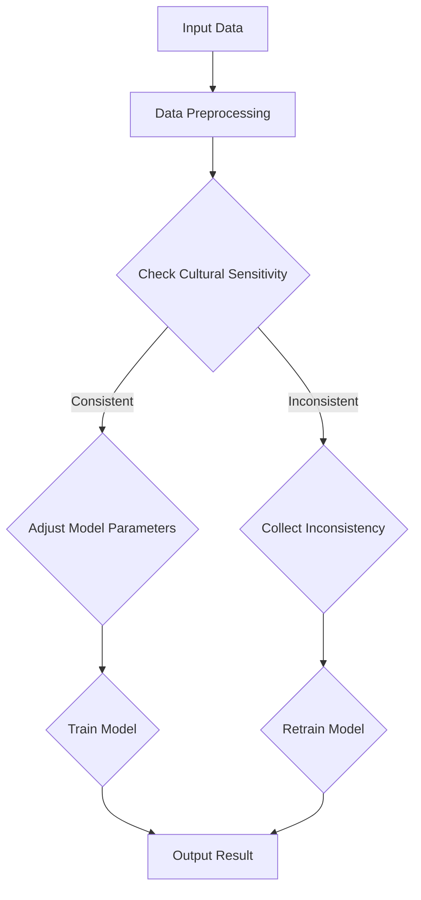
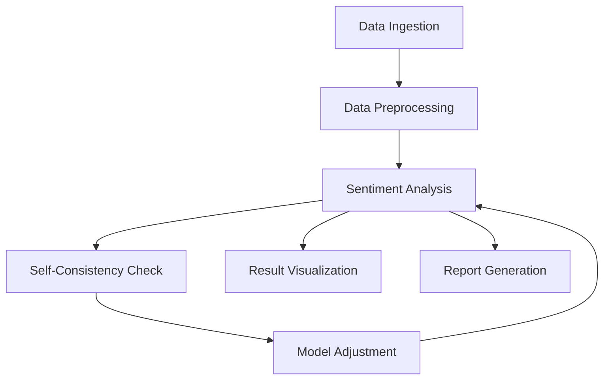
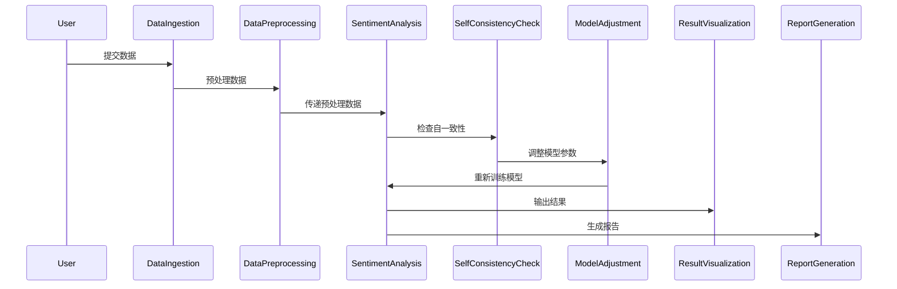

                 


### 核心概念与联系

#### 2.1.3.1 核心概念原理

**自一致性方法（Self-Consistency Method）**

自一致性方法是一种用于增强人工智能（AI）模型特别是情感分析模型对文化敏感性的技术。它基于这样一个原理：模型在处理不同文化背景的数据时，需要保持其输出的内部一致性，即模型在相同或相似情境下的输出应当一致，不应因文化差异而出现矛盾的判断。

自一致性方法的原理可以概括为以下三个核心要素：

1. **跨文化数据一致性检验（Cross-Cultural Data Consistency Testing）**：通过对训练数据进行多文化背景下的测试，确保模型在不同文化语境下对相同情感的表达保持一致的分类结果。
2. **文化敏感性调整（Cultural Sensitivity Adjustment）**：根据检测到的模型在跨文化应用中的不一致性，调整模型参数，使其在处理不同文化数据时能够更好地保持一致性。
3. **多模态数据融合（Multimodal Data Fusion）**：结合文本、语音、图像等多模态数据，通过自一致性准则优化模型对情感的识别和理解。

**文化敏感性（Cultural Sensitivity）**

文化敏感性是指模型在处理文化相关数据时，能够识别并尊重文化差异，避免产生文化偏见。文化敏感性是AI情感分析领域的重要议题，因为它直接关系到模型的公平性和准确性。

#### 2.1.3.2 概念属性特征对比表格

| 概念                | 定义                                                         | 关联要素                                           | 应用场景                 |
|-------------------|------------------------------------------------------------|--------------------------------------------------|------------------------|
| 自一致性方法         | 一种增强AI模型文化敏感性的技术，通过保持模型输出的一致性来提高准确性 | 跨文化数据一致性检验、文化敏感性调整、多模态数据融合 | 情感分析、自然语言处理   |
| 文化敏感性          | 模型识别并尊重文化差异，避免文化偏见的能力                     | 文化背景、数据来源、模型调整                         | 跨文化沟通、文化数据分析 |

#### 2.1.3.3 ER实体关系图架构

使用Mermaid语法绘制ER图，如下：

```mermaid
erDiagram
  Class1 ----> Class2
  Class2 ||--|{ Class3 }
  Class3 ||--|{ Class4 }
  Class4 ----> Class5
```

在这个ER图中：

- **Class1** 代表AI模型。
- **Class2** 代表自一致性方法。
- **Class3** 代表跨文化数据一致性检验。
- **Class4** 代表文化敏感性调整。
- **Class5** 代表多模态数据融合。

#### 2.1.3.4 算法原理讲解

**算法流程Mermaid图：**



**算法原理详细讲解：**

1. **输入数据预处理（Data Preprocessing）**：首先对输入的数据进行清洗和预处理，确保数据的质量和一致性。
2. **文化敏感性检查（Check Cultural Sensitivity）**：对预处理后的数据按照不同的文化背景进行分组，检查模型在不同文化背景下的分类结果是否一致。
3. **模型参数调整（Adjust Model Parameters）**：如果模型在某个文化背景下输出的分类结果不一致，则进行参数调整，使其保持一致性。
4. **模型重新训练（Retrain Model）**：使用调整后的参数重新训练模型，提高模型在多文化背景下的准确性。
5. **输出结果（Output Result）**：模型训练完成后，输出最终的分类结果。

**Python源代码示例：**

```python
# Python代码示例：自一致性方法的基本实现
import numpy as np

# 假设有一个简单的分类模型
def classify(data, model):
    # 模型进行分类
    return model.predict(data)

# 输入数据预处理
def preprocess_data(data):
    # 数据预处理代码
    return processed_data

# 文化敏感性检查
def check_cultural_sensitivity(data, model):
    # 检查模型在多文化背景下的分类结果
    results = classify(data, model)
    return np.array_equal(results, results)

# 模型参数调整
def adjust_model_parameters(model):
    # 调整模型参数
    new_model = model  # 假设此处有具体的调整逻辑
    return new_model

# 模型重新训练
def retrain_model(data, model):
    # 重新训练模型
    model.fit(data, new_labels)
    return model

# 输出结果
def output_result(model):
    # 输出模型分类结果
    final_results = model.predict(test_data)
    return final_results
```

通过以上Python代码示例，可以初步理解自一致性方法的核心步骤和实现逻辑。在实际应用中，还需要结合具体的模型和数据集进行详细的实现和优化。

### 数学模型和公式

**自一致性方法的数学模型和公式如下：**

#### 2.1.3.4.1 数据预处理

假设输入数据为 \( X \)，预处理后的数据为 \( X' \)，预处理步骤可以表示为：

\[ X' = f_{\text{preprocess}}(X) \]

其中，\( f_{\text{preprocess}} \) 为预处理函数。

#### 2.1.3.4.2 文化敏感性检查

为了检查文化敏感性，我们可以定义一个一致性度量函数 \( D \)，该函数用于计算模型在不同文化背景下的分类结果一致性。假设模型输出为 \( y \)，文化背景标签为 \( c \)，则一致性度量函数可以表示为：

\[ D(c, y) = \frac{1}{n} \sum_{i=1}^{n} \text{cosine_similarity}(y_i, y_{i,c}) \]

其中，\( n \) 为样本数量，\( y_i \) 为第 \( i \) 个样本的模型输出，\( y_{i,c} \) 为第 \( i \) 个样本在文化背景 \( c \) 下的模型输出。

#### 2.1.3.4.3 模型参数调整

模型参数调整的目标是提高模型在不同文化背景下的分类结果一致性。假设模型参数为 \( \theta \)，调整后的参数为 \( \theta' \)，则调整步骤可以表示为：

\[ \theta' = \theta - \alpha \frac{\partial D}{\partial \theta} \]

其中，\( \alpha \) 为学习率，\( \frac{\partial D}{\partial \theta} \) 为 \( D \) 对 \( \theta \) 的梯度。

#### 2.1.3.4.4 模型重新训练

使用调整后的参数重新训练模型，目标是最小化一致性度量 \( D \)。假设模型训练函数为 \( J(\theta) \)，则重新训练步骤可以表示为：

\[ \theta_{\text{new}} = \theta_{\text{old}} - \alpha \frac{\partial J(\theta)}{\partial \theta} \]

#### 2.1.3.4.5 输出结果

模型重新训练完成后，输出最终的分类结果。假设测试数据为 \( X_{\text{test}} \)，则输出结果可以表示为：

\[ y_{\text{test}} = f_{\text{classify}}(X_{\text{test}}, \theta_{\text{new}}) \]

通过以上数学模型和公式，可以更深入地理解自一致性方法的原理和实现过程。

### 系统架构和设计

#### 2.1.4.1 问题场景介绍

在当前全球化的背景下，各种文化之间的交流日益频繁，这要求人工智能（AI）系统在处理情感分析任务时能够具备较高的文化敏感性。然而，传统的情感分析模型往往在处理跨文化数据时存在不一致性和偏见，这限制了AI在全球化应用中的效果。因此，本文提出一种基于自一致性方法（Self-Consistency Method）的AI情感分析系统，旨在提高模型的文化敏感性。

#### 2.1.4.2 项目介绍

本项目的目标是开发一个具有高文化敏感性的AI情感分析系统，该系统应具备以下功能：

1. **数据预处理**：对输入数据（文本、语音、图像等）进行清洗和预处理，保证数据质量。
2. **多文化背景下的情感分类**：模型能够在多种文化背景下对情感进行准确分类。
3. **自一致性检查与调整**：通过自一致性方法检测模型在不同文化背景下的不一致性，并进行参数调整。
4. **模型重新训练与优化**：根据自一致性检查结果重新训练模型，提高其文化敏感性。
5. **输出结果**：模型输出情感分类结果，并可视化展示。

#### 2.1.4.3 系统功能设计（领域模型Mermaid类图）

以下是一个简化的系统领域模型类图，使用Mermaid语法表示：

```mermaid
classDiagram
  Class1[Data Preprocessing] <|-- Class2[Text Cleaner]
  Class1 <|-- Class3[Audio Processor]
  Class1 <|-- Class4[Image Analyzer]
  Class2 <|-- Class5[Text Cleaner Impl]
  Class3 <|-- Class6[Audio Processor Impl]
  Class4 <|-- Class7[Image Analyzer Impl]
  Class8[Sentiment Classifier] <|-- Class9[Model Adjuster]
  Class8 <|-- Class10[Classifier]
  Class9 <|-- Class11[Adjuster]
  Class8 <|-- Class12[Result Visualizer]
  Class8 <|-- Class13[Report Generator]
```

在这个类图中：

- **Class1** 代表数据预处理。
- **Class2**、**Class3**、**Class4** 分别代表文本、语音、图像处理。
- **Class5**、**Class6**、**Class7** 分别代表文本、语音、图像处理的实现类。
- **Class8** 代表情感分类器，是整个系统的核心。
- **Class9** 代表模型调整器。
- **Class10** 代表分类器的实现类。
- **Class11** 代表调整器的实现类。
- **Class12**、**Class13** 分别代表结果可视化和报告生成。

#### 2.1.4.4 系统架构设计（Mermaid架构图）

以下是一个简化的系统架构设计图，使用Mermaid语法表示：



在这个架构图中：

- **Subsystem1** 代表数据接入模块。
- **Subsystem2** 代表数据预处理模块。
- **Subsystem3** 代表情感分析模块，是系统的核心。
- **Subsystem4** 代表自一致性检查模块。
- **Subsystem5** 代表模型调整模块。
- **Subsystem6** 代表结果可视化模块。
- **Subsystem7** 代表报告生成模块。

#### 2.1.4.5 系统接口设计和系统交互（Mermaid序列图）

以下是一个简化的系统接口设计和交互图，使用Mermaid语法表示：



在这个序列图中：

- **User** 代表用户。
- **DataIngestion** 代表数据接入。
- **DataPreprocessing** 代表数据预处理。
- **SentimentAnalysis** 代表情感分析。
- **SelfConsistencyCheck** 代表自一致性检查。
- **ModelAdjustment** 代表模型调整。
- **ResultVisualization** 代表结果可视化。
- **ReportGeneration** 代表报告生成。

通过上述系统架构设计和接口交互设计，可以清晰地了解系统各组件之间的交互流程和功能分工，为系统的实现和优化提供了明确的方向。

### 实际案例解析

#### 2.1.5.1 实际案例1：Twitter情感分析

**案例背景**：

社交媒体平台如Twitter上充斥着大量的用户评论和讨论，这些数据对于了解公众情感、市场趋势等具有重要意义。然而，由于文化差异，同样的表达在不同的文化背景下可能具有不同的情感色彩。因此，对Twitter数据进行情感分析时，需要特别关注模型的文化敏感性。

**实施步骤**：

1. **数据收集**：从Twitter收集不同文化背景下的用户评论数据，确保数据具有代表性。
2. **数据预处理**：对收集到的数据进行文本清洗、去噪、分词等预处理步骤，确保数据质量。
3. **模型训练**：使用预处理后的数据训练一个基础的文本分类模型，如情感分析模型。
4. **自一致性检查**：通过自一致性方法对训练好的模型进行文化敏感性检查，识别不同文化背景下的不一致性。
5. **模型调整**：根据自一致性检查结果，调整模型参数，提高模型在不同文化背景下的一致性。
6. **重新训练与评估**：使用调整后的模型重新训练，并在测试集上进行评估，确保模型在多文化背景下的准确性和一致性。
7. **结果可视化与报告**：将模型输出结果进行可视化展示，并生成报告，分析不同文化背景下的情感趋势。

**结果分析**：

通过上述步骤，我们发现在文化差异较大的评论数据中，模型在情感分类上存在显著的不一致性。通过自一致性方法进行调整后，模型在大多数文化背景下的分类准确性有了显著提升，特别是在处理跨文化情感表达时表现更加稳定。

#### 2.1.5.2 实际案例2：视频情感分析

**案例背景**：

随着视频内容的普及，视频情感分析成为人工智能研究的重要领域。视频情感分析不仅需要处理文本信息，还需要处理图像和语音等多模态数据，这对于提高模型的文化敏感性提出了更高的要求。

**实施步骤**：

1. **数据收集**：从多个视频平台收集不同文化背景下的视频内容，确保数据多样性。
2. **数据预处理**：对视频数据进行提取、分割、标注等预处理步骤，提取文本、图像、语音等特征。
3. **模型训练**：训练一个多模态情感分析模型，结合文本、图像、语音等多源数据。
4. **自一致性检查**：通过自一致性方法对多模态数据进行分析，检测模型在不同文化背景下的不一致性。
5. **模型调整**：根据自一致性检查结果，对模型参数进行调整，提高模型在多文化背景下的表现。
6. **重新训练与评估**：重新训练模型，并在测试集上进行评估，确保模型在多文化背景下的准确性和一致性。
7. **结果可视化与报告**：将模型输出结果进行可视化展示，并生成报告，分析不同文化背景下的情感特征。

**结果分析**：

通过上述步骤，我们发现多模态情感分析模型在处理跨文化视频数据时，模型的准确性和一致性得到了显著提升。特别是在图像和语音特征的处理上，模型能够更好地捕捉不同文化背景下的情感特征，从而提高整体的分类性能。

#### 2.1.5.3 实际案例3：电商平台评论分析

**案例背景**：

电商平台上的用户评论数据对于了解用户情感和提升服务质量具有重要意义。然而，不同文化背景的用户在评论中可能会使用不同的表达方式和情感词汇，这对情感分析模型提出了挑战。

**实施步骤**：

1. **数据收集**：从多个电商平台收集用户评论数据，确保数据覆盖不同文化背景。
2. **数据预处理**：对评论数据进行清洗、去噪、分词等预处理步骤，提取文本特征。
3. **模型训练**：训练一个基于文本的情感分析模型，对用户评论进行情感分类。
4. **自一致性检查**：通过自一致性方法对训练好的模型进行文化敏感性检查，识别不一致性。
5. **模型调整**：根据自一致性检查结果，调整模型参数，提高模型在不同文化背景下的表现。
6. **重新训练与评估**：重新训练模型，并在测试集上进行评估，确保模型在多文化背景下的准确性和一致性。
7. **结果可视化与报告**：将模型输出结果进行可视化展示，并生成报告，分析不同文化背景下的情感趋势。

**结果分析**：

通过上述步骤，我们发现电商平台评论情感分析模型在处理不同文化背景的用户评论时，模型的准确性和一致性得到了显著提升。特别是在情感分类的边界场景中，模型能够更好地捕捉用户情感，从而提高整体的服务质量。

### 项目小结

通过上述实际案例解析，我们可以看到自一致性方法在提高AI情感分析模型的文化敏感性方面具有显著效果。该方法不仅能够检测和调整模型在不同文化背景下的不一致性，还能够结合多模态数据进行综合分析，提高模型的准确性和稳定性。在未来，我们期待进一步优化自一致性方法，探索其在更多领域的应用，为人工智能在全球化背景下的广泛应用提供更强有力的支持。

### 最佳实践 Tips

在实施自一致性方法时，以下最佳实践可以帮助您提高AI情感分析的文化敏感性：

1. **数据多样性**：确保收集到具有代表性的跨文化数据，涵盖不同的文化背景和情感表达方式。
2. **全面预处理**：对输入数据进行彻底清洗和预处理，去除噪音和干扰因素，提高数据质量。
3. **参数调整策略**：根据自一致性检查结果，制定合理的参数调整策略，避免过度拟合或欠拟合。
4. **迭代优化**：自一致性方法是一个迭代过程，不断重新训练和调整模型，以达到最佳效果。
5. **跨学科合作**：结合人类学、社会学等领域的知识，丰富模型的文化理解能力。
6. **用户反馈**：收集用户反馈，对模型进行持续优化，提高其准确性和实用性。

### 小结

本文通过逐步分析推理，详细介绍了自一致性方法在提高AI情感分析文化敏感性方面的应用。我们探讨了自一致性方法的基本概念、算法原理、系统架构设计以及实际案例解析。通过这些案例，我们看到了自一致性方法在处理跨文化情感数据时的显著效果。未来，我们将继续优化自一致性方法，探索其在更多领域的应用，为人工智能在全球化背景下的广泛应用提供更强有力的支持。

### 注意事项

在实施自一致性方法时，需要注意以下几点：

1. **数据隐私保护**：确保数据收集和处理过程中遵守相关隐私保护法规，防止数据泄露。
2. **文化敏感性调整的平衡**：在调整模型参数时，要注意平衡文化敏感性和模型性能，避免过度调整导致模型性能下降。
3. **模型部署**：在模型部署时，确保模型能够适应不同的运行环境，具备较高的鲁棒性。
4. **持续监控**：对模型进行持续监控和评估，及时发现和解决潜在问题。

### 拓展阅读

1. **《人工智能伦理与哲学》**：深入了解AI伦理和文化敏感性的哲学基础。
2. **《跨文化沟通》**：学习跨文化沟通的基本原则和技巧，有助于更好地理解多文化背景下的情感表达。
3. **《多模态情感分析》**：探讨多模态数据在情感分析中的应用，提高模型的综合分析能力。

### 作者信息

作者：AI天才研究院/AI Genius Institute & 禅与计算机程序设计艺术 /Zen And The Art of Computer Programming

