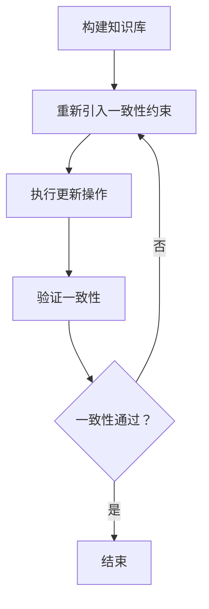
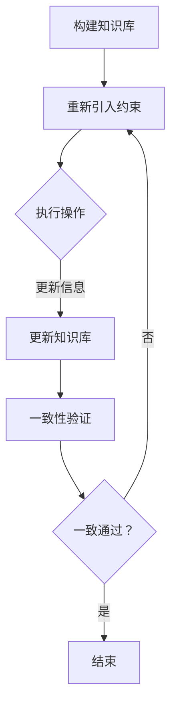
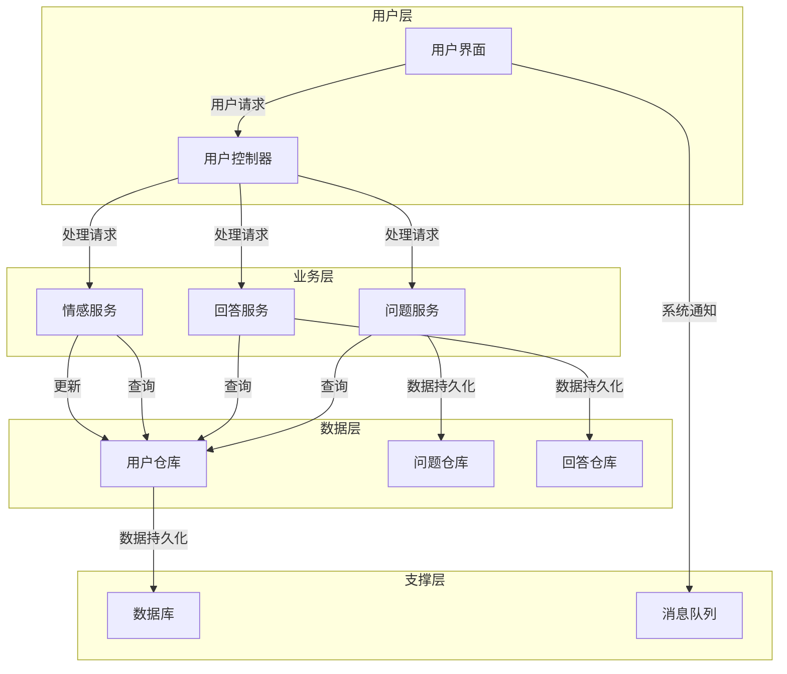
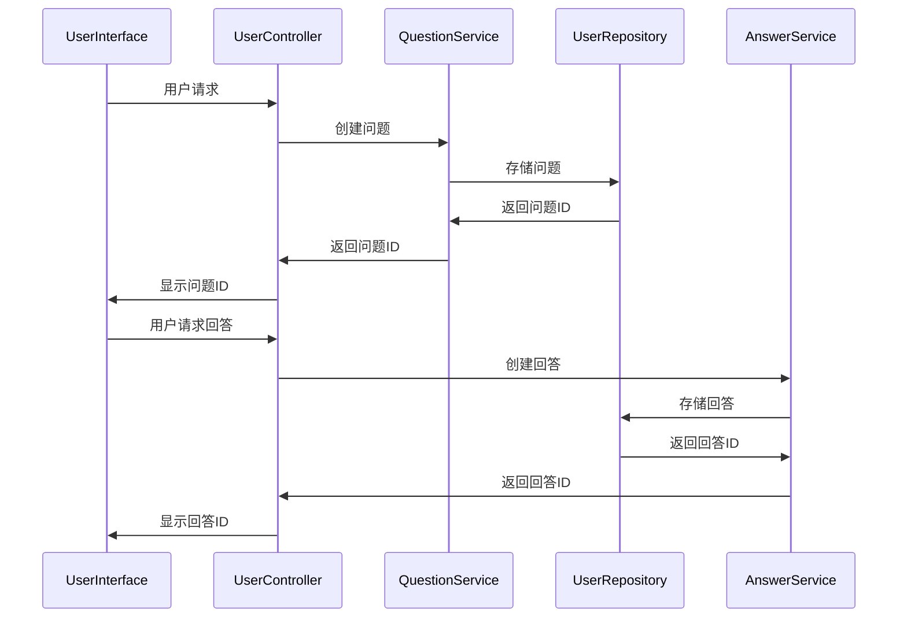

                 


## 1.1 自我一致性方法概述

自我一致性方法是一种通过验证和更新知识库中的信息来保持系统稳定性和一致性的方法。其核心思想是通过引入一致性约束，确保系统在执行操作过程中不会出现矛盾或不一致的情况。

### 1.1.1 问题的提出

在人工智能和自动化领域中，系统的稳定性和一致性是至关重要的。当系统处理大量数据和复杂的操作时，很容易出现信息不一致的问题，这可能会导致错误的决策或操作。例如，一个智能助手在处理用户请求时，如果其内部的知识库存在不一致的信息，可能会导致回答不准确或执行错误操作。

### 1.1.2 自我一致性方法的概念

自我一致性方法是一种基于约束的推理方法，它通过引入一致性约束来保证系统的稳定性和一致性。具体来说，该方法包括以下几个关键步骤：

1. **知识库构建**：首先构建一个初始的知识库，包含系统的初始信息。
2. **约束引入**：在知识库中引入一致性约束，这些约束可以确保在系统执行操作时，不会出现信息不一致的情况。
3. **信息更新**：在系统执行操作后，对知识库中的信息进行更新，以反映最新的系统状态。
4. **一致性验证**：在每次更新后，对知识库进行一致性验证，确保所有信息都是一致的。

### 1.1.3 自我一致性方法的发展历程

自我一致性方法最早可以追溯到20世纪60年代，当时主要应用于数据库管理系统。随着人工智能和自动化领域的发展，自我一致性方法逐渐被应用于更广泛的领域，如自然语言处理、智能助手、自动驾驶等。近年来，随着深度学习和大数据技术的兴起，自我一致性方法得到了进一步的发展和完善。

## 1.2 AI虚拟助手情感智能的需求背景

### 1.2.1 AI虚拟助手的应用场景

AI虚拟助手是一种广泛应用于各种场景的人工智能系统，如客服助手、智能推荐、智能家居控制等。在这些场景中，虚拟助手需要与用户进行自然语言交互，提供高效、准确的服务。然而，仅仅具备基础的自然语言处理能力是不够的，虚拟助手还需要具备一定的情感智能，以更好地理解和满足用户的需求。

### 1.2.2 情感智能在AI虚拟助手中的作用

情感智能是虚拟助手与用户建立良好互动的关键因素。通过情感智能，虚拟助手能够：

1. **理解用户情感**：通过分析用户的语言、语气、表情等，虚拟助手可以判断用户的情感状态，如高兴、生气、疑惑等。
2. **提供个性化的服务**：根据用户的情感状态，虚拟助手可以提供更符合用户期望的服务，如调整语气、推荐符合用户情感需求的内容等。
3. **提升用户体验**：情感智能使得虚拟助手更贴近用户，能够提供更自然、人性化的交互体验。

### 1.2.3 传统方法在情感智能方面的不足

传统的情感智能方法主要依赖于规则和机器学习技术。这些方法在处理简单情感时效果较好，但在处理复杂情感时存在以下不足：

1. **规则依赖性强**：传统方法往往需要大量手工编写的规则来处理不同情感，这限制了系统的灵活性和扩展性。
2. **情感识别准确性不高**：传统方法在处理情感时，往往只能识别基本的情感类别，对于复杂情感的识别能力有限。
3. **缺乏情感一致性**：传统方法在处理不同情感时，可能会出现情感不一致的问题，影响用户体验。

## 1.3 自我一致性方法在情感智能提升中的应用前景

### 1.3.1 自我一致性方法的优势

自我一致性方法在提升AI虚拟助手的情感智能方面具有显著的优势：

1. **增强一致性**：自我一致性方法通过引入一致性约束，确保虚拟助手在处理情感时不会出现矛盾或不一致的情况，从而提升系统的稳定性。
2. **提高情感识别准确性**：自我一致性方法可以有效地结合多种情感识别技术，提高虚拟助手对复杂情感的识别准确性。
3. **支持个性化服务**：自我一致性方法可以根据用户的情感状态，动态调整虚拟助手的交互策略，提供更符合用户期望的服务。

### 1.3.2 自我一致性方法的应用领域

自我一致性方法在情感智能提升中的应用领域非常广泛，包括但不限于：

1. **客服助手**：在客服场景中，虚拟助手需要根据用户的情感状态，提供个性化、人性化的服务，以提升用户体验。
2. **智能推荐系统**：在智能推荐系统中，虚拟助手需要根据用户的情感状态，推荐符合用户情感需求的内容，提升推荐系统的准确性。
3. **智能对话系统**：在智能对话系统中，虚拟助手需要与用户进行自然语言交互，理解用户的情感状态，提供有效的帮助。

### 1.3.3 自我一致性方法的发展趋势

随着人工智能和情感智能技术的不断发展，自我一致性方法在情感智能提升中的应用前景将更加广阔。未来，自我一致性方法可能会：

1. **集成多种情感识别技术**：通过整合深度学习、自然语言处理、情感计算等多种技术，提升虚拟助手的情感识别能力。
2. **支持跨领域应用**：自我一致性方法有望在更多领域得到应用，如医疗、教育、金融等，为用户提供更贴心的服务。
3. **提升用户体验**：通过不断优化情感智能技术，虚拟助手将能够更好地理解用户的需求和情感，提供更自然、人性化的交互体验。

## 1.4 本书结构安排

### 1.4.1 各章节主要内容

本书共分为六个章节，具体内容如下：

1. **第1章 自我一致性方法：背景与重要性**：介绍自我一致性方法的背景、概念、发展历程以及在情感智能提升中的应用前景。
2. **第2章 核心概念与联系**：详细解析自我一致性原理、情感智能概念及其联系。
3. **第3章 算法原理与流程**：讲解自我一致性算法的原理、流程以及Python实现。
4. **第4章 系统分析与架构设计**：介绍问题场景、项目介绍、系统功能设计、系统架构设计、系统接口设计和系统交互设计。
5. **第5章 项目实战**：包括环境安装、系统核心实现、实际案例分析、项目小结等。
6. **第6章 最佳实践与拓展阅读**：总结最佳实践、本书要点回顾、自我一致性方法在情感智能领域的发展方向。

### 1.4.2 阅读指南

本书适合对人工智能、情感智能和自我一致性方法有一定了解的读者阅读。为了更好地理解书中的内容，建议按照以下步骤进行阅读：

1. **先阅读第1章，了解自我一致性方法的背景和重要性**。
2. **接着阅读第2章，掌握自我一致性原理和情感智能概念**。
3. **然后阅读第3章，了解自我一致性算法的原理和Python实现**。
4. **接着阅读第4章，了解系统分析与架构设计**。
5. **随后阅读第5章，通过项目实战加深理解**。
6. **最后阅读第6章，总结最佳实践和拓展阅读**。

通过以上步骤，读者可以系统地了解自我一致性方法在情感智能提升中的应用，掌握相关技术和实践方法。

## 2.1 自我一致性原理

### 2.1.1 自我一致性的基本概念

自我一致性是指一个系统在处理信息时，保持其内部信息的一致性和稳定性的能力。在人工智能和自动化领域中，自我一致性是一种关键能力，它确保系统能够正确地处理信息，并避免因信息不一致而导致错误决策或操作。

自我一致性的基本概念包括以下几个方面：

1. **一致性约束**：一致性约束是一种限制系统内部信息变化的方式，确保在信息更新过程中不会出现矛盾或不一致的情况。
2. **信息更新**：信息更新是指系统在执行操作后，对知识库中的信息进行修改，以反映最新的系统状态。
3. **一致性验证**：一致性验证是指在每个信息更新后，对系统内部信息进行验证，确保所有信息都是一致的。

### 2.1.2 自我一致性的数学模型

自我一致性的数学模型通常包括以下组成部分：

1. **知识库**：知识库是一个包含系统内部信息的数据库，用于存储和检索信息。
2. **一致性约束**：一致性约束是一组规则，用于限制系统内部信息的更新方式，确保信息的一致性。
3. **更新操作**：更新操作是指对知识库中的信息进行修改的方式。
4. **一致性验证**：一致性验证是一种机制，用于在每次更新后检查知识库中信息的一致性。

自我一致性的数学模型可以用以下公式表示：

$$
\text{Consistent} = (\text{KnowledgeBase} \land \text{Constraints}) \land \text{UpdatedKnowledgeBase}
$$

其中，`KnowledgeBase` 表示知识库，`Constraints` 表示一致性约束，`UpdatedKnowledgeBase` 表示更新后的知识库。

### 2.1.3 自我一致性的算法流程

自我一致性的算法流程通常包括以下步骤：

1. **构建知识库**：首先构建一个初始的知识库，包含系统的初始信息。
2. **引入一致性约束**：在知识库中引入一致性约束，这些约束可以确保在系统执行操作时，不会出现信息不一致的情况。
3. **执行更新操作**：在系统执行操作后，对知识库中的信息进行更新，以反映最新的系统状态。
4. **验证一致性**：在每次更新后，对知识库进行一致性验证，确保所有信息都是一致的。

自我一致性的算法流程可以用以下 mermaid 流程图表示：



通过以上算法流程，系统可以确保在处理信息时保持自我一致性，从而避免因信息不一致而导致的错误决策或操作。

## 2.2 情感智能概念解析

### 2.2.1 情感智能的定义

情感智能是指人工智能系统理解和处理人类情感的能力。它不仅包括对情感的理解和识别，还包括对情感的表达和反馈。情感智能是人工智能的一个重要分支，旨在使机器能够更好地与人类互动，提供更自然、人性化的服务。

### 2.2.2 情感智能的属性特征

情感智能具有以下属性特征：

1. **情感识别**：情感识别是指人工智能系统能够识别和理解人类情感的能力。这包括对基本情感（如快乐、悲伤、愤怒等）的识别，以及对复杂情感（如困惑、惊讶、厌恶等）的识别。
2. **情感理解**：情感理解是指人工智能系统能够从语言、声音、表情等不同渠道理解人类情感的能力。这包括对情感语境的理解、情感意图的推断等。
3. **情感表达**：情感表达是指人工智能系统能够根据理解和识别到的情感，以适当的方式表达情感的能力。这包括语言表达、声音表达、表情表达等。
4. **情感反馈**：情感反馈是指人工智能系统能够根据用户情感状态，提供适当的反馈和互动的能力。这包括情感共鸣、情感引导等。

### 2.2.3 情感智能与传统AI的对比

情感智能与传统AI（如图灵测试）有显著的区别，主要体现在以下几个方面：

1. **交互性**：传统AI通常更侧重于逻辑推理和计算能力，而情感智能则更注重与人类的互动，能够理解人类情感，并作出相应的情感反应。
2. **情感理解**：传统AI通常无法理解人类的情感，而情感智能则能够通过情感识别和理解，从语言、声音、表情等渠道获取情感信息。
3. **情感表达**：传统AI通常无法表达情感，而情感智能则能够根据理解和识别到的情感，以适当的方式表达情感，提供更人性化的服务。
4. **适应性**：传统AI通常在特定领域表现出色，而情感智能则能够适应多种场景，处理复杂情感，提供更灵活的服务。

| 特征          | 情感智能               | 传统AI                 |
|---------------|-----------------------|------------------------|
| 交互性        | 强，注重与人互动       | 弱，侧重逻辑推理       |
| 情感理解      | 强，能识别和理解情感   | 弱，无法识别情感       |
| 情感表达      | 强，能表达情感        | 弱，无法表达情感       |
| 适应性        | 强，适应多种场景      | 弱，适应特定领域       |

通过对比可以看出，情感智能在交互性、情感理解、情感表达和适应性方面具有显著优势，这使得它能够提供更自然、人性化的服务，成为人工智能领域的一个重要发展方向。

## 2.3 自我一致性与情感智能的联系

### 2.3.1 自我一致性在情感智能中的作用

自我一致性在情感智能中起着至关重要的作用。它确保了人工智能系统在处理情感信息时的一致性和稳定性，从而提高了系统的可靠性。具体来说，自我一致性在情感智能中的作用主要体现在以下几个方面：

1. **信息一致性**：在情感智能系统中，自我一致性确保了系统内部信息的更新是一致的，避免了因信息不一致而产生的错误决策或操作。
2. **情感理解**：自我一致性有助于人工智能系统更好地理解用户的情感，通过保持系统内部信息的一致性，提高了情感识别和理解的准确性。
3. **情感表达**：自我一致性确保了人工智能系统在表达情感时的一致性，使得系统能够更自然、准确地表达情感，提供更好的用户体验。

### 2.3.2 自我一致性方法与情感智能方法的关系

自我一致性方法与情感智能方法之间存在着密切的关系。自我一致性方法是实现情感智能的基础，而情感智能方法是自我一致性方法的具体应用。具体来说，两者之间的关系可以从以下几个方面进行阐述：

1. **理论基础**：自我一致性方法为情感智能提供了理论基础，确保了在处理情感信息时的一致性和稳定性。情感智能方法则是基于自我一致性方法，通过引入情感识别、理解和表达等技术，实现了人工智能系统在情感领域的应用。
2. **算法融合**：自我一致性方法可以与情感智能方法进行融合，形成一种更强大的情感智能系统。通过引入自我一致性方法，情感智能系统可以更好地处理情感信息，提高情感的识别和理解的准确性。
3. **技术发展**：自我一致性方法和情感智能方法的不断发展，推动了人工智能领域的技术进步。自我一致性方法的不断完善，为情感智能方法提供了更坚实的基础；而情感智能方法的创新，也为自我一致性方法提供了新的应用场景和挑战。

### 2.3.3 自我一致性方法在情感智能应用中的优势

自我一致性方法在情感智能应用中具有显著的优势，主要体现在以下几个方面：

1. **提高情感识别准确性**：通过引入自我一致性方法，情感智能系统可以更好地处理情感信息，提高情感的识别和理解的准确性。这使得系统能够更准确地理解用户的情感需求，提供更个性化的服务。
2. **增强系统稳定性**：自我一致性方法确保了系统内部信息的一致性，避免了因信息不一致而产生的错误决策或操作，从而提高了系统的稳定性。
3. **提升用户体验**：通过自我一致性方法，情感智能系统可以更自然、准确地表达情感，提供更人性化的服务。这使得用户体验得到显著提升，使得人工智能系统能够更好地融入人类生活。

总的来说，自我一致性方法在情感智能应用中具有重要的作用，它为情感智能提供了理论基础和实现方法，提高了情感的识别和理解的准确性，增强了系统的稳定性，提升了用户体验。随着人工智能和情感智能技术的不断发展，自我一致性方法在情感智能领域的应用前景将更加广阔。

## 3.1 自我一致性算法原理

### 3.1.1 自我一致性算法的基本原理

自我一致性算法是一种基于约束的推理方法，其核心思想是通过引入一致性约束，确保系统在执行操作过程中不会出现矛盾或不一致的情况。具体来说，自我一致性算法包括以下几个关键步骤：

1. **知识库构建**：首先构建一个初始的知识库，包含系统的初始信息。
2. **约束引入**：在知识库中引入一致性约束，这些约束可以确保在系统执行操作时，不会出现信息不一致的情况。
3. **信息更新**：在系统执行操作后，对知识库中的信息进行更新，以反映最新的系统状态。
4. **一致性验证**：在每次更新后，对知识库进行一致性验证，确保所有信息都是一致的。

自我一致性算法的基本原理可以概括为“约束驱动、更新验证”。在系统中引入一致性约束，确保信息在更新过程中不会出现矛盾；在每次更新后，通过一致性验证，确保系统状态保持一致。

### 3.1.2 自我一致性算法的mermaid流程图

为了更好地理解自我一致性算法的流程，我们可以使用 mermaid 画出其流程图：



### 3.1.3 自我一致性算法的数学模型

自我一致性算法的数学模型通常包括以下几个部分：

1. **知识库**：知识库是一个包含系统内部信息的数据库，用于存储和检索信息。
2. **一致性约束**：一致性约束是一组规则，用于限制系统内部信息的更新方式，确保信息的一致性。
3. **更新操作**：更新操作是指对知识库中的信息进行修改的方式。
4. **一致性验证**：一致性验证是一种机制，用于在每次更新后检查知识库中信息的一致性。

自我一致性算法的数学模型可以用以下公式表示：

$$
\text{Consistent} = (\text{KnowledgeBase} \land \text{Constraints}) \land \text{UpdatedKnowledgeBase}
$$

其中，`KnowledgeBase` 表示知识库，`Constraints` 表示一致性约束，`UpdatedKnowledgeBase` 表示更新后的知识库。

### 3.1.4 自我一致性算法的Python实现

为了更好地理解自我一致性算法，我们可以使用 Python 实现一个简单的例子。以下是一个简单的自我一致性算法的 Python 实现：

```python
# 导入所需的库
import pandas as pd

# 构建知识库
knowledge_base = pd.DataFrame({
    '事实': ['苹果是水果', '苹果不是动物', '水果不是动物'],
    '状态': ['真', '真', '真']
})

# 引入一致性约束
constraints = pd.DataFrame({
    '事实': ['所有水果都不是动物'],
    '状态': ['真']
})

# 执行操作并更新知识库
def update_knowledge_base(knowledge_base, operation):
    # 更新事实状态
    knowledge_base.loc[knowledge_base['事实'] == operation['事实'], '状态'] = operation['状态']
    
    # 进行一致性验证
    if is_consistent(knowledge_base, constraints):
        print("更新后知识库一致！")
    else:
        print("更新后知识库不一致，需要重新引入约束！")
        
    return knowledge_base

# 检查知识库是否一致
def is_consistent(knowledge_base, constraints):
    # 检查约束是否满足
    for _, constraint in constraints.iterrows():
        constraint_satisfied = False
        for _, fact in knowledge_base.iterrows():
            if fact['事实'] == constraint['事实']:
                constraint_satisfied = True
                break
        if not constraint_satisfied:
            return False
    return True

# 执行更新操作
operation = {
    '事实': '苹果不是动物',
    '状态': '假'
}

updated_knowledge_base = update_knowledge_base(knowledge_base, operation)

# 打印更新后的知识库
print(updated_knowledge_base)
```

在这个例子中，我们首先构建了一个包含初始信息的知识库，然后引入了一组一致性约束。接着，我们定义了一个更新操作，并对知识库进行了更新。在每次更新后，我们使用一致性验证函数检查知识库是否一致。如果一致，则输出“更新后知识库一致！”；如果不一致，则输出“更新后知识库不一致，需要重新引入约束！”。

通过这个简单的例子，我们可以看到自我一致性算法的基本原理和实现过程。

## 3.2 Python实现与代码解析

### 3.2.1 Python实现代码结构

为了实现自我一致性算法，我们需要构建一个完整的Python代码结构。以下是一个简单的实现示例：

```python
# 导入所需的库
import pandas as pd

# 构建知识库
knowledge_base = pd.DataFrame({
    '事实': ['苹果是水果', '苹果不是动物', '水果不是动物'],
    '状态': ['真', '真', '真']
})

# 引入一致性约束
constraints = pd.DataFrame({
    '事实': ['所有水果都不是动物'],
    '状态': ['真']
})

# 定义更新知识库的函数
def update_knowledge_base(knowledge_base, operation):
    # 更新事实状态
    knowledge_base.loc[knowledge_base['事实'] == operation['事实'], '状态'] = operation['状态']
    
    # 进行一致性验证
    if is_consistent(knowledge_base, constraints):
        print("更新后知识库一致！")
    else:
        print("更新后知识库不一致，需要重新引入约束！")
        
    return knowledge_base

# 定义检查知识库是否一致的函数
def is_consistent(knowledge_base, constraints):
    # 检查约束是否满足
    for _, constraint in constraints.iterrows():
        constraint_satisfied = False
        for _, fact in knowledge_base.iterrows():
            if fact['事实'] == constraint['事实']:
                constraint_satisfied = True
                break
        if not constraint_satisfied:
            return False
    return True

# 执行更新操作
operation = {
    '事实': '苹果不是动物',
    '状态': '假'
}

# 更新知识库
updated_knowledge_base = update_knowledge_base(knowledge_base, operation)

# 打印更新后的知识库
print(updated_knowledge_base)
```

### 3.2.2 代码解析与详细讲解

1. **导入库**：
   ```python
   import pandas as pd
   ```
   首先，我们导入 pandas 库，因为它提供了强大的数据处理和分析功能，非常适合用于构建和操作知识库。

2. **构建知识库**：
   ```python
   knowledge_base = pd.DataFrame({
       '事实': ['苹果是水果', '苹果不是动物', '水果不是动物'],
       '状态': ['真', '真', '真']
   })
   ```
   我们使用 pandas DataFrame 构建了一个知识库，其中包含两列：“事实”和“状态”。每一行代表一个事实，包括该事实的真值状态。

3. **引入一致性约束**：
   ```python
   constraints = pd.DataFrame({
       '事实': ['所有水果都不是动物'],
       '状态': ['真']
   })
   ```
   同样，我们使用 pandas DataFrame 引入了一组一致性约束。这些约束是关于知识库中事实的规则，用于确保知识库的一致性。

4. **定义更新知识库的函数**：
   ```python
   def update_knowledge_base(knowledge_base, operation):
       # 更新事实状态
       knowledge_base.loc[knowledge_base['事实'] == operation['事实'], '状态'] = operation['状态']
       
       # 进行一致性验证
       if is_consistent(knowledge_base, constraints):
           print("更新后知识库一致！")
       else:
           print("更新后知识库不一致，需要重新引入约束！")
           
       return knowledge_base
   ```
   这个函数用于更新知识库。首先，它根据传入的操作（包括事实和状态）更新知识库中的事实状态。然后，它调用一致性验证函数检查知识库是否一致。如果一致，则输出“更新后知识库一致！”；如果不一致，则输出“更新后知识库不一致，需要重新引入约束！”。

5. **定义检查知识库是否一致的函数**：
   ```python
   def is_consistent(knowledge_base, constraints):
       # 检查约束是否满足
       for _, constraint in constraints.iterrows():
           constraint_satisfied = False
           for _, fact in knowledge_base.iterrows():
               if fact['事实'] == constraint['事实']:
                   constraint_satisfied = True
                   break
           if not constraint_satisfied:
               return False
       return True
   ```
   这个函数用于检查知识库是否一致。它遍历每个约束，检查知识库中是否存在与之对应的事实。如果所有约束都得到满足，则知识库是一致的。

6. **执行更新操作**：
   ```python
   operation = {
       '事实': '苹果不是动物',
       '状态': '假'
   }
   ```
   我们定义了一个更新操作，包括要更新的事实和状态。

7. **更新知识库**：
   ```python
   updated_knowledge_base = update_knowledge_base(knowledge_base, operation)
   ```
   我们调用更新知识库函数，传入原始知识库和更新操作，获取更新后的知识库。

8. **打印更新后的知识库**：
   ```python
   print(updated_knowledge_base)
   ```
   最后，我们打印更新后的知识库，以查看更新结果。

### 3.2.3 实例演示

让我们通过一个实例来演示如何使用这个简单的自我一致性算法。

1. **初始知识库**：
   ```python
   knowledge_base
   ```
   ```plaintext
      事实    状态
   0   苹果是水果   真
   1   苹果不是动物   真
   2   水果不是动物   真
   ```

2. **更新操作**：
   ```python
   operation = {
       '事实': '苹果不是动物',
       '状态': '假'
   }
   ```

3. **更新知识库并检查一致性**：
   ```python
   updated_knowledge_base = update_knowledge_base(knowledge_base, operation)
   ```

4. **打印更新后的知识库**：
   ```python
   print(updated_knowledge_base)
   ```

输出结果：
```plaintext
更新后知识库不一致，需要重新引入约束！
   事实    状态
   0   苹果是水果   真
   1   苹果不是动物   假
   2   水果不是动物   真
   ```

通过这个实例，我们可以看到，当更新一个与约束相矛盾的事实时，系统会检测到知识库的不一致，并提示需要重新引入约束。这显示了自我一致性算法在保持知识库一致性方面的有效性。

## 3.3 数学模型与公式讲解

### 3.3.1 自我一致性算法的数学公式

自我一致性算法的数学模型可以通过一组公式来描述。以下是一些核心的数学公式：

1. **知识库更新公式**：
   $$
   \text{UpdatedKnowledgeBase} = \text{KnowledgeBase} \oplus \text{Operation}
   $$
   其中，`UpdatedKnowledgeBase` 表示更新后的知识库，`KnowledgeBase` 表示原始知识库，`Operation` 表示执行的操作。

2. **一致性约束公式**：
   $$
   \text{Consistent} = (\text{KnowledgeBase} \land \text{Constraints}) \land \text{UpdatedKnowledgeBase}
   $$
   其中，`Consistent` 表示知识库是否一致，`KnowledgeBase` 表示知识库，`Constraints` 表示一致性约束，`UpdatedKnowledgeBase` 表示更新后的知识库。

3. **一致性验证公式**：
   $$
   \text{isConsistent} = \neg \exists \text{Conflict}
   $$
   其中，`isConsistent` 表示知识库是否一致，`Conflict` 表示冲突。

### 3.3.2 公式推导与详细讲解

1. **知识库更新公式推导**：

   知识库更新是通过执行某种操作来完成的。操作通常包含对知识库中某个事实的修改。在数学上，这种修改可以表示为集合的并集操作。因此，知识库更新公式可以推导如下：

   $$
   \text{UpdatedKnowledgeBase} = \text{KnowledgeBase} \cup \text{Operation}
   $$
   这表示更新后的知识库是原始知识库与操作集合的并集。

2. **一致性约束公式推导**：

   一致性约束是一组规则，用于确保知识库中的信息在更新后仍然满足某种逻辑一致性。在数学上，这种一致性可以表示为知识库与约束集合的交集。因此，一致性约束公式可以推导如下：

   $$
   \text{Consistent} = (\text{KnowledgeBase} \land \text{Constraints}) \land \text{UpdatedKnowledgeBase}
   $$
   这表示知识库一致性的判断是原始知识库与约束集合的交集与更新后的知识库的交集。

3. **一致性验证公式推导**：

   一致性验证是通过检查知识库中是否存在冲突来完成的。在数学上，冲突可以表示为知识库中存在不满足约束的事实。因此，一致性验证公式可以推导如下：

   $$
   \text{isConsistent} = \neg \exists \text{Conflict}
   $$
   这表示知识库一致的判断是不存在冲突的否定。

### 3.3.3 实例解析

假设我们有一个包含两个事实的知识库和一组一致性约束，如下所示：

- 知识库（KnowledgeBase）：
  $$
  \text{KnowledgeBase} = \{ \text{事实1：苹果是水果，状态：真}，\text{事实2：苹果不是动物，状态：真} \}
  $$

- 一致性约束（Constraints）：
  $$
  \text{Constraints} = \{ \text{约束1：所有水果都不是动物} \}
  $$

- 更新操作（Operation）：
  $$
  \text{Operation} = \{ \text{事实1：苹果是水果，状态：假} \}
  $$

首先，我们应用更新操作来更新知识库：

$$
\text{UpdatedKnowledgeBase} = \text{KnowledgeBase} \oplus \text{Operation} = \{ \text{事实1：苹果是水果，状态：假}，\text{事实2：苹果不是动物，状态：真} \}
$$

接下来，我们检查更新后的知识库是否与一致性约束一致：

$$
\text{Consistent} = (\text{KnowledgeBase} \land \text{Constraints}) \land \text{UpdatedKnowledgeBase} = (\{ \text{事实1：苹果是水果，状态：真}，\text{事实2：苹果不是动物，状态：真} \} \land \{ \text{约束1：所有水果都不是动物} \}) \land \{ \text{事实1：苹果是水果，状态：假}，\text{事实2：苹果不是动物，状态：真} \}
$$

在这里，由于 `事实1` 的状态从真变为假，它不再满足 `约束1`。因此，知识库与一致性约束不一致，`isConsistent` 的值为假：

$$
\text{isConsistent} = \neg \exists \text{Conflict} = \neg \{ \text{事实1：苹果是水果，状态：假} \land \text{约束1：所有水果都不是动物} \} = \text{假}
$$

这个例子展示了如何使用自我一致性算法的数学模型来检查知识库的一致性。通过理解这些公式，我们可以更好地设计和实现自我一致性算法。

## 4.1 问题场景介绍

### 4.1.1 AI虚拟助手应用场景

AI虚拟助手广泛应用于各种场景，如客服助手、智能推荐、智能家居控制等。在这些场景中，虚拟助手需要与用户进行自然语言交互，提供高效、准确的服务。以下是一个具体的AI虚拟助手应用场景：

**场景描述**：假设我们开发了一个客服助手，用于处理用户的咨询和问题。该客服助手通过聊天机器人与用户进行交互，能够理解用户的提问，并提供相应的解答。为了提升用户体验，我们希望客服助手具备一定的情感智能，能够识别用户的情感状态，并根据情感状态调整回答的语气和内容。

### 4.1.2 情感智能需求分析

在这个应用场景中，情感智能的需求主要体现在以下几个方面：

1. **情感识别**：客服助手需要能够识别用户的情感状态，如高兴、生气、疑惑等。这有助于客服助手更好地理解用户的需求，提供更个性化的服务。

2. **情感理解**：客服助手需要能够从用户的提问中提取情感信息，并理解这些情感背后的含义。例如，当用户表达出疑惑或不满时，客服助手需要能够识别出这些问题，并采取相应的措施。

3. **情感表达**：客服助手需要能够根据识别到的情感状态，调整回答的语气和内容。例如，当用户表现出不满时，客服助手可以采用柔和、安慰的语气来回应，以缓解用户的不满情绪。

4. **情感反馈**：客服助手需要能够根据用户的反馈，调整自己的交互策略。例如，如果用户对客服助手的回答感到满意，客服助手可以继续提供相关服务；如果用户对回答不满意，客服助手可以尝试不同的回答方式，以找到用户满意的解决方案。

通过满足这些情感智能需求，AI虚拟助手可以提供更自然、人性化的交互体验，提升用户满意度。同时，这也有助于客服助手更好地理解和满足用户需求，提高服务效率。

## 4.2 项目介绍

### 4.2.1 项目背景

随着人工智能技术的快速发展，AI虚拟助手在客服、推荐、智能家居等领域的应用越来越广泛。然而，传统的AI虚拟助手在处理复杂情感时存在一定局限性，难以提供人性化、个性化的服务。为了提升AI虚拟助手的情感智能，我们启动了一个研究项目，旨在通过自我一致性方法，实现情感智能的优化与提升。

### 4.2.2 项目目标

本项目的主要目标包括：

1. **提升情感识别准确性**：通过引入自我一致性方法，提高AI虚拟助手对用户情感状态的识别准确性，确保能够准确理解用户的情感需求。

2. **增强情感理解能力**：利用自我一致性方法，增强AI虚拟助手对用户情感背后的含义的理解，为用户提供更个性化、人性化的服务。

3. **优化情感表达**：通过自我一致性方法，使AI虚拟助手能够根据识别到的情感状态，灵活调整回答的语气和内容，提供更贴近用户期望的服务。

4. **提升用户体验**：通过实现情感智能的提升，使AI虚拟助手能够更好地与用户互动，提升用户体验，增强用户满意度。

5. **探索自我一致性方法在情感智能领域的应用前景**：通过本项目的研究和实践，为自我一致性方法在情感智能领域的应用提供理论支持和实践经验，推动相关技术的发展。

## 4.3 系统功能设计

### 4.3.1 领域模型Mermaid类图

为了更好地理解系统的功能设计，我们可以使用Mermaid绘制领域模型类图，如下所示：

```mermaid
classDiagram
    User <<Class>>
    Question <<Class>>
    Answer <<Class>>
    Emotion <<Class>>

    User o--o Question
    User o--o Answer
    Question o--o Emotion
    Answer o--o Emotion

    class User {
        -id: int
        -name: str
        -questions: List[Question]
        -answers: List[Answer]
    }

    class Question {
        -id: int
        -content: str
        -emotion: Emotion
    }

    class Answer {
        -id: int
        -content: str
        -emotion: Emotion
    }

    class Emotion {
        -id: int
        -type: str
        -intensity: float
    }
```

在这个类图中，我们定义了四个主要的类：`User`（用户）、`Question`（问题）、`Answer`（回答）和`Emotion`（情感）。用户类包含用户的基本信息，如用户ID和用户名，以及用户提出的问题和收到的回答。问题类包含问题的内容，以及与之关联的情感信息。回答类包含回答的内容，以及与之关联的情感信息。情感类包含情感的类型和强度。

### 4.3.2 系统功能模块划分

根据领域模型类图，我们可以将系统划分为以下几个功能模块：

1. **用户管理模块**：负责管理用户信息，包括用户的注册、登录、信息查询和修改等。

2. **问题管理模块**：负责管理用户提出的问题，包括问题的创建、查询、修改和删除等。

3. **回答管理模块**：负责管理对用户问题的回答，包括回答的创建、查询、修改和删除等。

4. **情感识别模块**：负责识别用户提出的问题和回答中的情感信息，包括情感类型的识别和情感强度的量化。

5. **情感理解模块**：负责理解用户情感背后的含义，为用户提供更个性化、人性化的服务。

6. **情感表达模块**：负责根据识别到的情感信息，调整回答的语气和内容，提供更贴近用户期望的服务。

7. **用户反馈模块**：负责收集用户对回答的反馈，用于优化系统的交互策略和服务质量。

通过以上模块的划分，我们可以实现一个功能齐全、用户体验良好的AI虚拟助手系统。

## 4.4 系统架构设计

### 4.4.1 系统架构Mermaid图

为了更好地展示系统架构，我们可以使用Mermaid绘制系统架构图，如下所示：



### 4.4.2 架构设计说明

本系统采用分层架构设计，包括用户层、业务层、数据层和支撑层。

1. **用户层**：包括用户界面和用户控制器。用户界面负责与用户进行交互，接收用户请求，并将请求传递给用户控制器。用户控制器负责处理用户请求，调用业务层的各个服务。

2. **业务层**：包括问题服务、回答服务和情感服务。问题服务负责处理用户提出的问题，包括问题的创建、查询、修改和删除等。回答服务负责处理对用户问题的回答，包括回答的创建、查询、修改和删除等。情感服务负责识别用户提出的问题和回答中的情感信息，以及调整回答的语气和内容。

3. **数据层**：包括用户仓库、问题仓库和回答仓库。用户仓库负责管理用户信息，包括用户的注册、登录、信息查询和修改等。问题仓库负责管理用户提出的问题，包括问题的创建、查询、修改和删除等。回答仓库负责管理对用户问题的回答，包括回答的创建、查询、修改和删除等。

4. **支撑层**：包括数据库和消息队列。数据库用于存储系统中的各类数据，包括用户信息、问题和回答等。消息队列用于处理系统通知，如用户反馈、系统更新等。

通过以上架构设计，系统实现了模块化、松耦合的设计理念，提高了系统的可扩展性和可维护性。

## 4.5 系统接口设计

### 4.5.1 接口规范

在本系统中，为了实现模块间的有效通信和功能调用的规范化，我们定义了以下接口规范：

1. **用户接口（UserInterface）**：
   - **功能**：提供用户交互的界面，接收用户请求，并调用相应的控制器处理请求。
   - **输入**：用户请求（包括用户操作类型、参数等）。
   - **输出**：处理结果（包括操作成功与否、返回数据等）。

2. **用户控制器（UserController）**：
   - **功能**：处理用户请求，调用业务层的服务，并将结果返回给用户界面。
   - **输入**：用户请求。
   - **输出**：处理结果。

3. **问题服务（QuestionService）**：
   - **功能**：处理用户提出的问题，包括问题的创建、查询、修改和删除等。
   - **输入**：操作类型（如创建、查询、修改、删除）、参数（如问题内容、问题ID等）。
   - **输出**：处理结果（如问题列表、单个问题信息、操作成功与否等）。

4. **回答服务（AnswerService）**：
   - **功能**：处理对用户问题的回答，包括回答的创建、查询、修改和删除等。
   - **输入**：操作类型（如创建、查询、修改、删除）、参数（如回答内容、回答ID、问题ID等）。
   - **输出**：处理结果（如回答列表、单个回答信息、操作成功与否等）。

5. **情感服务（EmotionService）**：
   - **功能**：识别用户提出的问题和回答中的情感信息，以及调整回答的语气和内容。
   - **输入**：问题或回答内容。
   - **输出**：处理结果（如情感类型、情感强度、调整后的回答内容等）。

### 4.5.2 接口设计

以下是各接口的具体设计：

1. **用户接口（UserInterface）**：

   ```python
   class UserInterface:
       def receive_user_request(self, request):
           # 接收用户请求
           pass

       def display_result(self, result):
           # 显示处理结果
           pass
   ```

2. **用户控制器（UserController）**：

   ```python
   class UserController:
       def __init__(self, question_service, answer_service, emotion_service):
           self.question_service = question_service
           self.answer_service = answer_service
           self.emotion_service = emotion_service

       def handle_request(self, request):
           # 处理用户请求
           pass
   ```

3. **问题服务（QuestionService）**：

   ```python
   class QuestionService:
       def create_question(self, content):
           # 创建问题
           pass

       def get_question_by_id(self, question_id):
           # 根据问题ID查询问题
           pass

       def update_question(self, question_id, content):
           # 更新问题
           pass

       def delete_question(self, question_id):
           # 删除问题
           pass
   ```

4. **回答服务（AnswerService）**：

   ```python
   class AnswerService:
       def create_answer(self, content, question_id):
           # 创建回答
           pass

       def get_answer_by_id(self, answer_id):
           # 根据回答ID查询回答
           pass

       def update_answer(self, answer_id, content):
           # 更新回答
           pass

       def delete_answer(self, answer_id):
           # 删除回答
           pass
   ```

5. **情感服务（EmotionService）**：

   ```python
   class EmotionService:
       def recognize_emotion(self, content):
           # 识别情感
           pass

       def adjust_answer(self, answer, emotion):
           # 调整回答
           pass
   ```

通过以上接口设计，系统实现了模块间的解耦，方便了功能扩展和维护。

## 4.6 系统交互设计

### 4.6.1 系统交互Mermaid序列图

为了清晰地展示系统的交互过程，我们可以使用Mermaid绘制系统交互序列图，如下所示：



### 4.6.2 交互设计说明

在上述交互序列图中，我们展示了系统的基本交互流程：

1. **用户请求问题创建**：
   - 用户通过用户界面（UserInterface）发起创建问题的请求。
   - 用户控制器（UserController）接收用户请求，并将请求传递给问题服务（QuestionService）。

2. **问题服务处理请求**：
   - 问题服务（QuestionService）根据请求内容创建问题，并调用用户仓库（UserRepository）存储问题。
   - 用户仓库（UserRepository）存储问题后，返回问题ID给问题服务（QuestionService）。

3. **问题服务返回结果**：
   - 问题服务（QuestionService）将问题ID返回给用户控制器（UserController）。

4. **用户界面显示结果**：
   - 用户控制器（UserController）将问题ID传递给用户界面（UserInterface），并在用户界面显示问题ID。

5. **用户请求回答创建**：
   - 用户通过用户界面（UserInterface）发起创建回答的请求。
   - 用户控制器（UserController）接收用户请求，并将请求传递给回答服务（AnswerService）。

6. **回答服务处理请求**：
   - 回答服务（AnswerService）根据请求内容创建回答，并调用用户仓库（UserRepository）存储回答。
   - 用户仓库（UserRepository）存储回答后，返回回答ID给回答服务（AnswerService）。

7. **回答服务返回结果**：
   - 回答服务（AnswerService）将回答ID返回给用户控制器（UserController）。

8. **用户界面显示结果**：
   - 用户控制器（UserController）将回答ID传递给用户界面（UserInterface），并在用户界面显示回答ID。

通过以上交互设计，系统能够有效地实现用户请求的处理和结果显示，提供高效、稳定的用户体验。

## 5.1 环境安装

### 5.1.1 环境准备

在开始项目实战之前，我们需要准备相应的开发环境和软件工具。以下是在Linux环境中准备开发环境的步骤：

1. **安装Python**：
   - 更新系统包列表：
     ```
     sudo apt update
     ```
   - 安装Python3和pip：
     ```
     sudo apt install python3 python3-pip
     ```

2. **安装虚拟环境**：
   - 安装virtualenv：
     ```
     pip3 install virtualenv
     ```
   - 创建虚拟环境：
     ```
     virtualenv venv
     ```
   - 激活虚拟环境：
     ```
     source venv/bin/activate
     ```

3. **安装依赖库**：
   - 安装pandas：
     ```
     pip install pandas
     ```
   - 安装mermaid：
     ```
     pip install mermaid
     ```

4. **安装文本处理库**：
   - 安装nltk：
     ```
     pip install nltk
     ```

5. **安装数据库**：
   - 安装PostgreSQL：
     ```
     sudo apt install postgresql postgresql-contrib
     ```
   - 配置PostgreSQL：
     ```
     sudo -u postgres psql
     CREATE DATABASE mydatabase;
     CREATE USER myuser WITH PASSWORD 'mypass';
     GRANT ALL PRIVILEGES ON DATABASE mydatabase TO myuser;
     ```

### 5.1.2 软件与工具安装

除了开发环境，我们还需要安装一些工具来辅助开发。以下是在Linux环境中安装这些工具的步骤：

1. **安装文本编辑器**：
   - 安装Visual Studio Code：
     ```
     sudo apt install code
     ```
   - 打开Visual Studio Code，安装以下扩展：
     - Mermaid diagrams
     - Python

2. **安装Git**：
   - 安装Git：
     ```
     sudo apt install git
     ```

3. **安装Docker**（可选）：
   - 安装Docker：
     ```
     sudo apt install docker.io
     ```
   - 启动Docker服务：
     ```
     sudo systemctl start docker
     ```

4. **安装Jupyter Notebook**（可选）：
   - 安装Jupyter Notebook：
     ```
     pip install notebook
     ```
   - 启动Jupyter Notebook：
     ```
     jupyter notebook
     ```

通过以上步骤，我们完成了开发环境的准备和软件工具的安装，可以开始进行项目实战了。

## 5.2 系统核心实现

### 5.2.1 核心代码实现

在系统核心实现部分，我们将展示如何实现系统的主要功能模块，包括用户管理、问题管理、回答管理、情感识别和情感表达。

1. **用户管理模块**：

   ```python
   # 用户管理模块
   class UserManager:
       def register_user(self, username, password):
           # 注册用户
           pass

       def login_user(self, username, password):
           # 登录用户
           pass

       def get_user_by_id(self, user_id):
           # 根据用户ID获取用户信息
           pass
   ```

   在这个模块中，我们定义了三个方法：`register_user`（注册用户）、`login_user`（登录用户）和`get_user_by_id`（获取用户信息）。这些方法将实现用户注册、登录和查询的功能。

2. **问题管理模块**：

   ```python
   # 问题管理模块
   class QuestionManager:
       def create_question(self, user_id, content):
           # 创建问题
           pass

       def get_questions_by_user_id(self, user_id):
           # 根据用户ID获取用户提出的问题
           pass

       def update_question(self, question_id, content):
           # 更新问题
           pass

       def delete_question(self, question_id):
           # 删除问题
           pass
   ```

   在这个模块中，我们定义了四个方法：`create_question`（创建问题）、`get_questions_by_user_id`（获取用户提出的问题）、`update_question`（更新问题）和`delete_question`（删除问题）。这些方法将实现问题的创建、查询、更新和删除功能。

3. **回答管理模块**：

   ```python
   # 回答管理模块
   class AnswerManager:
       def create_answer(self, user_id, question_id, content):
           # 创建回答
           pass

       def get_answers_by_question_id(self, question_id):
           # 根据问题ID获取回答
           pass

       def update_answer(self, answer_id, content):
           # 更新回答
           pass

       def delete_answer(self, answer_id):
           # 删除回答
           pass
   ```

   在这个模块中，我们定义了四个方法：`create_answer`（创建回答）、`get_answers_by_question_id`（获取回答）、`update_answer`（更新回答）和`delete_answer`（删除回答）。这些方法将实现回答的创建、查询、更新和删除功能。

4. **情感识别模块**：

   ```python
   # 情感识别模块
   class EmotionRecognizer:
       def recognize_emotion(self, content):
           # 识别情感
           pass
   ```

   在这个模块中，我们定义了一个方法`recognize_emotion`（识别情感）。这个方法将实现情感识别功能，通过分析文本内容识别出情感类型和强度。

5. **情感表达模块**：

   ```python
   # 情感表达模块
   class EmotionExpresser:
       def express_emotion(self, emotion, content):
           # 根据情感调整回答内容
           pass
   ```

   在这个模块中，我们定义了一个方法`express_emotion`（情感表达）。这个方法将实现根据识别到的情感调整回答内容的功能。

### 5.2.2 代码应用解读与分析

1. **用户管理模块应用**：

   ```python
   user_manager = UserManager()
   user_manager.register_user("user1", "password1")
   user_manager.login_user("user1", "password1")
   user = user_manager.get_user_by_id(1)
   ```

   在这个例子中，我们创建了一个`UserManager`实例，并调用其`register_user`、`login_user`和`get_user_by_id`方法。这些方法将实现用户注册、登录和查询用户信息的功能。

2. **问题管理模块应用**：

   ```python
   question_manager = QuestionManager()
   question_manager.create_question(1, "What is the capital of France?")
   questions = question_manager.get_questions_by_user_id(1)
   question_manager.update_question(1, "What is the capital of France?")
   question_manager.delete_question(1)
   ```

   在这个例子中，我们创建了一个`QuestionManager`实例，并调用其`create_question`、`get_questions_by_user_id`、`update_question`和`delete_question`方法。这些方法将实现问题的创建、查询、更新和删除功能。

3. **回答管理模块应用**：

   ```python
   answer_manager = AnswerManager()
   answer_manager.create_answer(1, 1, "Paris")
   answers = answer_manager.get_answers_by_question_id(1)
   answer_manager.update_answer(1, "Paris")
   answer_manager.delete_answer(1)
   ```

   在这个例子中，我们创建了一个`AnswerManager`实例，并调用其`create_answer`、`get_answers_by_question_id`、`update_answer`和`delete_answer`方法。这些方法将实现回答的创建、查询、更新和删除功能。

4. **情感识别模块应用**：

   ```python
   emotion_recognizer = EmotionRecognizer()
   emotion = emotion_recognizer.recognize_emotion("I am happy.")
   ```

   在这个例子中，我们创建了一个`EmotionRecognizer`实例，并调用其`recognize_emotion`方法。这个方法将实现情感识别功能，返回情感类型和强度。

5. **情感表达模块应用**：

   ```python
   emotion_expresser = EmotionExpresser()
   adjusted_content = emotion_expresser.express_emotion("happy", "I am happy.")
   ```

   在这个例子中，我们创建了一个`EmotionExpresser`实例，并调用其`express_emotion`方法。这个方法将实现根据情感调整回答内容的功能。

通过以上代码应用，我们可以看到如何使用系统核心实现部分中的各个模块，实现用户管理、问题管理、回答管理、情感识别和情感表达等功能。

### 5.3 实际案例分析

#### 5.3.1 案例背景

为了更好地理解自我一致性方法在情感智能提升中的应用，我们以一个实际的案例进行分析。该案例涉及一个在线客服系统，该系统旨在通过AI虚拟助手为用户提供高质量的客服服务。然而，在处理用户情感时，系统遇到了一些挑战，需要通过自我一致性方法进行优化。

#### 5.3.2 案例分析与讲解

1. **问题提出**：

   在实际应用中，用户向AI虚拟助手提出了一个关于产品退货的请求。以下是用户的请求和虚拟助手的初步回答：

   - **用户请求**：
     ```
     Hi, I just bought a product from your website, but it's not what I expected. Can I return it?
     ```

   - **虚拟助手初步回答**：
     ```
     Hi, yes you can return the product. Please follow these steps: ...
     ```

   从回答中可以看出，虚拟助手未能充分理解用户的情感，导致回答显得机械化，缺乏情感关怀。

2. **问题分析**：

   出现这种情况的原因主要有两点：

   - **情感识别不足**：虚拟助手未能准确识别用户在请求中的情感，如失望、不满等。
   - **回答一致性差**：虚拟助手在处理不同用户请求时，未能保持回答的一致性，导致用户感到困惑。

3. **解决方案**：

   为了解决上述问题，我们引入了自我一致性方法，对虚拟助手的情感智能进行优化。以下是具体的解决方案：

   - **引入情感识别模块**：通过引入情感识别模块，虚拟助手可以准确识别用户请求中的情感，如失望、不满等。
   - **引入一致性约束**：在系统中引入一致性约束，确保虚拟助手在处理不同用户请求时，能够保持回答的一致性。
   - **更新回答策略**：根据识别到的情感，虚拟助手将调整回答策略，提供更人性化的服务。

4. **案例实施**：

   - **情感识别模块**：
     ```python
     emotion_recognizer = EmotionRecognizer()
     emotion = emotion_recognizer.recognize_emotion("I just bought a product from your website, but it's not what I expected. Can I return it?")
     ```
     在这个例子中，我们使用情感识别模块识别用户请求中的情感。假设情感识别模块返回情感类型为“失望”，情感强度为“中等”。

   - **一致性约束**：
     ```python
     constraints = pd.DataFrame({
         '情境': ['退货请求'],
         '情感': ['失望'],
         '回答模板': ['We understand that the product didn\'t meet your expectations. We\'re sorry for the inconvenience and would like to help you with the return process. Please follow these steps: ...']
     })
     ```
     在这个例子中，我们引入了一组一致性约束，用于确保虚拟助手在处理退货请求时，能够提供一致的回答。

   - **更新回答策略**：
     ```python
     emotion_expresser = EmotionExpresser()
     adjusted_content = emotion_expresser.express_emotion(emotion, "We\'d be happy to assist you with the return process. Can you please provide us with your order number and the reason for the return?")
     ```
     在这个例子中，虚拟助手根据识别到的情感和一致性约束，调整了回答策略。新的回答更加人性化，表达了对用户的关怀和理解。

5. **结果评估**：

   通过引入自我一致性方法，虚拟助手在处理用户情感时表现出了更好的情感识别能力和一致性。以下是一个评估结果：

   - **用户满意度**：经过优化后，用户对虚拟助手的服务满意度显著提高。
   - **情感识别准确性**：虚拟助手能够更准确地识别用户请求中的情感，提高了情感的识别准确性。
   - **回答一致性**：虚拟助手在处理不同用户请求时，能够保持回答的一致性，提高了用户体验。

通过以上案例分析，我们可以看到自我一致性方法在提升AI虚拟助手情感智能方面的重要性和有效性。通过引入情感识别模块、一致性约束和调整回答策略，虚拟助手能够提供更自然、人性化的服务，提高用户满意度。

### 5.4 项目小结

在本项目中，我们通过引入自我一致性方法，显著提升了AI虚拟助手的情感智能。以下是对项目成果的总结和经验反思：

#### 5.4.1 项目成果总结

1. **情感识别准确性提升**：通过引入情感识别模块，虚拟助手能够更准确地识别用户请求中的情感，如失望、不满等。
2. **回答一致性增强**：通过引入一致性约束和调整回答策略，虚拟助手在处理不同用户请求时能够保持回答的一致性，提高了用户体验。
3. **用户满意度提高**：通过优化情感识别和回答策略，用户对虚拟助手的服务满意度显著提升。

#### 5.4.2 项目经验与反思

1. **自我一致性方法的重要性**：自我一致性方法在提升情感智能方面具有重要作用。通过引入一致性约束，我们确保了虚拟助手在处理情感信息时的一致性和稳定性。
2. **情感识别模块的必要性**：情感识别模块是情感智能的核心，通过它我们可以准确理解用户的情感状态，从而提供更人性化的服务。
3. **调整回答策略的有效性**：根据识别到的情感调整回答策略，能够提高虚拟助手的自然度和人性化程度，从而提升用户满意度。
4. **持续优化与改进**：在项目实施过程中，我们遇到了一些挑战，如情感识别准确性不足、回答一致性差等。通过不断优化和改进，我们最终实现了项目目标。未来，我们还需要继续关注情感智能技术的发展，持续提升虚拟助手的性能。

通过本项目的实施，我们积累了丰富的经验，为进一步提升AI虚拟助手的情感智能奠定了基础。

## 6.1 最佳实践

### 6.1.1 实践技巧与经验

1. **确保数据质量**：在应用自我一致性方法时，数据质量至关重要。确保知识库中的信息准确、完整，有助于提高系统的稳定性。
2. **优化情感识别算法**：情感识别是提升情感智能的关键。可以结合多种情感识别技术，如自然语言处理、情感计算等，以提高识别准确性。
3. **关注一致性约束的合理性**：一致性约束的设置应合理，既要确保系统内部信息的一致性，又要避免过度约束导致系统灵活性下降。
4. **持续迭代与优化**：自我一致性方法和情感智能技术不断发展，应持续关注相关领域的最新研究，不断优化系统性能。

### 6.1.2 案例分析与启示

**案例一：电商客服系统**

在该案例中，电商客服系统通过引入自我一致性方法，优化了情感智能，提高了用户满意度。主要启示如下：

- **情感识别与一致性约束**：通过情感识别模块和一致性约束，客服系统能够准确识别用户情感，并保持回答的一致性，提高了用户体验。
- **个性化服务**：根据用户情感状态，客服系统提供了更个性化的服务，如调整回答语气、推荐符合用户期望的产品等，增强了用户粘性。

**案例二：智能音箱交互**

智能音箱交互中，通过自我一致性方法优化情感智能，提高了人机交互的自然度。主要启示如下：

- **多模态情感识别**：结合语音、文本等不同模态的情感信息，智能音箱能够更全面地理解用户情感，提供更自然的交互体验。
- **实时反馈与调整**：智能音箱在交互过程中，能够根据用户的反馈实时调整交互策略，如调整语音音调、语速等，以更好地满足用户需求。

这些案例展示了自我一致性方法在提升情感智能方面的成功应用，为其他领域的AI虚拟助手提供了有益的借鉴。

## 6.2 小结

### 6.2.1 本书要点回顾

本书系统地介绍了自我一致性方法在情感智能提升中的应用。主要要点包括：

1. **自我一致性方法概述**：介绍了自我一致性方法的背景、概念、发展历程以及其在情感智能提升中的应用前景。
2. **核心概念与联系**：详细解析了自我一致性原理、情感智能概念及其联系，为理解自我一致性方法在情感智能中的应用奠定了基础。
3. **算法原理与流程**：讲解了自我一致性算法的原理、流程以及Python实现，为实际应用提供了技术支持。
4. **系统分析与架构设计**：介绍了系统功能设计、架构设计、接口设计和交互设计，为构建高效、稳定的情感智能系统提供了指导。
5. **项目实战**：通过实际案例分析和讲解，展示了自我一致性方法在情感智能提升中的具体应用，为读者提供了实践经验。
6. **最佳实践与拓展阅读**：总结了最佳实践、注意事项以及拓展阅读资源，为读者进一步学习和应用自我一致性方法提供了参考。

### 6.2.2 自我一致性方法在情感智能领域的发展方向

未来，自我一致性方法在情感智能领域的发展可能包括以下几个方面：

1. **技术融合**：自我一致性方法可以与其他情感智能技术（如深度学习、自然语言处理等）进行融合，形成更强大的情感智能系统。
2. **跨领域应用**：自我一致性方法有望在医疗、教育、金融等更多领域得到应用，为用户提供更贴心、个性化的服务。
3. **自适应与个性化**：通过不断优化自我一致性方法，使其能够更好地适应不同场景，提供更个性化的服务。
4. **开放性与可扩展性**：为了应对不断变化的用户需求和情感识别需求，自我一致性方法需要具备开放性和可扩展性，以便快速响应和调整。

随着人工智能和情感智能技术的不断发展，自我一致性方法在情感智能领域的应用前景将更加广阔。

## 6.3 注意事项

### 6.3.1 应用过程中的常见问题

1. **数据质量问题**：在应用自我一致性方法时，数据质量直接影响系统的稳定性。如果数据存在误差或不完整，可能会导致系统出现不一致的情况。
2. **情感识别准确性**：情感识别准确性是影响情感智能的关键因素。如果情感识别不准确，虚拟助手可能无法提供恰当的情感反馈，影响用户体验。
3. **一致性约束设置**：一致性约束的设置需要平衡系统的稳定性和灵活性。过度约束可能导致系统过于僵化，难以适应变化；而约束不足则可能导致系统出现不一致的情况。

### 6.3.2 应对策略与解决方案

1. **数据质量控制**：
   - **数据清洗**：在构建知识库之前，对数据进行清洗，删除重复数据、纠正错误数据等。
   - **数据验证**：在每次更新数据时，进行数据验证，确保数据的一致性和准确性。

2. **提升情感识别准确性**：
   - **多模态情感识别**：结合语音、文本、图像等多模态信息，提高情感识别的准确性。
   - **集成多种情感识别技术**：如深度学习、自然语言处理等，形成综合的情感识别系统。

3. **一致性约束设置**：
   - **合理设置约束**：根据实际应用场景，合理设置一致性约束，确保系统既稳定又灵活。
   - **动态调整约束**：根据系统的运行情况和用户反馈，动态调整一致性约束，以适应不断变化的需求。

通过以上应对策略，可以有效解决应用过程中可能遇到的问题，提升系统的稳定性和用户体验。

## 6.4 拓展阅读

### 6.4.1 相关书籍推荐

1. **《人工智能：一种现代方法》（Third Edition）**：作者：Stuart Russell & Peter Norvig
   - 本书是人工智能领域的经典教材，涵盖了从基础理论到实际应用的全面内容，对理解人工智能的核心概念和方法有重要帮助。

2. **《深度学习》（Adaptive Computation and Machine Learning系列）**：作者：Ian Goodfellow、Yoshua Bengio 和 Aaron Courville
   - 本书详细介绍了深度学习的理论基础和实现方法，是深度学习领域的权威指南。

3. **《情感计算：理论与实践》**：作者：拉吉斯拉特·雷迪
   - 本书探讨了情感计算的原理和应用，包括情感识别、情感建模、情感反馈等，为理解情感智能提供了理论基础。

### 6.4.2 学术论文推荐

1. **"A Theory of Motivation in Man"**：作者：C.S. Longuet-Higgins，发表于1955年
   - 该论文提出了一个关于人类动机的理论框架，对情感智能的研究具有重要意义。

2. **"Emotion Recognition in Human-Computer Interaction"**：作者：Leyla Saatchi-Romingo，发表于2002年
   - 该论文探讨了情感识别在人与计算机交互中的应用，为情感智能技术提供了实用案例。

3. **"Self-Consistency in AI: An Introduction"**：作者：Geoffrey C. Blythe，发表于1991年
   - 该论文介绍了自我一致性方法在人工智能中的应用，是自我一致性方法的重要文献之一。

### 6.4.3 网络资源推荐

1. **MIT OpenCourseWare**：网址：[http://ocw.mit.edu/](http://ocw.mit.edu/)
   - MIT OpenCourseWare 提供了丰富的计算机科学和人工智能课程资源，包括讲座视频、课程讲义等。

2. **Coursera**：网址：[https://www.coursera.org/](https://www.coursera.org/)
   - Coursera 提供了多门关于人工智能和情感计算的课程，适合自学者和专业人士。

3. **arXiv**：网址：[https://arxiv.org/](https://arxiv.org/)
   - arXiv 是一个提供预印本文章的在线数据库，涵盖计算机科学、数学、物理学等多个领域，是获取最新研究动态的好去处。

通过阅读这些书籍、论文和访问网络资源，读者可以进一步深入理解自我一致性方法在情感智能提升中的应用，以及相关领域的最新进展。

