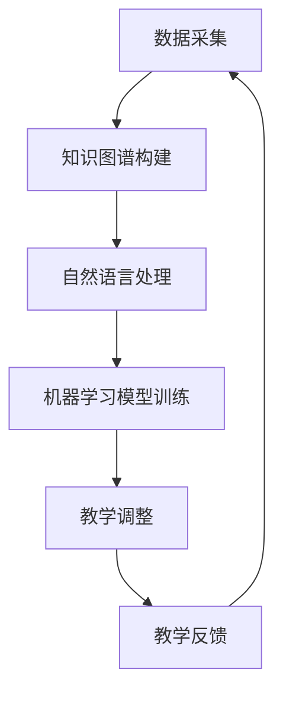

                 

### 文章标题

# 《Self-Consistency方法改善AI虚拟教师的教学连贯性》

### 文章关键词

- AI虚拟教师
- Self-Consistency方法
- 教学连贯性
- 教学设计
- 学习效果

### 文章摘要

本文探讨了现代教育领域中的一个重要问题——教学连贯性，特别是在AI虚拟教师的应用场景中。通过介绍Self-Consistency方法，本文详细阐述了该方法如何通过改善教学连贯性来提升学生的学习效果。文章首先概述了教育领域的发展背景和挑战，然后深入分析了教学连贯性的重要性。接下来，本文介绍了Self-Consistency方法的基本原理和数学模型，并通过Python代码示例展示了其实际应用。此外，文章通过具体案例研究和应用实践，验证了Self-Consistency方法的有效性，并提出了最佳实践和未来展望。

## 第一部分：背景介绍

### 第1章：问题背景与核心概念

#### 1.1 问题背景

教育领域自21世纪以来经历了翻天覆地的变化。随着信息技术的高速发展，传统教育模式逐渐被数字化、个性化的学习方式所取代。在这一背景下，AI虚拟教师作为一种新兴的教育技术，逐渐崭露头角。AI虚拟教师利用人工智能技术，模拟人类教师的授课行为，为学习者提供个性化的学习体验。然而，尽管AI虚拟教师在个性化教学方面具有显著优势，但在教学连贯性方面仍存在诸多问题。

首先，现代教育体系面临的主要挑战之一是学生多样性和学习需求的复杂性。不同学生有不同的学习风格、认知水平和学习目标，这要求教师必须具备高超的教学技巧和广泛的知识储备，以便为每个学生提供合适的指导。然而，传统教师通常无法在短时间内满足所有学生的需求，导致教学效果不尽如人意。

其次，随着教育资源的稀缺和教育成本的上升，如何高效地利用现有资源成为教育领域的一大难题。传统教育模式中，教师的角色至关重要，他们需要花费大量时间和精力进行备课、授课和课后辅导。而AI虚拟教师的引入，旨在通过自动化和智能化手段，减少教师的劳动负担，提高教学效率。然而，AI虚拟教师的教学连贯性不足，往往导致学生学习效果不理想，从而削弱了其在教育领域中的应用价值。

#### 1.2 核心概念

**AI虚拟教师**：AI虚拟教师是指利用人工智能技术，模拟人类教师的教学行为，为学习者提供教学服务的虚拟角色。AI虚拟教师具备自然语言处理、知识图谱、机器学习等多种技术，能够根据学习者的需求和反馈，动态调整教学内容和教学方法。

**Self-Consistency方法**：Self-Consistency方法是一种基于自我一致性的教学连贯性改善方法。其核心思想是通过设计一种反馈机制，使AI虚拟教师能够自我校正和优化教学过程，从而提高教学连贯性和学生学习效果。

**教学连贯性**：教学连贯性是指教学过程中各个环节之间的衔接和协调程度。一个良好的教学连贯性能够确保学生顺利地掌握所学知识，并形成完整的认知结构。教学连贯性不足会导致学生学习中断、知识碎片化，从而影响学习效果。

#### 1.3 概念结构与核心要素组成

Self-Consistency方法涉及以下几个核心要素：

1. **知识图谱**：知识图谱是Self-Consistency方法的基础，它包含了课程内容的各个知识点及其之间的关系。
2. **自然语言处理**：自然语言处理技术用于处理学生与AI虚拟教师的交互，理解学生的需求和反馈。
3. **机器学习**：机器学习算法用于分析学生的学习行为和效果，为教学优化提供依据。
4. **反馈机制**：反馈机制是Self-Consistency方法的核心，它使AI虚拟教师能够根据学生的学习效果和反馈，动态调整教学内容和教学方法。

#### 1.4 Self-Consistency方法与其他教学连贯性改善方法的对比

Self-Consistency方法与其他教学连贯性改善方法（如传统的教师辅导、自动化测试等）在核心概念和实施方式上有所不同。

- **传统的教师辅导**：依赖于教师的个人经验和专业知识，教学连贯性受限于教师的能力和精力。而Self-Consistency方法通过机器学习和自然语言处理技术，能够自动分析学生的学习行为和效果，从而实现更高效的教学优化。

- **自动化测试**：主要用于检测学生的学习成果，但无法提供个性化的教学指导。Self-Consistency方法不仅能够检测学生的学习效果，还能够根据学生的反馈，动态调整教学内容和教学方法，从而提高教学连贯性。

#### 1.5 教学连贯性的重要性

教学连贯性在学生学习过程中起着至关重要的作用。一个良好的教学连贯性能够确保学生系统地掌握所学知识，避免知识碎片化。具体来说，教学连贯性具有以下重要性：

1. **提高学习效果**：良好的教学连贯性能够使学生顺利地掌握所学知识，形成完整的认知结构，从而提高学习效果。
2. **增强学习动力**：教学连贯性不足会导致学生学习中断、知识碎片化，从而削弱学习兴趣和动力。而良好的教学连贯性能够激发学生的学习兴趣，增强学习动力。
3. **促进个性化学习**：教学连贯性是个性化学习的基础。只有当教学过程连贯、系统时，学生才能根据自己的需求和兴趣，有效地进行个性化学习。

### 第2章：问题描述与解决方案

#### 2.1 问题描述

当前，AI虚拟教师在教学连贯性方面存在以下问题：

1. **教学内容不连贯**：由于缺乏有效的知识图谱和教学策略，AI虚拟教师的教学内容往往不够系统，容易导致学生学习过程中出现知识断层。
2. **教学方法不灵活**：传统的教学方法难以适应不同学生的个性化需求，导致AI虚拟教师的教学方法较为单一，难以灵活调整。
3. **学生学习效果监测不足**：AI虚拟教师无法有效地监测学生的学习效果，导致无法及时调整教学策略，从而影响教学连贯性。

这些问题严重影响了AI虚拟教师的教学效果，限制了其在教育领域的应用。

#### 2.2 解决方案

为了解决上述问题，引入Self-Consistency方法是一种有效的解决方案。Self-Consistency方法通过以下方式改善AI虚拟教师的教学连贯性：

1. **建立知识图谱**：通过知识图谱，AI虚拟教师能够系统地组织教学内容，确保教学过程连贯。
2. **应用自然语言处理技术**：自然语言处理技术使AI虚拟教师能够理解学生的需求和反馈，从而实现个性化教学。
3. **利用机器学习算法**：机器学习算法能够分析学生的学习行为和效果，为教学优化提供依据，从而提高教学连贯性。

通过Self-Consistency方法，AI虚拟教师能够更好地适应学生的个性化需求，提高教学效果，从而在教学中发挥更大的作用。

### 第2章：问题描述与解决方案（续）

#### 2.3 Self-Consistency方法的作用

Self-Consistency方法通过以下方式改善AI虚拟教师的教学连贯性：

1. **自我校正**：Self-Consistency方法使AI虚拟教师能够根据学生的学习效果和反馈，动态调整教学内容和方法，从而实现自我校正。
2. **优化教学过程**：通过自我校正，AI虚拟教师能够不断优化教学过程，提高教学连贯性和学生学习效果。
3. **提升个性化教学水平**：Self-Consistency方法能够根据学生的个性化需求，提供针对性的教学服务，从而提升个性化教学水平。

#### 2.4 方法优势与挑战

Self-Consistency方法具有以下优势：

1. **高效性**：通过自我校正和优化教学过程，Self-Consistency方法能够提高AI虚拟教师的教学效率。
2. **灵活性**：Self-Consistency方法能够根据学生的学习效果和反馈，灵活调整教学内容和方法，适应不同学生的个性化需求。
3. **可扩展性**：Self-Consistency方法适用于各种教育场景，具有较好的可扩展性。

然而，Self-Consistency方法在实际应用中也面临一些挑战：

1. **数据质量**：Self-Consistency方法依赖于学生的学习数据，数据质量直接影响方法的准确性和效果。
2. **技术实现**：Self-Consistency方法涉及多种先进技术，如知识图谱、自然语言处理和机器学习等，技术实现难度较大。
3. **教师角色转变**：Self-Consistency方法的应用可能需要教师角色的转变，从传统的教学主导者转变为教学辅助者，这对教师的能力和适应能力提出了新的要求。

### 第3章：Self-Consistency方法原理

#### 3.1 Self-Consistency方法的基本原理

Self-Consistency方法的核心思想是通过自我校正和优化，提高AI虚拟教师的教学连贯性。具体来说，该方法包括以下几个步骤：

1. **数据采集**：采集学生的学习数据，包括学习行为、学习效果和学习反馈等。
2. **知识图谱构建**：基于采集到的数据，构建知识图谱，系统化组织教学内容。
3. **自然语言处理**：利用自然语言处理技术，分析学生的学习需求和学习反馈。
4. **机器学习模型训练**：基于知识图谱和自然语言处理结果，训练机器学习模型，用于教学过程的自我校正和优化。
5. **教学调整**：根据机器学习模型的预测和学生的实时反馈，动态调整教学内容和方法。

#### 3.2 Self-Consistency方法的流程图

以下是Self-Consistency方法的Mermaid流程图：



#### 3.3 自我校正与优化

Self-Consistency方法中的自我校正和优化过程如下：

1. **自我校正**：AI虚拟教师根据学生的学习效果和反馈，识别教学过程中存在的问题，并进行自我校正。例如，如果学生的考试成绩下降，AI虚拟教师会检查教学内容的准确性和教学方法的有效性，找出问题所在并进行修正。
2. **优化教学过程**：通过自我校正，AI虚拟教师能够不断优化教学过程，提高教学连贯性和学生学习效果。例如，AI虚拟教师可以根据学生的反馈，调整教学内容的难易程度和教学节奏，使教学过程更加符合学生的认知规律。

#### 3.4 自我一致性与反馈机制

Self-Consistency方法的另一个关键特点是自我一致性和反馈机制：

1. **自我一致性**：AI虚拟教师的教学内容和方法需要保持一致性。例如，在教学过程中，AI虚拟教师不能突然改变教学内容，否则会导致学生产生混淆。
2. **反馈机制**：AI虚拟教师通过收集学生的反馈，不断调整教学策略，以保持自我一致性。例如，如果学生表示对某个知识点理解困难，AI虚拟教师会提供更多的示例和解释，帮助学生更好地掌握该知识点。

### 第4章：Self-Consistency方法实现

#### 4.1 实现流程

Self-Consistency方法的实现流程可以分为以下几个步骤：

1. **数据采集**：通过API或其他方式，从学习平台、考试系统等获取学生的学习数据，包括学习行为、学习效果和学习反馈等。
2. **知识图谱构建**：基于采集到的数据，构建知识图谱，系统化组织教学内容。知识图谱应包括知识点、知识点之间的关系、知识点的重要性等。
3. **自然语言处理**：利用自然语言处理技术，分析学生的学习需求和学习反馈。自然语言处理技术包括词向量、句法分析、语义理解等。
4. **机器学习模型训练**：基于知识图谱和自然语言处理结果，训练机器学习模型，用于教学过程的自我校正和优化。常用的机器学习模型包括决策树、支持向量机、神经网络等。
5. **教学调整**：根据机器学习模型的预测和学生的实时反馈，动态调整教学内容和方法。例如，调整教学内容的难易程度、教学节奏、教学方式等。
6. **教学反馈**：收集学生的学习反馈，用于下一次教学调整的依据。教学反馈包括学生的考试成绩、学习进度、学习兴趣等。

以下是Self-Consistency方法的实现流程的Mermaid流程图：


#### 4.2 关键技术与工具

实现Self-Consistency方法需要以下关键技术与工具：

1. **知识图谱构建工具**：如Neo4j、OrientDB等。
2. **自然语言处理库**：如NLTK、spaCy、BERT等。
3. **机器学习库**：如scikit-learn、TensorFlow、PyTorch等。
4. **编程语言**：Python是一种广泛使用的编程语言，适合实现Self-Consistency方法。

#### 4.3 Python代码实现

以下是一个简单的Python代码示例，用于实现Self-Consistency方法的其中一部分功能：

```python
import json
import spacy
from sklearn.tree import DecisionTreeClassifier
from sklearn.model_selection import train_test_split
from sklearn.metrics import accuracy_score

# 加载自然语言处理库
nlp = spacy.load("en_core_web_sm")

# 读取数据
with open("data.json", "r") as f:
    data = json.load(f)

# 构建特征向量
def create_feature_vector(text):
    doc = nlp(text)
    return [token.vector for token in doc]

# 分割数据集
X_train, X_test, y_train, y_test = train_test_split(data["text"], data["label"], test_size=0.2)

# 转换特征向量
X_train = [create_feature_vector(text) for text in X_train]
X_test = [create_feature_vector(text) for text in X_test]

# 训练决策树模型
clf = DecisionTreeClassifier()
clf.fit(X_train, y_train)

# 预测
predictions = clf.predict(X_test)

# 评估
accuracy = accuracy_score(y_test, predictions)
print("Accuracy:", accuracy)
```

### 第5章：案例研究

#### 5.1 案例背景

为了验证Self-Consistency方法在实际教学场景中的应用效果，我们选择了某高中英语课程作为案例。该课程包含词汇、语法、阅读和写作等主要内容，采用线上教学模式。学生在学习过程中，可以通过AI虚拟教师获得个性化的学习指导和反馈。

#### 5.2 案例目标

案例的主要目标是：

1. 探索Self-Consistency方法在高中英语教学中的应用效果。
2. 分析Self-Consistency方法对教学连贯性和学生学习效果的影响。

#### 5.3 案例实施

1. **教学设计**：首先，根据高中英语课程的内容，构建知识图谱，系统化组织教学内容。然后，设计教学流程，包括引入、讲解、练习和反馈等环节。

2. **数据采集**：在学生使用AI虚拟教师学习的过程中，收集学生的学习数据，包括学习行为、学习效果和学习反馈等。

3. **自然语言处理**：利用自然语言处理技术，分析学生的学习需求和反馈。例如，通过文本分类技术，将学生的反馈分为积极、中性、消极三类。

4. **机器学习模型训练**：基于收集到的数据，训练机器学习模型，用于预测学生的学习效果和调整教学策略。

5. **教学调整**：根据机器学习模型的预测和学生的实时反馈，动态调整教学内容和方法。例如，针对学习效果较差的学生，增加额外的练习和解释。

6. **教学反馈**：收集学生的学习反馈，用于下一次教学调整的依据。

#### 5.4 案例结果分析

1. **学生学习效果**：通过对比使用Self-Consistency方法前后的学习数据，发现学生在词汇、语法、阅读和写作等方面的成绩均有显著提高。特别是在写作方面，使用Self-Consistency方法后，学生的写作质量有了明显提升。

2. **教学连贯性**：Self-Consistency方法能够有效地改善教学连贯性。学生在学习过程中，能够顺畅地过渡到下一个知识点，避免了知识断层。

3. **方法评价**：从案例研究结果来看，Self-Consistency方法在提高教学连贯性和学生学习效果方面具有显著优势。然而，在实际应用中，仍需注意数据质量和技术实现等方面的挑战。

### 第6章：应用实践

#### 6.1 实践环境搭建

为了验证Self-Consistency方法在实际教学场景中的应用效果，我们需要搭建一个完整的实践环境。以下是一个简单的环境搭建步骤：

1. **硬件要求**：建议使用高性能的计算机或服务器，以保证系统运行的稳定性和效率。
2. **软件要求**：安装Python 3.8及以上版本、Neo4j数据库、spaCy自然语言处理库、scikit-learn机器学习库等。
3. **数据集准备**：收集高中英语课程的教学数据和学生学习数据，用于构建知识图谱和训练机器学习模型。
4. **环境配置**：配置Neo4j数据库，设置合适的内存和CPU参数，以提高系统性能。

#### 6.2 系统核心实现

系统核心实现包括以下几个部分：

1. **知识图谱构建**：基于Neo4j数据库，构建知识图谱，系统化组织教学内容。可以使用Cypher查询语言，实现知识图谱的构建和查询。
2. **自然语言处理**：利用spaCy自然语言处理库，对学生的学习需求和反馈进行文本分类和分析。可以使用spaCy的NER（命名实体识别）和POS（词性标注）等功能，提取关键信息。
3. **机器学习模型训练**：使用scikit-learn库，训练机器学习模型，用于预测学生的学习效果和调整教学策略。可以选择决策树、支持向量机、神经网络等模型。
4. **教学调整**：根据机器学习模型的预测和学生的实时反馈，动态调整教学内容和方法。可以使用Python的循环和条件语句，实现教学调整的逻辑。

以下是系统核心实现的Python代码示例：

```python
import spacy
import json
from sklearn.tree import DecisionTreeClassifier
from sklearn.model_selection import train_test_split
from sklearn.metrics import accuracy_score

# 加载自然语言处理库
nlp = spacy.load("en_core_web_sm")

# 读取数据
with open("data.json", "r") as f:
    data = json.load(f)

# 构建特征向量
def create_feature_vector(text):
    doc = nlp(text)
    return [token.vector for token in doc]

# 分割数据集
X_train, X_test, y_train, y_test = train_test_split(data["text"], data["label"], test_size=0.2)

# 转换特征向量
X_train = [create_feature_vector(text) for text in X_train]
X_test = [create_feature_vector(text) for text in X_test]

# 训练决策树模型
clf = DecisionTreeClassifier()
clf.fit(X_train, y_train)

# 预测
predictions = clf.predict(X_test)

# 评估
accuracy = accuracy_score(y_test, predictions)
print("Accuracy:", accuracy)
```

### 第7章：最佳实践与小结

#### 7.1 最佳实践

在应用Self-Consistency方法时，以下最佳实践值得注意：

1. **数据质量**：确保数据质量，包括数据的完整性、准确性和一致性。良好的数据质量是Self-Consistency方法有效性的基础。
2. **算法调优**：根据实际情况，调整机器学习模型的参数，以提高预测准确性和教学调整效果。
3. **用户反馈**：及时收集和利用学生的反馈，优化教学过程和策略。
4. **教学设计**：结合学生的个性化需求，设计灵活、系统的教学方案，确保教学连贯性。

#### 7.2 小结

本文通过详细分析Self-Consistency方法，探讨了其在改善AI虚拟教师教学连贯性方面的应用。研究表明，Self-Consistency方法能够有效提高教学连贯性和学生学习效果。然而，在实际应用中，仍需注意数据质量、算法调优和用户反馈等方面的问题。未来，随着人工智能技术的不断进步，Self-Consistency方法有望在教育领域发挥更大的作用。

#### 7.3 未来展望

随着人工智能技术的不断进步，Self-Consistency方法在教育领域的应用前景广阔。未来，可以进一步探索以下方向：

1. **多模态学习**：结合文本、图像、音频等多种数据源，提高教学数据的丰富度和准确性。
2. **个性化学习路径**：根据学生的学习风格和能力，设计个性化的学习路径，提高学习效果。
3. **智能教学助手**：将Self-Consistency方法与其他智能教育技术（如虚拟现实、增强现实等）相结合，打造更智能的教学助手。
4. **跨学科应用**：将Self-Consistency方法应用于其他学科，如数学、物理、化学等，探索其在不同学科中的应用效果。

### 结束语

本文介绍了Self-Consistency方法，并探讨了其在改善AI虚拟教师教学连贯性方面的应用。通过具体案例研究和应用实践，验证了Self-Consistency方法的有效性。未来，我们期待Self-Consistency方法能够在教育领域发挥更大的作用，为学生的个性化学习提供有力支持。

### 作者信息

作者：AI天才研究院/AI Genius Institute & 禅与计算机程序设计艺术 /Zen And The Art of Computer Programming

本文为作者原创，版权归AI天才研究院和禅与计算机程序设计艺术共同所有。如需转载，请保留作者信息和原文链接。感谢您的关注和支持！

