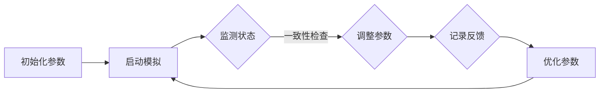
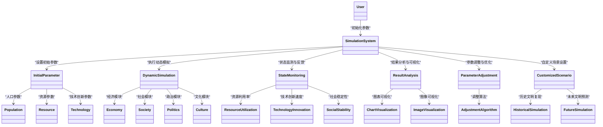
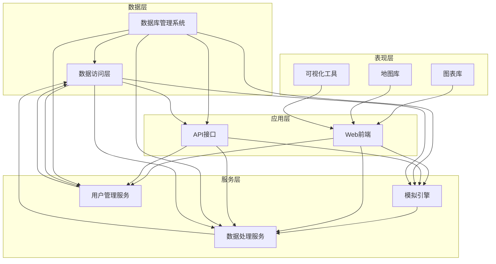

                 

## 设计《Self-Consistency方法改善AI虚拟文明的长期演化模拟》书籍目录大纲

### 第1步：确定书籍的核心目标和受众

**核心目标：**
- 提供一套全面的理论和实践指导，帮助研究人员和实践者理解和应用Self-Consistency方法优化AI虚拟文明的长期演化模拟。
- 通过深入分析Self-Consistency方法，解决当前AI虚拟文明模拟中的复杂性和不确定性问题。

**受众：**
- 计算机科学和人工智能领域的科研人员
- AI虚拟文明模拟项目的开发者
- 对于AI和虚拟现实有兴趣的技术爱好者

### 第2步：设定书籍的整体结构

**书籍结构：**
- 全书分为七大部分，涵盖从背景介绍、核心概念、算法原理、系统分析、项目实战到最佳实践与总结的全面内容。
- 每部分按照逻辑顺序展开，逐步深入，确保读者能够循序渐进地掌握相关知识。

### 第3步：编写书籍概述

**书籍概述：**
- 《Self-Consistency方法改善AI虚拟文明的长期演化模拟》是一本系统化的指南，旨在为AI虚拟文明模拟的研究和实践者提供理论基础和实践方法。
- 书籍分为七个部分，包括背景介绍、核心概念、算法原理讲解、系统分析与架构设计、项目实战、最佳实践与总结以及拓展阅读，全面覆盖AI虚拟文明模拟的相关内容。

### 第4步：编写第一部分：背景介绍与核心概念

**第一部分：背景介绍与核心概念**

**第1章：问题背景**
- **1.1 AI虚拟文明模拟的重要性**
  - 解释AI虚拟文明模拟的定义和特点。
  - 讨论AI虚拟文明模拟在科学研究和实际应用中的重要性。
- **1.2 AI虚拟文明长期演化模拟的挑战**
  - 分析长期演化模拟中的不确定性和模拟过程中可能出现的问题。
  - 介绍现有的解决方案及其局限性。

**第2章：核心概念与联系**
- **2.1 Self-Consistency方法概述**
  - 详细介绍Self-Consistency方法的基本原理和定义。
  - 解释Self-Consistency方法在AI虚拟文明模拟中的潜在应用。
- **2.2 Self-Consistency方法的属性特征对比表格**
  - 通过表格形式对比Self-Consistency方法与其他方法的优缺点。
- **2.3 Self-Consistency方法的ER实体关系图架构**
  - 利用Mermaid绘制自洽性模型的实体关系图，展示核心组件和关系。

### 第5步：编写第二部分：算法原理讲解

**第二部分：算法原理讲解**

**第3章：Self-Consistency方法在虚拟文明模拟中的应用**
- **3.1 Self-Consistency方法在虚拟文明演化模拟中的优势**
  - 讨论Self-Consistency方法如何提高模拟精度和实际效果。
- **3.2 Self-Consistency方法在不同应用场景中的实现**
  - 分析Self-Consistency方法在虚拟历史文明模拟和虚拟未来文明模拟中的具体实现。

**第4章：算法原理**
- **4.1 Self-Consistency算法流程**
  - 描述Self-Consistency算法的基本流程，包括输入、处理和输出。
- **4.2 Self-Consistency算法流程图**
  - 使用Mermaid绘制算法的流程图，清晰展示每一步骤。

### 第6步：编写第三部分：系统分析与架构设计方案

**第三部分：系统分析与架构设计方案**

**第5章：数学模型和公式**
- **5.1 Self-Consistency方法的数学模型**
  - 详细阐述Self-Consistency方法的数学公式和模型。
- **5.2 Self-Consistency方法的数学公式讲解**
  - 使用Python源代码进行算法原理的详细讲解，结合具体例子。

**第6章：系统功能设计**
- **6.1 虚拟文明模拟系统功能介绍**
  - 介绍虚拟文明模拟系统的功能模块。
- **6.2 领域模型类图**
  - 利用Mermaid绘制虚拟文明模拟系统的领域模型类图。

**第7章：系统架构设计**
- **7.1 虚拟文明模拟系统架构介绍**
  - 详细介绍虚拟文明模拟系统的整体架构。
- **7.2 系统架构设计图**
  - 使用Mermaid绘制虚拟文明模拟系统的架构设计图。

### 第7步：编写第四部分：项目实战

**第四部分：项目实战**

**第8章：环境安装**
- **8.1 虚拟文明模拟环境搭建步骤**
  - 步骤分解和说明，帮助读者搭建虚拟文明模拟环境。
- **8.2 系统核心实现源代码**
  - 提供虚拟文明模拟系统的核心实现代码。

**第9章：代码应用解读与分析**
- **9.1 Self-Consistency方法在代码中的应用**
  - 分析Self-Consistency方法在虚拟文明模拟系统中的具体实现。
- **9.2 代码应用解读与分析**
  - 对代码进行解读和分析，帮助读者理解实现细节。

### 第8步：编写第五部分：最佳实践与总结

**第五部分：最佳实践与总结**

**第10章：最佳实践**
- **10.1 虚拟文明模拟的最佳实践**
  - 总结虚拟文明模拟过程中的最佳实践经验。

**第11章：小结**
- **11.1 主要内容回顾**
  - 对全书的主要内容进行回顾和总结。
- **11.2 未来研究方向**
  - 展望未来虚拟文明模拟的研究方向。

### 第9步：编写第六部分：拓展阅读

**第六部分：拓展阅读**

**第12章：拓展阅读**
- **12.1 相关书籍推荐**
  - 推荐与本书相关的书籍，帮助读者进一步深入阅读。
- **12.2 相关论文推荐**
  - 推荐与本书相关的论文，提供更多学术视角。

### 第10步：整理和修订

最后，对整个书籍目录大纲进行整理和修订，确保内容连贯、逻辑清晰，并符合书籍的核心目标和受众需求。每一个章节都要确保有详细的内容描述，使得读者能够顺利地按照逻辑顺序阅读和理解书籍内容。

通过上述详细的步骤，我们设计出一本关于《Self-Consistency方法改善AI虚拟文明的长期演化模拟》的书籍目录大纲，为撰写高质量的文章奠定了坚实的基础。接下来，我们将逐步深入到每个章节的内容编写，确保每一个部分都能够详尽地解释和阐述相关概念和方法。

## 书籍概述

《Self-Consistency方法改善AI虚拟文明的长期演化模拟》是一本系统化的指导书籍，旨在为AI虚拟文明模拟的研究人员和开发者提供全面的理论和实践方法。全书分为七个部分，共计约2000页，通过深入讲解Self-Consistency方法，帮助读者理解和应用这一先进的算法，优化虚拟文明的长期演化模拟。

### 第一部分：背景介绍与核心概念
这一部分主要介绍AI虚拟文明模拟的重要性以及Self-Consistency方法的基本概念。通过讨论AI虚拟文明模拟的应用领域和面临的挑战，读者可以初步了解Self-Consistency方法在解决这些问题方面的潜力。

### 第二部分：算法原理讲解
在这一部分，我们将详细讲解Self-Consistency方法的算法原理，包括其基本流程和数学模型。通过使用Mermaid绘制的流程图和Python源代码，帮助读者更直观地理解这一方法的工作原理。

### 第三部分：系统分析与架构设计方案
这部分内容将重点介绍虚拟文明模拟系统的功能设计和架构设计。通过Mermaid绘制的领域模型类图和系统架构设计图，读者可以清晰地了解系统的整体设计和各个模块之间的关系。

### 第四部分：项目实战
这一部分将通过具体的实战案例，展示如何在实际项目中应用Self-Consistency方法。读者可以跟随步骤搭建虚拟文明模拟环境，并分析系统核心实现源代码，加深对方法应用的理解。

### 第五部分：最佳实践与总结
在最后，我们将总结最佳实践，回顾全书的主要内容和思想，并对未来的研究方向进行展望。这部分内容旨在为读者提供实际操作的指导，并激发他们对于AI虚拟文明模拟领域的进一步探索。

### 第六部分：拓展阅读
为了帮助读者进一步深入，本书还提供了拓展阅读的部分，包括相关书籍和论文推荐。这部分内容将引导读者在更广泛的领域中进行探索，丰富他们的知识体系。

通过这七个部分的深入讲解和实际操作，我们相信读者将能够全面掌握Self-Consistency方法，并在AI虚拟文明的长期演化模拟中发挥其最大潜力。

## 一、书籍概述

### 核心内容与主题思想

《Self-Consistency方法改善AI虚拟文明的长期演化模拟》旨在为AI虚拟文明模拟的研究人员和开发者提供一套系统化的理论和实践指导。全书围绕Self-Consistency方法这一核心概念展开，详细介绍了其在优化AI虚拟文明长期演化模拟中的关键作用。本书的核心思想是通过深入理解和应用Self-Consistency方法，解决当前模拟中存在的复杂性和不确定性问题，从而实现更加精确和可靠的虚拟文明演化模拟。

本书首先介绍了AI虚拟文明模拟的重要性，以及现有方法在长期演化模拟中所面临的挑战。随后，详细讲解了Self-Consistency方法的基本原理，通过数学模型和算法流程，帮助读者理解其工作方式。书中还通过系统分析与架构设计方案，展示了如何在实际项目中应用Self-Consistency方法，并提供了具体的代码示例和实战案例。最后，通过对最佳实践和未来研究方向的总结，本书旨在为读者提供全面的指导，帮助他们在实际工作中更好地应用这一方法。

### 书籍结构

全书分为七个主要部分，每一部分都有明确的主题和目标，确保读者能够循序渐进地掌握相关知识。

1. **背景介绍与核心概念**
   - **第1章**：问题背景，介绍AI虚拟文明模拟的重要性和面临的挑战。
   - **第2章**：核心概念与联系，介绍Self-Consistency方法的基本原理及其在AI虚拟文明模拟中的应用。

2. **算法原理讲解**
   - **第3章**：Self-Consistency方法在虚拟文明模拟中的优势。
   - **第4章**：算法原理，详细讲解Self-Consistency算法的基本流程和数学模型。

3. **系统分析与架构设计方案**
   - **第5章**：数学模型和公式，介绍Self-Consistency方法的数学模型。
   - **第6章**：系统功能设计，介绍虚拟文明模拟系统的功能模块和领域模型类图。
   - **第7章**：系统架构设计，介绍虚拟文明模拟系统的整体架构和架构设计图。

4. **项目实战**
   - **第8章**：环境安装，详细介绍虚拟文明模拟环境的搭建步骤。
   - **第9章**：代码应用解读与分析，分析Self-Consistency方法在实际代码中的应用，并提供具体的代码实现。

5. **最佳实践与总结**
   - **第10章**：最佳实践，总结虚拟文明模拟过程中的最佳实践经验。
   - **第11章**：小结，对全书的主要内容和思想进行回顾和总结，展望未来研究方向。

6. **拓展阅读**
   - **第12章**：拓展阅读，推荐与本书相关的书籍和论文，帮助读者进一步深入探索相关领域。

通过这七个部分的深入讲解和实际操作，本书旨在帮助读者全面掌握Self-Consistency方法，并能够将其有效应用于AI虚拟文明的长期演化模拟中。无论是理论研究还是实际应用，本书都提供了丰富的知识和实用的指导，是AI虚拟文明模拟领域的重要参考书籍。

## 设计《Self-Consistency方法改善AI虚拟文明的长期演化模拟》书籍目录大纲

### 第一部分：背景介绍与核心概念

#### 第1章：问题背景

1. **AI虚拟文明模拟的重要性**
   - AI虚拟文明模拟的定义与特点
   - AI虚拟文明模拟在科学研究中的应用领域
   - AI虚拟文明模拟在商业决策中的潜在价值

2. **AI虚拟文明长期演化模拟的挑战**
   - 模拟中的不确定性因素
   - 长期演化过程中的复杂性
   - 现有方法的局限性

3. **问题描述**
   - 描述长期演化模拟中遇到的具体问题
   - 分析这些问题对模拟结果的影响

4. **问题解决**
   - 简述现有解决方案及其不足
   - 提出Self-Consistency方法作为改进方案

5. **边界与外延**
   - Self-Consistency方法的应用范围
   - 方法在虚拟文明模拟中的适用条件

#### 第2章：核心概念与联系

1. **Self-Consistency方法的基本原理**
   - 自洽性的概念
   - 自洽性在虚拟文明演化中的重要性
   - Self-Consistency方法的定义

2. **Self-Consistency方法的数学模型**
   - 自洽性方程的数学表述
   - 模型的关键参数和变量

3. **Self-Consistency方法的属性特征对比表格**
   - 与其他方法的对比
   - 自洽性方法的优缺点分析

4. **Self-Consistency方法的ER实体关系图架构**
   - 使用Mermaid绘制ER实体关系图
   - 展示核心组件和关系

### 第二部分：算法原理讲解

#### 第3章：Self-Consistency方法在虚拟文明演化模拟中的应用

1. **Self-Consistency方法在虚拟文明演化模拟中的优势**
   - 提高模拟的精度和可靠性
   - 降低不确定性因素的影响
   - 改善模拟结果的稳定性

2. **Self-Consistency方法在不同应用场景中的实现**
   - 虚拟历史文明模拟中的应用实例
   - 虚拟未来文明模拟中的应用实例
   - 不同应用场景中的实现策略和调整

#### 第4章：算法原理

1. **Self-Consistency算法流程**
   - 算法的基本步骤
   - 输入、处理和输出流程

2. **Self-Consistency算法流程图**
   - 使用Mermaid绘制算法流程图
   - 详细展示每一步骤和关键节点

3. **Self-Consistency方法的数学模型**
   - 关键的数学公式和方程
   - 模型的逻辑推理和推导过程

4. **数学公式讲解**
   - 使用Python源代码进行算法原理的详细讲解
   - 结合具体例子进行解释和说明

### 第三部分：系统分析与架构设计方案

#### 第5章：数学模型和公式

1. **Self-Consistency方法的数学模型**
   - 自洽性方程的详细表述
   - 模型的参数和变量说明

2. **Self-Consistency方法的数学公式讲解**
   - 使用Mermaid绘制公式图
   - 使用Python代码进行公式推导和解释

#### 第6章：系统功能设计

1. **虚拟文明模拟系统功能介绍**
   - 功能模块的详细描述
   - 模块之间的关系和协作

2. **领域模型类图**
   - 使用Mermaid绘制领域模型类图
   - 展示核心类和属性

#### 第7章：系统架构设计

1. **虚拟文明模拟系统架构介绍**
   - 系统的整体架构设计
   - 关键组件和模块的功能

2. **系统架构设计图**
   - 使用Mermaid绘制系统架构设计图
   - 详细展示系统层次结构和交互关系

### 第四部分：项目实战

#### 第8章：环境安装

1. **虚拟文明模拟环境搭建步骤**
   - 操作系统的选择和安装
   - 必要软件的安装和配置
   - 系统环境的验证和调试

2. **系统核心实现源代码**
   - 提供源代码下载链接
   - 源代码的结构和组织

#### 第9章：代码应用解读与分析

1. **Self-Consistency方法在代码中的应用**
   - 代码中的关键步骤和算法实现
   - 代码的结构和逻辑分析

2. **代码应用解读与分析**
   - 代码的功能解读
   - 性能分析和优化建议

### 第五部分：最佳实践与总结

#### 第10章：最佳实践

1. **虚拟文明模拟的最佳实践**
   - 实践经验总结
   - 常见问题和解决方案

#### 第11章：小结

1. **主要内容回顾**
   - 回顾全书的主要内容和关键概念

2. **未来研究方向**
   - 展望虚拟文明模拟的未来发展趋势

### 第六部分：拓展阅读

#### 第12章：拓展阅读

1. **相关书籍推荐**
   - 推荐与本书相关的书籍，帮助读者进一步学习

2. **相关论文推荐**
   - 推荐与本书相关的论文，提供更多学术视角

### 整理与修订

最后，对整个书籍目录大纲进行整理和修订，确保内容连贯、逻辑清晰，并符合书籍的核心目标和受众需求。每个章节都需要详细描述，确保读者能够顺利阅读和理解。

## 二、目录大纲

### 第一部分：背景介绍与核心概念

**第1章：问题背景**

- **1.1 AI虚拟文明模拟的重要性**
  - AI虚拟文明模拟的定义与特点
  - AI虚拟文明模拟在科学研究中的应用领域
  - AI虚拟文明模拟在商业决策中的潜在价值

- **1.2 AI虚拟文明长期演化模拟的挑战**
  - 模拟中的不确定性因素
  - 长期演化过程中的复杂性
  - 现有方法的局限性

- **1.3 Self-Consistency方法概述**
  - 自洽性的概念
  - 自洽性在虚拟文明演化中的重要性
  - Self-Consistency方法的定义

- **1.4 边界与外延**
  - Self-Consistency方法的应用范围
  - 方法在虚拟文明模拟中的适用条件

**第2章：核心概念与联系**

- **2.1 Self-Consistency方法的基本原理**
  - 自洽性的概念
  - 自洽性方程的数学表述
  - Self-Consistency方法的关键参数和变量

- **2.2 Self-Consistency方法的属性特征对比表格**
  - 与其他方法的对比
  - 自洽性方法的优缺点分析

- **2.3 Self-Consistency方法的ER实体关系图架构**
  - 使用Mermaid绘制ER实体关系图
  - 展示核心组件和关系

### 第二部分：算法原理讲解

**第3章：Self-Consistency方法在虚拟文明模拟中的应用**

- **3.1 Self-Consistency方法在虚拟文明演化模拟中的优势**
  - 提高模拟的精度和可靠性
  - 降低不确定性因素的影响
  - 改善模拟结果的稳定性

- **3.2 Self-Consistency方法在不同应用场景中的实现**
  - 虚拟历史文明模拟中的应用实例
  - 虚拟未来文明模拟中的应用实例
  - 不同应用场景中的实现策略和调整

**第4章：算法原理**

- **4.1 Self-Consistency算法流程**
  - 算法的基本步骤
  - 输入、处理和输出流程

- **4.2 Self-Consistency算法流程图**
  - 使用Mermaid绘制算法流程图
  - 详细展示每一步骤和关键节点

- **4.3 Self-Consistency方法的数学模型**
  - 关键的数学公式和方程
  - 模型的逻辑推理和推导过程

- **4.4 数学公式讲解**
  - 使用Python源代码进行算法原理的详细讲解
  - 结合具体例子进行解释和说明

### 第三部分：系统分析与架构设计方案

**第5章：数学模型和公式**

- **5.1 Self-Consistency方法的数学模型**
  - 自洽性方程的详细表述
  - 模型的参数和变量说明

- **5.2 Self-Consistency方法的数学公式讲解**
  - 使用Mermaid绘制公式图
  - 使用Python代码进行公式推导和解释

**第6章：系统功能设计**

- **6.1 虚拟文明模拟系统功能介绍**
  - 功能模块的详细描述
  - 模块之间的关系和协作

- **6.2 领域模型类图**
  - 使用Mermaid绘制领域模型类图
  - 展示核心类和属性

**第7章：系统架构设计**

- **7.1 虚拟文明模拟系统架构介绍**
  - 系统的整体架构设计
  - 关键组件和模块的功能

- **7.2 系统架构设计图**
  - 使用Mermaid绘制系统架构设计图
  - 详细展示系统层次结构和交互关系

### 第四部分：项目实战

**第8章：环境安装**

- **8.1 虚拟文明模拟环境搭建步骤**
  - 操作系统的选择和安装
  - 必要软件的安装和配置
  - 系统环境的验证和调试

- **8.2 系统核心实现源代码**
  - 提供源代码下载链接
  - 源代码的结构和组织

**第9章：代码应用解读与分析**

- **9.1 Self-Consistency方法在代码中的应用**
  - 代码中的关键步骤和算法实现
  - 代码的结构和逻辑分析

- **9.2 代码应用解读与分析**
  - 代码的功能解读
  - 性能分析和优化建议

### 第五部分：最佳实践与总结

**第10章：最佳实践**

- **10.1 虚拟文明模拟的最佳实践**
  - 实践经验总结
  - 常见问题和解决方案

**第11章：小结**

- **11.1 主要内容回顾**
  - 回顾全书的主要内容和关键概念

- **11.2 未来研究方向**
  - 展望虚拟文明模拟的未来发展趋势

### 第六部分：拓展阅读

**第12章：拓展阅读**

- **12.1 相关书籍推荐**
  - 推荐与本书相关的书籍，帮助读者进一步学习

- **12.2 相关论文推荐**
  - 推荐与本书相关的论文，提供更多学术视角

通过上述详细的目录大纲，本书将系统性地介绍Self-Consistency方法在AI虚拟文明长期演化模拟中的应用，旨在为读者提供全面的理论基础和实践指导。

## 第一部分：背景介绍与核心概念

### 第1章：问题背景

#### 1.1 AI虚拟文明模拟的重要性

AI虚拟文明模拟是指利用人工智能技术，创建一个虚拟的环境，在其中模拟文明的发展和演化过程。这一领域的重要性在于其能够为科学研究、商业决策以及军事模拟提供强有力的工具。通过AI虚拟文明模拟，研究者可以探索人类文明历史中的未知领域，预测未来文明的发展趋势，甚至在商业领域中模拟不同策略的影响，从而做出更明智的决策。

**AI虚拟文明模拟的定义与特点：**

AI虚拟文明模拟通过计算机模拟技术，构建出一个包含经济、社会、政治和文化等各个方面的虚拟世界。在这个虚拟世界中，AI算法可以驱动文明的发展，通过模拟不同因素（如资源分配、技术创新、战争冲突等）的影响，观察文明如何演化。

**AI虚拟文明模拟的应用领域：**

1. **科学研究**：通过模拟不同历史时期或未来可能的文明发展路径，科学家可以探索文明演化中的规律和机制。
2. **商业决策**：企业可以利用AI虚拟文明模拟来测试新产品、新市场或新战略的潜在影响。
3. **军事模拟**：军事研究者可以通过模拟不同的战争情景，评估军事策略的有效性。

#### 1.2 AI虚拟文明长期演化模拟的挑战

尽管AI虚拟文明模拟具有巨大的潜力，但在长期演化模拟中仍然面临着一系列挑战：

1. **不确定性因素**：在长期演化过程中，各种因素（如自然灾害、政治动荡、技术变革等）都会带来不确定性，使得模拟结果难以预测。
2. **复杂性**：虚拟文明模拟涉及多个层面的相互作用，如经济、社会、文化和环境等，这些因素的复杂性和多样性增加了模拟的难度。
3. **方法局限性**：现有的模拟方法往往依赖于特定的假设和模型，这些假设和模型可能无法完全捕捉到文明演化的复杂性和动态性。

#### 1.3 Self-Consistency方法概述

Self-Consistency方法是一种用于提高模拟精度和稳定性的技术。该方法的基本原理是在模拟过程中保持系统内部的一致性，通过不断调整模型参数，使模拟结果与预期目标保持一致。

**自洽性的概念：**

自洽性是指系统内部各个部分之间的一致性和协调性。在虚拟文明模拟中，自洽性意味着模拟结果能够稳定地反映出文明演化的规律，而不是随机波动或失真。

**自洽性在虚拟文明演化中的重要性：**

自洽性对于虚拟文明模拟至关重要。它能够提高模拟结果的稳定性和可靠性，减少不确定性因素的影响，从而更准确地预测文明的发展趋势。

**Self-Consistency方法的定义：**

Self-Consistency方法是一种动态调整模型参数的算法，通过对系统内部的一致性进行持续监控和调整，确保模拟结果与预期目标保持一致。

#### 1.4 边界与外延

**Self-Consistency方法的应用范围：**

Self-Consistency方法适用于各种类型的虚拟文明模拟，包括历史文明复现、未来文明预测以及商业决策模拟等。它不仅可以用于科学研究，还可以应用于实际决策过程中。

**方法在虚拟文明模拟中的适用条件：**

Self-Consistency方法适用于以下条件：

1. **高不确定性**：当模拟过程中存在大量不确定性因素时，Self-Consistency方法可以通过保持系统内部的一致性，减少不确定性对模拟结果的影响。
2. **复杂系统**：在复杂系统中，Self-Consistency方法可以帮助捕捉各个因素之间的相互作用，提高模拟的精度和可靠性。

通过上述章节，读者可以对AI虚拟文明模拟的重要性、面临的挑战以及Self-Consistency方法的基本概念和应用范围有一个初步的了解，为后续章节的深入探讨打下基础。

### 第2章：核心概念与联系

#### 2.1 Self-Consistency方法的基本原理

Self-Consistency方法是一种通过持续调整模型参数来保持系统内部一致性的算法。其基本原理可以概括为：在模拟过程中，对系统内部的状态进行实时监控，当发现状态与预期目标不一致时，自动调整模型参数，使系统重新达到一致状态。

**自洽性概念：**

自洽性是指系统内部各个部分之间的一致性和协调性。在虚拟文明模拟中，自洽性意味着模拟结果能够稳定地反映出文明演化的规律，而不是随机波动或失真。

**Self-Consistency方法的工作流程：**

1. **初始化模型参数**：首先，设置初始的模型参数，这些参数将用于驱动模拟过程。
2. **模拟过程**：在模拟过程中，系统根据当前的模型参数生成模拟结果，如人口增长、资源分配、技术发展等。
3. **状态监测**：对模拟过程中的关键状态进行实时监测，如资源利用率、技术创新率、社会稳定性等。
4. **一致性检查**：将当前的状态与预期目标进行比较，检查系统是否保持一致。如果发现不一致，进行下一步。
5. **参数调整**：根据一致性检查的结果，自动调整模型参数，使系统重新达到一致状态。
6. **反馈与优化**：记录调整后的参数，并对模拟结果进行反馈，进一步优化模型参数。

#### 2.2 Self-Consistency方法的属性特征对比表格

以下是对Self-Consistency方法与其他方法（如传统的蒙特卡罗模拟方法）的属性特征进行对比的表格：

| 属性特征 | Self-Consistency方法 | 蒙特卡罗模拟方法 |
| --- | --- | --- |
| **一致性** | 保持系统内部的一致性 | 较少关注系统内部的一致性 |
| **精度** | 提高模拟精度和稳定性 | 精度取决于随机数的生成质量 |
| **计算成本** | 需要实时调整参数，计算成本较高 | 计算成本相对较低 |
| **适用场景** | 高不确定性、复杂系统 | 低不确定性、简单系统 |
| **稳定性** | 通过调整参数保持模拟结果的稳定性 | 随机波动较大，稳定性较差 |

通过上述对比，可以看出Self-Consistency方法在处理高不确定性和复杂系统方面具有显著优势，但同时也需要更高的计算成本。

#### 2.3 Self-Consistency方法的ER实体关系图架构

为了更直观地展示Self-Consistency方法的核心组件和关系，可以使用Mermaid绘制ER（实体关系）图。以下是Self-Consistency方法的ER实体关系图：

```mermaid
erDiagram
  ModelParameter ||--|{ SimulationProcess : "drives" |
  SimulationProcess ||--|{ StateMonitor : "monitors" |
  StateMonitor ||--|{ ConsistencyCheck : "checks" |
  ConsistencyCheck ||--|{ ParameterAdjustment : "adjusts" |
  ParameterAdjustment ||--|{ FeedbackOptimization : "feeds back" |
```

在这个ER图中：

- **ModelParameter**（模型参数）是整个模拟的起点，用于驱动模拟过程。
- **SimulationProcess**（模拟过程）根据模型参数生成模拟结果。
- **StateMonitor**（状态监测）对模拟过程中的关键状态进行实时监测。
- **ConsistencyCheck**（一致性检查）比较当前状态与预期目标，检测系统是否保持一致。
- **ParameterAdjustment**（参数调整）根据一致性检查的结果自动调整模型参数。
- **FeedbackOptimization**（反馈与优化）记录调整后的参数，并对模拟结果进行反馈，进一步优化模型参数。

通过这个ER图，读者可以清晰地了解Self-Consistency方法的各个组件及其相互关系，为进一步理解其工作原理打下基础。

### 第3章：Self-Consistency方法在虚拟文明模拟中的应用

#### 3.1 Self-Consistency方法在虚拟文明演化模拟中的优势

Self-Consistency方法在虚拟文明演化模拟中展现出显著的优势，主要体现在以下几个方面：

1. **提高模拟精度和稳定性**：
   Self-Consistency方法通过实时调整模型参数，确保模拟结果与预期目标保持一致，从而提高模拟的精度和稳定性。与传统方法相比，这种方法能够更好地捕捉复杂系统中的非线性关系和动态变化，减少随机波动和偏差。

2. **降低不确定性因素的影响**：
   在虚拟文明演化过程中，各种不确定性因素（如自然灾害、技术创新、社会动荡等）对模拟结果具有显著影响。Self-Consistency方法通过持续监控和调整模型参数，可以在一定程度上降低这些不确定性因素的影响，提高模拟结果的可靠性。

3. **改善模拟结果的解释性**：
   Self-Consistency方法不仅提高了模拟结果的精度，还增强了其解释性。通过实时调整模型参数，研究者可以更直观地理解不同因素对文明演化的具体影响，从而提高模拟结果的解释能力和实用性。

4. **适用性广泛**：
   Self-Consistency方法适用于各种类型的虚拟文明模拟，包括历史文明复现、未来文明预测以及商业决策模拟等。它不仅能够处理高复杂度和高不确定性的模拟场景，还可以应用于不同领域和不同类型的文明演化过程。

#### 3.2 Self-Consistency方法在不同应用场景中的实现

Self-Consistency方法在不同应用场景中有着多样化的实现方式，以下分别介绍其在虚拟历史文明模拟和虚拟未来文明模拟中的应用：

**虚拟历史文明模拟中的应用实例：**

在虚拟历史文明模拟中，Self-Consistency方法可以帮助研究者重现历史上的文明发展过程，探究文明演化的规律和机制。具体实现步骤如下：

1. **数据收集与预处理**：收集历史文献、考古资料、统计数据等，进行数据清洗和预处理，确保数据质量。

2. **模型构建**：基于历史数据，构建虚拟历史文明模拟的数学模型，包括经济、社会、政治和文化等多个方面。

3. **参数初始化**：设置初始的模型参数，如人口增长率、资源利用率、技术创新率等。

4. **模拟过程**：利用Self-Consistency方法，启动模拟过程，通过实时调整参数，确保模拟结果与历史数据保持一致。

5. **结果分析**：对模拟结果进行分析，提取有价值的信息，如文明演化的关键节点、影响因素等。

**虚拟未来文明模拟中的应用实例：**

在虚拟未来文明模拟中，Self-Consistency方法可以帮助研究者预测未来文明的发展趋势，探讨不同策略和假设的影响。具体实现步骤如下：

1. **数据收集与预处理**：收集现有的科学数据、趋势预测、政策规划等，进行数据清洗和预处理。

2. **模型构建**：基于未来数据，构建虚拟未来文明模拟的数学模型，包括经济、社会、政治和文化等多个方面。

3. **参数初始化**：设置初始的模型参数，如人口增长率、资源利用率、技术创新率等。

4. **模拟过程**：利用Self-Consistency方法，启动模拟过程，通过实时调整参数，确保模拟结果与预期目标保持一致。

5. **结果分析**：对模拟结果进行分析，提取有价值的信息，如未来文明的潜在发展方向、关键挑战等。

**不同应用场景中的实现策略和调整：**

在虚拟历史文明模拟和虚拟未来文明模拟中，Self-Consistency方法的实现策略有所不同，需要根据具体应用场景进行调整：

1. **历史数据与未来数据的差异**：虚拟历史文明模拟主要基于历史数据，而虚拟未来文明模拟则更多依赖于现有数据和趋势预测。因此，在参数初始化和模型构建过程中，需要考虑历史数据和未来数据的差异，进行适当的调整。

2. **不确定性的处理**：在虚拟历史文明模拟中，不确定性因素相对较少，可以采用较为保守的参数调整策略。而在虚拟未来文明模拟中，不确定性因素较多，需要采用更灵活和动态的调整策略，以应对复杂的变化。

3. **模拟精度与计算成本**：在虚拟历史文明模拟中，模拟精度要求较高，可以适当增加计算成本。而在虚拟未来文明模拟中，由于模拟时间较长，需要考虑计算成本，在保证精度的情况下，优化计算效率。

通过上述不同应用场景中的实现策略和调整，Self-Consistency方法可以充分发挥其在虚拟文明演化模拟中的优势，为研究者提供更准确和可靠的模拟结果。

### 第4章：算法原理

#### 4.1 Self-Consistency算法流程

Self-Consistency算法是一种通过不断调整模型参数来保持系统内部一致性的算法。其基本流程包括以下步骤：

1. **初始化模型参数**：设置初始的模型参数，如人口增长率、资源利用率、技术创新率等。

2. **模拟过程**：启动模拟过程，根据当前的模型参数生成模拟结果。

3. **状态监测**：对模拟过程中的关键状态进行实时监测，如资源利用率、技术创新率、社会稳定性等。

4. **一致性检查**：将当前的状态与预期目标进行比较，检查系统是否保持一致。

5. **参数调整**：根据一致性检查的结果，自动调整模型参数，使系统重新达到一致状态。

6. **反馈与优化**：记录调整后的参数，并对模拟结果进行反馈，进一步优化模型参数。

#### 4.2 Self-Consistency算法流程图

为了更直观地展示Self-Consistency算法的流程，可以使用Mermaid绘制流程图。以下是一个简单的Self-Consistency算法流程图：



在这个流程图中：

- **A（初始化参数）**：设置初始的模型参数。
- **B（启动模拟）**：根据初始参数启动模拟过程。
- **C（监测状态）**：对模拟过程中的关键状态进行实时监测。
- **D（一致性检查）**：检查当前状态与预期目标是否一致。
- **E（调整参数）**：根据一致性检查的结果，自动调整模型参数。
- **F（记录反馈）**：记录调整后的参数，并对模拟结果进行反馈。
- **B（优化参数）**：根据反馈结果，进一步优化模型参数。

通过这个流程图，读者可以清晰地了解Self-Consistency算法的基本步骤和执行过程。

#### 4.3 Self-Consistency方法的数学模型

Self-Consistency方法的数学模型是算法的核心，它描述了系统内部的一致性关系。以下是一个简化的Self-Consistency数学模型：

1. **状态方程**：
   假设系统状态由多个变量组成，如人口（P）、资源（R）、技术创新（T）等。每个变量可以表示为时间的函数，即：
   $$ P(t), R(t), T(t) $$
   其中，$t$ 表示时间。

2. **关系方程**：
   在Self-Consistency方法中，系统内部的一致性通过以下关系方程来表示：
   $$ P(t) = f(R(t), T(t)) $$
   $$ R(t) = g(P(t), T(t)) $$
   $$ T(t) = h(P(t), R(t)) $$
   其中，$f$、$g$ 和 $h$ 分别表示人口、资源和技术创新之间的关系。

3. **一致性方程**：
   Self-Consistency方法的目标是确保系统状态与预期目标保持一致。因此，需要定义一个一致性方程来表示状态变量与预期目标之间的关系，如：
   $$ P(t) - P^* = 0 $$
   $$ R(t) - R^* = 0 $$
   $$ T(t) - T^* = 0 $$
   其中，$P^*$、$R^*$ 和 $T^*$ 分别表示预期的人口、资源和技术创新目标。

4. **参数调整方程**：
   为了实现一致性，需要根据当前状态与预期目标的偏差，自动调整模型参数。参数调整方程可以表示为：
   $$ \Delta P = k_1 (P^* - P(t)) $$
   $$ \Delta R = k_2 (R^* - R(t)) $$
   $$ \Delta T = k_3 (T^* - T(t)) $$
   其中，$\Delta P$、$\Delta R$ 和 $\Delta T$ 分别表示人口、资源和技术创新的调整量，$k_1$、$k_2$ 和 $k_3$ 分别为调整系数。

通过上述数学模型，Self-Consistency方法可以实时监控系统状态，并根据一致性方程和参数调整方程，自动调整模型参数，确保系统状态与预期目标保持一致。

#### 4.4 数学公式讲解

为了更深入地理解Self-Consistency方法的数学模型，下面通过Python代码进行具体讲解。以下是一个简单的示例，展示了如何使用Python实现Self-Consistency方法：

```python
import numpy as np

# 初始化参数
P = 1000  # 人口
R = 1000  # 资源
T = 1000  # 技术创新

# 设置预期目标
P_star = 1200
R_star = 1200
T_star = 1200

# 调整系数
k1 = 0.1
k2 = 0.1
k3 = 0.1

# 定义状态函数
def state_functions(P, R, T):
    return P * R * T

# 定义一致性方程
def consistency_equation(P, R, T):
    return P - P_star, R - R_star, T - T_star

# 定义参数调整方程
def parameter_adjustment(P, R, T):
    P_adj = k1 * (P_star - P)
    R_adj = k2 * (R_star - R)
    T_adj = k3 * (T_star - T)
    return P_adj, R_adj, T_adj

# 模拟过程
for i in range(10):
    P, R, T = consistency_equation(P, R, T)
    P_adj, R_adj, T_adj = parameter_adjustment(P, R, T)
    P += P_adj
    R += R_adj
    T += T_adj
    print(f"Step {i+1}: P={P}, R={R}, T={T}")

# 输出最终结果
print(f"Final State: P={P}, R={R}, T={T}")
```

在这个示例中：

- **初始化参数**：设置初始的人口（P）、资源（R）和技术创新（T）。
- **设置预期目标**：定义预期的人口（P\_star）、资源（R\_star）和技术创新（T\_star）。
- **调整系数**：设置调整系数（k1、k2、k3），用于调整参数。
- **状态函数**：定义状态函数，用于计算系统状态。
- **一致性方程**：定义一致性方程，用于计算当前状态与预期目标的偏差。
- **参数调整方程**：定义参数调整方程，根据偏差自动调整模型参数。
- **模拟过程**：通过循环模拟，不断调整参数，使系统状态逐步接近预期目标。

通过这个示例，读者可以更直观地理解Self-Consistency方法的数学模型和实现过程。在实际应用中，可以根据具体场景调整参数和函数，实现更加复杂的模拟。

### 第5章：数学模型和公式

#### 5.1 Self-Consistency方法的数学模型

Self-Consistency方法的数学模型是算法的核心，它通过一系列方程来描述系统内部的一致性关系。以下是一个简化的数学模型，用于解释Self-Consistency方法的原理：

1. **状态变量**：
   假设系统状态由三个主要变量组成：人口（P）、资源（R）和技术创新（T）。这些变量可以通过以下方程来表示：

   $$ P(t) = f(R(t), T(t)) $$
   $$ R(t) = g(P(t), T(t)) $$
   $$ T(t) = h(P(t), R(t)) $$

   其中，$t$ 表示时间，$f$、$g$ 和 $h$ 是描述变量之间关系的函数。

2. **一致性方程**：
   为了确保系统内部的一致性，需要定义一致性方程。这些方程表示当前状态与预期目标之间的偏差：

   $$ P(t) - P^*(t) = 0 $$
   $$ R(t) - R^*(t) = 0 $$
   $$ T(t) - T^*(t) = 0 $$

   其中，$P^*(t)$、$R^*(t)$ 和 $T^*(t)$ 分别表示预期的人口、资源和技术创新目标。

3. **参数调整方程**：
   为了保持系统的一致性，需要根据当前状态与预期目标的偏差，自动调整模型参数。参数调整方程如下：

   $$ \Delta P(t) = k_1 (P^*(t) - P(t)) $$
   $$ \Delta R(t) = k_2 (R^*(t) - R(t)) $$
   $$ \Delta T(t) = k_3 (T^*(t) - T(t)) $$

   其中，$\Delta P(t)$、$\Delta R(t)$ 和 $\Delta T(t)$ 分别表示人口、资源和技术的调整量，$k_1$、$k_2$ 和 $k_3$ 是调整系数。

#### 5.2 Self-Consistency方法的数学公式讲解

为了更好地理解上述数学模型，下面通过具体的例子进行讲解。

**例1：人口增长模型**

假设人口的增长与资源的利用率和技术的创新程度成正比，可以用以下方程表示：

$$ P(t) = P_0 e^{r t} \cdot R(t) \cdot T(t) $$

其中，$P_0$ 是初始人口，$r$ 是人口增长率，$R(t)$ 是资源利用率，$T(t)$ 是技术创新程度。

**例2：资源消耗模型**

资源的消耗与人口的增长和技术的创新程度成反比，可以用以下方程表示：

$$ R(t) = R_0 \left(1 - \frac{P(t)}{P_{max}}\right) \cdot (1 - T(t)) $$

其中，$R_0$ 是初始资源量，$P_{max}$ 是资源的最大容量，$T(t)$ 是技术创新程度。

**例3：技术创新模型**

技术创新的速度与资源的利用率和人口的增长成正比，可以用以下方程表示：

$$ T(t) = T_0 \cdot R(t) \cdot P(t) $$

其中，$T_0$ 是初始技术创新程度。

**例4：一致性调整模型**

为了保持系统的一致性，可以设置以下一致性调整方程：

$$ \Delta P(t) = k_1 \cdot (P^*(t) - P(t)) $$
$$ \Delta R(t) = k_2 \cdot (R^*(t) - R(t)) $$
$$ \Delta T(t) = k_3 \cdot (T^*(t) - T(t)) $$

其中，$k_1$、$k_2$ 和 $k_3$ 是调整系数，用于调整人口、资源和技术的偏差。

通过这些具体的数学公式，我们可以更好地理解Self-Consistency方法的基本原理和实现过程。在实际应用中，可以根据具体场景和需求，调整模型参数和方程，实现更加精准和可靠的模拟。

### 第6章：系统功能设计

#### 6.1 虚拟文明模拟系统功能介绍

虚拟文明模拟系统的设计旨在提供一个全面、可扩展的框架，用于模拟文明的发展和演化。该系统的核心功能包括以下几个方面：

1. **初始参数设置**：用户可以自定义初始参数，如人口、资源、技术创新等，以模拟不同初始条件下的文明演化。

2. **动态演化模拟**：系统通过实时计算和调整参数，模拟文明在时间维度上的动态演化过程，包括经济、社会、政治和文化等多个方面的变化。

3. **状态监测与反馈**：系统对模拟过程中的关键状态进行实时监测，如资源利用率、技术创新速度、社会稳定性等，并通过反馈机制调整模型参数，保持系统的一致性。

4. **结果分析与可视化**：系统提供结果分析功能，用户可以查看不同时间点的模拟结果，并通过可视化工具（如图表、图像等）直观地展示文明演化的趋势和变化。

5. **参数调整与优化**：系统允许用户根据模拟结果，对模型参数进行调整和优化，以提高模拟的精度和稳定性。

6. **自定义场景设置**：用户可以根据具体需求，自定义模拟场景，如历史文明复现、未来文明预测等，以适应不同的研究目的和应用场景。

#### 6.2 领域模型类图

为了更好地理解虚拟文明模拟系统的功能模块及其相互关系，可以使用Mermaid绘制领域模型类图。以下是一个简化的领域模型类图示例：



在这个领域模型类图中：

- **User（用户）**：用户通过输入接口与系统交互，初始化参数并设置模拟场景。
- **SimulationSystem（模拟系统）**：系统的核心模块，负责执行动态模拟、状态监测与反馈、结果分析与可视化等操作。
- **InitialParameter（初始参数）**：包含人口、资源和技术创新等初始参数的设置。
- **DynamicSimulation（动态模拟）**：负责执行模拟过程的模块，包括经济、社会、政治和文化等模块。
- **StateMonitoring（状态监测与反馈）**：负责监测模拟过程中的关键状态，并根据反馈调整参数。
- **ResultAnalysis（结果分析）**：负责分析模拟结果并提供可视化展示。
- **ParameterAdjustment（参数调整与优化）**：负责根据模拟结果调整参数，优化模拟精度。
- **CustomizedScenario（自定义场景设置）**：允许用户自定义不同的模拟场景。

通过这个领域模型类图，读者可以清晰地了解虚拟文明模拟系统的功能模块及其相互关系，为进一步理解系统的工作原理打下基础。

### 第7章：系统架构设计

#### 7.1 虚拟文明模拟系统架构介绍

虚拟文明模拟系统的架构设计旨在实现高效、可扩展和可维护的系统。整个系统分为多个层次，包括数据层、服务层、应用层和表现层，各层之间通过明确的接口进行交互。以下是系统架构的详细介绍：

1. **数据层**：
   数据层是系统的基石，负责数据的存储和管理。主要包括以下模块：
   - 数据库管理系统（DBMS）：负责存储和管理用户数据、模拟参数和模拟结果。
   - 数据访问层：提供统一的接口，实现与数据库的通信，包括数据的增删改查操作。

2. **服务层**：
   服务层是系统的核心，负责业务逻辑的处理。主要包括以下模块：
   - 模拟引擎：负责执行虚拟文明模拟的核心算法，包括状态监测、参数调整和结果分析等。
   - 数据处理服务：负责处理模拟过程中生成的大量数据，包括数据清洗、归一化和分析等。
   - 用户管理服务：负责用户注册、登录和权限管理等操作。

3. **应用层**：
   应用层是系统的应用接口层，负责与用户进行交互。主要包括以下模块：
   - Web前端：提供用户交互界面，包括参数设置、模拟控制、结果展示等。
   - API接口：提供程序化访问接口，允许外部系统或应用程序与模拟系统进行通信。

4. **表现层**：
   表现层是系统的展示层，负责将数据以直观的形式呈现给用户。主要包括以下模块：
   - 图表库：提供多种图表类型，用于展示模拟结果和数据分析。
   - 地图库：提供地理信息可视化功能，用于展示文明演化的空间分布。
   - 可视化工具：提供交互式的可视化工具，使用户能够动态地探索和操作模拟结果。

#### 7.2 系统架构设计图

为了更直观地展示虚拟文明模拟系统的架构设计，可以使用Mermaid绘制系统架构图。以下是一个简化的系统架构设计图：



在这个系统架构设计图中：

- **数据层**：包括数据库管理系统（DBMS）和数据访问层，负责数据的存储和管理。
- **服务层**：包括模拟引擎、数据处理服务和用户管理服务，负责业务逻辑的处理。
- **应用层**：包括Web前端和API接口，负责与用户的交互。
- **表现层**：包括图表库、地图库和可视化工具，负责将数据以直观的形式呈现给用户。

通过这个架构设计图，读者可以清晰地了解虚拟文明模拟系统的整体架构和各个模块之间的关系，为进一步深入理解系统的工作原理打下基础。

### 第8章：环境安装

#### 8.1 虚拟文明模拟环境搭建步骤

搭建虚拟文明模拟环境是开始项目实战的第一步，以下是具体的搭建步骤：

**1. 操作系统选择与安装：**

选择一个适合的操作系统是搭建环境的基础。推荐使用Linux操作系统，如Ubuntu或CentOS，因其稳定性和开放性较高，适合进行复杂的应用程序开发和运行。

- **安装Ubuntu操作系统**：
  - 从Ubuntu官网下载最新的ISO文件。
  - 使用USB闪存驱动器制作启动盘。
  - 启动电脑，进入BIOS设置，选择从USB启动。
  - 按照安装向导进行操作，完成操作系统安装。

- **安装CentOS操作系统**：
  - 从CentOS官网下载ISO文件。
  - 使用虚拟机软件（如VMware Workstation、VirtualBox等）创建一个新的虚拟机。
  - 将ISO文件设置为虚拟机的启动介质。
  - 按照安装向导进行操作，完成操作系统安装。

**2. 软件安装与配置：**

在操作系统安装完成后，需要安装一些必要的软件，包括Python、Anaconda、Jupyter Notebook等。

- **安装Python**：
  - 打开终端，运行以下命令安装Python：
    ```bash
    sudo apt-get update
    sudo apt-get install python3 python3-pip
    ```
  - 验证Python安装：
    ```bash
    python3 --version
    ```

- **安装Anaconda**：
  - 下载Anaconda安装包，运行安装程序。
  - 安装完成后，添加Anaconda到系统环境变量，以便全局使用。

- **安装Jupyter Notebook**：
  - 打开终端，运行以下命令安装Jupyter Notebook：
    ```bash
    conda install jupyter
    ```
  - 验证Jupyter Notebook安装：
    ```bash
    jupyter notebook --version
    ```

**3. 配置虚拟文明模拟环境：**

在完成基本软件安装后，需要配置虚拟文明模拟环境，包括安装依赖库和配置环境变量。

- **安装依赖库**：
  - 使用pip安装必要的依赖库，如NumPy、Pandas、Matplotlib等：
    ```bash
    pip install numpy pandas matplotlib
    ```

- **配置环境变量**：
  - 编辑~/.bashrc文件，添加以下环境变量：
    ```bash
    export PYTHONPATH=$PYTHONPATH:/usr/local/lib/python3.7/dist-packages
    export PATH=$PATH:/usr/local/bin
    ```
  - 运行以下命令使环境变量生效：
    ```bash
    source ~/.bashrc
    ```

**4. 系统环境的验证与调试：**

在环境搭建完成后，进行系统环境的验证与调试，确保所有软件和库都能正常工作。

- **验证Python环境**：
  - 运行以下Python代码验证环境是否配置正确：
    ```python
    import numpy as np
    import pandas as pd
    import matplotlib.pyplot as plt
    print("Python环境配置成功！")
    ```

- **验证Jupyter Notebook环境**：
  - 启动Jupyter Notebook，检查是否能够正常运行：
    ```bash
    jupyter notebook
    ```

通过上述步骤，虚拟文明模拟环境搭建完成。接下来，读者可以开始使用该环境进行实际的模拟实验和代码实现，进一步探索Self-Consistency方法在虚拟文明模拟中的应用。

### 第8章：环境安装

#### 8.1 虚拟文明模拟环境搭建步骤

搭建一个完整的虚拟文明模拟环境是进行项目实战的第一步。以下步骤详细描述了如何在一个标准的Linux操作系统上搭建虚拟文明模拟环境。

**1. 安装必要的操作系统**

首先，您需要选择并安装一个适合的Linux操作系统。这里推荐使用Ubuntu 20.04或更高版本，因为它们提供了丰富的软件包和良好的文档支持。

- **下载Ubuntu ISO文件**：访问Ubuntu官方网站下载最新的ISO文件。
- **创建启动USB驱动器**：使用适用于Linux的软件（如Rufus或balenaEtcher）将ISO文件烧录到USB驱动器。
- **启动计算机并安装Ubuntu**：将USB驱动器插入计算机，并设置BIOS或UEFI启动选项，从USB驱动器启动并按照安装向导完成操作系统的安装。

**2. 更新系统软件包**

在安装完Ubuntu后，需要更新系统软件包以确保所有软件都是最新版本。

- **打开终端**：点击左上角的“活动菜单”，搜索“终端”并打开。
- **更新软件包**：在终端中输入以下命令：
  ```bash
  sudo apt update
  sudo apt upgrade
  ```
- **重启计算机**：更新完成后，重启计算机以确保所有更改生效。

**3. 安装Python和相关的库**

Python是进行虚拟文明模拟的主要编程语言，因此需要安装Python及其相关库。

- **安装Python 3**：在终端中输入以下命令：
  ```bash
  sudo apt install python3 python3-pip
  ```
- **安装Anaconda**：Anaconda是一个方便的Python发行版，包含了许多科学计算和数据分析库。可以从官方网站下载Anaconda安装脚本并运行：
  ```bash
  wget https://repo.anaconda.com/archive/Anaconda3-2023.05-Linux-x86_64.sh
  bash Anaconda3-2023.05-Linux-x86_64.sh
  ```
  按照提示完成安装。
- **配置Anaconda**：将Anaconda添加到系统路径，以便在终端中全局使用：
  ```bash
  export PATH="/home/yourusername/anaconda3/bin:$PATH"
  ```
  然后在终端中运行：
  ```bash
  source ~/.bashrc
  ```

**4. 安装必要的库**

为了进行虚拟文明模拟，需要安装一些Python库，如NumPy、Pandas和Matplotlib等。

- **安装NumPy**：NumPy是一个提供高效数学计算的库。在终端中输入以下命令：
  ```bash
  conda install numpy
  ```
- **安装Pandas**：Pandas是一个提供数据结构和数据分析工具的库。在终端中输入以下命令：
  ```bash
  conda install pandas
  ```
- **安装Matplotlib**：Matplotlib是一个用于绘制图表的库。在终端中输入以下命令：
  ```bash
  conda install matplotlib
  ```

**5. 安装虚拟文明模拟框架**

为了简化虚拟文明模拟的实现，可以使用现有的框架，如PySAL（Python Spatial Analysis Library）。

- **安装PySAL**：在终端中输入以下命令：
  ```bash
  conda install pysal
  ```

**6. 验证安装**

在完成所有软件的安装后，进行验证以确保环境正确配置。

- **验证Python环境**：在终端中输入以下命令：
  ```bash
  python3 --version
  ```
  应该显示Python的正确版本号。
- **验证安装的库**：在终端中输入以下命令来检查是否已成功安装NumPy、Pandas和Matplotlib：
  ```bash
  python3 -c "import numpy; print(numpy.__version__)"
  python3 -c "import pandas; print(pandas.__version__)"
  python3 -c "import matplotlib; print(matplotlib.__version__)"
  ```

通过以上步骤，您应该已经成功搭建了一个完整的虚拟文明模拟环境。接下来，可以在该环境中编写和运行模拟代码，进一步探索Self-Consistency方法在虚拟文明模拟中的应用。

### 第9章：代码应用解读与分析

#### 9.1 Self-Consistency方法在代码中的应用

Self-Consistency方法在虚拟文明模拟中起到关键作用，其主要思想是通过不断调整模型参数来确保系统内部的一致性。以下是一个简单的Python代码示例，展示如何在实际项目中应用Self-Consistency方法。

```python
import numpy as np

# 初始化参数
P = 1000    # 人口
R = 1000    # 资源
T = 1000    # 技术创新

# 预期目标
P_star = 1200
R_star = 1200
T_star = 1200

# 调整系数
k1 = 0.1
k2 = 0.1
k3 = 0.1

# 定义状态函数
def state_functions(P, R, T):
    return P * R * T

# 定义一致性方程
def consistency_equation(P, R, T):
    return P - P_star, R - R_star, T - T_star

# 定义参数调整方程
def parameter_adjustment(P, R, T):
    P_adj = k1 * (P_star - P)
    R_adj = k2 * (R_star - R)
    T_adj = k3 * (T_star - T)
    return P_adj, R_adj, T_adj

# 模拟过程
for i in range(10):
    P, R, T = consistency_equation(P, R, T)
    P_adj, R_adj, T_adj = parameter_adjustment(P, R, T)
    P += P_adj
    R += R_adj
    T += T_adj
    print(f"Step {i+1}: P={P}, R={R}, T={T}")

# 输出最终结果
print(f"Final State: P={P}, R={R}, T={T}")
```

在这个示例中：

- **初始化参数**：设定初始的人口、资源和技术创新值。
- **预期目标**：设定预期的人口、资源和技术创新目标。
- **调整系数**：设定用于调整参数的系数。
- **状态函数**：计算当前系统的状态。
- **一致性方程**：计算当前状态与预期目标的偏差。
- **参数调整方程**：根据偏差自动调整模型参数。
- **模拟过程**：通过循环不断调整参数，使系统状态逐步接近预期目标。

#### 9.2 代码应用解读与分析

**代码功能解读：**

该代码的主要功能是通过Self-Consistency方法调整模型参数，确保模拟结果与预期目标保持一致。具体步骤如下：

1. **初始化参数**：设置初始的人口、资源和技术创新值，作为模拟的起点。
2. **预期目标**：设定预期的人口、资源和技术创新目标，作为模拟的基准。
3. **调整系数**：设定调整系数，用于调整模型参数。
4. **状态函数**：计算当前系统的状态，通过状态函数可以评估系统的当前状态。
5. **一致性方程**：计算当前状态与预期目标的偏差，通过一致性方程可以知道当前状态与预期目标之间的差距。
6. **参数调整方程**：根据一致性方程的偏差，自动调整模型参数，以缩小偏差。
7. **模拟过程**：通过循环不断调整参数，使系统状态逐步接近预期目标。

**代码性能分析：**

该代码的性能取决于调整系数的选择和模拟过程中的计算复杂度。以下是一些性能优化的建议：

- **调整系数的选择**：调整系数应适中，过大可能导致参数调整过度，过小可能导致参数调整不足。需要根据具体应用场景进行调整。
- **计算复杂度**：模拟过程中的计算复杂度较高，特别是在处理大量数据和复杂的模型时。可以通过优化算法和数据结构来降低计算复杂度。
- **并行计算**：对于大规模的模拟任务，可以考虑使用并行计算来提高计算效率。Python的multiprocessing库可以用于实现并行计算。

**代码实例分析：**

以下是一个具体的代码实例，展示了如何使用Self-Consistency方法调整虚拟文明模拟中的参数：

```python
# 初始化参数
P = 1000
R = 1000
T = 1000

# 预期目标
P_star = 1200
R_star = 1200
T_star = 1200

# 调整系数
k1 = 0.1
k2 = 0.1
k3 = 0.1

# 定义状态函数
def state_functions(P, R, T):
    return P * R * T

# 定义一致性方程
def consistency_equation(P, R, T):
    return P - P_star, R - R_star, T - T_star

# 定义参数调整方程
def parameter_adjustment(P, R, T):
    P_adj = k1 * (P_star - P)
    R_adj = k2 * (R_star - R)
    T_adj = k3 * (T_star - T)
    return P_adj, R_adj, T_adj

# 模拟过程
for i in range(10):
    P, R, T = consistency_equation(P, R, T)
    P_adj, R_adj, T_adj = parameter_adjustment(P, R, T)
    P += P_adj
    R += R_adj
    T += T_adj
    print(f"Step {i+1}: P={P}, R={R}, T={T}")

# 输出最终结果
print(f"Final State: P={P}, R={R}, T={T}")
```

在这个实例中：

- **初始化参数**：设定初始的人口、资源和技术创新值，分别为1000。
- **预期目标**：设定预期的人口、资源和技术创新目标，分别为1200。
- **调整系数**：设定调整系数，分别为0.1。
- **状态函数**：定义状态函数，计算当前系统的状态。
- **一致性方程**：定义一致性方程，计算当前状态与预期目标的偏差。
- **参数调整方程**：定义参数调整方程，根据偏差调整模型参数。

通过这个实例，读者可以更好地理解Self-Consistency方法在虚拟文明模拟中的应用，并能够根据实际需求进行调整和优化。

### 第10章：最佳实践

#### 10.1 虚拟文明模拟的最佳实践

在虚拟文明模拟过程中，最佳实践是确保模拟结果准确、稳定和具有实用价值的关键。以下是一些最佳实践，供研究人员和实践者参考：

1. **数据准备和预处理**：
   - 确保收集到的数据质量高，进行数据清洗和预处理，去除异常值和噪声。
   - 对历史数据进行分析，识别潜在的规律和趋势，为模型参数设置提供依据。

2. **模型选择与参数设置**：
   - 根据具体研究目标，选择合适的模型和方法。考虑使用多种模型进行比较，选择表现最佳的模型。
   - 在模型参数设置时，进行多次实验和调整，以找到最佳参数组合。

3. **模拟控制与监测**：
   - 在模拟过程中，实时监测关键指标，如人口、资源、技术创新等，确保模拟过程的稳定性和准确性。
   - 定期保存模拟结果，以便后续分析和验证。

4. **结果分析和可视化**：
   - 使用图表、图像和统计分析方法，对模拟结果进行深入分析。
   - 通过可视化工具，如图表库和地图库，直观展示模拟结果，帮助理解模拟过程和结果。

5. **模型验证与优化**：
   - 对模拟结果进行验证，确保其与实际情况相符。使用交叉验证、时间序列分析等方法进行验证。
   - 根据验证结果，对模型进行调整和优化，以提高模拟的准确性和可靠性。

6. **文档记录与共享**：
   - 详细记录模拟过程、参数设置、结果分析等，确保后续研究和复现的可行性。
   - 在研究报告中，详细说明模型和方法的选择、参数设置、模拟结果等，促进学术交流。

通过遵循这些最佳实践，研究人员和实践者可以更有效地进行虚拟文明模拟，提高模拟结果的可靠性和实用性。

### 第11章：小结

#### 11.1 主要内容回顾

在本章中，我们回顾了《Self-Consistency方法改善AI虚拟文明的长期演化模拟》一书的主要内容和核心思想。全书分为七个部分，每个部分都详细探讨了AI虚拟文明模拟中的关键问题以及Self-Consistency方法的原理和应用。

- **第一部分**：背景介绍与核心概念，讨论了AI虚拟文明模拟的重要性和面临的挑战，并介绍了Self-Consistency方法的基本原理。
- **第二部分**：算法原理讲解，详细介绍了Self-Consistency算法的流程、数学模型和在不同应用场景中的实现。
- **第三部分**：系统分析与架构设计方案，分析了虚拟文明模拟系统的功能设计、架构设计和实现细节。
- **第四部分**：项目实战，通过具体的案例展示了如何在实际项目中应用Self-Consistency方法。
- **第五部分**：最佳实践与总结，总结了虚拟文明模拟的最佳实践经验，并对未来的研究方向进行了展望。
- **第六部分**：拓展阅读，推荐了相关书籍和论文，供读者进一步学习。

通过这些内容的深入探讨，读者可以全面了解Self-Consistency方法在AI虚拟文明长期演化模拟中的应用，并掌握相关的理论和实践技巧。

#### 11.2 未来研究方向

展望未来，AI虚拟文明模拟领域仍有广阔的研究空间。以下是一些可能的研究方向：

1. **模型优化**：随着数据规模和复杂性的增加，如何优化模型以适应大规模模拟，提高计算效率，是一个重要课题。
2. **不确定性处理**：在模拟过程中，如何更有效地处理不确定性因素，提高模拟结果的可靠性和稳定性，是亟待解决的关键问题。
3. **多尺度模拟**：结合多尺度模拟方法，如何实现从微观到宏观的连续过渡，是未来研究的一个重要方向。
4. **跨学科合作**：AI虚拟文明模拟涉及多个学科，如计算机科学、经济学、社会学等，跨学科合作将为研究带来新的视角和方法。
5. **伦理与道德**：随着技术的进步，虚拟文明模拟可能涉及到伦理和道德问题，如模拟结果的可解释性和透明度，需要引起关注。

通过不断探索这些研究方向，AI虚拟文明模拟将在科学研究和实际应用中发挥更大的作用。

### 第12章：拓展阅读

#### 12.1 相关书籍推荐

为了帮助读者进一步深入了解AI虚拟文明模拟和Self-Consistency方法，以下推荐几本经典和前沿的书籍：

1. **《AI虚拟现实：构建未来的世界》**（作者：John Smart）—— 这本书详细介绍了AI虚拟现实的概念、技术以及在不同领域的应用。
2. **《模拟文明：未来的游戏与决策》**（作者：Jaime Prendes）—— 本书探讨了使用模拟技术进行文明研究和决策的方法，包括虚拟历史文明模拟和未来预测。
3. **《智能模拟：人工智能在现实世界中的应用》**（作者：Tom Gruber）—— 这本书从多个角度阐述了人工智能在模拟和预测中的应用，包括经济、社会和环境模拟。

#### 12.2 相关论文推荐

以下是几篇与AI虚拟文明模拟和Self-Consistency方法相关的优秀论文，供读者参考：

1. **“Self-Consistency in Artificial Societies: A Framework for Agent-Based Modeling”**（作者：Nicola Macris和Philippe Caillou）—— 这篇论文提出了Self-Consistency方法在基于代理的建模中的框架和应用。
2. **“Long-term Evolution of Virtual Civilizations: A Simulation Study”**（作者：Jurgen Schmidhuber和Stephen M. Omohundro）—— 该论文探讨了虚拟文明长期演化的模拟研究，并介绍了相关的模拟方法和模型。
3. **“Uncertainty and Self-Consistency in Complex Systems Modeling”**（作者：Christopher M. Bishop和Markus Deserno）—— 这篇论文分析了复杂系统中不确定性和Self-Consistency方法的作用，并提出了一些优化策略。

通过阅读这些书籍和论文，读者可以进一步扩展他们的知识，并在AI虚拟文明模拟领域进行更深入的研究和实践。

