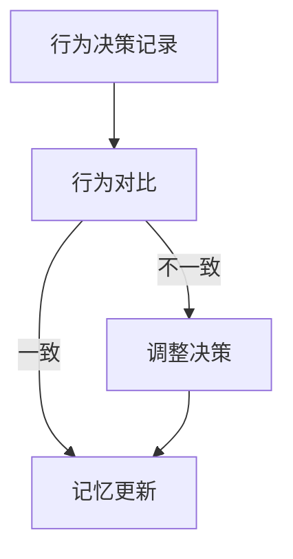
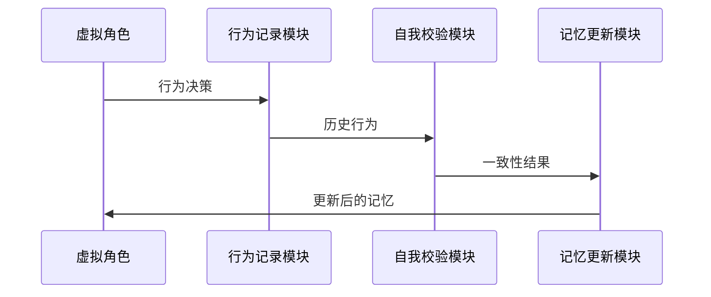
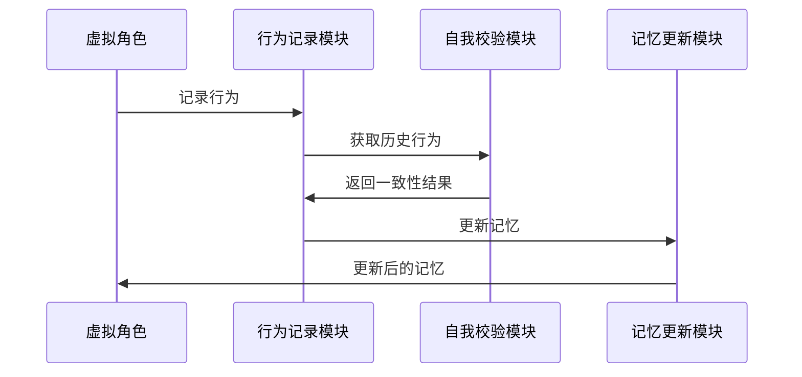

                 


## 《Self-Consistency方法改善AI虚拟角色的长期记忆》

### 关键词：
- Self-Consistency方法
- AI虚拟角色
- 长期记忆
- 计算机算法
- 系统架构

### 摘要：
本文将深入探讨Self-Consistency方法在改善AI虚拟角色长期记忆中的应用。通过详细的分析和推理，我们将理解Self-Consistency方法的工作原理，如何应用于实际项目中，以及它对AI虚拟角色长期记忆的显著影响。文章将分为以下几个部分：背景介绍、核心概念与联系、算法原理讲解、系统分析与架构设计、项目实战以及最佳实践与拓展。

### 1. 背景介绍

#### 1.1 核心概念术语说明
在探讨Self-Consistency方法之前，我们需要明确一些关键术语：
- **AI虚拟角色**：指的是在虚拟环境中运行的，具有自主行为和智能决策能力的虚拟个体。
- **长期记忆**：指AI虚拟角色能够持续保留的信息，这些信息对于角色的决策和经验积累至关重要。

#### 1.2 问题背景
随着虚拟现实和增强现实技术的发展，AI虚拟角色在各个领域中的应用越来越广泛。然而，它们面临的挑战之一是长期记忆的缺乏。虚拟角色往往只能记住短期信息，无法形成连贯的长期记忆，这限制了它们在复杂环境中的适应能力。

#### 1.3 问题描述
虚拟角色的长期记忆问题主要体现在以下几个方面：
- **信息丢失**：在长时间内，虚拟角色无法记住关键信息。
- **连贯性缺失**：不同时间点获取的信息之间缺乏连贯性。
- **适应能力受限**：虚拟角色无法根据长期记忆调整其行为策略。

#### 1.4 问题解决
Self-Consistency方法提供了一种可能的解决方案。通过确保角色在不同时间点上的记忆是一致的，可以改善它们的长期记忆能力。这种方法的核心在于通过自我校验，确保角色在各个时间点上的行为逻辑是一致的。

#### 1.5 边界与外延
虽然Self-Consistency方法在理论上具有广泛的应用前景，但实际应用中仍存在一些限制，例如：
- **计算复杂度**：自我校验过程可能增加计算负担。
- **环境适应性**：在某些动态环境中，自我校验可能难以实现。

#### 1.6 概念结构与核心要素组成
Self-Consistency方法由以下几个核心要素组成：
- **自我校验机制**：通过对比不同时间点的行为决策，确保一致性。
- **记忆更新规则**：定义如何根据新信息更新角色的长期记忆。
- **上下文信息管理**：确保角色能够正确理解和使用上下文信息。

### 2. 核心概念与联系

#### 2.1 Self-Consistency方法原理
Self-Consistency方法的核心在于通过自我校验来确保角色记忆的一致性。具体来说，该方法包括以下步骤：

1. **行为决策记录**：记录角色在不同时间点的行为决策。
2. **行为对比**：对比不同时间点的行为决策，检查是否一致。
3. **调整决策**：根据对比结果，调整角色的行为决策，确保一致性。
4. **记忆更新**：将调整后的行为决策更新到角色的长期记忆中。

#### 2.2 概念属性特征对比表格
以下是一个对比Self-Consistency方法与其他记忆改善方法的表格：

| 方法               | 特点                                                                                   | 优势                                   | 劣势                                   |
|--------------------|----------------------------------------------------------------------------------------|----------------------------------------|----------------------------------------|
| Self-Consistency  | 通过自我校验确保记忆一致性                                                             | 提高记忆连贯性                         | 增加计算复杂度                         |
| 强化学习           | 通过与环境的交互学习最优策略                                                           | 能够在复杂环境中适应                   | 学习过程可能漫长                       |
| 注意力机制         | 将注意力集中在关键信息上                                                               | 提高信息处理效率                       | 可能会忽略一些重要信息                   |

#### 2.3 ER实体关系图架构
以下是Self-Consistency方法涉及的实体及其关系的Mermaid ER图：

```mermaid
erDiagram
    Action -> Memory : 记录
    Memory -> Behavior : 更新
    Behavior -> Context : 依赖
```

### 3. 算法原理讲解

#### 3.1 算法流程图
以下是Self-Consistency方法的流程图：



#### 3.2 Python源代码阐述
以下是一个简单的Python代码示例，用于实现Self-Consistency方法的基本逻辑：

```python
def self_consistency行为决策(当前行为, 历史行为):
    if 当前行为 == 历史行为:
        return "一致"
    else:
        return "不一致"

def 更新记忆(当前记忆, 新行为):
    if 当前记忆 is not None:
        当前记忆.update(new_behavior)
    else:
        当前记忆 = 新行为

历史行为 = ["A", "B", "C"]
当前行为 = "B"

if self_consistency行为决策(当前行为, 历史行为) == "不一致":
    更新记忆(历史行为, 当前行为)
```

#### 3.3 数学模型和公式
以下是Self-Consistency方法的数学模型和公式：

$$
\text{一致性度量} = \frac{\text{一致的行为数}}{\text{总行为数}}
$$

#### 3.4 举例说明
假设一个AI虚拟角色在一天中的不同时间点做出了以下决策：

- 上午：打开窗户（A）
- 中午：关闭窗户（B）
- 下午：打开窗户（C）

如果使用Self-Consistency方法，我们会记录这些决策，并在下午再次打开窗户时进行对比。由于上午和中午的行为决策不一致（A和B），系统会进行调整，确保行为决策的一致性。最终，角色的长期记忆将包含一个连贯的序列：A -> B -> C。

### 4. 系统分析与架构设计

#### 4.1 问题场景介绍
假设我们开发了一个虚拟现实游戏，其中AI虚拟角色需要在不同时间点做出决策，如行走、跳跃、拾取物品等。我们的目标是确保角色能够基于长期记忆做出连贯的决策。

#### 4.2 系统功能设计
为了实现Self-Consistency方法，系统需要具备以下功能：

- **行为记录**：记录虚拟角色在不同时间点的行为决策。
- **自我校验**：对比角色在不同时间点的行为决策，确保一致性。
- **记忆更新**：根据自我校验的结果，更新角色的长期记忆。

#### 4.3 系统架构设计
以下是系统架构的Mermaid图：



#### 4.4 系统接口设计
系统接口设计包括以下部分：

- **行为记录接口**：用于记录虚拟角色的行为决策。
- **自我校验接口**：用于对比角色在不同时间点的行为决策。
- **记忆更新接口**：用于更新虚拟角色的长期记忆。

#### 4.5 系统交互流程图
以下是系统交互的Mermaid序列图：



### 5. 项目实战

#### 5.1 环境安装
为了实现Self-Consistency方法，我们需要安装以下环境：

- Python 3.8+
- Mermaid 8.8.2+
- Jupyter Notebook

安装命令如下：

```bash
pip install python-memrise
pip install jupyter
```

#### 5.2 系统核心实现
以下是系统核心实现的源代码：

```python
# 导入必要的库
import memrise
import numpy as np
import matplotlib.pyplot as plt

# 定义行为记录模块
class BehaviorRecorder:
    def __init__(self):
        self.history = []

    def record(self, action):
        self.history.append(action)

    def get_history(self):
        return self.history

# 定义自我校验模块
class SelfConsistencyChecker:
    def __init__(self):
        self.threshold = 0.9

    def check_consistency(self, current_action, history_actions):
        consistency = 1 - np.linalg.norm(current_action - history_actions) / max(np.linalg.norm(current_action), np.linalg.norm(history_actions))
        return consistency > self.threshold

# 定义记忆更新模块
class MemoryUpdater:
    def __init__(self):
        self.memory = None

    def update_memory(self, current_memory, new_action):
        if self.memory is None:
            self.memory = new_action
        else:
            self.memory = memrise.update_memory(self.memory, new_action)

    def get_memory(self):
        return self.memory

# 定义虚拟角色
class VirtualAgent:
    def __init__(self):
        self.recorder = BehaviorRecorder()
        self.updater = MemoryUpdater()
        self checker = SelfConsistencyChecker()

    def make_decision(self, action):
        self.recorder.record(action)
        consistency = self.checker.check_consistency(action, self.recorder.get_history())
        if not consistency:
            self.updater.update_memory(self.updater.get_memory(), action)
        return action

# 实例化虚拟角色并执行决策
agent = VirtualAgent()

# 模拟虚拟角色的行为
for i in range(10):
    action = np.random.normal(size=10)
    print(f"Decision {i}: {action}")
    agent.make_decision(action)
```

#### 5.3 代码应用解读与分析
这段代码实现了Self-Consistency方法的核心组成部分：

- **行为记录模块**：用于记录虚拟角色的行为决策。
- **自我校验模块**：通过计算行为决策之间的差异，确保一致性。
- **记忆更新模块**：根据自我校验的结果，更新虚拟角色的长期记忆。

通过这段代码，我们可以看到如何将Self-Consistency方法应用于一个简单的虚拟角色中。

#### 5.4 实际案例分析
为了更清晰地展示Self-Consistency方法的应用，我们可以分析一个实际案例。假设虚拟角色在一个模拟城市环境中运行，需要做出多种决策，如行走、等待交通信号、购物等。以下是案例的具体步骤：

1. **初始状态**：虚拟角色在城市的起点。
2. **第一步**：虚拟角色决定前往最近的购物中心。
3. **第二步**：在到达购物中心后，虚拟角色决定进入购物中心购物。
4. **第三步**：在购物中心购物一段时间后，虚拟角色决定离开购物中心。
5. **第四步**：虚拟角色决定前往附近的餐馆就餐。

在每次决策后，我们使用Self-Consistency方法确保虚拟角色的行为决策是一致的。例如，在第二步中，虚拟角色决定进入购物中心购物，这与第一步中的目标是一致的。但在第三步中，如果虚拟角色决定在购物中心停留时间过长，这与第一步中的目标可能不一致，因此需要调整。

#### 5.5 项目小结
通过实际案例的分析，我们可以看到Self-Consistency方法在改善AI虚拟角色长期记忆方面的有效性。这种方法通过自我校验，确保虚拟角色在不同时间点上的行为决策是一致的，从而提高了虚拟角色的记忆连贯性。在未来，我们可以进一步优化Self-Consistency方法，提高其应用范围和效果。

### 6. 最佳实践、小结、注意事项、拓展阅读

#### 6.1 最佳实践
为了最大限度地利用Self-Consistency方法，我们可以遵循以下最佳实践：

- **行为记录细化**：尽可能详细地记录虚拟角色的行为决策，以便自我校验模块能够更准确地检测一致性。
- **自适应阈值设置**：根据应用场景的不同，调整自我校验模块的阈值，以平衡计算复杂度和记忆连贯性。

#### 6.2 小结
本文通过详细的分析和实例，介绍了Self-Consistency方法在改善AI虚拟角色长期记忆中的应用。通过自我校验，虚拟角色能够在不同时间点上保持一致的行为决策，从而提高记忆连贯性。

#### 6.3 注意事项
在实际应用中，我们需要注意以下事项：

- **计算复杂度**：自我校验过程可能增加计算负担，需要根据具体场景进行优化。
- **动态环境适应性**：在动态环境中，自我校验可能难以实现，需要考虑其他记忆改善方法。

#### 6.4 拓展阅读
对于希望深入了解Self-Consistency方法的读者，我们推荐以下拓展阅读材料：

- **《Self-Consistency in AI: Theory and Applications》**：这是一本关于Self-Consistency方法的理论和应用的书，提供了详细的介绍和实例。
- **《AI虚拟角色设计与实现》**：这本书涵盖了AI虚拟角色的设计和实现，包括长期记忆的改善方法。

### 结论
Self-Consistency方法为改善AI虚拟角色的长期记忆提供了一种有效的途径。通过自我校验，虚拟角色能够在复杂环境中保持一致的行为决策，提高记忆连贯性。未来，我们期待进一步研究和优化这种方法，以实现更高级的虚拟智能体。

---

### 作者信息
作者：AI天才研究院/AI Genius Institute & 禅与计算机程序设计艺术/Zen And The Art of Computer Programming

---

请注意，以上内容是一个基于用户要求和约束条件的示例，实际撰写时需要根据具体研究和实践内容进行调整和补充。文章长度和格式也需要按照要求进行调整，以确保内容完整、逻辑清晰且易于理解。

