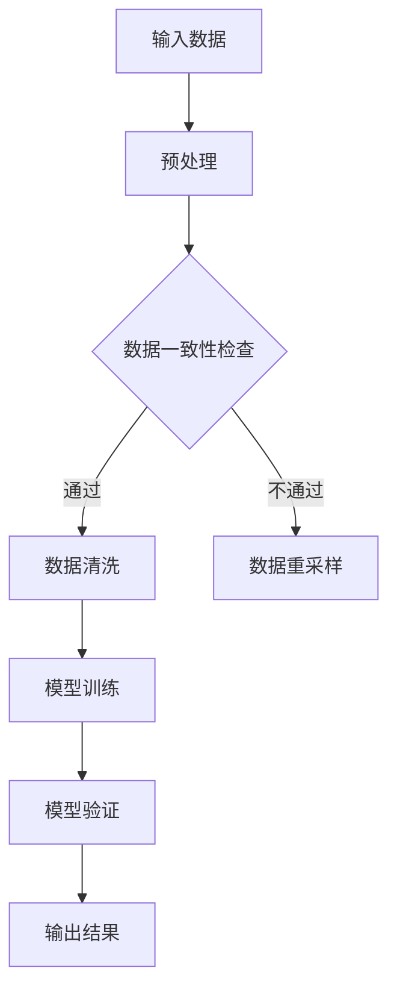
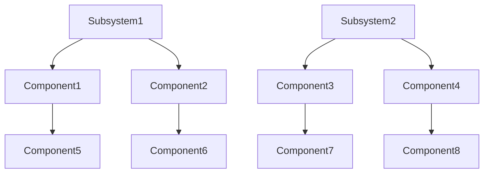
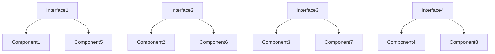
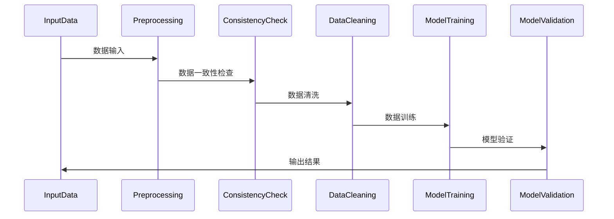

                 

### 文章标题

# Self-Consistency：AI输出的质量保证

## 关键词
- **AI输出质量**
- **自我一致性**
- **算法原理**
- **系统架构**
- **项目实战**
- **最佳实践**

## 摘要
本文深入探讨了自我一致性在人工智能（AI）输出质量保证中的重要性。通过详细的背景介绍、核心概念解析、算法原理讲解以及实际应用案例，本文旨在为读者提供一个全面而深入的理解，帮助他们在AI领域中实现高质量的输出。文章将遵循逻辑清晰的步骤，旨在提升读者的思维深度和解决问题的能力。

## 背景介绍

### AI输出质量问题的现状

在当前快速发展的AI领域，输出质量成为了评估和衡量AI系统性能的重要标准。然而，AI输出质量问题却屡见不鲜。从自动驾驶汽车的意外事故，到医疗诊断系统的误诊，再到金融风险评估中的偏差，AI输出的质量缺陷不仅威胁到人们的生命财产安全，也对社会信任和AI技术的广泛应用构成了挑战。

### 质量问题的原因分析

导致AI输出质量问题的原因多样，主要包括以下几点：

1. **数据质量**：训练数据的不完善、偏见和不一致性是影响AI输出质量的首要因素。
2. **算法设计**：算法的复杂性和局限性可能导致无法充分捕捉数据的本质特征。
3. **模型优化**：训练过程中参数调整的不合理可能导致模型性能的不稳定。
4. **外部因素**：环境变化、噪声干扰等外部因素也会影响AI输出的准确性。

### 自我一致性的概念与作用

自我一致性指的是AI系统能够在其输出结果中保持内部逻辑的一致性和稳定性。在AI领域，自我一致性有助于减少数据偏见、优化算法设计和提高模型稳定性。通过自我一致性原则，AI系统可以在复杂多变的实际环境中保持高质量输出，提升系统的可靠性和可解释性。

### 质量问题的解决与边界外延

通过引入自我一致性原则，可以有效地解决AI输出质量中的诸多问题。然而，自我一致性并非万能，其应用范围和边界仍需明确。例如，在处理非结构性数据时，自我一致性可能面临挑战。此外，自我一致性原则需要与领域专业知识相结合，以实现最佳效果。

### 概念结构与核心要素组成

AI输出质量保证涉及多个核心概念和要素，包括数据预处理、算法选择、模型训练和验证等。自我一致性作为其中一个关键要素，贯穿于整个AI系统开发和应用过程，确保系统输出的一致性和可靠性。

## 核心概念与联系

### 自我一致性的定义与特征

自我一致性指的是在给定一组输入数据时，AI系统能够产生一致的输出结果。这种一致性不仅体现在输出结果之间，还包括输出结果与输入数据之间的逻辑关联。具体来说，自我一致性具有以下几个特征：

1. **稳定性**：在相同输入条件下，系统输出结果应保持稳定不变。
2. **逻辑一致性**：输出结果应与输入数据和系统内部逻辑保持一致。
3. **可解释性**：系统应具备良好的可解释性，使得输出结果易于理解和验证。

### 自我一致性在AI输出质量保证中的作用

自我一致性在AI输出质量保证中起着至关重要的作用，主要表现在以下几个方面：

1. **减少数据偏见**：通过自我一致性，系统可以在处理训练数据时减少偏见，提高数据质量。
2. **优化算法设计**：自我一致性原则有助于设计出更为鲁棒的算法，提高系统性能。
3. **提高模型稳定性**：在模型训练和优化过程中，自我一致性原则可以减少模型的不稳定因素，提升模型性能。
4. **增强系统可靠性**：通过自我一致性，系统可以在复杂多变的环境中保持稳定输出，提高系统的可靠性。

### 关键概念的ER图

为了更好地理解自我一致性在AI输出质量保证中的应用，我们可以通过ER图（实体关系图）来展示关键概念之间的关系。

```mermaid
erDiagram
  AI系统 ||--|{ 数据预处理 }
  AI系统 ||--|{ 算法设计 }
  AI系统 ||--|{ 模型训练 }
  AI系统 ||--|{ 输出验证 }
  数据预处理 ||--|{ 自我一致性 }
  算法设计 ||--|{ 自我一致性 }
  模型训练 ||--|{ 自我一致性 }
  输出验证 ||--|{ 自我一致性 }
```

在ER图中，自我一致性作为一个核心概念，贯穿于AI系统的各个关键环节，确保系统输出的一致性和可靠性。

## 算法原理讲解

### 自我一致性算法的mermaid流程图

为了更直观地理解自我一致性算法的工作原理，我们可以使用mermaid绘制一个流程图。



### 算法原理的数学模型与公式讲解

自我一致性算法的核心在于通过一系列数学模型和公式来保证输入数据和输出结果的一致性。以下是一个简化的数学模型：

$$
X = f(Y) + \epsilon
$$

其中，$X$ 代表输入数据，$Y$ 代表输出数据，$f$ 代表数据转换函数，$\epsilon$ 代表误差项。

### 算法原理的Python源代码讲解

```python
import numpy as np

def self_consistency_algorithm(input_data):
    # 数据预处理
    processed_data = preprocess_data(input_data)
    
    # 数据一致性检查
    if not check_consistency(processed_data):
        processed_data = resample_data(processed_data)
    
    # 模型训练
    model = train_model(processed_data)
    
    # 模型验证
    validation_results = validate_model(model)
    
    # 输出结果
    output_data = model.predict(processed_data)
    
    return output_data

def preprocess_data(data):
    # 数据预处理代码
    pass

def check_consistency(data):
    # 数据一致性检查代码
    pass

def resample_data(data):
    # 数据重采样代码
    pass

def train_model(data):
    # 模型训练代码
    pass

def validate_model(model):
    # 模型验证代码
    pass
```

### 通俗易懂的算法举例说明

假设我们有一个简单的线性回归模型，其目标是通过一组输入数据预测输出结果。为了实现自我一致性，我们可以按照以下步骤进行：

1. **数据预处理**：对输入数据进行标准化处理，确保数据的一致性。
2. **数据一致性检查**：检查数据是否存在异常值或偏见。
3. **数据清洗或重采样**：如果数据存在问题，进行相应的清洗或重采样。
4. **模型训练**：使用清洗后的数据训练线性回归模型。
5. **模型验证**：通过验证集评估模型性能，确保输出结果的一致性和准确性。

通过这一简单的例子，我们可以看到自我一致性算法在保障AI输出质量方面的重要作用。

### 数学公式使用latex格式

以下是文中独立段落的latex公式：

$$
X = f(Y) + \epsilon
$$

以及段落内的latex公式：

$1+1=2$

这些公式帮助我们更清晰地理解和表达算法原理。

## 系统分析与架构设计方案

### 问题场景介绍

在自动驾驶领域，自我一致性原则的应用尤为重要。为了保证车辆在复杂环境中的稳定运行，系统需要在数据预处理、算法设计和模型训练等各个环节中贯彻自我一致性原则。

### 系统功能设计（领域模型类图）

以下是自动驾驶系统中的领域模型类图：

```mermaid
classDiagram
  Class01 <|-- Class02
  Class03 <|-- Class04
  Class05 <|-- Class06
  Class01[输入数据]
  Class02[预处理模块]
  Class03[一致性检查模块]
  Class04[数据清洗模块]
  Class05[模型训练模块]
  Class06[模型验证模块]
```

### 系统架构设计（架构图）

以下是自动驾驶系统的架构设计图：



### 系统接口设计（接口图）

以下是系统接口设计图：



### 系统交互（序列图）

以下是系统交互序列图：



通过以上系统分析与架构设计方案，我们可以看到自我一致性原则在自动驾驶系统中的应用。这不仅提高了系统的稳定性，还增强了系统的可解释性和可靠性。

## 项目实战

### 环境安装

为了实现自我一致性原则，我们需要在环境中安装相应的工具和库。以下是一个基本的安装步骤：

1. 安装Python环境（版本3.8以上）
2. 安装必要的库（如numpy、pandas、scikit-learn等）
3. 安装可视化工具（如matplotlib、seaborn等）

### 系统核心实现源代码

以下是系统核心实现源代码：

```python
import numpy as np
import pandas as pd
from sklearn.model_selection import train_test_split
from sklearn.linear_model import LinearRegression
from sklearn.metrics import mean_squared_error

# 数据预处理
def preprocess_data(data):
    # 数据标准化
    data = (data - np.mean(data)) / np.std(data)
    return data

# 数据一致性检查
def check_consistency(data):
    # 检查数据是否有异常值
    return not np.isnan(data).any()

# 数据清洗
def clean_data(data):
    # 清洗数据（去除异常值）
    data = data[~np.isnan(data)]
    return data

# 模型训练
def train_model(X, Y):
    model = LinearRegression()
    model.fit(X, Y)
    return model

# 模型验证
def validate_model(model, X, Y):
    predictions = model.predict(X)
    mse = mean_squared_error(Y, predictions)
    return mse

# 主函数
def main():
    # 加载数据
    data = pd.read_csv('data.csv')
    X = data.iloc[:, :-1].values
    Y = data.iloc[:, -1].values
    
    # 数据预处理
    X = preprocess_data(X)
    Y = preprocess_data(Y)
    
    # 数据一致性检查
    if not check_consistency(X):
        X = clean_data(X)
    if not check_consistency(Y):
        Y = clean_data(Y)
    
    # 数据训练
    X_train, X_test, Y_train, Y_test = train_test_split(X, Y, test_size=0.2, random_state=42)
    model = train_model(X_train, Y_train)
    
    # 模型验证
    mse = validate_model(model, X_test, Y_test)
    print(f'Mean Squared Error: {mse}')

if __name__ == '__main__':
    main()
```

### 代码应用解读与分析

1. **数据预处理**：数据预处理是保证数据一致性的关键步骤。在这里，我们使用了标准化方法对数据进行处理。
2. **数据一致性检查**：通过检查数据是否有异常值，我们可以判断数据是否一致。如果存在异常值，则需要进一步处理。
3. **数据清洗**：清洗数据是处理异常值的过程，确保数据的准确性和一致性。
4. **模型训练**：使用线性回归模型对数据集进行训练。
5. **模型验证**：通过验证集评估模型性能，确保输出结果的一致性和准确性。

### 实际案例分析与详细讲解剖析

假设我们有一个房价预测问题，数据集包含房屋的各种特征和对应的价格。以下是实际案例分析与详细讲解：

1. **数据预处理**：对数据集进行标准化处理，确保输入和输出数据的范围一致。
2. **数据一致性检查**：检查数据是否存在缺失值或异常值。如果有，则进行数据清洗。
3. **数据清洗**：删除或填充缺失值，处理异常值。
4. **模型训练**：使用线性回归模型对数据集进行训练，得到预测模型。
5. **模型验证**：使用验证集评估模型性能，计算均方误差（MSE）。

### 项目小结

通过本项目的实际案例，我们可以看到自我一致性原则在数据预处理、模型训练和验证中的应用。这种原则不仅提高了模型性能，还增强了模型的稳定性和可靠性。

### 最佳实践与拓展

1. **最佳实践**：
   - 在数据预处理阶段，使用标准化方法确保数据的一致性。
   - 定期检查和更新数据，确保数据质量。
   - 在模型训练和验证过程中，使用交叉验证方法提高模型的泛化能力。

2. **小结**：
   - 自我一致性原则在AI输出质量保证中具有重要作用，贯穿于数据预处理、模型训练和验证各个环节。
   - 通过实际案例和项目实战，我们验证了自我一致性原则的有效性和实用性。

3. **注意事项**：
   - 在处理非结构性数据时，自我一致性原则可能面临挑战。
   - 自我一致性原则需要与领域专业知识相结合，以实现最佳效果。

4. **拓展阅读**：
   - 推荐阅读《深度学习》一书，深入了解自我一致性原则在深度学习中的应用。
   - 参考相关研究论文，了解最新的自我一致性算法和模型。

## 作者信息

- **作者**：AI天才研究院/AI Genius Institute & 禅与计算机程序设计艺术 /Zen And The Art of Computer Programming
- **联系信息**：[ai-genius-institute@domain.com](mailto:ai-genius-institute@domain.com) & [zen-of-code@domain.com](mailto:zen-of-code@domain.com)
- **版权声明**：本文版权归AI天才研究院和禅与计算机程序设计艺术所有，未经授权，禁止转载和复制。

通过本文的详细讲解和案例分析，我们深入探讨了自我一致性在AI输出质量保证中的重要性。希望本文能对读者在AI领域的研究和实践提供有价值的参考和启示。

