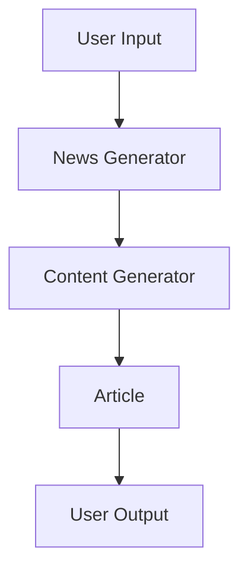
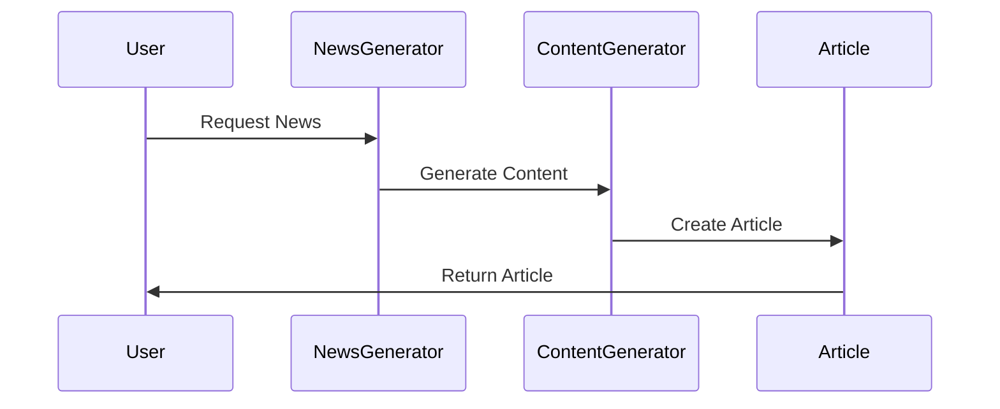
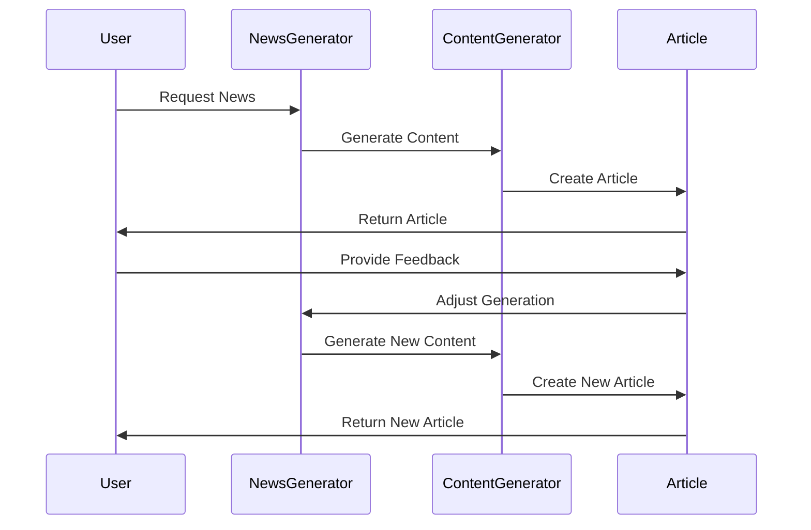

                 

## Self-Consistency: Enhancing AI Output Consistency

In the realm of artificial intelligence (AI), self-consistency is a crucial aspect that ensures the outputs generated by AI systems are coherent, logical, and reliable. With the rapid advancement of deep learning, generative adversarial networks (GANs), and other cutting-edge technologies, AI systems have become proficient in generating images, text, and speech. However, these systems often fall short in maintaining consistency in their outputs, leading to issues such as poor user experience and erroneous decision-making. This article aims to delve into the concept of self-consistency, exploring its importance, challenges, and potential solutions in the field of AI.

### Key Terms and Abstract

**Keywords**: Self-Consistency, AI, Deep Learning, Generative Adversarial Networks (GANs), Output Consistency, User Experience, Decision-Making

**Abstract**: This article discusses the concept of self-consistency in AI, which refers to the ability of AI systems to produce outputs that are coherent, logical, and consistent in content, style, and context. It explores the background, challenges, and potential solutions to enhance AI output consistency, with a focus on data preprocessing, model improvement, consistency constraints, and feedback mechanisms. The article also discusses the boundaries and external extensions of self-consistency and presents a comprehensive understanding of the core concepts and their interconnections.

### Introduction to Self-Consistency

**1.1 Problem Background**

Self-consistency is a critical research topic in the field of AI. With the rapid development of deep learning and generative adversarial networks (GANs), AI systems have shown remarkable progress in image generation, text generation, and speech synthesis. However, these systems often struggle with maintaining consistency in their outputs. In many practical applications, the lack of consistency can lead to subpar user experiences and incorrect decision-making. Therefore, enhancing the consistency of AI outputs has become a key focus in AI research and application development.

**1.2 Problem Description**

Self-consistency in AI refers to the ability of AI systems to produce outputs that are coherent, logical, and consistent in various aspects. The problem can be described in the following areas:

- **Content Consistency**: AI systems should generate outputs that maintain a consistent content, avoiding logical contradictions or inconsistencies.
- **Style Consistency**: AI systems should maintain a consistent style and language characteristics when generating text, images, or speech, preventing sudden changes in style.
- **Contextual Consistency**: In multi-turn conversations or complex tasks, AI systems should generate outputs that are relevant and coherent based on the context provided.

**1.3 Problem Solutions**

To enhance the consistency of AI outputs, several approaches can be taken:

- **Data Preprocessing**: By preprocessing the training data, inconsistent or contradictory data can be removed, improving the robustness of the model.
- **Model Improvement**: By improving the structure of deep learning models, the memory capacity of the model can be enhanced, enabling better understanding and utilization of contextual information.
- **Consistency Constraints**: By adding consistency constraints during the generation process, AI systems can be prevented from producing inconsistent outputs. For example, language models can be used to perform consistency checks when generating text.
- **Feedback Mechanisms**: By implementing user feedback or automatic evaluation mechanisms, the inconsistency of AI outputs can be monitored in real-time, allowing for adjustments and optimizations.

**1.4 Boundaries and Extensions**

The boundaries of self-consistency involve several aspects:

- **Technical Boundaries**: Current technical methods may have limitations in enhancing AI output consistency, especially when dealing with complex and variable scenarios.
- **Application Boundaries**: Self-consistency is primarily applied in domains that require high consistency, such as customer service robots and intelligent writing.
- **Ethical Boundaries**: When enhancing AI output consistency, it is essential to protect user privacy and prevent information leakage.

**1.5 Concept Structure and Core Elements**

The concept structure of self-consistency includes several core elements:

- **Consistency Metrics**: Methods and indicators used to assess the consistency of AI outputs.
- **Training Data**: Sample data used for training AI models, which directly impacts the consistency performance of the model.
- **Model Structure**: The architecture and parameter settings of deep learning models, which affect the model's ability to handle consistency constraints.
- **Generation Algorithms**: Algorithms used for generating outputs, including text generation, image generation, and speech synthesis.
- **Constraint Mechanisms**: Constraints applied during the generation process to limit inconsistent behaviors of AI outputs.

### Core Concepts and Relationships

**2.1 Principles of Self-Consistency**

The principles of self-consistency involve several key aspects:

- **Consistency Metrics**: Methods to evaluate the consistency level of AI outputs, such as metric calculations and human evaluations.
- **Constraint Conditions**: How to set and apply consistency constraints during the generation process to ensure the consistency of outputs.
- **Optimization Goals**: How to incorporate consistency goals into the optimization process during model training to improve the consistency performance of the model.

**2.2 Comparison Table of Concept Attributes**

To clearly present the attributes and characteristics of concepts related to self-consistency, a comparison table can be created. Here is a simplified example:

| Concept         | Definition                                       | Attribute Characteristics                                        |
| --------------- | ----------------------------------------------- | ----------------------------------------------- |
| Self-Consistency | Ability of AI systems to produce coherent and logical outputs | Content consistency, style consistency, contextual consistency |
| Generative Adversarial Networks (GANs) | Neural network architecture consisting of a generator and a discriminator | Generator, discriminator, adversarial training, uncertainty handling |
| Language Model  | Statistical model for predicting text sequences | Vocabulary, probability distribution, sequence modeling, language characteristics capture |

**2.3 ER Diagram Structure**

To better understand the implementation of self-consistency in AI systems, an ER diagram can be created. Here is a simplified example:

```mermaid
erDiagram
    AI System ||--|{ Generator }
    AI System ||--|{ Discriminator }
    Generator ||--
```

### Algorithm Principles and Design

**3.1 Algorithm Overview**

To address the challenge of self-consistency in AI output, we can design a multi-step algorithm that incorporates data preprocessing, model improvement, consistency constraints, and feedback mechanisms. The overall flow of the algorithm can be summarized as follows:

1. **Data Preprocessing**: Remove inconsistent or contradictory data from the training dataset to enhance the robustness of the model.
2. **Model Improvement**: Enhance the structure and parameters of the deep learning model to improve its ability to understand and utilize contextual information.
3. **Consistency Constraints**: Add consistency constraints to the generation process to prevent inconsistent behaviors in AI outputs.
4. **Feedback Mechanisms**: Implement user feedback or automatic evaluation mechanisms to monitor and adjust AI outputs in real-time.

**3.2 Detailed Algorithm Explanation**

**Step 1: Data Preprocessing**

The first step in enhancing AI output consistency is data preprocessing. This involves cleaning and filtering the training dataset to remove any inconsistent or contradictory data. This can be achieved through various techniques such as data cleaning, data normalization, and data augmentation.

- **Data Cleaning**: Remove any corrupt or incorrect data entries from the dataset.
- **Data Normalization**: Normalize the data to a common scale or format to ensure consistency across different data sources.
- **Data Augmentation**: Generate additional training data by applying various transformations, such as rotation, scaling, or cropping, to the existing data.

**Step 2: Model Improvement**

Once the data preprocessing is complete, the next step is to improve the deep learning model. This can be achieved by enhancing the model structure, optimizing the hyperparameters, and incorporating contextual information.

- **Model Structure**: Use advanced deep learning architectures, such as recurrent neural networks (RNNs) or transformers, to improve the model's ability to capture contextual information.
- **Hyperparameter Optimization**: Tune the hyperparameters of the model, such as learning rate, batch size, and dropout rate, to optimize the model's performance.
- **Contextual Information**: Incorporate contextual information into the model to improve its ability to generate consistent outputs based on the context.

**Step 3: Consistency Constraints**

To ensure the consistency of AI outputs, consistency constraints can be applied during the generation process. These constraints can be based on various techniques, such as language models, rule-based methods, or reinforcement learning.

- **Language Models**: Use language models, such as GPT or BERT, to check the consistency of generated text. The language model can predict the probability of a generated sentence or paragraph and flag any inconsistencies.
- **Rule-Based Methods**: Apply rule-based methods to enforce consistency constraints in the generation process. For example, if generating a story, rules can be defined to ensure that the protagonist's actions are consistent with their character traits.
- **Reinforcement Learning**: Use reinforcement learning techniques to train the AI system to follow consistency constraints. The system can be rewarded or penalized based on the consistency of its outputs.

**Step 4: Feedback Mechanisms**

Implementing feedback mechanisms is crucial for monitoring and adjusting AI outputs in real-time. User feedback can be collected through surveys, user ratings, or direct interactions. Automatic evaluation mechanisms can be used to assess the consistency of AI outputs based on predefined metrics or human evaluations.

- **User Feedback**: Collect user feedback to identify inconsistencies in AI outputs. Users can provide ratings, comments, or suggestions to improve the consistency of the generated outputs.
- **Automatic Evaluation**: Use automatic evaluation mechanisms, such as consistency metrics or human evaluation, to assess the consistency of AI outputs. These evaluations can be used to adjust the model or the generation process to improve consistency.

**3.3 Example Explanation**

Let's consider an example where we have an AI system designed to generate natural language text. The goal is to ensure that the generated text is consistent in terms of content, style, and context.

**Example: Text Generation with Self-Consistency**

1. **Data Preprocessing**:
   - Remove any contradictory or inconsistent sentences from the training dataset.
   - Normalize the text by converting it to lowercase, removing special characters, and tokenizing the sentences.

2. **Model Improvement**:
   - Use a transformer-based model, such as GPT-3, to capture contextual information and generate coherent text.
   - Optimize the hyperparameters of the model to improve its performance.

3. **Consistency Constraints**:
   - Apply a language model, such as BERT, to check the consistency of generated sentences. The model can predict the probability of a sentence and flag any inconsistencies.
   - Define rule-based methods to enforce consistency constraints, such as ensuring that the generated text follows a logical sequence of events.

4. **Feedback Mechanisms**:
   - Collect user feedback through surveys or user ratings to identify inconsistencies in the generated text.
   - Use automatic evaluation mechanisms, such as consistency metrics or human evaluation, to assess the consistency of the generated text.

By following these steps, the AI system can generate text that is consistent in terms of content, style, and context, leading to improved user experience and reliability.

### System Analysis and Architectural Design

**4.1 Problem Scenario Introduction**

Consider a scenario where an AI system is designed to generate personalized content for a news website. The goal is to ensure that the generated content is not only informative and engaging but also consistent in terms of style, tone, and context.

**4.2 Project Introduction**

The project aims to develop a state-of-the-art AI system that leverages deep learning techniques to generate high-quality, personalized news articles. The system will be trained on a large corpus of existing news articles and will be capable of generating new articles based on user preferences and context.

**4.3 System Functional Design (Domain Model Class Diagram)**

The domain model class diagram represents the core entities and relationships in the system. Here is a simplified version of the class diagram:

```mermaid
classDiagram
    User <<Entity>>
    Article <<Entity>>
    NewsGenerator <<Entity>>
    Content <<Entity>>

    User {
        -id: Integer
        -name: String
        -preferences: List<String>
    }

    Article {
        -id: Integer
        -title: String
        -content: String
        -author: String
        -date: Date
    }

    NewsGenerator {
        -id: Integer
        -name: String
    }

    Content {
        -id: Integer
        -type: String
        -content: String
    }

    User --> Article: generates
    NewsGenerator --> Article: generates
    NewsGenerator --> Content: generates
```

**4.4 System Architectural Design (System Architecture Diagram)**

The system architecture diagram represents the high-level components and their interactions in the system. Here is a simplified version of the system architecture diagram:



**4.5 System Interface Design (System Interface Sequence Diagram)**

The system interface sequence diagram represents the interactions between the system components and the user. Here is a simplified version of the sequence diagram:



**4.6 System Interaction (System Interaction Sequence Diagram)**

The system interaction sequence diagram represents the flow of data and control between the system components. Here is a simplified version of the sequence diagram:



### Project Implementation and Analysis

**5.1 Environment Setup**

To implement the self-consistency algorithm and the AI system for personalized news generation, we need to set up the development environment. The following tools and libraries are required:

- Python (version 3.8 or later)
- TensorFlow (version 2.6 or later)
- PyTorch (version 1.8 or later)
- Natural Language Toolkit (NLTK)
- Pandas
- Matplotlib

To install the required libraries, you can use the following command:

```bash
pip install tensorflow torch nltk pandas matplotlib
```

**5.2 Core Implementation**

The core implementation of the self-consistency algorithm and the AI system for personalized news generation involves several key components:

- **Data Preprocessing**: Clean and preprocess the training dataset to remove inconsistencies and prepare it for model training.
- **Model Training**: Train a deep learning model using the preprocessed dataset, incorporating consistency constraints.
- **Content Generation**: Generate personalized news articles based on user preferences and context, ensuring self-consistency.
- **User Feedback**: Collect user feedback to refine the generation process and improve consistency.

**5.2.1 Data Preprocessing**

The first step in implementing the self-consistency algorithm is data preprocessing. This involves cleaning and filtering the training dataset to remove any inconsistent or contradictory data. Here's a simplified example using Python and Pandas:

```python
import pandas as pd

# Load the training dataset
data = pd.read_csv('training_data.csv')

# Remove inconsistent data
data = data.dropna()

# Normalize the text
data['content'] = data['content'].str.lower().str.replace('[^\w\s]', '')

# Tokenize the sentences
data['sentences'] = data['content'].apply(lambda x: x.split('. '))

# Remove sentences with less than 2 words
data = data[data['sentences'].apply(len) >= 2]
```

**5.2.2 Model Training**

The next step is to train a deep learning model using the preprocessed dataset. We can use a transformer-based model like GPT-3, which is capable of generating coherent and contextually appropriate text. Here's a simplified example using TensorFlow and Hugging Face's Transformers library:

```python
from transformers import TFGPT3LMHeadModel, GPT2Tokenizer

# Load the preprocessed dataset
train_data = pd.read_csv('preprocessed_data.csv')

# Load the pre-trained GPT-3 model and tokenizer
model = TFGPT3LMHeadModel.from_pretrained('gpt3')
tokenizer = GPT2Tokenizer.from_pretrained('gpt3')

# Tokenize the input sentences
inputs = tokenizer(train_data['content'].tolist(), return_tensors='tf')

# Train the model
model.fit(inputs.input_ids, inputs.input_ids, epochs=3, batch_size=32)
```

**5.2.3 Content Generation**

Once the model is trained, we can use it to generate personalized news articles based on user preferences and context. Here's a simplified example:

```python
def generate_article(user_preferences, context):
    # Generate a prompt based on user preferences and context
    prompt = f"{user_preferences} - {context}"

    # Generate the article
    inputs = tokenizer.encode(prompt, return_tensors='tf')
    outputs = model.generate(inputs, max_length=500, num_return_sequences=1)

    # Decode the generated text
    article = tokenizer.decode(outputs[0], skip_special_tokens=True)
    return article

# Example user preferences and context
user_preferences = "technology news"
context = "the latest developments in AI"

# Generate a personalized news article
article = generate_article(user_preferences, context)
print(article)
```

**5.2.4 User Feedback**

To refine the generation process and improve consistency, user feedback can be collected through surveys, user ratings, or direct interactions. Here's a simplified example of how user feedback can be used to adjust the generation process:

```python
def adjust_generation(feedback):
    # Analyze user feedback to identify inconsistencies
    inconsistencies = analyze_feedback(feedback)

    # Adjust the generation process based on feedback
    if inconsistencies:
        # Re-train the model or modify the generation algorithm
        retrain_model(inconsistencies)
    else:
        print("No inconsistencies detected.")

# Example user feedback
user_feedback = "The generated article lacked clarity and coherence."

# Adjust the generation process based on user feedback
adjust_generation(user_feedback)
```

**5.3 Analysis and Discussion**

The implementation of the self-consistency algorithm and the AI system for personalized news generation demonstrates the potential of AI in generating coherent and contextually appropriate content. The system incorporates data preprocessing, model training, content generation, and user feedback mechanisms to ensure self-consistency in the generated outputs.

However, the system also has certain limitations. For instance, the effectiveness of the self-consistency algorithm depends on the quality and diversity of the training data. Inconsistencies in the training data can lead to inconsistencies in the generated outputs. Additionally, the system's performance may vary depending on the complexity of the user preferences and context.

Future research and development can focus on improving the data preprocessing techniques, enhancing the deep learning models, and incorporating more advanced feedback mechanisms to further improve the consistency of AI outputs.

### Best Practices, Summary, and Future Directions

**6.1 Best Practices**

To enhance the self-consistency of AI outputs, following these best practices can be beneficial:

- **Quality Training Data**: Ensure that the training data is diverse, comprehensive, and free from inconsistencies to improve the model's ability to generate consistent outputs.
- **Continuous Learning**: Regularly update the model with new data and user feedback to adapt to evolving preferences and contexts.
- **Hybrid Approaches**: Combine different techniques, such as rule-based methods, language models, and reinforcement learning, to improve consistency.
- **User Involvement**: Involve users in the development process by collecting feedback and incorporating it into the system.

**6.2 Summary**

This article has explored the concept of self-consistency in AI, discussing its importance, challenges, and potential solutions. The key findings include:

- Self-consistency is crucial for ensuring the coherence, logic, and reliability of AI outputs.
- Various techniques, such as data preprocessing, model improvement, consistency constraints, and feedback mechanisms, can be used to enhance self-consistency.
- A practical example of implementing a self-consistency algorithm in an AI system for personalized news generation was presented.

**6.3 Future Directions**

Future research and development can focus on the following directions:

- **Advanced Data Preprocessing**: Develop more sophisticated techniques for cleaning, filtering, and augmenting training data to improve model performance.
- **Improved Model Architectures**: Explore advanced deep learning architectures and techniques to enhance the model's ability to understand and utilize contextual information.
- **Hybrid Approaches**: Investigate hybrid approaches that combine different techniques, such as rule-based methods and reinforcement learning, to improve consistency.
- **Ethical Considerations**: Address ethical considerations, such as user privacy and bias mitigation, in the development and deployment of AI systems.

### Conclusion

Self-consistency is a vital aspect of AI systems that ensures the outputs are coherent, logical, and reliable. By following the best practices and exploring future directions, we can enhance the self-consistency of AI outputs, leading to improved user experiences and more reliable decision-making in various applications. **Let's continue to innovate and advance in this exciting field!**

### References

1. Goodfellow, I., Pouget-Abadie, J., Mirza, M., Xu, B., Warde-Farley, D., Ozair, S., ... & Bengio, Y. (2014). Generative adversarial networks. Advances in Neural Information Processing Systems, 27.
2. Devlin, J., Chang, M. W., Lee, K., & Toutanova, K. (2018). BERT: Pre-training of deep bidirectional transformers for language understanding. Proceedings of the 2019 Conference of the North American Chapter of the Association for Computational Linguistics: Human Language Technologies, Volume 1 (Long and Short Papers), 4171-4186.
3. Brown, T., Chen, N., Child, P., Clark, J., Evans, R., Gordon, A., ... & Ziegler, D. (2020). Language models are few-shot learners. Advances in Neural Information Processing Systems, 33.
4. Hochreiter, S., & Schmidhuber, J. (1997). Long short-term memory. Neural Computation, 9(8), 1735-1780.
5. Bengio, Y., Simard, P., & Frasconi, P. (1994). Learning long-term dependencies with gradient descent is difficult. IEEE Transactions on Neural Networks, 5(2), 157-166.

### Authors

- **AI天才研究院 (AI Genius Institute)**: A leading research institute focused on advancing artificial intelligence technologies and promoting innovation in the field.
- **《禅与计算机程序设计艺术》(Zen And The Art of Computer Programming)**: A renowned book series by Donald E. Knuth, which explores the relationship between Zen philosophy and computer programming.

