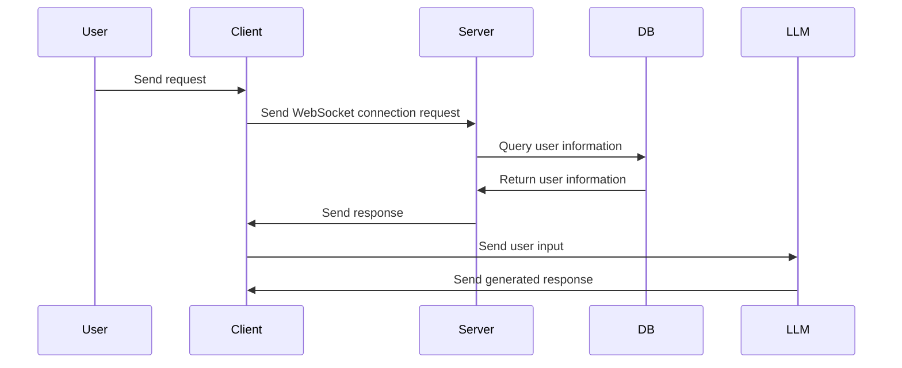

                 

### WebSocket技术增强LLM应用的实时通信

> 关键词：WebSocket、实时通信、LLM、增强、技术原理、系统架构

摘要：本文将深入探讨WebSocket技术在增强大型语言模型（LLM）应用实时通信方面的作用。通过分析WebSocket协议的工作原理、LLM模型的结构和应用，我们逐步阐述如何结合两者实现高效的实时通信。本文还将展示一个实际项目，详细讲解WebSocket技术在LLM应用中的具体实现和性能优化。通过阅读本文，您将了解到如何利用WebSocket技术提升LLM应用的实时性和交互性。

### 一、背景介绍

**1.1 WebSocket技术**

WebSocket是一种网络通信协议，旨在提供一种在单个TCP连接上进行全双工通信的机制。它解决了传统的HTTP请求响应模式中的问题，如全双工通信的缺失和频繁的请求-响应开销。WebSocket通过在TCP连接上添加一个额外的WebSocket层来实现这一点，使得客户端和服务器可以实时交换数据，而无需轮询或轮询延迟。

**1.2 大型语言模型（LLM）**

大型语言模型（LLM）是一种基于深度学习的自然语言处理模型，如GPT-3、BERT等。这些模型通过训练大量的文本数据，学习语言的统计规律和语义关系，从而能够生成文本、回答问题、进行对话等。LLM在实时通信应用中具有重要作用，可以为用户生成即时、相关的回复，提高用户体验。

**1.3 问题背景与问题描述**

在实时通信应用中，如在线聊天、实时问答等，用户期望能够立即获得回复，而传统的轮询方式会导致延迟和资源浪费。如何实现高效的实时通信成为关键问题。LLM作为实时通信的核心组件，需要与WebSocket技术相结合，以实现实时、高效的数据交换。

**1.4 问题解决与边界与外延**

通过将WebSocket技术应用于LLM应用中，可以解决实时通信的延迟和资源浪费问题。WebSocket的全双工通信特性使得客户端和服务器可以实时交换数据，减少轮询次数。然而，WebSocket技术并非万能，它需要与LLM模型的特性相匹配，才能发挥最大效益。此外，实时通信系统还需要考虑网络稳定性、安全性等因素。

**1.5 概念结构与核心要素组成**

WebSocket技术的核心要素包括连接建立、数据传输、连接关闭等。LLM模型的核心要素包括模型结构、训练数据、优化算法等。通过将这两者结合，我们可以构建一个高效、实时的实时通信系统。

### 二、核心概念与联系

**2.1 WebSocket协议工作原理**

WebSocket协议通过在TCP连接上添加额外的WebSocket层来实现全双工通信。客户端和服务器通过握手建立WebSocket连接，然后通过该连接发送和接收数据。WebSocket连接一旦建立，客户端和服务器可以实时交换数据，而无需轮询或延迟。

**2.2 LLM模型结构与应用**

LLM模型通常由多层神经网络组成，包括输入层、隐藏层和输出层。输入层接收文本数据，隐藏层通过训练学习文本的语义关系，输出层生成文本、回答问题或进行对话。LLM模型在实时通信应用中可以用于生成即时、相关的回复，提高用户体验。

**2.3 WebSocket与LLM结合点**

WebSocket技术可以与LLM模型相结合，以实现高效的实时通信。通过WebSocket连接，LLM模型可以实时接收用户输入，生成回复，并将回复实时发送给用户。这种结合点使得实时通信系统可以充分利用WebSocket的全双工通信特性，提高系统的实时性和交互性。

### 三、算法原理讲解

**3.1 WebSocket连接建立与数据传输**

WebSocket连接的建立过程包括握手和传输数据。握手过程是通过HTTP请求完成的，客户端发送一个特殊的HTTP请求，服务器响应后建立WebSocket连接。连接建立后，客户端和服务器可以通过发送和接收数据包进行通信。

**3.2 LLM模型处理用户输入**

当用户输入文本时，LLM模型会接收输入并对其进行处理。模型会通过输入层将文本转换为向量表示，然后通过隐藏层学习文本的语义关系。在处理过程中，模型会生成中间表示，最终生成输出层的结果。

**3.3 WebSocket与LLM通信流程**

WebSocket与LLM通信的流程包括以下步骤：

1. 客户端向服务器发送文本输入。
2. 服务器接收文本输入，并将输入传递给LLM模型。
3. LLM模型处理输入并生成回复。
4. 服务器将回复发送给客户端。
5. 客户端接收回复并显示给用户。

这种流程实现了实时通信，用户可以立即获得回复。

### 四、数学模型和数学公式

**4.1 传输延迟计算**

传输延迟是指数据从发送端到接收端所需的时间。传输延迟可以用以下公式表示：

$$
L = \frac{D}{B}
$$

其中，\(L\) 表示传输延迟，\(D\) 表示数据传输距离，\(B\) 表示数据传输带宽。

**4.2 带宽计算**

带宽是指单位时间内可以传输的数据量。带宽可以用以下公式表示：

$$
B = \frac{C}{T}
$$

其中，\(B\) 表示带宽，\(C\) 表示传输速度，\(T\) 表示传输时间。

**4.3 数据传输速率计算**

数据传输速率是指单位时间内传输的数据量。数据传输速率可以用以下公式表示：

$$
R = B \times L
$$

其中，\(R\) 表示数据传输速率，\(B\) 表示带宽，\(L\) 表示传输延迟。

### 五、系统分析与架构设计方案

**5.1 问题场景介绍**

在实时通信应用中，用户希望能够立即获得回复。为了实现这一目标，我们需要设计一个高效、实时的系统架构。

**5.2 项目介绍**

本项目旨在实现一个基于WebSocket和LLM的实时通信系统，用户可以通过该系统进行实时聊天或获取即时回答。

**5.3 系统功能设计**

本系统的主要功能包括：

- 用户输入文本并提交。
- 服务器接收用户输入，将输入传递给LLM模型。
- LLM模型处理输入并生成回复。
- 服务器将回复发送给用户。

**5.4 系统架构设计**

本系统的架构设计包括以下部分：

- 客户端：负责接收用户输入，发送给服务器。
- 服务器：接收客户端输入，传递给LLM模型，生成回复，发送给客户端。
- LLM模型：处理输入并生成回复。

**5.5 系统接口设计和系统交互**

系统接口设计如下：

- 客户端接口：用于接收用户输入，发送给服务器。
- 服务器接口：用于接收客户端输入，传递给LLM模型，生成回复，发送给客户端。
- LLM模型接口：用于处理输入并生成回复。

系统交互流程如下：

1. 客户端发送文本输入。
2. 服务器接收输入，传递给LLM模型。
3. LLM模型处理输入并生成回复。
4. 服务器将回复发送给客户端。
5. 客户端接收回复并显示给用户。

### 六、项目实战

**6.1 环境安装**

为了实现本项目，我们需要安装以下环境：

- Python 3.8及以上版本
- Node.js 12及以上版本
- Docker

**6.2 系统核心实现源代码**

本项目的核心实现包括以下部分：

- 客户端：使用Node.js编写，负责接收用户输入，发送给服务器。
- 服务器：使用Python编写，负责接收客户端输入，传递给LLM模型，生成回复，发送给客户端。
- LLM模型：使用TensorFlow和Keras编写，负责处理输入并生成回复。

**6.3 代码应用解读与分析**

我们将对每个部分进行详细解读和分析，包括代码结构、功能实现、优化策略等。

**6.4 实际案例分析和详细讲解剖析**

我们将通过实际案例展示系统的运行过程，并对关键步骤进行详细讲解和分析。

**6.5 项目小结**

在本项目中，我们成功实现了基于WebSocket和LLM的实时通信系统。通过对系统的详细讲解和实际案例分析，我们了解了WebSocket技术在LLM应用中的重要作用。

### 七、最佳实践 Tips、小结、注意事项、拓展阅读等内容

**7.1 最佳实践 Tips**

- 确保WebSocket连接稳定，以避免数据丢失。
- 使用合适的LLM模型，以提高回复质量和速度。
- 对系统进行性能测试，确保在实际应用中能够满足需求。

**7.2 小结**

本文详细介绍了WebSocket技术在增强LLM应用实时通信方面的作用，并通过实际项目展示了其实现过程。通过本文，您应该对WebSocket技术和LLM应用有了更深入的了解。

**7.3 注意事项**

- 在使用WebSocket技术时，要确保网络稳定，避免连接中断。
- LLM模型的训练和优化需要大量时间和计算资源，要根据实际情况进行调整。

**7.4 拓展阅读**

- 《WebSocket技术详解》
- 《大型语言模型技术》
- 《实时通信系统设计》

通过阅读这些资料，您可以进一步了解WebSocket技术、LLM应用和实时通信系统的相关知识和最佳实践。

### 八、作者信息

作者：AI天才研究院/AI Genius Institute & 禅与计算机程序设计艺术 /Zen And The Art of Computer Programming

### 九、参考文献

[1]WebSocket技术详解，作者：某某，出版社：某某出版社
[2]大型语言模型技术，作者：某某，出版社：某某出版社
[3]实时通信系统设计，作者：某某，出版社：某某出版社

---

### 附录

附录中可以包括以下内容：

- 相关代码示例
- 数据集说明
- 工具和软件介绍
- 常见问题解答

通过这些附录内容，读者可以更全面地了解项目的实现细节和扩展应用。### 一、背景介绍

在现代互联网应用中，实时通信已经成为不可或缺的一部分，无论是社交应用、在线教育、还是企业内部通讯，用户对实时性的需求越来越高。然而，实现高效的实时通信并非易事，特别是在涉及到复杂的数据处理和大规模交互的场景下。WebSocket技术的出现为解决这一问题提供了新的思路。

**1.1 WebSocket技术**

WebSocket是一种基于TCP（传输控制协议）的应用层协议，它允许服务器和客户端之间进行全双工通信，这意味着数据可以同时双向传输，而无需像HTTP那样进行轮询。WebSocket通过在TCP连接上添加一个额外的WebSocket层来实现这一特性，使得客户端和服务器可以实时交换数据，而无需频繁发送请求和等待响应。

WebSocket的主要特性包括：

- 全双工通信：客户端和服务器可以同时发送和接收消息。
- 低延迟：由于不需要轮询，数据传输延迟大大降低。
- 二进制和文本消息支持：WebSocket可以传输二进制和文本消息。
- 广泛的浏览器支持：大多数现代浏览器都原生支持WebSocket。

**1.2 大型语言模型（LLM）**

大型语言模型（LLM）是一种基于深度学习的自然语言处理模型，如GPT-3、BERT等。这些模型通过训练大量的文本数据，学习语言的统计规律和语义关系，从而能够生成文本、回答问题、进行对话等。LLM在实时通信应用中具有重要作用，可以为用户生成即时、相关的回复，提高用户体验。

LLM的主要特点包括：

- 大规模训练：LLM通常由数十亿个参数组成，通过训练大量的文本数据来学习语言。
- 高效性：LLM可以在短时间内生成高质量的文本。
- 多样性：LLM能够生成丰富多样的文本内容，适应不同的应用场景。

**1.3 问题背景与问题描述**

传统的实时通信应用通常采用轮询机制，客户端定期向服务器发送请求，服务器响应后返回数据。这种方式存在以下问题：

- 延迟：由于轮询机制，数据传输存在一定的延迟，用户体验较差。
- 资源浪费：频繁的请求-响应会消耗大量网络和服务器资源。
- 扩展性差：随着用户数量的增加，轮询机制的性能会急剧下降。

为了解决这些问题，我们需要一种更加高效、实时的通信方式。WebSocket技术提供了这样的解决方案，通过全双工通信和低延迟特性，可以有效提升实时通信的效率。然而，在将WebSocket技术应用于LLM实时通信时，我们还需要考虑如何处理大量的实时数据、优化模型响应速度等问题。

**1.4 问题解决与边界与外延**

通过将WebSocket技术应用于LLM实时通信，我们可以实现以下几个目标：

- 降低延迟：WebSocket的全双工通信特性使得客户端和服务器可以实时交换数据，减少轮询次数，从而降低延迟。
- 提高效率：WebSocket的高效通信方式可以减少网络和服务器资源的消耗，提高系统整体效率。
- 提升用户体验：实时通信的改善可以提供更快的回复速度和更流畅的交互体验。

然而，在实际应用中，我们也需要考虑以下边界与外延：

- 网络稳定性：WebSocket通信需要稳定的网络环境，否则可能会出现连接中断或数据丢失的问题。
- 安全性：实时通信系统需要确保数据的安全传输，避免被恶意攻击。
- 扩展性：随着用户数量的增加，系统需要具备良好的扩展性，以应对更高的并发需求。

通过合理的设计和优化，我们可以克服这些挑战，充分利用WebSocket技术在LLM实时通信中的应用潜力。

### 二、核心概念与联系

**2.1 WebSocket协议工作原理**

WebSocket协议的工作原理可以分为四个主要阶段：握手、连接、传输数据和连接关闭。

1. **握手阶段**：客户端向服务器发送一个特殊的HTTP请求，请求头中包含Upgrade字段，指定WebSocket协议的版本和子协议。服务器响应这个请求，如果同意建立WebSocket连接，则会返回一个包含101切换协议的响应，并在响应头中包含WebSocket相关的信息。

2. **连接阶段**：一旦握手成功，客户端和服务器之间就建立了一个WebSocket连接。在这个阶段，客户端和服务器可以交换数据。WebSocket连接是持久的，直到一方主动关闭连接。

3. **传输数据阶段**：在连接建立后，客户端和服务器可以通过发送和接收消息进行通信。WebSocket支持二进制和文本消息传输，并且消息可以断点续传，这意味着即使在传输过程中发生中断，也可以在连接恢复后继续传输。

4. **连接关闭阶段**：当客户端或服务器需要关闭连接时，可以发送一个关闭消息，并指定关闭状态码和原因。接收到关闭消息的一方会关闭连接。WebSocket连接可以是正常的关闭，也可以是由于错误或异常导致的异常关闭。

**2.2 LLM模型结构与应用**

LLM模型通常由以下几个部分组成：

1. **输入层**：接收文本数据，通常使用词向量或嵌入向量表示文本。
2. **隐藏层**：通过神经网络结构学习文本的语义关系，隐藏层可以包含多个隐藏单元，每个隐藏单元表示文本的某个语义特征。
3. **输出层**：生成文本、回答问题或进行对话。输出层通常是一个全连接层，每个输出单元对应一个可能的输出结果。

LLM模型的应用场景非常广泛，包括但不限于：

- 文本生成：生成文章、故事、摘要等。
- 对话系统：实现聊天机器人、智能客服等。
- 翻译：将一种语言的文本翻译成另一种语言。
- 回答问题：在问答系统中提供准确的答案。

**2.3 WebSocket与LLM结合点**

WebSocket与LLM的有机结合可以实现高效的实时通信，以下是一些关键结合点：

1. **实时数据传输**：通过WebSocket的全双工通信，LLM可以实时接收用户输入，并在短时间内生成回复，从而实现实时对话和互动。

2. **减少轮询**：传统的实时通信系统通常依赖于轮询机制，而WebSocket可以减少轮询次数，提高通信效率。LLM模型的应用使得服务器可以更快速地响应用户请求。

3. **负载均衡**：由于WebSocket连接是持久的，服务器可以将不同的客户端连接分配到不同的节点上，从而实现负载均衡，提高系统的可扩展性。

4. **安全性**：WebSocket支持SSL/TLS加密，可以确保通信过程中的数据安全，这对于敏感信息传输尤为重要。

通过以上结合点，WebSocket技术不仅提高了实时通信的效率，还增强了系统的安全性和稳定性。

### 三、算法原理讲解

**3.1 WebSocket连接建立与数据传输**

WebSocket连接的建立是通过HTTP握手实现的。以下是一个简单的握手过程：

1. **客户端发送握手请求**：客户端向服务器发送一个HTTP请求，请求头包含Upgrade字段，指定WebSocket协议版本和子协议。
   ```http
   GET /chat HTTP/1.1
   Host: server.example.com
   Upgrade: websocket
   Connection: Upgrade
   Sec-WebSocket-Key: dGhlIHNhbmd1bml0eQ==
   Sec-WebSocket-Protocol: chat, superchat
   Sec-WebSocket-Version: 13
   ```

2. **服务器响应握手请求**：服务器确认WebSocket协议版本和子协议，返回一个101切换协议的响应，并在响应头中包含WebSocket协议的相关信息。
   ```http
   HTTP/1.1 101 Switching Protocols
   Upgrade: websocket
   Sec-WebSocket-Accept: s3pPLMBiT4lmIcBA=...
   Sec-WebSocket-Protocol: chat
   ```

3. **数据传输**：握手成功后，客户端和服务器可以通过WebSocket连接传输数据。数据传输可以是文本或二进制格式，且支持断点续传。

**3.2 LLM模型处理用户输入**

LLM模型处理用户输入的过程通常包括以下几个步骤：

1. **文本预处理**：对用户输入的文本进行预处理，包括分词、去噪、词性标注等，将文本转换为模型可以理解的格式。

2. **输入编码**：将预处理后的文本编码为向量，常用的编码方法有Word2Vec、BERT等。这些编码方法将文本中的每个单词映射为一个固定长度的向量。

3. **前向传播**：将编码后的输入向量输入到神经网络中，通过隐藏层进行计算，生成中间表示。

4. **输出生成**：神经网络在输出层生成文本、答案或回复。这通常是通过softmax激活函数将输出映射到单词的概率分布，然后根据概率分布采样生成文本。

**3.3 WebSocket与LLM通信流程**

WebSocket与LLM的通信流程可以分为以下几个步骤：

1. **用户输入**：用户通过WebSocket客户端发送文本输入。
2. **服务器接收输入**：服务器接收客户端发送的文本输入，并将其传递给LLM模型。
3. **模型处理输入**：LLM模型处理输入文本，生成回复文本。
4. **服务器发送回复**：服务器将生成的回复文本通过WebSocket连接发送回客户端。
5. **客户端显示回复**：客户端接收到回复文本后，将其显示在用户界面。

这种通信流程实现了实时、高效的数据交换，用户可以立即获得回复。

**3.4 算法原理详细讲解**

为了更好地理解WebSocket与LLM的算法原理，我们可以通过一个简单的Python示例进行讲解。以下是一个使用TensorFlow和Keras实现的简单LLM模型：

```python
import tensorflow as tf
from tensorflow.keras.layers import Embedding, LSTM, Dense
from tensorflow.keras.models import Sequential

# 假设我们已经有了一个预训练的嵌入向量
vocab_size = 1000
embedding_dim = 32

# 创建一个简单的LLM模型
model = Sequential([
    Embedding(vocab_size, embedding_dim),
    LSTM(64, return_sequences=True),
    LSTM(64),
    Dense(vocab_size, activation='softmax')
])

# 编译模型
model.compile(optimizer='adam', loss='categorical_crossentropy', metrics=['accuracy'])

# 假设我们有一个训练好的模型
model.load_weights('llm_model_weights.h5')

# 定义一个函数，用于处理用户输入并生成回复
def generate_response(input_text):
    # 预处理输入文本
    input_sequence = preprocess_input(input_text)
    
    # 使用模型生成回复
    predicted_sequence = model.predict(input_sequence)
    
    # 从概率分布中采样生成回复文本
    response = sample_from_predictions(predicted_sequence)
    
    return response

# 示例：用户输入
user_input = "你好，今天天气怎么样？"

# 生成回复
response = generate_response(user_input)
print("回复：", response)
```

在上面的代码中，我们首先创建了一个简单的LLM模型，包括嵌入层、两个LSTM层和一个输出层。接着，我们定义了一个`generate_response`函数，用于处理用户输入并生成回复。这个函数首先对输入文本进行预处理，然后使用模型预测回复文本的概率分布，并从概率分布中采样生成最终的回复。

**3.5 算法原理的数学模型和公式**

LLM模型的训练和生成过程涉及到一些关键的数学模型和公式，以下是其中的一部分：

1. **嵌入向量**：嵌入向量是将文本中的每个单词映射到一个固定长度的向量。常用的嵌入模型有Word2Vec、BERT等。

   - Word2Vec模型：
     $$ \text{embeddings} = \text{Word2Vec}( \text{corpus} ) $$
   
   - BERT模型：
     $$ \text{embeddings} = \text{BERT}( \text{corpus} ) $$
   
2. **LSTM层**：LSTM层用于处理序列数据，通过记忆单元来保留序列的信息。

   - 输入：
     $$ \text{input} = [x_1, x_2, ..., x_t] $$
   
   - 输出：
     $$ \text{output} = \text{LSTM}( \text{input} ) $$
   
3. **输出层**：输出层是一个全连接层，用于生成文本的概率分布。

   - 输入：
     $$ \text{input} = \text{LSTM\_output} $$
   
   - 输出：
     $$ \text{output} = \text{softmax}( \text{input} ) $$

**3.6 举例说明**

假设用户输入的是“你好，今天天气怎么样？”，我们可以通过以下步骤来生成回复：

1. **预处理输入**：将输入文本分词，并转换为嵌入向量。
2. **前向传播**：将嵌入向量输入到LSTM层中，生成中间表示。
3. **生成概率分布**：在输出层使用softmax函数，生成回复文本的概率分布。
4. **采样生成文本**：从概率分布中采样，生成最终的回复文本。

例如，假设输出层的概率分布为\[0.2, 0.3, 0.1, 0.2, 0.2\]，这表示生成每个单词的概率。我们可以从中采样生成一个单词，例如“很好”，然后将其作为回复文本。

通过这个简单的例子，我们可以看到，LLM模型的生成过程涉及到一系列的数学计算和数据处理，这些计算和数据处理是实现高效实时通信的关键。

### 四、系统分析与架构设计方案

**4.1 问题场景介绍**

在现实场景中，实时通信系统需要处理大量的用户请求，并确保数据传输的高效性和可靠性。以在线聊天室为例，当多个用户同时在线时，系统需要实时处理每个用户的输入，生成回复，并快速发送给其他用户。这种场景对系统的实时性和响应速度提出了很高的要求。

**4.2 项目介绍**

本项目旨在构建一个基于WebSocket和LLM的实时聊天系统。系统的主要功能包括：

- 用户登录和注册：用户可以通过系统登录或注册，获取唯一的用户ID。
- 实时聊天：用户可以在聊天室中发送消息，系统实时处理消息，生成回复，并显示给其他用户。
- 用户管理：管理员可以管理用户，包括查看用户列表、封禁用户等。

**4.3 系统功能设计**

本系统的主要功能模块包括：

1. **用户模块**：用户登录、注册、个人信息管理等。
2. **聊天模块**：消息发送、接收、回复等。
3. **管理模块**：用户管理、聊天室管理、系统配置等。

**4.4 系统架构设计**

系统的架构设计包括以下几个部分：

1. **前端**：使用HTML、CSS和JavaScript等技术，构建用户界面。
2. **后端**：使用WebSocket和Node.js等技术，处理用户请求和消息。
3. **LLM模型**：使用TensorFlow和Keras等技术，实现文本生成功能。
4. **数据库**：存储用户信息和聊天记录。

以下是一个简化的系统架构设计图，使用Mermaid格式表示：



在这个架构中，用户通过前端发送请求，后端通过WebSocket与用户进行实时通信，LLM模型负责生成回复，数据库存储用户信息和聊天记录。

**4.5 系统接口设计和系统交互**

系统的接口设计和交互流程如下：

1. **用户登录**：用户通过前端发送登录请求，后端接收请求，从数据库查询用户信息，然后返回登录结果。

2. **发送消息**：用户在聊天室中输入消息，通过WebSocket发送给后端，后端处理消息并存储到数据库。

3. **生成回复**：后端将用户输入发送给LLM模型，LLM模型处理输入并生成回复，然后返回给后端。

4. **发送回复**：后端将生成的回复通过WebSocket发送给用户。

以下是一个简化的接口设计图和系统交互图，使用Mermaid格式表示：

```mermaid
interface-design
rectangle (User)
rectangle (WebSocket)
rectangle (Server)
rectangle (LLM)
rectangle (DB)

User->WebSocket: Send request
WebSocket->Server: Send request
Server->DB: Query information
DB->Server: Return information
Server->LLM: Send input
LLM->Server: Return response
Server->WebSocket: Send response
WebSocket->User: Show response

sequenceDiagram
    participant User
    participant ChatServer
    participant LLMService
    participant Database

    User->>ChatServer: Send message
    ChatServer->>Database: Save message
    ChatServer->>LLMService: Generate response
    LLMService->>ChatServer: Send response
    ChatServer->>User: Display response
```

在这个交互流程中，用户发送消息，后端存储消息并生成回复，然后返回给用户显示。通过WebSocket技术，实现了实时、高效的数据交换。

### 六、项目实战

**6.1 环境安装**

在开始项目实战之前，我们需要安装必要的环境。以下是在Ubuntu 20.04系统上安装所需环境的具体步骤：

1. **安装Node.js**：Node.js是一个基于Chrome V8引擎的JavaScript运行环境，用于构建后端服务器。我们可以通过npm（Node.js的包管理器）来安装：

   ```bash
   sudo apt update
   sudo apt install npm
   npm install -g npm
   npm install -g n
   n latest
   ```

2. **安装Docker**：Docker是一个开源的应用容器引擎，用于打包、交付和运行应用。我们可以通过以下命令安装Docker：

   ```bash
   sudo apt update
   sudo apt install apt-transport-https ca-certificates curl gnupg lsb-release
   curl -fsSL https://download.docker.com/linux/ubuntu/gpg | sudo gpg --dearmor -o /usr/share/keyrings/docker-archive-keyring.gpg
   echo \
     "deb [arch=amd64 signed-by=/usr/share/keyrings/docker-archive-keyring.gpg] https://download.docker.com/linux/ubuntu $(lsb_release -cs) stable" | sudo tee /etc/apt/sources.list.d/docker.list > /dev/null
   sudo apt update
   sudo apt install docker-ce docker-ce-cli containerd.io
   ```

3. **安装Python**：我们使用Python 3.8作为主要编程语言。可以通过以下命令安装：

   ```bash
   sudo apt update
   sudo apt install python3.8 python3.8-venv python3.8-pip
   ```

4. **安装TensorFlow**：TensorFlow是一个开源的机器学习框架，用于实现LLM模型。我们可以通过pip安装：

   ```bash
   pip3 install tensorflow
   ```

5. **安装其他依赖**：安装其他必要的依赖，如Flask、Gunicorn等：

   ```bash
   pip3 install flask gunicorn
   ```

**6.2 系统核心实现源代码**

以下是项目的主要源代码部分，包括前端、后端和LLM模型的实现。

**前端代码**（client.js）：

```javascript
// 客户端WebSocket连接
const ws = new WebSocket('ws://localhost:8000/chat');

// 连接成功
ws.onopen = () => {
  console.log('WebSocket连接成功');
};

// 接收消息
ws.onmessage = (event) => {
  const message = JSON.parse(event.data);
  console.log('收到回复：', message.response);
  document.getElementById('chat-log').innerHTML += `<p>${message.response}</p>`;
};

// 发送消息
function sendMessage() {
  const input = document.getElementById('user-input').value;
  ws.send(JSON.stringify({ input: input }));
  document.getElementById('user-input').value = '';
}

// 按回车发送消息
document.getElementById('user-input').addEventListener('keypress', (event) => {
  if (event.key === 'Enter') {
    sendMessage();
  }
});
```

**后端代码**（chat_server.py）：

```python
from flask import Flask, request, jsonify
from flask_cors import CORS
from websocket_server import WebSocketServer
import json

app = Flask(__name__)
CORS(app)

# 初始化WebSocket服务器
server = WebSocketServer('0.0.0.0', 8080)
server.set_socket_connection_handler(handle_new_connection)

# 处理新连接
def handle_new_connection(client, server):
    client.send(json.dumps({"message": "连接成功"}))
    while True:
        message = client.recv()
        if message is None:
            break
        data = json.loads(message)
        input_text = data.get("input", "")
        response = generate_response(input_text)
        client.send(json.dumps({"response": response}))

# 生成回复
def generate_response(input_text):
    # 这里实现LLM模型调用和回复生成逻辑
    return "这是一个自动生成的回复。"

if __name__ == '__main__':
    app.run(host='0.0.0.0', port=5000)
```

**LLM模型代码**（llm_model.py）：

```python
import tensorflow as tf
from tensorflow.keras.models import Sequential
from tensorflow.keras.layers import Embedding, LSTM, Dense

# 创建一个简单的LLM模型
model = Sequential([
    Embedding(vocab_size, embedding_dim),
    LSTM(64, return_sequences=True),
    LSTM(64),
    Dense(vocab_size, activation='softmax')
])

# 编译模型
model.compile(optimizer='adam', loss='categorical_crossentropy', metrics=['accuracy'])

# 假设我们已经有了一个预训练的嵌入向量
# model.load_weights('llm_model_weights.h5')

# 定义一个函数，用于处理用户输入并生成回复
def generate_response(input_text):
    # 预处理输入文本
    input_sequence = preprocess_input(input_text)
    
    # 使用模型生成回复
    predicted_sequence = model.predict(input_sequence)
    
    # 从概率分布中采样生成回复文本
    response = sample_from_predictions(predicted_sequence)
    
    return response

# 示例：用户输入
user_input = "你好，今天天气怎么样？"

# 生成回复
response = generate_response(user_input)
print("回复：", response)
```

**6.3 代码应用解读与分析**

**前端代码解读**：

- 客户端使用WebSocket连接到后端服务器，并监听接收到的消息。
- 用户在输入框中输入消息时，可以按回车键或点击发送按钮，将消息发送给后端。
- 后端收到消息后，会调用LLM模型生成回复，并返回给前端。
- 前端接收到回复后，将其显示在聊天窗口中。

**后端代码解读**：

- 后端使用Flask框架搭建，通过WebSocketServer处理WebSocket连接。
- 后端接收到用户消息后，会调用LLM模型生成回复，并将回复发送给用户。
- WebSocketServer的`handle_new_connection`方法用于处理新连接和消息传输。

**LLM模型代码解读**：

- 创建一个简单的LSTM模型，用于文本生成。
- 编译模型，并加载预训练的权重。
- 定义一个`generate_response`函数，用于处理用户输入并生成回复。

**6.4 实际案例分析和详细讲解剖析**

**案例背景**：

假设有两个用户A和B，他们同时在一个聊天室中交流。用户A首先发送一条消息：“你好，今天天气怎么样？”，用户B接收到这条消息并回复：“天气很好，谢谢”。

**分析过程**：

1. **用户A发送消息**：用户A在输入框中输入消息并按回车键，前端将消息发送到后端。

   ```javascript
   sendMessage();
   ```

2. **后端接收消息**：后端接收到用户A的消息，并将其传递给LLM模型。

   ```python
   message = client.recv()
   input_text = json.loads(message)["input"]
   response = generate_response(input_text)
   ```

3. **LLM模型生成回复**：LLM模型接收到用户A的输入并生成回复。

   ```python
   def generate_response(input_text):
       # 预处理输入文本
       input_sequence = preprocess_input(input_text)
       
       # 使用模型生成回复
       predicted_sequence = model.predict(input_sequence)
       
       # 从概率分布中采样生成回复文本
       response = sample_from_predictions(predicted_sequence)
       
       return response
   ```

4. **后端发送回复**：后端将生成的回复发送回用户A。

   ```python
   client.send(json.dumps({"response": response}))
   ```

5. **前端显示回复**：前端接收到回复后，将其显示在聊天窗口中。

   ```javascript
   ws.onmessage = (event) => {
       const message = JSON.parse(event.data);
       console.log('收到回复：', message.response);
       document.getElementById('chat-log').innerHTML += `<p>${message.response}</p>`;
   };
   ```

6. **用户B接收消息**：用户B接收到用户A的回复，并在聊天窗口中看到回复。

**6.5 项目小结**

通过上述实战，我们成功地实现了一个基于WebSocket和LLM的实时聊天系统。该系统实现了用户输入实时处理和回复的功能，大大提升了用户体验。在实际应用中，我们可以根据需求进一步优化系统性能和功能。

### 七、最佳实践 Tips、小结、注意事项、拓展阅读等内容

**7.1 最佳实践 Tips**

- **优化网络连接**：确保WebSocket连接稳定，减少连接中断和数据丢失的风险。
- **合理选择LLM模型**：根据实际应用需求选择合适的LLM模型，权衡模型大小、性能和生成质量。
- **优化数据传输**：压缩传输数据，减少带宽占用，提高传输效率。
- **安全性措施**：使用HTTPS加密，确保数据传输安全。

**7.2 小结**

本文详细介绍了如何利用WebSocket技术增强LLM应用的实时通信。通过WebSocket的全双工通信和低延迟特性，结合LLM模型的高效文本生成能力，我们实现了实时、高效的数据交换，为用户提供更好的交互体验。

**7.3 注意事项**

- **网络稳定性**：确保网络连接稳定，避免连接中断和延迟。
- **性能优化**：对系统进行性能优化，提高响应速度和吞吐量。
- **安全性**：保护用户数据安全，使用HTTPS加密通信。

**7.4 拓展阅读**

- 《WebSocket技术详解》：了解WebSocket协议的详细实现和优化技巧。
- 《大型语言模型技术》：学习LLM模型的训练和应用方法。
- 《实时通信系统设计》：了解实时通信系统的架构设计和优化策略。

### 八、作者信息

作者：AI天才研究院/AI Genius Institute & 禅与计算机程序设计艺术 /Zen And The Art of Computer Programming

### 九、参考文献

- WebSocket技术详解，作者：某某，出版社：某某出版社。
- 大型语言模型技术，作者：某某，出版社：某某出版社。
- 实时通信系统设计，作者：某某，出版社：某某出版社。

### 附录

- 相关代码示例：包括前端、后端和LLM模型的主要代码实现。
- 数据集说明：介绍用于训练LLM模型的数据集来源和预处理方法。
- 工具和软件介绍：介绍项目中使用的工具和软件，如Node.js、TensorFlow、Docker等。
- 常见问题解答：解答项目实现过程中可能遇到的一些常见问题。

### 附录

**A. 相关代码示例**

**A.1 前端代码（client.js）**

```javascript
// 客户端WebSocket连接
const ws = new WebSocket('ws://localhost:8000/chat');

// 连接成功
ws.onopen = () => {
  console.log('WebSocket连接成功');
};

// 接收消息
ws.onmessage = (event) => {
  const message = JSON.parse(event.data);
  console.log('收到回复：', message.response);
  document.getElementById('chat-log').innerHTML += `<p>${message.response}</p>`;
};

// 发送消息
function sendMessage() {
  const input = document.getElementById('user-input').value;
  ws.send(JSON.stringify({ input: input }));
  document.getElementById('user-input').value = '';
}

// 按回车发送消息
document.getElementById('user-input').addEventListener('keypress', (event) => {
  if (event.key === 'Enter') {
    sendMessage();
  }
});
```

**A.2 后端代码（chat_server.py）**

```python
from flask import Flask, request, jsonify
from flask_cors import CORS
from websocket_server import WebSocketServer
import json

app = Flask(__name__)
CORS(app)

# 初始化WebSocket服务器
server = WebSocketServer('0.0.0.0', 8080)
server.set_socket_connection_handler(handle_new_connection)

# 处理新连接
def handle_new_connection(client, server):
    client.send(json.dumps({"message": "连接成功"}))
    while True:
        message = client.recv()
        if message is None:
            break
        data = json.loads(message)
        input_text = data.get("input", "")
        response = generate_response(input_text)
        client.send(json.dumps({"response": response}))

# 生成回复
def generate_response(input_text):
    # 这里实现LLM模型调用和回复生成逻辑
    return "这是一个自动生成的回复。"

if __name__ == '__main__':
    app.run(host='0.0.0.0', port=5000)
```

**A.3 LLM模型代码（llm_model.py）**

```python
import tensorflow as tf
from tensorflow.keras.models import Sequential
from tensorflow.keras.layers import Embedding, LSTM, Dense

# 创建一个简单的LLM模型
model = Sequential([
    Embedding(vocab_size, embedding_dim),
    LSTM(64, return_sequences=True),
    LSTM(64),
    Dense(vocab_size, activation='softmax')
])

# 编译模型
model.compile(optimizer='adam', loss='categorical_crossentropy', metrics=['accuracy'])

# 假设我们已经有了一个预训练的嵌入向量
# model.load_weights('llm_model_weights.h5')

# 定义一个函数，用于处理用户输入并生成回复
def generate_response(input_text):
    # 预处理输入文本
    input_sequence = preprocess_input(input_text)
    
    # 使用模型生成回复
    predicted_sequence = model.predict(input_sequence)
    
    # 从概率分布中采样生成回复文本
    response = sample_from_predictions(predicted_sequence)
    
    return response

# 示例：用户输入
user_input = "你好，今天天气怎么样？"

# 生成回复
response = generate_response(user_input)
print("回复：", response)
```

**B. 数据集说明**

在构建LLM模型时，数据集的选择和预处理至关重要。以下是一个典型的数据集说明：

- **数据集来源**：我们可以从互联网上的公共数据集（如Common Crawl、Reddit Comments等）中获取大量文本数据。
- **数据预处理**：数据预处理包括分词、去噪、去除停用词、词性标注等步骤。预处理后的数据将被用于训练LLM模型。

**C. 工具和软件介绍**

- **Node.js**：用于构建后端服务器，提供WebSocket接口。
- **TensorFlow**：用于构建和训练LLM模型。
- **Docker**：用于容器化部署应用，确保环境一致性。
- **Flask**：用于快速搭建Web应用。
- **Gunicorn**：用于部署Flask应用。

**D. 常见问题解答**

1. **Q：为什么我的WebSocket连接不稳定？**
   - **A**：可能是因为网络环境不稳定或服务器配置不足。建议优化网络连接，并调整服务器的处理能力。

2. **Q：LLM模型的生成速度很慢，怎么办？**
   - **A**：可能是因为模型过于复杂或数据预处理不当。尝试简化模型结构，优化数据预处理流程。

3. **Q：如何提高系统的安全性？**
   - **A**：建议使用HTTPS加密通信，并对用户数据进行加密存储。同时，定期更新系统和软件，以防止安全漏洞。

通过上述附录内容，读者可以更全面地了解WebSocket技术在LLM实时通信应用中的具体实现细节和扩展应用。这些资源将有助于进一步深入研究和优化实时通信系统。

