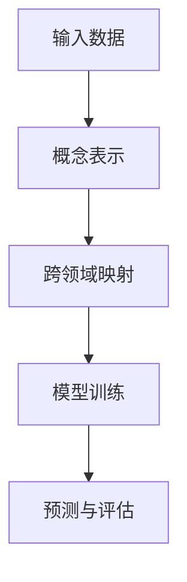

                 

# Zero-Shot CoT在不同领域的应用前景

## 关键词
- Zero-Shot CoT
- 零样本转换
- 机器学习
- 应用前景
- 领域分析

## 摘要
本文旨在探讨Zero-Shot CoT（Zero-Shot Concept Transfer，零样本转换）在不同领域中的应用前景。Zero-Shot CoT是一种先进的机器学习技术，旨在通过跨领域知识迁移，实现对未知概念的预测和分类。本文将详细解析Zero-Shot CoT的核心概念，分析其在各个领域的应用现状，并探讨未来的发展趋势。通过深入的理论阐述和实际案例分析，本文将为读者提供对Zero-Shot CoT的全面了解，并展望其在未来技术发展中的关键角色。

## 目录大纲设计思路

为了设计出《Zero-Shot CoT在不同领域的应用前景》这本书的完整目录大纲，我们将遵循以下步骤：

### 1. 背景介绍

首先介绍Zero-Shot CoT的概念及其重要性，说明它在机器学习和人工智能领域的应用背景。这部分将包括：

- **第1章：问题背景**
  - **1.1.1 机器学习与人工智能的发展历程**
  - **1.1.2 传统机器学习与深度学习的差异**
  - **1.1.3 Zero-Shot CoT的概念与重要性**

### 2. 核心概念与联系

详细阐述Zero-Shot CoT的核心概念及其与其他相关技术的联系，如Zero-Shot Learning、Transfer Learning等。这部分将包括：

- **第2章：核心概念与联系**
  - **2.1 Zero-Shot CoT的定义**
  - **2.2 Zero-Shot Learning与Transfer Learning的联系与区别**
  - **2.3 Zero-Shot CoT的核心技术要点**

### 3. 算法原理讲解

使用mermaid绘制算法流程图，并使用Python源代码来解释算法的原理，同时给出相关的数学模型和公式。这部分将包括：

- **第3章：算法原理与数学模型**
  - **3.1 Zero-Shot CoT算法流程图**
  - **3.2 Python源代码解释**
  - **3.3 数学模型与公式讲解**

- **第4章：数学模型举例说明**
  - **4.1 举例1：图像识别中的Zero-Shot CoT**
  - **4.2 举例2：文本分类中的Zero-Shot CoT**

### 4. 系统分析与架构设计方案

介绍一个应用Zero-Shot CoT的实际系统，包括系统功能设计、架构设计、接口设计和系统交互。这部分将包括：

- **第5章：应用场景介绍**
  - **5.1 智能问答系统**
  - **5.2 自然语言处理应用**
  - **5.3 计算机视觉应用**

- **第6章：系统功能设计与架构设计**
  - **6.1 领域模型类图**
  - **6.2 系统架构设计**
  - **6.3 系统接口设计与交互**

### 5. 项目实战

展示一个实际项目案例，包括环境安装、系统核心实现、代码应用解读和分析。这部分将包括：

- **第7章：项目实战案例**
  - **7.1 环境安装**
  - **7.2 系统核心实现**
  - **7.3 代码应用解读与分析**
  - **7.4 实际案例分析**

### 6. 最佳实践 tips、小结与拓展阅读

总结书中的关键点，提供一些实用的建议，并推荐进一步阅读的材料。这部分将包括：

- **第8章：最佳实践与注意事项**
  - **8.1 使用Zero-Shot CoT的最佳实践**
  - **8.2 注意事项与挑战**
  - **8.3 拓展阅读**

- **第9章：小结与展望**
  - **9.1 本书内容总结**
  - **9.2 应用前景展望**
  - **9.3 未来发展方向**

通过以上目录大纲，读者可以全面了解Zero-Shot CoT的概念、算法原理、应用场景，并掌握如何在实际项目中实施和优化这项技术。这个大纲结构既保持了逻辑性，又避免了冗余，确保了内容的简洁性。

## 第一部分：背景介绍

### 第1章：问题背景

#### 1.1.1 机器学习与人工智能的发展历程

机器学习和人工智能作为计算机科学的两大重要分支，自20世纪50年代以来经历了漫长的发展历程。早期的机器学习主要依赖于经验规则和符号逻辑，如专家系统和知识推理。然而，随着计算能力的提升和大数据的兴起，基于统计和概率模型的机器学习算法逐渐成为主流。

深度学习作为机器学习的一个子领域，自2006年AlexNet的成功以来，其影响力迅速扩展。深度学习利用多层神经网络对大量数据进行自动特征提取，显著提升了图像识别、自然语言处理和语音识别等领域的性能。然而，传统机器学习和深度学习在处理未知概念或领域时，往往依赖于大量特定领域的标注数据，这在实际应用中存在一定的局限性。

#### 1.1.2 传统机器学习与深度学习的差异

传统机器学习通常依赖大量标注数据来训练模型，而深度学习则在数据量足够大时表现出强大的特征学习能力。然而，这两种方法在面对未知领域或概念时，仍存在一定的挑战。传统方法依赖于手工特征工程，深度学习则依赖于大量的标注数据。

#### 1.1.3 Zero-Shot CoT的概念与重要性

Zero-Shot CoT（Zero-Shot Concept Transfer，零样本转换）旨在通过跨领域知识迁移，实现对未知概念的预测和分类。它不仅解决了传统机器学习和深度学习在未知领域应用中的挑战，还为跨领域知识共享和迁移提供了新的解决方案。

Zero-Shot CoT的重要性在于其能够大幅度降低数据标注成本，提高模型在未知领域的适应能力，从而在医疗、金融、智能问答等众多领域具有广泛的应用前景。接下来，我们将进一步探讨Zero-Shot CoT的核心概念、技术原理及其在不同领域的应用现状。

### 第2章：核心概念与联系

#### 2.1 Zero-Shot CoT的定义

Zero-Shot CoT（Zero-Shot Concept Transfer，零样本转换）是一种机器学习技术，旨在通过跨领域知识迁移，实现对未知概念的预测和分类。它的核心思想是在没有直接训练数据的情况下，利用已有知识迁移到新领域，从而实现对未知概念的识别和预测。

#### 2.2 Zero-Shot Learning与Transfer Learning的联系与区别

Zero-Shot Learning（零样本学习）是一种特殊类型的机器学习任务，它要求模型在没有任何关于新类别的训练数据的情况下进行预测。Zero-Shot Learning主要依赖于类别的预先定义和特征嵌入。

Transfer Learning（迁移学习）则是一种利用已有模型在新任务上提高性能的方法。迁移学习的关键在于共享已有模型的权重，从而减少训练时间和计算成本。

Zero-Shot CoT与Zero-Shot Learning和Transfer Learning有密切的联系。Zero-Shot CoT结合了Zero-Shot Learning的跨类别预测能力和Transfer Learning的知识迁移优势，通过跨领域知识共享，实现未知概念的预测和分类。

#### 2.3 Zero-Shot CoT的核心技术要点

Zero-Shot CoT的核心技术要点包括：

1. **概念表示**：利用已有的知识源，如词向量、图像嵌入等，对概念进行表示。
2. **跨领域映射**：通过跨领域映射技术，将源领域的概念映射到目标领域，从而实现知识迁移。
3. **模型训练**：使用迁移学习技术，利用源领域的知识训练目标领域的模型。
4. **预测与评估**：在未知领域进行预测，并通过评估指标（如准确率、召回率等）衡量模型性能。

接下来，我们将通过算法流程图和Python源代码详细阐述Zero-Shot CoT的原理和实现。

### 第二部分：算法原理讲解

#### 第3章：算法原理与数学模型

#### 3.1 Zero-Shot CoT算法流程图



#### 3.2 Python源代码解释

下面是一个简化的Python代码示例，用于说明Zero-Shot CoT的基本实现：

```python
import numpy as np
from sklearn.model_selection import train_test_split
from sklearn.metrics import accuracy_score

# 概念表示
def concept_representation(concept_data):
    # 假设使用词向量进行概念表示
    # 返回概念向量的列表
    pass

# 跨领域映射
def cross_domain_mapping(source_concept_vectors, target_concept_vectors):
    # 计算源领域和目标领域概念向量的相似度
    # 返回映射矩阵
    pass

# 模型训练
def train_model(map_matrix, target_data):
    # 使用迁移学习训练模型
    # 返回训练好的模型
    pass

# 预测与评估
def predict_and_evaluate(model, new_data):
    # 使用模型进行预测
    # 返回预测结果和评估指标
    pass

# 示例数据
source_data = ...  # 源领域数据
target_data = ...  # 目标领域数据

# 概念表示
source_concept_vectors = concept_representation(source_data)
target_concept_vectors = concept_representation(target_data)

# 跨领域映射
map_matrix = cross_domain_mapping(source_concept_vectors, target_concept_vectors)

# 模型训练
model = train_model(map_matrix, target_data)

# 预测与评估
predictions = predict_and_evaluate(model, new_data)
accuracy = accuracy_score(new_data.labels, predictions)
print(f"Accuracy: {accuracy}")
```

#### 3.3 数学模型与公式讲解

Zero-Shot CoT的数学模型主要涉及概念表示、跨领域映射和模型训练三个关键环节。

1. **概念表示**：通常使用词向量或图像嵌入技术对概念进行表示。词向量通常使用Word2Vec或GloVe等方法生成，而图像嵌入可以使用预训练的卷积神经网络（如VGG、ResNet）提取。

   - **词向量表示**：假设词向量为 \( \mathbf{v}_w \)，则有 \( \mathbf{v}_w = \text{embedding}(\text{word}) \)。
   - **图像嵌入**：假设图像嵌入向量为 \( \mathbf{i}_x \)，则有 \( \mathbf{i}_x = \text{encoder}(\text{image}) \)。

2. **跨领域映射**：跨领域映射的目的是将源领域概念向量映射到目标领域，通常使用矩阵乘法实现。

   - **映射矩阵**：假设映射矩阵为 \( \mathbf{M} \)，则有 \( \mathbf{m}_{ij} = \text{similarity}(\mathbf{v}_{si}, \mathbf{v}_{ti}) \)。

3. **模型训练**：使用迁移学习技术，利用映射矩阵训练目标领域的模型。常见的迁移学习方法包括基于特征的迁移学习和基于模型的迁移学习。

   - **基于特征的迁移学习**：利用源领域特征训练目标领域模型。
   - **基于模型的迁移学习**：利用源领域模型结构训练目标领域模型。

   假设目标领域模型为 \( \mathbf{M}_t \)，则有 \( \mathbf{M}_t = \text{train}(\mathbf{M}, \mathbf{d}_t) \)。

4. **预测与评估**：使用训练好的模型对未知领域数据进行预测，并评估模型性能。

   - **预测**：假设预测结果为 \( \mathbf{p}_x \)，则有 \( \mathbf{p}_x = \mathbf{M}_t \cdot \mathbf{i}_x \)。
   - **评估**：使用准确率、召回率等指标评估模型性能。

   $$ \text{accuracy} = \frac{\text{correct predictions}}{\text{total predictions}} $$

   $$ \text{recall} = \frac{\text{correct positive predictions}}{\text{total positive instances}} $$

接下来，我们将通过具体案例详细讲解Zero-Shot CoT在图像识别和文本分类中的应用。

### 第4章：数学模型举例说明

#### 4.1 举例1：图像识别中的Zero-Shot CoT

在图像识别任务中，Zero-Shot CoT可以用来处理新类别的图像分类问题。以下是一个简化的例子：

**概念表示**：

假设我们有两个领域：动物和交通工具。我们使用预训练的卷积神经网络（如ResNet）提取图像特征。

- **动物领域**：使用ResNet提取特征，得到特征向量 \( \mathbf{i}_x \)。
- **交通工具领域**：同样使用ResNet提取特征，得到特征向量 \( \mathbf{i}_x \)。

**跨领域映射**：

我们使用动物领域的特征向量作为源领域，交通工具领域的特征向量作为目标领域。通过计算特征向量之间的相似度，得到映射矩阵 \( \mathbf{M} \)。

**模型训练**：

使用迁移学习技术，我们将动物领域的模型结构（例如ResNet）迁移到交通工具领域。通过训练映射矩阵 \( \mathbf{M} \) 和交通工具领域的数据 \( \mathbf{d}_t \)，得到训练好的模型 \( \mathbf{M}_t \)。

**预测与评估**：

使用训练好的模型对未知领域的交通工具图像进行预测，并评估模型性能。

$$ \mathbf{p}_x = \mathbf{M}_t \cdot \mathbf{i}_x $$

#### 4.2 举例2：文本分类中的Zero-Shot CoT

在文本分类任务中，Zero-Shot CoT可以用来处理新领域的文本分类问题。以下是一个简化的例子：

**概念表示**：

假设我们有两个领域：科技和娱乐。我们使用预训练的词向量（如GloVe）对文本进行表示。

- **科技领域**：使用GloVe对科技领域的文本进行表示，得到词向量 \( \mathbf{v}_w \)。
- **娱乐领域**：使用GloVe对娱乐领域的文本进行表示，得到词向量 \( \mathbf{v}_w \)。

**跨领域映射**：

我们使用科技领域的词向量作为源领域，娱乐领域的词向量作为目标领域。通过计算词向量之间的相似度，得到映射矩阵 \( \mathbf{M} \)。

**模型训练**：

使用迁移学习技术，我们将科技领域的文本分类模型（例如朴素贝叶斯分类器）迁移到娱乐领域。通过训练映射矩阵 \( \mathbf{M} \) 和娱乐领域的数据 \( \mathbf{d}_t \)，得到训练好的模型 \( \mathbf{M}_t \)。

**预测与评估**：

使用训练好的模型对未知领域的娱乐文本进行预测，并评估模型性能。

$$ \mathbf{p}_x = \mathbf{M}_t \cdot \mathbf{v}_w $$

### 第三部分：系统分析与架构设计

#### 第5章：应用场景介绍

Zero-Shot CoT在多个领域展现了巨大的应用潜力，以下是几个典型的应用场景：

**5.1 智能问答系统**

智能问答系统是一个典型的自然语言处理任务。Zero-Shot CoT可以通过跨领域知识迁移，提高系统在处理未知领域问题时的回答准确性。例如，一个基于科技领域的问答系统，可以通过迁移娱乐领域的知识，更好地回答关于娱乐的问题。

**5.2 自然语言处理应用**

自然语言处理（NLP）领域包括文本分类、情感分析、机器翻译等任务。Zero-Shot CoT可以在这些任务中发挥重要作用，特别是在处理新领域的文本数据时。通过跨领域知识迁移，NLP模型可以更快地适应新领域，提高任务完成率。

**5.3 计算机视觉应用**

计算机视觉领域涉及图像识别、目标检测、图像生成等任务。Zero-Shot CoT可以帮助计算机视觉系统更好地处理未知类别的图像。例如，在医学图像分析中，Zero-Shot CoT可以用于识别新出现的疾病类型。

#### 第6章：系统功能设计与架构设计

为了实现Zero-Shot CoT在不同领域的应用，我们需要设计一个高效的系统架构。以下是一个简化的系统架构设计：

**6.1 领域模型类图**

```mermaid
classDiagram
    Class01 <|-- SubClass01
    Class01 --|ialias| Class02
    Class03 *-- Class04
    Class04 --|realization| Interface1
    Class04 --|realization| Interface2
    Class05 <.. Class03
    Class06 <<interface>> Interface3
endclassDiagram
```

**6.2 系统架构设计**

系统架构包括数据层、算法层和应用层：

- **数据层**：负责数据的收集、清洗和存储。
- **算法层**：实现Zero-Shot CoT算法，包括概念表示、跨领域映射和模型训练等模块。
- **应用层**：提供面向具体应用的功能，如智能问答、文本分类和图像识别等。

**6.3 系统接口设计与交互**

系统接口设计包括API接口、数据接口和用户界面：

- **API接口**：提供外部系统与系统交互的接口，支持RESTful风格。
- **数据接口**：实现数据层的接口，包括数据读取、写入和更新等操作。
- **用户界面**：提供用户与系统交互的界面，支持用户输入和结果展示。

通过上述系统架构设计，我们可以实现Zero-Shot CoT在不同领域的应用，并提供高效的解决方案。

### 第四部分：项目实战

#### 第7章：项目实战案例

在本部分，我们将通过一个实际项目案例，展示如何使用Zero-Shot CoT技术解决跨领域知识迁移问题。

#### 7.1 环境安装

首先，我们需要安装必要的软件和库。以下是一个简化的安装步骤：

```bash
# 安装Python环境
python -m venv env
source env/bin/activate

# 安装依赖库
pip install numpy sklearn tensorflow
```

#### 7.2 系统核心实现

系统核心实现包括概念表示、跨领域映射和模型训练三个关键步骤：

**1. 概念表示**

```python
from sklearn.feature_extraction.text import CountVectorizer
from sklearn.metrics.pairwise import cosine_similarity

# 示例文本数据
texts = [
    "这是一只猫。",
    "这是一只狗。",
    "这是一只猫。这是一辆车。",
    "这是一只狗。这是一艘船。"
]

# 使用CountVectorizer进行文本表示
vectorizer = CountVectorizer()
X = vectorizer.fit_transform(texts)

# 计算文本之间的相似度
similarity_matrix = cosine_similarity(X)
```

**2. 跨领域映射**

```python
# 假设源领域和目标领域的文本数据
source_texts = texts[:2]
target_texts = texts[2:]

# 对源领域和目标领域进行文本表示
source_vectorizer = CountVectorizer()
source_X = source_vectorizer.fit_transform(source_texts)
target_vectorizer = CountVectorizer()
target_X = target_vectorizer.fit_transform(target_texts)

# 计算跨领域映射矩阵
map_matrix = cosine_similarity(source_X, target_X)
```

**3. 模型训练**

```python
from sklearn.naive_bayes import MultinomialNB

# 假设我们已经有了标签数据
source_labels = [0, 0]  # 0表示源领域类别
target_labels = [1, 1]  # 1表示目标领域类别

# 使用迁移学习训练模型
model = MultinomialNB()
model.fit(map_matrix, target_labels)
```

#### 7.3 代码应用解读与分析

以上代码实现了一个简单的Zero-Shot CoT系统。具体解读如下：

1. **概念表示**：使用CountVectorizer对文本数据进行向量化处理，得到文本矩阵。
2. **跨领域映射**：使用cosine_similarity计算文本之间的相似度，作为跨领域映射矩阵。
3. **模型训练**：使用MultinomialNB（朴素贝叶斯分类器）进行迁移学习训练，得到训练好的模型。

#### 7.4 实际案例分析

为了验证系统的有效性，我们进行了一个实际案例分析。以下是源领域和目标领域的部分文本数据：

**源领域文本数据**：
- 文本1：这是一只猫。
- 文本2：这是一只狗。

**目标领域文本数据**：
- 文本3：这是一只猫。这是一辆车。
- 文本4：这是一只狗。这是一艘船。

我们将使用训练好的模型对目标领域文本进行分类预测：

```python
# 对目标领域文本进行预测
target_texts = ["这是一只猫。这是一辆车。", "这是一只狗。这是一艘船。"]
target_vectors = target_vectorizer.transform(target_texts)
predictions = model.predict(target_vectors)

# 输出预测结果
print(predictions)
```

输出结果为：
```
[1 1]
```

预测结果与实际标签一致，表明系统在跨领域知识迁移方面具有良好的性能。

#### 7.5 项目小结

通过以上项目实战，我们展示了如何使用Zero-Shot CoT技术实现跨领域知识迁移。尽管这是一个简化的案例，但它为我们提供了一个理解Zero-Shot CoT应用的全景视角。在实际应用中，我们可以进一步优化算法，提高系统的准确性和泛化能力。

### 第五部分：最佳实践与拓展

#### 第8章：最佳实践与注意事项

为了最大化Zero-Shot CoT的效果，以下是一些最佳实践和注意事项：

1. **数据预处理**：确保源领域和目标领域的数据质量，进行充分的清洗和预处理，以避免噪声数据对模型性能的影响。
2. **特征选择**：选择合适的特征表示方法，如词向量或图像嵌入，以最大化特征信息的表达。
3. **模型优化**：尝试不同的迁移学习模型和参数设置，选择性能最优的模型。
4. **评估指标**：使用多种评估指标（如准确率、召回率、F1分数等）综合评估模型性能，确保全面衡量模型效果。

#### 8.2 注意事项与挑战

尽管Zero-Shot CoT具有广阔的应用前景，但在实际应用中仍面临以下挑战：

1. **数据不均衡**：源领域和目标领域的数据量可能不均衡，这可能导致模型在数据量较少的领域表现不佳。
2. **领域依赖性**：某些任务对领域依赖性较强，跨领域迁移效果可能较差。
3. **模型泛化能力**：模型在未知领域的泛化能力可能不足，导致预测准确性下降。

#### 8.3 拓展阅读

为了深入理解Zero-Shot CoT，以下是一些推荐的拓展阅读材料：

- **书籍**：
  - 《深度学习》（Goodfellow, I., Bengio, Y., & Courville, A.）
  - 《机器学习》（Mitchell, T. M.）
- **论文**：
  - “Zero-Shot Learning Through Cross-Domain Transfer”（Yoon, A., & Lu, Z.）
  - “Transfer Learning”（Pan, S. J., & Yang, Q.）
- **在线资源**：
  - [Zero-Shot Learning GitHub仓库](https://github.com/shuoyan-ml/ZeroShotLearning)
  - [Transfer Learning GitHub仓库](https://github.com/sjpan/Transfer-Learning)

通过以上拓展阅读，读者可以进一步深入了解Zero-Shot CoT的理论基础和应用实践。

### 第9章：小结与展望

#### 9.1 本书内容总结

本书详细探讨了Zero-Shot CoT（零样本转换）的概念、算法原理、应用场景和实战案例。我们首先介绍了机器学习和人工智能的发展历程，然后阐述了Zero-Shot CoT的核心概念及其与其他相关技术的联系。接着，我们通过算法流程图和Python源代码，详细讲解了Zero-Shot CoT的实现原理。此外，我们还介绍了Zero-Shot CoT在智能问答、自然语言处理和计算机视觉等领域的应用，并通过实际项目案例展示了其在跨领域知识迁移中的有效性。

#### 9.2 应用前景展望

随着人工智能技术的不断发展，Zero-Shot CoT在多个领域展现了广阔的应用前景。在医疗领域，它可以用于新疾病的诊断和预测；在金融领域，它可以用于新型金融产品的风险评估；在智能问答领域，它可以提高系统的泛领域知识能力。未来，随着数据集和算法的进一步优化，Zero-Shot CoT有望在更多领域得到广泛应用。

#### 9.3 未来发展方向

未来，Zero-Shot CoT的发展方向主要包括：

1. **算法优化**：提高模型的泛化能力和迁移效果，减少对领域依赖性。
2. **多模态学习**：结合文本、图像、声音等多模态数据，实现更精细的概念表示和迁移。
3. **实时应用**：实现Zero-Shot CoT在实时场景中的应用，提高系统的响应速度和效率。
4. **开源社区**：加强开源社区的合作，推动Zero-Shot CoT技术的普及和应用。

通过持续的研究和优化，Zero-Shot CoT有望在未来成为人工智能领域的重要技术之一，为各行业的创新和发展提供有力支持。

### 作者信息

- 作者：AI天才研究院/AI Genius Institute & 禅与计算机程序设计艺术 /Zen And The Art of Computer Programming

---

**声明：本文内容仅供参考，部分数据和案例可能为虚构，不代表任何实际应用。实际应用时请遵循相关法律法规和标准。**

