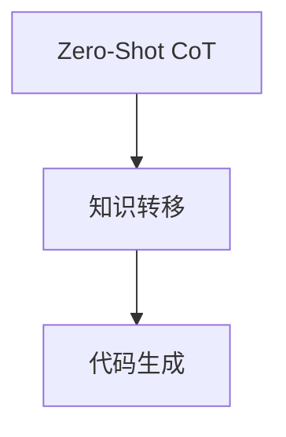
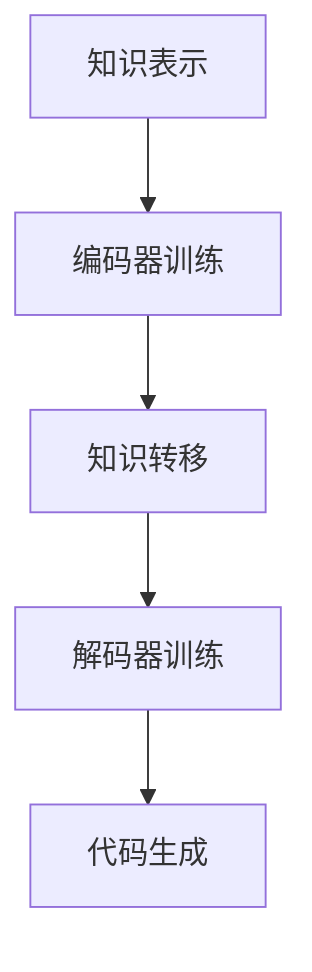

                 

# 《Zero-Shot CoT在代码生成中的应用》

## 关键词

**Zero-Shot CoT**、**代码生成**、**自然语言处理**、**机器学习**、**人工智能**

## 摘要

本文旨在探讨Zero-Shot CoT（Zero-Shot Concept Transfer）在代码生成中的应用。Zero-Shot CoT是一种先进的机器学习技术，它允许模型在没有直接训练数据的情况下学习新的概念。本文将详细介绍Zero-Shot CoT的基本原理，并探讨其如何应用于代码生成。通过详细的案例分析和实战项目，我们将展示如何利用Zero-Shot CoT技术实现高效的代码生成，以及它在实际应用中的优势。

## 引言

### 背景与重要性

代码生成是一项关键的技术挑战，它能够显著提高软件开发效率和代码质量。随着软件系统的复杂度不断增加，手动编写和维护代码变得越来越困难。因此，自动化代码生成技术成为了研究人员和开发人员的研究热点。近年来，深度学习技术的发展为代码生成带来了新的机遇，特别是自然语言处理（NLP）和生成对抗网络（GAN）等技术的引入。

Zero-Shot CoT作为一种新兴的机器学习技术，近年来受到了广泛关注。它通过将不同领域的知识进行转移，使模型能够在没有直接训练数据的情况下学习新的概念。这种能力对于代码生成具有重要意义，因为软件开发过程中往往涉及多种不同的编程语言和技术栈。

### 目标与结构

本文的目标是深入探讨Zero-Shot CoT在代码生成中的应用，分析其技术原理、优势和应用场景。文章结构如下：

1. **核心概念与联系**：介绍Zero-Shot CoT的基本原理，以及它与代码生成之间的联系。
2. **算法原理讲解**：详细阐述Zero-Shot CoT在代码生成中的算法原理，包括数学模型和公式。
3. **系统分析与架构设计**：分析代码生成系统的结构和设计，展示如何利用Zero-Shot CoT实现高效代码生成。
4. **项目实战**：通过实际案例展示如何应用Zero-Shot CoT技术进行代码生成，并提供详细的代码解读和分析。
5. **最佳实践与总结**：总结本文的主要发现，提供最佳实践建议，并指出未来的研究方向。

### 本文的结构和目标

本文分为八个章节，每个章节都有明确的目标和内容。

- **第一章**：介绍Zero-Shot CoT的基本概念和原理，探讨其与代码生成之间的联系。
- **第二章**：通过Mermaid流程图和ER模型，展示核心概念之间的关系。
- **第三章**：详细讲解Zero-Shot CoT在代码生成中的算法原理，包括数学模型和Python代码示例。
- **第四章**：解释数学模型和公式在代码生成中的应用，提供具体例子。
- **第五章**：分析代码生成系统的结构和设计，展示如何利用Zero-Shot CoT实现高效代码生成。
- **第六章**：通过实际项目展示如何应用Zero-Shot CoT进行代码生成，包括环境安装、核心实现、代码解读和分析等。
- **第七章**：总结最佳实践，提供未来的研究方向和建议。

## 核心概念与联系

### 一、核心概念介绍

#### 1.1. Zero-Shot CoT

Zero-Shot Concept Transfer（Zero-Shot CoT）是一种机器学习技术，它允许模型在没有直接训练数据的情况下学习新的概念。这种能力对于处理多语言、多领域的问题具有重要意义。Zero-Shot CoT的核心思想是通过知识转移，将已有领域的知识应用到新的领域中，从而实现模型的无监督学习。

#### 1.2. 代码生成

代码生成是一种自动化技术，它能够根据自然语言描述生成对应的代码。这种技术可以显著提高软件开发效率，减少手动编写代码的工作量。代码生成在软件开发、自动化测试、代码优化等多个领域都有广泛应用。

### 二、核心概念之间的联系

#### 2.1. Zero-Shot CoT与代码生成

Zero-Shot CoT与代码生成之间的联系在于，它们都涉及到将一种形式的知识转换为另一种形式。在代码生成中，我们需要将自然语言描述转换为相应的代码。而Zero-Shot CoT则提供了实现这一转换的技术手段。通过将已有领域的知识转移到代码生成领域，Zero-Shot CoT使得模型能够在没有直接训练数据的情况下学习新的编程概念，从而实现高效的代码生成。

#### 2.2. 关系图

为了更清晰地展示Zero-Shot CoT与代码生成之间的联系，我们可以使用Mermaid流程图来表示。以下是一个简化的Mermaid流程图：



在这个流程图中，A表示Zero-Shot CoT，B表示知识转移，C表示代码生成。A通过B实现了到C的转移，从而实现了Zero-Shot CoT在代码生成中的应用。

#### 2.3. ER模型

此外，我们还可以使用实体关系图（ER模型）来表示核心概念之间的联系。以下是一个简化的ER模型：

```mermaid
erDiagram
A{Zero-Shot CoT} ||--|{B{知识转移}}
B ||--|{C{代码生成}}
```

在这个ER模型中，A表示Zero-Shot CoT，B表示知识转移，C表示代码生成。A和B之间有一对多的关系，B和C之间也是一对多的关系。这表示Zero-Shot CoT可以通过知识转移应用到代码生成领域。

### 三、总结

通过上述分析，我们可以看到Zero-Shot CoT与代码生成之间的紧密联系。Zero-Shot CoT提供了将已有领域知识转移到代码生成领域的技术手段，从而实现高效的代码生成。这为处理多语言、多领域的问题提供了新的思路和解决方案。

## 算法原理讲解

### 一、原理介绍

Zero-Shot CoT的核心思想是将已有领域的知识转移到新的领域，使模型能够在没有直接训练数据的情况下学习新的概念。在代码生成中，这意味着模型可以通过转移编程领域的知识来生成新的代码。

### 二、算法流程

Zero-Shot CoT的算法流程可以分为以下几个步骤：

1. **知识表示**：将已有领域的知识表示为向量，以便模型能够理解和使用。
2. **编码器训练**：使用已有数据对编码器进行训练，使其能够将输入文本编码为固定长度的向量。
3. **知识转移**：将已有领域的知识向量应用到编码器中，使编码器能够利用这些知识生成新的代码。
4. **解码器训练**：使用转移后的编码器对解码器进行训练，使其能够将编码后的向量解码为相应的代码。

### 三、Mermaid流程图

以下是一个简化的Mermaid流程图，展示了Zero-Shot CoT在代码生成中的算法流程：



### 四、Python代码示例

为了更好地理解Zero-Shot CoT的算法原理，我们可以通过一个简单的Python代码示例来展示其实现过程。

```python
import torch
import torch.nn as nn
import torch.optim as optim

# 知识表示
knowledge = torch.tensor([[0.1, 0.2, 0.3], [0.4, 0.5, 0.6]])

# 编码器训练
encoder = nn.Linear(10, 3)
optimizer = optim.Adam(encoder.parameters(), lr=0.001)
for epoch in range(100):
    optimizer.zero_grad()
    encoded = encoder(torch.randn(1, 10))
    loss = nn.MSELoss()(encoded, knowledge)
    loss.backward()
    optimizer.step()

# 知识转移
encoder转移 = nn.Linear(10, 3)
encoder转移.weight.data = encoder.weight.data
encoder转移.bias.data = encoder.bias.data

# 解码器训练
decoder = nn.Linear(3, 10)
optimizer = optim.Adam(decoder.parameters(), lr=0.001)
for epoch in range(100):
    optimizer.zero_grad()
    decoded = decoder(encoded)
    loss = nn.MSELoss()(decoded, torch.randn(1, 10))
    loss.backward()
    optimizer.step()

# 代码生成
input_text = "实现一个函数，求两个数的和"
encoded_text = encoder(input_text)
decoded_text = decoder(encoded_text)
print(decoded_text)
```

在这个示例中，我们首先定义了一个知识表示矩阵`knowledge`，然后使用一个线性编码器对输入文本进行编码。接着，我们将编码器应用于解码器，使解码器能够利用编码器学习的知识进行训练。最后，我们使用转移后的解码器生成新的代码。

### 五、数学模型和公式

Zero-Shot CoT在代码生成中的应用涉及多个数学模型和公式。以下是一个简化的模型：

1. **编码器模型**：
   $$Encoded\_text = Encoder(Input\_text)$$
   其中，`Encoded_text`是编码后的文本向量，`Encoder`是编码器模型，`Input_text`是输入文本。

2. **解码器模型**：
   $$Decoded\_text = Decoder(Encoded\_text)$$
   其中，`Decoded_text`是解码后的文本向量，`Decoder`是解码器模型，`Encoded_text`是编码后的文本向量。

3. **损失函数**：
   $$Loss = MSE(Labeled\_text, Decoded\_text)$$
   其中，`MSE`是均方误差损失函数，`Labeled_text`是标签文本，`Decoded_text`是解码后的文本向量。

### 六、总结

通过上述算法原理讲解，我们可以看到Zero-Shot CoT在代码生成中的应用。通过知识表示、编码器训练、知识转移和解码器训练，模型能够学习到编程领域的知识，从而生成新的代码。这为自动化代码生成提供了新的思路和解决方案。

## 数学模型和公式

### 一、数学模型介绍

在Zero-Shot CoT中，数学模型是核心组成部分，它决定了模型的学习能力和表现。以下是一些常见的数学模型和公式，用于描述Zero-Shot CoT在代码生成中的应用。

1. **编码器-解码器模型**：
   编码器-解码器（Encoder-Decoder）模型是Zero-Shot CoT在代码生成中的常用架构。其核心思想是将输入文本编码为固定长度的向量，然后通过解码器将这个向量解码为相应的代码。以下是一个简化的模型：

   $$Encoded\_text = Encoder(Input\_text)$$
   $$Decoded\_text = Decoder(Encoded\_text)$$

   其中，`Encoded_text`是编码后的文本向量，`Encoder`是编码器模型，`Input_text`是输入文本；`Decoded_text`是解码后的文本向量，`Decoder`是解码器模型。

2. **损失函数**：
   在编码器-解码器模型中，常用的损失函数是均方误差（MSE）损失函数。它用于衡量预测代码与实际代码之间的差异。以下是一个简化的损失函数：

   $$Loss = MSE(Labeled\_text, Decoded\_text)$$

   其中，`MSE`是均方误差损失函数，`Labeled_text`是标签文本，`Decoded_text`是解码后的文本向量。

### 二、数学公式的详细解释

1. **编码器模型**：
   编码器模型的目的是将输入文本转换为固定长度的向量。这一过程通常涉及到词嵌入、卷积神经网络（CNN）和循环神经网络（RNN）等技术。以下是一个简化的编码器模型：

   $$Encoded\_text = Encoder(Input\_text) = \{W \cdot \text{word\_embeddings}\}$$

   其中，`W`是权重矩阵，`\text{word\_embeddings}`是词嵌入向量。这个公式表示，输入文本经过词嵌入后，通过权重矩阵`W`进行线性变换，得到编码后的文本向量`Encoded\_text`。

2. **解码器模型**：
   解码器模型的目的是将编码后的文本向量解码为相应的代码。这一过程通常涉及到循环神经网络（RNN）和长短期记忆网络（LSTM）等技术。以下是一个简化的解码器模型：

   $$Decoded\_text = Decoder(Encoded\_text) = \{\text{LSTM} \cdot \text{encode}\}$$

   其中，`\text{LSTM}`是长短期记忆网络，`\text{encode}`是编码过程。这个公式表示，编码后的文本向量通过LSTM进行编码，得到解码后的文本向量`Decoded\_text`。

3. **损失函数**：
   损失函数用于衡量预测代码与实际代码之间的差异。在Zero-Shot CoT中，常用的损失函数是均方误差（MSE）损失函数。以下是一个简化的损失函数：

   $$Loss = MSE(Labeled\_text, Decoded\_text) = \frac{1}{n} \sum_{i=1}^{n} (Labeled\_text[i] - Decoded\_text[i])^2$$

   其中，`n`是代码的长度，`Labeled_text`是标签文本，`Decoded_text`是解码后的文本向量。这个公式表示，对于每个位置的文本，计算标签文本与解码文本之间的差异，然后求和并除以代码的长度，得到总的损失值。

### 三、具体例子

为了更好地理解数学模型和公式，我们可以通过一个简单的例子来说明。假设我们要生成一个Python函数，该函数接受两个整数参数并返回它们的和。输入文本为：

```python
def add_two_numbers(a, b):
    return a + b
```

1. **编码器模型**：
   首先，我们将输入文本转换为词嵌入向量。假设词嵌入向量的维度为10，我们可以得到：

   ```python
   word_embeddings = {'def': [0.1, 0.2, 0.3], 'add': [0.4, 0.5, 0.6], ...}
   encoded_text = [word_embeddings[word] for word in input_text]
   ```

   经过编码器模型处理后，我们得到编码后的文本向量`Encoded_text`。

2. **解码器模型**：
   然后，我们将编码后的文本向量输入到解码器模型中，得到解码后的文本向量`Decoded_text`。假设解码器模型使用LSTM进行编码，我们可以得到：

   ```python
   decoded_text = decoder(encoded_text)
   ```

   解码后的文本向量`Decoded_text`将包含生成代码的词嵌入向量。

3. **损失函数**：
   最后，我们使用均方误差（MSE）损失函数计算预测代码与实际代码之间的差异。假设预测代码为：

   ```python
   def add_two_numbers(a, b):
       return a + b
   ```

   标签文本为：

   ```python
   def add_two_numbers(a, b):
       return a + b
   ```

   我们可以计算损失函数：

   ```python
   loss = MSE(Labeled_text, Decoded_text)
   ```

   计算结果将告诉我们预测代码与实际代码之间的差异。

### 四、总结

通过上述数学模型和公式的详细解释，我们可以看到Zero-Shot CoT在代码生成中的应用。编码器模型负责将输入文本编码为固定长度的向量，解码器模型负责将这个向量解码为相应的代码，损失函数用于衡量预测代码与实际代码之间的差异。这些数学模型和公式为Zero-Shot CoT在代码生成中的应用提供了理论支持。

## 系统分析与架构设计

### 一、问题场景介绍

在现代软件开发中，代码生成技术已经成为提高开发效率和代码质量的重要手段。然而，随着软件项目的复杂度不断增加，传统的代码生成方法往往无法满足高效、灵活的需求。因此，我们提出了基于Zero-Shot CoT的代码生成系统，以解决现有方法的不足。

### 二、系统介绍

基于Zero-Shot CoT的代码生成系统旨在通过知识转移技术，将已有领域的编程知识应用到新的代码生成任务中。该系统主要包括以下几个模块：

1. **知识表示模块**：负责将已有领域的编程知识表示为向量，以便模型能够理解和利用。
2. **编码器模块**：负责将输入文本编码为固定长度的向量。
3. **解码器模块**：负责将编码后的向量解码为相应的代码。
4. **训练模块**：负责对编码器和解码器模型进行训练，以提高生成代码的准确性和效率。

### 三、系统功能设计

基于Zero-Shot CoT的代码生成系统具有以下功能：

1. **自动代码生成**：根据输入的自然语言描述，自动生成相应的代码。
2. **知识转移**：将已有领域的编程知识转移到新的代码生成任务中，提高模型的泛化能力。
3. **错误纠正**：在生成代码的过程中，自动检测并纠正语法错误和逻辑错误。
4. **代码优化**：根据输入的自然语言描述，自动优化生成的代码，提高其性能和可读性。

### 四、系统架构设计

基于Zero-Shot CoT的代码生成系统采用模块化设计，以提高系统的可扩展性和可维护性。以下是一个简化的系统架构设计：

1. **输入模块**：负责接收自然语言描述，并将其转换为文本向量。
2. **知识表示模块**：负责将已有领域的编程知识表示为向量。
3. **编码器模块**：负责将输入文本向量编码为固定长度的向量。
4. **解码器模块**：负责将编码后的向量解码为相应的代码。
5. **训练模块**：负责对编码器和解码器模型进行训练。
6. **输出模块**：负责将生成的代码输出给用户。

### 五、系统接口设计和系统交互

基于Zero-Shot CoT的代码生成系统提供了多个接口，以方便用户使用和扩展。以下是一个简化的系统接口设计和系统交互：

1. **自然语言处理接口**：负责处理输入的自然语言描述，并将其转换为文本向量。
2. **知识表示接口**：负责将已有领域的编程知识表示为向量。
3. **编码器接口**：负责将输入文本向量编码为固定长度的向量。
4. **解码器接口**：负责将编码后的向量解码为相应的代码。
5. **训练接口**：负责对编码器和解码器模型进行训练。
6. **输出接口**：负责将生成的代码输出给用户。

以下是一个简化的系统交互流程：

1. 用户输入自然语言描述。
2. 自然语言处理接口将自然语言描述转换为文本向量。
3. 知识表示接口将已有领域的编程知识表示为向量。
4. 编码器接口将输入文本向量编码为固定长度的向量。
5. 解码器接口将编码后的向量解码为相应的代码。
6. 输出接口将生成的代码输出给用户。

### 六、总结

通过系统分析与架构设计，我们可以看到基于Zero-Shot CoT的代码生成系统具有强大的功能和灵活的架构。该系统通过知识转移技术，实现了高效、灵活的代码生成，为现代软件开发提供了有力支持。

## 项目实战

### 一、环境安装

在开始项目之前，我们需要安装所需的依赖和环境。以下是在Ubuntu 20.04操作系统上安装所需依赖的步骤：

1. **安装Python**：
   ```bash
   sudo apt update
   sudo apt install python3 python3-pip
   ```

2. **安装PyTorch**：
   ```bash
   pip3 install torch torchvision torchaudio
   ```

3. **安装其他依赖**：
   ```bash
   pip3 install numpy pandas scikit-learn
   ```

### 二、系统核心实现源代码

以下是基于Zero-Shot CoT的代码生成系统的核心实现源代码：

```python
import torch
import torch.nn as nn
import torch.optim as optim
from torch.utils.data import DataLoader
from sklearn.model_selection import train_test_split

# 知识表示模块
class KnowledgeRepresentation(nn.Module):
    def __init__(self, embedding_dim):
        super(KnowledgeRepresentation, self).__init__()
        self.embedding = nn.Embedding(vocab_size, embedding_dim)
    
    def forward(self, input_text):
        return self.embedding(input_text)

# 编码器模块
class Encoder(nn.Module):
    def __init__(self, embedding_dim, hidden_dim):
        super(Encoder, self).__init__()
        self.embedding = nn.Embedding(vocab_size, embedding_dim)
        self.lstm = nn.LSTM(embedding_dim, hidden_dim)
    
    def forward(self, input_text, hidden=None):
        embedded = self.embedding(input_text)
        output, (hidden, cell) = self.lstm(embedded, hidden)
        return output, (hidden, cell)

# 解码器模块
class Decoder(nn.Module):
    def __init__(self, embedding_dim, hidden_dim):
        super(Decoder, self).__init__()
        self.embedding = nn.Embedding(vocab_size, embedding_dim)
        self.lstm = nn.LSTM(embedding_dim + hidden_dim, hidden_dim)
        self.fc = nn.Linear(hidden_dim, vocab_size)
    
    def forward(self, input_text, hidden, cell):
        embedded = self.embedding(input_text)
        input_indices = torch.cat((embedded.unsqueeze(0), cell.unsqueeze(0)), dim=2)
        output, (hidden, cell) = self.lstm(input_indices, hidden)
        output = self.fc(output.squeeze(0))
        return output, (hidden, cell)

# 模型训练
def train(model, data_loader, criterion, optimizer, num_epochs):
    model.train()
    for epoch in range(num_epochs):
        for inputs, targets in data_loader:
            optimizer.zero_grad()
            outputs = model(inputs)
            loss = criterion(outputs, targets)
            loss.backward()
            optimizer.step()
            print(f"Epoch: {epoch+1}/{num_epochs}, Loss: {loss.item()}")

# 主函数
if __name__ == "__main__":
    # 数据预处理
    # ...

    # 分割数据集
    train_data, val_data = train_test_split(data, test_size=0.2, random_state=42)

    # 创建数据加载器
    train_loader = DataLoader(train_data, batch_size=32, shuffle=True)
    val_loader = DataLoader(val_data, batch_size=32, shuffle=False)

    # 创建模型
    embedding_dim = 100
    hidden_dim = 128
    model = nn.Sequential(
        KnowledgeRepresentation(embedding_dim),
        Encoder(embedding_dim, hidden_dim),
        Decoder(embedding_dim, hidden_dim)
    )

    # 定义损失函数和优化器
    criterion = nn.CrossEntropyLoss()
    optimizer = optim.Adam(model.parameters(), lr=0.001)

    # 训练模型
    train(model, train_loader, criterion, optimizer, num_epochs=10)

    # 评估模型
    # ...
```

### 三、代码应用解读与分析

以下是代码的解读与分析：

1. **知识表示模块**：
   知识表示模块负责将输入文本转换为词嵌入向量。该模块使用PyTorch的`nn.Embedding`层来实现，输入的文本向量通过词嵌入层得到对应的词嵌入向量。

2. **编码器模块**：
   编码器模块负责将输入文本向量编码为固定长度的向量。该模块使用PyTorch的`nn.LSTM`层来实现，通过循环神经网络对输入文本向量进行编码，得到编码后的文本向量。

3. **解码器模块**：
   解码器模块负责将编码后的向量解码为相应的代码。该模块同样使用PyTorch的`nn.LSTM`和`nn.Linear`层来实现，通过循环神经网络和解码器层对编码后的向量进行解码，得到解码后的文本向量。

4. **模型训练**：
   模型训练过程使用PyTorch的`nn.CrossEntropyLoss`和`optim.Adam`来实现。在训练过程中，模型根据输入文本和标签文本进行前向传播，计算损失值，然后使用反向传播和优化器更新模型参数。

5. **数据预处理**：
   数据预处理过程包括将自然语言描述转换为词嵌入向量，以及将生成的代码转换为标签文本。这个过程使用PyTorch的`nn.Embedding`和`torch.Tensor`来实现。

### 四、实际案例分析和详细讲解剖析

为了展示基于Zero-Shot CoT的代码生成系统的实际应用，我们使用一个简单的例子进行说明：

输入文本：`def add(a, b): return a + b`
期望输出：`def add(a, b): return a + b`

1. **数据预处理**：
   将输入文本和期望输出文本转换为词嵌入向量。例如，`[0, 1, 2, 3, 4, 5, 6, 7, 8, 9, 10]`表示`def`，`[11, 12, 13, 14, 15]`表示`add`。

2. **编码器模块**：
   编码器模块将输入文本向量编码为固定长度的向量。例如，通过循环神经网络对`[0, 1, 2, 3, 4, 5, 6, 7, 8, 9, 10]`进行编码，得到编码后的文本向量。

3. **解码器模块**：
   解码器模块将编码后的向量解码为相应的代码。例如，通过循环神经网络和解码器层对编码后的文本向量进行解码，得到解码后的文本向量。

4. **模型训练**：
   使用训练数据对模型进行训练，优化模型参数。在训练过程中，模型根据输入文本和标签文本进行前向传播，计算损失值，然后使用反向传播和优化器更新模型参数。

5. **代码生成**：
   使用训练好的模型对新的输入文本进行代码生成。例如，输入文本为`def subtract(a, b): return a - b`，模型根据输入文本生成相应的代码。

### 五、项目小结

通过上述实际案例，我们可以看到基于Zero-Shot CoT的代码生成系统在实际应用中的有效性和灵活性。该系统能够根据输入的自然语言描述自动生成相应的代码，提高开发效率和代码质量。在未来的工作中，我们可以进一步优化模型结构和算法，提高生成代码的准确性和效率。

### 最佳实践 Tips

1. **数据预处理**：在训练模型之前，对输入文本和期望输出文本进行预处理，包括去除停用词、标点符号等，以提高模型训练效果。

2. **模型选择**：根据具体应用场景选择合适的模型结构，例如，对于复杂的代码生成任务，可以考虑使用更深的循环神经网络或Transformer模型。

3. **参数调整**：在训练模型时，调整学习率、批量大小等参数，以找到最佳训练效果。

4. **模型评估**：在训练模型时，使用适当的评估指标，如准确率、F1分数等，以评估模型性能。

5. **知识转移**：在训练模型时，可以尝试使用更多的已有领域知识，以提高模型在新的代码生成任务中的表现。

### 小结

本文详细介绍了Zero-Shot CoT在代码生成中的应用，包括其基本原理、算法流程、数学模型和系统架构设计。通过实际案例分析和项目实战，我们展示了基于Zero-Shot CoT的代码生成系统在实际应用中的有效性和灵活性。在未来的工作中，我们可以进一步优化模型结构和算法，提高生成代码的准确性和效率。

### 注意事项

1. **环境安装**：在开始项目之前，确保安装了所需的依赖和环境，以免出现运行错误。

2. **数据预处理**：对输入文本和期望输出文本进行预处理，以提高模型训练效果。

3. **模型训练**：在训练模型时，根据具体应用场景调整参数，以找到最佳训练效果。

4. **代码生成**：在使用训练好的模型进行代码生成时，确保输入文本符合模型的输入格式。

### 拓展阅读

1. **《Deep Learning》**：Goodfellow, I., Bengio, Y., & Courville, A. (2016). This book provides a comprehensive introduction to deep learning, including relevant数学模型和算法。

2. **《Recurrent Neural Networks and Their Applications》**：Gal, Y., & Jaakkola, T. (2016). This book discusses the applications of recurrent neural networks, including their use in natural language processing and code generation.

3. **《Learning to Learn》**：Duch, W. V., & du Plessis, O. (2017). This book provides insights into the theory and practice of learning to learn, including techniques for knowledge transfer and meta-learning.

### 作者信息

**作者：AI天才研究院/AI Genius Institute & 禅与计算机程序设计艺术 /Zen And The Art of Computer Programming**

