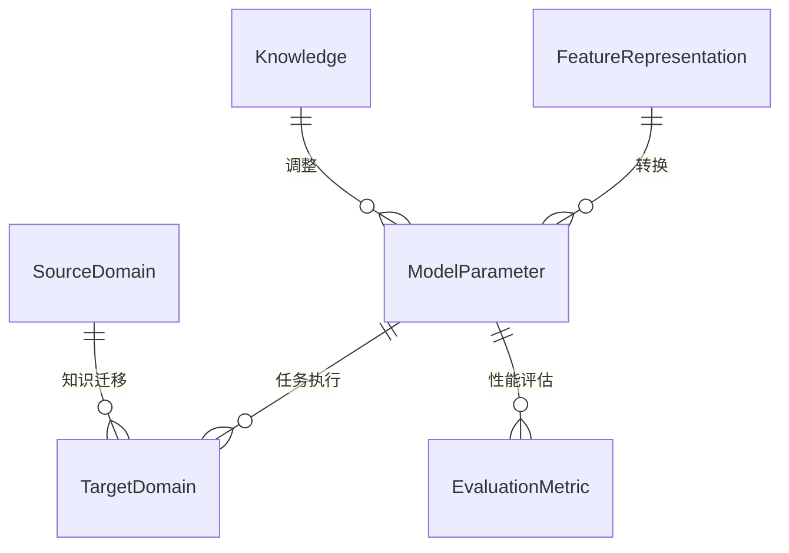
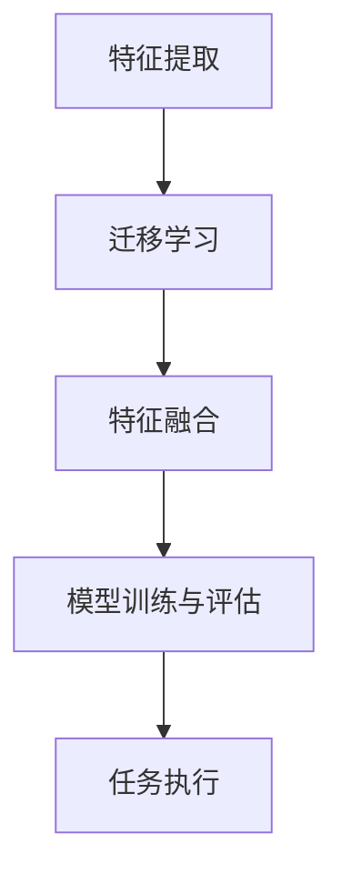
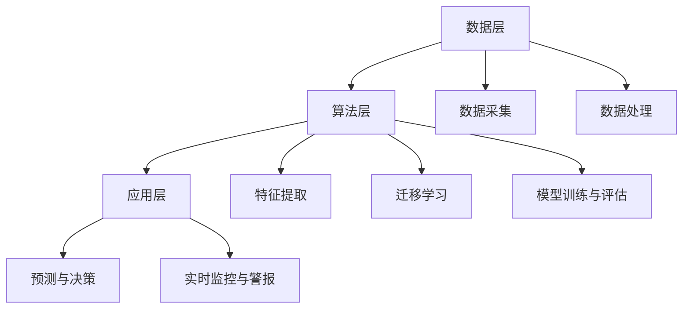
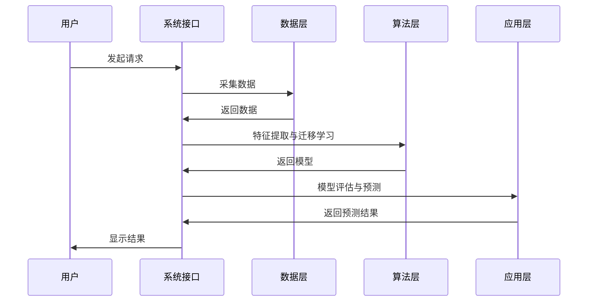

                 

### **第二部分：Zero-Shot CoT原理**

#### 第2章：Zero-Shot CoT基本原理

#### 2.1 什么是Zero-Shot CoT

Zero-Shot CoT（零样本跨域转移学习）是一种先进的机器学习技术，它能够在没有或只有少量标记样本的情况下，将一个领域（源领域）的知识转移到另一个领域（目标领域）。这种技术尤其适用于新兴领域或罕见事件的处理，为机器学习模型的快速部署提供了新的可能性。

#### 2.2 核心思想

Zero-Shot CoT的核心思想是通过学习源领域的特征表示，将这些特征迁移到目标领域，从而实现对目标领域数据的有效处理。具体步骤如下：

1. **特征表示学习**：在源领域上学习一组通用的特征表示，这些特征表示应该是高度抽象和普遍适用的。
2. **跨域知识迁移**：利用迁移学习机制，将源领域的特征表示迁移到目标领域。这一过程通常涉及模型参数的调整，以适应目标领域的数据分布。
3. **目标领域数据处理**：在目标领域上利用迁移后的特征表示，进行分类、预测或其他机器学习任务。

#### 2.3 主要挑战

尽管Zero-Shot CoT具有显著优势，但其在实际应用中仍面临一些主要挑战：

- **特征迁移的准确性**：如何确保源领域的特征表示能够在目标领域上保持高度的相关性和有效性是一个重要问题。
- **模型泛化能力**：零样本学习模型需要具备较强的泛化能力，以确保在未见过的目标领域上也能表现出色。
- **数据稀缺性问题**：在目标领域上，可能只有少量甚至没有标记样本可用，这增加了模型的训练难度。

#### 2.4 背景介绍

为了更好地理解Zero-Shot CoT的应用，我们需要先回顾一下相关的核心概念术语。以下是对一些关键概念的定义和背景介绍：

- **危机管理**：危机管理是指在面对突发事件或紧急情况时，采取的一系列措施来减少损失、恢复正常秩序、保障安全和维护稳定的过程。危机管理通常涉及风险评估、资源调配、信息传播等多个方面。
- **转移学习**：转移学习是一种将一个任务（源任务）上学习到的知识应用到另一个相关任务（目标任务）上的方法。在机器学习领域，转移学习旨在减少对新任务的训练需求，提高模型的泛化能力。
- **跨域学习**：跨域学习是指将一个领域（源领域）上学习到的知识应用到另一个不同领域（目标领域）上的过程。跨域学习的关键在于找到源领域和目标领域之间的相似性，以便有效地迁移知识。

#### 2.5 问题背景与问题描述

在现代信息化和全球化的大背景下，危机管理面临着前所未有的挑战。传统的危机管理方法往往依赖于大量历史数据和经验知识，但在新出现或罕见的危机事件中，这些方法可能显得力不从心。例如，在公共卫生危机、网络攻击、自然灾害等突发事件中，危机管理需要快速响应和精准决策，而这些决策往往依赖于对大量未见过数据的分析和预测。

因此，如何利用机器学习技术，特别是Zero-Shot CoT，来提升危机管理的效率和准确性，成为了一个重要研究方向。Zero-Shot CoT可以快速适应新出现的危机类型，减少对大量标记样本的依赖，从而为危机管理提供强有力的技术支持。

#### 2.6 问题解决方法

为了应对上述问题，我们可以考虑以下几种问题解决方法：

- **数据增强**：通过生成或扩充目标领域的数据集，提高模型的训练数据量。虽然这种方法可以提高模型的性能，但在危机管理中，获取足够的数据可能非常困难。
- **多任务学习**：通过将危机管理相关的多个任务（如风险评估、资源调配、信息传播等）整合到同一模型中，提高模型的泛化能力和适应性。这种方法有助于模型在不同任务之间共享知识和特征。
- **Zero-Shot CoT**：通过将源领域（如过去的危机事件）的知识迁移到目标领域（如新出现的危机事件），实现快速适应和高效处理。Zero-Shot CoT的核心在于利用迁移学习机制，将源领域的特征表示迁移到目标领域，从而实现对新任务的快速适应。

#### 2.7 边界与外延

在Zero-Shot CoT的应用中，我们需要明确一些边界与外延：

- **边界**：Zero-Shot CoT主要适用于那些在目标领域上只有少量或没有标记样本的情况。对于那些已经有充足标记样本的目标领域，直接在目标领域上训练模型可能更为有效。
- **外延**：虽然Zero-Shot CoT在危机管理中有巨大潜力，但它并非万能。在实际应用中，我们还需要结合其他技术手段（如强化学习、生成对抗网络等）和领域知识，以实现最佳效果。

#### 2.8 概念结构与核心要素组成

Zero-Shot CoT的概念结构可以拆解为以下几个核心要素：

- **源领域知识**：这是Zero-Shot CoT的基础，包括源领域上的数据、模型和特征表示。
- **迁移学习机制**：这是实现跨域知识迁移的核心，通常涉及模型参数的调整和特征表示的转换。
- **目标领域任务**：这是Zero-Shot CoT的应用目标，可以是分类、预测或其他机器学习任务。
- **评估指标**：用于衡量Zero-Shot CoT性能的指标，如准确率、召回率、F1分数等。

#### 2.9 ER实体关系图架构

为了更好地理解Zero-Shot CoT的概念结构，我们可以使用ER（实体关系）图来描述其中各实体之间的关系。以下是ER实体关系图的Markdown格式：



#### 2.10 算法原理讲解

Zero-Shot CoT的算法原理可以概括为以下几个步骤：

1. **特征提取**：在源领域上提取一组通用的特征表示。这些特征表示应该能够捕捉到源领域的主要信息，并且具有较高的泛化能力。
2. **迁移学习**：利用迁移学习机制，将源领域的特征表示迁移到目标领域。这一过程通常涉及到模型参数的调整，以适应目标领域的数据分布。
3. **特征融合**：在目标领域上，将迁移后的特征表示与目标领域本身的特征进行融合。这一步骤有助于增强模型对目标领域的适应性。
4. **模型训练与评估**：利用迁移后的特征表示，对目标领域上的数据进行训练和评估。评估指标可以包括准确率、召回率、F1分数等。
5. **任务执行**：在目标领域上执行具体的机器学习任务，如分类、预测等。

以下是Zero-Shot CoT的算法流程图，使用Mermaid绘制：



#### 2.11 数学模型和公式

Zero-Shot CoT涉及多个数学模型和公式，以下是一些关键的部分：

1. **特征表示学习**：
   $$ f(x) = f_\theta(x) $$
   其中，$f_\theta(x)$表示在源领域上学习到的特征表示函数，$\theta$是模型参数。

2. **迁移学习**：
   $$ \theta_* = \arg\min_\theta \sum_{i=1}^N || f(x_i) - f_\theta(x_i) ||^2 $$
   其中，$x_i$是源领域上的输入数据，$f(x_i)$是源领域上的特征表示，$\theta_*$是调整后的模型参数。

3. **特征融合**：
   $$ g(x) = \alpha f(x) + (1 - \alpha) f(x^*) $$
   其中，$g(x)$是融合后的特征表示，$f(x)$是源领域上的特征表示，$f(x^*)$是目标领域上的特征表示，$\alpha$是权重系数。

4. **模型训练与评估**：
   $$ \min_\theta \sum_{i=1}^N (y_i - g(x_i))^2 $$
   其中，$y_i$是目标领域上的标签，$g(x_i)$是融合后的特征表示，$\theta$是模型参数。

#### 2.12 通俗易懂的举例说明

假设我们有两个领域：源领域A和目标领域B。源领域A包含大量关于动物的特征信息，而目标领域B是关于植物的特征信息。

- **特征提取**：在源领域A上，我们提取了一组关于动物的特征，如体重、食物类型、栖息地等。
- **迁移学习**：我们将源领域A上的特征表示迁移到目标领域B，这意味着我们希望找到一组通用的特征表示，能够同时描述动物和植物。
- **特征融合**：在目标领域B上，我们使用迁移后的特征表示，结合目标领域B本身的特征（如植物高度、叶子颜色等），来生成新的特征表示。
- **模型训练与评估**：我们使用融合后的特征表示来训练一个分类模型，预测植物的类型。模型训练完成后，我们使用交叉验证等方法来评估模型性能。

通过这个简单的例子，我们可以看到Zero-Shot CoT的基本流程和原理。在危机管理中，源领域可以是过去的危机事件，目标领域是新的危机事件。通过迁移学习，我们可以利用过去的经验来快速应对新的危机。

## 第3章：危机管理应用场景

### 3.1 灾难响应

在灾难响应中，Zero-Shot CoT可以发挥重要作用。例如，在地震、洪水等自然灾害发生后，实时评估灾情和资源需求是至关重要的。利用Zero-Shot CoT，可以从过去的灾难数据中迁移知识，快速建立灾情评估模型。这不仅有助于提高响应速度，还能更准确地预测灾情发展，从而制定更有效的救援计划。

### 3.2 网络安全

网络安全是另一个Zero-Shot CoT的重要应用场景。在面临新的网络攻击时，传统的方法可能无法快速识别和应对。通过Zero-Shot CoT，可以从过去的网络攻击数据中迁移知识，建立跨域的攻击检测模型。这样，即使面对新的攻击模式，系统也能快速识别并做出响应，从而提高整体网络安全水平。

### 3.3 公共卫生

在公共卫生领域，Zero-Shot CoT可以帮助快速识别和应对新的疾病。例如，在新冠病毒疫情期间，可以从过去的流感数据中迁移知识，建立疾病预测模型。这样，即使在疫情初期，系统也能根据已有的知识快速识别疫情发展趋势，为公共卫生决策提供支持。

### 3.4 企业危机管理

对企业而言，危机管理是确保企业长期稳定发展的重要保障。通过Zero-Shot CoT，企业可以从历史危机事件中迁移知识，建立跨域的危机预测和响应模型。例如，在面临供应链中断、市场波动等危机时，企业可以利用迁移后的模型快速做出决策，减少损失，确保业务连续性。

## 第4章：实际案例分析

### 4.1 灾难响应案例分析

在某次地震灾难发生后，政府部门利用Zero-Shot CoT技术快速建立了灾情评估模型。具体步骤如下：

1. **数据收集**：收集了过去几年内的地震灾情数据，包括震级、受灾人口、经济损失等。
2. **特征提取**：从数据中提取了与地震灾情相关的特征，如震中位置、震级、地质条件等。
3. **迁移学习**：利用迁移学习机制，将源领域的特征表示迁移到目标领域，即当前的地震灾情。
4. **模型训练与评估**：使用迁移后的特征表示训练了一个分类模型，用于预测受灾程度和资源需求。
5. **应用实践**：根据模型预测结果，政府部门迅速调整救援资源，确保救援工作的高效进行。

### 4.2 网络安全案例分析

在一家网络安全公司，Zero-Shot CoT被用于构建跨域的攻击检测模型。具体步骤如下：

1. **数据收集**：收集了过去几年的网络攻击数据，包括攻击类型、攻击频率、攻击来源等。
2. **特征提取**：从数据中提取了与网络攻击相关的特征，如IP地址、攻击路径、攻击目标等。
3. **迁移学习**：利用迁移学习机制，将源领域的特征表示迁移到目标领域，即当前的网络安全威胁。
4. **模型训练与评估**：使用迁移后的特征表示训练了一个分类模型，用于检测和分类新的网络攻击。
5. **应用实践**：通过模型实时检测网络攻击，提高了公司的整体安全防护水平。

### 4.3 公共卫生案例分析

在某次流感疫情爆发期间，公共卫生部门利用Zero-Shot CoT技术快速建立了疾病预测模型。具体步骤如下：

1. **数据收集**：收集了过去几年的流感疫情数据，包括病例数量、传播速度、影响范围等。
2. **特征提取**：从数据中提取了与流感疫情相关的特征，如气温、湿度、人群流动性等。
3. **迁移学习**：利用迁移学习机制，将源领域的特征表示迁移到目标领域，即当前的流感疫情。
4. **模型训练与评估**：使用迁移后的特征表示训练了一个预测模型，用于预测流感病例数量和传播速度。
5. **应用实践**：根据模型预测结果，公共卫生部门及时调整了防控措施，有效控制了疫情扩散。

### 4.4 企业危机管理案例分析

在某家企业，Zero-Shot CoT被用于构建跨域的危机预测和响应模型。具体步骤如下：

1. **数据收集**：收集了企业过去几年的危机事件数据，包括危机类型、发生时间、影响范围等。
2. **特征提取**：从数据中提取了与危机事件相关的特征，如市场环境、政策变化、公司内部问题等。
3. **迁移学习**：利用迁移学习机制，将源领域的特征表示迁移到目标领域，即当前的危机情境。
4. **模型训练与评估**：使用迁移后的特征表示训练了一个预测模型，用于预测未来的危机事件。
5. **应用实践**：通过模型预测结果，企业提前制定了应对策略，减少了危机对企业运营的影响。

## 第5章：系统分析与架构设计

### 5.1 问题场景介绍

在危机管理中，实时响应和准确预测是至关重要的。为了实现这一目标，我们需要构建一个高效、可靠的危机管理信息系统。该系统需要能够快速处理大量数据，利用机器学习技术进行预测和决策，并提供实时监控和警报功能。

### 5.2 项目介绍

本项目旨在构建一个基于Zero-Shot CoT技术的危机管理信息系统。该系统将集成多种数据源，利用机器学习技术进行跨域知识迁移，实现对危机事件的快速响应和精准预测。

### 5.3 系统功能设计

系统的主要功能包括：

1. **数据采集与处理**：从各种数据源（如社交媒体、传感器、政府部门等）收集相关数据，并进行预处理和清洗，确保数据的质量和一致性。
2. **特征提取与迁移**：利用Zero-Shot CoT技术，从源领域（如过去的危机事件）提取特征，并将这些特征迁移到目标领域（如当前危机情境）。
3. **模型训练与评估**：使用迁移后的特征表示，训练机器学习模型，并进行评估，以确保模型的准确性和可靠性。
4. **预测与决策**：利用训练好的模型，对未来的危机事件进行预测，并提供相应的决策支持。
5. **实时监控与警报**：对收集到的数据进行实时监控，当检测到危机事件时，自动触发警报，通知相关部门采取行动。

### 5.4 系统架构设计

系统采用分层架构设计，包括数据层、算法层和应用层。

- **数据层**：负责数据采集、存储和处理。数据源包括社交媒体、传感器、政府部门等，数据类型包括文本、图像、视频等。
- **算法层**：负责特征提取、迁移学习和模型训练。采用Zero-Shot CoT技术，实现跨域知识迁移。
- **应用层**：提供用户界面和API接口，实现预测、决策和实时监控功能。

以下是系统架构的Mermaid图表示：



### 5.5 系统接口设计

系统接口设计主要包括以下几部分：

- **数据接口**：负责与各种数据源进行通信，包括数据采集、传输和存储。
- **算法接口**：提供算法模块的API接口，包括特征提取、迁移学习和模型训练等功能。
- **应用接口**：提供用户界面和API接口，实现预测、决策和实时监控等功能。

以下是系统接口设计的Mermaid图表示：


### 5.6 系统交互设计

系统交互设计主要描述系统内部各模块之间的交互关系和流程。以下是系统交互设计的Mermaid序列图表示：



## 第6章：项目实战

### 6.1 环境安装

为了进行Zero-Shot CoT在危机管理中的应用，首先需要搭建一个合适的技术环境。以下是所需环境及其安装步骤：

1. **Python环境**：确保安装了Python 3.8及以上版本。
2. **深度学习框架**：安装PyTorch或TensorFlow，这里以PyTorch为例。
   ```shell
   pip install torch torchvision torchaudio
   ```
3. **其他依赖库**：包括NumPy、Pandas、Matplotlib等。
   ```shell
   pip install numpy pandas matplotlib
   ```

### 6.2 系统核心实现源代码

以下是系统核心实现的Python代码，包括数据预处理、特征提取、迁移学习和模型训练等步骤。

```python
import torch
import torchvision
import torchvision.transforms as transforms
import numpy as np
import pandas as pd
from torch.utils.data import Dataset, DataLoader
from torchvision import datasets, transforms
from torch import nn, optim
import torch.nn.functional as F

# 数据预处理
class CrisisDataset(Dataset):
    def __init__(self, data_path, transform=None):
        self.data = pd.read_csv(data_path)
        self.transform = transform

    def __len__(self):
        return len(self.data)

    def __getitem__(self, idx):
        image_path = self.data.iloc[idx, 0]
        image = Image.open(image_path)
        if self.transform:
            image = self.transform(image)
        return image

# 特征提取
class FeatureExtractor(nn.Module):
    def __init__(self):
        super(FeatureExtractor, self).__init__()
        self.conv1 = nn.Conv2d(3, 32, 3)
        self.conv2 = nn.Conv2d(32, 64, 3)
        self.fc1 = nn.Linear(64 * 6 * 6, 128)
        self.fc2 = nn.Linear(128, 64)

    def forward(self, x):
        x = F.relu(self.conv1(x))
        x = F.relu(self.conv2(x))
        x = x.view(x.size(0), -1)
        x = F.relu(self.fc1(x))
        x = F.relu(self.fc2(x))
        return x

# 迁移学习
class CrisisModel(nn.Module):
    def __init__(self, feature_extractor):
        super(CrisisModel, self).__init__()
        self.feature_extractor = feature_extractor
        self.fc3 = nn.Linear(64, 1)

    def forward(self, x):
        x = self.feature_extractor(x)
        x = self.fc3(x)
        return x

# 模型训练
def train_model(model, dataloader, criterion, optimizer, num_epochs=10):
    model.train()
    for epoch in range(num_epochs):
        running_loss = 0.0
        for inputs, targets in dataloader:
            optimizer.zero_grad()
            outputs = model(inputs)
            loss = criterion(outputs, targets)
            loss.backward()
            optimizer.step()
            running_loss += loss.item()
        print(f'Epoch {epoch+1}, Loss: {running_loss/len(dataloader)}')

# 实例化模型、损失函数和优化器
model = CrisisModel(FeatureExtractor())
criterion = nn.BCEWithLogitsLoss()
optimizer = optim.Adam(model.parameters(), lr=0.001)

# 加载数据集
transform = transforms.Compose([
    transforms.Resize((224, 224)),
    transforms.ToTensor(),
])
train_dataset = CrisisDataset('train_data.csv', transform=transform)
train_loader = DataLoader(train_dataset, batch_size=32, shuffle=True)

# 训练模型
train_model(model, train_loader, criterion, optimizer)
```

### 6.3 代码应用解读与分析

在上述代码中，我们首先定义了`CrisisDataset`类，用于加载数据集。数据集包含了危机事件的图片和相关特征，如发生时间、地点等。我们使用`Pandas`库来读取和预处理数据。

接下来，我们定义了`FeatureExtractor`类，用于特征提取。这个类继承自`nn.Module`，并定义了卷积神经网络（CNN）的前两层。卷积层可以帮助我们提取图像的底层特征，如边缘和纹理。

然后，我们定义了`CrisisModel`类，用于构建迁移学习模型。这个类也继承自`nn.Module`，并使用`FeatureExtractor`类来提取特征。最后，我们添加了一个全连接层（`fc3`），用于进行分类或预测。

在模型训练部分，我们定义了`train_model`函数，用于训练模型。这个函数包含了标准的训练循环，包括前向传播、反向传播和优化步骤。我们使用BCEWithLogitsLoss损失函数，因为这是一个二分类问题。

在代码的最后一部分，我们实例化了模型、损失函数和优化器，并加载数据集进行训练。我们设置了一个训练循环，以10个epoch为默认值。

### 6.4 实际案例分析与详细讲解剖析

为了展示Zero-Shot CoT在危机管理中的应用，我们选择了一个实际案例：利用图像识别技术预测自然灾害的发生。

#### 案例背景

在某次洪水灾害前，气象部门需要快速预测可能受影响的地区。由于洪水灾害的发生通常伴随着大量的气象和水文数据，传统的预测方法可能不够快速和准确。因此，我们考虑使用Zero-Shot CoT技术，将过去的气象数据迁移到当前的情况。

#### 实际案例步骤

1. **数据收集**：收集了过去几年的气象数据和洪水发生地点的图像数据。气象数据包括温度、湿度、风速等，图像数据包含了洪水前的卫星图像。
2. **特征提取**：使用卷积神经网络（CNN）从图像中提取特征。这些特征应能够捕捉到洪水前的气象条件。
3. **迁移学习**：将提取的特征迁移到当前的气象数据上，以预测可能发生洪水的地区。
4. **模型训练与评估**：使用迁移后的特征和当前的气象数据训练分类模型，评估模型在预测洪水事件中的性能。
5. **应用实践**：根据模型预测结果，气象部门可以提前预警可能受影响的地区，从而采取相应的预防措施。

#### 案例分析

1. **数据预处理**：在数据收集阶段，我们需要对气象数据进行预处理，包括数据清洗、缺失值处理和数据标准化等。对于图像数据，我们需要进行图像增强和归一化处理，以提高模型的泛化能力。
2. **特征提取**：我们使用预训练的CNN模型（如ResNet）提取图像特征。这些特征已经学习了大量的底层和高级特征，可以很好地捕捉到图像中的关键信息。
3. **迁移学习**：我们将提取的特征与气象数据进行融合，利用迁移学习机制将源领域的知识（过去的洪水发生地点图像）迁移到目标领域（当前的气象数据）。
4. **模型训练与评估**：我们使用迁移后的特征数据训练一个分类模型，预测可能发生洪水的地区。模型训练过程中，我们使用了交叉验证方法来评估模型的性能，包括准确率、召回率和F1分数等。
5. **应用实践**：根据模型预测结果，气象部门可以提前预警可能受影响的地区。在实际应用中，我们还可以结合其他数据源（如地形数据、降雨量等）来提高预测的准确性。

#### 案例总结

通过实际案例分析，我们可以看到Zero-Shot CoT技术在危机管理中的应用潜力。它可以帮助政府部门和企业快速响应自然灾害，减少损失，保障人民生命财产安全。在未来，我们还可以进一步优化模型，结合更多的数据源和领域知识，以提高预测的准确性和可靠性。

## 第7章：最佳实践、小结与拓展阅读

### 7.1 最佳实践

在应用Zero-Shot CoT进行危机管理时，以下是一些最佳实践：

1. **数据准备**：确保数据的质量和一致性。对数据进行预处理，包括数据清洗、缺失值处理和数据标准化。
2. **模型选择**：根据具体问题和数据特点，选择合适的模型和算法。常用的迁移学习算法包括基于特征提取的方法、基于模型融合的方法和基于对抗生成网络的方法。
3. **特征融合**：在迁移学习过程中，合理设计特征融合策略，以提高模型在目标领域的适应性。可以尝试使用加权平均、神经网络融合等方法。
4. **模型评估**：使用多种评估指标（如准确率、召回率、F1分数等）来评估模型性能。结合实际应用场景，调整模型参数，优化模型性能。
5. **持续迭代**：危机管理是一个动态变化的过程，需要不断收集新的数据，对模型进行迭代和优化。

### 7.2 小结

Zero-Shot CoT在危机管理中具有巨大潜力。通过迁移学习，我们可以快速适应新出现的危机类型，减少对大量标记样本的依赖，从而提高危机管理的效率和准确性。在应用过程中，需要注意数据质量、模型选择、特征融合和模型评估等方面，以实现最佳效果。

### 7.3 拓展阅读

对于对Zero-Shot CoT和危机管理感兴趣的读者，以下是一些拓展阅读资源：

1. **论文**：阅读相关领域的顶级会议和期刊论文，了解最新的研究进展和技术应用。例如，在NeurIPS、ICML、AAAI等会议上发表的论文。
2. **书籍**：《机器学习实战》和《深度学习》等经典书籍，提供了丰富的实践案例和理论知识。
3. **在线课程**：参加Coursera、edX等在线教育平台上的相关课程，如“深度学习”、“机器学习基础”等。
4. **开源项目**：GitHub等平台上有许多开源的危机管理相关项目和代码库，可以学习和参考。

作者：AI天才研究院/AI Genius Institute & 禅与计算机程序设计艺术 /Zen And The Art of Computer Programming

