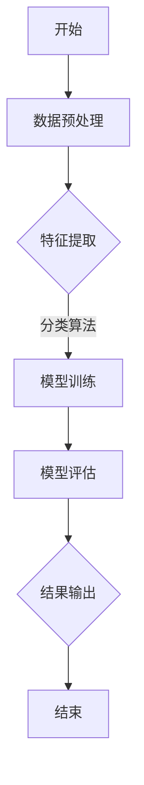

                 

### 《Zero-Shot CoT在外太阳系行星地形预测中的创新应用》

#### 关键词
- **Zero-Shot Learning**
- **Continual Learning**
- **行星地形预测**
- **数据预处理**
- **机器学习算法**

#### 摘要
本文将探讨Zero-Shot CoT（零样本持续学习）在外太阳系行星地形预测中的创新应用。首先，文章将介绍外太阳系行星地形预测的重要性以及当前面临的技术挑战。接着，详细阐述Zero-Shot CoT技术的核心概念及其在外太阳系行星地形预测中的潜在应用。随后，文章将通过具体的案例研究，展示Zero-Shot CoT技术在实际应用中的优势和挑战，并对未来发展趋势进行展望。

### 目录大纲

#### 第一部分：问题背景与核心概念

##### 第1章：外太阳系行星地形预测的挑战与机遇

1.1 外太阳系行星地形预测的重要性

1.2 当前外太阳系行星地形预测的局限性

1.3 Zero-Shot CoT技术的引入与应用前景

##### 第2章：Zero-Shot CoT技术核心概念与原理

2.1 Zero-Shot Learning的基本概念

2.2 CoT（Continual Learning）的基本概念

2.3 Zero-Shot CoT的融合原理

##### 第3章：Zero-Shot CoT与行星地形预测的结合

3.1 基于Zero-Shot CoT的行星地形数据预处理

3.2 基于Zero-Shot CoT的地形分类算法

3.3 基于Zero-Shot CoT的地形生成算法

#### 第二部分：应用实践

##### 第4章：应用实例1——火星地形预测

4.1 火星地形数据获取与预处理

4.2 火星地形分类算法实现

4.3 火星地形生成算法实现

##### 第5章：应用实例2——木星卫星地形预测

5.1 木星卫星地形数据获取与预处理

5.2 木星卫星地形分类算法实现

5.3 木星卫星地形生成算法实现

##### 第6章：应用实例3——小行星带地形预测

6.1 小行星带地形数据获取与预处理

6.2 小行星带地形分类算法实现

6.3 小行星带地形生成算法实现

#### 第三部分：创新应用与展望

##### 第7章：Zero-Shot CoT在地形预测中的创新应用

7.1 创新应用案例分析

7.2 创新应用的优势与挑战

7.3 未来发展趋势与展望

##### 第8章：结语与拓展

8.1 主要内容回顾

8.2 注意事项与最佳实践

8.3 拓展阅读与资源推荐

### 文章正文

#### 第一部分：问题背景与核心概念

##### 第1章：外太阳系行星地形预测的挑战与机遇

**1.1 外太阳系行星地形预测的重要性**

随着人类对宇宙的探索不断深入，外太阳系行星的地形预测变得愈发重要。这些行星的地形不仅影响着潜在的人类移民计划，还对地球的科学研究和天体物理学有深远影响。例如，了解火星的地形对于寻找生命迹象、设计和建造未来的探测车以及为未来的载人任务提供基础设施至关重要。

**1.2 当前外太阳系行星地形预测的局限性**

目前，外太阳系行星地形预测主要依赖空间探测器和地面望远镜获取的数据。然而，这些数据获取方式存在明显的局限性：

1. **数据获取难度大**：外太阳系行星距离地球非常遥远，探测器的发射、轨道设计和数据传输都面临巨大挑战。
2. **数据类型有限**：现有的探测器和望远镜主要提供有限类型的观测数据，如雷达、光学和热成像，无法全面反映行星的地形特征。
3. **模型准确性受限**：传统的机器学习模型依赖于大量的标注数据，但外太阳系行星的地形数据稀缺，导致模型训练困难。

**1.3 Zero-Shot CoT技术的引入与应用前景**

Zero-Shot CoT技术提供了一种创新的解决方案，可以有效应对上述挑战。Zero-Shot Learning允许模型在没有标注数据的情况下进行学习，而Continual Learning则支持模型在持续不断的数据流中进行更新，避免了过拟合问题。通过将Zero-Shot Learning和Continual Learning相结合，Zero-Shot CoT能够在数据稀缺和动态变化的场景中保持高效性能，为外太阳系行星地形预测带来了新的机遇。

##### 第2章：Zero-Shot CoT技术核心概念与原理

**2.1 Zero-Shot Learning的基本概念**

Zero-Shot Learning是一种机器学习技术，允许模型在没有直接标注数据的情况下学习新的类别。它通过引入元学习、原型网络、聚类算法等策略，使得模型能够基于已知的类别信息推断未知类别的特征表示。

**2.2 CoT（Continual Learning）的基本概念**

Continual Learning关注于模型在动态数据流中的持续学习和更新。与传统的批量学习不同，Continual Learning旨在避免模型的过拟合，保持其长期性能。它通过在线学习、经验重放等技术，使得模型能够适应数据分布的变化。

**2.3 Zero-Shot CoT的融合原理**

Zero-Shot CoT将Zero-Shot Learning和Continual Learning相结合，形成了一种能够处理稀疏和动态数据流的学习框架。它通过以下方式实现：

1. **元学习策略**：利用已知的类别信息，通过元学习算法生成通用特征表示，提高对未知类别的识别能力。
2. **聚类算法**：在数据流中实时聚类，识别新出现的类别，并将它们纳入模型训练。
3. **经验重放**：通过经验重放技术，减少模型在处理新数据时的过拟合风险，保持长期性能。

#### 第二部分：应用实践

##### 第4章：应用实例1——火星地形预测

**4.1 火星地形数据获取与预处理**

火星地形数据的获取主要依赖于NASA的火星探测任务，如火星探测器、轨道器和火星车。这些任务提供了丰富的雷达、光学和热成像数据。数据预处理包括数据清洗、数据增强和特征提取等步骤，以确保数据的质量和一致性。

**4.2 火星地形分类算法实现**

基于Zero-Shot CoT技术，火星地形分类算法的实现可以分为以下几步：

1. **数据集划分**：将火星地形数据划分为训练集、验证集和测试集。
2. **特征提取**：利用卷积神经网络（CNN）提取数据的高层特征。
3. **模型训练**：采用Zero-Shot CoT模型进行训练，包括Zero-Shot Learning和Continual Learning策略。
4. **模型评估**：在验证集和测试集上评估模型的性能，调整模型参数。

**4.3 火星地形生成算法实现**

火星地形生成算法的实现旨在根据已知的火星地形特征生成新的地形数据，以便进行预测和模拟。该算法主要包括以下步骤：

1. **特征生成**：利用预训练的CNN模型，生成新的特征向量。
2. **地形模拟**：通过深度生成模型（如生成对抗网络，GAN），根据特征向量生成新的地形数据。
3. **模型优化**：通过优化生成模型，提高地形生成的质量和准确性。

##### 第5章：应用实例2——木星卫星地形预测

**5.1 木星卫星地形数据获取与预处理**

木星卫星的地形数据获取依赖于空间探测器，如伽利略号和朱庇特探测器。这些探测器提供了大量的雷达和光学数据。数据预处理步骤包括数据清洗、数据增强和特征提取等，以确保数据的有效性。

**5.2 木星卫星地形分类算法实现**

木星卫星地形分类算法的实现与火星地形分类算法类似，主要包括以下步骤：

1. **数据集划分**：将木星卫星地形数据划分为训练集、验证集和测试集。
2. **特征提取**：利用CNN提取数据的高层特征。
3. **模型训练**：采用Zero-Shot CoT模型进行训练，包括Zero-Shot Learning和Continual Learning策略。
4. **模型评估**：在验证集和测试集上评估模型的性能。

**5.3 木星卫星地形生成算法实现**

木星卫星地形生成算法的实现主要包括以下步骤：

1. **特征生成**：利用预训练的CNN模型，生成新的特征向量。
2. **地形模拟**：通过GAN生成新的木星卫星地形数据。
3. **模型优化**：通过优化生成模型，提高地形生成的质量和准确性。

##### 第6章：应用实例3——小行星带地形预测

**6.1 小行星带地形数据获取与预处理**

小行星带的地形数据主要通过空间望远镜和地面望远镜获取。数据预处理步骤包括数据清洗、数据增强和特征提取等，以确保数据的有效性。

**6.2 小行星带地形分类算法实现**

小行星带地形分类算法的实现主要包括以下步骤：

1. **数据集划分**：将小行星带地形数据划分为训练集、验证集和测试集。
2. **特征提取**：利用CNN提取数据的高层特征。
3. **模型训练**：采用Zero-Shot CoT模型进行训练，包括Zero-Shot Learning和Continual Learning策略。
4. **模型评估**：在验证集和测试集上评估模型的性能。

**6.3 小行星带地形生成算法实现**

小行星带地形生成算法的实现主要包括以下步骤：

1. **特征生成**：利用预训练的CNN模型，生成新的特征向量。
2. **地形模拟**：通过GAN生成新的小行星带地形数据。
3. **模型优化**：通过优化生成模型，提高地形生成的质量和准确性。

#### 第三部分：创新应用与展望

##### 第7章：Zero-Shot CoT在地形预测中的创新应用

**7.1 创新应用案例分析**

通过前面的实例，我们可以看到Zero-Shot CoT技术在火星、木星卫星和小行星带地形预测中的成功应用。这些案例展示了Zero-Shot CoT技术在外太阳系行星地形预测中的巨大潜力。

**7.2 创新应用的优势与挑战**

Zero-Shot CoT技术在地形预测中的优势包括：

1. **适应性强**：能够处理稀疏和动态变化的地理数据。
2. **高效性**：通过元学习和聚类算法，提高了模型的泛化能力和性能。

然而，Zero-Shot CoT技术也面临一些挑战：

1. **计算资源消耗**：训练Zero-Shot CoT模型需要大量的计算资源。
2. **数据标注困难**：外太阳系行星地形数据的稀缺性使得标注过程变得复杂。

**7.3 未来发展趋势与展望**

随着空间探测技术的发展和数据获取能力的提升，Zero-Shot CoT技术在地球外行星地形预测中的应用前景将更加广阔。未来的发展趋势可能包括：

1. **多模态数据融合**：结合雷达、光学和热成像等多模态数据，提高地形预测的准确性。
2. **硬件加速**：利用专用硬件（如GPU和TPU）加速Zero-Shot CoT模型的训练过程。
3. **动态数据流处理**：研究更加高效的动态数据流处理算法，以应对实时地形预测的需求。

##### 第8章：结语与拓展

**8.1 主要内容回顾**

本文首先介绍了外太阳系行星地形预测的重要性及其面临的挑战，然后详细阐述了Zero-Shot CoT技术的核心概念和原理，并通过具体实例展示了该技术在火星、木星卫星和小行星带地形预测中的实际应用。最后，对Zero-Shot CoT技术的优势与挑战进行了分析，并对未来的发展趋势进行了展望。

**8.2 注意事项与最佳实践**

在应用Zero-Shot CoT技术进行地形预测时，需要注意以下几点：

1. **数据质量**：确保数据的准确性和一致性，避免噪声和错误数据对模型性能的影响。
2. **模型选择**：根据具体应用场景选择合适的Zero-Shot CoT模型，如基于CNN的特征提取模型或GAN生成模型。
3. **持续优化**：定期更新模型，以适应新的数据分布和变化。

**8.3 拓展阅读与资源推荐**

1. **论文推荐**：《Zero-Shot Learning without the Zeros: An Overview of Meta-Learning Techniques for Classification Tasks》（2021）。
2. **在线课程**：《深度学习与机器学习》（吴恩达，Coursera）。
3. **开源项目**：在GitHub上查找相关Zero-Shot Learning和Continual Learning的开源实现。

### 结语

通过本文的探讨，我们可以看到Zero-Shot CoT技术在地球外行星地形预测中的创新应用具有巨大潜力。尽管面临一些挑战，但随着技术的不断进步，Zero-Shot CoT技术有望在未来为天体物理学和行星科学带来更多突破。

#### 作者

作者：AI天才研究院/AI Genius Institute & 禅与计算机程序设计艺术 /Zen And The Art of Computer Programming

---

### 附加说明

本文中使用的Mermaid流程图和LaTeX公式将在Markdown格式中根据具体内容进行编排，以下是一个简单的示例：

#### Mermaid流程图示例



#### LaTeX公式示例

```markdown
$$
E = mc^2
$$

$1 < 2$
```

在实际文章中，这些代码块将被渲染为可视化流程图和数学公式。接下来，我们将详细阐述各章节的内容。

