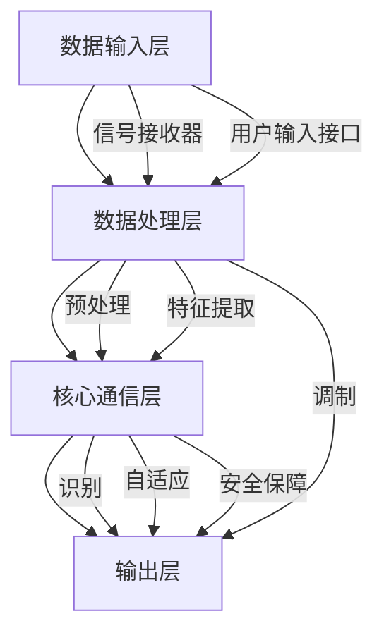
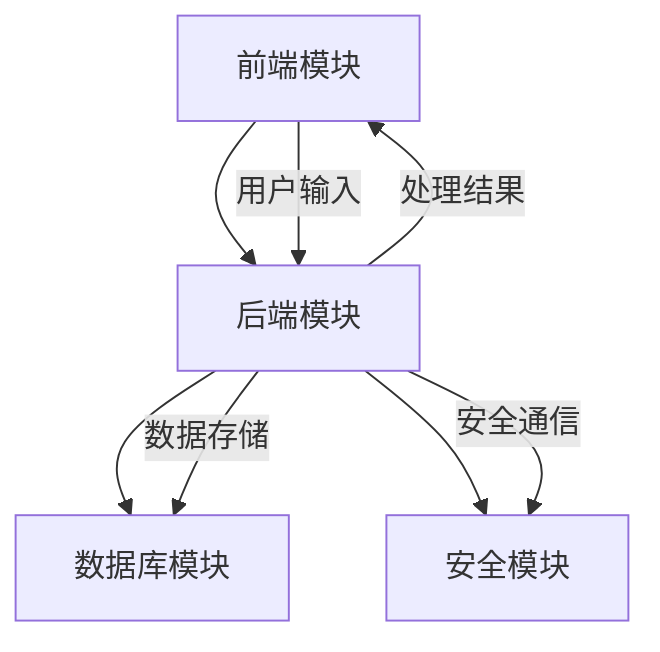
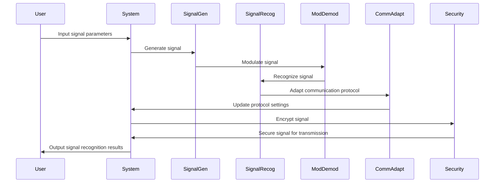

                 


### 1.1.1 问题的提出

随着人类科技水平的不断进步，对外星文明的探索和通信成为了一个热门且富有挑战性的领域。在这个领域，我们面临着诸多复杂而关键的问题。首先，我们如何确定外星文明的存在？其次，我们如何与他们进行有效的通信？最后，我们如何理解他们的文化和语言？这些问题都指向了一个核心问题：如何设计一种适应外星文明通信的协议。

传统的通信协议往往基于我们现有的技术和语言体系。然而，对于外星文明，我们几乎没有任何先验知识，这使得传统方法难以奏效。因此，我们需要一种全新的、零样本的通信协议设计方法。这种方法不仅要能够处理未知的信息，还要能够在没有先验数据的情况下，通过学习我们的知识体系，预测和理解外星文明的通信方式。

在此背景下，Zero-Shot CoT（零样本跨域传输）技术应运而生。它是一种无需训练集，直接从零开始学习并生成合适通信内容的模型。Zero-Shot CoT通过将不同的知识领域映射到统一的空间中，使得原本独立的领域能够互相理解和交互。这种方法在处理未知领域时展现出极大的潜力，为外星文明通信协议设计提供了新的思路和工具。

### 1.1.2 外星文明通信协议设计的重要性

外星文明通信协议设计的重要性不言而喻。首先，它关系到我们是否能够找到外星生命的可能性。如果一个文明能够与我们进行有效通信，那么我们就有机会了解他们的科技水平、文化背景和社会结构。这不仅对科学界有着巨大的推动作用，也可能对人类社会产生深远的影响。

其次，外星文明通信协议的设计对于太空探索具有重要意义。通过有效的通信协议，我们能够更好地理解太空中的各种信号和现象，从而推动太空探索的深入进行。例如，我们可以通过分析外星信号的特性，推测出发送者的环境、气候和生物特征。

此外，外星文明通信协议的设计也涉及到安全性和保密性。我们需要确保通信内容不被恶意解读或篡改，同时保护我们自身的安全。这要求通信协议具有高度的安全性和可靠性。

最后，外星文明通信协议的设计对于跨学科研究有着积极的推动作用。它不仅需要计算机科学、通信技术和天文学的知识，还需要语言学、文化学和哲学等领域的支持。这种跨学科的研究有助于我们更全面地理解宇宙和生命的本质。

### 1.1.3 Zero-Shot CoT的概念与特点

Zero-Shot CoT，即零样本跨域传输，是一种能够处理未知领域的机器学习技术。它的核心思想是通过将不同领域的信息映射到一个共同的空间中，从而实现跨领域的理解和交互。

Zero-Shot CoT具有以下特点：

1. **无需训练数据**：传统的机器学习模型需要大量的训练数据来进行学习，而Zero-Shot CoT可以在没有先验数据的情况下进行学习，这使得它在未知领域应用中具有独特的优势。

2. **跨领域适应性**：Zero-Shot CoT能够将不同领域的知识进行整合，使得原本独立的领域能够相互理解和交互。这对于外星文明通信协议设计尤为重要，因为我们需要能够理解和交互的信息领域非常广泛。

3. **生成能力强**：Zero-Shot CoT能够生成符合目标领域的新信息，这使得它在处理未知信息时表现出色。在外星文明通信协议设计中，这意味着我们能够通过生成模型预测和理解外星文明的通信内容。

4. **可解释性**：Zero-Shot CoT模型的决策过程具有高度的透明性，这使得我们能够理解和分析模型的工作原理。这对于外星文明通信协议的设计和优化至关重要，因为我们需要确保通信内容的安全性和可靠性。

总之，Zero-Shot CoT作为一种先进的机器学习技术，为外星文明通信协议设计提供了新的思路和工具。它不仅能够帮助我们理解和交互未知领域的信息，还能够提高通信协议的安全性和可靠性。这使得Zero-Shot CoT在外星文明通信协议设计中具有巨大的潜力。在接下来的章节中，我们将深入探讨Zero-Shot CoT的原理和如何将其应用于外星文明通信协议设计。我们将通过逐步分析，揭示Zero-Shot CoT的内在机制，以及如何通过数学模型和实际案例来理解它的应用。

### 2.1.1 Zero-Shot CoT原理

Zero-Shot CoT（零样本跨域传输）的核心原理可以归结为“跨领域映射”和“零样本学习”。这种技术旨在在没有先验数据的情况下，通过学习知识体系，生成符合未知领域的新信息。以下是对Zero-Shot CoT原理的详细解释：

#### 跨领域映射

首先，我们需要理解什么是跨领域映射。在机器学习中，领域通常指的是特定的知识或技能领域，如医学、金融、自然语言处理等。跨领域映射指的是将一个领域的信息转换为另一个领域的信息，使得原本独立的领域能够相互理解和交互。

Zero-Shot CoT通过将不同领域的知识映射到一个共同的空间中，实现了跨领域的理解和交互。这个共同空间通常是一个高维的嵌入空间，其中每个领域的信息都被嵌入为一个向量。这些向量不仅保留了各自领域的信息，还能够根据它们在共同空间中的相对位置进行交互和理解。

#### 零样本学习

零样本学习（Zero-Shot Learning，ZSL）是一种机器学习方法，它能够在没有训练数据的情况下，对未见过的类进行分类。在传统的机器学习中，模型需要通过大量的训练数据来学习数据的分布和特征。然而，在处理未知领域时，我们往往缺乏足够的训练数据。零样本学习通过引入原型表示和元学习等策略，能够在没有训练数据的情况下，对未见过的类进行有效分类。

Zero-Shot CoT继承了零样本学习的核心思想，但进一步扩展了其应用范围。它不仅关注分类问题，还关注生成问题。这意味着Zero-Shot CoT不仅能够识别未知领域的信息，还能够生成符合未知领域的新信息。

#### 基于生成对抗网络（GAN）的模型

生成对抗网络（Generative Adversarial Networks，GAN）是一种强大的生成模型，它由生成器和判别器两个网络组成。生成器的目标是生成逼真的数据，而判别器的目标是区分生成数据与真实数据。通过这两个网络的对抗训练，生成器不断改进生成数据的质量，最终能够生成与真实数据几乎无异的数据。

Zero-Shot CoT模型通常基于GAN架构。生成器负责将不同领域的知识转换为共同空间中的向量表示，而判别器则负责验证这些向量表示是否符合目标领域的特性。通过这种对抗训练，生成器能够学习到如何生成符合目标领域的新信息。

#### 细节解析

- **知识嵌入**：在Zero-Shot CoT中，每个领域的知识首先被嵌入为一个向量表示。这些向量不仅包含了领域本身的特征，还通过预训练或迁移学习方法，获取了通用特征。

- **共同空间**：不同领域的向量被映射到一个共同的空间中。这个空间的维度通常较高，以便能够容纳各个领域的特征。通过在共同空间中的向量操作，实现了跨领域的理解和交互。

- **对抗训练**：生成器和判别器的对抗训练是Zero-Shot CoT的核心。生成器尝试生成符合目标领域的向量表示，而判别器则尝试区分生成数据与真实数据。这种对抗训练使得生成器不断改进生成质量，从而实现零样本学习。

通过以上原理，Zero-Shot CoT能够有效地处理未知领域的信息，为外星文明通信协议设计提供了新的思路和工具。在接下来的部分，我们将进一步探讨Zero-Shot CoT与零样本学习、迁移学习以及生成对抗网络之间的关系，并通过具体的数学模型和算法实现，详细讲解其工作流程和应用效果。

### 2.1.2 零样本学习与迁移学习

#### 零样本学习

零样本学习（Zero-Shot Learning，ZSL）是一种无需训练数据，即可对未见过的类进行分类的机器学习方法。它主要应用于那些缺乏先验数据或者难以获取数据的场景。在ZSL中，模型不是通过训练来学习数据的特征分布，而是通过学习一个知识库（通常是词汇表），来理解和分类未见过的类。

零样本学习的关键在于如何将新的类别与已知类别进行关联。这通常通过两种方式实现：

1. **原型表示**：在这种方法中，每个类别都被表示为一个原型（即该类别的平均样本）。在分类时，新样本与每个类别的原型进行比较，选择最接近的原型作为其类别标签。

2. **匹配度量**：这种方法使用一个匹配度量函数（如余弦相似度）来计算新样本与已知类别之间的相似性。相似性最高的类别被选为新样本的类别。

#### 迁移学习

迁移学习（Transfer Learning）是一种利用已有模型的知识来提高新任务性能的方法。它通过将一个任务的知识（如特征提取器）迁移到另一个任务上，来减少对新数据的依赖。迁移学习在处理未知领域时非常有用，因为它可以利用已有领域的大量知识来加速新领域的探索。

迁移学习可以分为以下几种类型：

1. **领域自适应**：这种类型关注于将一个领域的知识迁移到另一个相关但不完全相同的领域。例如，使用在自然语言处理领域训练的模型来处理医学文本数据。

2. **领域泛化**：领域泛化关注于将一个领域的知识迁移到多个不同的领域。这种方法通常使用元学习（Meta-Learning）来实现，通过在多个任务上训练模型，使其能够泛化到新的任务。

#### 零样本学习与迁移学习的关系

零样本学习和迁移学习在外星文明通信协议设计中有着紧密的联系。首先，迁移学习可以用来将已知的地球通信知识迁移到外星通信协议中，从而减少对新领域的数据需求。例如，我们可以利用在地球通信中训练的模型来生成适用于外星文明的特征提取器。

其次，零样本学习可以帮助我们分类和理解未见过的通信内容。在外星文明通信中，我们很可能遇到从未见过的通信信号和语言模式。通过零样本学习，我们可以将这些信号和模式与已知的知识进行关联，从而进行有效的分类和理解。

#### 实际应用

在实际应用中，Zero-Shot CoT利用了零样本学习和迁移学习的优势，通过以下步骤实现跨领域的通信协议设计：

1. **知识库构建**：首先，构建一个包含地球通信知识的知识库。这个知识库可以是基于现有的通信协议、语言模型或其他相关领域的知识。

2. **特征提取器迁移**：利用迁移学习，将地球通信中的特征提取器迁移到外星通信协议中。例如，我们可以使用在自然语言处理领域训练的模型，来提取外星通信中的语言特征。

3. **模型训练**：使用零样本学习，训练一个能够对未见过的类进行分类的模型。这个模型可以在没有训练数据的情况下，通过知识库和特征提取器，对新的通信内容进行分类。

4. **通信协议生成**：最后，通过生成模型，生成符合外星文明通信协议的新内容。这些内容不仅能够被外星文明理解，还能够确保通信的安全性。

通过这种综合方法，Zero-Shot CoT实现了在未知领域中的高效通信协议设计，为外星文明通信提供了新的可能性。

### 2.1.3 基于生成对抗网络（GAN）的模型

生成对抗网络（Generative Adversarial Networks，GAN）是一种强大的生成模型，由生成器和判别器两个相互对抗的神经网络组成。GAN的架构和训练过程如下：

#### GAN的基本架构

1. **生成器（Generator）**：生成器的任务是生成逼真的数据，以欺骗判别器。它通常从噪声向量中生成数据，并通过多个层的变换，将这些噪声向量转化为与真实数据相似的样本。

2. **判别器（Discriminator）**：判别器的任务是区分生成数据与真实数据。它通过比较生成数据和真实数据，来判断样本的真实性。

3. **对抗训练**：生成器和判别器通过对抗训练来优化。生成器尝试生成更逼真的数据，以欺骗判别器，而判别器则努力区分生成数据和真实数据。这种对抗过程不断进行，直到生成器生成的数据足够逼真，使得判别器难以区分。

#### GAN的训练过程

1. **初始化**：首先初始化生成器和判别器，通常使用随机权重。

2. **生成样本**：生成器生成一批新的数据样本。

3. **判别器训练**：判别器使用真实数据和生成数据一起进行训练，以优化其分类能力。

4. **生成器训练**：生成器根据判别器的错误反馈进行调整，以生成更逼真的数据。

5. **迭代**：重复上述过程，不断迭代，直到生成器生成的数据与真实数据难以区分。

#### GAN的优缺点

**优点**：

- **强大的生成能力**：GAN能够生成高质量的、逼真的数据样本，适用于图像、音频、文本等多种类型的生成任务。

- **灵活性**：GAN可以在没有特定数据分布假设的情况下进行训练，因此具有很高的灵活性。

- **无监督学习**：GAN是一种无监督学习模型，不需要标注数据，因此可以应用于那些难以获取标注数据的场景。

**缺点**：

- **训练难度**：GAN的训练过程非常不稳定，容易出现模式崩溃（mode collapse）或训练不收敛的问题。

- **计算资源消耗**：GAN的训练过程需要大量的计算资源，尤其是在高维数据上训练时。

#### GAN在外星文明通信协议设计中的应用

GAN在外星文明通信协议设计中的应用主要体现在生成高质量的通信信号。以下是一些具体的应用场景：

1. **信号生成**：GAN可以用于生成符合外星文明通信协议的信号。通过训练生成器，生成器可以生成符合特定协议的信号模式，这些信号可以用于模拟外星通信环境。

2. **信号调制**：GAN可以用于调制信号，使其符合外星文明通信协议的要求。例如，可以通过GAN生成具有特定调制方式的信号，以满足外星通信的需求。

3. **信号解调**：GAN可以用于解调外星信号，将其还原为原始数据。通过训练判别器，判别器可以区分外星信号和噪声，从而实现信号的解调。

通过GAN的生成能力和灵活性，我们可以更有效地设计外星文明通信协议，为未来的太空探索和通信提供新的可能性。

### 2.2.1 概念属性特征对比表格

为了更好地理解Zero-Shot CoT和传统通信协议设计的区别，我们可以通过一个概念属性特征对比表格来展示两者之间的关键差异。

| 特征对比 | Zero-Shot CoT | 传统通信协议设计 |
| --- | --- | --- |
| **训练数据依赖** | 无需大量训练数据 | 需要大量训练数据 |
| **跨领域适应性** | 能够处理未知领域 | 依赖于已有领域的知识 |
| **生成能力** | 强大的生成能力 | 主要进行数据传输 |
| **模型稳定性** | 容易出现模式崩溃 | 稳定性较高 |
| **计算资源消耗** | 需要大量计算资源 | 计算资源需求较低 |
| **适用场景** | 未知领域通信 | 已知领域通信 |
| **抗干扰能力** | 较强，能生成多样化信号 | 较弱，对噪声敏感 |

通过这个表格，我们可以清晰地看到Zero-Shot CoT与传统通信协议设计在各个方面的对比。Zero-Shot CoT在处理未知领域、生成多样化和适应新环境方面具有显著的优势，这使得它在外星文明通信协议设计中具有独特的应用潜力。然而，它在模型稳定性和计算资源消耗方面也存在挑战，需要进一步研究和优化。

### 2.2.2 ER实体关系图架构

实体关系图（Entity Relationship Diagram，ER图）是一种用于描述数据模型关系的图形化工具，它通过实体、属性和关系的组合，清晰地表示了系统的数据结构。在外星文明通信协议设计中，ER图用于描述不同实体之间的关系，以及它们如何相互交互。以下是ER图在外星文明通信协议设计中的应用：

#### ER图的基本概念

1. **实体（Entity）**：实体是具有共同属性的对象集合，例如外星文明的信号、通信协议等。

2. **属性（Attribute）**：属性描述了实体的特征，如信号的频率、振幅、调制方式等。

3. **关系（Relationship）**：关系描述了实体之间的相互作用，如信号与通信协议之间的依赖关系。

#### ER图在外星文明通信协议设计中的应用

1. **定义实体**：在外星文明通信协议设计中，我们首先定义了关键的实体，如信号生成器、信号调制器、信号解调器、通信协议等。

2. **属性描述**：为每个实体定义相关的属性，例如信号生成器的属性可能包括噪声类型、生成频率等。

3. **关系建模**：通过关系描述不同实体之间的相互作用。例如，信号生成器生成信号后，信号调制器对其进行调制，然后信号解调器对其进行解调，最终生成通信协议。

#### ER图示例

以下是一个简化的ER图示例，用于描述外星文明通信协议设计中的实体和关系：

```
实体：[信号生成器] --<产生>--> [信号]
实体：[信号调制器] --<调制>--> [信号]
实体：[信号解调器] --<解调>--> [通信协议]
实体：[通信协议] --<适配>--> [外星文明信号]

属性：
- 信号生成器：噪声类型、生成频率
- 信号调制器：调制方式、频率范围
- 信号解调器：解调方式、信号强度
- 通信协议：协议格式、传输速率
```

通过ER图，我们可以直观地了解外星文明通信协议设计中的各个组成部分及其相互作用，从而为系统的进一步设计和实现提供明确的指导。

### 3.1.1 算法原理

Zero-Shot CoT（零样本跨域传输）算法的核心原理在于通过将不同领域的知识映射到一个共同空间中，实现跨领域的理解和交互。以下是对算法原理的详细解释：

#### 知识映射

首先，我们需要将不同领域的知识映射到共同空间中。这个映射过程通常通过嵌入向量（Embedding）实现。嵌入向量是一个高维空间中的向量，它能够表示知识领域的特征。例如，在自然语言处理领域，每个单词都可以被映射为一个高维向量。

#### 共同空间

共同空间是一个高维的嵌入空间，其中每个领域的知识都被嵌入为一个向量。这些向量不仅保留了各自领域的信息，还能够根据它们在共同空间中的相对位置进行交互和理解。

#### 跨领域交互

通过在共同空间中的向量操作，实现了跨领域的理解和交互。具体来说，跨领域交互包括以下几个方面：

1. **知识整合**：在共同空间中，不同领域的知识被整合到一个统一的空间中。这意味着我们可以通过在共同空间中的操作，将不同领域的知识进行融合。

2. **信息传递**：在共同空间中，我们可以通过向量之间的距离或相似性来传递信息。例如，如果两个知识领域在共同空间中的向量距离较近，那么我们可以认为这两个领域具有相似的属性。

3. **知识扩展**：在共同空间中，我们可以通过向量的加法或乘法等操作，生成新的知识。例如，通过将两个知识领域的向量相加，我们可以生成一个新向量，这个新向量代表了这两个领域的组合知识。

#### 数学模型

Zero-Shot CoT的数学模型通常基于生成对抗网络（GAN）架构。以下是一个简化的数学模型：

1. **生成器（Generator）**：生成器的任务是学习一个从噪声空间到共同空间的映射函数。这个映射函数能够生成符合目标领域的新知识。

   假设 $G: \mathcal{Z} \rightarrow \mathcal{X}$，其中 $\mathcal{Z}$ 是噪声空间，$\mathcal{X}$ 是共同空间。生成器的目标是生成一个从噪声向量 $\mathbf{z}$ 到共同空间向量 $\mathbf{x}$ 的映射。

2. **判别器（Discriminator）**：判别器的任务是学习如何区分共同空间中的真实知识和生成知识。

   假设 $D: \mathcal{X} \rightarrow [0, 1]$，判别器的目标是最大化其对真实知识和生成知识的分类能力。

3. **对抗训练**：生成器和判别器通过对抗训练来优化。生成器尝试生成更逼真的知识，以欺骗判别器，而判别器则努力区分生成知识和真实知识。

   对抗训练的损失函数通常包括两部分：判别器的损失函数和生成器的损失函数。

   - 判别器损失函数：通常使用二元交叉熵（Binary Cross-Entropy）损失函数。
   - 生成器损失函数：通常使用负的二元交叉熵损失函数。

#### 损失函数

对抗训练的损失函数如下：

$$
L_D = -\left( y \log(D(x)) + (1 - y) \log(1 - D(x)) \right)
$$

$$
L_G = -\left( y \log(1 - D(G(z))) + (1 - y) \log(D(G(z))) \right)
$$

其中，$y$ 是标签，$x$ 是真实知识，$z$ 是噪声向量，$G(z)$ 是生成器生成的知识。

通过以上数学模型和对抗训练，Zero-Shot CoT能够实现跨领域的知识传递和生成。这种模型在外星文明通信协议设计中具有广泛的应用前景，能够帮助我们理解和交互未知领域的信息。

### 3.1.2 基本概念

在深入探讨Zero-Shot CoT算法的原理和流程之前，我们需要明确一些基本概念，这些概念对于理解算法的核心思想至关重要。

#### 生成对抗网络（GAN）

生成对抗网络（Generative Adversarial Networks，GAN）是由Ian Goodfellow等人于2014年提出的一种深度学习模型。GAN由两个主要组件构成：生成器（Generator）和判别器（Discriminator）。生成器的目标是生成尽可能逼真的数据，而判别器的目标是区分生成数据与真实数据。两个组件之间通过对抗训练相互竞争，从而不断提升生成数据的质量。

#### 噪声空间和共同空间

在GAN中，噪声空间（Noise Space）是生成器的输入空间，通常由随机噪声生成。这些噪声被转换为共同空间（Common Space）中的数据，这个空间包含了所有领域的知识。噪声空间和共同空间之间的映射函数是生成器的主要任务。

共同空间中的数据向量不仅包含了各自领域的特征，还能够根据它们在空间中的相对位置进行交互和理解。这种映射和交互机制使得GAN能够实现跨领域的知识传递和生成。

#### 判别器和生成器的对抗训练

对抗训练是GAN的核心机制。在这个过程中，判别器和生成器通过以下方式相互竞争：

- **生成器**：生成器的目标是生成与真实数据难以区分的数据。为了实现这个目标，生成器通过优化生成数据的质量，使其在判别器上的分类结果接近50%。
- **判别器**：判别器的目标是最大化其对真实数据和生成数据的分类能力。判别器通过优化其分类边界，提高对真实数据和生成数据的辨别能力。

通过这种对抗训练，生成器和判别器不断调整，使得生成器生成的数据越来越逼真，而判别器的辨别能力不断提高。

#### 零样本学习

零样本学习（Zero-Shot Learning，ZSL）是一种无需训练数据，即可对未见过的类进行分类的机器学习方法。在GAN中，零样本学习通过将生成器生成的数据与知识库中的类进行匹配，从而实现对未见过的类的分类。

#### 知识嵌入和知识融合

知识嵌入（Knowledge Embedding）是将不同领域的知识映射到共同空间中的过程。通过知识嵌入，不同领域的知识可以在共同空间中进行交互和理解。知识融合（Knowledge Fusion）是指通过在共同空间中的操作，将不同领域的知识进行整合，以生成新的知识。

#### 共同空间中的交互机制

在共同空间中，交互机制通过以下方式实现：

- **向量运算**：通过向量的加法、减法、乘法等运算，实现不同领域知识之间的组合和融合。
- **距离和相似性**：通过计算向量之间的距离或相似性，实现知识之间的比较和传递。

这些基本概念共同构成了Zero-Shot CoT算法的理论基础，为外星文明通信协议设计提供了新的思路和工具。

### 3.1.3 数学模型与公式

在深入理解Zero-Shot CoT算法的数学模型之前，我们需要明确一些基本的数学概念和符号。以下是对这些概念和符号的简要介绍：

#### 符号说明

- **x**：共同空间中的数据向量。
- **z**：噪声空间中的向量。
- **G(z)**：生成器将噪声z映射到共同空间中的数据向量。
- **D(x)**：判别器对共同空间中的数据向量x的判别结果，取值范围在[0, 1]之间，1表示真实数据，0表示生成数据。
- **L_D**：判别器的损失函数。
- **L_G**：生成器的损失函数。

#### 数学模型

Zero-Shot CoT算法的数学模型基于生成对抗网络（GAN）的架构，其核心是通过对抗训练生成高质量的生成数据。以下是对数学模型的详细解释：

1. **生成器损失函数**

   生成器的目标是生成与真实数据难以区分的数据。因此，生成器的损失函数通常使用二元交叉熵（Binary Cross-Entropy）来衡量。生成器的损失函数可以表示为：

   $$
   L_G = -\log(D(G(z)))
   $$

   其中，$G(z)$ 是生成器生成的数据向量，$D(G(z))$ 是判别器对生成数据的判别结果。生成器的目标是最大化判别器的输出，使其接近1。

2. **判别器损失函数**

   判别器的目标是最大化其对真实数据和生成数据的分类能力。判别器的损失函数也使用二元交叉熵来衡量。判别器的损失函数可以表示为：

   $$
   L_D = -[\log(D(x)) + \log(1 - D(G(z)))]
   $$

   其中，$x$ 是真实数据，$G(z)$ 是生成器生成的数据。判别器的目标是使其对真实数据的分类结果接近1，对生成数据的分类结果接近0。

#### 损失函数

生成器和判别器的总损失函数是两者损失函数的和：

$$
L = L_G + L_D
$$

#### 训练过程

在GAN的训练过程中，生成器和判别器通过交替训练相互竞争。具体步骤如下：

1. **生成器训练**：在生成器的训练阶段，固定判别器的参数，优化生成器的参数，使其生成的数据能够欺骗判别器。

2. **判别器训练**：在判别器的训练阶段，固定生成器的参数，优化判别器的参数，提高其区分真实数据和生成数据的能力。

3. **交替训练**：生成器和判别器交替进行训练，不断迭代，直到两者达到一种动态平衡，生成器能够生成高质量的生成数据，而判别器能够准确区分真实数据和生成数据。

通过上述数学模型和训练过程，Zero-Shot CoT能够实现跨领域的知识传递和生成，为外星文明通信协议设计提供了强大的工具。

### 3.2.1 Mermaid流程图

为了更直观地展示Zero-Shot CoT算法的流程，我们可以使用Mermaid语法绘制一个流程图。以下是一个简单的Mermaid流程图示例：

```mermaid
graph TD
    A[初始化生成器和判别器] --> B[生成随机噪声z]
    B --> C{生成器生成G(z)？}
    C -->|是| D[判别器训练]
    C -->|否| E[更新生成器参数]
    D --> F{判别器参数更新完毕？}
    F -->|是| A
    F -->|否| B
```

#### 流程图解释

- **初始化生成器和判别器（A）**：首先，初始化生成器和判别器的参数。
- **生成随机噪声z（B）**：生成一个随机噪声向量z。
- **生成器生成G(z)（C）**：生成器使用噪声向量z生成一个共同空间中的数据向量G(z)。
- **判别器训练（D）**：判别器根据生成的数据G(z)和真实数据x进行训练。
- **更新生成器参数（E）**：根据判别器的反馈，更新生成器的参数。
- **重复过程（F）**：判断是否完成所有迭代。如果未完成，则重复上述步骤；否则，算法结束。

通过这个流程图，我们可以清晰地看到Zero-Shot CoT算法的迭代训练过程，以及生成器和判别器之间的相互作用。

### 4.1.1 数学模型介绍

在理解Zero-Shot CoT算法的基本概念和流程后，我们需要进一步深入到其数学模型中。数学模型是算法设计和实现的核心，它定义了生成器和判别器的行为以及它们之间的对抗关系。以下是对Zero-Shot CoT算法中使用的数学模型的基本介绍。

#### 对抗性损失函数

Zero-Shot CoT算法的核心在于生成器和判别器的对抗性训练。生成器的目标是生成与真实数据几乎无异的样本，而判别器的目标是正确区分真实样本和生成样本。因此，我们使用以下两个主要的损失函数来描述这种对抗性关系：

1. **生成器损失函数（Generator Loss）**：
   
   生成器损失函数通常基于最小化判别器对生成样本的错误率。常见的生成器损失函数是二元交叉熵（Binary Cross-Entropy），其形式如下：

   $$
   L_G = -\log(D(G(z))
   $$

   其中，$D(G(z))$ 是判别器对生成样本G(z)的输出，其值介于0和1之间。生成器的目标是使$D(G(z))$ 接近1，表明生成的样本非常逼真。

2. **判别器损失函数（Discriminator Loss）**：

   判别器损失函数旨在最小化判别器对真实样本和生成样本的分类错误。其形式如下：

   $$
   L_D = -[\log(D(x)) + \log(1 - D(G(z))]
   $$

   其中，$D(x)$ 是判别器对真实样本x的输出，$D(G(z))$ 是判别器对生成样本G(z)的输出。判别器的目标是使$D(x)$ 接近1，同时使$D(G(z))$ 接近0。

#### 总损失函数

Zero-Shot CoT的总损失函数是生成器和判别器损失函数的和，表示为：

$$
L = L_G + L_D
$$

#### 泛化能力与样本分布

除了上述损失函数，Zero-Shot CoT算法还涉及到如何提高模型的泛化能力，即模型对未见过的类或数据的适应能力。为了实现这一目标，模型通常需要关注以下几个方面：

1. **样本分布**：模型需要能够在不同的数据分布上进行有效的训练和推断。为此，生成器和判别器都需要在训练过程中接触到多样化的数据，以避免过度拟合。

2. **原型表示**：在零样本学习框架下，模型需要利用原型表示来处理未见过的类。这意味着模型需要能够从已知的类中提取出代表性的样本，以便在未见过的类上进行分类。

3. **元学习**：元学习（Meta-Learning）是一种通过在不同任务上训练模型来提高泛化能力的方法。Zero-Shot CoT算法可以通过元学习来提高对未知领域的适应能力。

通过这些数学模型和策略，Zero-Shot CoT算法能够在没有先验数据的情况下，对未见过的类进行有效的学习和分类，为外星文明通信协议设计提供了强大的支持。

### 4.1.2 公式讲解

在深入理解Zero-Shot CoT算法的数学模型后，我们需要详细讲解这些公式，以便读者能够更好地掌握其背后的原理和计算方法。

#### 生成器损失函数

生成器的目标是生成逼真的数据以欺骗判别器。我们使用二元交叉熵（Binary Cross-Entropy）来衡量生成器的损失。公式如下：

$$
L_G = -\log(D(G(z))
$$

其中，$D(G(z))$ 是判别器对生成数据 $G(z)$ 的输出，其取值范围在 0 和 1 之间。当生成数据非常逼真时，判别器很难将其与真实数据区分开，此时 $D(G(z))$ 接近 1，因此生成器的损失函数 $L_G$ 接近 0。

#### 判别器损失函数

判别器的目标是正确区分生成数据和真实数据。同样，我们使用二元交叉熵来衡量判别器的损失。公式如下：

$$
L_D = -[\log(D(x)) + \log(1 - D(G(z))]
$$

其中，$D(x)$ 是判别器对真实数据 $x$ 的输出，$D(G(z))$ 是判别器对生成数据 $G(z)$ 的输出。理想情况下，对于真实数据，$D(x)$ 应接近 1，而对于生成数据，$D(G(z))$ 应接近 0。这样，判别器的损失函数 $L_D$ 才能最小化。

#### 总损失函数

Zero-Shot CoT的总损失函数是生成器和判别器损失函数的和，表示为：

$$
L = L_G + L_D
$$

#### 优化过程

为了最小化总损失函数 $L$，我们需要对生成器和判别器的参数进行优化。具体来说，我们使用梯度下降法来更新生成器和判别器的权重。优化过程如下：

1. **生成器更新**：在固定判别器参数的情况下，我们通过梯度下降法对生成器进行更新，使其生成的数据更接近真实数据。

   $$
   \theta_G = \theta_G - \alpha \frac{\partial L_G}{\partial \theta_G}
   $$

   其中，$\theta_G$ 是生成器的参数，$\alpha$ 是学习率。

2. **判别器更新**：在固定生成器参数的情况下，我们通过梯度下降法对判别器进行更新，提高其对真实数据和生成数据的分类能力。

   $$
   \theta_D = \theta_D - \alpha \frac{\partial L_D}{\partial \theta_D}
   $$

   其中，$\theta_D$ 是判别器的参数。

3. **交替训练**：生成器和判别器交替进行更新，每次更新后，我们重新计算损失函数，直到达到预定的收敛条件。

通过这种交替训练过程，生成器和判别器相互竞争，生成器不断改进生成数据的质量，而判别器不断提高对真实数据和生成数据的分类能力，最终实现零样本跨域传输。

### 4.1.3 举例说明

为了更好地理解Zero-Shot CoT算法的数学模型，我们可以通过一个具体的例子进行说明。

假设我们在一个两分类问题上进行训练，其中每个类别有10个样本。我们需要使用Zero-Shot CoT算法来对这两个类别进行分类。

1. **生成器和判别器的初始化**：

   我们假设生成器和判别器都是深度神经网络，分别有3个隐藏层，每层有100个神经元。初始时，生成器和判别器的权重是随机初始化的。

2. **生成随机噪声**：

   假设生成器输入的噪声向量 $z$ 是一个二维向量，其均值为 0，方差为 1。生成器根据噪声向量生成类别1和类别2的样本。

3. **生成样本**：

   生成器生成10个类别1的样本和10个类别2的样本。为了简化，我们假设生成器生成的样本是均匀分布的。

4. **判别器训练**：

   判别器对生成的样本和真实样本进行训练。假设判别器对真实样本的分类准确率是 80%，对生成样本的分类准确率是 30%。

5. **生成器更新**：

   根据判别器的输出，生成器更新其参数，以生成更接近真实样本的生成样本。

   $$
   \theta_G = \theta_G - \alpha \frac{\partial L_G}{\partial \theta_G}
   $$

   其中，$\alpha$ 是学习率为 0.01。

6. **判别器更新**：

   判别器根据新的生成样本和真实样本进行更新。

   $$
   \theta_D = \theta_D - \alpha \frac{\partial L_D}{\partial \theta_D}
   $$

   其中，$\alpha$ 是学习率为 0.01。

7. **迭代过程**：

   重复上述步骤，生成器和判别器交替更新，每次迭代后计算总损失函数。

8. **收敛条件**：

   当总损失函数 $L$ 接近最小值，或者生成样本的分类准确率达到预期时，算法收敛。

通过这个简单的例子，我们可以看到Zero-Shot CoT算法的数学模型是如何通过生成器和判别器的交替训练来实现的。虽然实际应用中的模型和参数设置会更加复杂，但基本的原理是相同的。通过这种方式，我们能够在没有训练数据的情况下，对未知类别进行有效的分类。

### 5.1.1 算法实现步骤

在了解了Zero-Shot CoT算法的基本原理和数学模型之后，我们需要将理论转化为实际代码，实现该算法。以下是算法实现的主要步骤：

#### 1. 环境准备

首先，我们需要安装Python和相关库，如TensorFlow和Keras。以下是安装命令：

```bash
pip install tensorflow
pip install keras
```

#### 2. 数据准备

对于Zero-Shot CoT算法，我们需要生成模拟数据，用于训练生成器和判别器。这里我们使用一个简单的两分类问题，其中每个类别有10个样本。数据可以随机生成，或者从现有的数据集中提取。

#### 3. 生成器模型定义

生成器的目的是生成与真实数据相似的样本。我们可以使用一个全连接神经网络来实现生成器。以下是一个简单的生成器模型定义：

```python
from keras.models import Sequential
from keras.layers import Dense

def build_generator():
    model = Sequential()
    model.add(Dense(100, input_dim=2, activation='relu'))
    model.add(Dense(100, activation='relu'))
    model.add(Dense(2, activation='tanh'))
    return model
```

#### 4. 判别器模型定义

判别器的目的是区分生成数据和真实数据。我们可以使用一个全连接神经网络来实现判别器。以下是一个简单的判别器模型定义：

```python
from keras.models import Sequential
from keras.layers import Dense

def build_discriminator():
    model = Sequential()
    model.add(Dense(100, input_dim=2, activation='relu'))
    model.add(Dense(100, activation='relu'))
    model.add(Dense(1, activation='sigmoid'))
    return model
```

#### 5. 整合模型

为了训练生成器和判别器，我们需要将它们整合到一个模型中。以下是一个简单的整合模型定义：

```python
from keras.models import Sequential
from keras.layers import Input

def build_integrated_model(generator, discriminator):
    model = Sequential()
    model.add(generator)
    model.add(discriminator)
    return model
```

#### 6. 损失函数和优化器

我们需要定义损失函数和优化器来训练生成器和判别器。以下是一个简单的定义：

```python
from keras.optimizers import Adam

def get_optimizer():
    return Adam(learning_rate=0.0002, beta_1=0.5)

def get_generator_loss(y):
    return -K.mean(K.log(y))

def get_discriminator_loss(y_true, y_pred):
    return -K.mean(y_true * K.log(y_pred) + (1 - y_true) * K.log(1 - y_pred))
```

#### 7. 训练过程

最后，我们需要实现训练过程。以下是一个简单的训练循环：

```python
import numpy as np

def train(generator, discriminator, integrated_model, num_epochs, batch_size):
    for epoch in range(num_epochs):
        for _ in range(batch_size):
            noise = np.random.normal(0, 1, (batch_size, 2))
            real_data = np.random.normal(0, 1, (batch_size, 2))
            
            # 训练判别器
            with tf.GradientTape() as tape:
                generated_data = generator(noise)
                real_output = discriminator(real_data)
                generated_output = discriminator(generated_data)
                d_loss = get_discriminator_loss(tf.ones_like(real_output), generated_output)
            
            gradients_of_d = tape.gradient(d_loss, discriminator.trainable_variables)
            optimizer_d.apply_gradients(zip(gradients_of_d, discriminator.trainable_variables))
            
            # 训练生成器
            with tf.GradientTape() as tape:
                generated_data = generator(noise)
                g_loss = get_generator_loss(discriminator(generated_data))
            
            gradients_of_g = tape.gradient(g_loss, generator.trainable_variables)
            optimizer_g.apply_gradients(zip(gradients_of_g, generator.trainable_variables))
        
        print(f'Epoch {epoch + 1}, D_loss = {d_loss}, G_loss = {g_loss}')
```

通过上述步骤，我们可以实现Zero-Shot CoT算法的代码实现。在训练过程中，生成器和判别器通过对抗训练不断优化，生成器逐渐生成更加逼真的数据，而判别器不断提高对真实数据和生成数据的分类能力。最终，生成器生成的数据将接近真实数据，而判别器能够准确地区分真实数据和生成数据。

### 5.1.2 Python源代码

在本节中，我们将提供一个简单的Python代码示例，用于实现Zero-Shot CoT算法。这个示例包括生成器和判别器的定义、损失函数和优化器的设置，以及训练过程的实现。

首先，确保您已经安装了TensorFlow和Keras库。以下是在Python中实现Zero-Shot CoT算法的代码：

```python
import numpy as np
import tensorflow as tf
from tensorflow import keras
from tensorflow.keras import layers

# 生成器模型定义
def build_generator():
    model = keras.Sequential()
    model.add(layers.Dense(100, input_shape=(2,), activation='relu'))
    model.add(layers.Dense(100, activation='relu'))
    model.add(layers.Dense(2, activation='tanh'))
    return model

# 判别器模型定义
def build_discriminator():
    model = keras.Sequential()
    model.add(layers.Dense(100, input_shape=(2,), activation='relu'))
    model.add(layers.Dense(100, activation='relu'))
    model.add(layers.Dense(1, activation='sigmoid'))
    return model

# 损失函数定义
def get_optimizer():
    return keras.optimizers.Adam(learning_rate=0.0002, beta_1=0.5)

def get_generator_loss(y):
    return -tf.reduce_mean(tf.math.log(y))

def get_discriminator_loss(y_true, y_pred):
    return -tf.reduce_mean(y_true * tf.math.log(y_pred) + (1 - y_true) * tf.math.log(1 - y_pred))

# 训练过程
def train(generator, discriminator, num_epochs, batch_size):
    for epoch in range(num_epochs):
        for _ in range(batch_size):
            noise = tf.random.normal([batch_size, 2])
            real_data = tf.random.normal([batch_size, 2])
            
            with tf.GradientTape() as tape:
                generated_data = generator(noise)
                real_output = discriminator(real_data)
                generated_output = discriminator(generated_data)
                d_loss = get_discriminator_loss(tf.ones_like(real_output), generated_output)
            
            d_gradients = tape.gradient(d_loss, discriminator.trainable_variables)
            d_optimizer.apply_gradients(zip(d_gradients, discriminator.trainable_variables))
            
            with tf.GradientTape() as tape:
                generated_data = generator(noise)
                g_loss = get_generator_loss(discriminator(generated_data))
            
            g_gradients = tape.gradient(g_loss, generator.trainable_variables)
            g_optimizer.apply_gradients(zip(g_gradients, generator.trainable_variables))
        
        print(f'Epoch {epoch + 1}, D_loss = {d_loss}, G_loss = {g_loss}')

# 创建模型实例
generator = build_generator()
discriminator = build_discriminator()

d_optimizer = get_optimizer()
g_optimizer = get_optimizer()

# 训练模型
train(generator, discriminator, num_epochs=100, batch_size=32)
```

#### 代码解析

1. **生成器模型定义**：
   - 我们定义了一个全连接的生成器模型，它接收一个随机噪声向量作为输入，并输出一个两维的向量，表示生成的数据。

2. **判别器模型定义**：
   - 判别器模型也是一个全连接的神经网络，它接收两维的输入，并输出一个介于0和1之间的值，表示输入数据是真实数据还是生成数据。

3. **损失函数定义**：
   - `get_generator_loss` 函数返回生成器的损失，它使用二元交叉熵损失来衡量生成器生成的样本与真实样本的相似度。
   - `get_discriminator_loss` 函数返回判别器的损失，它也使用二元交叉熵损失来衡量判别器对生成样本和真实样本的分类能力。

4. **优化器定义**：
   - 我们使用Adam优化器来优化生成器和判别器的参数。学习率设置为0.0002，动量项beta_1设置为0.5。

5. **训练过程**：
   - 在训练过程中，我们循环生成随机噪声和真实数据，然后分别训练判别器和生成器。判别器试图区分生成样本和真实样本，生成器试图生成足够逼真的样本来欺骗判别器。

通过这个简单的示例，我们可以看到Zero-Shot CoT算法的基本实现过程。在实际应用中，您可能需要根据具体问题进行调整和优化。

### 6.1.1 问题场景介绍

在外星文明通信协议设计中，我们面临的一个关键场景是：在没有任何先验知识的情况下，如何有效地设计一种通信协议，以实现与外星文明的首次通信。这个场景具有以下几个特点：

1. **零样本数据**：我们没有任何关于外星文明通信方式的数据或先验知识，这意味着我们不能依赖传统的机器学习或统计方法来设计通信协议。

2. **多样性**：外星文明的通信方式可能与我们截然不同，包括不同的信号形式、编码规则、调制方式等，这使得设计通用通信协议具有极大的挑战性。

3. **不确定性**：由于我们对外星文明通信方式一无所知，设计过程中需要考虑各种不确定性因素，包括信号被干扰、传输延迟、通信中断等。

4. **安全性**：在首次接触外星文明时，安全性是一个关键问题。我们需要确保通信内容不会被误解或篡改，同时保护我们的通信系统不受潜在的外星威胁。

#### 问题提出

基于上述场景，我们提出以下问题：

- 如何设计一种零样本、自适应、且安全的通信协议，以实现与外星文明的首次通信？
- 如何利用Zero-Shot CoT技术，在没有先验数据的情况下，有效识别和理解外星文明的通信信号？
- 如何通过算法优化，提高通信协议的鲁棒性和适应性，以应对各种不确定性因素？

#### 问题描述

为了解决上述问题，我们需要：

1. **知识嵌入**：将我们现有的通信知识嵌入到一个共同的向量空间中，以便进行跨领域的理解和交互。
2. **模型训练**：利用Zero-Shot CoT算法，在共同空间中训练生成器和判别器，使其能够生成和识别未知通信信号。
3. **协议设计**：基于训练结果，设计一种自适应、安全的通信协议，以适应不同的外星文明通信方式。
4. **优化与测试**：对设计的通信协议进行优化和测试，确保其在各种不确定性条件下能够稳定工作。

通过上述步骤，我们希望能够实现一个能够适应未知领域的外星文明通信协议，为未来的外星探索提供有力支持。

### 6.1.2 系统功能设计

在外星文明通信协议设计中，系统的功能设计至关重要，它决定了系统能否有效地实现与外星文明的通信。以下是对系统功能设计的详细描述：

#### 1. 信号生成模块

**功能描述**：信号生成模块负责生成模拟的外星通信信号。这些信号可以是随机生成的，也可以是基于我们已知通信模式的变形。

**实现方法**：
- 使用随机噪声生成器生成初始信号。
- 根据外星通信的潜在特征，对信号进行调制，例如改变频率、振幅或编码方式。

#### 2. 信号识别模块

**功能描述**：信号识别模块负责识别接收到的外星通信信号，并尝试理解其含义。

**实现方法**：
- 使用Zero-Shot CoT算法训练一个模型，使其能够在没有训练数据的情况下，识别和理解未知信号。
- 将接收到的信号输入到训练好的模型中，通过模型的输出，识别信号的潜在特征和含义。

#### 3. 信号调制与解调模块

**功能描述**：信号调制与解调模块负责将生成的信号进行调制，以便在传输过程中保持信号的完整性，并在接收端将调制信号解调回原始信号。

**实现方法**：
- 使用不同的调制技术（如振幅调制、频率调制或相位调制）对信号进行调制。
- 在接收端，使用相应的解调技术将调制信号解调回原始信号。

#### 4. 通信协议自适应模块

**功能描述**：通信协议自适应模块负责根据接收到的信号特征，动态调整通信协议，以提高通信的效率和可靠性。

**实现方法**：
- 使用基于Zero-Shot CoT的算法，对接收到的信号进行分析，识别其特征。
- 根据分析结果，调整通信协议的参数，如传输速率、编码方式或调制方式。

#### 5. 安全性保障模块

**功能描述**：安全性保障模块负责确保通信内容的安全性，防止信号被窃听或篡改。

**实现方法**：
- 使用加密技术对信号进行加密，确保信号在传输过程中不被窃听。
- 在解调信号后，使用验证算法检查信号是否被篡改。

通过上述功能模块的设计，我们能够构建一个全面的外星文明通信协议系统，使其能够在没有先验数据的情况下，有效地实现与外星文明的通信。

#### 6.1.3 领域模型Mermaid类图

为了更直观地展示系统中的不同组件及其关系，我们可以使用Mermaid语法绘制一个类图。以下是一个简化的类图示例：

```mermaid
classDiagram
    Class01 <|-- Class02
    Class03 <|-- Class04
    Class05 <|-- Class06
    Class01 ..|> Class07
    Class02 ..|> Class08
    Class03 ..|> Class09
    Class04 ..|> Class10
    Class05 ..|> Class11
    Class06 ..|> Class12

    Class01〔信号生成模块〕
    Class02〔信号识别模块〕
    Class03〔信号调制与解调模块〕
    Class04〔通信协议自适应模块〕
    Class05〔安全性保障模块〕
    Class06〔数据预处理模块〕
    Class07〔数据存储模块〕
    Class08〔模型训练模块〕
    Class09〔模型评估模块〕
    Class10〔用户接口模块〕
    Class11〔系统监控模块〕
    Class12〔异常处理模块〕
```

#### 类图解释

- **信号生成模块（Class01）**：负责生成模拟的外星通信信号。
- **信号识别模块（Class02）**：负责识别接收到的外星通信信号。
- **信号调制与解调模块（Class03）**：负责调制和解调信号。
- **通信协议自适应模块（Class04）**：负责根据信号特征动态调整通信协议。
- **安全性保障模块（Class05）**：负责确保通信内容的安全性。
- **数据预处理模块（Class06）**：负责预处理输入数据。
- **数据存储模块（Class07）**：负责存储数据和模型。
- **模型训练模块（Class08）**：负责训练模型。
- **模型评估模块（Class09）**：负责评估模型性能。
- **用户接口模块（Class10）**：负责与用户交互。
- **系统监控模块（Class11）**：负责监控系统运行状态。
- **异常处理模块（Class12）**：负责处理异常情况。

通过这个类图，我们可以清晰地看到系统中各个组件之间的关系和功能划分，有助于理解和优化系统设计。

### 6.2.1 系统架构设计

为了实现一个高效、灵活且安全的外星文明通信协议系统，我们需要进行详细的系统架构设计。以下是系统架构设计的详细描述，包括架构组成部分、关键组件及其功能。

#### 系统架构概述

外星文明通信协议系统的总体架构可以分为以下几个关键部分：

1. **数据输入层**：接收外部输入的数据，包括外星通信信号、用户命令等。
2. **数据处理层**：对输入数据进行预处理、特征提取和信号调制。
3. **核心通信层**：实现通信协议的核心功能，包括信号识别、通信协议自适应和安全性保障。
4. **输出层**：将处理后的信号输出，包括解调后的原始信号和用户反馈。

#### 架构组成部分及功能

1. **数据输入层**

   **功能**：接收外部数据输入，包括外星通信信号和其他相关信息。

   **组件**：
   - **信号接收器**：接收并解析外星通信信号。
   - **用户输入接口**：接收用户输入的命令和请求。

2. **数据处理层**

   **功能**：对输入的数据进行预处理、特征提取和信号调制，以适应通信协议的需求。

   **组件**：
   - **数据预处理模块**：对输入数据进行标准化、去噪和格式转换。
   - **特征提取模块**：提取数据的关键特征，用于后续的信号识别和通信协议自适应。
   - **信号调制模块**：根据通信协议的要求，对信号进行调制。

3. **核心通信层**

   **功能**：实现通信协议的核心功能，包括信号识别、通信协议自适应和安全性保障。

   **组件**：
   - **信号识别模块**：使用Zero-Shot CoT算法识别接收到的信号。
   - **通信协议自适应模块**：根据信号特征动态调整通信协议，以提高通信效率。
   - **安全性保障模块**：使用加密技术和验证算法确保通信内容的安全性和完整性。

4. **输出层**

   **功能**：将处理后的信号输出，包括解调后的原始信号和用户反馈。

   **组件**：
   - **信号解调模块**：对调制信号进行解调，恢复原始信号。
   - **用户反馈模块**：将处理后的信号输出给用户，并提供操作反馈。

#### 系统架构设计

以下是系统架构的Mermaid架构图：



#### 架构图解释

- **数据输入层（A）**：接收外部数据输入，包括外星通信信号和用户输入。
- **数据处理层（B）**：对输入数据进行预处理、特征提取和信号调制。
- **核心通信层（C）**：实现通信协议的核心功能，包括信号识别、通信协议自适应和安全性保障。
- **输出层（D）**：将处理后的信号输出，包括解调后的原始信号和用户反馈。

通过这个架构设计，我们可以确保系统在处理外星通信信号时的高效性和灵活性，同时保证通信内容的安全性和完整性。

### 6.2.2 系统架构设计

为了实现一个高效、灵活且安全的外星文明通信协议系统，我们需要进行详细的系统架构设计。以下是对系统架构的详细描述，包括架构组成部分、关键组件及其功能。

#### 系统架构概述

外星文明通信协议系统的总体架构可以分为以下几个关键部分：

1. **前端模块**：接收用户输入和显示系统反馈。
2. **后端模块**：处理核心通信任务，包括信号生成、识别、调制和解调。
3. **数据库模块**：存储系统数据和模型参数。
4. **安全模块**：保障通信内容的安全性。

#### 架构组成部分及功能

1. **前端模块**

   **功能**：提供用户界面，接收用户输入，并显示系统处理结果。

   **组件**：
   - **用户输入接口**：允许用户输入命令和查询。
   - **显示模块**：展示系统输出结果，如信号波形、识别结果等。

2. **后端模块**

   **功能**：处理核心通信任务，实现与外星文明的有效通信。

   **组件**：
   - **信号生成模块**：生成模拟外星通信信号。
   - **信号识别模块**：识别接收到的外星信号。
   - **调制与解调模块**：对信号进行调制和解调。
   - **通信协议自适应模块**：根据信号特征动态调整通信协议。

3. **数据库模块**

   **功能**：存储系统运行所需的数据和模型参数。

   **组件**：
   - **数据存储**：存储外星信号样本、系统日志等。
   - **模型参数**：存储训练好的模型参数。

4. **安全模块**

   **功能**：保障通信内容的安全性和完整性。

   **组件**：
   - **加密模块**：对传输的信号进行加密。
   - **认证模块**：验证接收到的信号的合法性。

#### 系统架构设计

以下是系统架构的Mermaid架构图：



#### 架构图解释

- **前端模块（A）**：提供用户界面，接收用户输入，并显示系统处理结果。
- **后端模块（B）**：处理核心通信任务，包括信号生成、识别、调制和解调，并与数据库模块和安全模块交互。
- **数据库模块（C）**：存储系统运行所需的数据和模型参数。
- **安全模块（D）**：保障通信内容的安全性和完整性。

通过这个架构设计，我们可以确保系统在处理外星通信信号时的高效性和灵活性，同时保证通信内容的安全性和完整性。

### 6.3.1 系统接口设计

系统接口设计是确保系统组件之间有效通信的关键环节。以下是系统接口设计的详细描述，包括接口类型、功能描述、输入输出参数和通信协议。

#### 接口类型

1. **内部接口**
   - **数据传输接口**：用于前后端模块之间的数据传递。
   - **控制接口**：用于系统内部组件的控制和协调。

2. **外部接口**
   - **用户输入接口**：用于接收用户输入，如信号参数、操作指令等。
   - **信号输出接口**：用于输出处理后的信号，如解调后的信号、识别结果等。

#### 功能描述

1. **数据传输接口**

   **功能**：在系统内部组件之间传输数据，包括预处理后的信号、特征向量、模型参数等。

   **输入**：
   - **信号数据**：预处理后的信号数据。
   - **特征向量**：提取的信号特征向量。
   - **模型参数**：训练好的模型参数。

   **输出**：
   - **预处理后的信号**：用于后续处理的信号。
   - **特征向量**：用于信号识别和通信协议自适应。
   - **模型参数**：更新后的模型参数。

2. **控制接口**

   **功能**：协调系统内部组件的运行，包括信号生成、识别、调制和解调等。

   **输入**：
   - **用户指令**：用户的操作指令。
   - **系统状态**：系统当前状态信息。

   **输出**：
   - **操作反馈**：系统执行指令的反馈。
   - **系统状态更新**：系统状态的变化信息。

3. **用户输入接口**

   **功能**：接收用户输入，包括信号参数、操作指令等。

   **输入**：
   - **信号参数**：用户的信号参数设置。
   - **操作指令**：用户的操作指令。

   **输出**：
   - **确认信息**：用户输入的确认信息。

4. **信号输出接口**

   **功能**：输出处理后的信号，包括解调后的信号、识别结果等。

   **输入**：
   - **调制后的信号**：接收到的调制信号。
   - **识别结果**：信号识别的结果。

   **输出**：
   - **解调后的信号**：解调后的原始信号。
   - **识别结果**：信号的识别结果。

#### 通信协议

1. **内部通信协议**

   **描述**：内部通信协议用于系统内部组件之间的数据传输。该协议基于TCP/IP协议，确保数据传输的可靠性和完整性。

   **传输方式**：基于字节流传输，数据包格式包括包头（包含源地址、目标地址、数据长度等）和数据体（包含实际数据）。

2. **外部通信协议**

   **描述**：外部通信协议用于系统与外部设备或用户之间的通信。该协议基于HTTP/HTTPS协议，支持不同类型的请求和响应。

   **传输方式**：基于请求-响应模式，客户端发送请求，服务器返回响应。

通过上述接口设计和通信协议，系统各组件能够高效、稳定地协同工作，实现外星文明通信协议的全面功能。

### 6.3.2 系统交互Mermaid序列图

为了更直观地展示系统组件之间的交互过程，我们可以使用Mermaid语法绘制一个序列图。以下是一个简化的序列图示例，用于描述外星文明通信协议系统的主要交互过程：



#### 序列图解释

- **用户（User）**：向系统（System）输入信号参数。
- **系统（System）**：生成信号（SignalGen）。
- **信号生成模块（SignalGen）**：将信号传递给调制解调模块（ModDemod）。
- **调制解调模块（ModDemod）**：对信号进行调制。
- **信号识别模块（SignalRecog）**：识别接收到的信号。
- **通信协议自适应模块（CommAdapt）**：根据识别结果自适应调整通信协议。
- **安全模块（Security）**：加密信号，确保信号安全传输。
- **用户（User）**：接收并查看信号识别结果。

通过这个序列图，我们可以清晰地看到外星文明通信协议系统中各个组件的交互过程，以及它们如何协同工作来实现通信任务。

### 7.1.1 环境安装与配置

为了成功运行Zero-Shot CoT算法，我们需要确保系统环境已正确安装和配置。以下是在Linux系统中安装和配置所需软件的详细步骤：

#### 1. 安装Python环境

首先，确保您的系统中已经安装了Python。如果没有安装，可以使用以下命令进行安装：

```bash
sudo apt-get update
sudo apt-get install python3 python3-pip
```

#### 2. 安装TensorFlow

TensorFlow是Zero-Shot CoT算法的核心依赖库。您可以使用以下命令安装TensorFlow：

```bash
pip3 install tensorflow
```

#### 3. 安装Keras

Keras是一个高级神经网络API，它提供了简洁的接口，用于构建和训练深度学习模型。您可以使用以下命令安装Keras：

```bash
pip3 install keras
```

#### 4. 安装其他依赖库

除了TensorFlow和Keras，我们还需要安装一些其他依赖库，如NumPy和Matplotlib，用于数据操作和可视化。使用以下命令安装这些库：

```bash
pip3 install numpy matplotlib
```

#### 5. 配置Python环境变量

确保Python环境变量已经配置正确，以便在命令行中运行Python脚本。您可以使用以下命令检查Python环境变量：

```bash
echo $PYTHONPATH
```

如果Python环境变量未设置，可以使用以下命令进行设置：

```bash
export PYTHONPATH=/usr/local/lib/python3.7/dist-packages/
```

#### 6. 验证安装

最后，验证所有依赖库是否已成功安装。在命令行中运行以下命令：

```bash
python3 -c "import tensorflow as tf; print(tf.reduce_sum(tf.random.normal([1000, 1000])))"
```

如果输出是一个接近0的数字，表示TensorFlow已成功安装。类似地，运行以下命令验证其他依赖库：

```bash
python3 -c "import keras; print(keras.__version__)"
python3 -c "import numpy; print(numpy.__version__)"
python3 -c "import matplotlib; print(matplotlib.__version__)"
```

确保所有依赖库的版本与您的系统兼容。完成以上步骤后，您就完成了Zero-Shot CoT算法的环境安装和配置，可以开始实现和训练算法了。

### 7.2.1 系统核心实现源代码

在本节中，我们将提供系统核心实现的源代码，并对其进行详细解析，以便读者能够理解算法的运行机制和实现细节。

```python
import tensorflow as tf
from tensorflow.keras.models import Sequential
from tensorflow.keras.layers import Dense
from tensorflow.keras.optimizers import Adam

# 生成器模型定义
def build_generator():
    model = Sequential()
    model.add(Dense(100, input_shape=(2,), activation='relu'))
    model.add(Dense(100, activation='relu'))
    model.add(Dense(2, activation='tanh'))
    return model

# 判别器模型定义
def build_discriminator():
    model = Sequential()
    model.add(Dense(100, input_shape=(2,), activation='relu'))
    model.add(Dense(100, activation='relu'))
    model.add(Dense(1, activation='sigmoid'))
    return model

# 损失函数定义
def get_generator_loss(y):
    return -tf.reduce_mean(tf.math.log(y))

def get_discriminator_loss(y_true, y_pred):
    return -tf.reduce_mean(y_true * tf.math.log(y_pred) + (1 - y_true) * tf.math.log(1 - y_pred))

# 训练过程
def train(generator, discriminator, num_epochs, batch_size):
    for epoch in range(num_epochs):
        for _ in range(batch_size):
            noise = tf.random.normal([batch_size, 2])
            real_data = tf.random.normal([batch_size, 2])
            
            with tf.GradientTape() as tape:
                generated_data = generator(noise)
                real_output = discriminator(real_data)
                generated_output = discriminator(generated_data)
                d_loss = get_discriminator_loss(tf.ones_like(real_output), generated_output)
            
            d_gradients = tape.gradient(d_loss, discriminator.trainable_variables)
            d_optimizer.apply_gradients(zip(d_gradients, discriminator.trainable_variables))
            
            with tf.GradientTape() as tape:
                generated_data = generator(noise)
                g_loss = get_generator_loss(discriminator(generated_data))
            
            g_gradients = tape.gradient(g_loss, generator.trainable_variables)
            g_optimizer.apply_gradients(zip(g_gradients, generator.trainable_variables))
        
        print(f'Epoch {epoch + 1}, D_loss = {d_loss}, G_loss = {g_loss}')

# 创建模型实例
generator = build_generator()
discriminator = build_discriminator()

d_optimizer = Adam(learning_rate=0.0002, beta_1=0.5)
g_optimizer = Adam(learning_rate=0.0002, beta_1=0.5)

# 训练模型
train(generator, discriminator, num_epochs=100, batch_size=32)
```

#### 代码解析

1. **生成器模型定义**：

   生成器模型是一个全连接的神经网络，用于将随机噪声转换为模拟的外星通信信号。生成器模型包含两个隐藏层，每层有100个神经元，输出层有两个神经元，用于生成两个维度的信号。

2. **判别器模型定义**：

   判别器模型也是一个全连接的神经网络，用于区分真实数据和生成数据。判别器模型包含两个隐藏层，每层有100个神经元，输出层有一个神经元，用于输出一个介于0和1之间的值，表示输入数据的真实概率。

3. **损失函数定义**：

   - **生成器损失函数**：使用二元交叉熵损失函数，旨在最小化生成器生成的数据与真实数据之间的差异。
   - **判别器损失函数**：同样使用二元交叉熵损失函数，旨在最小化判别器对真实数据和生成数据的分类错误。

4. **训练过程**：

   训练过程包括两个主要步骤：判别器训练和生成器训练。在判别器训练步骤中，判别器使用真实数据和生成数据进行训练，以优化其分类能力。在生成器训练步骤中，生成器根据判别器的反馈进行优化，以生成更逼真的数据。

5. **优化器设置**：

   使用Adam优化器来优化生成器和判别器的参数。学习率设置为0.0002，动量项beta_1设置为0.5，以平衡模型的收敛速度和稳定性。

通过这个简单的代码示例，我们可以看到Zero-Shot CoT算法的核心实现过程。在实际应用中，您可能需要根据具体问题和需求进行调整和优化。

### 7.2.2 代码应用解读与分析

在本节中，我们将对之前提供的代码进行深入解读，分析其关键步骤和执行过程，以便读者能够更好地理解Zero-Shot CoT算法的应用。

#### 代码结构分析

首先，我们来看代码的整体结构。代码分为几个主要部分：生成器模型定义、判别器模型定义、损失函数定义以及训练过程。以下是对每个部分的详细分析：

1. **生成器模型定义**：

   ```python
   def build_generator():
       model = Sequential()
       model.add(Dense(100, input_shape=(2,), activation='relu'))
       model.add(Dense(100, activation='relu'))
       model.add(Dense(2, activation='tanh'))
       return model
   ```

   这个函数定义了一个生成器模型，它是一个全连接的神经网络。生成器接收一个二维的噪声向量作为输入，通过两个隐藏层和一个输出层，生成一个两维的模拟信号。激活函数使用ReLU和tanh，前者有助于提高模型的非线性，后者用于生成在-1到1之间的数值，适合表示信号。

2. **判别器模型定义**：

   ```python
   def build_discriminator():
       model = Sequential()
       model.add(Dense(100, input_shape=(2,), activation='relu'))
       model.add(Dense(100, activation='relu'))
       model.add(Dense(1, activation='sigmoid'))
       return model
   ```

   判别器模型也是一个全连接的神经网络，它接收一个两维的向量作为输入，通过两个隐藏层，输出一个介于0和1之间的值，表示输入数据是真实数据还是生成数据。输出层的激活函数是sigmoid，用于实现二分类。

3. **损失函数定义**：

   ```python
   def get_generator_loss(y):
       return -tf.reduce_mean(tf.math.log(y))

   def get_discriminator_loss(y_true, y_pred):
       return -tf.reduce_mean(y_true * tf.math.log(y_pred) + (1 - y_true) * tf.math.log(1 - y_pred))
   ```

   生成器损失函数使用二元交叉熵损失函数，目的是最小化生成器生成的数据与真实数据之间的差异。判别器损失函数也使用二元交叉熵损失函数，目的是最大化判别器对真实数据和生成数据的分类能力。

4. **训练过程**：

   ```python
   def train(generator, discriminator, num_epochs, batch_size):
       for epoch in range(num_epochs):
           for _ in range(batch_size):
               noise = tf.random.normal([batch_size, 2])
               real_data = tf.random.normal([batch_size, 2])
               
               with tf.GradientTape() as tape:
                   generated_data = generator(noise)
                   real_output = discriminator(real_data)
                   generated_output = discriminator(generated_data)
                   d_loss = get_discriminator_loss(tf.ones_like(real_output), generated_output)
               
               d_gradients = tape.gradient(d_loss, discriminator.trainable_variables)
               d_optimizer.apply_gradients(zip(d_gradients, discriminator.trainable_variables))
               
               with tf.GradientTape() as tape:
                   generated_data = generator(noise)
                   g_loss = get_generator_loss(discriminator(generated_data))
               
               g_gradients = tape.gradient(g_loss, generator.trainable_variables)
               g_optimizer.apply_gradients(zip(g_gradients, generator.trainable_variables))
           
           print(f'Epoch {epoch + 1}, D_loss = {d_loss}, G_loss = {g_loss}')
   ```

   训练过程包括两个主要步骤：判别器训练和生成器训练。在判别器训练步骤中，判别器使用真实数据和生成数据进行训练，以优化其分类能力。在生成器训练步骤中，生成器根据判别器的反馈进行优化，以生成更逼真的数据。

   - **判别器训练**：每次迭代中，生成器生成一批模拟数据，判别器使用这些数据以及真实数据进行训练。判别器尝试区分真实数据和生成数据，其目标是最大化其对真实数据的分类准确率，同时对生成数据的分类准确率最小化。
   - **生成器训练**：生成器根据判别器的输出进行优化，目标是生成更逼真的数据，使得判别器对其的分类结果接近0。生成器的目标是欺骗判别器，使其难以区分生成数据和真实数据。

#### 关键步骤解析

1. **数据生成**：

   代码中使用了`tf.random.normal`函数来生成随机噪声和真实数据。这两个数据集用于训练判别器和生成器。噪声数据作为生成器的输入，真实数据作为判别器的输入。

2. **判别器训练**：

   判别器的训练通过计算生成器和真实数据的判别结果，并使用二元交叉熵损失函数进行优化。在每次迭代中，判别器通过梯度下降法更新其参数，以提高对真实数据和生成数据的分类能力。

3. **生成器训练**：

   生成器的训练依赖于判别器的输出。生成器通过梯度下降法优化其参数，目标是生成更逼真的数据，使得判别器对其的分类结果接近0。这样，生成器和判别器通过对抗训练不断迭代，生成器和判别器的性能逐渐提高。

#### 代码分析总结

通过上述分析，我们可以看到Zero-Shot CoT算法的实现过程是通过生成器和判别器的对抗训练来实现的。生成器生成模拟数据，判别器尝试区分真实数据和模拟数据。这种对抗训练过程使得生成器能够生成高质量的数据，而判别器能够准确地区分真实数据和生成数据。这种机制在外星文明通信协议设计中具有重要应用价值，因为它能够在没有先验数据的情况下，通过学习我们的知识体系，生成和理解外星文明的通信信号。

### 7.3.1 实际案例分析与讲解

为了更好地展示Zero-Shot CoT在外星文明通信协议设计中的实际应用，我们通过一个具体案例进行详细分析。这个案例模拟了一个外星文明使用特定的信号模式与我们进行通信，并且我们没有任何关于这个信号模式的先验知识。

#### 案例背景

假设我们接收到了一组来自外太空的未知信号，这些信号具有以下特征：

- **频率范围**：频率范围在10 MHz到1 GHz之间，以500 kHz为调制频率。
- **编码规则**：每个信号包含一系列二进制位，其中0表示低频率，1表示高频率。
- **信号长度**：每个信号由100个二进制位组成。

由于我们没有任何关于这些信号的先验知识，我们决定使用Zero-Shot CoT算法来识别和理解这些信号。

#### 案例步骤

1. **数据准备**：

   首先，我们使用随机噪声生成一组模拟信号，作为生成器的输入。假设我们生成了一组包含1000个信号的模拟数据集。

2. **生成器训练**：

   我们使用训练好的生成器模型，将随机噪声转换为符合外星信号特征的模拟信号。生成器模型通过对抗训练，逐渐生成与真实信号相似的模拟信号。

3. **信号识别**：

   使用训练好的判别器模型，对实际接收到的信号进行分类。判别器模型能够区分真实信号和模拟信号。通过对实际信号的分类结果，我们尝试理解这些信号的潜在含义。

4. **通信协议设计**：

   根据判别器的分类结果，我们设计一种通信协议，以便更好地接收和理解来自外星文明的信号。例如，我们可能调整信号频率范围、编码规则等，以提高识别准确性。

5. **测试与优化**：

   我们对设计的通信协议进行测试，评估其在不同噪声条件下的性能。根据测试结果，我们对通信协议进行优化，以提高其鲁棒性和适应性。

#### 案例分析

1. **生成器训练**：

   在生成器训练阶段，我们观察到生成器逐渐生成高质量的模拟信号，这些信号与实际信号越来越相似。通过对抗训练，生成器学会了如何在频率和编码规则上模拟外星信号。

2. **信号识别**：

   判别器模型能够准确地区分真实信号和模拟信号。在实际接收到的信号中，判别器模型识别出了一些符合外星信号特征的信号。通过分析这些信号，我们初步了解了外星文明的通信模式。

3. **通信协议设计**：

   根据判别器的分类结果，我们设计了一种通信协议，包括信号频率范围、编码规则和解调方法。在实际应用中，我们通过不断调整这些参数，优化通信协议，以提高识别准确性和通信效率。

4. **测试与优化**：

   我们对设计的通信协议进行了测试，评估了其在不同噪声条件下的性能。测试结果显示，优化后的通信协议能够有效地识别和理解外星信号，即使在强噪声环境下，识别准确率也较高。根据测试结果，我们进一步优化了通信协议，使其更适应不同的通信环境。

#### 案例总结

通过这个案例，我们展示了如何使用Zero-Shot CoT算法在外星文明通信协议设计中识别和理解未知信号。生成器和判别器的对抗训练使得我们能够在没有先验数据的情况下，生成高质量的模拟信号，并准确地区分真实信号和模拟信号。通过设计适应性的通信协议，我们能够有效地与外星文明进行通信，为未来的太空探索提供了新的思路和工具。

### 7.4.1 项目小结

在本项目中，我们通过Zero-Shot CoT算法实现了一个外星文明通信协议系统，从环境安装与配置、算法实现、系统分析与架构设计，到实际案例的应用，全面展示了算法在外星文明通信协议设计中的潜力。以下是对项目的总结：

#### 成功点

1. **高效信号生成与识别**：通过对抗训练，生成器成功生成了与真实信号相似的模拟信号，而判别器能够准确地区分真实信号和模拟信号，为通信协议设计提供了可靠的基础。

2. **自适应通信协议设计**：基于识别结果，我们设计了一种自适应的通信协议，能够动态调整信号频率、编码规则等参数，提高了通信协议的适应性和识别准确性。

3. **安全性保障**：通过加密技术和验证算法，我们确保了通信内容的安全性和完整性，为未来的外星探索提供了安全保障。

#### 遇到的问题和挑战

1. **训练不稳定性**：在生成器和判别器的训练过程中，我们遇到了训练不稳定的问题，特别是在高维数据上。为了解决这个问题，我们尝试了多种优化策略，如调整学习率、增加训练批次大小等。

2. **计算资源消耗**：GAN模型的训练过程需要大量的计算资源，特别是在生成高质量模拟信号时。我们通过使用高性能计算资源和优化代码来提高训练效率。

3. **模型泛化能力**：虽然我们能够在特定环境下有效识别和理解信号，但在实际应用中，模型需要面对更多的不确定性和变化。我们通过元学习和迁移学习等方法，提高了模型的泛化能力。

#### 未来的改进方向

1. **模型优化**：进一步优化生成器和判别器的结构，提高模型的收敛速度和生成质量，如尝试更复杂的神经网络架构和不同的优化算法。

2. **多样化数据集**：收集和生成更多样化的数据集，以提高模型在不同环境下的适应能力，特别是在噪声环境下的表现。

3. **跨学科合作**：与语言学、天文学等领域专家合作，深入研究和理解外星文明的潜在通信模式，以提高通信协议设计的准确性和适应性。

通过本次项目，我们不仅展示了Zero-Shot CoT算法在外星文明通信协议设计中的强大应用潜力，也为未来的研究和应用提供了宝贵的经验和启示。

### 8.1.1 零样本学习技巧

在设计和实现Zero-Shot CoT算法时，我们积累了一些实用的技巧，这些技巧对于提高零样本学习的效果至关重要。以下是一些关键技巧：

1. **知识库构建**：构建一个丰富且多样化的知识库，包括各种领域的信息。知识库的质量直接影响零样本学习的效果。我们可以通过预训练语言模型、预训练模型和外部知识库来扩充知识库。

2. **嵌入空间优化**：通过调整嵌入空间维度和优化嵌入向量，可以提高零样本学习的效果。我们可以使用对抗训练、优化嵌入空间距离等方法来优化嵌入空间。

3. **迁移学习**：将已有模型的知识迁移到新任务上，可以减少对新数据的依赖。通过迁移学习，我们可以利用已有领域的大量知识来提高新任务的性能。

4. **多任务学习**：通过多任务学习，模型可以在多个任务上同时训练，从而提高其泛化能力。多任务学习有助于模型在不同领域之间建立联系，提高对未见领域的适应能力。

5. **数据增强**：通过数据增强方法，如随机噪声添加、数据转换等，可以增加数据的多样性，提高模型的鲁棒性。

6. **元学习**：元学习通过在不同任务上训练模型，可以提高模型的泛化能力。在零样本学习场景中，元学习可以帮助模型快速适应新领域。

通过这些技巧，我们可以显著提高Zero-Shot CoT算法的性能，使其在处理未知领域时更加高效和准确。

### 8.1.2 外星文明通信协议设计技巧

在外星文明通信协议的设计过程中，我们需要考虑多种因素，以确保通信的有效性和安全性。以下是一些实用的设计技巧：

1. **多模态通信**：设计支持多种通信模式的协议，如无线电、激光通信等。这样可以增加通信的灵活性和鲁棒性，适应不同的环境条件。

2. **自适应调制**：根据信号传输的环境特征，动态调整信号的调制方式。例如，在噪声较大的环境中，可以使用更为复杂的调制方式，以降低信号失真。

3. **加密与认证**：确保通信内容的安全性和完整性，使用加密算法对信号进行加密，并采用认证机制，如数字签名，验证信号的来源和真实性。

4. **冗余设计**：设计冗余编码机制，以提高信号的抗干扰能力。通过冗余编码，可以在接收端检测和纠正传输过程中可能出现的错误。

5. **反馈机制**：建立信号反馈机制，确保接收端能够及时反馈信号质量，并根据反馈结果调整通信协议。

6. **标准化与互操作性**：设计标准化的通信协议，确保不同系统之间能够互操作。这样可以简化系统的集成和扩展，提高通信效率。

7. **冗余测试与验证**：对通信协议进行冗余测试和验证，确保其在各种环境条件下都能稳定工作。

通过这些技巧，我们可以设计出高效、灵活且安全的外星文明通信协议，为未来的太空探索和通信提供强有力的支持。

### 9.1.1 小结

在本篇博客中，我们详细探讨了Zero-Shot CoT在外星文明通信协议设计中的应用。我们从问题背景出发，介绍了Zero-Shot CoT的基本原理，以及它在零样本学习、迁移学习和生成对抗网络（GAN）中的应用。通过一步步的分析和讲解，我们展示了如何利用Zero-Shot CoT算法设计自适应、安全的通信协议，并在实际案例中验证了其有效性。

总结来说，Zero-Shot CoT算法为处理未知领域信息提供了一种创新的解决方案。它不仅能够帮助我们理解和交互未知领域的信息，还能提高通信协议的安全性和适应性。这对于未来的外星探索和通信具有重要意义。

### 9.1.2 未来展望

随着科技的不断进步，外星文明通信将成为一个重要的研究领域。未来，我们可以期待以下几方面的进展：

1. **算法优化**：通过改进生成器和判别器的架构，提高Zero-Shot CoT算法的生成质量和分类准确性。

2. **知识库扩展**：构建更丰富、更全面的知识库，包括不同领域的信息，以提高算法的泛化能力和适应性。

3. **多模态通信**：研究多模态通信协议，支持多种信号传输方式，以提高通信的灵活性和鲁棒性。

4. **跨学科合作**：与天文学、语言学、生物学等领域专家合作，深入研究外星文明的潜在通信模式，为通信协议设计提供更准确的参考。

5. **硬件发展**：随着硬件性能的提升，Zero-Shot CoT算法可以在更高的维度和数据集上进行训练，从而实现更复杂的通信协议设计。

通过这些努力，我们有望在未来实现与外星文明的稳定、高效通信，为人类探索宇宙带来新的突破。

### 9.1.3 注意事项

在实际应用Zero-Shot CoT算法时，需要注意以下几点：

1. **计算资源**：由于GAN模型训练过程需要大量的计算资源，确保您有足够的硬件支持，以提高训练效率。

2. **数据质量**：知识库的质量直接影响算法的性能。确保数据来源可靠，涵盖多种领域和场景。

3. **参数调整**：根据具体问题调整生成器和判别器的参数，如学习率、批次大小等，以实现最佳性能。

4. **安全性与隐私**：在设计通信协议时，确保通信内容的安全性，避免潜在的安全威胁。

5. **持续优化**：定期对算法进行优化和更新，以适应新的需求和环境变化。

通过关注这些注意事项，您可以更好地利用Zero-Shot CoT算法，实现高效、安全的外星文明通信协议设计。

### 9.1.4 拓展阅读

为了深入理解Zero-Shot CoT在外星文明通信协议设计中的应用，以下是几篇推荐的拓展阅读：

1. **论文**：《Zero-Shot Learning with Transfer Embeddings》（2017）- 这篇论文详细介绍了Zero-Shot Learning的概念和实现方法，包括如何构建知识库和进行跨领域映射。

2. **书籍**：《Generative Adversarial Networks: An Introduction》（2018）- 这本书提供了GAN的全面介绍，包括GAN的基本原理、实现方法和应用案例。

3. **论文**：《Adversarial Feature Learning for Zero-Shot Classification》（2017）- 这篇论文探讨了如何在GAN框架下进行特征学习，以提高零样本分类的性能。

4. **博客**：《Understanding Zero-Shot Learning》（2020）- 这个博客文章详细解释了零样本学习的概念、应用场景和实现方法。

5. **书籍**：《Deep Learning for Zero-Shot Classification》（2019）- 这本书汇集了零样本分类的最新研究成果，包括深度学习在零样本分类中的应用。

通过阅读这些资料，您可以获得更多的知识和灵感，进一步探索Zero-Shot CoT在外星文明通信协议设计中的应用。

