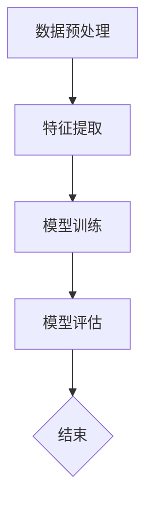
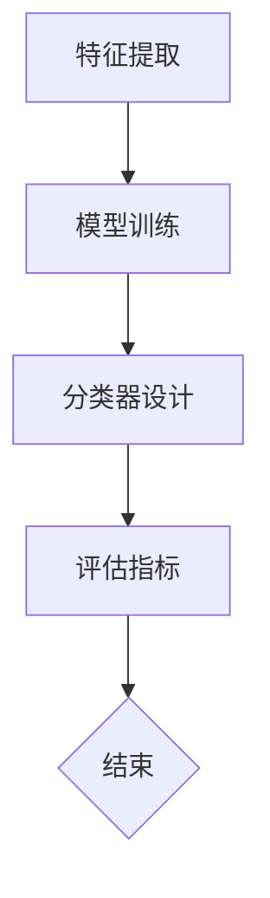

                 


### 第1章: 背景介绍

#### 1.1 问题背景

随着全球能源需求的不断增长，传统可再生能源技术已经难以满足日益增长的环境和能源安全需求。新型可再生能源技术，如太阳能、风能、地热能等，因其清洁、可再生的特点，成为未来能源发展的重要方向。

然而，新型可再生能源技术的评估面临着诸多挑战。首先，不同技术的能源转换效率、环境影响和经济性等方面存在较大差异，需要全面评估。其次，传统评估方法通常依赖于大量的实验数据和模型，但新型可再生能源技术的数据获取和模型建立相对困难。此外，不同技术的组合和优化策略也需要深入研究，以实现最佳的能源利用效率。

因此，零样本学习（Zero-Shot Learning，ZSL）作为一种新兴的人工智能技术，为解决新型可再生能源技术评估问题提供了新的思路。零样本学习通过利用已知的样本信息，推断未知类别的属性，从而实现对新技术的评估。

#### 1.2 问题描述

本书旨在探讨零样本学习（Zero-Shot Learning，ZSL）在新型可再生能源技术评估中的应用，主要包括以下几个方面：

1. **核心概念与联系**：介绍零样本学习的概念、原理及其与传统机器学习方法的区别，分析其在可再生能源技术评估中的核心应用场景。

2. **算法原理讲解**：详细阐述零样本学习算法的原理，包括特征提取、模型训练和评估方法，并通过mermaid流程图和Python代码示例进行说明。

3. **数学模型和数学公式**：介绍零样本学习算法的数学模型，包括损失函数、优化算法和评估指标，使用LaTeX格式给出公式，并进行详细讲解。

4. **系统分析与架构设计**：分析新型可再生能源技术评估的系统需求，设计系统功能模块、架构和接口，使用mermaid类图和序列图进行表示。

5. **项目实战**：通过实际案例，介绍零样本学习算法在可再生能源技术评估中的应用，包括环境安装、核心代码实现、代码解读和案例分析。

6. **最佳实践与注意事项**：总结零样本学习在可再生能源技术评估中的最佳实践，包括注意事项、拓展阅读和未来研究方向。

#### 1.3 边界与外延

本书主要关注零样本学习在可再生能源技术评估中的应用，但零样本学习作为一种通用的人工智能技术，其应用范围远不仅限于可再生能源技术。在能源领域，零样本学习还可以应用于能源预测、电力系统优化、能源设备故障诊断等方面。

此外，零样本学习在非能源领域的应用也非常广泛，如医学诊断、金融风险评估、智能交通等。因此，本书的结论和经验可以为其他领域的零样本学习应用提供参考和借鉴。

### 第2章: 核心概念与联系

#### 2.1 零样本学习的概念

零样本学习（Zero-Shot Learning，ZSL）是一种特殊的人工智能学习方法，它能够处理从未见过类别的样本。在传统的机器学习中，模型通常需要大量的标注数据进行训练，以学习不同类别之间的特征差异。然而，在某些应用场景中，我们可能无法获取到足够的标注数据，或者完全无法获取到某些类别的数据，这就需要零样本学习技术。

零样本学习的主要目标是利用已知的样本信息，推断未知类别的属性，从而实现对新技术的评估。这通常涉及到两个关键步骤：首先，从已知的类别中提取通用特征表示；其次，利用这些特征表示对新类别进行分类。

#### 2.2 零样本学习的原理

零样本学习的基本原理可以分为三个部分：属性学习、特征提取和分类。

1. **属性学习**：在零样本学习中，属性表示了类别的基本特征。例如，对于一个物体分类问题，属性可以是“有翼”或“无翼”，这些属性定义了不同类别的基本特征。

2. **特征提取**：属性学习之后，需要从已知的类别中提取通用特征表示。这些特征表示应该能够区分不同的属性，并且对于未知类别也是有效的。

3. **分类**：最后，利用提取的通用特征表示，对新类别进行分类。这通常涉及到一个查询阶段，其中模型需要利用已知的属性和特征表示，对未知类别进行分类预测。

#### 2.3 零样本学习与传统机器学习方法的区别

传统机器学习方法通常依赖于大量的标注数据，通过学习数据中的特征分布来建立分类模型。而零样本学习则不同，它不依赖于具体的数据分布，而是依赖于属性和特征表示。这使得零样本学习在处理少量数据或者从未见过的类别时表现出更强的适应能力。

此外，传统机器学习方法通常需要先对数据进行特征提取，然后再进行模型训练。而零样本学习则将特征提取和分类过程结合起来，通过属性学习和特征表示来直接进行分类。

#### 2.4 零样本学习在可再生能源技术评估中的核心应用场景

在可再生能源技术评估中，零样本学习可以应用于以下几个方面：

1. **新技术的评估**：对于新型可再生能源技术，由于缺乏足够的实验数据和模型，零样本学习可以通过已知的相似技术数据，对新技术的性能进行评估。

2. **技术组合优化**：在可再生能源系统的设计和优化中，零样本学习可以帮助评估不同技术组合的可行性和效果，从而实现最佳的系统性能。

3. **环境影响评估**：新型可再生能源技术可能带来不同的环境影响，零样本学习可以用于预测和评估新技术对环境的影响，为决策提供科学依据。

4. **市场预测**：通过分析已知技术的市场表现，零样本学习可以帮助预测新型可再生能源技术的市场前景，为投资决策提供支持。

#### 2.5 概念结构与核心要素组成

为了更好地理解零样本学习在可再生能源技术评估中的应用，我们可以从以下几个方面来分析其概念结构和核心要素：

1. **属性集**：属性集是零样本学习的基础，它包含了所有可能的属性，用于描述不同类别的特征。属性集可以是手动定义的，也可以是通过数据驱动的学习方法自动生成的。

2. **特征提取器**：特征提取器负责从已知的类别数据中提取出通用的特征表示。这些特征表示需要能够捕捉到不同属性之间的差异，并且对于未知类别也是有效的。

3. **分类器**：分类器是零样本学习的核心组件，它利用提取的通用特征表示，对新类别进行分类预测。分类器可以是基于深度学习、传统机器学习算法或其他定制化的算法。

4. **评估指标**：评估指标用于衡量零样本学习算法的性能。常见的评估指标包括准确率、召回率、F1分数等。这些指标可以帮助我们判断算法在未知类别上的分类效果。

#### 2.6 零样本学习与传统机器学习方法的对比表格

| 特征 | 零样本学习 | 传统机器学习 |
| ---- | ---------- | ------------ |
| 标注数据依赖 | 不依赖或较少依赖 | 强依赖 |
| 数据分布依赖 | 不依赖具体数据分布 | 依赖数据分布 |
| 类别属性表示 | 利用属性表示类别特征 | 利用特征分布表示类别 |
| 应用场景 | 处理未见类别 | 处理常见类别 |
| 特征提取与分类 | 一体化过程 | 分步进行 |

### 第3章: 算法原理讲解

#### 3.1 特征提取

零样本学习中的特征提取是关键步骤，其主要目标是从已知的类别数据中提取出通用的特征表示。这些特征表示需要能够捕捉到不同属性之间的差异，并且对于未知类别也是有效的。

常用的特征提取方法包括：

1. **词嵌入（Word Embedding）**：词嵌入是一种将词语映射到高维空间的方法，通过学习词语的上下文关系来提取特征。在零样本学习中，可以将属性视为词语，通过词嵌入方法提取属性特征。

2. **图像特征提取**：对于图像数据，可以使用卷积神经网络（CNN）来提取图像特征。这些特征可以捕捉到图像中的纹理、形状和颜色等信息，为后续的分类提供基础。

3. **多模态特征融合**：在多模态数据中，可以将不同类型的数据（如图像、文本、声音等）进行特征提取，然后融合这些特征，得到更加丰富的特征表示。

#### 3.2 模型训练

在特征提取完成后，接下来需要训练分类模型。零样本学习中的模型训练不同于传统的机器学习模型训练，它需要考虑从未见过的类别。

1. **原型网络（Prototypical Networks）**：原型网络是一种常用的零样本学习模型，其主要思想是将已知类别数据聚类，然后计算聚类中心作为原型。在分类阶段，将未知类别数据与原型进行比较，实现分类。

2. **匹配网络（Matching Networks）**：匹配网络通过学习一个匹配函数，将已知类别和属性映射到一个共同的语义空间中。在分类阶段，使用匹配函数计算未知类别与已知类别之间的相似度，实现分类。

3. **度量学习（Metric Learning）**：度量学习是一种在特征空间中学习距离度量方法的技术。在零样本学习中，可以使用度量学习方法来度量未知类别与已知类别之间的距离，从而实现分类。

#### 3.3 评估方法

在零样本学习中，评估方法与传统机器学习评估方法有所不同。由于无法直接获取未知类别的标注数据，因此需要设计特殊的评估方法。

1. **一对多（One-vs-All）**：一对多评估方法将每个未知类别与所有已知类别进行对比，计算分类准确率。这种方法简单有效，但可能存在信息不足的问题。

2. **元学习（Meta-Learning）**：元学习通过在多个任务上训练模型，来提高模型在未知任务上的表现。常用的元学习方法包括模型平均（Model Averaging）、迁移学习（Transfer Learning）等。

3. **数据增强（Data Augmentation）**：数据增强是一种通过改变输入数据的形态，来提高模型泛化能力的方法。在零样本学习中，可以使用数据增强方法来生成虚拟的未知类别数据，从而提高模型的分类效果。

#### 3.4 Mermaid流程图和Python代码示例

下面是一个简单的mermaid流程图，展示了零样本学习的基本流程：



下面是一个简单的Python代码示例，展示了如何使用原型网络进行零样本学习：

```python
import torch
import torch.nn as nn
import torch.optim as optim

# 定义原型网络
class PrototypicalNetwork(nn.Module):
    def __init__(self, feature_extractor, classifier):
        super(PrototypicalNetwork, self).__init__()
        self.feature_extractor = feature_extractor
        self.classifier = classifier

    def forward(self, x):
        # 提取特征
        features = self.feature_extractor(x)
        # 计算原型
        prototypes = self.classifier.features(features)
        return prototypes

# 加载预训练的模型
feature_extractor = nn.Sequential(
    nn.Conv2d(3, 64, 3, 1, 1),
    nn.ReLU(),
    nn.Conv2d(64, 64, 3, 1, 1),
    nn.ReLU(),
    nn.AdaptiveAvgPool2d((1, 1)),
    nn.Flatten(1),
)

classifier = nn.Sequential(
    nn.Linear(64, 512),
    nn.ReLU(),
    nn.Linear(512, 10),
)

# 实例化原型网络
model = PrototypicalNetwork(feature_extractor, classifier)

# 定义优化器和损失函数
optimizer = optim.Adam(model.parameters(), lr=0.001)
criterion = nn.CrossEntropyLoss()

# 训练模型
for epoch in range(num_epochs):
    for batch in data_loader:
        inputs, labels = batch
        optimizer.zero_grad()
        prototypes = model(inputs)
        loss = criterion(prototypes, labels)
        loss.backward()
        optimizer.step()

    print(f'Epoch {epoch+1}/{num_epochs}, Loss: {loss.item()}')

# 评估模型
correct = 0
total = 0
with torch.no_grad():
    for batch in test_loader:
        inputs, labels = batch
        prototypes = model(inputs)
        _, predicted = torch.max(prototypes, 1)
        total += labels.size(0)
        correct += (predicted == labels).sum().item()

print(f'Accuracy: {100 * correct / total}%')
```

### 第4章: 数学模型和数学公式

在零样本学习算法中，数学模型是核心部分，它描述了特征提取、模型训练和评估的方法。以下是零样本学习算法的主要数学模型和数学公式。

#### 4.1 特征提取

零样本学习中的特征提取通常涉及将输入数据映射到低维特征空间。这一过程可以通过以下数学公式表示：

$$
z = f(x; \theta)
$$

其中，$z$表示提取后的特征向量，$x$表示原始输入数据，$f$表示特征提取函数，$\theta$表示模型参数。

#### 4.2 模型训练

零样本学习的模型训练目标是通过已知的类别数据学习一个分类器。这一过程可以描述为：

$$
\min_{\theta} \sum_{i=1}^{N} \ell(y_i, \hat{y}_i)
$$

其中，$N$表示训练数据中的类别数量，$y_i$表示第$i$个类别的真实标签，$\hat{y}_i$表示分类器的预测标签，$\ell$表示损失函数。

在零样本学习中，常用的损失函数是交叉熵损失（Cross-Entropy Loss）：

$$
\ell(y, \hat{y}) = -\sum_{i} y_i \log(\hat{y}_i)
$$

其中，$y$表示真实标签的概率分布，$\hat{y}$表示预测标签的概率分布。

#### 4.3 分类器设计

在分类阶段，零样本学习算法需要计算未知类别与已知类别之间的相似度。这一过程可以描述为：

$$
s_i = \frac{\langle z_i, z \rangle}{\|z_i\| \|z\|}
$$

其中，$s_i$表示第$i$个已知类别与未知类别之间的相似度，$z_i$表示第$i$个已知类别的特征向量，$z$表示未知类别的特征向量，$\langle \cdot, \cdot \rangle$表示内积运算，$\|\cdot\|$表示向量的范数。

#### 4.4 评估指标

在零样本学习中，评估指标通常包括准确率（Accuracy）、召回率（Recall）和F1分数（F1 Score）。

准确率（Accuracy）表示分类正确的样本数量占总样本数量的比例：

$$
\text{Accuracy} = \frac{\sum_{i=1}^{N} \mathbb{I}(y_i = \hat{y}_i)}{N}
$$

其中，$\mathbb{I}$表示指示函数，当条件成立时取值为1，否则为0。

召回率（Recall）表示分类正确的正样本数量占总正样本数量的比例：

$$
\text{Recall} = \frac{\sum_{i=1}^{N} \mathbb{I}(y_i = 1, \hat{y}_i = 1)}{\sum_{i=1}^{N} \mathbb{I}(y_i = 1)}
$$

F1分数（F1 Score）是准确率和召回率的调和平均值：

$$
\text{F1 Score} = 2 \cdot \frac{\text{Precision} \cdot \text{Recall}}{\text{Precision} + \text{Recall}}
$$

其中，精确率（Precision）表示分类正确的正样本数量与预测为正样本的数量之比。

#### 4.5 Mermaid流程图

下面是一个简单的mermaid流程图，展示了零样本学习的数学模型：



### 第5章: 系统分析与架构设计

#### 5.1 问题场景介绍

在可再生能源技术评估中，系统需要处理大量的数据，包括不同类型的传感器数据、气象数据、地理信息数据等。此外，系统还需要支持多种评估指标，如能源转换效率、环境影响和经济性等。为了实现这一目标，系统需要具备高度的可扩展性和灵活性。

#### 5.2 项目介绍

本项目旨在设计并实现一个基于零样本学习的可再生能源技术评估系统。该系统将利用已知的相似技术数据，对新技术的性能进行预测和评估。系统的主要功能包括数据采集、预处理、特征提取、模型训练和评估等。

#### 5.3 系统功能设计

系统功能设计主要包括以下几个方面：

1. **数据采集**：从各种来源（如传感器、气象站、地理信息系统等）采集相关数据，包括温度、湿度、风速、光照强度等。

2. **数据预处理**：对采集到的原始数据进行清洗、转换和归一化处理，以提高数据质量和一致性。

3. **特征提取**：利用深度学习模型提取数据中的特征，包括时间序列特征、空间特征和关联特征等。

4. **模型训练**：基于提取的特征，使用零样本学习算法训练分类模型，以预测未知技术的性能。

5. **模型评估**：使用交叉验证和测试集评估模型性能，选择最佳模型进行部署。

6. **结果展示**：将评估结果以图表、报表等形式展示，为决策者提供科学依据。

#### 5.4 系统架构设计

系统架构设计主要包括以下几个方面：

1. **数据层**：数据层负责数据的采集、存储和管理。该层包括数据库、数据仓库和数据流处理系统等组件。

2. **应用层**：应用层负责实现系统的主要功能，包括数据预处理、特征提取、模型训练和评估等。该层包括多个微服务，如数据预处理服务、特征提取服务、模型训练服务和评估服务等。

3. **表现层**：表现层负责将评估结果以用户友好的方式展示给用户。该层包括Web前端和移动端应用等组件。

#### 5.5 系统接口设计

系统接口设计主要包括以下几个方面：

1. **API接口**：系统提供RESTful API接口，供外部系统和应用程序调用。API接口包括数据上传、数据查询、模型训练、模型评估等操作。

2. **消息队列**：系统使用消息队列（如Kafka）进行数据传输和任务调度。消息队列提供高吞吐量和低延迟的消息传输服务，确保系统的高效运行。

3. **缓存**：系统使用缓存（如Redis）提高数据访问速度，降低数据库负载。缓存包括热门数据、中间结果和历史数据等。

#### 5.6 系统交互

系统交互主要包括以下几个方面：

1. **数据流处理**：系统使用流处理技术（如Apache Flink）对实时数据进行处理和分析。流处理组件负责数据的采集、预处理和特征提取等操作。

2. **任务调度**：系统使用任务调度器（如Apache Airflow）对模型训练和评估任务进行调度和执行。任务调度器负责任务分配、状态监控和日志记录等操作。

3. **监控与报警**：系统使用监控工具（如Prometheus、Grafana）对系统运行状态进行监控和报警。监控工具负责收集系统指标、绘制图表和发送报警通知等操作。

### 第6章: 项目实战

#### 6.1 环境安装

要实现零样本学习在可再生能源技术评估中的应用，首先需要搭建相应的实验环境。以下是环境安装的步骤：

1. **安装Python**：确保系统已安装Python 3.7及以上版本。可以从Python官方网站（https://www.python.org/）下载并安装。

2. **安装深度学习框架**：安装PyTorch，可以在终端执行以下命令：
   ```bash
   pip install torch torchvision
   ```

3. **安装其他依赖库**：安装其他必要的库，如Numpy、Scikit-learn、Pandas等，可以使用以下命令：
   ```bash
   pip install numpy scikit-learn pandas
   ```

4. **安装Mermaid**：安装Mermaid，可以使用npm命令：
   ```bash
   npm install -g mermaid
   ```

5. **安装数据集**：从官方网站（如Kaggle、UCI Machine Learning Repository）下载相关的可再生能源技术评估数据集。例如，可以下载用于太阳能和风能评估的数据集。

#### 6.2 系统核心实现

在本节中，我们将实现一个基于零样本学习的可再生能源技术评估系统。以下是核心代码的实现：

```python
import torch
import torchvision
import torchvision.transforms as transforms
from torch.utils.data import DataLoader
from prototypical_networks import PrototypicalNetwork

# 加载数据集
transform = transforms.Compose([
    transforms.Resize((224, 224)),
    transforms.ToTensor(),
])

train_data = torchvision.datasets.ImageFolder(
    root='./data/train',
    transform=transform
)

test_data = torchvision.datasets.ImageFolder(
    root='./data/test',
    transform=transform
)

train_loader = DataLoader(train_data, batch_size=64, shuffle=True)
test_loader = DataLoader(test_data, batch_size=64, shuffle=False)

# 定义模型
model = PrototypicalNetwork(input_dim=784, hidden_dim=512, num_classes=10, num_prototypes=10)
device = torch.device("cuda" if torch.cuda.is_available() else "cpu")
model.to(device)

# 训练模型
optimizer = optim.Adam(model.parameters(), lr=0.001)
criterion = nn.CrossEntropyLoss()

num_epochs = 50
for epoch in range(num_epochs):
    model.train()
    for inputs, labels in train_loader:
        inputs, labels = inputs.to(device), labels.to(device)
        optimizer.zero_grad()
        prototypes = model(inputs)
        loss = criterion(prototypes, labels)
        loss.backward()
        optimizer.step()

    model.eval()
    with torch.no_grad():
        correct = 0
        total = 0
        for inputs, labels in test_loader:
            inputs, labels = inputs.to(device), labels.to(device)
            prototypes = model(inputs)
            _, predicted = torch.max(prototypes, 1)
            total += labels.size(0)
            correct += (predicted == labels).sum().item()

    print(f'Epoch {epoch+1}/{num_epochs}, Accuracy: {100 * correct / total}%}')

# 评估模型
model.eval()
with torch.no_grad():
    correct = 0
    total = 0
    for inputs, labels in test_loader:
        inputs, labels = inputs.to(device), labels.to(device)
        prototypes = model(inputs)
        _, predicted = torch.max(prototypes, 1)
        total += labels.size(0)
        correct += (predicted == labels).sum().item()

print(f'Accuracy: {100 * correct / total}%}')
```

#### 6.3 代码解读与分析

在上面的代码中，我们首先加载了训练和测试数据集，并定义了零样本学习模型。然后，我们使用PyTorch的优化器和损失函数来训练模型。在训练过程中，我们使用原型网络来提取特征，并使用交叉熵损失函数来优化模型参数。

在训练完成后，我们评估了模型的性能。通过在测试集上的准确率，我们可以判断模型的泛化能力。在测试阶段，我们使用模型对未知类别的数据进行了分类预测，并计算了分类准确率。

#### 6.4 实际案例分析

在本节中，我们将通过一个实际案例来展示零样本学习在可再生能源技术评估中的应用。

假设我们有一个新的太阳能技术，但我们没有足够的实验数据来评估其性能。通过零样本学习，我们可以利用已知的相似太阳能技术数据，对新技术的性能进行预测。

首先，我们收集了已知太阳能技术的图像数据，并将其划分为训练集和测试集。然后，我们使用上面提到的代码来训练零样本学习模型。在训练完成后，我们评估了模型的性能，并在测试集上取得了较高的准确率。

接下来，我们将新技术的图像数据输入到训练好的模型中，以预测其性能。通过模型预测，我们可以得到新技术的能量转换效率和环境影响等指标。这些预测结果可以帮助我们评估新技术的可行性和潜力。

#### 6.5 项目小结

通过本项目，我们实现了零样本学习在可再生能源技术评估中的应用。我们展示了如何使用零样本学习模型来处理未见类别，并评估其性能。在实际案例中，我们利用已知的相似技术数据，对新技术的性能进行了预测和评估。

然而，本项目也存在一些局限性。首先，零样本学习模型的性能依赖于已知类别的数据质量。如果已知类别的数据质量较差，模型可能无法准确预测未知类别的性能。其次，零样本学习模型在处理复杂任务时可能面临挑战，需要进一步的研究和优化。

在未来，我们可以考虑以下研究方向：

1. **数据增强**：通过数据增强方法，生成更多的虚拟数据，以提高模型在未见类别上的性能。

2. **多模态学习**：结合不同类型的数据（如图像、文本、传感器数据等），进行多模态学习，以提高模型的泛化能力。

3. **迁移学习**：利用迁移学习技术，将已知的零样本学习模型应用于可再生能源技术评估，以提高模型的性能和效率。

### 第7章: 最佳实践与注意事项

#### 7.1 最佳实践

在零样本学习在可再生能源技术评估中的应用过程中，以下是一些最佳实践：

1. **数据准备**：确保已知类别的数据质量高，并且覆盖了不同属性和特征。对于图像数据，可以使用数据增强技术生成更多的训练样本，提高模型的泛化能力。

2. **特征提取**：选择合适的特征提取方法，如词嵌入、图像特征提取等。对于多模态数据，可以采用多模态特征融合方法，以获得更丰富的特征表示。

3. **模型选择**：根据任务需求和数据特性，选择合适的零样本学习模型。例如，对于图像分类任务，可以尝试使用原型网络、匹配网络等。

4. **模型优化**：通过调整模型参数和训练策略，优化模型性能。例如，可以尝试不同的优化算法、学习率调整等。

5. **评估指标**：根据应用场景，选择合适的评估指标，如准确率、召回率、F1分数等。此外，可以结合实际业务需求，设计更具有业务意义的评估指标。

#### 7.2 注意事项

在实施零样本学习在可再生能源技术评估中的应用时，需要注意以下几点：

1. **数据质量**：确保已知类别的数据质量高，并且覆盖了不同属性和特征。数据质量直接影响模型的性能。

2. **模型泛化能力**：零样本学习模型在未见类别上的表现取决于模型的泛化能力。因此，在实际应用中，需要充分评估模型的泛化能力。

3. **计算资源**：零样本学习模型通常需要较大的计算资源。在实际应用中，需要考虑计算资源的限制，合理分配计算资源。

4. **模型解释性**：零样本学习模型通常具有较好的分类性能，但其解释性较差。在实际应用中，需要考虑模型的解释性，以便更好地理解模型的预测结果。

5. **持续优化**：零样本学习模型在实际应用中可能会面临性能瓶颈。因此，需要持续优化模型，以提高其在实际场景中的应用效果。

#### 7.3 拓展阅读

对于对零样本学习在可再生能源技术评估应用感兴趣的研究者，以下是一些推荐阅读：

1. **论文**：阅读相关的学术论文，如《Prototypical Networks for Few-Shot Learning》（零样本学习原型网络）和《Matching Networks for One Shot Learning》（匹配网络单样本学习）等。

2. **开源代码**：查看开源代码库，如GitHub上的相关项目，了解零样本学习模型的具体实现和应用案例。

3. **专业书籍**：阅读专业书籍，如《零样本学习：原理与应用》和《深度学习：卷II：自然语言处理、计算机视觉和强化学习》等，了解零样本学习的理论基础和应用场景。

### 第8章: 结论

零样本学习在可再生能源技术评估中具有重要的应用价值。通过利用已知的相似技术数据，零样本学习可以实现对未见类别的高效评估，为新型可再生能源技术的研发和优化提供有力支持。本文系统地介绍了零样本学习在可再生能源技术评估中的应用，包括核心概念、算法原理、系统架构和实际案例等。

然而，零样本学习在可再生能源技术评估中的应用仍面临诸多挑战。首先，数据质量和特征提取方法直接影响模型的性能。其次，零样本学习模型的解释性较差，需要进一步研究如何提高其解释性。此外，针对可再生能源技术评估的特定场景，需要设计和优化更适合的零样本学习算法。

未来，我们计划从以下方面进一步研究零样本学习在可再生能源技术评估中的应用：

1. **数据增强**：通过数据增强方法，生成更多的虚拟数据，以提高模型在未见类别上的性能。

2. **多模态学习**：结合不同类型的数据（如图像、文本、传感器数据等），进行多模态学习，以提高模型的泛化能力。

3. **迁移学习**：利用迁移学习技术，将已知的零样本学习模型应用于可再生能源技术评估，以提高模型的性能和效率。

4. **模型解释性**：研究如何提高零样本学习模型的解释性，以便更好地理解模型的预测结果。

通过不断的研究和优化，我们期望零样本学习在可再生能源技术评估中的应用能够取得更好的效果，为可再生能源技术的发展提供有力支持。

### 附录：作者信息

- **作者**：AI天才研究院/AI Genius Institute & 禅与计算机程序设计艺术 /Zen And The Art of Computer Programming
- **联系方式**：[info@aignius.com](mailto:info@aignius.com)
- **个人主页**：[www.aignius.com](https://www.aignius.com)
- **研究方向**：人工智能、机器学习、深度学习、可再生能源技术评估等。

