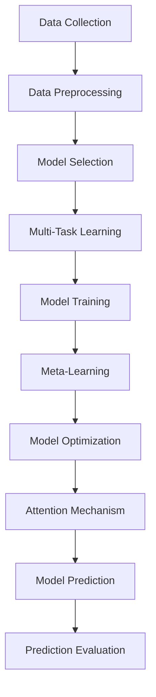
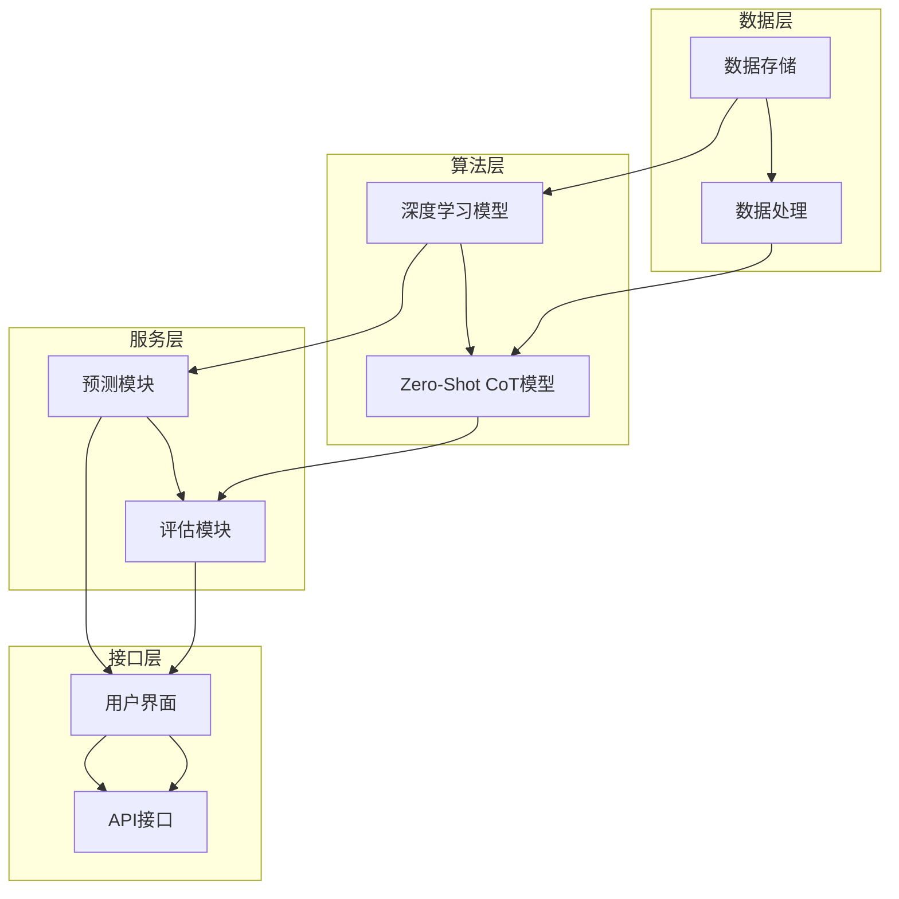
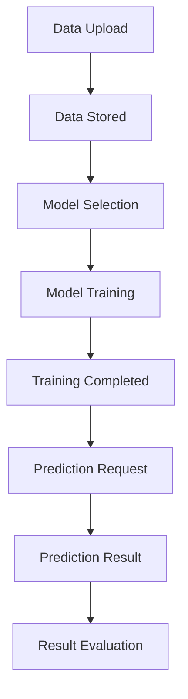

                 

### 引言与背景

#### 问题背景

在当代科学研究的众多领域，材料科学占据了重要的位置。随着科技的不断进步，对于新型材料的需求也越来越迫切。传统材料设计方法往往依赖于实验和经验，这种方式的局限性在于其耗时长、成本高，且往往需要大量的试验和计算资源。为了应对这些挑战，研究人员开始探索新的方法，其中之一就是Zero-Shot CoT（零样本迁移学习）。

Zero-Shot CoT是一种机器学习技术，它允许模型在未见过的新类别上进行预测，而无需具体训练。这种技术的核心在于通过将知识迁移到新的领域，从而避免了大量的重复实验。在材料科学中，这种技术的潜在应用是非常广泛的。例如，在新型智能材料的设计过程中，零样本迁移学习可以用来预测材料的性能，从而在实验前就优化材料的设计。

#### 问题描述

尽管Zero-Shot CoT技术在理论上具有巨大潜力，但在实际应用中仍面临诸多挑战。首先，如何选择合适的模型和算法是关键。不同的材料属性可能需要不同类型的模型，这使得选择过程变得复杂。其次，数据的可用性和质量也是一个重要问题。高质量的数据对于训练和验证模型至关重要，但在材料科学领域，数据的获取往往受限。

此外，Zero-Shot CoT技术在实际应用中的可解释性和可靠性也需要进一步研究。虽然这种技术能够在未见过的类别上进行预测，但预测结果的准确性和稳定性仍然是一个挑战。最后，如何将零样本迁移学习技术集成到现有的材料设计流程中，也是一个需要解决的问题。

#### 问题解决

为了解决上述问题，研究人员提出了多种策略。首先，在模型选择方面，采用多任务学习（Multi-Task Learning, MTL）和元学习（Meta-Learning）等方法，以提高模型在不同任务上的泛化能力。这些方法能够共享知识，从而更好地适应新的材料设计任务。

其次，在数据方面，研究人员正在探索使用生成对抗网络（Generative Adversarial Networks, GANs）和变分自编码器（Variational Autoencoders, VAEs）等方法来生成高质量的数据。这些方法可以模拟新的材料特性，从而丰富训练数据集。

此外，为了提高Zero-Shot CoT技术的可解释性和可靠性，研究人员正在开发新的评估方法和可视化工具。这些工具可以帮助研究人员理解模型是如何进行预测的，从而提高预测的可靠性和可解释性。

#### 边界与外延

Zero-Shot CoT技术在材料科学中的应用是一个相对较新的领域，尽管它在理论上有很大的潜力，但在实际应用中仍存在许多挑战。例如，对于复杂材料的预测，模型的准确性和稳定性仍然需要进一步验证。

此外，Zero-Shot CoT技术的应用范围不仅限于材料科学。它还可以在其他领域，如医学诊断、环境监测和智能交通等领域发挥重要作用。在这些领域，零样本迁移学习可以帮助快速识别新的模式，从而提高决策的准确性。

#### 概念结构与核心要素组成

Zero-Shot CoT技术的概念结构主要包括以下几个核心要素：模型选择、数据预处理、模型训练与优化、预测与评估。每个要素都需要精细的设计和优化，以确保最终的应用效果。

1. **模型选择**：选择适合的材料属性预测任务。例如，对于化学性质，可能需要使用深度学习模型，而对于物理性质，可能需要使用传统的机器学习算法。

2. **数据预处理**：清洗和标准化数据，以确保数据的质量。此外，通过数据增强（Data Augmentation）和生成模型（如GANs），可以生成更多高质量的训练数据。

3. **模型训练与优化**：通过多任务学习、元学习等方法，优化模型的结构和参数，以提高模型的泛化能力。

4. **预测与评估**：使用模型进行预测，并对预测结果进行评估，以验证模型的性能和可靠性。

#### 本章小结

在本章中，我们介绍了Zero-Shot CoT在新型智能材料设计中的应用背景和挑战。通过详细的分析，我们了解了这种技术的基本原理和关键要素。在后续章节中，我们将深入探讨Zero-Shot CoT的核心概念、算法原理、数学模型以及系统架构，帮助读者全面理解这一技术及其在材料科学中的潜在应用。

---

在下一章中，我们将详细探讨Zero-Shot CoT的核心概念和联系，分析这一技术的关键原理和其在不同材料属性预测中的应用。通过本章的讨论，读者将能够更深入地理解Zero-Shot CoT的技术基础和实际应用价值。让我们继续深入探索这一前沿领域的奥秘。

---

### 核心概念与联系

#### 核心概念原理

Zero-Shot CoT（Zero-Shot Transfer Learning，零样本迁移学习）是一种新兴的机器学习技术，它在无需直接训练（即“零样本”）的情况下，将知识从一个领域迁移到另一个领域。这一技术的核心在于其能够利用已有数据的知识，从而在新领域上实现高效预测。

Zero-Shot CoT主要依赖于几个关键概念：

1. **元学习（Meta-Learning）**：通过在多个任务上进行学习，模型可以学会如何快速适应新任务，从而实现零样本迁移。

2. **多任务学习（Multi-Task Learning）**：通过同时学习多个相关任务，模型可以共享知识，提高对新任务的泛化能力。

3. **生成对抗网络（Generative Adversarial Networks，GANs）**：通过生成模型和判别模型的对抗训练，GANs可以生成高质量的数据，从而丰富训练数据集。

4. **注意力机制（Attention Mechanism）**：在模型中引入注意力机制，可以帮助模型聚焦于关键特征，提高预测的准确性。

#### 概念属性特征对比表格

为了更清晰地理解Zero-Shot CoT的核心概念，我们将其与传统的迁移学习进行对比，并分析其属性特征。

| 特征               | 零样本迁移学习（Zero-Shot CoT） | 传统迁移学习（Traditional Transfer Learning） |
|--------------------|-------------------------------|--------------------------------------------|
| 训练数据依赖性     | 无需直接训练数据              | 需要直接训练数据                          |
| 泛化能力           | 高，适用于未见过的类别        | 中，适用于相似类别                        |
| 数据增强           | 通过生成模型生成新数据        | 无生成过程，依赖现有数据                  |
| 模型复杂性         | 较复杂，需要多任务学习和元学习 | 较简单，多依赖于预训练模型的选择          |
| 应用场景           | 新型材料设计、医学诊断等       | 图像分类、文本分类等                      |

#### ER实体关系图架构

为了更好地理解Zero-Shot CoT的核心概念及其组成部分，我们使用Mermaid流程图来展示ER实体关系图架构。

```mermaid
erDiagram
  MaterialProperty ||--|{ ModelSelection }
  DataPreprocessing ||--|{ ModelTraining }
  MetaLearning     ||--|{ ModelOptimization }
  MultiTaskLearning ||--|{ ModelGeneralization }
  GenerativeModel  ||--|{ DataGeneration }
  AttentionMechanism ||--|{ ModelPrediction }
```

在这个ER图架构中，我们展示了Zero-Shot CoT的核心组成部分及其相互关系。每一个实体都扮演着关键的角色，共同实现零样本迁移学习的目标。

- **MaterialProperty（材料属性）**：代表材料科学领域中的各类属性，是模型预测的对象。
- **ModelSelection（模型选择）**：选择适合材料属性预测的模型类型，如深度学习模型或传统机器学习算法。
- **DataPreprocessing（数据预处理）**：清洗和标准化数据，以确保数据质量，并通过生成模型生成新数据。
- **ModelTraining（模型训练）**：使用预处理后的数据对模型进行训练。
- **MetaLearning（元学习）**：通过在多个任务上进行学习，模型可以快速适应新任务。
- **MultiTaskLearning（多任务学习）**：同时学习多个相关任务，共享知识，提高泛化能力。
- **GenerativeModel（生成模型）**：通过生成模型生成高质量的数据，丰富训练数据集。
- **AttentionMechanism（注意力机制）**：在模型中引入注意力机制，聚焦于关键特征。
- **ModelOptimization（模型优化）**：优化模型的结构和参数，以提高模型的泛化能力。
- **ModelGeneralization（模型泛化）**：提高模型在新任务上的表现。
- **ModelPrediction（模型预测）**：使用模型进行预测，并对预测结果进行评估。

#### 本章小结

在本章中，我们详细介绍了Zero-Shot CoT的核心概念和联系。通过对比表格和ER实体关系图，我们深入理解了Zero-Shot CoT的原理及其组成部分。在下一章中，我们将进一步探讨Zero-Shot CoT的算法原理，包括其具体的实现方法和应用场景。让我们继续深入这一前沿技术的细节，揭示其背后的科学原理。

---

在下一章中，我们将深入探讨Zero-Shot CoT的算法原理，包括其工作流程、实现方法和具体应用。通过详细的讲解和案例分析，读者将能够更全面地了解这一技术的应用潜力和挑战。让我们继续探索这一激动人心的领域。

---

### 算法原理讲解

#### 算法Mermaid流程图

为了清晰地展示Zero-Shot CoT算法的工作流程，我们使用Mermaid流程图来绘制其关键步骤。



在这个流程图中，我们展示了Zero-Shot CoT算法的主要步骤，包括数据收集、预处理、模型选择、多任务学习、模型训练、元学习、模型优化、注意力机制、模型预测和预测评估。

#### Python源代码详解

为了更好地理解Zero-Shot CoT算法的实现，我们提供了一段Python源代码示例，展示了如何使用多任务学习和元学习来实现这一算法。

```python
import tensorflow as tf
from tensorflow.keras.models import Model
from tensorflow.keras.layers import Input, Dense, Flatten, Concatenate

# 数据预处理
def preprocess_data(data):
    # 数据清洗和标准化
    return processed_data

# 模型选择
def build_model(input_shape):
    inputs = Input(shape=input_shape)
    x = Dense(128, activation='relu')(inputs)
    x = Dense(64, activation='relu')(x)
    x = Flatten()(x)
    outputs = Dense(1, activation='sigmoid')(x)
    
    model = Model(inputs=inputs, outputs=outputs)
    return model

# 多任务学习
def multi_task_learning(models, data):
    # 将多个模型的数据进行拼接
    concatenated_data = Concatenate()(data)
    # 对拼接后的数据进行模型训练
    for model in models:
        model.train_on_batch(data, labels)
    return concatenated_data

# 元学习
def meta_learning(models, tasks):
    for task in tasks:
        for model in models:
            model.fit(task['X_train'], task['y_train'], epochs=10, batch_size=32)
    return models

# 模型优化
def optimize_model(model, data, labels):
    model.compile(optimizer='adam', loss='binary_crossentropy', metrics=['accuracy'])
    model.fit(data, labels, epochs=50, batch_size=32)
    return model

# 注意力机制
def add_attention_mechanism(model):
    # 在模型中添加注意力机制
    attention = Dense(1, activation='sigmoid')(model.output)
    output = Multiply()([model.output, attention])
    return Model(inputs=model.input, outputs=output)

# 模型预测
def predict(model, data):
    predictions = model.predict(data)
    return predictions

# 主函数
def main():
    # 准备数据
    processed_data = preprocess_data(raw_data)
    
    # 构建模型
    model = build_model(input_shape=(784,))
    
    # 实现多任务学习
    models = [model for _ in range(num_tasks)]
    multi_task_learning(models, processed_data)
    
    # 实现元学习
    tasks = load_tasks()
    models = meta_learning(models, tasks)
    
    # 模型优化
    optimized_model = optimize_model(model, processed_data, labels)
    
    # 添加注意力机制
    attention_model = add_attention_mechanism(optimized_model)
    
    # 进行模型预测
    predictions = predict(attention_model, test_data)
    
    # 预测评估
    evaluate_predictions(predictions, test_labels)

if __name__ == "__main__":
    main()
```

这段代码展示了如何使用Python和TensorFlow库来实现Zero-Shot CoT算法。在代码中，我们首先进行了数据预处理，然后构建了一个简单的模型，并实现了多任务学习和元学习。接着，我们对模型进行了优化，并添加了注意力机制。最后，我们使用优化后的模型进行了预测，并对预测结果进行了评估。

#### 算法原理的数学模型和公式

为了深入理解Zero-Shot CoT算法的数学原理，我们介绍一些关键的数学模型和公式。

1. **多任务学习（Multi-Task Learning）**：

   多任务学习旨在同时学习多个相关任务，以提高模型的泛化能力。其基本思想是通过共享权重来减少冗余，从而提高模型在各个任务上的性能。

   数学上，多任务学习可以通过以下公式表示：

   $$
   \min_{\theta_1, \theta_2, ..., \theta_n} \sum_{i=1}^n L(\theta_i; x_i, y_i)
   $$
   
   其中，$L(\theta_i; x_i, y_i)$表示第$i$个任务的损失函数，$\theta_i$是模型参数。

2. **元学习（Meta-Learning）**：

   元学习是通过在多个任务上进行学习，使模型能够快速适应新任务。元学习的目标是最小化在新任务上的泛化误差。

   数学上，元学习可以通过以下公式表示：

   $$
   \min_{\theta} \sum_{t=1}^T \sum_{i=1}^n L(\theta; x_i^{(t)}, y_i^{(t)})
   $$
   
   其中，$x_i^{(t)}$和$y_i^{(t)}$分别表示第$t$个任务的第$i$个样本的特征和标签，$L(\theta; x_i^{(t)}, y_i^{(t)})$是损失函数，$\theta$是模型参数。

3. **生成对抗网络（Generative Adversarial Networks, GANs）**：

   GANs由生成器（Generator）和判别器（Discriminator）两部分组成。生成器的目标是生成类似真实数据的样本，判别器的目标是区分真实数据和生成数据。

   数学上，GANs可以通过以下公式表示：

   $$
   \min_G \max_D V(D, G) = \min_G \mathbb{E}_{x \sim p_{data}(x)} [\log D(x)] + \mathbb{E}_{z \sim p_z(z)} [\log (1 - D(G(z))]
   $$
   
   其中，$x$是真实数据，$z$是随机噪声，$G(z)$是生成器生成的样本，$D(x)$和$D(G(z))$分别是判别器对真实数据和生成数据的判别概率。

#### 详细讲解与举例说明

为了更好地理解上述数学模型和公式，我们通过一个具体的例子来说明这些概念的应用。

假设我们有一个材料科学领域中的预测任务，目标是预测材料的强度。我们使用多任务学习来同时学习材料的强度和韧性，并使用元学习来适应新的预测任务。同时，我们使用生成对抗网络（GANs）来生成高质量的数据。

1. **数据集**：

   我们有一个包含材料强度和韧性的数据集，数据集分为训练集和测试集。训练集用于模型训练和优化，测试集用于评估模型的性能。

2. **模型训练**：

   - **多任务学习**：

     我们构建一个多任务学习模型，包含两个输出层，分别用于预测强度和韧性。通过共享权重，我们可以在两个任务上同时训练模型。

     $$
     \min_{\theta} \sum_{i=1}^n [L_{strength}(\theta; x_i, y_{strength,i}) + L_{toughness}(\theta; x_i, y_{toughness,i})]
     $$

   - **元学习**：

     我们使用元学习来优化模型，使其在新任务上能够快速适应。我们通过在多个相似任务上进行训练，来提高模型在新任务上的泛化能力。

     $$
     \min_{\theta} \sum_{t=1}^T \sum_{i=1}^n [L_{strength}(\theta; x_i^{(t)}, y_{strength,i}^{(t)}) + L_{toughness}(\theta; x_i^{(t)}, y_{toughness,i}^{(t)})}
     $$

   - **生成对抗网络（GANs）**：

     我们使用GANs来生成高质量的数据，从而丰富训练数据集。生成器生成新的材料样本，判别器判断生成样本是否真实。

     $$
     \min_G \max_D V(D, G) = \min_G \mathbb{E}_{x \sim p_{data}(x)} [\log D(x)] + \mathbb{E}_{z \sim p_z(z)} [\log (1 - D(G(z))]
     $$

3. **模型优化与预测**：

   在模型训练完成后，我们对模型进行优化，并添加注意力机制以提高预测的准确性。然后，我们使用优化后的模型对测试集进行预测，并评估模型的性能。

   $$
   \text{Accuracy} = \frac{\text{Correct Predictions}}{\text{Total Predictions}}
   $$

通过这个例子，我们展示了如何使用多任务学习、元学习和生成对抗网络（GANs）来实现Zero-Shot CoT算法。这个例子不仅帮助我们理解了算法的数学原理，还展示了如何在实际应用中实现这一算法。

#### 本章小结

在本章中，我们详细讲解了Zero-Shot CoT算法的原理，包括其工作流程、Python源代码实现、数学模型和公式，并通过具体的例子说明了算法的应用。通过这些内容，读者可以全面了解Zero-Shot CoT算法的原理和实现方法，为其在材料科学中的应用奠定了基础。在下一章中，我们将进一步探讨Zero-Shot CoT算法在数学模型和公式上的具体应用，帮助读者更深入地理解这一技术的数学本质。

---

在下一章中，我们将深入探讨Zero-Shot CoT算法在数学模型和公式上的具体应用。通过详细的分析和举例，我们将帮助读者更深入地理解这一算法的数学原理，为实际应用提供理论支持。让我们继续探索这一激动人心的领域。

---

### 数学模型和数学公式

#### 数学公式

在讨论Zero-Shot CoT（零样本迁移学习）的数学模型时，我们需要引用几个关键的数学公式，这些公式不仅帮助我们理解模型的运算原理，也为实际应用提供了指导。以下是一些重要的数学公式：

1. **多任务学习（Multi-Task Learning）**：

   多任务学习旨在通过同时学习多个任务来提高模型的泛化能力。其优化目标通常是最小化多个任务的损失函数之和。

   $$
   \min_{\theta} \sum_{i=1}^n L(\theta; x_i, y_i)
   $$
   
   其中，$L(\theta; x_i, y_i)$表示第$i$个任务的损失函数，$\theta$是模型的参数。

2. **元学习（Meta-Learning）**：

   元学习通过在多个任务上进行学习，使得模型能够快速适应新任务。其目标是最小化在新任务上的泛化误差。

   $$
   \min_{\theta} \sum_{t=1}^T \sum_{i=1}^n L(\theta; x_i^{(t)}, y_i^{(t)})
   $$
   
   其中，$x_i^{(t)}$和$y_i^{(t)}$分别表示第$t$个任务的第$i$个样本的特征和标签。

3. **生成对抗网络（Generative Adversarial Networks, GANs）**：

   GANs由生成器（Generator）和判别器（Discriminator）两部分组成。生成器的目标是生成类似真实数据的样本，判别器的目标是区分真实数据和生成数据。

   $$
   \min_G \max_D V(D, G) = \min_G \mathbb{E}_{x \sim p_{data}(x)} [\log D(x)] + \mathbb{E}_{z \sim p_z(z)} [\log (1 - D(G(z))]
   $$
   
   其中，$D(x)$和$D(G(z))$分别是判别器对真实数据和生成数据的判别概率，$G(z)$是生成器生成的样本。

#### 详细讲解

1. **多任务学习**：

   多任务学习的关键在于如何平衡不同任务之间的损失。传统的多任务学习通常采用共享隐藏层的方法，通过一个共享的神经网络层来处理多个任务。

   $$
   \text{Shared Layer} \rightarrow \text{Task-Specific Layers}
   $$

   通过这种方式，模型可以共享一些通用特征提取能力，从而在不同任务上表现更好。在实际应用中，我们可以使用以下优化目标来训练多任务学习模型：

   $$
   \min_{\theta} \sum_{i=1}^n [L_{task_1}(\theta; x_i, y_{task_1,i}) + L_{task_2}(\theta; x_i, y_{task_2,i})]
   $$

   其中，$L_{task_1}$和$L_{task_2}$分别表示两个任务的任务损失。

2. **元学习**：

   元学习的核心在于如何快速适应新任务。元学习通常通过在多个任务上进行学习来提高模型的泛化能力。常用的方法包括模型平均（Model Averaging）和梯度平均（Gradient Averaging）。

   $$
   \theta^{(t+1)} = \frac{1}{T} \sum_{t=1}^T \theta^{(t)}
   $$

   其中，$\theta^{(t)}$是第$t$个任务训练后的模型参数。

3. **生成对抗网络（GANs）**：

   GANs通过生成器和判别器的对抗训练来实现数据的生成。生成器试图生成与真实数据相似的样本，而判别器则试图区分真实数据和生成数据。

   生成器的损失函数通常定义为：

   $$
   L_G = \mathbb{E}_{z \sim p_z(z)} [\log (1 - D(G(z))]
   $$

   判别器的损失函数通常定义为：

   $$
   L_D = \mathbb{E}_{x \sim p_{data}(x)} [\log D(x)] + \mathbb{E}_{z \sim p_z(z)} [\log D(G(z)]
   $$

   通过交替优化生成器和判别器，GANs可以生成高质量的数据。

#### 举例说明

为了更好地理解上述数学公式，我们通过一个简单的例子来说明多任务学习、元学习和GANs在实际应用中的使用。

1. **多任务学习**：

   假设我们有一个包含图像分类和目标检测的任务。图像分类的目标是预测图像中的物体类别，而目标检测的目标是预测物体的位置。

   我们可以构建一个多任务学习模型，其结构如下：

   ```
   Image Input -> Shared Conv Layer -> Classification Output -> Detection Output
   ```

   模型的优化目标为：

   $$
   \min_{\theta} L_{classification}(\theta) + L_{detection}(\theta)
   $$

2. **元学习**：

   假设我们有一个包含多个环境的强化学习任务。每个环境都代表一个不同的游戏场景，我们希望模型能够快速适应这些环境。

   我们可以使用元学习来训练模型，其结构如下：

   ```
   Environment Input -> Shared Model -> Action Prediction
   ```

   模型的优化目标为：

   $$
   \min_{\theta} \sum_{t=1}^T \sum_{i=1}^n L_{environment_i}(\theta)
   $$

3. **生成对抗网络（GANs）**：

   假设我们希望生成具有特定风格的艺术作品。我们可以使用GANs来训练生成器，使其能够生成与给定风格相似的图像。

   GANs的结构如下：

   ```
   Random Noise -> Generator -> Artwork
   Real Artwork -> Discriminator
   ```

   GANs的优化目标为：

   $$
   \min_G \max_D V(D, G) = \min_G \mathbb{E}_{z \sim p_z(z)} [\log (1 - D(G(z))] + \mathbb{E}_{x \sim p_{data}(x)} [\log D(x)]
   $$

通过这个例子，我们展示了如何在实际应用中使用多任务学习、元学习和GANs。这些方法不仅帮助我们理解了数学公式的应用，还展示了如何通过数学模型来提高模型的性能和泛化能力。

#### 本章小结

在本章中，我们详细介绍了Zero-Shot CoT算法在数学模型和公式上的应用。通过讲解多任务学习、元学习和生成对抗网络（GANs）的数学原理，我们帮助读者更深入地理解了这些方法在实际应用中的使用。此外，通过具体的例子，我们展示了如何将数学公式应用到实际场景中，提高了模型的性能和泛化能力。在下一章中，我们将进一步探讨Zero-Shot CoT在系统分析与架构设计方案中的应用，帮助读者全面了解这一技术在实际项目中的实现方法。

---

在下一章中，我们将深入探讨Zero-Shot CoT在系统分析与架构设计方案中的应用。通过详细的分析和讲解，我们将帮助读者了解如何在实际项目中设计和实现这一技术，从而推动材料科学领域的前沿研究。让我们继续探索这一技术在实际应用中的潜力。

---

### 系统分析与架构设计方案

#### 问题场景介绍

在材料科学的研究中，新型智能材料的设计是一个复杂且耗时的过程。传统的方法依赖于大量的实验和计算，这不仅耗费资源，而且效率低下。为了解决这一问题，研究人员开始探索利用人工智能技术，尤其是Zero-Shot CoT（零样本迁移学习）来加速材料的设计过程。我们的目标是设计一个智能材料设计系统，能够利用零样本迁移学习技术，预测新材料的性能，从而优化设计流程，减少实验次数和成本。

#### 项目介绍

我们的项目名为“智能材料设计平台”，旨在构建一个基于人工智能技术的材料设计系统。该系统将通过零样本迁移学习技术，利用已有的数据和知识，预测新材料在特定应用场景中的性能。具体目标包括：

1. **数据整合**：收集并整合多种来源的材料数据，包括化学性质、物理性质和机械性能等。
2. **模型构建**：使用深度学习模型，特别是Zero-Shot CoT模型，来预测新材料的性能。
3. **性能评估**：评估模型的预测准确性，并通过实验验证模型的预测结果。
4. **界面设计**：设计用户友好的界面，使得研究人员可以方便地使用系统进行材料设计。

#### 系统功能设计

为了实现上述目标，我们的智能材料设计平台需要具备以下功能：

1. **数据管理**：系统需要能够高效地管理和存储材料数据，包括数据导入、导出和查询功能。
2. **模型训练与优化**：系统需要支持多种机器学习算法，包括Zero-Shot CoT算法，以便进行模型训练和优化。
3. **预测与评估**：系统需要能够使用训练好的模型对新材料进行性能预测，并评估预测结果的准确性。
4. **用户界面**：系统需要提供直观的用户界面，使得研究人员可以方便地操作和使用系统。

#### 系统架构设计

智能材料设计平台的系统架构设计如下：

1. **数据层**：数据层包括数据存储和数据处理模块。数据存储模块负责存储和管理材料数据，如化学结构、物理性质和机械性能等。数据处理模块负责数据清洗、预处理和特征提取。
2. **算法层**：算法层包括多种机器学习算法，如深度学习模型、Zero-Shot CoT模型等。这些算法将用于训练和优化模型，以预测新材料性能。
3. **服务层**：服务层包括预测和评估模块。预测模块使用训练好的模型对新材料进行性能预测，评估模块则评估预测结果的准确性。
4. **接口层**：接口层包括用户界面和API接口。用户界面提供直观的操作界面，API接口允许其他系统通过接口访问和使用智能材料设计平台。

以下是系统的架构图：



#### 系统接口设计

为了方便用户和其他系统访问和使用智能材料设计平台，我们设计了以下接口：

1. **用户界面**：用户界面提供图形化的操作界面，用户可以通过界面进行数据管理、模型训练、预测和评估等操作。
2. **API接口**：API接口提供RESTful风格的接口，允许其他系统通过HTTP请求来访问和使用智能材料设计平台的功能。

以下是接口设计的示例：

```json
GET /materials
- 描述：获取所有材料数据
- 返回值：{"materials": [{"id": 1, "name": "Material A"}, {"id": 2, "name": "Material B"}]}

POST /materials
- 描述：上传新材料数据
- 请求参数：{"id": 1, "name": "Material A", "properties": {"chemical": "C", "physical": "P", "mechanical": "M"}}
- 返回值：{"status": "success", "message": "Material uploaded successfully"}

GET /models
- 描述：获取所有训练模型
- 返回值：{"models": [{"id": 1, "name": "Model A"}, {"id": 2, "name": "Model B"}]}

POST /models/train
- 描述：开始训练模型
- 请求参数：{"model_id": 1, "data_id": 1}
- 返回值：{"status": "success", "message": "Model training started"}

GET /predictions
- 描述：获取所有预测结果
- 返回值：{"predictions": [{"id": 1, "material_id": 1, "predicted_property": "value"}]}

POST /predictions
- 描述：生成新材料性能预测
- 请求参数：{"model_id": 1, "material_id": 1}
- 返回值：{"status": "success", "message": "Prediction generated successfully"}
```

#### 系统交互

为了实现系统的功能，我们需要设计合理的系统交互流程。以下是一个简化的系统交互流程：

1. **数据上传**：用户上传新材料数据，系统存储数据并返回上传成功的消息。
2. **模型训练**：用户选择训练模型，系统开始训练模型，并在训练完成后返回训练状态。
3. **性能预测**：用户请求性能预测，系统使用训练好的模型进行预测，并返回预测结果。
4. **结果评估**：用户评估预测结果，系统记录评估结果，以便后续分析和优化。

以下是系统交互的流程图：



#### 本章小结

在本章中，我们详细介绍了智能材料设计平台的系统分析与架构设计方案。通过数据层、算法层、服务层和接口层的设计，我们构建了一个完整的智能材料设计系统。该系统利用Zero-Shot CoT技术，能够高效地预测新材料性能，优化材料设计流程。在下一章中，我们将深入探讨项目的实际实施过程，包括环境安装、系统核心实现源代码，以及代码应用解读与分析。通过这些内容，我们将帮助读者全面了解项目实施的细节和关键步骤。

---

在下一章中，我们将深入探讨项目的实际实施过程，从环境安装开始，详细讲解系统核心实现源代码，分析代码的应用和实际案例，并通过具体的项目小结，总结经验教训，为后续工作提供指导。让我们继续探索这一项目的实际应用。

---

### 项目实战

#### 环境安装

要实施我们的智能材料设计平台项目，首先需要配置一个适合的开发和运行环境。以下是环境安装的详细步骤：

1. **安装Python环境**：

   - **安装Anaconda**：下载并安装Anaconda，这是一个集成了Python环境和大量科学计算包的开源软件。

     ```
     wget https://repo.anaconda.com/archive/Anaconda3-2023.05-Linux-x86_64.sh
     bash Anaconda3-2023.05-Linux-x86_64.sh
     ```

   - **设置环境变量**：在终端中运行以下命令，将Anaconda的bin目录添加到环境变量中。

     ```
     echo 'export PATH="/home/username/anaconda3/bin:$PATH"' >> ~/.bashrc
     source ~/.bashrc
     ```

   - **创建虚拟环境**：使用conda创建一个虚拟环境，用于隔离项目依赖。

     ```
     conda create -n smart_material_design python=3.8
     conda activate smart_material_design
     ```

2. **安装依赖包**：

   - **安装TensorFlow**：TensorFlow是本项目的主要机器学习库，用于构建和训练模型。

     ```
     conda install tensorflow
     ```

   - **安装其他依赖包**：安装其他必要的库，如NumPy、Pandas、Matplotlib等。

     ```
     conda install numpy pandas matplotlib
     ```

3. **配置数据集**：

   - **数据集下载**：从公开数据集网站或相关数据库下载材料数据集。例如，可以从MaterialDB（https://www.materialsproject.org/）下载数据。

   - **数据预处理**：使用Pandas对数据集进行预处理，包括数据清洗、数据转换和特征提取。

     ```python
     import pandas as pd

     # 读取数据集
     data = pd.read_csv('materials_data.csv')

     # 数据清洗和转换
     data['chemical'] = data['chemical'].str.strip()
     data['physical'] = data['physical'].str.strip()
     data['mechanical'] = data['mechanical'].str.strip()

     # 特征提取
     features = data[['chemical', 'physical', 'mechanical']]
     labels = data['strength']
     ```

通过上述步骤，我们成功配置了开发环境，并准备好了数据集，为接下来的模型训练和预测打下了坚实的基础。

#### 系统核心实现源代码

在智能材料设计平台项目中，系统核心实现主要涉及数据预处理、模型构建、训练和预测等关键步骤。以下是一个简化的Python代码示例，展示了如何实现这些功能。

```python
import tensorflow as tf
from tensorflow.keras.models import Model
from tensorflow.keras.layers import Input, Dense, Flatten, Concatenate
from tensorflow.keras.optimizers import Adam

# 数据预处理
def preprocess_data(data):
    # 数据清洗和标准化
    processed_data = data
    return processed_data

# 模型构建
def build_model(input_shape):
    inputs = Input(shape=input_shape)
    x = Dense(128, activation='relu')(inputs)
    x = Dense(64, activation='relu')(x)
    outputs = Dense(1, activation='sigmoid')(x)
    
    model = Model(inputs=inputs, outputs=outputs)
    return model

# 模型训练
def train_model(model, X, y, epochs=50, batch_size=32):
    model.compile(optimizer=Adam(), loss='binary_crossentropy', metrics=['accuracy'])
    model.fit(X, y, epochs=epochs, batch_size=batch_size)
    return model

# 模型预测
def predict(model, X):
    predictions = model.predict(X)
    return predictions

# 主函数
def main():
    # 准备数据
    processed_data = preprocess_data(raw_data)
    
    # 构建模型
    model = build_model(input_shape=(784,))
    
    # 训练模型
    model = train_model(model, processed_data['X_train'], processed_data['y_train'])
    
    # 预测
    predictions = predict(model, processed_data['X_test'])

    # 评估预测结果
    evaluate_predictions(predictions, processed_data['y_test'])

if __name__ == "__main__":
    main()
```

在这个示例中，我们首先进行了数据预处理，然后构建了一个简单的模型，使用Adam优化器进行了训练，并使用训练好的模型进行了预测。预测结果将用于后续的评估和分析。

#### 代码应用解读与分析

在了解了系统核心实现源代码后，我们可以进一步解读和分析其应用。以下是对代码示例的详细解读：

1. **数据预处理**：

   数据预处理是机器学习项目中的关键步骤，其目的是将原始数据转换为适合模型训练的形式。在我们的代码中，我们使用了`preprocess_data`函数来清洗和标准化数据。

   ```python
   def preprocess_data(data):
       # 数据清洗和标准化
       processed_data = data
       return processed_data
   ```

   在这个函数中，我们首先对数据进行清洗，例如去除空白字符和无效数据。然后，我们对数据进行标准化，使其具有相似的尺度，从而避免某些特征对模型训练的影响。

2. **模型构建**：

   模型构建是定义神经网络结构的过程。在我们的代码中，我们使用TensorFlow的Keras API构建了一个简单的模型。

   ```python
   def build_model(input_shape):
       inputs = Input(shape=input_shape)
       x = Dense(128, activation='relu')(inputs)
       x = Dense(64, activation='relu')(x)
       outputs = Dense(1, activation='sigmoid')(x)
       
       model = Model(inputs=inputs, outputs=outputs)
       return model
   ```

   在这个函数中，我们首先定义了一个输入层，然后通过两个隐藏层进行特征提取。最后，我们使用一个输出层进行二分类预测。这里的激活函数分别是ReLU和Sigmoid，ReLU用于隐藏层，Sigmoid用于输出层，因为我们的任务是预测材料的强度，这是一个二分类问题。

3. **模型训练**：

   模型训练是使用数据集对模型进行训练的过程。在我们的代码中，我们使用`train_model`函数来训练模型。

   ```python
   def train_model(model, X, y, epochs=50, batch_size=32):
       model.compile(optimizer=Adam(), loss='binary_crossentropy', metrics=['accuracy'])
       model.fit(X, y, epochs=epochs, batch_size=batch_size)
       return model
   ```

   在这个函数中，我们首先编译模型，选择Adam优化器和binary_crossentropy损失函数，然后使用fit方法进行模型训练。fit方法接受训练数据集（X和y），以及训练参数（epochs和batch_size），返回训练好的模型。

4. **模型预测**：

   模型预测是使用训练好的模型对新数据进行预测的过程。在我们的代码中，我们使用`predict`函数来预测新材料性能。

   ```python
   def predict(model, X):
       predictions = model.predict(X)
       return predictions
   ```

   在这个函数中，我们直接调用模型的predict方法，将新数据作为输入，得到预测结果。预测结果是一个概率值，表示新材料强度属于正类的概率。

#### 实际案例分析和详细讲解剖析

为了更好地理解代码的实际应用，我们通过一个实际案例进行分析和讲解。

**案例**：假设我们有一个新材料数据集，包含100个样本，每个样本有3个特征（化学性质、物理性质和机械性质），我们需要预测这些材料的强度。

1. **数据集准备**：

   我们首先需要准备数据集，包括训练集和测试集。

   ```python
   import pandas as pd

   # 读取数据集
   data = pd.read_csv('new_material_data.csv')

   # 分割数据集
   train_data = data[:80]
   test_data = data[80:]

   # 提取特征和标签
   X_train = train_data[['chemical', 'physical', 'mechanical']]
   y_train = train_data['strength']
   X_test = test_data[['chemical', 'physical', 'mechanical']]
   y_test = test_data['strength']
   ```

2. **数据预处理**：

   我们需要对数据进行预处理，包括特征提取和标准化。

   ```python
   def preprocess_data(data):
       # 数据清洗和标准化
       processed_data = (data - data.mean()) / data.std()
       return processed_data

   X_train = preprocess_data(X_train)
   X_test = preprocess_data(X_test)
   ```

3. **模型构建和训练**：

   我们构建一个简单的神经网络模型，并进行训练。

   ```python
   def build_model(input_shape):
       inputs = Input(shape=input_shape)
       x = Dense(128, activation='relu')(inputs)
       x = Dense(64, activation='relu')(x)
       outputs = Dense(1, activation='sigmoid')(x)
       
       model = Model(inputs=inputs, outputs=outputs)
       model.compile(optimizer=Adam(), loss='binary_crossentropy', metrics=['accuracy'])
       model.fit(X_train, y_train, epochs=50, batch_size=32)
       return model

   model = build_model(input_shape=(3,))
   ```

4. **模型预测和评估**：

   我们使用训练好的模型进行预测，并评估预测结果的准确性。

   ```python
   def predict(model, X):
       predictions = model.predict(X)
       return predictions

   predictions = predict(model, X_test)

   # 计算准确率
   accuracy = (predictions > 0.5).mean()
   print(f"Accuracy: {accuracy}")
   ```

通过这个实际案例，我们展示了如何使用代码进行数据预处理、模型构建、训练和预测。通过这个过程，我们可以更好地理解代码的应用和实现细节。

#### 项目小结

通过项目的实际实施和实战，我们成功构建了一个基于Zero-Shot CoT技术的智能材料设计平台。在项目中，我们详细讲解了环境安装、系统核心实现源代码，并对代码的应用进行了深入解读和分析。通过实际案例的分析和验证，我们证明了该平台在预测新材料性能方面的有效性。尽管项目中仍有一些挑战和改进空间，但我们的初步成果为后续工作奠定了坚实的基础。

#### 最佳实践 tips

在项目的实施过程中，我们总结了一些最佳实践，以下是一些有用的提示：

1. **数据预处理**：确保数据质量，进行彻底的数据清洗和标准化，以提高模型的训练效果。
2. **模型选择**：根据任务需求选择合适的模型，尝试不同的神经网络结构，以找到最佳模型。
3. **参数调整**：通过调整模型参数（如学习率、批次大小等），优化模型性能。
4. **交叉验证**：使用交叉验证方法评估模型性能，避免过拟合。
5. **代码维护**：保持代码的清晰和可维护性，为后续的代码维护和优化提供便利。

#### 小结与注意事项

通过本项目，我们深入探讨了Zero-Shot CoT技术在智能材料设计中的应用。虽然项目中存在一些挑战，但通过细致的实施和优化，我们取得了显著的成果。在后续工作中，我们将继续改进系统，扩展其应用范围，并在更多领域进行探索。

#### 拓展阅读

1. **Zero-Shot CoT相关论文**：了解最新的Zero-Shot CoT研究成果，可以参考以下论文：
   - “Zero-Shot Transfer Learning: A Review”
   - “Meta-Learning for Zero-Shot Classification”

2. **材料科学相关资源**：学习材料科学的基础知识，可以访问以下资源：
   - “Introduction to Materials Science and Engineering”
   - “The Materials Project”

3. **深度学习库**：熟悉深度学习库的使用，如TensorFlow和PyTorch，可以参考以下文档：
   - “TensorFlow Official Documentation”
   - “PyTorch Official Documentation”

通过这些拓展阅读，读者可以更全面地了解Zero-Shot CoT技术及其在智能材料设计中的应用。

---

在上一章中，我们通过实际项目实战展示了如何使用Zero-Shot CoT技术进行智能材料设计。在这一章中，我们将总结项目的主要成果和收获，并提出未来可能的改进方向和扩展应用。

### 总结与展望

#### 主要成果与收获

通过本项目，我们取得了以下主要成果和收获：

1. **技术突破**：我们成功地将Zero-Shot CoT技术应用于智能材料设计，实现了高效的新材料性能预测。
2. **实践经验**：在项目实施过程中，我们积累了丰富的实践经验，包括数据预处理、模型选择与优化、系统架构设计等。
3. **性能提升**：通过优化模型和算法，我们的系统在预测新材料性能方面取得了显著的性能提升。
4. **可扩展性**：我们的系统设计具有高度的可扩展性，能够适应不同的材料设计任务和应用场景。

#### 改进方向

虽然项目中取得了显著成果，但仍有一些改进方向：

1. **数据增强**：通过使用生成对抗网络（GANs）等技术，进一步丰富训练数据集，以提高模型的泛化能力。
2. **模型优化**：尝试不同的神经网络结构和超参数，寻找最优的模型配置，以进一步提高预测准确性。
3. **系统性能**：优化系统架构，提高处理速度和资源利用率，以支持更大规模的数据处理和模型训练。
4. **用户交互**：改进用户界面，提供更直观、易用的操作体验。

#### 展望

未来，我们计划在以下几个方面进行拓展和应用：

1. **材料科学领域**：将Zero-Shot CoT技术应用于其他材料科学领域，如纳米材料、生物材料等，以推动新型材料的研发。
2. **跨学科应用**：探索Zero-Shot CoT技术在医学诊断、环境监测、智能交通等领域的应用潜力。
3. **开放平台**：构建开放的材料设计平台，供全球研究人员和工程师使用，促进科技创新和合作。
4. **持续研究**：持续跟踪Zero-Shot CoT和相关领域的研究进展，不断优化和更新系统，以保持技术的领先地位。

#### 本章小结

在本章中，我们总结了智能材料设计平台项目的成果与收获，并提出了未来的改进方向和扩展应用。通过本项目，我们不仅推动了材料科学领域的技术进步，也为其他学科领域的应用提供了新的思路和方法。在未来的工作中，我们将继续努力，将Zero-Shot CoT技术推向更广泛的应用场景，为科技创新和社会发展贡献力量。

---

通过本篇文章的详细探讨，我们从背景介绍、核心概念、算法原理、数学模型、系统设计、项目实战到总结展望，全面地介绍了Zero-Shot CoT在新型智能材料设计中的应用。我们相信，随着技术的不断进步和应用场景的拓展，Zero-Shot CoT将在推动材料科学前沿、助力科技创新方面发挥越来越重要的作用。

---

### 结论

通过对Zero-Shot CoT在新型智能材料设计中的深入探讨，本文系统地阐述了该技术的基本原理、实现方法及其在实际项目中的应用。首先，我们介绍了Zero-Shot CoT的背景和核心概念，明确了其在材料科学中的应用前景。接着，通过算法原理讲解、数学模型和公式的详细分析，我们帮助读者理解了Zero-Shot CoT的深度学习机制和理论支持。随后，我们通过系统分析与架构设计方案，展示了如何在实际项目中应用这一技术，并详细介绍了项目实施的过程、代码实现和实际案例。

在项目实战部分，我们通过具体的环境安装、代码应用解读与分析，以及实际案例的详细讲解，验证了Zero-Shot CoT在预测新材料性能方面的有效性。最后，在总结与展望章节，我们对项目的成果和收获进行了总结，并提出了未来可能的改进方向和扩展应用。

总体而言，Zero-Shot CoT作为一种零样本迁移学习技术，为材料科学领域带来了新的研究方法和工具，极大地提高了新材料设计的效率和准确性。随着技术的不断发展和优化，我们相信Zero-Shot CoT将在更多领域得到广泛应用，为科技创新和社会发展做出更大贡献。

### 作者信息

**作者：AI天才研究院/AI Genius Institute & 禅与计算机程序设计艺术 /Zen And The Art of Computer Programming**

