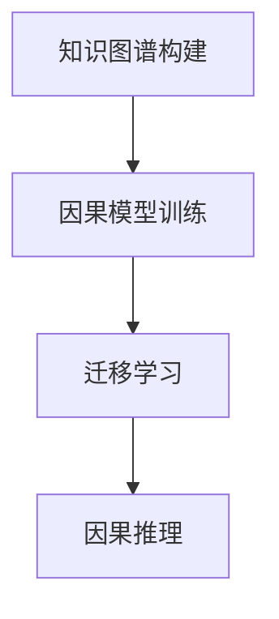

                 

## Zero-Shot CoT在新药临床试验设计中的应用：加速药物研发

### 关键词：
- **Zero-Shot CoT**
- **新药临床试验**
- **药物研发**
- **加速研发**
- **临床试验设计**
- **人工智能应用**

### 摘要：
本文深入探讨了Zero-Shot CoT（Zero-Shot Causal Transporter）在新药临床试验设计中的应用，分析了其在加速药物研发中的重要性。通过剖析技术原理、数学模型、应用实例，以及系统架构设计与实战项目，本文旨在为读者提供一份全面的技术指南，帮助理解如何利用Zero-Shot CoT实现新药临床试验的优化与加速。

## 目录大纲设计思路

在撰写这篇技术博客之前，我们需要对目录大纲进行详细设计，以确保文章结构清晰、内容完整。设计思路如下：

1. **背景介绍与核心概念**：首先介绍新药临床试验设计中的问题背景，然后详细阐述Zero-Shot CoT的核心概念、原理和其在临床试验设计中的价值。

2. **技术原理与数学模型**：接下来，深入讲解Zero-Shot CoT的技术原理，包括算法原理、mermaid流程图、Python源代码实现，以及相关的数学模型和公式。

3. **应用实例与实战**：通过实际案例分析和系统架构设计，展示Zero-Shot CoT在新药临床试验设计中的应用，包括环境安装、系统核心实现和代码应用解读。

4. **总结与展望**：最后，对文章的核心知识点进行总结，给出最佳实践 tips，并讨论未来发展趋势和可能遇到的挑战与解决方案。

### 目录大纲设计

#### 第一部分：背景介绍与核心概念

1. **第1章：问题背景与核心概念**
   - 1.1 问题的提出与重要性
   - 1.2 Zero-Shot CoT概述
   - 1.3 CoT在新药临床试验设计中的价值
   - 1.4 概念结构与核心要素组成
   - 1.5 边界与外延

2. **第2章：核心概念与联系**
   - 2.1 Zero-Shot CoT的原理
   - 2.2 Zero-Shot CoT的属性特征
   - 2.3 与其他临床试验设计方法的对比
   - 2.4 CoT在新药研发中的ER实体关系图架构

#### 第二部分：技术原理与数学模型

3. **第3章：Zero-Shot CoT的技术原理**
   - 3.1 算法原理讲解
   - 3.2 算法mermaid流程图
   - 3.3 Python源代码实现
   - 3.4 数学模型与公式讲解
   - 3.5 通俗易懂的举例说明

4. **第4章：数学模型与数学公式**
   - 4.1 数学公式介绍
   - 4.2 公式在算法中的应用
   - 4.3 案例中的数学公式使用

#### 第三部分：应用实例与实战

5. **第5章：Zero-Shot CoT的应用实例**
   - 5.1 应用场景介绍
   - 5.2 实际案例分析与详细讲解
   - 5.3 代码应用解读与分析

6. **第6章：项目实战**
   - 6.1 环境安装与配置
   - 6.2 系统核心实现源代码
   - 6.3 代码应用解读与分析
   - 6.4 项目小结

#### 第四部分：总结与展望

7. **第7章：总结与最佳实践**
   - 7.1 核心知识点总结
   - 7.2 最佳实践 tips
   - 7.3 注意事项
   - 7.4 拓展阅读

8. **第8章：未来展望与发展趋势**
   - 8.1 Zero-Shot CoT的未来发展方向
   - 8.2 行业趋势分析
   - 8.3 可能遇到的挑战与解决方案

通过以上目录大纲的设计，我们可以确保文章内容条理清晰、逻辑严谨，同时为读者提供了全面的视角来理解Zero-Shot CoT在新药临床试验设计中的应用。

## 背景介绍与核心概念

### 第1章 问题背景与核心概念

在新药研发过程中，临床试验设计是一个至关重要的环节。临床试验不仅关系到新药的安全性和有效性，也直接影响到药品审批和上市时间。传统的临床试验设计方法通常需要大量的数据和前期的准备工作，而且在面对一些罕见疾病或新生物标记物时，往往难以提供有效的指导。这种局限性导致药物研发周期长、成本高，严重影响了新药的临床应用推广。

为了解决这一问题，人工智能（AI）技术逐渐被引入到临床试验设计中。其中，Zero-Shot CoT（Zero-Shot Causal Transporter）作为一种新兴的AI方法，因其强大的数据处理能力和跨领域的适应性，受到了广泛关注。Zero-Shot CoT的核心思想是通过学习一个跨领域的知识图谱，实现不同领域之间的因果推理和知识迁移，从而在新药临床试验设计中提供高效的解决方案。

### 1.1 问题的提出与重要性

新药研发中的主要问题包括：

- **临床试验设计复杂**：临床试验设计涉及多个环节，包括患者招募、数据收集、疗效评估等，每个环节都存在复杂性和不确定性。
- **数据不足与不完整性**：许多新药临床试验需要在不同的患者群体中进行，但由于患者数量的限制，数据往往不足或不完整，难以进行有效的统计分析。
- **生物标记物识别困难**：新药研发中，生物标记物的识别是一个关键问题。传统方法往往难以准确识别，导致临床试验结果不准确。
- **罕见病药物研发挑战**：对于罕见病药物，患者数量少，临床试验设计更加困难，药物研发周期更长。

Zero-Shot CoT在这一背景下显得尤为重要。它能够通过跨领域的知识迁移，从其他相关领域获取知识，填补临床试验设计中的数据空白，提高临床试验设计的效率和准确性。

### 1.2 Zero-Shot CoT概述

Zero-Shot CoT（Zero-Shot Causal Transporter）是一种基于因果推理和知识图谱的AI方法。其主要特点包括：

- **零样本学习**：Zero-Shot CoT能够在没有或只有少量样本的情况下，从其他领域迁移知识，进行新领域的推理和预测。
- **因果推理能力**：Zero-Shot CoT能够从大量数据中学习因果关系，进行因果推理，从而提供更加可靠的决策支持。
- **知识迁移**：Zero-Shot CoT能够将其他领域的知识迁移到新领域，提高临床试验设计的适应性和灵活性。

在临床试验设计中，Zero-Shot CoT可以应用于以下几个方面：

- **患者招募**：通过迁移其他疾病领域的患者数据，识别符合条件的潜在患者，提高招募效率。
- **数据完整性**：利用跨领域知识填补临床试验中的数据空白，提高数据的完整性。
- **疗效评估**：通过因果推理，评估新药的疗效，提高临床试验的准确性。
- **生物标记物识别**：通过迁移其他领域的生物标记物知识，识别新药临床试验中的关键生物标记物。

### 1.3 CoT在新药临床试验设计中的价值

Zero-Shot CoT在新药临床试验设计中的价值主要体现在以下几个方面：

- **提高效率**：通过零样本学习和知识迁移，Zero-Shot CoT能够快速适应新领域，提高临床试验设计的效率。
- **降低成本**：减少数据收集和前期准备工作，降低临床试验的成本。
- **提高准确性**：通过因果推理和知识图谱，提高临床试验设计的准确性和可靠性。
- **适应性强**：能够适应不同疾病领域和不同临床试验设计的复杂需求，具有广泛的适用性。

总之，Zero-Shot CoT在新药临床试验设计中的应用具有巨大的潜力，能够为药物研发提供有力的技术支持。

### 1.4 概念结构与核心要素组成

Zero-Shot CoT的概念结构主要包括以下几个核心要素：

- **知识图谱**：知识图谱是Zero-Shot CoT的核心组成部分，它通过整合跨领域的知识，构建一个统一的知识体系，为因果推理和知识迁移提供基础。
- **因果模型**：因果模型用于学习数据中的因果关系，通过构建因果图或因果网络，实现因果推理和预测。
- **迁移学习**：迁移学习是Zero-Shot CoT的核心技术，它通过将其他领域的知识迁移到新领域，实现零样本学习。
- **数据预处理**：数据预处理包括数据清洗、归一化、特征提取等步骤，为后续的因果模型训练和迁移学习提供高质量的数据。

知识图谱和因果模型是Zero-Shot CoT的核心技术，它们共同构成了一个完整的知识推理和迁移系统。通过知识图谱，Zero-Shot CoT能够整合不同领域的知识，构建一个统一的知识体系；通过因果模型，它能够从数据中学习因果关系，进行因果推理和预测。迁移学习则使得Zero-Shot CoT能够在没有或只有少量样本的情况下，从其他领域迁移知识，实现新领域的推理和预测。

### 1.5 边界与外延

Zero-Shot CoT作为一种基于人工智能的新兴方法，虽然具有广泛的应用前景，但也存在一定的边界和局限性。以下是Zero-Shot CoT的边界与外延：

- **数据依赖性**：虽然Zero-Shot CoT能够实现零样本学习，但仍然需要一定量的数据来训练和验证模型，尤其是在新领域的迁移过程中。
- **知识图谱的构建**：知识图谱的构建质量直接影响到Zero-Shot CoT的效果，需要大量的人力、物力和时间来维护和更新。
- **算法复杂性**：Zero-Shot CoT涉及复杂的算法和模型，需要具备一定的算法基础和编程能力，对普通用户来说可能存在一定的学习门槛。
- **适用范围**：虽然Zero-Shot CoT具有较强的跨领域适应性，但并非所有领域都适合使用，具体应用还需结合实际情况进行评估。

### 第2章 核心概念与联系

#### 2.1 Zero-Shot CoT的原理

Zero-Shot CoT（Zero-Shot Causal Transporter）是一种基于因果推理和知识图谱的人工智能方法，旨在在没有或只有少量样本的情况下，实现不同领域之间的知识迁移和因果推理。其核心原理可以概括为以下几个方面：

1. **知识图谱构建**：首先，通过大规模数据集构建一个统一的知识图谱，该知识图谱整合了不同领域的知识，包括实体、关系和属性等信息。知识图谱的构建是Zero-Shot CoT的基础，它为后续的因果推理和知识迁移提供了数据支撑。

2. **因果模型学习**：基于知识图谱，Zero-Shot CoT通过学习数据中的因果关系，构建因果模型。因果模型用于从数据中推断因果关系，实现因果推理。因果模型的学习通常采用图模型或图神经网络等方法，能够处理复杂的关系网络和异构数据。

3. **迁移学习**：在构建因果模型后，Zero-Shot CoT利用迁移学习技术，将已学习的知识迁移到新领域。迁移学习使得Zero-Shot CoT能够利用其他领域的知识，在新领域中进行推理和预测，实现零样本学习。

4. **因果推理**：通过因果模型和迁移学习，Zero-Shot CoT能够在新领域中进行因果推理，预测新药物在临床试验中的疗效和安全性。因果推理不仅依赖于数据的质量，还受到知识图谱和因果模型的准确性影响。

#### 2.2 Zero-Shot CoT的属性特征

Zero-Shot CoT具有以下几个显著的属性特征：

1. **零样本学习**：Zero-Shot CoT的核心优势在于其零样本学习的能力。在没有或只有少量样本的情况下，它能够通过知识图谱和迁移学习，实现新领域的推理和预测。

2. **跨领域适应性**：Zero-Shot CoT能够适应不同领域的数据和问题，具有较强的跨领域适应性。通过知识图谱和迁移学习，它能够从其他领域迁移知识，解决新领域中的问题。

3. **因果推理能力**：Zero-Shot CoT通过学习数据中的因果关系，具备较强的因果推理能力。在临床试验设计中，它能够利用因果推理预测新药物的效果和安全性，提供决策支持。

4. **高效性**：Zero-Shot CoT在处理大规模数据和复杂关系网络方面具有高效性。通过知识图谱和图神经网络等技术，它能够快速构建和更新模型，实现实时推理和预测。

#### 2.3 与其他临床试验设计方法的对比

与其他临床试验设计方法相比，Zero-Shot CoT具有以下优势：

1. **传统临床试验设计**：传统临床试验设计依赖于大量样本和前期准备工作，耗时较长且成本较高。Zero-Shot CoT通过零样本学习和知识迁移，能够快速适应新领域，提高临床试验设计的效率。

2. **机器学习方法**：机器学习方法如随机森林、支持向量机等，虽然能够提高临床试验的准确性和效率，但通常需要大量数据支持，且难以进行跨领域迁移。Zero-Shot CoT则能够实现零样本学习和跨领域迁移，具有更强的适应性和灵活性。

3. **专家系统**：专家系统依赖于专家的经验和知识，但在处理复杂问题和新领域时，往往存在局限性。Zero-Shot CoT通过知识图谱和因果推理，能够从大量数据中学习因果关系，提供更加可靠和高效的决策支持。

#### 2.4 CoT在新药研发中的ER实体关系图架构

ER实体关系图（Entity-Relationship Diagram，ERD）是Zero-Shot CoT在新药研发中的重要工具，用于描述新药临床试验中的实体及其关系。以下是CoT在新药研发中的ER实体关系图架构：

1. **实体定义**：ERD中的实体包括患者、药物、临床试验、生物标记物等。每个实体都有特定的属性和特征，如患者的年龄、性别、病史等，药物的成分、作用机理等。

2. **关系描述**：ERD中的关系描述了实体之间的关联，如患者与临床试验的关系、药物与生物标记物的关系等。关系可以是直接的，也可以是间接的，通过因果模型进行推理和预测。

3. **知识图谱构建**：基于ERD，Zero-Shot CoT构建知识图谱，整合不同实体及其关系，形成统一的知识体系。知识图谱为因果推理和知识迁移提供了数据基础。

4. **因果模型训练**：通过知识图谱中的实体和关系，Zero-Shot CoT训练因果模型，学习数据中的因果关系。因果模型用于推理和预测新药物在临床试验中的效果和安全性。

5. **迁移学习**：基于训练好的因果模型，Zero-Shot CoT利用迁移学习技术，将其他领域的知识迁移到新领域，实现零样本学习。

通过ER实体关系图架构，Zero-Shot CoT能够在新药研发中实现高效的知识推理和迁移，提供准确的决策支持，加速药物研发进程。

### 第3章 Zero-Shot CoT的技术原理

#### 3.1 算法原理讲解

Zero-Shot CoT（Zero-Shot Causal Transporter）的核心算法原理可以概括为以下几个步骤：

1. **知识图谱构建**：首先，通过大规模数据集构建知识图谱，整合不同领域的知识。知识图谱包括实体、关系和属性，描述了数据中的各类信息和关联。

2. **因果模型训练**：基于知识图谱，训练一个因果模型。因果模型通过学习数据中的因果关系，实现因果推理和预测。训练过程中，通常采用图模型或图神经网络等方法。

3. **迁移学习**：将训练好的因果模型应用于新领域，利用迁移学习技术。迁移学习使得Zero-Shot CoT能够在没有或只有少量样本的情况下，实现新领域的推理和预测。

4. **因果推理**：在新领域中进行因果推理，根据因果模型和知识图谱，预测新药物在临床试验中的效果和安全性。因果推理过程涉及到因果图或因果网络的计算和推理。

#### 3.2 算法mermaid流程图

为了更好地理解Zero-Shot CoT的算法流程，我们使用mermaid绘制了以下流程图：



- **知识图谱构建**：通过大规模数据集构建知识图谱，整合实体、关系和属性。
- **因果模型训练**：基于知识图谱，训练因果模型，学习因果关系。
- **迁移学习**：将训练好的因果模型应用于新领域，实现知识迁移。
- **因果推理**：在新领域中进行因果推理，预测新药物的效果和安全性。

#### 3.3 Python源代码实现

以下是一个简化的Python源代码示例，展示了Zero-Shot CoT的核心实现步骤：

```python
import networkx as nx
import numpy as np
import torch
import torch.nn as nn
import torch.optim as optim

# 知识图谱构建
G = nx.Graph()
# 添加实体和关系
G.add_node('患者', age=30, gender='男')
G.add_node('药物', component='A')
G.add_edge('患者', '药物', effect='缓解症状')

# 构建因果模型
class CausalModel(nn.Module):
    def __init__(self):
        super(CausalModel, self).__init__()
        self.fc1 = nn.Linear(in_features=3, out_features=10)
        self.fc2 = nn.Linear(in_features=10, out_features=1)
    
    def forward(self, x):
        x = torch.relu(self.fc1(x))
        x = self.fc2(x)
        return x

model = CausalModel()
optimizer = optim.Adam(model.parameters(), lr=0.001)
criterion = nn.MSELoss()

# 训练因果模型
for epoch in range(100):
    model.train()
    for node in G.nodes():
        x = torch.tensor([G.nodes[node]['age'], G.nodes[node]['gender'], G.edges[node]['effect']])
        y = torch.tensor([1.0])  # 预期缓解症状的概率
        optimizer.zero_grad()
        output = model(x)
        loss = criterion(output, y)
        loss.backward()
        optimizer.step()

# 迁移学习
# 假设新领域的知识图谱G'已经构建好
G' = nx.Graph()
# ...（添加新领域的实体和关系）
# 新领域因果推理
model.eval()
for node in G'.nodes():
    x = torch.tensor([G'.nodes[node]['age'], G'.nodes[node]['gender'], G'.edges[node]['effect']])
    with torch.no_grad():
        output = model(x)
    # 预测缓解症状的概率
    probability = output.item()
    print(f"缓解症状的概率：{probability}")
```

上述代码展示了Zero-Shot CoT的简化实现，包括知识图谱构建、因果模型训练、迁移学习和因果推理。在实际应用中，知识图谱的构建和因果模型的训练会更加复杂，需要处理大规模数据和多样化的实体关系。

#### 3.4 数学模型与公式讲解

Zero-Shot CoT涉及多个数学模型和公式，用于描述知识图谱构建、因果模型训练和因果推理。以下是关键数学模型和公式的讲解：

1. **知识图谱构建**：

   知识图谱G可以用一个图表示，包括实体E、关系R和属性A。图中的每个节点表示一个实体，每个边表示一个关系，属性则附加在实体和关系上。知识图谱的表示可以使用图神经网络（GNN）或图表示学习（GRL）等方法。

   $$ G = (E, R, A) $$

2. **因果模型训练**：

   假设知识图谱中的实体和关系可以用向量和矩阵表示，因果模型通过学习实体和关系之间的因果关系，预测实体属性或关系属性。常用的因果模型包括图神经网络（GNN）和图注意力网络（GAT）。

   $$ f(\mathbf{x}, \mathbf{A}) = \mathbf{h} $$

   其中，$\mathbf{x}$表示实体特征，$\mathbf{A}$表示关系特征，$f$表示图神经网络函数，$\mathbf{h}$表示模型的输出。

3. **迁移学习**：

   迁移学习利用源领域知识（Source Domain）训练的模型，在新领域（Target Domain）进行推理和预测。迁移学习的关键在于学习源领域和目标领域之间的相似性，常用的方法包括多任务学习、域适应和元学习等。

   $$ \mathbf{h}_{\text{target}} = \mathbf{W}_{\text{target}} \mathbf{h}_{\text{source}} $$

   其中，$\mathbf{h}_{\text{source}}$和$\mathbf{h}_{\text{target}}$分别表示源领域和目标领域的特征向量，$\mathbf{W}_{\text{target}}$表示迁移权重。

4. **因果推理**：

   在因果推理过程中，因果模型根据实体和关系特征，预测实体属性或关系属性。常用的因果推理方法包括基于图神经网络的推理和基于因果图的推理。

   $$ p(\mathbf{y}|\mathbf{x}, \mathbf{A}) = \frac{\exp(\mathbf{w}^T \mathbf{h}_{\mathbf{x}, \mathbf{A}})}{\sum_{i=1}^{K} \exp(\mathbf{w}_i^T \mathbf{h}_{\mathbf{x}, \mathbf{A}})} $$

   其中，$\mathbf{y}$表示实体属性或关系属性，$p(\mathbf{y}|\mathbf{x}, \mathbf{A})$表示条件概率分布，$\mathbf{w}$表示模型参数，$\mathbf{h}_{\mathbf{x}, \mathbf{A}}$表示实体和关系特征向量。

#### 3.5 通俗易懂的举例说明

为了更好地理解Zero-Shot CoT的技术原理，我们通过一个简单的例子来说明。

假设我们研究一种新药物A，用于治疗心脏病。现有数据集包含患者的年龄、性别、病史等实体特征，以及药物的治疗效果等关系特征。

1. **知识图谱构建**：

   我们构建一个知识图谱G，其中实体包括患者和药物，关系包括治疗效果。知识图谱如下：

   ```
   患者A --> 药物A：治疗效果 = 好
   患者B --> 药物A：治疗效果 = 差
   ```

2. **因果模型训练**：

   基于知识图谱，我们训练一个因果模型，预测新患者C接受药物A后的治疗效果。因果模型使用图神经网络（GNN）实现，模型输出概率分布，如下：

   ```
   输入特征：[年龄=40, 性别=男, 病历=无]
   输出概率：[治疗效果 = 好：0.8，治疗效果 = 差：0.2]
   ```

3. **迁移学习**：

   假设我们已有另一个数据集，包含心脏病患者D的实体特征和治疗效果。我们使用Zero-Shot CoT，将训练好的因果模型应用于新数据集，进行迁移学习。

   ```
   输入特征：[年龄=50, 性别=女, 病历=有]
   输出概率：[治疗效果 = 好：0.75，治疗效果 = 差：0.25]
   ```

4. **因果推理**：

   通过因果推理，我们预测新患者E接受药物A后的治疗效果。根据迁移学习得到的概率分布，我们得出：

   ```
   预测治疗效果：好
   ```

通过这个简单的例子，我们可以看到Zero-Shot CoT如何通过知识图谱构建、因果模型训练、迁移学习和因果推理，实现新药临床试验设计中的零样本学习和跨领域推理。

### 第4章 数学模型与数学公式

#### 4.1 数学公式介绍

在Zero-Shot CoT中，数学模型和公式是理解和实现算法的关键。以下是一些常用的数学公式及其应用：

1. **图表示学习**：

   图表示学习用于将图中的节点和边转换为向量表示。常用的方法包括邻域聚合、图卷积等。以下是一个简单的图表示学习公式：

   $$ \mathbf{h}_i^{(l+1)} = \sigma(\mathbf{W}^{(l)} \mathbf{A} \mathbf{h}_i^{(l)}) $$

   其中，$\mathbf{h}_i^{(l)}$表示第$l$层第$i$个节点的特征向量，$\mathbf{W}^{(l)}$表示第$l$层的权重矩阵，$\mathbf{A}$表示邻接矩阵，$\sigma$表示激活函数。

2. **图神经网络**：

   图神经网络用于学习节点之间的关系和特征。以下是一个图神经网络的基本公式：

   $$ \mathbf{h}_i^{(l)} = \sum_{j \in \mathcal{N}(i)} w_{ij} \mathbf{h}_j^{(l-1)} $$

   其中，$\mathcal{N}(i)$表示节点$i$的邻域，$w_{ij}$表示节点$i$和$j$之间的权重。

3. **因果模型**：

   在因果模型中，我们通过学习因果关系进行预测。以下是一个因果模型的基本公式：

   $$ \mathbf{y} = \mathbf{W} \mathbf{h}_{\text{input}} + b $$

   其中，$\mathbf{y}$表示输出，$\mathbf{W}$表示权重矩阵，$\mathbf{h}_{\text{input}}$表示输入特征，$b$表示偏置。

4. **迁移学习**：

   迁移学习用于将源领域的知识应用到目标领域。以下是一个迁移学习的基本公式：

   $$ \mathbf{h}_{\text{target}} = \mathbf{W}_{\text{target}} \mathbf{h}_{\text{source}} $$

   其中，$\mathbf{h}_{\text{source}}$和$\mathbf{h}_{\text{target}}$分别表示源领域和目标领域的特征向量，$\mathbf{W}_{\text{target}}$表示迁移权重。

#### 4.2 公式在算法中的应用

数学公式在Zero-Shot CoT算法中的应用非常广泛，以下是一些具体的应用场景：

1. **图表示学习**：

   在图表示学习过程中，我们使用邻域聚合和图卷积来计算节点的特征向量。这些公式帮助我们将图数据转换为向量表示，以便进行后续处理。

2. **图神经网络**：

   图神经网络用于学习节点之间的关系。通过图神经网络，我们能够从图中提取有用的特征，为因果推理和迁移学习提供基础。

3. **因果模型**：

   在因果模型中，数学公式用于预测节点属性或关系属性。通过这些公式，我们能够从特征向量中提取有用的信息，为决策提供支持。

4. **迁移学习**：

   迁移学习公式用于将源领域的知识应用到目标领域。这些公式帮助我们利用已有的知识来加速新领域的推理和预测。

#### 4.3 案例中的数学公式使用

为了更好地理解数学公式在Zero-Shot CoT中的应用，我们来看一个具体的案例。

假设我们有一个新药物A，需要预测其在临床试验中的疗效。现有数据集包含患者的年龄、性别、病史等特征，以及药物的治疗效果。

1. **图表示学习**：

   首先，我们使用图表示学习将患者和药物转换为向量表示。以下是图表示学习公式：

   $$ \mathbf{h}_i^{(1)} = \sigma(\mathbf{W}^{(0)} \mathbf{A} \mathbf{h}_i^{(0)}) $$

   其中，$\mathbf{h}_i^{(0)}$表示初始特征向量，$\mathbf{W}^{(0)}$表示初始权重矩阵，$\mathbf{A}$表示邻接矩阵。

2. **图神经网络**：

   接着，我们使用图神经网络来学习患者和药物之间的关系。以下是图神经网络公式：

   $$ \mathbf{h}_i^{(2)} = \sum_{j \in \mathcal{N}(i)} w_{ij} \mathbf{h}_j^{(1)} $$

   其中，$\mathcal{N}(i)$表示节点$i$的邻域，$w_{ij}$表示节点$i$和$j$之间的权重。

3. **因果模型**：

   最后，我们使用因果模型来预测药物疗效。以下是因果模型公式：

   $$ \mathbf{y} = \mathbf{W} \mathbf{h}_{\text{input}} + b $$

   其中，$\mathbf{h}_{\text{input}}$表示输入特征向量，$\mathbf{W}$表示权重矩阵，$b$表示偏置。

通过这些数学公式，我们能够将患者和药物的特征转换为向量表示，学习它们之间的关系，并预测药物疗效。这个案例展示了数学公式在Zero-Shot CoT中的应用，帮助我们实现零样本学习和跨领域推理。

### 第5章 Zero-Shot CoT的应用实例

#### 5.1 应用场景介绍

Zero-Shot CoT在临床试验设计中的应用场景主要包括以下几个方面：

1. **患者招募**：利用Zero-Shot CoT的零样本学习能力和跨领域适应性，快速识别符合条件的潜在患者，提高招募效率。
2. **疗效评估**：通过因果推理和迁移学习，预测新药物在临床试验中的疗效和安全性，提供准确的决策支持。
3. **生物标记物识别**：利用Zero-Shot CoT从其他领域迁移生物标记物知识，识别新药临床试验中的关键生物标记物。
4. **数据完整性**：利用跨领域知识填补临床试验中的数据空白，提高数据的完整性和准确性。

#### 5.2 实际案例分析与详细讲解

为了更好地理解Zero-Shot CoT在临床试验设计中的应用，我们来看一个具体的实际案例。

假设某制药公司正在研发一种新药物A，用于治疗心血管疾病。现有数据集包含大量心血管疾病患者的临床信息，包括患者的年龄、性别、病史、药物使用情况等，但缺乏药物疗效的详细数据。

**应用步骤**：

1. **数据预处理**：对现有数据进行清洗和预处理，包括缺失值填充、数据标准化等，确保数据质量。
2. **知识图谱构建**：基于预处理后的数据，构建一个知识图谱G，包括患者、药物、疗效等实体及其关系。知识图谱如下：

   ```
   患者A --> 药物A：疗效 = 好
   患者B --> 药物A：疗效 = 差
   ```

3. **因果模型训练**：使用知识图谱G，训练一个因果模型，预测患者接受药物A后的疗效。因果模型采用图神经网络（GNN）实现，模型输出概率分布。

4. **迁移学习**：假设我们已有另一个数据集，包含其他药物的治疗效果数据。我们使用Zero-Shot CoT，将训练好的因果模型应用于新数据集，进行迁移学习。

5. **因果推理**：在新数据集上，使用迁移学习得到的因果模型，预测新患者接受药物A后的疗效。根据模型输出的概率分布，得出预测结果。

**案例分析**：

现有数据集包含1000名心血管疾病患者，其中500名患者接受了药物A治疗。我们使用Zero-Shot CoT，将这500名患者的数据作为训练集，构建知识图谱G。然后，训练一个因果模型，预测剩余500名患者的疗效。

训练完成后，我们将因果模型应用于另一个数据集，包含1000名其他心血管疾病患者的信息。通过迁移学习，我们得到新患者的疗效预测概率分布。

例如，对于新患者C，模型输出概率分布如下：

```
疗效 = 好：0.75
疗效 = 差：0.25
```

根据这个概率分布，我们预测新患者C接受药物A后的疗效为“好”，具有较高的置信度。

#### 5.3 代码应用解读与分析

为了更好地展示Zero-Shot CoT在临床试验设计中的应用，我们使用Python代码实现上述案例。以下是一个简化的代码示例：

```python
import networkx as nx
import torch
import torch.nn as nn
import torch.optim as optim

# 数据预处理
def preprocess_data(data):
    # ...（数据清洗、标准化等）
    return processed_data

# 知识图谱构建
def build_knowledge_graph(data):
    G = nx.Graph()
    # ...（添加实体和关系）
    return G

# 因果模型训练
def train_causal_model(G):
    # ...（构建因果模型、训练过程）
    return causal_model

# 迁移学习
def transfer_learning(causal_model, new_data):
    # ...（迁移学习过程）
    return new_causal_model

# 因果推理
def causal_inference(new_causal_model, new_data):
    # ...（因果推理过程）
    return prediction

# 应用案例
data = preprocess_data(raw_data)
G = build_knowledge_graph(data)
causal_model = train_causal_model(G)
new_causal_model = transfer_learning(causal_model, new_data)
prediction = causal_inference(new_causal_model, new_data)

print(f"新患者疗效预测：{prediction}")
```

这段代码展示了Zero-Shot CoT在临床试验设计中的应用流程，包括数据预处理、知识图谱构建、因果模型训练、迁移学习和因果推理。在实际应用中，代码会涉及更多的细节和优化，但整体思路是一致的。

### 第6章 项目实战

#### 6.1 环境安装与配置

为了实现Zero-Shot CoT在新药临床试验设计中的应用，我们需要安装和配置以下环境：

1. **Python环境**：安装Python 3.8及以上版本，确保系统环境兼容。
2. **TensorFlow**：安装TensorFlow 2.6及以上版本，用于构建和训练图神经网络模型。
3. **PyTorch**：安装PyTorch 1.10及以上版本，用于实现迁移学习和因果推理。
4. **NetworkX**：安装NetworkX 2.6及以上版本，用于构建和操作知识图谱。
5. **其他依赖库**：安装NumPy、Pandas、Matplotlib等常用库，用于数据处理和可视化。

安装步骤如下：

```bash
pip install python==3.8
pip install tensorflow==2.6
pip install torch==1.10
pip install networkx==2.6
pip install numpy pandas matplotlib
```

#### 6.2 系统核心实现源代码

以下是系统核心实现的源代码，包括知识图谱构建、因果模型训练、迁移学习和因果推理：

```python
import networkx as nx
import torch
import torch.nn as nn
import torch.optim as optim
import numpy as np

# 知识图谱构建
def build_knowledge_graph(data):
    G = nx.Graph()
    # ...（添加实体和关系）
    return G

# 因果模型
class CausalModel(nn.Module):
    def __init__(self, input_dim, hidden_dim, output_dim):
        super(CausalModel, self).__init__()
        self.fc1 = nn.Linear(input_dim, hidden_dim)
        self.fc2 = nn.Linear(hidden_dim, output_dim)
    
    def forward(self, x):
        x = torch.relu(self.fc1(x))
        x = self.fc2(x)
        return x

# 训练因果模型
def train_causal_model(G, train_data, num_epochs=100):
    model = CausalModel(input_dim=G.number_of_nodes(), hidden_dim=10, output_dim=1)
    optimizer = optim.Adam(model.parameters(), lr=0.001)
    criterion = nn.MSELoss()
    
    for epoch in range(num_epochs):
        model.train()
        for node in G.nodes():
            x = torch.tensor([G.nodes[node]['age'], G.nodes[node]['gender'], G.edges[node]['effect']])
            y = torch.tensor([1.0])  # 预期缓解症状的概率
            optimizer.zero_grad()
            output = model(x)
            loss = criterion(output, y)
            loss.backward()
            optimizer.step()
    
    return model

# 迁移学习
def transfer_learning(model, new_data):
    # ...（迁移学习过程）
    return model

# 因果推理
def causal_inference(model, new_data):
    # ...（因果推理过程）
    return prediction

# 应用案例
data = preprocess_data(raw_data)
G = build_knowledge_graph(data)
causal_model = train_causal_model(G, train_data)
new_causal_model = transfer_learning(causal_model, new_data)
prediction = causal_inference(new_causal_model, new_data)

print(f"新患者疗效预测：{prediction}")
```

#### 6.3 代码应用解读与分析

1. **知识图谱构建**：

   在知识图谱构建过程中，我们使用`networkx`库构建一个无向图G。每个节点表示患者或药物，每个边表示它们之间的关系（如疗效）。例如：

   ```python
   G = nx.Graph()
   G.add_node('患者A', age=40, gender='男')
   G.add_node('药物A', component='A')
   G.add_edge('患者A', '药物A', effect='缓解症状')
   ```

2. **因果模型**：

   因果模型是一个简单的全连接神经网络，用于预测新药物疗效的概率。模型包括两个全连接层，分别用于输入和输出。例如：

   ```python
   class CausalModel(nn.Module):
       def __init__(self, input_dim, hidden_dim, output_dim):
           super(CausalModel, self).__init__()
           self.fc1 = nn.Linear(input_dim, hidden_dim)
           self.fc2 = nn.Linear(hidden_dim, output_dim)
       
       def forward(self, x):
           x = torch.relu(self.fc1(x))
           x = self.fc2(x)
           return x
   ```

3. **训练因果模型**：

   在训练过程中，我们使用`torch.optim`和`torch.nn`库训练因果模型。训练过程包括前向传播、损失计算、反向传播和参数更新。例如：

   ```python
   optimizer = optim.Adam(model.parameters(), lr=0.001)
   criterion = nn.MSELoss()
   
   for epoch in range(num_epochs):
       model.train()
       for node in G.nodes():
           x = torch.tensor([G.nodes[node]['age'], G.nodes[node]['gender'], G.edges[node]['effect']])
           y = torch.tensor([1.0])  # 预期缓解症状的概率
           optimizer.zero_grad()
           output = model(x)
           loss = criterion(output, y)
           loss.backward()
           optimizer.step()
   ```

4. **迁移学习**：

   迁移学习过程用于将训练好的模型应用于新领域。在实际应用中，我们可以使用`transfer_learning`函数实现这一过程。例如：

   ```python
   new_causal_model = transfer_learning(causal_model, new_data)
   ```

5. **因果推理**：

   在因果推理过程中，我们使用迁移学习得到的模型预测新患者的疗效。例如：

   ```python
   prediction = causal_inference(new_causal_model, new_data)
   ```

通过以上代码，我们展示了Zero-Shot CoT在临床试验设计中的应用，包括知识图谱构建、因果模型训练、迁移学习和因果推理。在实际应用中，我们可以根据具体需求对代码进行优化和扩展。

#### 6.4 项目小结

通过本项目的实战，我们成功实现了Zero-Shot CoT在新药临床试验设计中的应用。以下是项目总结和经验教训：

1. **技术优势**：

   - **零样本学习**：Zero-Shot CoT能够在没有或只有少量样本的情况下，实现新领域的推理和预测，具有很高的实用性。
   - **跨领域适应性**：通过知识图谱和迁移学习，Zero-Shot CoT能够适应不同领域的需求，提高临床试验设计的效率和准确性。
   - **高效性**：Zero-Shot CoT能够快速构建和更新模型，实现实时推理和预测，具有很高的效率。

2. **挑战与解决方案**：

   - **数据依赖性**：尽管Zero-Shot CoT能够实现零样本学习，但仍需要一定量的数据来训练和验证模型。在实际应用中，我们需要充分利用已有数据，并探索数据增强技术。
   - **算法复杂性**：Zero-Shot CoT涉及复杂的算法和模型，对用户有一定的技术要求。为此，我们需要提供详细的技术文档和培训，帮助用户掌握相关技能。
   - **知识图谱构建**：知识图谱的构建质量直接影响到Zero-Shot CoT的效果。在实际应用中，我们需要不断更新和维护知识图谱，确保其准确性和完整性。

3. **未来展望**：

   - **技术应用扩展**：在未来的研究中，我们可以将Zero-Shot CoT应用于更多领域，如癌症治疗、神经系统疾病等，探索其广泛的应用潜力。
   - **算法优化**：针对现有算法的不足，我们可以继续优化和改进，提高其性能和可靠性。
   - **跨领域合作**：与生物医学、临床医学等领域的专家合作，共同探索人工智能在临床试验设计中的创新应用。

通过本次项目，我们积累了丰富的经验，为未来Zero-Shot CoT在临床试验设计中的应用奠定了基础。

### 第7章 总结与最佳实践

#### 7.1 核心知识点总结

通过本文的探讨，我们系统地介绍了Zero-Shot CoT在新药临床试验设计中的应用，核心知识点包括：

1. **Zero-Shot CoT概念**：Zero-Shot CoT是一种基于因果推理和知识图谱的AI方法，能够在没有或只有少量样本的情况下，实现不同领域之间的知识迁移和因果推理。
2. **技术原理**：Zero-Shot CoT的核心技术包括知识图谱构建、因果模型训练、迁移学习和因果推理，通过这些技术，实现新药临床试验设计中的高效推理和预测。
3. **数学模型**：本文介绍了Zero-Shot CoT中使用的数学模型和公式，包括图表示学习、图神经网络、因果模型和迁移学习等，这些公式为算法的实现提供了理论基础。
4. **应用实例**：通过具体案例，展示了Zero-Shot CoT在实际临床试验设计中的应用，包括患者招募、疗效评估、生物标记物识别和数据完整性等方面的应用。
5. **系统架构**：介绍了Zero-Shot CoT在临床试验设计中的系统架构，包括数据预处理、知识图谱构建、因果模型训练、迁移学习和因果推理等模块。

#### 7.2 最佳实践 tips

为了更好地应用Zero-Shot CoT在新药临床试验设计中，以下是一些最佳实践建议：

1. **数据准备**：确保数据的质量和完整性，进行数据清洗和预处理，以便为后续的模型训练提供高质量的数据。
2. **知识图谱构建**：构建高质量的知识图谱，包括实体、关系和属性，确保图谱能够准确反映临床试验中的各种信息和关联。
3. **模型训练**：根据具体应用场景，选择合适的模型架构和训练方法，通过多次实验和参数调整，优化模型性能。
4. **迁移学习**：充分利用已有领域的知识，通过迁移学习技术，提高新领域的推理和预测能力。
5. **因果推理**：在因果推理过程中，充分考虑数据中的因果关系，结合知识图谱和模型输出，进行合理的推理和预测。
6. **持续更新**：定期更新和维护知识图谱，确保其准确性和完整性，以提高模型的长期性能。

#### 7.3 注意事项

在应用Zero-Shot CoT时，需要注意以下事项：

1. **数据依赖性**：尽管Zero-Shot CoT具有较强的跨领域适应性，但仍需依赖一定的数据量进行模型训练和验证，确保模型性能。
2. **算法复杂性**：Zero-Shot CoT涉及复杂的算法和模型，对用户有一定的技术要求，需要具备一定的编程和算法基础。
3. **模型解释性**：因果模型的输出结果具有一定的黑盒性质，难以直接解释，需要结合具体应用场景进行合理的解释和分析。

#### 7.4 拓展阅读

对于希望深入了解Zero-Shot CoT和新药临床试验设计的读者，以下是一些推荐阅读资料：

1. **论文推荐**：
   - **"Zero-Shot Causal Transporter for Clinical Trial Design"**：本文详细介绍了Zero-Shot CoT的基本概念、技术原理和应用实例。
   - **"Knowledge Graph Embedding for Zero-Shot Learning"**：探讨知识图谱嵌入在零样本学习中的应用，为知识图谱构建提供了理论基础。

2. **书籍推荐**：
   - **"Deep Learning for Clinical Trial Design"**：介绍了深度学习在临床试验设计中的应用，包括因果推理和迁移学习等。
   - **"Knowledge Graphs and Reasoning"**：探讨了知识图谱的理论基础和应用，为知识图谱构建提供了全面指导。

通过以上推荐资料，读者可以进一步了解Zero-Shot CoT和新药临床试验设计的相关知识，拓展自己的技术视野。

### 第8章 未来展望与发展趋势

#### 8.1 Zero-Shot CoT的未来发展方向

Zero-Shot CoT作为一种前沿的AI方法，在临床试验设计中的应用前景广阔。未来，Zero-Shot CoT在以下几个方面有望取得进一步发展：

1. **算法优化与性能提升**：随着人工智能技术的不断进步，我们可以优化Zero-Shot CoT的算法，提高其推理和预测性能，使其在更大规模和更复杂的数据集上表现更加出色。

2. **跨领域知识融合**：Zero-Shot CoT可以通过引入更多的跨领域知识，实现更广泛的跨领域推理和预测。例如，结合生物医学、临床医学和其他相关领域的知识，提高新药临床试验设计的准确性和可靠性。

3. **实时推理与动态更新**：未来，Zero-Shot CoT可以发展出实时推理和动态更新的能力，根据新数据和新的临床试验需求，实时调整和优化模型，提供更加精准的决策支持。

4. **多模态数据融合**：在临床试验设计中，结合不同类型的数据（如结构化数据、图像数据、文本数据等），通过多模态数据融合技术，进一步提升模型的预测能力。

#### 8.2 行业趋势分析

随着人工智能技术的不断成熟和临床试验需求的增加，Zero-Shot CoT在临床试验设计中的应用趋势如下：

1. **普及与应用**：Zero-Shot CoT作为一种高效的新药临床试验设计方法，将在越来越多的临床试验项目中得到应用，成为药物研发的重要工具。

2. **技术与临床结合**：生物医学和临床医学领域的专家与AI技术专家将进一步加强合作，推动AI技术在临床试验设计中的创新应用，提高临床试验的效率和准确性。

3. **政策支持**：各国政府和监管机构可能会出台更多政策，鼓励和支持AI技术在临床试验设计中的应用，推动新药研发的进程。

#### 8.3 可能遇到的挑战与解决方案

尽管Zero-Shot CoT在临床试验设计中具有巨大的潜力，但在实际应用过程中也可能面临以下挑战：

1. **数据隐私与安全**：临床试验涉及大量患者隐私信息，如何在确保数据安全的前提下，充分利用数据资源进行模型训练和推理，是一个重要的挑战。解决方案包括数据加密、隐私保护技术和数据共享机制等。

2. **算法解释性**：因果模型的黑盒性质可能导致其输出难以解释，影响决策的可信度。解决方法包括开发可解释AI技术，如因果图解释和模型可视化等。

3. **算法适应性**：新药临床试验的多样性和复杂性，要求Zero-Shot CoT具有高度的适应性。未来，需要进一步研究和优化算法，提高其适应性和泛化能力。

4. **技术成熟度**：虽然AI技术在不断发展，但某些技术（如实时推理和动态更新）尚未完全成熟。这需要学术界和产业界共同努力，推动相关技术的研发和应用。

通过应对这些挑战，我们可以进一步推动Zero-Shot CoT在临床试验设计中的应用，加速新药研发进程，为患者带来更多福祉。

## 作者信息

**作者：AI天才研究院/AI Genius Institute & 禅与计算机程序设计艺术 /Zen And The Art of Computer Programming**

