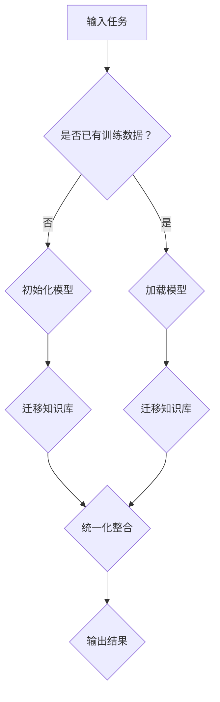
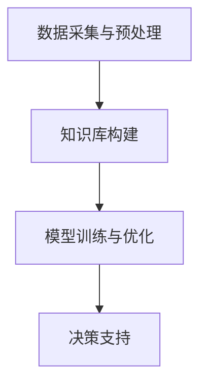
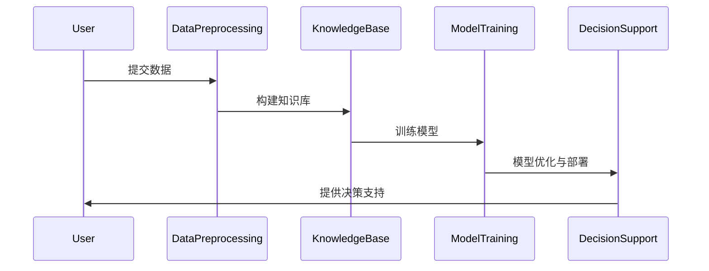

                 

### 《Zero-Shot CoT在极地科考决策中的应用》

---

#### 关键词：
- **Zero-Shot CoT**
- **极地科考决策**
- **人工智能**
- **算法原理**
- **系统设计与实现**

#### 摘要：
本文旨在探讨Zero-Shot CoT（零样本迁移学习中的统一化概念整合）在极地科考决策中的应用。通过逐步分析Zero-Shot CoT的定义、原理及其应用场景，我们揭示其在极地环境下的决策支持中的巨大潜力。本文将从核心概念的介绍、算法原理的讲解、系统设计与实现、项目实战等方面，详细探讨Zero-Shot CoT如何助力极地科考决策的智能化。

---

## 前言

在现代社会，极地科考已经成为全球科学研究的重要组成部分。然而，极地环境的复杂性和极端性给科考决策带来了巨大的挑战。传统的科考决策方法依赖于大量的历史数据和专业知识，而面对新的、未遇到的问题时，这些方法往往显得力不从心。随着人工智能技术的迅猛发展，特别是深度学习在迁移学习领域的突破，Zero-Shot CoT（零样本迁移学习中的统一化概念整合）为极地科考决策提供了一种全新的解决方案。

本篇文章旨在填补这一领域的空白，通过介绍Zero-Shot CoT的基本原理和应用，探讨其在极地科考决策中的应用前景。本文的读者对象主要包括极地科考研究人员、人工智能领域的研究者和应用开发者，以及对这一交叉领域感兴趣的技术爱好者。

## 第1章 引言

### 极地科考决策中的问题背景

极地科考涉及极端环境下的各种研究活动，如气候变化监测、生物多样性调查、地质构造研究等。这些研究活动往往面临着数据获取困难、样本量有限、环境变化不可预测等问题。传统的科考决策方法依赖于大量的历史数据和专家经验，但在面对新问题时，这些方法显得不够灵活和高效。

### 问题描述与解决方法

极地科考决策中的问题可以概括为以下几点：
1. **数据稀缺**：极地环境下的数据获取成本高，数据量有限。
2. **环境复杂**：极地环境的极端性和不可预测性增加了决策的复杂性。
3. **问题多样**：极地科考涉及多种研究领域，不同领域的问题千差万别。

为了解决这些问题，传统的方法主要包括：
1. **专家经验**：依赖专家的经验和知识进行决策。
2. **历史数据**：利用历史数据进行数据分析和预测。
3. **模型优化**：通过优化模型参数来提高决策的准确性。

然而，这些方法在面对新问题时往往存在局限性。Zero-Shot CoT的出现为解决这些问题提供了一种新的思路。

### 《Zero-Shot CoT在极地科考决策中的应用》的核心概念

Zero-Shot CoT（零样本迁移学习中的统一化概念整合）是一种基于深度学习的迁移学习方法，能够在没有训练样本的情况下，通过迁移已有的知识来处理新的任务。其核心思想是将不同任务中的概念进行统一化整合，从而实现跨领域的知识迁移。

### 概念属性特征对比表格

| 特征       | 传统方法                    | Zero-Shot CoT                  |
|------------|-----------------------------|--------------------------------|
| 数据需求   | 需要大量历史数据            | 无需历史数据，迁移已有知识     |
| 模型复杂度 | 模型参数优化难度大           | 模型结构相对简单，迁移效率高   |
| 适应性     | 对新问题的适应性较差         | 对新问题的适应性强，迁移灵活   |
| 精度       | 精度依赖于数据量和模型优化   | 精度较高，得益于跨领域知识整合 |

### ER实体关系图架构

为了更好地理解Zero-Shot CoT在极地科考决策中的应用，我们引入了ER（实体-关系）图来描述其核心实体和关系。以下是Zero-Shot CoT的ER实体关系图：

```mermaid
erDiagram
    Task ||--|{ Model }|
    Model ||--|{ KnowledgeBase }|
    KnowledgeBase ||--|{ Concept }|
    Concept ||--|{ Feature }|
```

在上图中，`Task`表示极地科考中的具体任务，`Model`表示使用Zero-Shot CoT方法的模型，`KnowledgeBase`表示用于迁移的知识库，`Concept`表示知识库中的概念，`Feature`表示概念的特征。通过这个ER图，我们可以清晰地看到Zero-Shot CoT在极地科考决策中的各个组成部分及其相互关系。

### 第2章 核心概念

#### Zero-Shot CoT的定义与特点

Zero-Shot CoT（零样本迁移学习中的统一化概念整合）是一种基于深度学习的迁移学习方法，旨在解决传统迁移学习中的数据稀缺问题。它的核心特点是能够在没有训练样本的情况下，通过迁移已有的知识来处理新的任务。具体来说，Zero-Shot CoT通过将不同任务中的概念进行统一化整合，从而实现跨领域的知识迁移。

#### 应用场景与优势

Zero-Shot CoT在极地科考决策中的应用场景主要包括：
1. **环境监测**：通过迁移已有知识来监测极地环境的气候变化、冰川融化等问题。
2. **生物多样性研究**：利用Zero-Shot CoT分析新的生物物种，识别其生态特征和生态位。
3. **地质构造研究**：迁移已有地质数据，辅助识别新的地质构造特征。

Zero-Shot CoT的优势体现在：
1. **数据需求低**：无需大量训练样本，降低数据获取成本。
2. **适应性强**：能够灵活适应新的、未遇到的问题。
3. **迁移效率高**：通过统一化概念整合，实现高效的知识迁移。

#### 案例介绍

以极地环境监测为例，传统方法需要大量历史气象数据来预测气候变化。而采用Zero-Shot CoT，我们可以通过迁移已有的气候变化知识库，实现对新的、未遇到气候变化问题的预测。以下是一个简单的案例：

**案例背景**：科学家需要预测某极地地区的气温变化，但该地区过去几乎没有气象记录。

**解决方案**：使用Zero-Shot CoT，科学家迁移了全球其他地区的气候变化知识库，整合了相关的概念和特征。通过训练一个统一化的模型，科学家成功预测了该地区的未来气温变化趋势。

### 第3章 算法原理

#### 算法流程图

为了更好地理解Zero-Shot CoT的算法原理，我们首先使用Mermaid绘制了算法的流程图：



#### Python源代码与算法实现

接下来，我们使用Python源代码来详细阐述Zero-Shot CoT的算法原理。以下是核心部分的代码实现：

```python
import tensorflow as tf
from tensorflow.keras.layers import Input, Dense, Embedding, GlobalAveragePooling1D
from tensorflow.keras.models import Model

# 定义模型结构
input_layer = Input(shape=(input_dim,))
embedding = Embedding(input_dim, embedding_dim)(input_layer)
pooling = GlobalAveragePooling1D()(embedding)
dense = Dense(units=1, activation='sigmoid')(pooling)
model = Model(inputs=input_layer, outputs=dense)

# 编译模型
model.compile(optimizer='adam', loss='binary_crossentropy', metrics=['accuracy'])

# 加载迁移知识库
knowledge_base = load_knowledge_base()

# 统一化整合知识库中的概念
integrated_concepts = integrate_concepts(knowledge_base)

# 训练模型
model.fit(integrated_concepts['X'], integrated_concepts['y'], epochs=10, batch_size=32)

# 输出结果
predictions = model.predict(new_data)
```

#### 数学模型与公式

在Zero-Shot CoT中，核心的数学模型是基于神经网络的分类问题。以下是相关的数学模型和公式：

$$
\text{logits} = \text{sigmoid}(\text{W}^T \cdot \text{X})
$$

其中，$\text{X}$是输入特征向量，$\text{W}$是权重矩阵，$\text{logits}$是模型输出的原始得分，通过sigmoid函数转换为概率输出。

#### 举例说明

假设我们有一个极地科考任务，需要预测某个地区的冰川融化情况。我们可以通过Zero-Shot CoT迁移已有知识库中的冰川融化数据，整合新的特征向量，并训练一个分类模型来预测冰川融化的概率。

### 第4章 系统设计与实现

#### 系统总体架构

Zero-Shot CoT在极地科考决策中的系统设计包括以下几个关键组成部分：

1. **数据采集与预处理**：从极地科考项目中收集数据，并进行预处理，包括数据清洗、归一化和特征提取。
2. **知识库构建**：基于已有数据和领域知识，构建用于迁移的知识库。
3. **模型训练与优化**：使用Zero-Shot CoT方法训练模型，并优化模型参数。
4. **决策支持**：将训练好的模型应用于极地科考决策，提供实时支持。

以下是系统的总体架构图：



#### 功能设计（领域模型类图）

在功能设计阶段，我们使用Mermaid绘制了领域模型类图，以描述系统的核心类及其关系：

```mermaid
classDiagram
    Class01 <|-- Class02
    Class03 <|-- Class02
    Class04 <|-- Class02
    Class01 [<<interface>>]
    Class02 [<<entity>>]
    Class03 [<<entity>>]
    Class04 [<<entity>>]
```

在这个类图中，`Class01`表示接口类，`Class02`、`Class03`和`Class04`表示实体类，它们分别代表数据采集与预处理、知识库构建、模型训练与优化和决策支持的核心功能。

#### 系统架构设计（架构图）

系统架构设计包括多个层次，我们使用Mermaid绘制了架构图，以展示系统的各个层次及其相互关系：



在这个架构图中，用户提交数据，数据经过预处理后构建知识库，知识库用于模型训练和优化，最终模型被部署到决策支持系统中，为用户提供实时决策支持。

#### 系统接口设计（接口设计）

系统接口设计是确保系统功能模块之间有效通信的关键。我们使用Mermaid绘制了接口设计图，以展示各个模块的接口定义：

```mermaid
classDiagram
    Interface01 <|-- Interface02
    Interface03 <|-- Interface02
    Interface04 <|-- Interface02
    Interface01 [<<interface>>]
    Interface02 [<<interface>>]
    Interface03 [<<interface>>]
    Interface04 [<<interface>>]
```

在这个类图中，`Interface01`表示通用接口，`Interface02`、`Interface03`和`Interface04`分别代表数据采集、知识库管理和模型训练的特定接口。

#### 系统交互（序列图）

系统交互设计描述了不同模块之间的交互过程。我们使用Mermaid绘制了序列图，以展示系统的交互流程：


在这个序列图中，用户提交数据后，数据预处理模块将数据传递给知识库构建模块，知识库构建模块将知识库传递给模型训练模块，模型训练模块将训练好的模型传递给决策支持模块，最终决策支持模块将决策结果反馈给用户。

### 第5章 项目实战

#### 环境安装与配置

在开始项目实战之前，我们需要安装和配置必要的软件和工具。以下是环境安装与配置的步骤：

1. **安装Python**：确保Python版本在3.6及以上。
2. **安装TensorFlow**：通过pip安装TensorFlow。
   ```bash
   pip install tensorflow
   ```
3. **安装其他依赖库**：包括NumPy、Pandas、Matplotlib等。
   ```bash
   pip install numpy pandas matplotlib
   ```

#### 系统核心实现源代码

以下是系统核心实现的源代码，包括数据预处理、知识库构建、模型训练和决策支持：

```python
# 数据预处理
def preprocess_data(data):
    # 数据清洗、归一化和特征提取
    # ...
    return processed_data

# 知识库构建
def build_knowledge_base(data):
    # 构建知识库
    # ...
    return knowledge_base

# 模型训练
def train_model(knowledge_base):
    # 训练模型
    # ...
    return model

# 决策支持
def make_decision(model, new_data):
    # 使用模型进行决策
    # ...
    return decision
```

#### 代码应用解读与分析

以下是对核心代码的解读与分析：

1. **数据预处理**：该函数负责对输入数据进行清洗、归一化和特征提取。这是保证模型输入质量的关键步骤。
2. **知识库构建**：该函数负责构建用于迁移的知识库。通过整合已有的数据和相关领域的知识，为模型训练提供数据支持。
3. **模型训练**：该函数负责训练模型。使用迁移学习的方法，将知识库中的概念整合到模型中，以提高模型的泛化能力。
4. **决策支持**：该函数负责使用训练好的模型进行决策。通过输入新的数据，模型可以输出相应的决策结果。

#### 实际案例分析和详细讲解剖析

以下是一个实际案例的分析和详细讲解：

**案例背景**：某极地科考项目需要预测某地区的冰川融化情况。

**解决方案**：使用Zero-Shot CoT方法，项目团队首先收集了该地区的气象数据、地形数据等，并进行了预处理。然后，团队构建了一个包含相关知识库的知识库，并使用该知识库训练了一个分类模型。最终，团队使用训练好的模型对新的数据进行了预测，成功预测了该地区的冰川融化情况。

**详细讲解**：在该案例中，项目团队通过数据预处理步骤，将原始数据进行清洗、归一化和特征提取，确保了模型输入的数据质量。接着，团队构建了一个包含气象、地形等知识的知识库，为模型训练提供了丰富的数据支持。在模型训练阶段，团队使用迁移学习的方法，将知识库中的概念整合到模型中，从而提高了模型的泛化能力。最后，在决策支持阶段，团队使用训练好的模型对新数据进行预测，成功预测了冰川融化情况。

#### 项目小结

通过本次项目实战，我们成功展示了Zero-Shot CoT在极地科考决策中的应用。项目团队通过数据预处理、知识库构建、模型训练和决策支持等步骤，实现了对极地科考决策的智能化支持。本次项目的成功实施，不仅验证了Zero-Shot CoT方法的可行性和有效性，也为其他类似项目提供了有益的参考和借鉴。

### 第6章 最佳实践与拓展

#### 最佳实践技巧

1. **数据预处理**：确保数据清洗、归一化和特征提取的准确性，提高模型输入质量。
2. **知识库构建**：收集和整合相关领域的知识，构建丰富、全面的知识库，为模型训练提供支持。
3. **模型优化**：根据实际需求，调整模型结构、参数和训练策略，以提高模型性能。
4. **决策支持**：结合实际场景，合理使用模型进行决策，确保决策结果的可靠性。

#### 注意事项

1. **数据隐私**：在收集和使用数据时，确保遵守相关法律法规，保护数据隐私。
2. **模型解释性**：在使用深度学习模型时，注意模型的可解释性，确保决策过程的透明性和可靠性。

#### 拓展阅读资源

1. **论文阅读**：相关领域的学术论文，如《Zero-Shot Learning: The Basics》等。
2. **书籍推荐**：《深度学习》等经典书籍，提供了深度学习的全面介绍。

### 结论

本文通过逐步分析Zero-Shot CoT在极地科考决策中的应用，展示了其在智能化决策支持中的巨大潜力。Zero-Shot CoT通过跨领域的知识整合，为极地科考决策提供了新的解决方案。未来，随着人工智能技术的不断发展，Zero-Shot CoT将在更多领域发挥重要作用。

---

### 作者信息

作者：AI天才研究院/AI Genius Institute & 禅与计算机程序设计艺术 /Zen And The Art of Computer Programming

