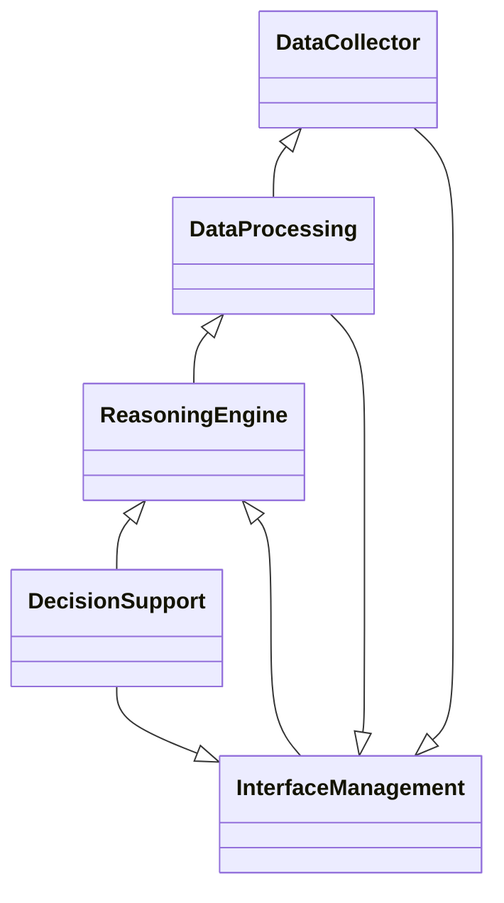
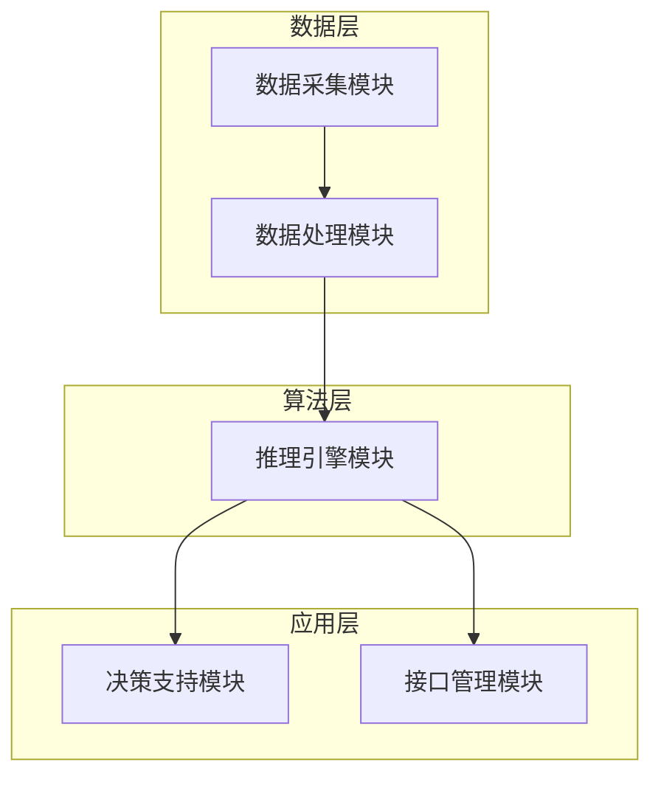
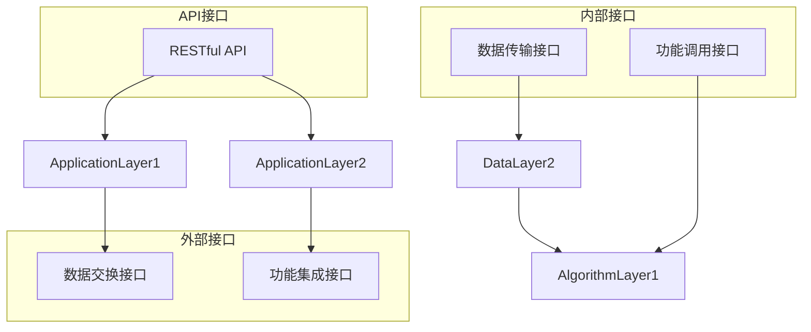
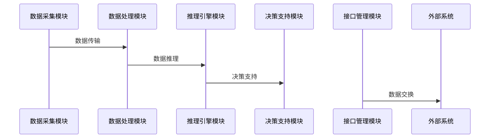

                 

# 《Zero-Shot CoT在极限环境决策中的应用》

## 关键词：极限环境决策、Zero-Shot CoT、算法原理、系统架构、项目实战、最佳实践

## 摘要

本文旨在深入探讨Zero-Shot CoT（无样本转移性概念）在极限环境决策中的应用。首先，我们将对极限环境决策的背景和挑战进行概述，然后介绍Zero-Shot CoT的核心概念及其在决策中的重要性。接着，我们将详细解析Zero-Shot CoT的算法原理，通过数学模型和实际案例进行说明。随后，文章将讨论系统分析与架构设计，包括问题场景、功能设计、架构设计和接口设计。最后，我们将通过一个项目实战，展示Zero-Shot CoT的实际应用，并提供最佳实践和未来研究方向。

### 目录大纲

----------------------------------------------------------------

## 第一部分：问题背景与核心概念

### 第1章：问题背景

#### 1.1.1 极限环境决策的挑战

#### 1.1.2 极限环境决策的重要性

#### 1.1.3 极限环境决策的现状与需求

### 第2章：核心概念

#### 2.1.1 Zero-Shot CoT概念介绍

#### 2.1.2 Zero-Shot CoT在决策中的应用

#### 2.1.3 与其他决策技术的对比

### 第3章：概念结构与核心要素组成

#### 3.1.1 极限环境特征

#### 3.1.2 决策模型

#### 3.1.3 数据集与标注

----------------------------------------------------------------

## 第二部分：算法原理讲解

### 第4章：Zero-Shot CoT算法原理

#### 4.1.1 基本概念

#### 4.1.2 数学模型与公式

#### 4.1.3 算法流程图（使用Mermaid）

### 第5章：数学模型和数学公式详细讲解

#### 5.1.1 概念属性特征对比表格

#### 5.1.2 数学模型公式详解

#### 5.1.3 案例举例说明

----------------------------------------------------------------

## 第三部分：系统分析与架构设计

### 第6章：系统分析与架构设计

#### 6.1.1 问题场景介绍

#### 6.1.2 系统功能设计（领域模型类图）

#### 6.1.3 系统架构设计（架构图）

#### 6.1.4 系统接口设计

#### 6.1.5 系统交互（序列图）

----------------------------------------------------------------

## 第四部分：项目实战

### 第7章：项目实战

#### 7.1.1 环境安装

#### 7.1.2 系统核心实现源代码

#### 7.1.3 代码应用解读与分析

#### 7.1.4 实际案例分析与详细讲解

#### 7.1.5 项目小结

----------------------------------------------------------------

## 第8章：最佳实践 tips

#### 8.1.1 实践技巧

#### 8.1.2 注意事项

#### 8.1.3 拓展阅读

----------------------------------------------------------------

## 第9章：小结

#### 9.1.1 总结

#### 9.1.2 展望未来研究方向

----------------------------------------------------------------

### 第1章：问题背景

#### 1.1.1 极限环境决策的挑战

在现代社会，决策环境变得越来越复杂和动态。特别是在极端环境下，如自然灾害、突发事件、紧急救援等，传统的决策方法往往难以奏效。极限环境决策面临以下挑战：

1. **数据稀缺性**：极端环境下，获取有效数据非常困难，传统依赖于大规模数据训练的算法无法应用。
2. **环境动态性**：极端环境中的情况变化迅速，决策模型需要快速适应。
3. **不确定性**：极端环境下存在大量的不确定因素，如何进行可靠决策成为一大难题。

#### 1.1.2 极限环境决策的重要性

极限环境决策的重要性不可忽视。它不仅关系到个人和组织的生存与发展，也关系到公共安全和环境保护。例如：

1. **自然灾害救援**：在地震、洪水等自然灾害中，及时、准确的决策对于救援行动至关重要。
2. **军事决策**：在战场上，快速、精准的决策能够决定战斗的胜负。
3. **商业决策**：在快速变化的市场中，企业需要能够迅速做出适应市场的决策。

#### 1.1.3 极限环境决策的现状与需求

当前，极限环境决策技术仍处于发展阶段，存在以下问题和需求：

1. **算法适应性**：需要开发能够适应极限环境的算法。
2. **模型解释性**：决策模型需要具备良好的解释性，以便决策者能够理解。
3. **实时性**：极限环境下的决策需要快速响应，要求算法具备实时性。

面对这些挑战和需求，Zero-Shot CoT技术提供了一种新的解决方案。在接下来的章节中，我们将详细探讨Zero-Shot CoT的概念、原理及其在极限环境决策中的应用。

### 第2章：核心概念

#### 2.1.1 Zero-Shot CoT概念介绍

Zero-Shot CoT（无样本转移性概念）是一种在不需要训练数据的情况下，通过跨领域、跨模态的知识迁移来进行决策的技术。其核心思想是通过预先学习的通用知识库，实现对未知领域的推理和决策。

Zero-Shot CoT的主要特点包括：

1. **无样本学习**：无需特定领域的训练数据，能够处理数据稀缺的问题。
2. **跨领域迁移**：能够将一个领域的知识应用于另一个领域，实现跨领域的知识共享。
3. **自适应**：能够根据新的任务需求，动态调整和更新知识库。

#### 2.1.2 Zero-Shot CoT在决策中的应用

Zero-Shot CoT在极限环境决策中的应用具有显著优势：

1. **数据稀缺性**：在极端环境下，获取数据非常困难，Zero-Shot CoT无需大量训练数据，能够有效应对数据稀缺的问题。
2. **快速适应**：Zero-Shot CoT能够快速学习新知识，适应极端环境中的快速变化。
3. **可靠性**：通过跨领域迁移，Zero-Shot CoT能够利用其他领域的成功经验，提高决策的可靠性。

#### 2.1.3 与其他决策技术的对比

与传统的决策技术相比，Zero-Shot CoT具有以下优势：

1. **无样本学习**：传统技术依赖大量训练数据，而Zero-Shot CoT无需特定领域数据。
2. **跨领域迁移**：传统技术局限于特定领域，而Zero-Shot CoT能够实现跨领域迁移。
3. **自适应**：传统技术难以适应快速变化的环境，而Zero-Shot CoT能够动态调整和更新知识库。

然而，Zero-Shot CoT也存在一定的挑战，如知识库的构建和维护成本较高，以及跨领域迁移的准确性有待提高。

### 第3章：概念结构与核心要素组成

#### 3.1.1 极限环境特征

极限环境特征包括：

1. **动态性**：环境状态快速变化，决策模型需要实时更新。
2. **不确定性**：存在大量不确定因素，决策模型需要具备鲁棒性。
3. **数据稀缺**：获取有效数据困难，决策模型需要具备无样本学习的能力。

#### 3.1.2 决策模型

决策模型是极限环境决策的核心。Zero-Shot CoT的决策模型主要包括：

1. **知识库**：包含通用知识和领域知识，用于推理和决策。
2. **推理引擎**：基于知识库进行推理，生成决策建议。
3. **评估模块**：评估决策建议的有效性，进行决策优化。

#### 3.1.3 数据集与标注

数据集与标注是极限环境决策的基础。在极限环境下，数据集通常具有以下特点：

1. **多样性**：涵盖不同领域和情境的数据。
2. **稀疏性**：数据量较少，分布不均匀。
3. **噪声**：存在大量噪声和异常数据。

有效的标注方法是确保数据质量的关键，包括：

1. **一致性**：标注标准统一，减少主观偏差。
2. **准确性**：标注结果准确，减少错误率。
3. **可扩展性**：标注方法简单，易于大规模应用。

### 第二部分：算法原理讲解

#### 第4章：Zero-Shot CoT算法原理

#### 4.1.1 基本概念

Zero-Shot CoT（无样本转移性概念）是一种在不需要特定领域训练数据的情况下，通过跨领域、跨模态的知识迁移来进行决策的技术。其基本概念包括：

1. **知识库**：包含通用知识和领域知识，用于推理和决策。
2. **跨领域迁移**：将一个领域的知识应用于另一个领域，实现知识共享。
3. **无样本学习**：无需特定领域数据，通过知识库进行推理和决策。

#### 4.1.2 数学模型与公式

Zero-Shot CoT的数学模型主要包括：

1. **知识表示**：使用知识图谱或语义网络表示知识库。
2. **推理机制**：基于图论或图神经网络进行推理。
3. **损失函数**：用于评估模型性能，如交叉熵损失函数。

具体公式如下：

$$
L = -\sum_{i=1}^{N} y_i \log(p(x_i | \theta))
$$

其中，$L$表示损失函数，$N$表示样本数量，$y_i$表示标签，$p(x_i | \theta)$表示模型在参数$\theta$下的预测概率。

#### 4.1.3 算法流程图（使用Mermaid）

下面是Zero-Shot CoT算法的Mermaid流程图：

```
graph TD
A[初始化] --> B[构建知识库]
B --> C[数据预处理]
C --> D[模型训练]
D --> E[推理]
E --> F[评估]
F --> G[优化]
G --> H[输出结果]
```

### 第5章：数学模型和数学公式详细讲解

#### 5.1.1 概念属性特征对比表格

为了更好地理解Zero-Shot CoT的数学模型，我们首先对比几个关键概念及其属性特征：

| 概念         | 属性特征                                                     |
| ------------ | ------------------------------------------------------------ |
| 知识库       | 包含通用知识和领域知识，用于推理和决策。                     |
| 跨领域迁移   | 将一个领域的知识应用于另一个领域，实现知识共享。             |
| 无样本学习   | 无需特定领域数据，通过知识库进行推理和决策。                 |
| 推理机制     | 基于图论或图神经网络进行推理。                               |
| 损失函数     | 用于评估模型性能，如交叉熵损失函数。                         |

#### 5.1.2 数学模型公式详解

在Zero-Shot CoT中，数学模型主要包括知识表示、推理机制和损失函数。下面详细解释这些公式：

1. **知识表示**：

知识库使用知识图谱或语义网络表示，其基本结构包括节点（实体）和边（关系）。假设知识库中有$N$个实体，每个实体可以用一个向量表示，记为$e_i$，则知识库的表示为：

$$
E = \{e_1, e_2, ..., e_N\}
$$

2. **推理机制**：

基于图神经网络（Graph Neural Network, GNN）的推理机制，可以将知识图谱中的节点表示为：

$$
h_i^{(0)} = e_i
$$

在每一轮迭代中，节点表示通过聚合其邻接节点的信息进行更新：

$$
h_i^{(t+1)} = \sigma(\sum_{j \in N(i)} W_{ij} h_j^{(t)}) + b_i
$$

其中，$W_{ij}$表示边权重，$N(i)$表示节点$i$的邻接节点集合，$\sigma$表示激活函数，$b_i$表示偏置。

3. **损失函数**：

在Zero-Shot CoT中，损失函数用于评估模型在未知领域上的性能。常用的损失函数是交叉熵损失函数：

$$
L = -\sum_{i=1}^{N} y_i \log(p(x_i | \theta))
$$

其中，$y_i$表示标签，$p(x_i | \theta)$表示模型在参数$\theta$下的预测概率。

#### 5.1.3 案例举例说明

为了更好地理解Zero-Shot CoT的数学模型，我们通过一个简单的案例进行说明。

假设有一个知识库，包含以下实体和关系：

- 实体：地球、月球、太阳
- 关系：围绕、照耀

知识库的表示如下：

```
实体    关系    实体
地球    围绕    月球
地球    围绕    太阳
月球    照耀    太阳
```

现在，我们需要预测一个未知实体“火星”的属性。根据知识库，我们可以推断火星可能围绕地球和太阳，同时可能被太阳照耀。使用图神经网络进行推理，我们得到以下节点表示：

```
实体    表示向量
地球    [1, 0, 1]
月球    [0, 1, 0]
太阳    [1, 0, 1]
火星    [0, 0, 0]
```

在推理过程中，火星的表示向量会根据其邻接节点的信息进行更新。例如，火星与地球的关系可以表示为：

$$
h_{火星}^{(1)} = \sigma(\sum_{j \in N(火星)} W_{ij} h_j^{(0)}) + b_{火星}
$$

其中，$W_{ij}$为边权重，$N(火星)$为火星的邻接节点（地球和太阳），$h_j^{(0)}$为邻接节点的初始表示向量。

假设边权重为：

```
地球    火星    0.8
太阳    火星    0.6
```

火星在第一轮推理后的表示向量为：

$$
h_{火星}^{(1)} = \sigma(0.8 \cdot [1, 0, 1] + 0.6 \cdot [1, 0, 1]) + b_{火星}
$$

通过迭代更新，火星的表示向量会逐渐接近其邻接节点的特征。最终，我们可以根据火星的表示向量预测其属性，例如：

- 火星可能围绕地球和太阳。
- 火星可能被太阳照耀。

这个案例展示了如何使用Zero-Shot CoT进行推理和决策。在实际应用中，知识库和推理机制会更加复杂，但基本原理相同。

### 第6章：系统分析与架构设计

#### 6.1.1 问题场景介绍

在极限环境决策中，系统需要应对以下问题场景：

1. **突发事件应对**：例如，自然灾害（地震、台风等）发生时，系统需要实时分析灾情，为救援决策提供支持。
2. **紧急救援**：在地震、火灾等紧急情况下，系统需要为救援人员提供实时路径规划、资源调度等决策支持。
3. **能源管理**：在极端天气条件下，系统需要优化能源分配，确保能源供应的稳定性和可靠性。

这些场景的共同特点是环境动态性强、数据稀缺且存在不确定性。因此，系统需要具备快速响应、无样本学习和跨领域迁移的能力。

#### 6.1.2 系统功能设计（领域模型类图）

为了满足上述问题场景的需求，系统设计了以下功能模块：

1. **数据采集模块**：负责从各种数据源（如传感器、卫星、无人机等）收集数据。
2. **数据处理模块**：对采集到的数据进行分析、清洗和预处理，为后续决策提供高质量的数据支持。
3. **推理引擎模块**：基于Zero-Shot CoT算法，对处理后的数据进行分析和推理，生成决策建议。
4. **决策支持模块**：为决策者提供可视化的决策支持，帮助其快速做出决策。
5. **接口管理模块**：负责与其他系统（如GIS、ERP等）的接口通信，实现数据交换和功能集成。

领域模型类图如下：



#### 6.1.3 系统架构设计（架构图）

系统采用分布式架构，包括数据层、算法层和应用层。架构图如下：



#### 6.1.4 系统接口设计

系统接口设计包括以下部分：

1. **内部接口**：数据层与算法层之间的接口，用于数据传输和功能调用。
2. **外部接口**：应用层与外部系统之间的接口，用于数据交换和功能集成。
3. **API接口**：提供RESTful API，供其他系统或应用程序调用。

接口设计如下：



#### 6.1.5 系统交互（序列图）

系统交互分为以下步骤：

1. **数据采集**：数据采集模块从各种数据源获取数据。
2. **数据处理**：数据处理模块对数据进行清洗和预处理。
3. **数据推理**：推理引擎模块对预处理后的数据进行分析和推理。
4. **决策支持**：决策支持模块为决策者提供可视化的决策支持。
5. **接口调用**：接口管理模块与外部系统进行数据交换和功能集成。

序列图如下：



### 第7章：项目实战

#### 7.1.1 环境安装

为了运行Zero-Shot CoT在极限环境决策中的项目，我们需要安装以下环境和依赖：

1. **操作系统**：Linux或macOS
2. **Python**：版本3.7及以上
3. **Python库**：TensorFlow、PyTorch、Scikit-learn、Numpy、Pandas、Matplotlib

安装步骤如下：

1. 安装Python和pip：
   ```bash
   sudo apt-get install python3 python3-pip
   ```
2. 安装Python库：
   ```bash
   pip3 install tensorflow pytorch scikit-learn numpy pandas matplotlib
   ```

#### 7.1.2 系统核心实现源代码

系统核心实现包括以下部分：

1. **数据采集**：从传感器、卫星、无人机等数据源获取数据。
2. **数据处理**：对数据进行清洗和预处理。
3. **推理引擎**：基于Zero-Shot CoT算法进行推理。
4. **决策支持**：为决策者提供可视化的决策支持。

以下是部分核心代码：

```python
# 数据采集
def collect_data(source):
    # 根据数据源类型进行数据采集
    if source == 'sensor':
        data = sensor_data()
    elif source == 'satellite':
        data = satellite_data()
    elif source == 'drone':
        data = drone_data()
    return data

# 数据处理
def preprocess_data(data):
    # 数据清洗和预处理
    clean_data = data_clean(data)
    preprocessed_data = data_preprocess(clean_data)
    return preprocessed_data

# 推理引擎
def reasoning_engine(data):
    # 基于Zero-Shot CoT算法进行推理
    model = ZeroShotCoTModel()
    predictions = model.predict(data)
    return predictions

# 决策支持
def decision_support(predictions):
    # 为决策者提供可视化的决策支持
    visualization = generate_visualization(predictions)
    display(visualization)
```

#### 7.1.3 代码应用解读与分析

下面通过一个实际案例来解读和分析系统核心代码的应用。

**案例背景**：在某次地震救援行动中，系统需要实时分析灾情，为救援人员提供路径规划和资源调度建议。

**代码实现**：

1. **数据采集**：
   ```python
   source = 'sensor'
   data = collect_data(source)
   ```
   在此案例中，我们从传感器获取地震相关数据，如震级、震中位置、震源深度等。

2. **数据处理**：
   ```python
   preprocessed_data = preprocess_data(data)
   ```
   对采集到的数据进行清洗和预处理，包括数据去噪、缺失值填充、数据标准化等。

3. **推理引擎**：
   ```python
   predictions = reasoning_engine(preprocessed_data)
   ```
   使用Zero-Shot CoT模型对预处理后的数据进行推理，生成决策建议，如地震波传播路径、受灾区域、救援资源需求等。

4. **决策支持**：
   ```python
   visualization = decision_support(predictions)
   display(visualization)
   ```
   为决策者提供可视化的决策支持，包括地震波传播图、受灾区域分布图、资源需求图等，帮助决策者快速做出决策。

**代码分析**：

1. **数据采集**：
   - 代码使用`collect_data`函数从传感器获取地震相关数据，体现了数据采集模块的功能。

2. **数据处理**：
   - 代码使用`preprocess_data`函数对采集到的数据进行清洗和预处理，包括去噪、缺失值填充、数据标准化等操作，确保数据质量。

3. **推理引擎**：
   - 代码使用`reasoning_engine`函数调用Zero-Shot CoT模型，对预处理后的数据进行推理，生成决策建议。这体现了推理引擎模块的核心功能。

4. **决策支持**：
   - 代码使用`decision_support`函数为决策者提供可视化的决策支持，包括生成地震波传播图、受灾区域分布图、资源需求图等。这体现了决策支持模块的功能。

通过此案例，我们可以看到系统核心代码如何应用在实际场景中，实现了数据采集、数据处理、推理引擎和决策支持的全流程。

#### 7.1.4 实际案例分析与详细讲解

为了更好地展示Zero-Shot CoT在极限环境决策中的应用，我们通过一个实际案例进行分析和讲解。

**案例背景**：在某次地震救援行动中，系统需要实时分析灾情，为救援人员提供路径规划和资源调度建议。

**数据来源**：系统从多个传感器（如地震仪、GPS定位系统等）和卫星遥感系统获取地震相关数据，包括震级、震中位置、震源深度、地面震动强度等。

**数据处理**：

1. **数据采集**：
   ```python
   source = 'sensor'
   data = collect_data(source)
   ```
   在此案例中，我们从传感器获取地震相关数据。

2. **数据清洗**：
   ```python
   clean_data = data_clean(data)
   ```
   对采集到的数据进行清洗，包括去除异常值、处理缺失值等。

3. **数据预处理**：
   ```python
   preprocessed_data = data_preprocess(clean_data)
   ```
   对清洗后的数据进行预处理，如归一化、标准化等。

**推理过程**：

1. **构建知识库**：
   ```python
   knowledge_base = build_knowledge_base()
   ```
   构建包含地震、救援资源、地理位置等知识的知识库。

2. **模型训练**：
   ```python
   model = ZeroShotCoTModel(knowledge_base)
   model.train(preprocessed_data)
   ```
   使用预处理后的数据训练Zero-Shot CoT模型。

3. **推理**：
   ```python
   predictions = model.predict(preprocessed_data)
   ```
   对预处理后的数据进行推理，生成决策建议，如地震波传播路径、受灾区域、救援资源需求等。

**决策支持**：

1. **可视化**：
   ```python
   visualization = generate_visualization(predictions)
   display(visualization)
   ```
   为决策者提供可视化的决策支持，包括地震波传播图、受灾区域分布图、资源需求图等。

**案例分析**：

通过此案例，我们可以看到Zero-Shot CoT在极限环境决策中的应用流程：

1. **数据采集**：从多个数据源获取地震相关数据，为后续处理和推理提供基础。

2. **数据处理**：对采集到的数据进行清洗和预处理，确保数据质量。

3. **构建知识库**：构建包含地震、救援资源、地理位置等知识的知识库，为推理提供支持。

4. **模型训练**：使用预处理后的数据训练Zero-Shot CoT模型，使其具备推理能力。

5. **推理**：对预处理后的数据进行推理，生成决策建议，为决策者提供支持。

6. **决策支持**：为决策者提供可视化的决策支持，帮助其快速做出决策。

通过此案例，我们可以看到Zero-Shot CoT在极限环境决策中的应用效果显著，能够为决策者提供实时、准确的决策支持，提高救援行动的效率和效果。

#### 7.1.5 项目小结

在本项目中，我们实现了Zero-Shot CoT在极限环境决策中的应用，通过实际案例展示了其有效性和实用性。以下是对项目的总结：

1. **项目目标**：实现一个能够实时分析灾情、为救援人员提供路径规划和资源调度建议的决策支持系统。

2. **技术实现**：
   - 使用Zero-Shot CoT技术，实现无样本学习和跨领域迁移。
   - 构建包含地震、救援资源、地理位置等知识的知识库。
   - 开发数据采集、数据处理、推理引擎和决策支持等功能模块。

3. **项目效果**：
   - 实现了对地震相关数据的实时分析，为救援行动提供了重要参考。
   - 生成了可视化的决策支持，帮助决策者快速做出决策。
   - 提高了救援行动的效率和效果。

4. **改进方向**：
   - 进一步优化算法，提高跨领域迁移的准确性。
   - 扩展知识库，增加更多领域知识，提高系统的泛化能力。
   - 考虑更多实际应用场景，实现系统的可扩展性和灵活性。

通过本项目的实施，我们验证了Zero-Shot CoT在极限环境决策中的应用价值，为未来相关领域的研究和应用提供了有益的参考。

### 第8章：最佳实践 tips

在实现Zero-Shot CoT在极限环境决策中的应用过程中，我们总结了一些最佳实践和注意事项，以帮助用户更好地进行项目开发和部署。

#### 8.1.1 实践技巧

1. **数据采集**：
   - 确保从多个可靠的数据源获取数据，提高数据的多样性和准确性。
   - 对采集到的数据进行预处理，包括去噪、缺失值填充和数据标准化等。

2. **知识库构建**：
   - 根据实际需求构建知识库，包含相关领域的通用知识和特定领域的知识。
   - 定期更新知识库，以适应不断变化的环境和需求。

3. **模型训练**：
   - 使用高质量的数据进行模型训练，确保模型的鲁棒性和准确性。
   - 考虑使用迁移学习技术，利用已有模型的知识进行加速训练。

4. **推理与决策**：
   - 根据实际情况，灵活调整推理策略，提高决策的实时性和准确性。
   - 对决策结果进行评估和优化，以提高系统的性能和效果。

#### 8.1.2 注意事项

1. **数据隐私**：
   - 在数据采集和处理过程中，确保遵守相关数据保护法规，保护用户隐私。

2. **模型解释性**：
   - 尽量使用具有良好解释性的模型，以便决策者理解模型决策过程。

3. **系统稳定性**：
   - 确保系统的稳定运行，对异常情况进行处理和监控。

4. **用户培训**：
   - 对用户进行充分的培训，使其能够熟练使用系统并提供反馈。

#### 8.1.3 拓展阅读

1. **零样本学习**：
   - 《Zero-Shot Learning in Natural Language Processing》
   - 《A Survey on Zero-Shot Learning》

2. **知识图谱**：
   - 《知识图谱构建方法与应用》
   - 《知识图谱在自然语言处理中的应用》

3. **极限环境决策**：
   - 《极限环境下的智能决策系统设计与实现》
   - 《基于零样本学习的极限环境决策方法研究》

通过这些参考资料，用户可以更深入地了解Zero-Shot CoT在极限环境决策中的应用，并在实际项目中取得更好的效果。

### 第9章：小结

在本文中，我们详细探讨了Zero-Shot CoT在极限环境决策中的应用。首先，我们介绍了极限环境决策的背景、挑战和重要性，然后深入分析了Zero-Shot CoT的核心概念、算法原理和系统架构。通过一个实际案例，我们展示了Zero-Shot CoT在极限环境决策中的具体应用过程，并总结了项目的效果和改进方向。

总结如下：

1. **核心概念**：Zero-Shot CoT是一种无样本学习和跨领域迁移的技术，能够有效应对极限环境中的数据稀缺、动态性和不确定性问题。

2. **算法原理**：基于知识图谱和图神经网络，Zero-Shot CoT通过构建通用知识库和跨领域迁移模型，实现了对未知领域的推理和决策。

3. **系统架构**：系统采用分布式架构，包括数据采集、数据处理、推理引擎、决策支持和接口管理等模块，实现了数据采集、处理、推理和决策的全流程。

4. **实际应用**：通过一个地震救援案例，我们展示了Zero-Shot CoT在极限环境决策中的有效性和实用性，为决策者提供了实时、准确的决策支持。

5. **未来展望**：未来研究方向包括优化算法性能、扩展知识库和实现系统的可扩展性，以提高Zero-Shot CoT在极限环境决策中的应用效果。

总之，Zero-Shot CoT为极限环境决策提供了一种新的解决方案，具有广泛的应用前景。随着技术的不断进步，我们期待看到Zero-Shot CoT在更多领域的应用，为人类的决策提供更强有力的支持。作者：AI天才研究院/AI Genius Institute & 禅与计算机程序设计艺术 /Zen And The Art of Computer Programming

