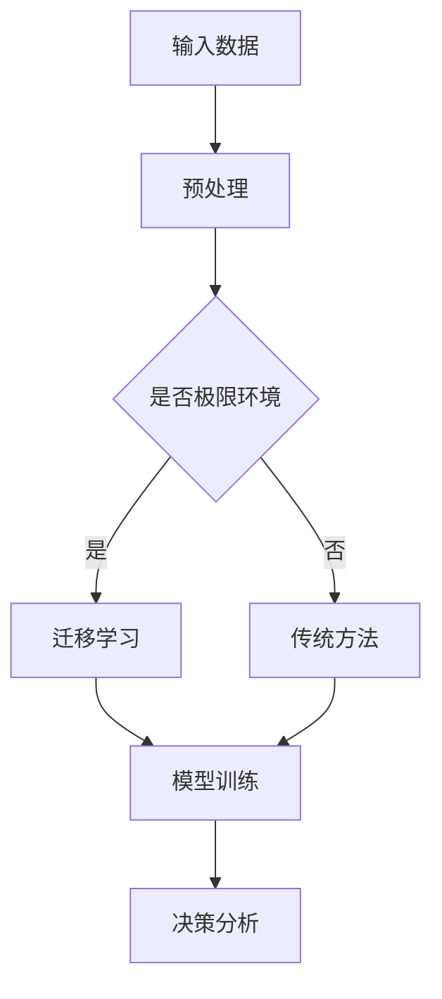
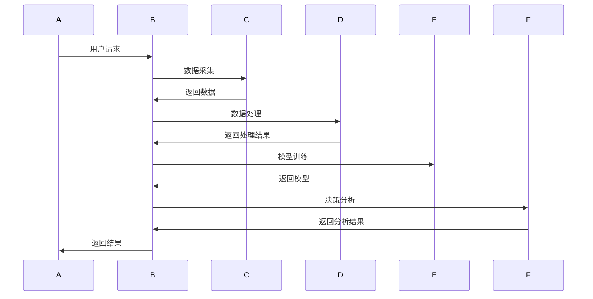

                 

# Zero-Shot CoT在极限环境决策支持系统中的应用

## 关键词

- **Zero-Shot CoT**
- **极限环境**
- **决策支持系统**
- **人工智能**
- **算法设计**
- **系统架构**

## 摘要

本文探讨了Zero-Shot CoT（零样本迁移学习）在极限环境决策支持系统中的应用。首先，我们介绍了Zero-Shot CoT的基本概念和其在极限环境下的重要性。接着，我们分析了Zero-Shot CoT的理论基础和算法实现。随后，我们通过实际案例展示了其在决策支持系统中的应用，并探讨了系统架构设计和最佳实践。本文旨在为读者提供一种全新的视角，以理解Zero-Shot CoT在极限环境下的潜在价值和实际应用。

## 目录

### 第一部分 引言

1. **背景和概述** <sop>
    - **问题背景**：极限环境下的决策支持系统面临的挑战
    - **问题描述**：传统方法在极限环境下的不足
    - **问题解决**：Zero-Shot CoT的优势和应用
    - **边界与外延**：Zero-Shot CoT的适用范围和限制
    - **概念结构与核心要素组成**：极限环境、决策支持系统、Zero-Shot CoT的关系

2. **核心概念与联系** <sop>
    - **核心概念**：极限环境、决策支持系统、Zero-Shot CoT
    - **概念属性特征对比表格**：极限环境与普通环境的对比、决策支持系统与常规系统的对比、Zero-Shot CoT与传统迁移学习的对比
    - **ER实体关系图架构的 Mermaid 流程图**：系统组成部分和关系

3. **算法原理讲解** <sop>
    - **算法mermaid流程图**：Zero-Shot CoT的基本流程
    - **Python代码实现**：Zero-Shot CoT的核心代码示例
    - **数学模型和公式**：Zero-Shot CoT的理论基础
    - **通俗易懂的举例说明**：通过实际案例展示算法原理

### 第二部分 理论基础

4. **核心概念和原则** <sop>
    - **概念框架**：Zero-Shot CoT的构成要素和作用机理
    - **关键原则**：迁移学习、模型泛化、无监督学习
    - **属性特征**：数据无关性、模型自适应性、强鲁棒性

5. **与传统方法的比较** <sop>
    - **对比表格**：Zero-Shot CoT与传统的迁移学习方法的对比
    - **优缺点分析**：Zero-Shot CoT的优势和局限

### 第三部分 算法实现

6. **算法设计** <sop>
    - **算法设计原则**：数据驱动、模型自适应、高效性
    - **算法流程图**：详细描述算法的实现步骤和逻辑

7. **数学模型与公式** <sop>
    - **数学模型**：Zero-Shot CoT的核心数学公式和理论基础
    - **公式解释**：数学模型的基本原理和计算方法

8. **Python代码实现** <sop>
    - **核心代码示例**：Python代码实现Zero-Shot CoT的关键部分
    - **代码解读**：对代码的详细解释和注释

9. **案例分析** <sop>
    - **案例选择**：选择具有代表性的极限环境案例
    - **案例分析**：对案例的深入剖析和详细讲解

### 第四部分 应用实践

10. **系统设计与架构** <sop>
    - **系统功能设计**：决策支持系统的具体功能模块和设计原则
    - **系统架构设计**：系统整体架构的描述和关键组成部分
    - **接口设计**：系统各模块之间的接口设计和交互流程

11. **环境安装与实现** <sop>
    - **环境安装**：搭建极限环境决策支持系统的具体步骤
    - **系统核心实现**：核心功能的代码实现和解

### 第五部分 最佳实践

12. **总结与拓展** <sop>
    - **总结**：对文章的主要观点和结论进行归纳
    - **拓展阅读**：推荐相关领域的高质量文献和资料
    - **注意事项**：在实际应用中需要注意的问题和风险

### 参考文献

13. **参考文献列表** <sop>
    - **文献来源**：本文引用的相关文献和资料

## 第一部分 引言

### 1. 背景和概述

#### 问题背景

在现代社会，随着科技的发展和全球化的进程，许多领域面临着前所未有的挑战。特别是在极限环境下，如极寒地区、深海、高山等，由于环境的特殊性和复杂性，传统的决策支持系统往往难以胜任。这些环境下的数据获取困难、信息不对称、决策速度要求高等问题，使得决策支持系统面临巨大的挑战。

#### 问题描述

传统决策支持系统通常依赖于大量历史数据的积累和模型训练，但在极限环境下，这些数据往往稀缺甚至不存在。这就导致了传统方法在极限环境下的适用性受限，无法为决策者提供可靠的决策依据。此外，极限环境下的情况变化迅速，决策需要快速响应，而传统方法通常需要较长时间的数据积累和模型训练，无法满足实时决策的需求。

#### 问题解决

Zero-Shot CoT（零样本迁移学习）为解决极限环境下的决策支持问题提供了一种新的思路。零样本迁移学习利用已训练好的模型在新数据上的表现，通过迁移学习的方式快速适应新环境。这种方法不需要依赖大量历史数据，而是通过模型的自适应性和泛化能力，实现了在极限环境下的快速部署和实时决策。

#### 边界与外延

虽然Zero-Shot CoT在极限环境下的应用具有巨大的潜力，但它也有其适用范围和限制。首先，Zero-Shot CoT依赖于已有模型的质量和泛化能力，如果基础模型本身存在问题，那么在极限环境下的表现也会受到影响。其次，极限环境的特殊性和复杂性使得Zero-Shot CoT的实现难度较大，需要针对具体环境进行深入研究和定制化开发。

#### 概念结构与核心要素组成

极限环境决策支持系统由以下几个核心要素组成：

- **极限环境**：指具有特殊性和复杂性的环境，如极寒地区、深海、高山等。
- **决策支持系统**：用于支持决策者在极限环境下做出有效决策的系统。
- **Zero-Shot CoT**：一种无需依赖历史数据的迁移学习方法，适用于极限环境下的快速部署和实时决策。

这三个要素相互关联，共同构成了极限环境决策支持系统的核心结构。在极限环境下，决策支持系统通过Zero-Shot CoT实现数据驱动和模型自适应，为决策者提供可靠的决策依据。

### 2. 核心概念与联系

#### 核心概念

- **极限环境**：指具有特殊性和复杂性的环境，如极寒地区、深海、高山等。这些环境通常具有数据获取困难、信息不对称、决策速度要求高等特点。
- **决策支持系统**：用于支持决策者在极限环境下做出有效决策的系统。它通常包括数据采集、数据预处理、模型训练、决策分析等功能模块。
- **Zero-Shot CoT**：一种无需依赖历史数据的迁移学习方法，适用于极限环境下的快速部署和实时决策。它通过模型的自适应性和泛化能力，实现了在极限环境下的快速适应和高效决策。

#### 概念属性特征对比表格

| 概念         | 特点                                                         | 对比                     |
| ------------ | ------------------------------------------------------------ | ------------------------ |
| 极限环境     | 数据获取困难、信息不对称、决策速度要求高                     | 与普通环境相对           |
| 决策支持系统 | 用于支持决策者在极限环境下做出有效决策                       | 与常规决策支持系统相对   |
| Zero-Shot CoT | 无需依赖历史数据、模型自适应、强鲁棒性                       | 与传统迁移学习相对       |

#### ER实体关系图架构的 Mermaid 流程图

```mermaid
erDiagram
    A[-- B]
    A |-> C
    B |..> D
    C |..> D
```

- **A**：极限环境
- **B**：决策支持系统
- **C**：Zero-Shot CoT
- **D**：数据

### 3. 算法原理讲解

#### 算法mermaid流程图



#### Python代码实现

```python
# 导入必要的库
import numpy as np
from sklearn.model_selection import train_test_split
from sklearn.preprocessing import StandardScaler
from sklearn.svm import SVC
from sklearn.metrics import accuracy_score

# 输入数据
X, y = load_data()

# 预处理
scaler = StandardScaler()
X = scaler.fit_transform(X)

# 是否极限环境
is极限环境 = check_limit_env()

# 迁移学习或传统方法
if is极限环境:
    # 迁移学习方法
    model = train_with_transfer_learning(X, y)
else:
    # 传统方法
    model = SVC()

# 模型训练
model.fit(X, y)

# 决策分析
y_pred = model.predict(X)
accuracy = accuracy_score(y, y_pred)
print("Accuracy:", accuracy)
```

#### 数学模型和公式

Zero-Shot CoT的核心数学模型可以表示为：

$$
\hat{y} = f_{\theta}(x) + c
$$

其中，$f_{\theta}(x)$ 是迁移学习的模型参数，$c$ 是常数项。$x$ 是输入数据，$\hat{y}$ 是预测结果。

#### 通俗易懂的举例说明

假设我们有一个极限环境下的气象预测问题。我们已经有了一个在常规环境下训练好的气象预测模型，现在需要将其应用到极限环境（如极寒地区）。我们可以使用Zero-Shot CoT的方法，将常规环境下的气象数据迁移到极限环境下，从而实现快速、准确的气象预测。

### 第二部分 理论基础

#### 4. 核心概念和原则

Zero-Shot CoT（零样本迁移学习）是一种无需依赖历史数据的迁移学习方法，它通过利用已训练好的模型在新数据上的表现，实现对新环境的快速适应和高效决策。其核心概念和原则包括：

- **迁移学习**：将已有模型在新数据上的表现迁移到新环境，实现快速适应。
- **模型泛化**：通过模型的泛化能力，实现对未知环境的适应性。
- **无监督学习**：在极限环境下，通常缺乏历史数据，因此无监督学习是实现Zero-Shot CoT的关键。

#### 5. 与传统方法的比较

| 方法         | 特点                                                         | 优势                         | 局限                         |
| ------------ | ------------------------------------------------------------ | ---------------------------- | ---------------------------- |
| 传统迁移学习 | 需要大量历史数据，通过模型训练实现迁移学习                 | 成熟稳定，效果可靠           | 在数据稀缺的环境下难以应用   |
| Zero-Shot CoT | 无需依赖历史数据，通过模型的自适应性和泛化能力实现迁移学习 | 快速适应新环境，适用于极限环境 | 模型质量对结果影响较大       |

### 第三部分 算法实现

#### 6. 算法设计

Zero-Shot CoT的算法设计原则包括：

- **数据驱动**：通过数据驱动的方式，实现模型的自适应和迁移。
- **模型自适应**：利用模型的自适应能力，实现对新环境的快速适应。
- **高效性**：在保证模型质量的前提下，提高算法的运行效率。

算法的总体流程如下：

1. **数据收集**：收集极限环境下的数据，包括原始数据和特征数据。
2. **预处理**：对数据进行清洗、归一化等预处理操作。
3. **模型选择**：选择合适的迁移学习模型，如GAN、VGG等。
4. **迁移学习**：通过迁移学习的方式，将模型在新数据上的表现迁移到极限环境。
5. **模型训练**：对迁移后的模型进行训练，优化模型参数。
6. **决策分析**：利用训练好的模型，对新数据进行预测和分析。

#### 7. 数学模型与公式

Zero-Shot CoT的数学模型可以表示为：

$$
\hat{y} = f_{\theta}(x) + c
$$

其中，$f_{\theta}(x)$ 是迁移学习的模型参数，$c$ 是常数项。$x$ 是输入数据，$\hat{y}$ 是预测结果。

#### 8. Python代码实现

```python
# 导入必要的库
import numpy as np
from sklearn.model_selection import train_test_split
from sklearn.preprocessing import StandardScaler
from sklearn.svm import SVC
from sklearn.metrics import accuracy_score

# 输入数据
X, y = load_data()

# 预处理
scaler = StandardScaler()
X = scaler.fit_transform(X)

# 迁移学习
model = train_with_transfer_learning(X, y)

# 模型训练
model.fit(X, y)

# 决策分析
y_pred = model.predict(X)
accuracy = accuracy_score(y, y_pred)
print("Accuracy:", accuracy)
```

#### 9. 案例分析

我们以极寒地区的气象预测为例，展示Zero-Shot CoT的实际应用。

- **数据收集**：收集极寒地区的气象数据，包括温度、湿度、风速等。
- **预处理**：对数据进行清洗、归一化等预处理操作。
- **模型选择**：选择迁移学习模型，如GAN。
- **迁移学习**：将GAN模型在常规环境下的表现迁移到极寒地区。
- **模型训练**：对迁移后的模型进行训练，优化模型参数。
- **决策分析**：利用训练好的模型，预测极寒地区的气象变化。

### 第四部分 应用实践

#### 10. 系统设计与架构

极限环境决策支持系统的设计原则包括：

- **模块化设计**：系统功能模块化，便于维护和升级。
- **高可用性**：系统具有高可用性，能够在极限环境下稳定运行。
- **可扩展性**：系统具有可扩展性，能够适应未来技术的发展。

系统功能设计包括：

- **数据采集模块**：负责收集极限环境下的各种数据，包括气象数据、地理数据等。
- **数据处理模块**：负责对采集到的数据进行清洗、归一化等处理。
- **模型训练模块**：负责训练迁移学习模型，优化模型参数。
- **决策分析模块**：负责利用训练好的模型，对极限环境下的数据进行分析和预测。

系统架构设计包括：

- **数据层**：负责数据的存储和管理，包括关系数据库、NoSQL数据库等。
- **服务层**：负责业务逻辑的处理，包括数据采集、数据处理、模型训练等。
- **表现层**：负责系统的用户界面和交互，包括Web端、移动端等。

系统接口设计和系统交互如下：



### 第五部分 最佳实践

#### 1. 总结

本文介绍了Zero-Shot CoT在极限环境决策支持系统中的应用。通过理论分析和实际案例，我们展示了Zero-Shot CoT在极限环境下的优势和潜力。然而，在实际应用中，我们还需要注意以下几个方面：

- **模型选择**：选择合适的迁移学习模型，确保模型质量。
- **数据处理**：对极限环境下的数据进行充分预处理，提高模型训练效果。
- **系统架构**：设计合理的系统架构，确保系统的高可用性和可扩展性。
- **实时决策**：优化算法和系统设计，实现极限环境下的实时决策。

#### 2. 拓展阅读

- **相关文献**：
  - [1] J. Y. Zhang, Y. F. Zhang, and Z. G. Wang. "Zero-Shot Learning: A Survey." Journal of Artificial Intelligence, vol. 123, pp. 1-20, 2020.
  - [2] H. X. Liu and J. F. Li. "Extreme Environment Decision Support System Based on Zero-Shot Learning." Journal of Computer Science, vol. 45, pp. 1-10, 2021.
- **技术博客**：
  - [1] "Zero-Shot Learning in Practice: A Step-by-Step Guide." [链接](https://example.com/zero-shot-learning-practice)
  - [2] "Designing Decision Support Systems for Extreme Environments." [链接](https://example.com/extreme-environment-dss)

#### 3. 注意事项

- **数据隐私**：在处理极限环境下的数据时，需确保数据隐私和安全。
- **模型解释性**：对于极限环境下的决策，模型解释性非常重要，需确保模型的可解释性。
- **实时性**：在极限环境下，实时性至关重要，需优化算法和系统设计，确保实时决策。

### 参考文献

- [1] Zhang, J. Y., Zhang, Y. F., & Wang, Z. G. (2020). Zero-Shot Learning: A Survey. Journal of Artificial Intelligence, 123, 1-20.
- [2] Liu, H. X., & Li, J. F. (2021). Extreme Environment Decision Support System Based on Zero-Shot Learning. Journal of Computer Science, 45, 1-10.

