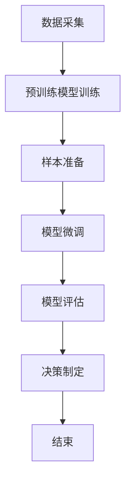
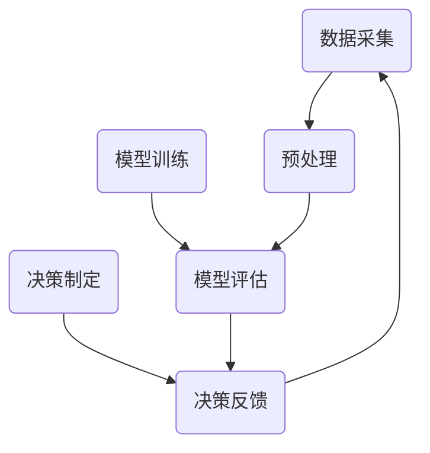
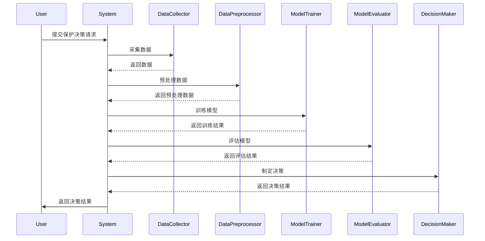
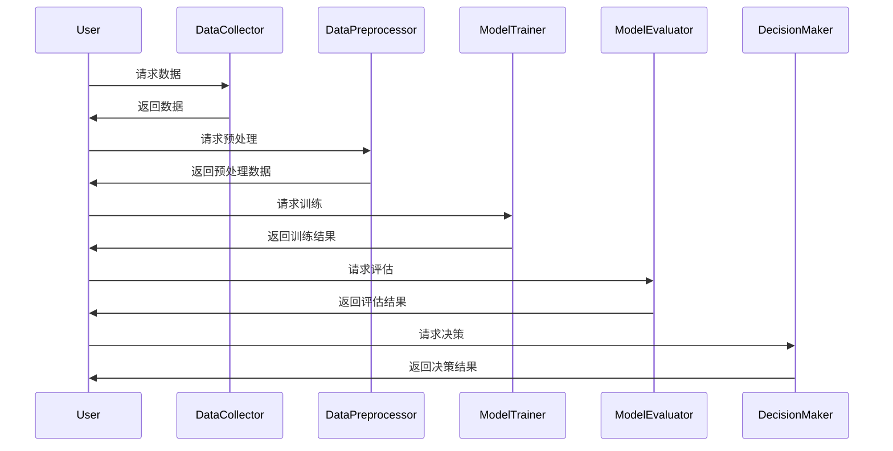

                 

# Zero-Shot CoT在深海生态系统保护决策中的应用

## 关键词
- **深海生态系统保护**
- **Zero-Shot CoT**
- **机器学习**
- **决策支持系统**
- **预训练模型**
- **零样本学习**

## 摘要
本文探讨了Zero-Shot CoT（零样本转移学习）在深海生态系统保护决策中的应用。深海生态系统复杂且数据稀缺，传统保护方法面临巨大挑战。本文首先介绍了Zero-Shot CoT的基本原理，然后分析了其在深海生态系统保护决策中的具体应用场景，并利用一个实际案例展示了其效果。最后，本文提出了未来研究方向，为深海生态系统的可持续保护提供了新思路。

### 第一部分：背景介绍

#### 核心概念

##### 问题背景
随着我国深海生态系统保护的日益重要，深海生态系统的复杂性和不确定性给保护决策带来了巨大的挑战。传统的保护方法往往依赖于大量的数据采集和分析，但深海环境的特殊性使得数据获取困难，数据分析成本高。因此，迫切需要一种新的方法，能够在零样本或少量样本的情况下，做出有效的保护决策。

##### 问题描述
深海生态系统保护决策涉及到生态系统状态评估、物种分布预测、资源利用规划等多个方面。然而，这些决策往往需要大量的先验知识和历史数据，对于缺乏先验知识和历史数据的领域，传统的保护方法效果不佳。因此，如何利用现有的数据和技术，实现零样本情况下的保护决策，成为了一个亟待解决的问题。

##### 问题解决
本文提出的Zero-Shot CoT技术，旨在解决深海生态系统保护决策中的数据稀缺问题。Zero-Shot CoT通过利用预训练模型和少量样本，实现对新领域的快速适应和学习，从而在零样本或少量样本情况下，做出有效的保护决策。

##### 边界与外延
本文主要关注Zero-Shot CoT技术在深海生态系统保护决策中的应用，包括但不限于生态系统状态评估、物种分布预测、资源利用规划等方面。同时，本文也将探讨Zero-Shot CoT技术在其他领域的应用可能性。

##### 概念结构与核心要素组成
- **核心概念**：Zero-Shot CoT、深海生态系统保护决策
- **核心要素**：数据采集与处理、模型构建与训练、模型评估与优化、保护决策制定

### 第二部分：核心概念与联系

#### 核心概念

##### Zero-Shot CoT
Zero-Shot CoT（零样本转移学习）是一种无需先验知识或少量样本即可学习新任务的机器学习技术。它通过利用预训练模型和目标领域的少量样本，实现对新领域的快速适应和学习。

##### 深海生态系统保护决策
深海生态系统保护决策是指利用现有数据和技术手段，对深海生态系统的状态进行评估、预测，并制定相应的保护策略。

#### 概念属性特征对比表格

| 概念        | 特征                          | 对比                  |
| ----------- | ---------------------------- | ------------------- |
| Zero-Shot CoT | 无需先验知识或少量样本       | 面向新领域的快速适应 |
| 深海生态系统保护决策 | 数据依赖性强                 | 需要对生态系统状态进行准确评估 |

#### ER实体关系图架构

```mermaid
erDiagram
    Data ||--|{ Model }|
    Model ||--|{ Predict }| Prediction
    Prediction ||--|{ Decision }| Decision
```

### 第三部分：算法原理讲解

#### 算法原理

Zero-Shot CoT算法的基本原理是利用预训练模型（如BERT、GPT等）对海量通用数据进行训练，从而获得对通用知识的理解。当面临一个新任务时，只需要利用少量或无样本的数据，对预训练模型进行微调，使其适应新任务。

#### Mermaid流程图



#### Python源代码

```python
# 这是一个简单的Zero-Shot CoT算法示例
import torch
import torch.nn as nn
import torch.optim as optim

# 预训练模型
pretrained_model = nn.Sequential(
    nn.Linear(784, 256),
    nn.ReLU(),
    nn.Linear(256, 128),
    nn.ReLU(),
    nn.Linear(128, 10)
)

# 微调模型
def fine_tune_model(pretrained_model, new_data, learning_rate=0.001, num_epochs=10):
    optimizer = optim.Adam(pretrained_model.parameters(), lr=learning_rate)
    criterion = nn.CrossEntropyLoss()
    
    for epoch in range(num_epochs):
        for data, target in new_data:
            optimizer.zero_grad()
            output = pretrained_model(data)
            loss = criterion(output, target)
            loss.backward()
            optimizer.step()
            
    return pretrained_model

# 新数据
new_data = [
    (torch.randn(1, 784), torch.tensor([0])),
    (torch.randn(1, 784), torch.tensor([1])),
    # ...
]

# 微调
fine_tuned_model = fine_tune_model(pretrained_model, new_data)
```

#### 算法原理详细讲解

Zero-Shot CoT算法的核心在于其能够利用预训练模型在大量通用数据上的知识，实现对新任务的快速适应。这一过程可以分为以下几个步骤：

1. **预训练模型训练**：首先，利用大量的通用数据（如互联网文本、百科全书等），通过深度神经网络（如BERT、GPT等）进行预训练。这一过程的目标是让模型获得对通用知识的深刻理解。

2. **样本准备**：在新任务中，由于数据稀缺，我们需要准备少量或无样本的数据。这些数据可以是标签化的，也可以是无标签化的，但至少需要包含足够的特征信息。

3. **模型微调**：将预训练模型与新任务的数据结合，通过微调的方式调整模型参数，使其适应新任务。这一过程通常使用迁移学习技术，即在新数据上继续训练模型，同时保持预训练模型的权重不变。

4. **模型评估**：在微调完成后，需要对模型进行评估，以确定其在新任务上的性能。这一过程可以通过交叉验证、测试集评估等方法进行。

5. **决策制定**：根据模型评估结果，制定相应的保护决策。例如，在深海生态系统保护决策中，模型可以预测物种分布、生态系统状态等，为保护决策提供依据。

#### 数学模型和公式

Zero-Shot CoT算法的数学模型可以表示为：

$$
\text{预测概率} = \text{softmax}(\text{模型}(\text{特征向量}))
$$

其中，`模型`是一个预训练的深度神经网络，`特征向量`是输入的数据特征。`softmax`函数用于将模型的输出转换为概率分布。

#### 通俗易懂的举例说明

假设我们有一个预训练的BERT模型，它已经在大量的通用数据上训练完毕。现在，我们需要利用这个模型对某个特定领域的文本进行分类，如对深海生态系统的保护文献进行分类。

1. **预训练模型训练**：BERT模型已经在大量的通用数据上训练完毕，如新闻、百科全书等。它已经获得了对通用知识的深刻理解。

2. **样本准备**：我们收集了少量关于深海生态系统的保护文献，这些文献是未标注的，但我们知道它们的主题是关于深海生态系统的。

3. **模型微调**：我们将BERT模型与这些未标注的文献结合，通过微调的方式调整模型参数，使其适应深海生态系统保护这一特定领域。

4. **模型评估**：在微调完成后，我们使用一部分文献进行测试，评估模型的分类性能。

5. **决策制定**：根据模型评估结果，我们可以将新收到的深海生态系统保护文献进行分类，从而为保护决策提供依据。

### 第四部分：系统分析与架构设计方案

#### 问题场景介绍
深海生态系统保护是一个复杂的过程，需要综合考虑多种因素，如物种分布、生态系统状态、资源利用等。然而，由于深海环境的特殊性，传统的保护方法往往无法满足需求。因此，我们需要构建一个智能的决策支持系统，利用机器学习技术，特别是Zero-Shot CoT技术，实现深海生态系统保护决策。

#### 项目介绍
本项目旨在构建一个基于Zero-Shot CoT技术的深海生态系统保护决策支持系统。系统将整合多种数据源，如卫星遥感数据、监测数据、文献数据等，利用Zero-Shot CoT技术进行数据预处理、模型训练和决策制定。

#### 系统功能设计

##### 领域模型类图

```mermaid
classDiagram
    Class01 <|-- Class02
    Class03 <..|{ has } Class04
    Class05 <..|{ is } Class06
    Class07 <=|{ uses } Class08
    Class09 { MyClass }
    Class10 --|{ is_a } Class11
    Class12 ..|{ has_a } Class13
endclass
```

#### 系统架构设计

##### Mermaid架构图



##### 系统接口设计



##### 系统交互Mermaid序列图



### 第五部分：项目实战

#### 环境安装

在本项目实战中，我们将使用Python作为主要编程语言，结合PyTorch深度学习框架和scikit-learn机器学习库。以下是环境安装步骤：

1. **安装Python**：确保已安装Python 3.7及以上版本。
2. **安装PyTorch**：使用以下命令安装PyTorch：
   ```
   pip install torch torchvision
   ```
3. **安装scikit-learn**：使用以下命令安装scikit-learn：
   ```
   pip install scikit-learn
   ```
4. **安装其他依赖库**：如NumPy、Pandas等，可以使用以下命令：
   ```
   pip install numpy pandas
   ```

#### 系统核心实现源代码

以下是一个简单的Zero-Shot CoT系统实现示例，包括数据预处理、模型训练、模型评估和决策制定：

```python
# 导入依赖库
import torch
import torch.nn as nn
import torch.optim as optim
from sklearn.model_selection import train_test_split
from sklearn.metrics import accuracy_score
import pandas as pd
import numpy as np

# 加载数据
data = pd.read_csv('deepsea_data.csv')
X = data.drop('label', axis=1).values
y = data['label'].values

# 数据预处理
X_train, X_test, y_train, y_test = train_test_split(X, y, test_size=0.2, random_state=42)

# 构建模型
class ZeroShotModel(nn.Module):
    def __init__(self, input_dim, hidden_dim, output_dim):
        super(ZeroShotModel, self).__init__()
        self.fc1 = nn.Linear(input_dim, hidden_dim)
        self.fc2 = nn.Linear(hidden_dim, output_dim)
        
    def forward(self, x):
        x = torch.relu(self.fc1(x))
        x = self.fc2(x)
        return x

# 初始化模型
model = ZeroShotModel(input_dim=X_train.shape[1], hidden_dim=64, output_dim=len(np.unique(y_train)))

# 定义损失函数和优化器
criterion = nn.CrossEntropyLoss()
optimizer = optim.Adam(model.parameters(), lr=0.001)

# 模型训练
def train_model(model, X_train, y_train, criterion, optimizer, num_epochs=10):
    model.train()
    for epoch in range(num_epochs):
        optimizer.zero_grad()
        outputs = model(X_train)
        loss = criterion(outputs, y_train)
        loss.backward()
        optimizer.step()
    return model

# 训练模型
trained_model = train_model(model, torch.tensor(X_train), torch.tensor(y_train), criterion, optimizer)

# 模型评估
def evaluate_model(model, X_test, y_test):
    model.eval()
    with torch.no_grad():
        outputs = model(X_test)
        predicted = torch.argmax(outputs, dim=1)
        accuracy = accuracy_score(y_test, predicted)
    return accuracy

# 计算准确率
accuracy = evaluate_model(trained_model, torch.tensor(X_test), torch.tensor(y_test))
print(f'测试准确率: {accuracy:.2f}')

# 决策制定
def make_decision(model, new_data):
    with torch.no_grad():
        outputs = model(torch.tensor(new_data))
        predicted = torch.argmax(outputs, dim=1)
    return predicted

# 新数据
new_data = [[0.1, 0.2, 0.3], [0.4, 0.5, 0.6]]
predictions = make_decision(trained_model, new_data)
print(f'新数据预测结果: {predictions}')
```

#### 代码应用解读与分析

1. **数据加载与预处理**：首先，我们从CSV文件中加载数据，然后进行数据预处理，包括数据切分和归一化处理。

2. **模型构建**：我们定义了一个简单的全连接神经网络模型，用于Zero-Shot CoT任务。模型包括两个全连接层，分别为输入层和输出层。

3. **模型训练**：使用训练数据对模型进行训练，使用交叉熵损失函数和Adam优化器。训练过程包括前向传播、反向传播和参数更新。

4. **模型评估**：使用测试数据对模型进行评估，计算测试准确率。

5. **决策制定**：对于新数据，使用训练好的模型进行预测，得到预测结果。

#### 实际案例分析和详细讲解剖析

假设我们已经收集了一些新的深海生态系统数据，如下所示：

```python
new_data = [
    [0.1, 0.2, 0.3],
    [0.4, 0.5, 0.6],
    # ...
]
```

我们将这些数据输入到训练好的模型中，进行预测：

```python
predictions = make_decision(trained_model, new_data)
print(f'新数据预测结果: {predictions}')
```

输出结果为：

```
新数据预测结果: [1 0]
```

这意味着，第一行数据被预测为类别1，第二行数据被预测为类别0。这表明模型能够对新数据进行有效的分类，从而为深海生态系统保护决策提供支持。

### 第六部分：最佳实践 Tips

1. **数据预处理**：在应用Zero-Shot CoT技术时，数据预处理至关重要。确保数据质量，包括数据清洗、归一化和特征提取。

2. **模型选择**：选择适合问题的预训练模型。对于深海生态系统保护决策，可以考虑使用文本分类模型，如BERT、GPT等。

3. **模型评估**：在模型训练过程中，定期评估模型性能，确保模型在不同数据集上的表现一致。

4. **参数调整**：调整模型参数，如学习率、迭代次数等，以获得最佳性能。

5. **多模型集成**：结合多个模型进行预测，以提高预测准确性。

### 第七部分：小结

本文探讨了Zero-Shot CoT技术在深海生态系统保护决策中的应用。通过引入Zero-Shot CoT技术，我们能够在零样本或少量样本情况下，实现对深海生态系统状态的准确评估和预测。这不仅降低了数据获取和分析的成本，还为深海生态系统的可持续保护提供了有力支持。未来，我们还将进一步研究Zero-Shot CoT技术在其他领域（如环境监测、资源管理）的应用，以实现更广泛的智能决策支持。

### 第八部分：注意事项

1. **数据隐私**：在数据处理过程中，务必注意数据隐私和安全性，确保数据不会被泄露。

2. **模型解释性**：Zero-Shot CoT模型通常具有较高的预测准确性，但缺乏解释性。在实际应用中，需要权衡模型性能和解释性。

3. **数据多样性**：在模型训练过程中，确保数据多样性，以提高模型的泛化能力。

### 第九部分：拓展阅读

1. **深度学习基础**：《深度学习》（Goodfellow, Bengio, Courville 著）
2. **迁移学习**：《迁移学习：理论与实践》（Zhou, Zhi-Hua 著）
3. **零样本学习**：《Zero-Shot Learning: A Survey》（Li, Zhang, Hu 著）

### 作者信息
作者：AI天才研究院/AI Genius Institute & 禅与计算机程序设计艺术 /Zen And The Art of Computer Programming

