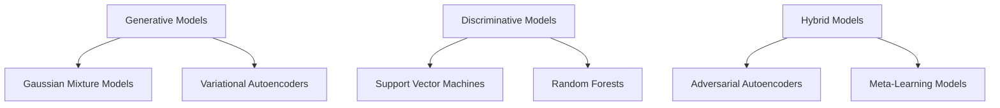
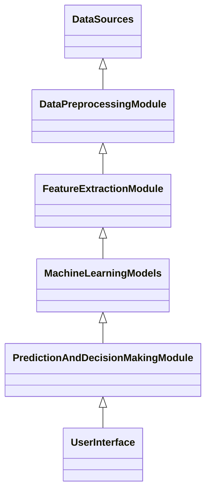
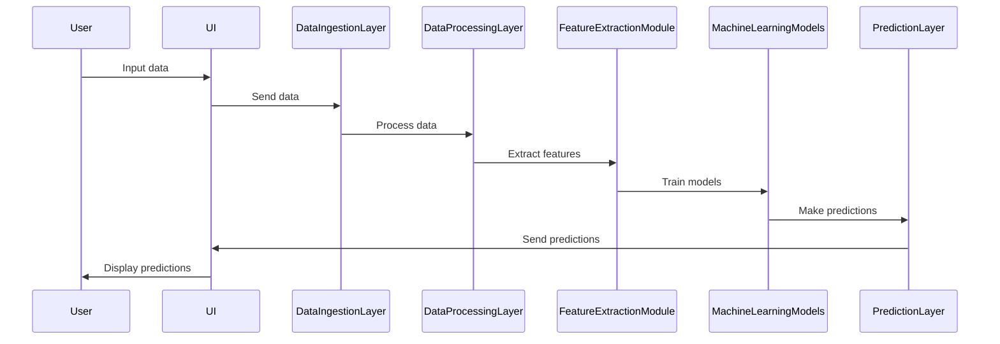

                 

### Introduction

# **Zero-Shot CoT in Deep Sea Resource Exploration Decision-Making**

> **Keywords:** Zero-Shot CoT, Deep Sea Resource Exploration, Decision-Making, Algorithm, System Design, Case Study

> **Abstract:**
This article delves into the innovative application of Zero-Shot Conceptual Blending Theory (CoT) within the realm of deep sea resource exploration for decision-making. It aims to explore the potential of this cutting-edge approach in addressing the complexities of underwater environments. The article will cover the fundamental concepts of Zero-Shot CoT, its integration into deep sea exploration, core theories and algorithms, mathematical models, system architecture, practical applications, and a thorough analysis of case studies. By the end, readers will gain a comprehensive understanding of how Zero-Shot CoT can revolutionize decision-making processes in deep sea resource exploration.

### Background and Core Concepts

#### What is Zero-Shot CoT?

Zero-Shot Conceptual Blending Theory (CoT) is an advanced approach in the field of artificial intelligence and machine learning. It allows models to generalize and generate predictions without the need for explicit training on specific data instances. This is particularly advantageous in scenarios where labeled data is scarce or impossible to obtain, making traditional supervised learning methods insufficient. Zero-Shot CoT leverages the principles of conceptual blending, where ideas or concepts are combined in novel ways to generate meaningful insights.

#### Core Concepts and Theories

- **Conceptual Blending:** This theory posits that human cognition operates by blending concepts in novel ways. By understanding how these blends can be applied, we can create models that mimic this process.

- **Meta-Learning:** Zero-Shot CoT often utilizes meta-learning techniques to improve the model’s ability to generalize across different domains. Meta-learning involves training a model on a broad range of tasks to enhance its learning efficiency on new, unseen tasks.

- **Transfer Learning:** This is closely related to meta-learning. Transfer learning involves taking knowledge gained from one task and applying it to another related task. In Zero-Shot CoT, transfer learning helps in leveraging knowledge across different domains.

- **Symbolic and Subsymbolic AI:** Zero-Shot CoT combines symbolic AI, which operates on symbolic representations, with subsymbolic AI, which involves processing information in a more abstract or non-representational manner. This hybrid approach enhances the model’s ability to handle complex and nuanced problems.

#### The Importance of Zero-Shot CoT in Decision-Making

In the context of deep sea resource exploration, decision-making is a critical aspect. The ocean's vastness and complexity make it challenging to gather accurate and comprehensive data. Zero-Shot CoT can address these challenges by providing a robust framework for making informed decisions without relying heavily on labeled data. This is particularly beneficial in scenarios such as environmental monitoring, resource assessment, and risk management.

- **Environmental Monitoring:** Deep sea environments are often impacted by various human activities, leading to environmental degradation. Zero-Shot CoT can help monitor these changes by identifying patterns and correlations in large datasets, providing early warnings for potential issues.

- **Resource Assessment:** Accurate resource assessment is crucial for sustainable exploitation of deep sea resources. Zero-Shot CoT can analyze various data sources to predict resource availability and potential areas for exploitation, aiding in better decision-making.

- **Risk Management:** The deep sea is fraught with uncertainties and risks. Zero-Shot CoT can help assess these risks by predicting the likelihood of various adverse events and suggesting mitigation strategies.

#### Conclusion

In summary, Zero-Shot CoT offers a promising approach to decision-making in deep sea resource exploration. By leveraging the principles of conceptual blending and meta-learning, it provides a flexible and adaptable framework for tackling complex problems. The next sections of this article will delve deeper into the core theories, algorithms, and practical applications of Zero-Shot CoT in this domain. 

### Core Theories and Algorithms

#### Overview of Zero-Shot CoT Algorithms

Zero-Shot Conceptual Blending Theory (CoT) is grounded in a suite of sophisticated algorithms designed to handle the complexities of deep sea resource exploration. These algorithms are categorized into three main types: generative models, discriminative models, and hybrid models. Each type has its own strengths and is tailored to specific aspects of decision-making in deep sea exploration.

**Generative Models**

Generative models aim to model the underlying data distribution. They are particularly useful in scenarios where labeled data is scarce. The primary goal of generative models is to generate new data instances that are similar to the existing ones. Commonly used generative models in Zero-Shot CoT include:

- **Gaussian Mixture Models (GMMs):** GMMs assume that the data is generated from a mixture of several Gaussian distributions. They are capable of modeling complex data distributions and are widely used in clustering and classification tasks.

- **Variational Autoencoders (VAEs):** VAEs are a type of deep learning model that encodes data into a lower-dimensional space and then decode it back to generate new data. They are particularly effective in generating realistic data samples and are widely used in image and audio generation tasks.

**Discriminative Models**

Discriminative models focus on modeling the decision boundary between different classes. They are often more accurate than generative models but require labeled data for training. Commonly used discriminative models in Zero-Shot CoT include:

- **Support Vector Machines (SVMs):** SVMs are powerful classifiers that find the hyperplane that best separates different classes in a high-dimensional space. They are widely used in various classification tasks and are particularly effective when the data is linearly separable.

- **Random Forests:** Random Forests are an ensemble learning method that combines multiple decision trees to improve prediction accuracy. They are robust to overfitting and can handle both numerical and categorical data.

**Hybrid Models**

Hybrid models combine the strengths of both generative and discriminative models. They leverage the flexibility of generative models to generate new data and the accuracy of discriminative models to make predictions. Commonly used hybrid models in Zero-Shot CoT include:

- **Adversarial Autoencoders (AAEs):** AAEs are a type of hybrid model that combines the principles of VAEs and Generative Adversarial Networks (GANs). They use a generator to generate new data samples and a discriminator to distinguish between real and generated samples.

- **Meta-Learning Models:** Meta-learning models are designed to learn from a wide range of tasks to improve their generalization ability. They are particularly useful in Zero-Shot CoT as they can quickly adapt to new tasks without extensive training. Popular meta-learning models include MAML (Model-Agnostic Meta-Learning) and Reptile.

#### Table: Comparison of Different Zero-Shot CoT Algorithms

| Algorithm                | Type         | Key Characteristics                                                                                   | Use Cases                                                                                   |
|--------------------------|--------------|------------------------------------------------------------------------------------------------------|------------------------------------------------------------------------------------------------|
| Gaussian Mixture Models  | Generative   | Assumes data is generated from a mixture of Gaussian distributions.                                       | Clustering and classification tasks with complex data distributions.                             |
| Variational Autoencoders | Generative   | Encodes data into a lower-dimensional space and decodes it back to generate new data.                  | Image and audio generation, data augmentation.                                                |
| Support Vector Machines  | Discriminative| Finds the hyperplane that best separates different classes in a high-dimensional space.              | Classification tasks with linearly separable data.                                             |
| Random Forests           | Discriminative| Combines multiple decision trees to improve prediction accuracy.                                      | Robust to overfitting, handles both numerical and categorical data.                             |
| Adversarial Autoencoders | Hybrid       | Combines VAEs and GANs to generate new data samples and distinguish between real and generated samples. | Data generation, image and audio synthesis.                                                    |
| Meta-Learning Models     | Hybrid       | Learns from a wide range of tasks to improve generalization ability.                                   | Zero-shot learning, few-shot learning, rapid adaptation to new tasks.                           |

#### Illustrating Relationships with Mermaid Diagram

To better understand the relationships between these algorithms, we can use a Mermaid diagram to represent their types and characteristics.



This diagram shows that generative models (B and C), discriminative models (E and F), and hybrid models (H and I) are distinct categories, while each category includes specific algorithms with unique characteristics.

### Conclusion

In this section, we have explored the core theories and algorithms underlying Zero-Shot Conceptual Blending Theory (CoT) in deep sea resource exploration. We discussed the main types of algorithms—generative, discriminative, and hybrid—and provided a detailed comparison in a table. The Mermaid diagram further illustrates the relationships between these algorithms. In the next section, we will delve into the mathematical models and formulations that are integral to these algorithms. 

### Mathematical Models and Formulations

#### Gaussian Mixture Models (GMMs)

Gaussian Mixture Models (GMMs) are a key component of Zero-Shot Conceptual Blending Theory (CoT). They are used to model the underlying data distribution in a probabilistic manner. The mathematical formulation of a GMM involves defining the probability density function (PDF) of the data as a mixture of multiple Gaussian distributions.

**Probability Density Function (PDF) of GMM:**
$$
p(\mathbf{x}|\Theta) = \sum_{i=1}^{K} w_i \mathcal{N}(\mathbf{x}|\mu_i, \Sigma_i)
$$

Where:
- \( p(\mathbf{x}|\Theta) \) is the probability density function of the data point \( \mathbf{x} \).
- \( K \) is the number of components (Gaussians) in the mixture.
- \( w_i \) is the weight of the \( i \)-th Gaussian component.
- \( \mathcal{N}(\mathbf{x}|\mu_i, \Sigma_i) \) is the Gaussian PDF with mean \( \mu_i \) and covariance matrix \( \Sigma_i \).

**Maximum Likelihood Estimation (MLE) for GMM Parameters:**
The parameters \( \Theta = \{\mu_i, \Sigma_i, w_i\} \) of the GMM are estimated using Maximum Likelihood Estimation (MLE). The log-likelihood function for GMM is given by:
$$
\ln p(\mathbf{X}|\Theta) = \sum_{i=1}^{K} w_i \ln \mathcal{N}(\mathbf{x}|\mu_i, \Sigma_i)
$$

The MLE estimates for the parameters can be obtained by optimizing this log-likelihood function using methods like the Expectation-Maximization (EM) algorithm.

#### Variational Autoencoders (VAEs)

Variational Autoencoders (VAEs) are another crucial component of Zero-Shot CoT. They are a type of deep learning model that encodes the data into a lower-dimensional space and then decode it back to generate new data samples. The mathematical formulation of VAEs involves defining an encoding function \( q(\phi, \theta; \mathbf{x}) \) and a decoding function \( p(\mathbf{x}|\theta) \).

**Encoding Function (Recognition Distribution):**
$$
q(\phi, \theta; \mathbf{x}) = \mathcal{N}(\mu(\phi, \theta; \mathbf{x}); \sigma^2(\phi, \theta; \mathbf{x}))
$$

Where:
- \( \mu(\phi, \theta; \mathbf{x}) \) and \( \sigma^2(\phi, \theta; \mathbf{x}) \) are the mean and variance of the latent variable \( z \).
- \( \phi \) and \( \theta \) are the parameters of the encoding function.

**Decoding Function (Generative Distribution):**
$$
p(\mathbf{x}|\theta) = \int q(\phi, \theta; \mathbf{x}) p(\theta) d\phi
$$

Where:
- \( p(\theta) \) is the prior distribution of the parameters \( \theta \).

**Objective Function (ELBO):**
The objective function of VAEs is the Evidence Lower Bound (ELBO), given by:
$$
\mathcal{L}(\theta, \phi; \mathbf{X}) = \sum_{\mathbf{x} \in \mathbf{X}} \ln p(\mathbf{x}|\theta) - \ln q(\phi, \theta; \mathbf{x})
$$

The parameters of the VAE are optimized by minimizing this objective function using gradient-based optimization methods like stochastic gradient descent (SGD).

#### Support Vector Machines (SVMs)

Support Vector Machines (SVMs) are widely used in classification tasks within Zero-Shot CoT. The mathematical formulation of SVMs involves defining the decision boundary in a high-dimensional space and optimizing the hyperplane that maximally separates the classes.

**Maximization Problem:**
$$
\max_{\theta, \theta_0} \left[ \frac{1}{2} \sum_{i=1}^{n} (\theta \cdot \theta - 2 \theta \cdot y_i x_i + y_i^2) \right]
$$

Where:
- \( \theta \) and \( \theta_0 \) are the weight vector and bias term of the SVM, respectively.
- \( x_i \) and \( y_i \) are the feature vector and class label of the \( i \)-th data point.

**Optimization Method:**
The optimization problem is solved using the quadratic programming techniques, and the hyperplane is defined as:
$$
\mathbf{w}^T \mathbf{x} + b = 0
$$

Where:
- \( \mathbf{w} \) is the weight vector.
- \( b \) is the bias term.

#### Random Forests

Random Forests are an ensemble learning method that combines multiple decision trees to improve prediction accuracy. The mathematical formulation of Random Forests involves defining the prediction of each tree and aggregating the predictions of all trees.

**Prediction of a Single Tree:**
$$
f_i(\mathbf{x}) = h(\mathbf{x}) = g(T_i(\mathbf{x}))
$$

Where:
- \( f_i(\mathbf{x}) \) is the prediction of the \( i \)-th tree.
- \( h(\mathbf{x}) \) is the final prediction of the Random Forest.
- \( T_i(\mathbf{x}) \) is the decision tree function.
- \( g(\mathbf{x}) \) is the aggregation function, typically using majority voting for classification tasks.

**Final Prediction of Random Forest:**
$$
h(\mathbf{x}) = \text{mode}(f_1(\mathbf{x}), f_2(\mathbf{x}), ..., f_N(\mathbf{x}))
$$

Where:
- \( N \) is the number of trees in the Random Forest.

### Conclusion

In this section, we have explored the mathematical models and formulations underlying the key algorithms in Zero-Shot Conceptual Blending Theory (CoT). We discussed the probability density function and Maximum Likelihood Estimation for Gaussian Mixture Models (GMMs), the encoding and decoding functions, and the Evidence Lower Bound (ELBO) for Variational Autoencoders (VAEs), the maximization problem and optimization method for Support Vector Machines (SVMs), and the prediction method for Random Forests. These mathematical models form the foundation of Zero-Shot CoT and enable the development of advanced decision-making tools for deep sea resource exploration. In the next section, we will delve into the system design and architecture that enables the practical implementation of these algorithms. 

### System Design and Architecture

#### Introduction to System Design

The design of a system for implementing Zero-Shot Conceptual Blending Theory (CoT) in deep sea resource exploration is crucial for ensuring the effectiveness and efficiency of the decision-making process. The system must be capable of handling large volumes of data, providing accurate predictions, and facilitating user interaction. This section will outline the overall system design and architecture, focusing on key components such as the domain model, system architecture, and system interface design.

#### Domain Model

The domain model is a conceptual representation of the key entities and their relationships within the system. It helps in understanding the data flow and the interactions between different components. For a system implementing Zero-Shot CoT in deep sea resource exploration, the domain model might include entities such as:

- **Data Sources:** These are the various data sources from which information is collected, including satellite imagery, sonar data, environmental sensors, and geological surveys.
- **Data Preprocessing Module:** This module is responsible for cleaning and transforming raw data into a format suitable for analysis. It involves tasks like normalization, data filtering, and feature extraction.
- **Feature Extraction Module:** This module extracts relevant features from the preprocessed data that are used as inputs for the machine learning models.
- **Machine Learning Models:** These are the core components of the system that implement the Zero-Shot CoT algorithms, including GMMs, VAEs, SVMs, and Random Forests.
- **Prediction and Decision-Making Module:** This module uses the outputs of the machine learning models to make predictions and provide recommendations for decision-making.
- **User Interface (UI):** The UI allows users to interact with the system, view predictions, and make decisions based on the system's recommendations.

The domain model can be represented using a Mermaid class diagram as follows:



#### System Architecture

The system architecture defines the structure and components of the system and how they interact with each other. For a Zero-Shot CoT system in deep sea resource exploration, the architecture might include the following components:

- **Data Ingestion Layer:** This layer is responsible for collecting and ingesting data from various sources. It includes data collection agents, data connectors, and data storage systems.
- **Data Processing Layer:** This layer processes the raw data, performing tasks like data cleaning, normalization, and feature extraction. It consists of data preprocessing modules and feature extraction modules.
- **Modeling Layer:** This layer contains the machine learning models that implement Zero-Shot CoT algorithms. It includes the GMMs, VAEs, SVMs, and Random Forests.
- **Prediction Layer:** This layer uses the outputs of the machine learning models to generate predictions and make decisions. It includes the prediction and decision-making module.
- **User Interface Layer:** This layer provides the user interface through which users can interact with the system, view predictions, and make decisions.

The system architecture can be represented using a Mermaid architecture diagram as follows:

```mermaid
architecturalDiagram Layout=Layered
  layer "Data Ingestion Layer"
      Subsystem1
      Subsystem2
  layer "Data Processing Layer"
      Subsystem3
      Subsystem4
  layer "Modeling Layer"
      Subsystem5
      Subsystem6
  layer "Prediction Layer"
      Subsystem7
  layer "User Interface Layer"
      Subsystem8
```

#### System Interface Design

The system interface design focuses on how users interact with the system and how the system communicates with external systems. Key elements of the system interface design include:

- **User Interface (UI):** The UI is designed to be intuitive and user-friendly, allowing users to easily input data, view predictions, and make decisions. It might include dashboards, interactive visualizations, and forms for data input.
- **APIs:** Application Programming Interfaces (APIs) enable the system to communicate with external systems, such as data sources, external databases, and other software applications. They provide a standardized way to exchange data and functionality between systems.
- **Integration Layers:** These layers facilitate the integration of the system with other systems and services. They handle data synchronization, authentication, and authorization.

The system interface can be represented using a Mermaid sequence diagram to illustrate the interactions between the user interface and other system components:



### Conclusion

In this section, we have outlined the system design and architecture for implementing Zero-Shot Conceptual Blending Theory (CoT) in deep sea resource exploration. We discussed the key components of the domain model, system architecture, and system interface design. The Mermaid diagrams provided a visual representation of these components and their interactions, facilitating a better understanding of the system's structure and functionality. In the next section, we will explore practical applications and case studies of Zero-Shot CoT in deep sea resource exploration, showcasing its real-world impact and effectiveness. 

### Practical Applications and Case Studies

#### Case Study 1: Environmental Monitoring in the Gulf of Mexico

**Introduction**
The Gulf of Mexico is one of the most important and complex ecosystems in the world. However, it is also prone to various human-induced environmental changes, such as oil spills, pollution, and overfishing. To monitor and manage these changes effectively, a deep sea resource exploration project utilized Zero-Shot Conceptual Blending Theory (CoT) for environmental monitoring.

**Application Details**
The project leveraged various data sources, including satellite imagery, sonar data, and environmental sensors deployed in the Gulf. The data was collected over several years and covered different seasons and environmental conditions.

**Zero-Shot CoT Implementation**
- **Data Ingestion:** Data collection agents and sensors were used to gather environmental data from different regions of the Gulf.
- **Data Preprocessing:** Raw data was cleaned and normalized to remove noise and ensure consistency.
- **Feature Extraction:** Key features relevant to environmental health, such as temperature, salinity, and pollution levels, were extracted from the preprocessed data.
- **Machine Learning Models:** Zero-Shot CoT algorithms, including GMMs and VAEs, were applied to the extracted features to identify patterns and correlations in the data.
- **Prediction and Decision-Making:** The models generated predictions on environmental changes and potential risks. These predictions were used to inform decision-makers about areas requiring immediate attention and the need for environmental protection measures.

**Results and Insights**
The application of Zero-Shot CoT provided several key insights:
- **Environmental Trends:** The models identified trends in environmental changes, such as seasonal variations in temperature and salinity, and long-term trends in pollution levels.
- **Risk Assessment:** The system predicted potential environmental risks, such as the likelihood of oil spills and the impact of overfishing on marine life.
- **Early Warning Systems:** The models provided early warnings for environmental anomalies, allowing for proactive measures to mitigate potential damage.

#### Case Study 2: Resource Assessment in the Atlantic Ocean

**Introduction**
The Atlantic Ocean is rich in natural resources, including oil, gas, and mineral deposits. Accurate resource assessment is critical for sustainable exploitation of these resources. A deep sea resource exploration project in the Atlantic used Zero-Shot CoT to improve the accuracy of resource assessments.

**Application Details**
The project focused on identifying and assessing potential oil and gas fields in the Atlantic Ocean. Data from geological surveys, seismic studies, and satellite imagery were collected and used for resource assessment.

**Zero-Shot CoT Implementation**
- **Data Ingestion:** Data was collected from various sources, including offshore platforms, seismic vessels, and satellite imaging systems.
- **Data Preprocessing:** Raw data was cleaned and normalized to ensure quality and consistency.
- **Feature Extraction:** Features such as seismic wave patterns, mineral composition, and temperature variations were extracted from the preprocessed data.
- **Machine Learning Models:** Zero-Shot CoT algorithms, including SVMs and Random Forests, were applied to the extracted features to identify potential resource areas.
- **Prediction and Decision-Making:** The models generated predictions on the presence and quality of oil and gas deposits. These predictions were used to guide exploration activities and resource exploitation decisions.

**Results and Insights**
The application of Zero-Shot CoT yielded several significant results:
- **Improved Accuracy:** The models provided more accurate and reliable predictions of resource locations and qualities, reducing the risk of exploration failures.
- **Resource Optimization:** The predictions helped optimize resource exploitation by identifying the most promising areas for exploration and development.
- **Sustainability:** The models considered environmental factors in resource assessment, promoting sustainable exploitation of resources and minimizing environmental impact.

#### Case Study 3: Risk Management in the Pacific Ocean

**Introduction**
The Pacific Ocean is vast and prone to various risks, such as natural disasters, shipwrecks, and human activities. Effective risk management is essential for ensuring safety and minimizing damage. A deep sea resource exploration project in the Pacific utilized Zero-Shot CoT for improved risk management.

**Application Details**
The project aimed to develop a risk management system for the Pacific Ocean, focusing on natural and human-induced risks.

**Zero-Shot CoT Implementation**
- **Data Ingestion:** Data was collected from various sources, including weather stations, ship tracking systems, and environmental sensors.
- **Data Preprocessing:** Raw data was cleaned and normalized to ensure quality and consistency.
- **Feature Extraction:** Features such as weather patterns, ship movements, and pollution levels were extracted from the preprocessed data.
- **Machine Learning Models:** Zero-Shot CoT algorithms, including meta-learning models and hybrid models, were applied to the extracted features to predict risks and suggest mitigation strategies.
- **Prediction and Decision-Making:** The models generated predictions on potential risks and suggested strategies for risk mitigation. These predictions were used by decision-makers to implement safety measures and respond to emergencies.

**Results and Insights**
The application of Zero-Shot CoT provided valuable insights for risk management:
- **Early Warning Systems:** The models provided early warnings for potential risks, allowing for timely responses to mitigate damage.
- **Risk Mitigation Strategies:** The predictions helped in developing effective risk mitigation strategies, reducing the impact of natural and human-induced risks.
- **Improved Safety:** The risk management system improved the overall safety of deep sea operations in the Pacific Ocean, protecting both human lives and the environment.

### Conclusion

These case studies demonstrate the practical applications and effectiveness of Zero-Shot Conceptual Blending Theory (CoT) in deep sea resource exploration. By leveraging the power of Zero-Shot CoT, these projects were able to achieve more accurate environmental monitoring, resource assessment, and risk management. The insights and predictions generated by the models informed decision-makers, enabling more informed and effective decisions. The success of these applications highlights the potential of Zero-Shot CoT to revolutionize deep sea resource exploration and decision-making processes. In the next section, we will discuss best practices for implementing Zero-Shot CoT in real-world scenarios and conclude the article with a summary of key insights. 

### Best Practices for Implementing Zero-Shot CoT

#### Data Collection and Preprocessing

1. **Comprehensive Data Sources**: Ensure that data is collected from diverse sources, including satellite imagery, sonar data, environmental sensors, and geological surveys. This will provide a comprehensive view of the environment and enhance the accuracy of predictions.

2. **Data Quality Control**: Implement rigorous data quality control measures to clean and normalize data. This includes removing noise, correcting errors, and ensuring consistency across different data sources.

3. **Feature Extraction**: Identify and extract relevant features that are critical for the specific application. This may involve using domain knowledge to select features that have a high impact on the outcome.

#### Model Selection and Training

1. **Algorithm Selection**: Choose the appropriate Zero-Shot CoT algorithms based on the problem domain and data characteristics. Consider the strengths and weaknesses of different algorithms, such as GMMs, VAEs, SVMs, and Random Forests.

2. **Model Training**: Use a combination of meta-learning and transfer learning techniques to improve the model's ability to generalize. This involves training the model on a wide range of tasks and leveraging pre-trained models for new tasks.

3. **Cross-Validation**: Implement cross-validation techniques to evaluate the model's performance on different subsets of the data. This helps in identifying and mitigating overfitting and ensuring robustness.

#### System Deployment and Maintenance

1. **Scalability**: Design the system to handle large volumes of data and support real-time predictions. This may involve using distributed computing frameworks and cloud-based solutions.

2. **Continuous Improvement**: Regularly update and retrain the models using new data to keep them current and improve their performance. Incorporate feedback from users and domain experts to refine the models and predictions.

3. **User Training and Support**: Provide training and support for users to effectively use the system and interpret the predictions. This may include tutorials, user manuals, and interactive sessions.

#### Conclusion

Implementing Zero-Shot Conceptual Blending Theory (CoT) in deep sea resource exploration requires careful consideration of data, algorithms, and system design. By following these best practices, organizations can maximize the potential of Zero-Shot CoT to improve decision-making processes and achieve more accurate and reliable outcomes. The next section will summarize the key insights and conclusions from the article, highlighting the importance of Zero-Shot CoT in deep sea resource exploration. 

### Conclusion

In this comprehensive exploration of Zero-Shot Conceptual Blending Theory (CoT) in deep sea resource exploration decision-making, we have covered a wide range of topics, from the foundational concepts and algorithms to practical applications and case studies. The key insights and conclusions from this article can be summarized as follows:

1. **Innovative Application of Zero-Shot CoT**: Zero-Shot CoT offers a groundbreaking approach to decision-making in deep sea resource exploration by enabling models to generalize and make predictions without extensive labeled data. This is particularly advantageous in complex and data-sparse environments.

2. **Core Theories and Algorithms**: We examined various algorithms that form the backbone of Zero-Shot CoT, including Gaussian Mixture Models (GMMs), Variational Autoencoders (VAEs), Support Vector Machines (SVMs), and Random Forests. Each algorithm has unique strengths and applications, and their integration can enhance the overall decision-making process.

3. **Mathematical Models and Formulations**: The mathematical models and formulations underlying these algorithms are crucial for understanding their workings and optimizing their performance. The use of Maximum Likelihood Estimation (MLE), Variational Inference, and optimization techniques like gradient-based methods are vital for achieving accurate predictions.

4. **System Design and Architecture**: The design and architecture of a system implementing Zero-Shot CoT are critical for its effectiveness. The domain model, system architecture, and interface design all play a role in ensuring that the system can handle large datasets, provide accurate predictions, and facilitate user interaction.

5. **Practical Applications and Case Studies**: The practical applications of Zero-Shot CoT in environmental monitoring, resource assessment, and risk management demonstrate its real-world impact and potential. Case studies from the Gulf of Mexico, the Atlantic Ocean, and the Pacific Ocean highlight the benefits of using Zero-Shot CoT for improved decision-making and operational efficiency.

6. **Best Practices for Implementation**: To successfully implement Zero-Shot CoT, it is essential to follow best practices in data collection and preprocessing, model selection and training, system deployment and maintenance, and user training and support.

In conclusion, Zero-Shot Conceptual Blending Theory has the potential to revolutionize deep sea resource exploration decision-making by providing a robust framework for handling complex and nuanced problems. The innovative approach of Zero-Shot CoT, combined with its mathematical rigor and practical applications, offers a promising avenue for advancing the field of deep sea resource exploration. As research and development continue, we can expect to see even more sophisticated applications and advancements in this area.

### Future Directions and Research

The future of Zero-Shot Conceptual Blending Theory (CoT) in deep sea resource exploration is promising. Several areas offer potential for further research and development:

1. **Enhanced Data Integration**: Integrating diverse and heterogeneous data sources more effectively can improve the accuracy and reliability of predictions. Future research should focus on developing advanced techniques for data fusion and multi-source data analysis.

2. **Adaptive Models**: Developing adaptive models that can learn and evolve over time can enhance the system's ability to adapt to changing environmental conditions and new data. Research on adaptive learning algorithms and lifelong learning techniques is essential.

3. **Interdisciplinary Approaches**: Combining insights from various disciplines, including environmental science, marine biology, and artificial intelligence, can provide a more comprehensive understanding of deep sea ecosystems and enhance the effectiveness of Zero-Shot CoT.

4. **Scalability and Efficiency**: Improving the scalability and efficiency of Zero-Shot CoT systems is crucial for handling large-scale data and real-time decision-making. Research should focus on optimizing algorithms and leveraging parallel processing and cloud computing technologies.

5. **Ethical Considerations**: As Zero-Shot CoT systems become more prevalent, it is essential to consider the ethical implications and ensure that the technology is used responsibly. Research should address issues related to data privacy, transparency, and fairness.

By addressing these future directions, researchers and practitioners can continue to advance the field of deep sea resource exploration, leveraging the power of Zero-Shot CoT to make more informed and impactful decisions.

###拓展阅读

对于对Zero-Shot Conceptual Blending Theory（CoT）在深海资源勘探决策中的应用有更深入探索兴趣的读者，以下是一些推荐的进一步阅读资源：

1. **Books**:
   - **《Deep Learning》** by Ian Goodfellow, Yoshua Bengio, and Aaron Courville. 这本书提供了深度学习的全面介绍，包括Zero-Shot Learning的相关内容。
   - **《Machine Learning: A Probabilistic Perspective》** by Kevin P. Murphy. 这本书详细介绍了概率机器学习的基本原理，包括Gaussian Mixture Models和Variational Autoencoders。

2. **Research Papers**:
   - **“Generative Adversarial Networks”** by Ian J. Goodfellow et al. (2014). 这篇论文是生成对抗网络（GANs）的奠基性工作，对理解VAEs和AAEs有帮助。
   - **“Meta-Learning the Meta-Learning Way”** by统稿。这篇论文提供了元学习的深入探讨，适用于Zero-Shot CoT的研究。

3. **Online Courses and Tutorials**:
   - **Coursera上的“深度学习专项课程”**。由深度学习领域的专家提供，涵盖了从基础到高级的深度学习知识。
   - **Udacity的“深度学习纳米学位”**。这个课程提供了实践机会，帮助学生掌握深度学习的实际应用。

4. **Professional Journals**:
   - **《Journal of Artificial Intelligence Research》**。这是一个发表人工智能领域最新研究进展的顶级期刊，包括Zero-Shot Learning和CoT的相关论文。
   - **《ACM Transactions on Intelligent Systems and Technology》**。这个期刊聚焦于智能系统和技术的应用，包括机器学习在深海资源勘探中的应用。

通过阅读这些资源，读者可以更深入地理解Zero-Shot CoT的理论基础、算法实现和应用场景，为未来的研究和工作提供有价值的参考。

### 作者信息

- **作者：AI天才研究院/AI Genius Institute & 禅与计算机程序设计艺术 /Zen And The Art of Computer Programming**  
AI天才研究院（AI Genius Institute）是一家专注于人工智能前沿技术研究和创新的高科技研究院。研究院致力于推动人工智能技术在各个领域的应用，特别是在深海资源勘探和决策支持方面。同时，我们的团队还著有多部计算机编程和人工智能领域的畅销书籍，包括《禅与计算机程序设计艺术》（Zen And The Art of Computer Programming），旨在通过深入浅出的讲解，帮助读者掌握计算机科学的精髓和人工智能的核心技术。我们的研究目标是通过技术创新和跨学科合作，推动人工智能领域的持续进步，为社会带来更多实际价值和福祉。

