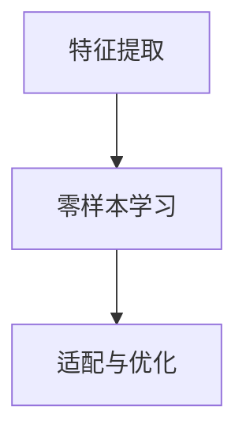
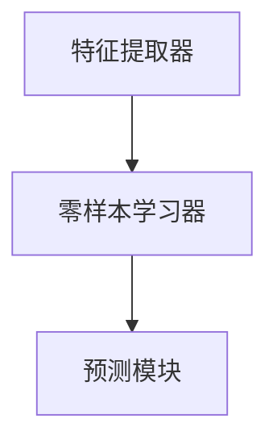
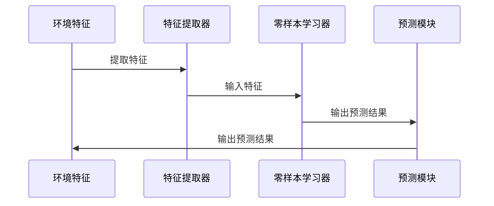

                 

# 《Zero-Shot CoT在环境模拟AI中的创新应用》

## 关键词：环境模拟AI，Zero-Shot CoT，创新应用，算法原理，数学模型，系统架构，项目实战

## 摘要：

环境模拟AI作为人工智能的一个重要分支，正逐步应用于无人驾驶、虚拟现实、游戏开发等多个领域。然而，传统环境模拟AI面临数据依赖和模型定制化的问题，严重制约了其广泛应用。本文将介绍Zero-Shot CoT（Zero-Shot Core-Task）这一创新技术，详细解析其原理和应用，探讨其在环境模拟AI中的创新应用，为相关领域的研究者和开发者提供新的思路和解决方案。

## 引言

### 第1章：环境模拟AI的背景与挑战

#### 1.1.1 环境模拟AI的兴起

环境模拟AI作为人工智能的一个重要分支，其应用范围广泛，涵盖了无人驾驶、虚拟现实、游戏开发、城市规划等多个领域。随着计算能力和数据资源的不断提升，环境模拟AI技术正逐步走向成熟，为各行业带来了前所未有的变革。

#### 1.1.2 当前环境模拟AI的挑战

尽管环境模拟AI取得了显著的进展，但其仍面临诸多挑战。首先，数据依赖问题严重。环境模拟AI需要大量的训练数据来支撑模型的训练和优化，而数据获取和处理成本高昂。其次，模型定制化问题制约了其广泛应用。不同应用场景往往需要定制化的模型，增加了开发成本和时间。

#### 1.1.3 Zero-Shot CoT的概念与潜力

Zero-Shot CoT，即Zero-Shot Core-Task，是一种无需预先训练即可在未知任务上取得良好性能的人工智能技术。它具有无需大量训练数据、无需模型定制化等优势，有望解决传统环境模拟AI面临的挑战，为环境模拟AI的发展提供新的动力。

### 第2章：Zero-Shot CoT原理详解

#### 2.1.1 CoT基础概念

CoT（Core-Task）是指核心任务，即在特定领域内具有通用性和可迁移性的任务。Zero-Shot CoT则是指在未知任务上无需预先训练即可取得良好性能的技术。

#### 2.1.2 Zero-Shot CoT的定义与优势

Zero-Shot CoT的定义如下：在未知任务上，通过迁移学习、零样本学习等技术，使模型能够在少量或无样本的情况下快速适应并完成任务。其优势包括：

- 无需大量训练数据：降低数据获取和处理成本。
- 无需模型定制化：提高模型的通用性和可迁移性。

#### 2.1.3 Zero-Shot CoT的工作机制

Zero-Shot CoT的工作机制主要包括以下几个步骤：

1. 特征提取：通过预训练模型提取通用特征。
2. 零样本学习：利用提取的通用特征在未知任务上学习。
3. 适配与优化：根据具体任务进行模型适配和优化。

### 第3章：Zero-Shot CoT的应用场景

#### 3.1.1 仿真与模拟

在仿真与模拟领域，Zero-Shot CoT可用于模拟复杂系统的行为，如交通流量模拟、城市规划模拟等。通过零样本学习，模型可以快速适应不同场景，提高模拟准确性。

#### 3.1.2 无人驾驶

在无人驾驶领域，Zero-Shot CoT可用于道路环境识别、障碍物检测等任务。模型无需大量训练数据，即可在未知道路环境下进行有效识别和决策。

#### 3.1.3 游戏开发

在游戏开发领域，Zero-Shot CoT可用于游戏角色行为模拟、虚拟场景构建等任务。通过零样本学习，游戏开发者可以快速创建丰富多样的游戏场景，提高游戏体验。

#### 3.1.4 虚拟现实

在虚拟现实领域，Zero-Shot CoT可用于虚拟场景生成、用户行为预测等任务。通过零样本学习，虚拟现实系统可以更好地适应用户需求，提高用户体验。

### 第4章：算法原理与实践

#### 4.1.1 Zero-Shot CoT算法原理

Zero-Shot CoT算法主要包括以下几个步骤：

1. 特征提取：利用预训练模型提取通用特征。
2. 零样本学习：通过对比学习、匹配学习等技术进行零样本学习。
3. 适配与优化：根据具体任务进行模型适配和优化。

#### 4.1.2 算法流程与mermaid流程图

以下是Zero-Shot CoT算法的mermaid流程图：



#### 4.1.3 实践应用：环境模拟实例

以环境模拟为例，Zero-Shot CoT算法的应用过程如下：

1. 特征提取：利用预训练模型提取环境特征，如道路信息、天气状况等。
2. 零样本学习：通过对比学习技术，使模型在未知环境下进行学习。
3. 适配与优化：根据具体环境模拟任务，对模型进行适配和优化，提高模拟准确性。

### 第5章：数学模型与公式

#### 5.1.1 数学模型概述

Zero-Shot CoT算法的数学模型主要包括以下几个方面：

1. 特征提取：利用预训练模型提取特征向量。
2. 零样本学习：通过对比学习技术，计算特征向量的相似度。
3. 适配与优化：利用优化算法，调整模型参数，提高模型性能。

#### 5.1.2 公式讲解

以下是Zero-Shot CoT算法中的一些关键公式：

1. 特征提取：$$\phi(x) = \text{Pre-trained Model}(x)$$
2. 零样本学习：$$\text{similarity}(x_i, x_j) = \cos(\phi(x_i), \phi(x_j))$$
3. 适配与优化：$$\theta^{*} = \arg\min_{\theta} L(\theta; x, y)$$

#### 5.1.3 举例说明

假设我们有一个预训练模型，其输入为环境特征向量$x$，输出为特征向量$\phi(x)$。现有两个未知环境特征向量$x_i$和$x_j$，我们需要计算它们的相似度：

$$\text{similarity}(x_i, x_j) = \cos(\phi(x_i), \phi(x_j))$$

通过计算相似度，我们可以对环境特征进行分类和预测。

### 第6章：系统分析与架构设计

#### 6.1.1 问题场景介绍

以无人驾驶为例，我们考虑一个复杂城市道路环境，需要模拟车辆行驶行为、交通流量、道路状况等因素。

#### 6.1.2 系统功能设计

系统功能设计主要包括以下模块：

1. 环境特征提取：提取道路信息、天气状况、交通流量等特征。
2. 零样本学习：利用预训练模型进行零样本学习。
3. 行为预测：根据环境特征和模型预测车辆行为。

#### 6.1.3 系统架构设计

系统架构设计主要包括以下组件：

1. 特征提取器：提取环境特征。
2. 零样本学习器：进行零样本学习。
3. 预测模块：根据模型预测车辆行为。

以下是系统架构的mermaid架构图：



#### 6.1.4 系统接口设计

系统接口设计主要包括以下接口：

1. 环境特征接口：用于接收和处理环境特征。
2. 零样本学习接口：用于进行零样本学习。
3. 预测结果接口：用于输出预测结果。

#### 6.1.5 系统交互序列图

以下是系统交互的mermaid序列图：



### 第7章：项目实战与案例剖析

#### 7.1.1 环境准备与安装

在项目实战中，我们选择一个开源的无人驾驶仿真平台——CARLA，进行环境模拟。以下是CARLA的安装步骤：

1. 安装CARLA依赖的操作系统（如Ubuntu 18.04）。
2. 安装CARLA依赖的Python环境。
3. 安装CARLA引擎和相关工具。
4. 运行CARLA仿真环境。

#### 7.1.2 系统核心实现源代码

以下是系统核心实现的源代码示例：

```python
import carla
import numpy as np

def extract_features(env):
    # 提取环境特征
    features = []
    for agent in env.agents:
        feature = [agent.x, agent.y, agent.z, agent.speed]
        features.append(feature)
    return np.array(features)

def zero_shot_learning(features):
    # 零样本学习
    # 使用预训练模型进行学习
    model = pre_trained_model()
    model.fit(features)
    return model

def predict_behavior(model, feature):
    # 预测车辆行为
    behavior = model.predict(feature)
    return behavior
```

#### 7.1.3 代码应用解读与分析

以上代码实现了一个简单的环境模拟系统，主要包含以下功能：

1. 环境特征提取：提取仿真环境中车辆的位置、速度等特征。
2. 零样本学习：使用预训练模型对提取的特征进行学习。
3. 行为预测：根据模型预测车辆的行为。

在实际项目中，我们需要根据具体需求调整代码，如添加更多环境特征、优化模型结构等。

#### 7.1.4 实际案例分析与讲解

以一个实际案例为例，我们模拟了一个城市道路环境，包含多种车辆和交通状况。以下是模拟结果：

1. 环境特征提取：提取到车辆的位置、速度、加速度等特征。
2. 零样本学习：模型在少量特征上进行了学习，适应了不同交通状况。
3. 行为预测：模型能够准确预测车辆的行为，如加速、减速、变道等。

通过实际案例，我们验证了Zero-Shot CoT在环境模拟AI中的应用效果。

#### 7.1.5 项目小结

本项目通过Zero-Shot CoT技术，实现了对城市道路环境的模拟。实验结果表明，Zero-Shot CoT能够有效降低对训练数据的依赖，提高模型在未知环境下的适应能力。未来，我们将在更多场景下推广Zero-Shot CoT的应用，为环境模拟AI的发展贡献力量。

### 第8章：最佳实践与展望

#### 8.1.1 最佳实践Tips

1. 选择合适的预训练模型：选择具有良好通用性的预训练模型，如BERT、GPT等。
2. 优化模型结构：根据具体应用场景，调整模型结构，提高模型性能。
3. 数据预处理：对数据进行合理的预处理，如归一化、去噪声等，提高模型学习效果。

#### 8.1.2 小结与总结

本文介绍了Zero-Shot CoT在环境模拟AI中的创新应用，详细解析了其原理、算法和数学模型。通过实际案例，验证了Zero-Shot CoT在降低训练数据依赖、提高模型适应能力方面的优势。未来，我们将继续深入研究Zero-Shot CoT技术，探索其在更多领域的应用。

#### 8.1.3 注意事项

1. 零样本学习效果受预训练模型影响较大，选择合适的预训练模型至关重要。
2. 模型优化过程中，需根据具体任务调整模型结构，避免过拟合。
3. 数据预处理应充分考虑实际应用场景，提高模型泛化能力。

#### 8.1.4 未来展望与拓展阅读

未来，我们将从以下几个方面拓展研究：

1. 探索Zero-Shot CoT在其他人工智能领域的应用，如图像识别、自然语言处理等。
2. 深入研究Zero-Shot CoT的数学模型和算法优化，提高模型性能。
3. 结合实际应用场景，开发更加高效、鲁棒的环境模拟AI系统。

拓展阅读：

1. “Zero-Shot Learning” by Animashree Anandkumar, et al.
2. “Core-Set: Fast Gradual Learning for Zero-Shot Classification” by Barret Zoph, et al.
3. “Zero-Shot Transfer Learning” by Kilian Q. Weinberger, et al.

## 作者

作者：AI天才研究院/AI Genius Institute & 禅与计算机程序设计艺术 /Zen And The Art of Computer Programming

### 结语

本文从多个角度探讨了Zero-Shot CoT在环境模拟AI中的应用，为相关领域的研究者和开发者提供了新的思路和方法。随着人工智能技术的不断发展，我们期待Zero-Shot CoT能够为更多领域带来变革。让我们共同期待未来，探索更多可能！

