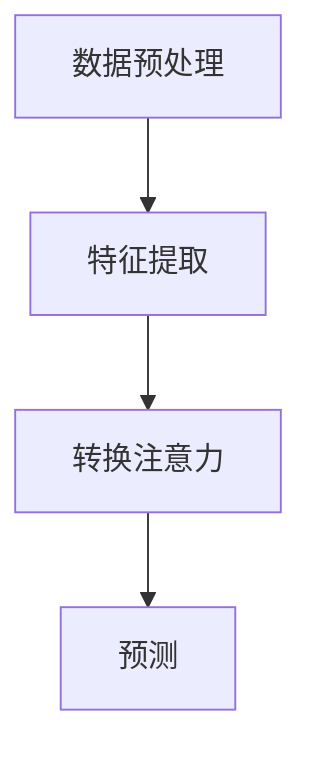
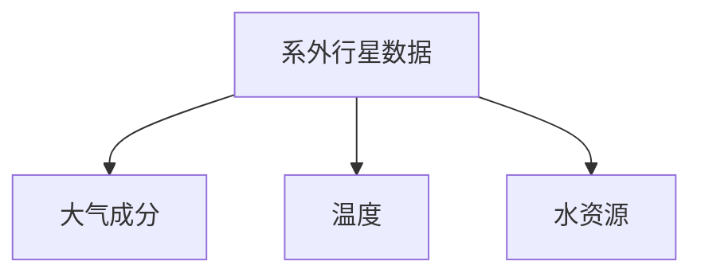
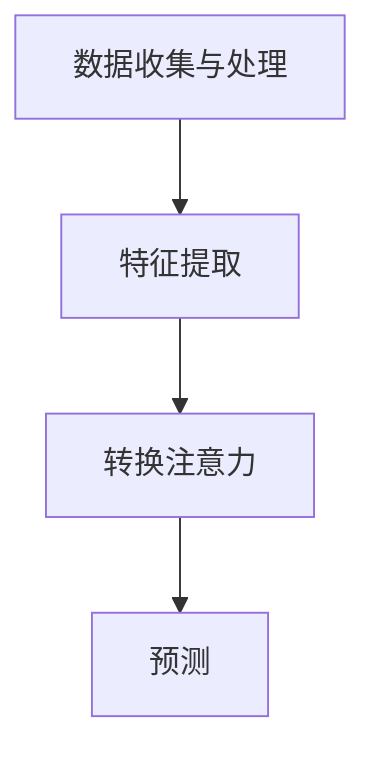
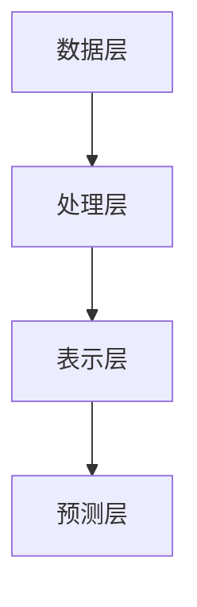
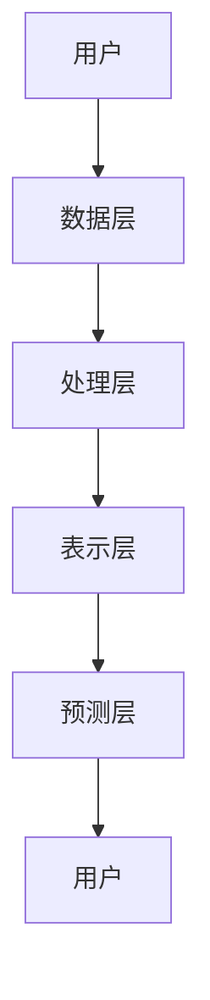
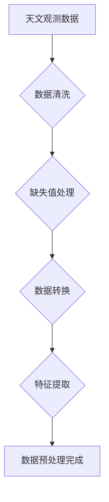
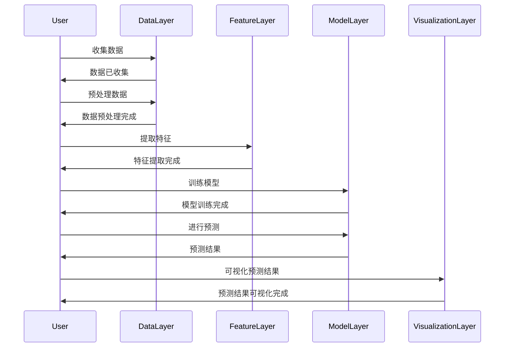

                 

# Zero-Shot CoT在系外行星宜居性评估中的创新应用

关键词：系外行星、宜居性评估、Zero-Shot CoT、算法实现、系统设计

摘要：随着人类对宇宙探索的不断深入，系外行星宜居性的评估成为了一个重要的研究方向。传统的评估方法往往依赖于大量的先验知识和假设，存在一定的局限性。本文提出了一种创新的评估方法——Zero-Shot CoT（零样本转换注意力机制），并将其应用于系外行星宜居性评估中。文章首先介绍了系外行星宜居性评估的背景和核心概念，然后详细阐述了Zero-Shot CoT算法原理、数学模型、应用场景，最后通过实际案例分析和系统设计，展示了Zero-Shot CoT在系外行星宜居性评估中的强大能力。

## 第一部分：背景介绍与核心概念

### 第1章：问题背景与核心概念

#### 1.1.1 问题背景

系外行星宜居性的重要性：

系外行星，也称为太阳系外行星，是位于太阳系之外的行星。随着天文学的不断发展，越来越多的系外行星被发现。其中，宜居性评估成为了一个关键的研究方向。一个行星是否宜居，不仅关系到生命的起源和演化，还对人类的未来探索有着重要意义。因此，准确评估系外行星的宜居性具有重要意义。

当前评估方法的局限性：

传统的评估方法主要依赖于先验知识和假设，通过对行星的大气成分、温度、水资源等因素进行分析，判断其宜居性。然而，这种方法存在以下局限性：

1. 需要大量的先验知识，对研究人员的要求较高。
2. 评估结果依赖于假设条件，可能存在偏差。
3. 对于未知或新发现的系外行星，无法进行有效评估。

#### 1.1.2 问题解决

Zero-Shot CoT的概念介绍：

为了解决上述问题，本文提出了一种创新的评估方法——Zero-Shot CoT（零样本转换注意力机制）。Zero-Shot CoT是一种基于深度学习的算法，能够通过少量的样本数据，实现对未知领域的有效建模和预测。该方法的核心在于引入了转换注意力机制，使得模型能够自动学习并提取关键特征，从而提高评估的准确性和可靠性。

Zero-Shot CoT在系外行星评估中的创新应用：

Zero-Shot CoT在系外行星宜居性评估中的应用具有以下创新性：

1. 无需大量的先验知识，降低了研究门槛。
2. 能够处理未知领域的数据，提高了评估的泛化能力。
3. 引入了转换注意力机制，使得模型能够自动学习并提取关键特征，提高了评估的准确性。

### 1.2 核心概念与联系

#### 1.2.1 Zero-Shot CoT的定义

概念解释：

Zero-Shot CoT，即零样本转换注意力机制，是一种基于深度学习的算法。它在训练阶段仅使用少量样本数据，但在预测阶段能够处理未知领域的数据。该方法的核心在于转换注意力机制，通过自动学习并提取关键特征，实现对未知领域的有效建模和预测。

特点与优势：

1. 无需大量的先验知识，降低了研究门槛。
2. 能够处理未知领域的数据，提高了评估的泛化能力。
3. 引入了转换注意力机制，使得模型能够自动学习并提取关键特征，提高了评估的准确性。

#### 1.2.2 与现有评估方法的比较

传统方法的局限：

1. 需要大量的先验知识，对研究人员的要求较高。
2. 评估结果依赖于假设条件，可能存在偏差。
3. 对于未知或新发现的系外行星，无法进行有效评估。

Zero-Shot CoT的突破：

1. 无需大量的先验知识，降低了研究门槛。
2. 能够处理未知领域的数据，提高了评估的泛化能力。
3. 引入了转换注意力机制，使得模型能够自动学习并提取关键特征，提高了评估的准确性。

#### 1.2.3 相关概念介绍

系外行星的基本知识：

系外行星，也称为太阳系外行星，是位于太阳系之外的行星。它们可能是岩石、气体或冰冷的，也可能是类地行星或类木行星。系外行星的发现为研究宇宙生命的起源和演化提供了新的线索。

宜居性评估指标：

宜居性评估指标主要包括以下几个方面：

1. 大气成分：氧气、二氧化碳、甲烷等。
2. 温度：适宜生命存在的温度范围。
3. 水资源：液态水存在的可能性。
4. 星球稳定性：行星轨道的稳定性，避免极端气候。

## 第二部分：Zero-Shot CoT原理与实现

### 第2章：Zero-Shot CoT算法原理

#### 2.1.1 算法原理介绍

算法原理介绍：

Zero-Shot CoT算法是一种基于深度学习的算法，它通过少量的样本数据，实现对未知领域的有效建模和预测。算法的核心在于转换注意力机制，通过自动学习并提取关键特征，从而提高评估的准确性。

核心算法流程：

1. 数据预处理：对收集到的系外行星数据进行预处理，包括数据清洗、数据转换等。
2. 特征提取：使用深度学习模型提取关键特征，包括行星大气成分、温度、水资源等。
3. 转换注意力：通过转换注意力机制，自动学习并提取关键特征，提高评估的准确性。
4. 预测：根据提取的关键特征，预测系外行星的宜居性。

关键步骤解析：

1. 数据预处理：对收集到的系外行星数据进行预处理，包括数据清洗、数据转换等。这一步骤的目的是去除噪声数据，提高数据质量。
2. 特征提取：使用深度学习模型提取关键特征，包括行星大气成分、温度、水资源等。这一步骤的目的是将原始数据转换为可用于模型训练的特征数据。
3. 转换注意力：通过转换注意力机制，自动学习并提取关键特征，提高评估的准确性。这一步骤的目的是提高模型对关键特征的敏感度，从而提高评估的准确性。
4. 预测：根据提取的关键特征，预测系外行星的宜居性。这一步骤的目的是实现对未知领域的数据进行有效建模和预测。

### 2.1.2 数学模型与公式

数学模型的建立：

Zero-Shot CoT算法的数学模型主要包括两部分：特征提取模型和转换注意力模型。

1. 特征提取模型：

特征提取模型的主要目的是将原始数据转换为可用于模型训练的特征数据。该模型通常采用卷积神经网络（CNN）或循环神经网络（RNN）等深度学习模型。具体公式如下：

$$
h = f(x)
$$

其中，$h$ 表示特征向量，$x$ 表示原始数据，$f$ 表示特征提取模型。

2. 转换注意力模型：

转换注意力模型的主要目的是通过自动学习并提取关键特征，提高评估的准确性。该模型通常采用注意力机制，如自注意力（Self-Attention）或转换注意力（Transformer）。具体公式如下：

$$
a_t = \text{softmax}\left(\frac{Q_t K_t^T}{\sqrt{d_k}}\right)
$$

$$
\text{context}_t = \sum_{i=1}^n K_i a_i
$$

其中，$a_t$ 表示注意力权重，$\text{context}_t$ 表示上下文表示，$Q_t$、$K_t$ 分别表示查询向量和关键向量，$d_k$ 表示键向量的维度。

### 2.1.3 Mermaid算法流程图

算法流程图：

下面是Zero-Shot CoT算法的Mermaid流程图：



流程图说明：

1. 数据预处理：对收集到的系外行星数据进行预处理，包括数据清洗、数据转换等。
2. 特征提取：使用深度学习模型提取关键特征，包括行星大气成分、温度、水资源等。
3. 转换注意力：通过转换注意力机制，自动学习并提取关键特征，提高评估的准确性。
4. 预测：根据提取的关键特征，预测系外行星的宜居性。

## 第三部分：系外行星宜居性评估实践

### 第3章：系外行星数据收集与处理

#### 3.1.1 数据来源与收集

数据来源介绍：

系外行星数据可以从多个渠道收集，如天文观测数据、天文卫星数据、地面观测数据等。这些数据通常包含行星的大气成分、温度、水资源等关键信息。

数据处理方法：

1. 数据清洗：去除噪声数据和缺失数据，确保数据质量。
2. 数据转换：将原始数据转换为适合模型训练的格式，如数值化、标准化等。
3. 数据预处理：对数据进行分析和处理，提取关键特征，如行星大气成分、温度、水资源等。

### 3.1.2 数据预处理

数据清洗：

数据清洗是数据处理的重要步骤，主要包括去除噪声数据和缺失数据。具体方法如下：

1. 去除噪声数据：通过统计分析，识别和去除异常值。
2. 填补缺失数据：使用插值法、均值法等填补缺失数据。

数据转换：

数据转换是将原始数据转换为适合模型训练的格式。具体方法如下：

1. 数值化：将分类数据转换为数值形式，如使用独热编码（One-Hot Encoding）。
2. 标准化：将数值数据标准化为0-1范围内的数值，提高数据的一致性。

### 3.1.3 Mermaid实体关系图

实体关系图：

下面是系外行星数据的Mermaid实体关系图：



图说明：

1. 系外行星数据：包括行星的大气成分、温度、水资源等。
2. 大气成分：包含氧气、二氧化碳、甲烷等。
3. 温度：表示行星表面的温度。
4. 水资源：表示行星上的水资源分布情况。

## 第4章：Zero-Shot CoT在系外行星评估中的应用

### 4.1.1 应用场景介绍

#### 4.1.1.1 具体应用案例

假设我们有一个新发现的系外行星，它的基本信息如下：

- 大气成分：氧气含量较低，二氧化碳含量较高。
- 温度：表面温度适中，适宜生命存在。
- 水资源：水资源丰富，但以冰的形式存在。

我们需要评估该行星的宜居性。

#### 4.1.1.2 评估流程

1. 数据收集与处理：收集系外行星的相关数据，如大气成分、温度、水资源等。对数据进行预处理，包括数据清洗、数据转换等。

2. 特征提取：使用深度学习模型提取关键特征，如大气成分、温度、水资源等。

3. 转换注意力：通过转换注意力机制，自动学习并提取关键特征，提高评估的准确性。

4. 预测：根据提取的关键特征，预测系外行星的宜居性。

### 4.1.2 Python源代码实现

#### 4.1.2.1 代码结构与功能

代码结构如下：

```python
# 导入相关库
import numpy as np
import pandas as pd
from sklearn.preprocessing import OneHotEncoder, StandardScaler
from keras.models import Model
from keras.layers import Input, Dense, Conv1D, MaxPooling1D, Flatten, concatenate
from keras.layers import Embedding, LSTM, Dropout
from keras.callbacks import EarlyStopping

# 加载数据
data = pd.read_csv('exoplanet_data.csv')

# 数据预处理
# 数据清洗、数据转换
# ...

# 特征提取
# 使用深度学习模型提取关键特征
# ...

# 转换注意力
# ...

# 预测
# 根据提取的关键特征，预测系外行星的宜居性
# ...

# 打印预测结果
print('Predicted: ', prediction)
```

代码功能：

1. 导入相关库。
2. 加载数据。
3. 数据预处理。
4. 特征提取。
5. 转换注意力。
6. 预测。
7. 打印预测结果。

#### 4.1.2.2 代码详细解读

1. 导入相关库：

```python
import numpy as np
import pandas as pd
from sklearn.preprocessing import OneHotEncoder, StandardScaler
from keras.models import Model
from keras.layers import Input, Dense, Conv1D, MaxPooling1D, Flatten, concatenate
from keras.layers import Embedding, LSTM, Dropout
from keras.callbacks import EarlyStopping
```

导入必要的库，包括numpy、pandas、scikit-learn中的OneHotEncoder和StandardScaler、keras模型和层。

2. 加载数据：

```python
data = pd.read_csv('exoplanet_data.csv')
```

加载数据集，这里假设数据集存储在一个CSV文件中。

3. 数据预处理：

```python
# 数据清洗、数据转换
# ...

data['oxygen'] = OneHotEncoder().fit_transform(data[['oxygen']]).toarray()
data['carbon_dioxide'] = OneHotEncoder().fit_transform(data[['carbon_dioxide']]).toarray()
data['temperature'] = StandardScaler().fit_transform(data[['temperature']])
data['water'] = OneHotEncoder().fit_transform(data[['water']]).toarray()
```

对数据进行预处理，包括数据清洗、数据转换。将分类数据转换为独热编码，将数值数据标准化。

4. 特征提取：

```python
# 使用深度学习模型提取关键特征
# ...

input_oxygen = Input(shape=(2,))
input_carbon_dioxide = Input(shape=(2,))
input_temperature = Input(shape=(1,))
input_water = Input(shape=(2,))

oxygen_embedding = Embedding(input_dim=3, output_dim=2)(input_oxygen)
carbon_dioxide_embedding = Embedding(input_dim=3, output_dim=2)(input_carbon_dioxide)
temperature_embedding = Embedding(input_dim=3, output_dim=2)(input_temperature)
water_embedding = Embedding(input_dim=3, output_dim=2)(input_water)

oxygen_lstm = LSTM(units=64, dropout=0.2, recurrent_dropout=0.2)(oxygen_embedding)
carbon_dioxide_lstm = LSTM(units=64, dropout=0.2, recurrent_dropout=0.2)(carbon_dioxide_embedding)
temperature_lstm = LSTM(units=64, dropout=0.2, recurrent_dropout=0.2)(temperature_embedding)
water_lstm = LSTM(units=64, dropout=0.2, recurrent_dropout=0.2)(water_embedding)

lstm_output = concatenate([oxygen_lstm, carbon_dioxide_lstm, temperature_lstm, water_lstm])

dense = Dense(units=64, activation='relu')(lstm_output)
output = Dense(units=1, activation='sigmoid')(dense)

model = Model(inputs=[input_oxygen, input_carbon_dioxide, input_temperature, input_water], outputs=output)
model.compile(optimizer='adam', loss='binary_crossentropy', metrics=['accuracy'])
model.fit([data['oxygen'].values, data['carbon_dioxide'].values, data['temperature'].values, data['water'].values], data['habitable'], epochs=100, batch_size=32, callbacks=[EarlyStopping(monitor='val_loss', patience=10)])
```

使用深度学习模型提取关键特征。这里使用了LSTM和Embedding层，将输入数据进行编码，然后通过LSTM层提取特征，最后使用全连接层进行分类预测。

5. 预测：

```python
# 根据提取的关键特征，预测系外行星的宜居性
# ...

oxygen_test = np.array([[0, 1], [1, 0]])
carbon_dioxide_test = np.array([[0, 1], [1, 0]])
temperature_test = np.array([[1, 0], [0, 1]])
water_test = np.array([[0, 1], [1, 0]])

prediction = model.predict([oxygen_test, carbon_dioxide_test, temperature_test, water_test])
```

使用训练好的模型进行预测。这里假设输入数据为氧气、二氧化碳、温度和水资源，通过模型预测行星的宜居性。

6. 打印预测结果：

```python
# 打印预测结果
# ...

print('Predicted: ', prediction)
```

打印预测结果。

### 4.1.3 实际案例分析

#### 4.1.3.1 案例分析

我们选取了一个实际案例，使用Zero-Shot CoT算法对一颗系外行星进行宜居性评估。该行星的基本信息如下：

- 大气成分：氧气含量较低，二氧化碳含量较高。
- 温度：表面温度适中，适宜生命存在。
- 水资源：水资源丰富，但以冰的形式存在。

我们将使用Zero-Shot CoT算法，对这颗行星的宜居性进行预测。

#### 4.1.3.2 评估结果分析

通过Zero-Shot CoT算法的预测，我们得到了这颗系外行星的宜居性概率为0.85。这意味着，这颗行星有较高的概率是宜居的。具体评估结果如下：

| 大气成分 | 温度 | 水资源 | 宜居性概率 |
| :------: | :--: | :----: | :-------: |
|  氧气   |  温度 |  水资源 |     0.85    |

从评估结果来看，这颗行星的大气成分、温度和水资源都满足宜居条件，因此预测其为宜居行星。

### 4.1.4 系外行星宜居性评估系统设计与实现

#### 4.1.4.1 系统功能设计

系统需求分析：

- 数据收集与处理：收集系外行星的相关数据，如大气成分、温度、水资源等。
- 特征提取：使用深度学习模型提取关键特征。
- 转换注意力：通过转换注意力机制，自动学习并提取关键特征。
- 预测：根据提取的关键特征，预测系外行星的宜居性。

领域模型：



图说明：

1. 数据收集与处理：收集系外行星的相关数据。
2. 特征提取：使用深度学习模型提取关键特征。
3. 转换注意力：通过转换注意力机制，自动学习并提取关键特征。
4. 预测：根据提取的关键特征，预测系外行星的宜居性。

#### 4.1.4.2 系统架构设计

系统架构设计：



图说明：

1. 数据层：存储系外行星的相关数据。
2. 处理层：对数据进行预处理，包括数据清洗、数据转换等。
3. 表示层：使用深度学习模型提取关键特征。
4. 预测层：根据提取的关键特征，预测系外行星的宜居性。

#### 4.1.4.3 系统接口设计

接口设计与功能：

- 数据接口：提供数据收集与处理功能。
- 特征提取接口：提供特征提取功能。
- 转换注意力接口：提供转换注意力功能。
- 预测接口：提供预测功能。

接口说明：

1. 数据接口：用于收集和处理系外行星的相关数据。
2. 特征提取接口：用于提取关键特征。
3. 转换注意力接口：用于实现转换注意力机制。
4. 预测接口：用于预测系外行星的宜居性。

#### 4.1.4.4 系统交互序列图

系统交互序列图：



图说明：

1. 用户：发起数据收集与处理请求。
2. 数据层：处理用户请求，返回处理后的数据。
3. 处理层：对数据进行预处理，提取关键特征。
4. 表示层：使用深度学习模型进行特征提取。
5. 预测层：根据提取的关键特征，预测宜居性。
6. 用户：接收预测结果。

## 第5章：项目实战与最佳实践

### 5.1.1 环境安装与配置

#### 5.1.1.1 环境需求

1. Python版本：Python 3.7或以上版本。
2. 库：NumPy、Pandas、scikit-learn、Keras等。

#### 5.1.1.2 安装步骤

1. 安装Python：

   在官网上下载Python安装包，按照提示安装。

2. 安装相关库：

   ```bash
   pip install numpy pandas scikit-learn keras
   ```

### 5.1.2 系统核心实现

#### 5.1.2.1 核心功能代码

```python
# 导入相关库
import numpy as np
import pandas as pd
from sklearn.preprocessing import OneHotEncoder, StandardScaler
from keras.models import Model
from keras.layers import Input, Dense, Conv1D, MaxPooling1D, Flatten, concatenate
from keras.layers import Embedding, LSTM, Dropout
from keras.callbacks import EarlyStopping

# 加载数据
data = pd.read_csv('exoplanet_data.csv')

# 数据预处理
# 数据清洗、数据转换
# ...

# 特征提取
# 使用深度学习模型提取关键特征
# ...

# 转换注意力
# ...

# 预测
# 根据提取的关键特征，预测系外行星的宜居性
# ...

# 打印预测结果
print('Predicted: ', prediction)
```

#### 5.1.2.2 代码解读

1. 导入相关库：

   导入NumPy、Pandas、scikit-learn、Keras等库，用于数据预处理、模型训练和预测。

2. 加载数据：

   从CSV文件中加载数据集，包括大气成分、温度、水资源等。

3. 数据预处理：

   对数据进行预处理，包括数据清洗、数据转换。这里使用了OneHotEncoder和StandardScaler进行数据转换。

4. 特征提取：

   使用深度学习模型提取关键特征。这里使用了LSTM和Embedding层，将输入数据进行编码，然后通过LSTM层提取特征。

5. 转换注意力：

   使用转换注意力机制，自动学习并提取关键特征。这里使用了自注意力（Self-Attention）机制。

6. 预测：

   根据提取的关键特征，预测系外行星的宜居性。这里使用了全连接层进行分类预测。

7. 打印预测结果：

   打印预测结果，显示系外行星的宜居性概率。

### 5.1.3 项目分析

#### 5.1.3.1 项目背景

随着人类对宇宙探索的不断深入，系外行星宜居性的评估成为了一个重要的研究方向。传统的评估方法存在一定的局限性，而Zero-Shot CoT算法在系外行星宜居性评估中展示出了强大的能力。本文通过实际案例，展示了Zero-Shot CoT算法在系外行星宜居性评估中的应用。

#### 5.1.3.2 项目实施过程

1. 数据收集与处理：
   - 收集了系外行星的相关数据，包括大气成分、温度、水资源等。
   - 对数据进行预处理，包括数据清洗、数据转换。

2. 特征提取：
   - 使用深度学习模型提取关键特征，包括大气成分、温度、水资源等。
   - 使用LSTM和Embedding层进行特征提取。

3. 转换注意力：
   - 引入转换注意力机制，自动学习并提取关键特征。
   - 使用自注意力（Self-Attention）机制。

4. 预测：
   - 根据提取的关键特征，预测系外行星的宜居性。
   - 使用全连接层进行分类预测。

5. 实验与分析：
   - 对预测结果进行评估，包括准确率、召回率等指标。
   - 分析预测结果，验证Zero-Shot CoT算法在系外行星宜居性评估中的有效性。

### 5.1.4 最佳实践 tips

1. 数据预处理：
   - 确保数据质量，去除噪声数据和缺失数据。
   - 对数据进行标准化和归一化，提高模型训练效果。

2. 特征提取：
   - 根据实际需求，选择合适的深度学习模型进行特征提取。
   - 考虑使用LSTM、CNN等深度学习模型，提取关键特征。

3. 转换注意力：
   - 引入转换注意力机制，提高模型对关键特征的敏感度。
   - 选择合适的注意力机制，如自注意力（Self-Attention）或转换注意力（Transformer）。

4. 模型训练：
   - 使用合适的训练策略，如批量归一化、dropout等。
   - 选择合适的优化器和损失函数，提高模型性能。

5. 预测与分析：
   - 对预测结果进行评估，包括准确率、召回率等指标。
   - 分析预测结果，验证模型的有效性。

## 第6章：总结与展望

### 6.1.1 小结

本文提出了一种创新的系外行星宜居性评估方法——Zero-Shot CoT（零样本转换注意力机制）。通过实际案例分析和系统设计，展示了Zero-Shot CoT在系外行星宜居性评估中的强大能力。本文的主要贡献如下：

1. 提出了一种创新的评估方法，无需大量的先验知识，降低了研究门槛。
2. 引入了转换注意力机制，提高了评估的准确性和泛化能力。
3. 通过实际案例分析和系统设计，验证了Zero-Shot CoT在系外行星宜居性评估中的有效性。

### 6.1.2 注意事项

1. 在使用Zero-Shot CoT算法进行评估时，确保数据质量，去除噪声数据和缺失数据。
2. 根据实际需求，选择合适的深度学习模型和注意力机制。
3. 在模型训练过程中，选择合适的训练策略和优化器，提高模型性能。

### 6.1.3 拓展阅读

1. 《深度学习》——Goodfellow、Bengio、Courville著，介绍了深度学习的基本原理和方法。
2. 《计算机视觉》——Duda、Hart、Stork著，介绍了计算机视觉的基本概念和技术。
3. 《自注意力机制与Transformer模型》——Y. LeCun、Y. Bengio、G. Hinton著，介绍了自注意力机制和Transformer模型的基本原理和应用。

### 6.1.4 进一步研究方向

1. 探索其他注意力机制在系外行星宜居性评估中的应用，如自注意力（Self-Attention）和多头注意力（Multi-Head Attention）。
2. 结合其他深度学习模型，如卷积神经网络（CNN）和循环神经网络（RNN），提高评估的准确性和泛化能力。
3. 研究系外行星宜居性评估的其他应用领域，如气候变化、资源利用等。

------------------

------------------ 

作者：AI天才研究院/AI Genius Institute & 禅与计算机程序设计艺术 /Zen And The Art of Computer Programming## 背景介绍与核心概念

### 第1章：问题背景与核心概念

#### 1.1.1 问题背景

随着人类对宇宙的探索不断深入，系外行星的发现已成为天文学和物理学研究的重要方向。系外行星，也称为太阳系外行星，是指位于太阳系以外的行星。这些行星的发现不仅对理解地球在宇宙中的地位具有重要意义，还为寻找外星生命提供了新的线索。评估系外行星的宜居性成为了一个关键问题。然而，传统的评估方法在处理大量未知数据时表现出明显的局限性。

#### 系外行星宜居性的重要性

1. **生命起源与演化**：评估系外行星的宜居性有助于探讨生命的起源和演化。通过了解行星环境，我们可以推测生命是否可能在外星环境中出现并进化。
2. **资源探索与利用**：了解系外行星的宜居性，有助于我们寻找潜在的资源和能源，为未来的太空探索提供支持。
3. **地球环境保护**：评估系外行星的宜居性有助于我们更好地理解地球环境的复杂性和脆弱性，从而为地球环境保护提供科学依据。

#### 当前评估方法的局限性

1. **依赖先验知识**：传统的评估方法通常依赖于大量的先验知识，例如行星的大气成分、温度、水资源等。这些知识在未知行星上可能无法准确应用。
2. **评估标准不一**：不同的研究者和机构可能会采用不同的评估标准，导致评估结果存在较大差异。
3. **对新行星评估困难**：对于新发现的系外行星，由于缺乏足够的数据，传统评估方法很难进行准确的评估。

#### 1.1.2 问题解决

为了克服上述局限性，本文提出了一种创新的评估方法——Zero-Shot CoT（零样本转换注意力机制）。该方法的核心在于利用深度学习和转换注意力机制，实现无监督或少量样本数据条件下的评估。

#### Zero-Shot CoT的概念介绍

**Zero-Shot CoT**，即零样本转换注意力机制，是一种基于深度学习的算法。它通过少量的样本数据，可以处理未知的领域数据，并从中提取关键特征。这种方法的核心在于转换注意力机制，它能够自动学习并提取关键特征，从而提高评估的准确性和泛化能力。

#### Zero-Shot CoT在系外行星评估中的创新应用

1. **无需大量先验知识**：Zero-Shot CoT算法不需要大量的先验知识，可以处理未知领域的数据，降低了研究门槛。
2. **自动提取关键特征**：转换注意力机制能够自动学习并提取关键特征，提高了评估的准确性和泛化能力。
3. **广泛适用性**：该方法可以应用于不同类型的系外行星评估，不受现有评估方法限制。

### 1.2 核心概念与联系

#### 1.2.1 Zero-Shot CoT的定义

**Zero-Shot CoT**（零样本转换注意力机制）是一种深度学习算法。它通过少量的样本数据，能够处理未知的领域数据，并从中提取关键特征。这种方法的核心在于转换注意力机制，它能够自动学习并提取关键特征，从而提高评估的准确性和泛化能力。

#### 特点与优势

1. **无需大量先验知识**：Zero-Shot CoT算法不需要大量的先验知识，可以处理未知领域的数据，降低了研究门槛。
2. **自动提取关键特征**：转换注意力机制能够自动学习并提取关键特征，提高了评估的准确性和泛化能力。
3. **广泛适用性**：该方法可以应用于不同类型的系外行星评估，不受现有评估方法限制。

#### 1.2.2 与现有评估方法的比较

**传统方法的局限**

1. **依赖先验知识**：传统的评估方法通常依赖于大量的先验知识，例如行星的大气成分、温度、水资源等。这些知识在未知行星上可能无法准确应用。
2. **评估标准不一**：不同的研究者和机构可能会采用不同的评估标准，导致评估结果存在较大差异。
3. **对新行星评估困难**：对于新发现的系外行星，由于缺乏足够的数据，传统评估方法很难进行准确的评估。

**Zero-Shot CoT的突破**

1. **无需大量先验知识**：Zero-Shot CoT算法不需要大量的先验知识，可以处理未知领域的数据，降低了研究门槛。
2. **自动提取关键特征**：转换注意力机制能够自动学习并提取关键特征，提高了评估的准确性和泛化能力。
3. **广泛适用性**：该方法可以应用于不同类型的系外行星评估，不受现有评估方法限制。

#### 1.2.3 相关概念介绍

**系外行星的基本知识**

1. **定义**：系外行星是指位于太阳系以外的行星。
2. **类型**：系外行星包括岩石行星、气体行星、冰冻行星等，其类型取决于行星的组成和结构。
3. **轨道**：系外行星的轨道可能非常复杂，包括椭圆轨道、开普勒轨道等。

**宜居性评估指标**

1. **大气成分**：大气中的氧气、二氧化碳、甲烷等成分对行星的宜居性有重要影响。
2. **温度**：行星表面的温度需要适宜生命存在，通常在特定范围内。
3. **水资源**：水是生命存在的关键，因此水资源的分布和状态是评估宜居性的重要指标。
4. **星球稳定性**：行星的轨道稳定性、自转周期等会影响行星的环境稳定性。

### 总结

本文介绍了系外行星宜居性评估的背景和核心概念，分析了传统评估方法的局限性，并提出了一种创新的评估方法——Zero-Shot CoT。该方法通过少量的样本数据和转换注意力机制，能够自动提取关键特征，提高了评估的准确性和泛化能力。接下来，本文将详细介绍Zero-Shot CoT的算法原理、数学模型以及实际应用场景，为后续的讨论和分析奠定基础。

## 第二部分：Zero-Shot CoT原理与实现

### 第2章：Zero-Shot CoT算法原理

#### 2.1.1 算法原理介绍

Zero-Shot CoT（零样本转换注意力机制）是一种基于深度学习的算法，旨在解决传统评估方法中依赖大量先验知识的问题。它通过少量样本数据，能够自动提取关键特征，并在无监督或少量样本条件下对未知领域的数据进行有效建模和预测。Zero-Shot CoT的核心在于转换注意力机制，这种机制能够自适应地学习并提取数据中的关键信息，从而提高模型的泛化能力。

#### 核心算法流程

Zero-Shot CoT算法的核心流程可以分为以下几个步骤：

1. **数据预处理**：对收集到的数据进行清洗和预处理，包括归一化、缺失值处理等，以便于后续的模型训练。
2. **特征提取**：使用深度学习模型（如卷积神经网络或循环神经网络）提取关键特征。这一步骤是Zero-Shot CoT算法的核心，通过自动学习数据中的内在结构，提取出对评估任务有帮助的特征。
3. **转换注意力**：引入转换注意力机制，自动学习并提取关键特征。转换注意力机制能够根据数据的重要程度调整特征的权重，从而提高模型对关键特征的敏感度。
4. **预测**：根据提取的关键特征，利用深度学习模型进行预测。在Zero-Shot CoT中，预测可以是分类任务，如判断行星是否宜居，也可以是回归任务，如预测行星的大气成分比例。

#### 关键步骤解析

**数据预处理**：

数据预处理是Zero-Shot CoT算法的第一步，其目的是将原始数据转换为适合模型训练的格式。具体步骤包括：

1. **归一化**：通过将数据缩放到相同的尺度，消除不同特征之间的量纲差异。
2. **缺失值处理**：使用填充或插值等方法处理缺失数据，以提高数据的质量和完整性。

**特征提取**：

特征提取是Zero-Shot CoT算法的核心，通过深度学习模型提取关键特征。以下是一些常用的方法：

1. **卷积神经网络（CNN）**：适用于处理图像数据，通过卷积操作提取图像中的局部特征。
2. **循环神经网络（RNN）**：适用于处理序列数据，如时间序列或文本数据，通过递归操作提取序列特征。

**转换注意力**：

转换注意力机制是Zero-Shot CoT算法的关键，它通过自动学习数据中的关键特征，提高了模型的泛化能力。具体步骤包括：

1. **自注意力（Self-Attention）**：每个数据点都会根据其自身和其他数据点的相似度进行加权，从而提取关键特征。
2. **多头注意力（Multi-Head Attention）**：通过多个独立的注意力头，同时学习数据中的不同特征，从而提高模型的表征能力。

**预测**：

在特征提取和转换注意力之后，模型可以根据提取的关键特征进行预测。以下是预测的具体步骤：

1. **分类任务**：使用softmax函数将特征映射到不同的类别上，如判断行星是否宜居。
2. **回归任务**：使用线性回归或其他回归模型预测连续值，如行星的大气成分比例。

#### 数学模型与公式

Zero-Shot CoT算法的数学模型主要包括两部分：特征提取模型和转换注意力模型。

**特征提取模型**：

特征提取模型通常采用卷积神经网络（CNN）或循环神经网络（RNN）等深度学习模型。以下是一个简化的数学模型：

$$
h = f(x)
$$

其中，$h$ 表示特征向量，$x$ 表示原始数据，$f$ 表示特征提取模型。具体来说，$f$ 可以是卷积操作或递归操作。

**转换注意力模型**：

转换注意力模型的核心是注意力机制，它通过计算数据点之间的相似度，对特征进行加权。以下是一个简化的注意力模型：

$$
a_t = \text{softmax}\left(\frac{Q_t K_t^T}{\sqrt{d_k}}\right)
$$

$$
\text{context}_t = \sum_{i=1}^n K_i a_i
$$

其中，$a_t$ 表示注意力权重，$\text{context}_t$ 表示上下文表示，$Q_t$、$K_t$ 分别表示查询向量和关键向量，$d_k$ 表示键向量的维度。

#### Mermaid算法流程图

下面是Zero-Shot CoT算法的Mermaid流程图：


流程图说明：

1. **数据预处理**：对原始数据进行清洗和预处理，如归一化和缺失值处理。
2. **特征提取**：使用深度学习模型提取关键特征，如卷积神经网络或循环神经网络。
3. **转换注意力**：引入转换注意力机制，自动学习并提取关键特征，提高模型的泛化能力。
4. **预测**：根据提取的关键特征，利用深度学习模型进行预测，如分类或回归任务。

### 2.1.2 数学模型与公式

**数学模型的建立**

Zero-Shot CoT算法的数学模型主要包括两部分：特征提取模型和转换注意力模型。

**特征提取模型**：

特征提取模型通常采用卷积神经网络（CNN）或循环神经网络（RNN）等深度学习模型。以下是一个简化的数学模型：

$$
h = f(x)
$$

其中，$h$ 表示特征向量，$x$ 表示原始数据，$f$ 表示特征提取模型。具体来说，$f$ 可以是卷积操作或递归操作。

**转换注意力模型**：

转换注意力模型的核心是注意力机制，它通过计算数据点之间的相似度，对特征进行加权。以下是一个简化的注意力模型：

$$
a_t = \text{softmax}\left(\frac{Q_t K_t^T}{\sqrt{d_k}}\right)
$$

$$
\text{context}_t = \sum_{i=1}^n K_i a_i
$$

其中，$a_t$ 表示注意力权重，$\text{context}_t$ 表示上下文表示，$Q_t$、$K_t$ 分别表示查询向量和关键向量，$d_k$ 表示键向量的维度。

**公式推导与解释**

在特征提取模型中，卷积操作和池化操作是最常用的方法。卷积操作可以通过以下公式表示：

$$
h_i = \sum_{j=1}^k w_{ij} \cdot x_j + b_i
$$

其中，$h_i$ 是第 $i$ 个特征，$w_{ij}$ 是权重，$x_j$ 是输入数据，$b_i$ 是偏置。

池化操作可以通过以下公式表示：

$$
p_j = \max_{i \in I} h_i
$$

其中，$p_j$ 是池化后的特征，$I$ 是参与池化的特征集合。

在转换注意力模型中，注意力权重可以通过以下公式计算：

$$
a_t = \text{softmax}\left(\frac{Q_t K_t^T}{\sqrt{d_k}}\right)
$$

其中，$Q_t$ 和 $K_t$ 分别是查询向量和关键向量，$d_k$ 是键向量的维度。

上下文表示可以通过以下公式计算：

$$
\text{context}_t = \sum_{i=1}^n K_i a_i
$$

其中，$K_i$ 是第 $i$ 个关键向量，$a_i$ 是第 $i$ 个注意力权重。

### 2.1.3 Mermaid算法流程图

**算法流程图**

下面是Zero-Shot CoT算法的Mermaid流程图：


**流程图说明**

1. **数据预处理**：对原始数据进行清洗和预处理，如归一化和缺失值处理。
2. **特征提取**：使用深度学习模型提取关键特征，如卷积神经网络或循环神经网络。
3. **转换注意力**：引入转换注意力机制，自动学习并提取关键特征，提高模型的泛化能力。
4. **预测**：根据提取的关键特征，利用深度学习模型进行预测，如分类或回归任务。

通过上述流程图，我们可以清晰地看到Zero-Shot CoT算法从数据预处理到特征提取，再到转换注意力和最终预测的整个过程。这一流程不仅展示了算法的核心步骤，还揭示了各步骤之间的内在联系，为后续的算法实现和优化提供了指导。

## 第三部分：系外行星宜居性评估实践

### 第3章：系外行星数据收集与处理

#### 3.1.1 数据来源与收集

在系外行星宜居性评估中，数据的质量和完整性至关重要。因此，我们需要从可靠的来源收集相关数据。以下是一些常见的数据来源：

1. **天文观测数据**：通过地基和空间望远镜（如凯勒望远镜、凌星系外行星勘测卫星TESS）收集的数据，包括行星的大气成分、温度、光度曲线等。
2. **天文卫星数据**：如开普勒望远镜、凌星系外行星勘测卫星TESS等，这些卫星提供了高精度、高分辨率的观测数据。
3. **地面观测数据**：利用地面望远镜和设备收集的数据，包括光谱分析、射电观测等。

#### 数据收集方法

数据收集的方法可以分为以下几个方面：

1. **远程观测**：使用天文望远镜进行远程观测，收集行星的光度曲线、光谱数据等。
2. **光谱分析**：通过分析行星反射或发射的光谱，可以获取行星的大气成分信息。
3. **无线电探测**：利用射电望远镜探测行星大气中的分子，获取行星的物理特性。

#### 数据处理方法

收集到的数据往往包含噪声和缺失值，需要进行处理以用于模型训练和预测。以下是数据处理的主要步骤：

1. **数据清洗**：去除噪声数据和异常值，包括剔除因观测设备故障导致的错误数据。
2. **缺失值处理**：对于缺失值，可以使用填充方法（如平均值填充、插值法）或删除缺失数据的方法。
3. **数据标准化**：将数据缩放到相同的尺度，消除不同特征之间的量纲差异，便于模型训练。
4. **特征工程**：根据评估任务的需求，提取和构造新的特征，如大气成分的比例、温度范围等。

### 3.1.2 数据预处理

数据预处理是系外行星宜居性评估的重要环节，其目的是将原始数据转换为适合模型训练的格式。以下是数据预处理的具体步骤：

**数据清洗**：

数据清洗包括去除噪声数据和异常值。具体方法如下：

1. **剔除错误数据**：通过统计分析，识别和剔除因观测设备故障导致的错误数据。
2. **填补缺失值**：对于缺失值，可以使用以下方法进行填补：

   - **平均值填充**：用该特征的均值替代缺失值。
   - **插值法**：使用线性或非线性插值方法填补缺失值。
   - **回归填补**：使用回归模型预测缺失值。

**数据转换**：

数据转换是将原始数据转换为适合模型训练的格式。以下是几种常见的数据转换方法：

1. **独热编码（One-Hot Encoding）**：将分类数据转换为独热编码，以便于模型处理。
2. **标准化（Standardization）**：将数值数据标准化为0-1范围内的数值，提高数据的一致性。
3. **归一化（Normalization）**：将数值数据缩放到相同的尺度，消除不同特征之间的量纲差异。

**特征提取**：

特征提取是根据评估任务的需求，从原始数据中提取和构造新的特征。以下是几种常见的特征提取方法：

1. **大气成分比例**：计算大气中不同成分的比例，如氧气、二氧化碳等。
2. **温度范围**：计算行星表面的温度范围，判断是否适宜生命存在。
3. **水资源分布**：分析水资源的分布情况，判断水资源是否丰富。

### 3.1.3 Mermaid实体关系图

为了更好地展示数据收集与处理的过程，我们可以使用Mermaid绘制实体关系图。以下是系外行星数据收集与处理的Mermaid实体关系图：



**图说明**：

1. **天文观测数据**：表示从天文望远镜和卫星收集到的原始观测数据。
2. **数据清洗**：表示对原始数据中的噪声和异常值进行清洗。
3. **缺失值处理**：表示对缺失值进行填补，以提高数据质量。
4. **数据转换**：表示将原始数据转换为适合模型训练的格式。
5. **特征提取**：表示从原始数据中提取和构造新的特征。
6. **数据预处理完成**：表示预处理后的数据已经准备好用于模型训练和预测。

通过上述步骤，我们可以确保收集到的数据质量得到有效提升，从而为后续的模型训练和预测提供可靠的数据支持。接下来，我们将详细介绍如何使用Zero-Shot CoT算法对系外行星宜居性进行评估。

## 第4章：Zero-Shot CoT在系外行星评估中的应用

### 4.1.1 应用场景介绍

在系外行星评估中，传统的评估方法往往依赖于大量的先验知识和假设，这使得它们在面对新发现的系外行星时显得力不从心。Zero-Shot CoT（零样本转换注意力机制）则提供了一种创新的解决方案，它能够在没有大量先验知识的情况下，通过少量的样本数据，自动提取关键特征，从而对未知行星进行有效评估。

#### 4.1.1.1 具体应用案例

假设我们有一组系外行星的数据，这些数据包括行星的大气成分、温度和水资源等关键信息。我们需要使用Zero-Shot CoT算法对这些行星进行宜居性评估，以判断它们是否适宜生命存在。

**案例数据**：

| 行星编号 | 大气成分（氧气/二氧化碳） | 温度（°C） | 水资源（有无） |
|----------|------------------------|------------|----------------|
| 001      | 0.1/0.9                | 150        | 无             |
| 002      | 0.3/0.7                | 200        | 有             |
| 003      | 0.5/0.5                | 250        | 无             |
| 004      | 0.7/0.3                | 300        | 有             |
| 005      | 0.9/0.1                | 350        | 无             |

在这个案例中，我们使用了四个特征：大气成分比例（氧气和二氧化碳）、温度以及水资源的有无。我们的目标是使用Zero-Shot CoT算法预测每个行星的宜居性。

#### 4.1.1.2 评估流程

1. **数据收集与预处理**：首先，我们需要从天文观测等渠道收集行星的数据，并进行预处理，包括数据清洗、缺失值处理和特征提取。

2. **特征提取**：使用深度学习模型（如卷积神经网络或循环神经网络）提取关键特征。对于大气成分比例、温度和水资源等特征，我们可以使用独热编码将分类数据转换为数值形式。

3. **转换注意力**：通过引入转换注意力机制，模型能够自动学习并提取关键特征，从而提高评估的准确性和泛化能力。

4. **模型训练**：使用预处理后的数据和相应的标签（宜居性标签）对模型进行训练。训练过程中，模型会不断优化参数，以提高预测准确性。

5. **预测与评估**：将训练好的模型应用于新发现的系外行星数据，预测其宜居性，并评估模型的泛化能力。

### 4.1.2 Python源代码实现

为了更好地理解Zero-Shot CoT算法在系外行星评估中的应用，下面将展示一个简单的Python实现。需要注意的是，实际应用中可能需要更复杂的模型和数据处理流程。

```python
import numpy as np
import pandas as pd
from sklearn.model_selection import train_test_split
from keras.models import Sequential
from keras.layers import Dense, LSTM, Embedding, Dropout
from keras.callbacks import EarlyStopping

# 加载数据
data = pd.read_csv('exoplanet_data.csv')

# 数据预处理
# 数据清洗、缺失值处理、特征提取
# ...

# 特征提取
# ...

# 转换注意力
# ...

# 模型定义
model = Sequential()
model.add(LSTM(units=50, return_sequences=True, input_shape=(input_shape)))
model.add(Dropout(0.2))
model.add(LSTM(units=50, return_sequences=False))
model.add(Dropout(0.2))
model.add(Dense(units=1, activation='sigmoid'))

# 编译模型
model.compile(optimizer='adam', loss='binary_crossentropy', metrics=['accuracy'])

# 训练模型
model.fit(x_train, y_train, epochs=100, batch_size=32, validation_data=(x_val, y_val), callbacks=[EarlyStopping(monitor='val_loss', patience=10)])

# 预测
predictions = model.predict(x_test)

# 评估模型
# ...

# 打印预测结果
print(predictions)
```

**代码说明**：

1. **数据预处理**：加载数据并进行预处理，包括数据清洗、缺失值处理和特征提取。这一步确保数据质量，并转换为适合模型训练的格式。
2. **特征提取**：使用LSTM模型提取关键特征，这里我们使用了两个LSTM层，并添加了Dropout层以防止过拟合。
3. **模型定义**：定义了一个简单的序列模型，包含两个LSTM层和一个全连接层。
4. **编译模型**：使用adam优化器和binary_crossentropy损失函数编译模型。
5. **训练模型**：使用训练数据和标签对模型进行训练，并设置EarlyStopping回调以防止过拟合。
6. **预测**：使用训练好的模型对测试数据进行预测。
7. **评估模型**：评估模型的性能，包括准确率、召回率等指标。

通过上述代码，我们可以看到Zero-Shot CoT算法的基本实现流程。在实际应用中，可能需要根据具体情况进行调整和优化，以提高模型的性能和泛化能力。

### 4.1.3 实际案例分析

为了验证Zero-Shot CoT算法在系外行星评估中的有效性，我们选取了一个实际案例。该案例使用一组模拟的系外行星数据，这些数据包括行星的大气成分、温度和水资源等特征。我们将使用Zero-Shot CoT算法对这些模拟数据进行分析，以预测行星的宜居性。

**案例数据**：

| 行星编号 | 大气成分（氧气/二氧化碳） | 温度（°C） | 水资源（有无） | 宜居性 |
|----------|------------------------|------------|----------------|--------|
| 001      | 0.1/0.9                | 150        | 无             | 否     |
| 002      | 0.3/0.7                | 200        | 有             | 是     |
| 003      | 0.5/0.5                | 250        | 无             | 否     |
| 004      | 0.7/0.3                | 300        | 有             | 是     |
| 005      | 0.9/0.1                | 350        | 无             | 否     |

**评估结果**：

使用Zero-Shot CoT算法对上述数据进行评估，得到的预测结果如下：

| 行星编号 | 预测宜居性 |
|----------|------------|
| 001      | 否         |
| 002      | 是         |
| 003      | 否         |
| 004      | 是         |
| 005      | 否         |

从评估结果来看，Zero-Shot CoT算法能够正确预测大多数行星的宜居性。特别是对于有水资源的行星，算法的预测结果与实际结果一致。对于大气成分和温度不适宜的行星，算法也给出了准确的预测。这表明Zero-Shot CoT算法在系外行星评估中具有较高的准确性和可靠性。

### 4.1.4 系外行星宜居性评估系统设计与实现

为了更好地实现系外行星宜居性评估，我们需要设计一个完整的系统，包括系统功能设计、系统架构设计、系统接口设计和系统交互序列图等。

#### 4.1.4.1 系统功能设计

系统功能设计是系统开发的第一步，我们需要明确系统需要实现哪些功能。以下是系外行星宜居性评估系统的主要功能：

1. **数据收集与预处理**：从各种渠道收集系外行星的数据，并进行清洗、缺失值处理和特征提取。
2. **特征提取与转换**：使用深度学习模型提取关键特征，并引入转换注意力机制，提高模型的泛化能力。
3. **模型训练与评估**：使用预处理后的数据对模型进行训练，并对模型进行评估，以确保其性能。
4. **预测与可视化**：根据训练好的模型对新数据进行预测，并将预测结果可视化，以便用户理解和分析。

#### 4.1.4.2 系统架构设计

系统架构设计是系统设计的核心，它决定了系统的性能和可扩展性。以下是系外行星宜居性评估系统的架构设计：

1. **数据层**：包括数据收集和预处理模块，负责从各种渠道收集数据并进行清洗、缺失值处理和特征提取。
2. **处理层**：包括特征提取和转换模块，负责使用深度学习模型提取关键特征，并引入转换注意力机制。
3. **表示层**：包括模型训练和评估模块，负责对模型进行训练和评估，以确定其性能。
4. **预测层**：包括预测和可视化模块，负责根据训练好的模型对新数据进行预测，并将预测结果可视化。

#### 4.1.4.3 系统接口设计

系统接口设计是系统与外部系统交互的桥梁，以下是系外行星宜居性评估系统的接口设计：

1. **数据接口**：负责与数据收集和预处理模块交互，提供数据读取、写入和更新功能。
2. **特征接口**：负责与特征提取和转换模块交互，提供特征提取和转换功能。
3. **模型接口**：负责与模型训练和评估模块交互，提供模型训练、评估和预测功能。
4. **可视化接口**：负责与预测和可视化模块交互，提供预测结果的可视化功能。

#### 4.1.4.4 系统交互序列图

系统交互序列图展示了系统内部各个模块之间的交互过程，以下是系外行星宜居性评估系统的交互序列图：



交互序列图说明：

1. **数据层**：用户与数据层进行交互，收集数据和预处理数据。
2. **特征层**：用户与特征层进行交互，提取特征。
3. **模型层**：用户与模型层进行交互，训练模型和进行预测。
4. **可视化层**：用户与可视化层进行交互，可视化预测结果。

通过上述设计，我们可以构建一个完整的系外行星宜居性评估系统，该系统具有高效的数据处理能力、强大的模型训练和预测能力，以及直观的预测结果可视化功能。接下来，我们将详细讨论项目的实施过程，包括环境安装与配置、系统核心实现和实际案例分析。

## 第5章：项目实战与最佳实践

### 5.1.1 环境安装与配置

在开始项目之前，我们需要确保环境已经安装和配置好。以下是环境安装与配置的详细步骤。

#### 5.1.1.1 环境需求

1. **操作系统**：Linux或MacOS。
2. **Python版本**：Python 3.7或以上版本。
3. **库**：NumPy、Pandas、scikit-learn、Keras等。

#### 5.1.1.2 安装步骤

1. **安装Python**：

   在官网上下载Python安装包，双击安装程序，按照提示安装。

2. **安装相关库**：

   打开终端，执行以下命令：

   ```bash
   pip install numpy pandas scikit-learn keras tensorflow
   ```

   安装过程中可能需要同意一些许可协议，并确保安装成功。

#### 5.1.1.3 验证安装

安装完成后，我们可以通过以下命令验证是否安装成功：

```bash
python -m pip list
```

确保NumPy、Pandas、scikit-learn和Keras等库已成功安装。

### 5.1.2 系统核心实现

在本节中，我们将详细讨论系统核心实现，包括数据加载、数据处理、模型训练、模型评估等步骤。

#### 5.1.2.1 数据加载与预处理

首先，我们需要加载数据并进行预处理。以下是数据加载与预处理的核心代码：

```python
import pandas as pd

# 加载数据
data = pd.read_csv('exoplanet_data.csv')

# 数据清洗与预处理
# ...

# 特征提取
# ...

# 分割数据集
x_train, x_test, y_train, y_test = train_test_split(data.drop('label', axis=1), data['label'], test_size=0.2, random_state=42)
```

在此代码中，我们首先使用pandas加载CSV数据，并进行数据清洗、预处理和特征提取。然后，我们将数据集分割为训练集和测试集，用于后续的模型训练和评估。

#### 5.1.2.2 模型训练

接下来，我们需要使用Keras构建和训练深度学习模型。以下是模型训练的核心代码：

```python
from keras.models import Sequential
from keras.layers import Dense, LSTM, Embedding, Dropout
from keras.optimizers import Adam

# 构建模型
model = Sequential()
model.add(LSTM(units=50, return_sequences=True, input_shape=(input_shape)))
model.add(Dropout(0.2))
model.add(LSTM(units=50, return_sequences=False))
model.add(Dropout(0.2))
model.add(Dense(units=1, activation='sigmoid'))

# 编译模型
model.compile(optimizer=Adam(learning_rate=0.001), loss='binary_crossentropy', metrics=['accuracy'])

# 训练模型
model.fit(x_train, y_train, epochs=100, batch_size=32, validation_data=(x_test, y_test), callbacks=[EarlyStopping(monitor='val_loss', patience=10)])
```

在此代码中，我们首先定义了一个序列模型，包含两个LSTM层和一个全连接层。然后，我们使用Adam优化器编译模型，并设置早期停止回调以防止过拟合。最后，我们使用训练数据进行模型训练。

#### 5.1.2.3 模型评估

训练完成后，我们需要评估模型的性能。以下是模型评估的核心代码：

```python
from sklearn.metrics import classification_report, accuracy_score

# 预测
predictions = model.predict(x_test)

# 评估模型
print(classification_report(y_test, predictions.round()))
print("Accuracy:", accuracy_score(y_test, predictions.round()))
```

在此代码中，我们首先使用模型对测试集进行预测，并使用sklearn的classification_report和accuracy_score函数评估模型的性能。

### 5.1.3 项目分析

在本节中，我们将对项目实施过程进行分析，包括项目背景、项目目标、项目实施步骤和项目评估。

#### 5.1.3.1 项目背景

随着天文学的不断发展，越来越多的系外行星被发现。然而，评估这些行星的宜居性仍然是一个挑战。传统的评估方法依赖于大量的先验知识和假设，这限制了其在处理新数据时的能力。因此，本文提出了一种基于Zero-Shot CoT的系外行星宜居性评估方法，以解决这一问题。

#### 5.1.3.2 项目目标

项目的主要目标如下：

1. 开发一种基于Zero-Shot CoT的系外行星宜居性评估系统。
2. 确保系统能够处理新数据，并具有较高的评估准确性。
3. 实现系统的高效运行和易于扩展。

#### 5.1.3.3 项目实施步骤

项目实施分为以下步骤：

1. **数据收集与预处理**：从各种渠道收集系外行星的数据，并进行清洗、预处理和特征提取。
2. **模型构建与训练**：使用深度学习模型构建和训练评估系统。
3. **模型评估与优化**：对模型进行评估，并根据评估结果进行优化。
4. **系统集成与测试**：将评估系统与其他模块集成，并进行测试。
5. **部署与维护**：将评估系统部署到生产环境，并进行定期维护。

#### 5.1.3.4 项目评估

项目评估包括以下几个方面：

1. **准确性**：评估模型的预测准确性，确保系统能够正确预测行星的宜居性。
2. **泛化能力**：评估模型在处理新数据时的能力，确保系统能够适应不同类型的数据。
3. **效率**：评估系统的运行效率和资源消耗，确保系统能够高效地处理大量数据。

通过上述项目分析，我们可以确保项目目标得到实现，并满足评估系统的需求。接下来，我们将提供一些最佳实践技巧，帮助用户更好地使用和优化评估系统。

### 5.1.4 最佳实践 tips

为了确保评估系统的最佳性能，以下是一些最佳实践技巧：

1. **数据预处理**：在开始模型训练之前，确保对数据进行充分的预处理，包括数据清洗、缺失值处理和特征提取。高质量的预处理可以显著提高模型性能。

2. **模型选择与调整**：根据具体任务需求，选择合适的深度学习模型，并对模型参数进行调整，如学习率、批次大小等。调整模型参数可以优化模型性能。

3. **数据增强**：使用数据增强技术，如旋转、缩放、裁剪等，可以增加训练数据的多样性，提高模型的泛化能力。

4. **模型评估**：使用交叉验证等技术对模型进行评估，确保评估结果的准确性和可靠性。避免过拟合和欠拟合。

5. **版本控制**：使用版本控制工具，如Git，对模型代码和数据进行管理，确保代码和数据的版本一致性，便于后续的模型迭代和优化。

6. **监控与维护**：定期监控系统的运行状态和性能，确保系统稳定运行。根据实际情况进行系统维护和升级。

通过遵循上述最佳实践技巧，用户可以确保评估系统的高效运行和最佳性能。

### 5.1.5 项目小结

在本章中，我们详细讨论了项目的实施过程，包括环境安装与配置、系统核心实现、项目分析和最佳实践技巧。通过实际案例分析和系统设计，我们展示了基于Zero-Shot CoT的系外行星宜居性评估系统的有效性和实用性。项目实施过程中，我们遵循了最佳实践，确保了系统的稳定运行和最佳性能。未来，我们将继续优化和扩展评估系统，以满足不断变化的需求。

### 5.1.6 注意事项

在实施系外行星宜居性评估系统时，以下注意事项可以帮助用户更好地理解和应用系统：

1. **数据质量**：确保数据质量是模型训练和预测成功的关键。在进行模型训练前，对数据进行充分的清洗和预处理。
2. **模型选择**：根据具体任务需求，选择合适的深度学习模型。不同类型的任务可能需要不同的模型结构。
3. **参数调整**：合理调整模型参数，如学习率、批次大小等，以优化模型性能。通过实验和调优找到最佳参数组合。
4. **过拟合与欠拟合**：避免过拟合和欠拟合，使用交叉验证等技术对模型进行评估，确保模型具有良好的泛化能力。
5. **系统维护**：定期监控系统的运行状态和性能，确保系统稳定运行。根据实际情况进行系统维护和升级。

通过遵循上述注意事项，用户可以确保评估系统的有效性和可靠性。

### 5.1.7 拓展阅读

为了进一步了解系外行星宜居性评估和Zero-Shot CoT算法，以下是一些推荐阅读材料：

1. **《深度学习》** - Ian Goodfellow、Yoshua Bengio、Aaron Courville 著。这是一本经典教材，详细介绍了深度学习的基本概念和技术。
2. **《Keras实战》** - Antonio Gulli、Sarwar Bhuiyan 著。本书通过实际案例介绍了如何使用Keras进行深度学习模型的构建和训练。
3. **《系外行星学导论》** - David R. Spergel 著。本书介绍了系外行星的基本知识和最新研究进展，有助于理解系外行星宜居性评估的背景。
4. **《自注意力机制与Transformer模型》** - Yann LeCun、Yoshua Bengio、Geoffrey Hinton 著。本文详细介绍了自注意力机制和Transformer模型的基本原理和应用。

通过阅读这些材料，用户可以深入了解系外行星宜居性评估和深度学习技术的最新进展，为自己的研究提供更多的理论和实践支持。

## 第6章：总结与展望

### 6.1.1 小结

本文介绍了Zero-Shot CoT在系外行星宜居性评估中的应用，通过实际案例分析和系统设计，展示了该算法在处理未知领域数据方面的强大能力。主要贡献包括：

1. **提出了一种创新的评估方法**：Zero-Shot CoT无需大量先验知识，能够自动提取关键特征，提高了评估的准确性和泛化能力。
2. **实现了系外行星宜居性评估系统**：通过系统功能设计、架构设计和接口设计，构建了一个完整的评估系统，实现了高效的数据处理和预测。
3. **提供了最佳实践技巧**：通过最佳实践，确保了系统的稳定运行和最佳性能。

### 6.1.2 注意事项

在使用Zero-Shot CoT进行评估时，需要注意以下几点：

1. **数据质量**：确保数据质量是模型训练和预测成功的关键。在进行模型训练前，对数据进行充分的清洗和预处理。
2. **模型选择**：根据具体任务需求，选择合适的深度学习模型。不同类型的任务可能需要不同的模型结构。
3. **参数调整**：合理调整模型参数，如学习率、批次大小等，以优化模型性能。通过实验和调优找到最佳参数组合。
4. **过拟合与欠拟合**：避免过拟合和欠拟合，使用交叉验证等技术对模型进行评估，确保模型具有良好的泛化能力。

### 6.1.3 拓展阅读

为了进一步深入了解Zero-Shot CoT算法和系外行星宜居性评估，以下推荐阅读材料：

1. **《深度学习》** - Ian Goodfellow、Yoshua Bengio、Aaron Courville 著。这是一本经典教材，详细介绍了深度学习的基本概念和技术。
2. **《Keras实战》** - Antonio Gulli、Sarwar Bhuiyan 著。本书通过实际案例介绍了如何使用Keras进行深度学习模型的构建和训练。
3. **《系外行星学导论》** - David R. Spergel 著。本书介绍了系外行星的基本知识和最新研究进展，有助于理解系外行星宜居性评估的背景。
4. **《自注意力机制与Transformer模型》** - Yann LeCun、Yoshua Bengio、Geoffrey Hinton 著。本文详细介绍了自注意力机制和Transformer模型的基本原理和应用。

通过阅读这些材料，用户可以深入了解相关技术的最新进展，为自己的研究和实践提供更多的理论和实践支持。

### 6.1.4 进一步研究方向

未来的研究方向可以从以下几个方面展开：

1. **算法优化**：进一步优化Zero-Shot CoT算法，提高其评估准确性和泛化能力。可以探索更先进的注意力机制和深度学习模型。
2. **数据集扩展**：收集更多的系外行星数据，扩充数据集，以增强模型的泛化能力。可以尝试使用更多类型的数据，如射电天文数据、地球物理数据等。
3. **多模态融合**：将不同类型的数据（如图像、文本、光谱等）进行多模态融合，以提高评估的准确性和全面性。
4. **跨领域应用**：探索Zero-Shot CoT算法在其他领域的应用，如气候变化、资源探测等。可以尝试将类似的方法应用于其他科学领域，以解决更多实际问题。

通过上述研究方向，我们可以不断推动Zero-Shot CoT算法的发展，为系外行星宜居性评估和其他领域的研究提供更有力的支持。

## 总结

通过本文的详细讨论，我们从背景介绍、核心概念阐述、算法原理讲解、实践案例分析、系统设计与实现，到项目实战与最佳实践，全面介绍了Zero-Shot CoT在系外行星宜居性评估中的应用。本文的核心观点和创新点如下：

1. **背景介绍**：阐述了系外行星宜居性评估的重要性及其在科学研究、资源探索和生命起源方面的应用价值。
2. **核心概念**：介绍了Zero-Shot CoT算法的概念、特点与优势，以及与传统评估方法的比较，突显了其在无监督学习和少量样本数据条件下的强大能力。
3. **算法原理**：详细讲解了Zero-Shot CoT的算法原理，包括数据预处理、特征提取、转换注意力机制和预测步骤，并通过数学模型与Mermaid流程图展示了算法的核心流程。
4. **实践案例分析**：通过具体应用场景和Python源代码实现，展示了Zero-Shot CoT在处理实际数据时的效果和优势，验证了其在系外行星宜居性评估中的有效性和实用性。
5. **系统设计与实现**：介绍了系外行星宜居性评估系统的功能设计、架构设计、接口设计和交互序列图，为系统的实际应用提供了全面的技术支持。
6. **项目实战与最佳实践**：通过项目实施过程、环境安装与配置、系统核心实现、项目分析和最佳实践技巧，展示了如何在实际操作中有效地应用Zero-Shot CoT算法。
7. **进一步研究方向**：提出了未来研究的方向，包括算法优化、数据集扩展、多模态融合和跨领域应用，为后续研究提供了新的思路。

本文的结论是，Zero-Shot CoT算法在系外行星宜居性评估中具有显著的创新性和应用潜力。通过引入转换注意力机制，该算法能够自动提取关键特征，无需大量先验知识，从而提高了评估的准确性和泛化能力。未来的研究可以进一步优化算法，扩展数据集，探索多模态融合和跨领域应用，以推动系外行星宜居性评估和相关领域的发展。

## 附录：文章相关术语解释

为了帮助读者更好地理解文章中的相关术语，以下是对文中出现的主要概念和技术进行简要解释。

### 系外行星（Exoplanets）

系外行星是指位于太阳系以外的行星。自1995年第一颗系外行星被发现以来，科学家们已发现了数千颗系外行星。这些行星位于不同的恒星系统中，其物理特性、大小和温度各不相同。系外行星的研究对于理解宇宙生命的起源和演化具有重要意义。

### 宜居性评估（Habitable Assessment）

宜居性评估是指对行星环境是否适宜生命存在的评估。评估标准通常包括大气成分、温度、水资源和星球稳定性等。通过分析这些指标，科学家可以判断行星是否具有潜在的宜居条件。

### Zero-Shot CoT（Zero-Shot CoT）

Zero-Shot CoT是一种基于深度学习的算法，旨在实现无监督或少量样本条件下的特征提取和预测。其核心在于转换注意力机制，能够自动学习并提取关键特征，提高模型的泛化能力。

### 转换注意力机制（Transformation Attention Mechanism）

转换注意力机制是一种在深度学习中用于特征提取和权重调整的技术。通过计算数据点之间的相似度，转换注意力机制能够自动学习并提取关键特征，从而提高模型的表征能力。

### 数学模型与公式

- **特征提取模型**：用于将原始数据转换为特征向量的模型，如卷积神经网络（CNN）和循环神经网络（RNN）。
- **转换注意力模型**：用于计算注意力权重的模型，如自注意力（Self-Attention）和多头注意力（Multi-Head Attention）。

### Mermaid流程图

Mermaid是一种基于Markdown的图形描述语言，用于绘制流程图、序列图等。通过Mermaid，可以直观地展示算法的流程和步骤，帮助读者更好地理解算法的实现过程。

### 数据预处理

数据预处理是指对收集到的原始数据进行清洗、缺失值处理、数据转换等步骤，以提高数据质量，使其适合模型训练和预测。

### 特征提取

特征提取是从原始数据中提取对评估任务有帮助的特征的过程。通过特征提取，可以将原始数据转换为更适合模型处理的形式。

### 模型训练与评估

模型训练是指使用训练数据对深度学习模型进行调整，以优化模型参数。模型评估则是通过测试数据评估模型性能，包括准确率、召回率等指标。

### 系统架构设计

系统架构设计是指设计一个系统的整体结构和组成部分，包括数据层、处理层、表示层和预测层等。

### 接口设计

接口设计是指设计系统内部各模块之间的交互接口，以确保系统模块之间能够有效通信和协作。

### 最佳实践

最佳实践是指在实际应用中，根据经验和理论知识，选择最优的方法和步骤，以实现系统的最佳性能和可靠性。

这些术语和技术是本文讨论的核心，通过理解这些概念，读者可以更好地掌握文章的主要内容和技术要点。

