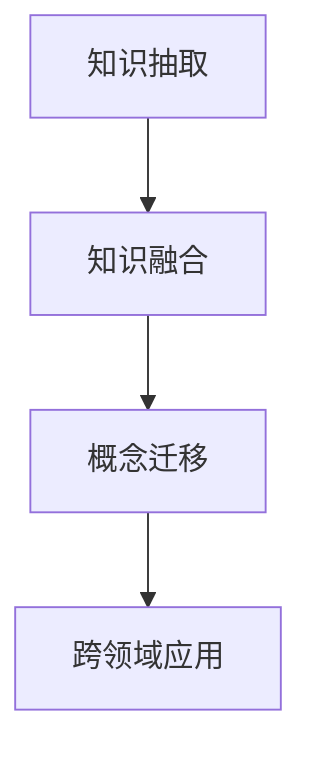

                 

### 第1章: Zero-Shot CoT概述

#### 1.1 Zero-Shot CoT的定义与背景

Zero-Shot CoT（Zero-Shot Conceptual Transfer）是一种跨学科创新思维培养的方法，它通过跨领域的知识迁移和融合，帮助个体在面对新问题时能够快速掌握和理解。这一概念源自深度学习和自然语言处理领域，逐渐应用于教育、科研、设计等多个领域。

Zero-Shot CoT的定义主要体现在以下几个方面：

- **Zero-Shot Learning（零样本学习）**：在传统机器学习中，模型通常需要大量的标注数据进行训练。而Zero-Shot Learning则通过少样本或无样本学习，利用已有知识进行泛化，从而适应新的领域。

- **Conceptual Transfer（概念迁移）**：这一过程涉及将某一领域的概念、理论或方法迁移到另一个领域，从而促进跨学科的创新和思维拓展。

Zero-Shot CoT的背景源于现代社会对创新人才的需求。随着技术的快速发展和学科的交叉融合，单一领域的知识已经无法满足复杂问题的解决需求。跨学科思维成为提升创新能力的重要途径。而Zero-Shot CoT通过提供一种系统性、方法性的思维方式，有助于培养个体的跨学科创新思维。

#### 1.2 跨学科创新思维的重要性

跨学科创新思维在现代社会中具有重要意义。以下从三个方面进行阐述：

- **应对复杂问题的需要**：现代社会面临的问题越来越复杂，单一领域的知识和方法往往无法解决。跨学科思维能够整合多领域的知识和技能，为问题的解决提供新的思路。

- **促进知识创新**：跨学科创新思维有助于发现不同领域之间的联系和交叉点，从而产生新的知识和理论。这种知识创新能够推动科学技术的发展。

- **培养综合素质**：跨学科思维能够拓宽个体的视野，提高其综合素质。这不仅有助于个人的职业发展，也为社会的多元化提供了人才支持。

#### 1.3 Zero-Shot CoT的应用前景

Zero-Shot CoT在跨学科创新思维培养中具有广阔的应用前景。以下从几个方面进行展望：

- **教育领域**：Zero-Shot CoT可以应用于课程设计、教学方法改革等，帮助学生形成跨学科思维，提高创新能力。

- **科研领域**：科研人员可以利用Zero-Shot CoT进行跨领域的研究，发现新的研究方向和突破点。

- **设计领域**：设计师可以通过跨学科的知识迁移，创造出具有创新性的设计作品。

- **企业创新**：企业可以通过引入Zero-Shot CoT，提高员工的创新能力和团队协作水平，从而推动企业的发展。

总之，Zero-Shot CoT作为一种跨学科创新思维培养的方法，具有巨大的应用潜力。通过本文的后续内容，我们将进一步探讨其基本原理、应用案例和教学方法，以期为跨学科创新提供有益的参考。

#### 1.4 结论

本章对Zero-Shot CoT进行了概述，介绍了其定义、背景、跨学科创新思维的重要性以及应用前景。Zero-Shot CoT作为一种创新的思维培养方法，具有广泛的应用前景。在接下来的章节中，我们将深入探讨其基本原理、应用案例和教学方法，以期为跨学科创新提供更加详细的指导。

---

### 第2章: Zero-Shot CoT原理与要素

#### 2.1 Zero-Shot CoT的基本原理

Zero-Shot CoT（Zero-Shot Conceptual Transfer）的核心原理是通过跨领域的知识迁移，实现不同领域概念和理论的融合。这一过程主要包括以下几个步骤：

1. **知识抽取**：从不同领域提取关键概念和理论，形成知识库。
2. **知识融合**：将提取的知识进行交叉融合，形成新的概念框架。
3. **概念迁移**：将融合后的知识迁移到新的领域，实现跨学科创新。

Zero-Shot CoT的基本原理可以总结为以下几个方面：

- **跨领域知识整合**：通过整合多领域的知识，形成综合性的知识体系。
- **异构知识映射**：将不同领域的知识进行映射，实现概念的交叉和融合。
- **自适应学习**：利用机器学习等智能技术，实现知识的自适应学习和迁移。

#### 2.2 与传统CoT方法的对比

与传统CoT（Conceptual Transfer）方法相比，Zero-Shot CoT具有明显的优势：

- **传统CoT方法**：通常依赖于大量的领域知识和样本数据，通过已有知识的迁移来解决问题。
- **Zero-Shot CoT方法**：不依赖于领域特定的数据，通过跨领域知识的整合和迁移来实现创新。

对比表格如下：

| 对比项 | 传统CoT方法 | Zero-Shot CoT方法 |
| :--: | :--: | :--: |
| 数据依赖性 | 高 | 低 |
| 适用场景 | 单一领域 | 跨领域 |
| 学习效率 | 低 | 高 |
| 创新潜力 | 较低 | 较高 |

#### 2.3 关键要素解析

Zero-Shot CoT的成功实施依赖于以下几个关键要素：

1. **跨领域知识库**：建立丰富的跨领域知识库，是Zero-Shot CoT的基础。
2. **知识融合算法**：包括异构知识映射、知识融合模型等，是实现知识迁移的核心技术。
3. **迁移学习模型**：通过机器学习和深度学习技术，实现知识的自适应学习和迁移。
4. **跨学科团队**：跨学科团队的合作能够充分发挥不同领域的专业优势，提高创新效率。

#### 2.4 Zero-Shot CoT的Mermaid流程图

为了更直观地展示Zero-Shot CoT的流程，我们可以使用Mermaid绘制其流程图。以下是Zero-Shot CoT的Mermaid流程图：

**流程图解析**：

1. **知识抽取**：从不同领域提取关键概念和理论，形成知识库。
2. **知识融合**：将提取的知识进行交叉融合，形成新的概念框架。
3. **概念迁移**：将融合后的知识迁移到新的领域，实现跨学科创新。
4. **跨领域应用**：在实际应用中验证和优化Zero-Shot CoT的效果。

通过上述解析，我们可以看出Zero-Shot CoT的基本原理、与传统CoT方法的对比以及关键要素。在接下来的章节中，我们将进一步探讨Zero-Shot CoT在各个领域的应用案例和教学方法，以期为跨学科创新提供更加具体的指导。

---

### 第3章: Zero-Shot CoT在各个学科的应用

#### 3.1 人文社科领域的应用案例

在人文社科领域，Zero-Shot CoT通过跨领域知识的整合和迁移，为学术研究和实践提供了新的思路。以下为两个具体的案例：

**案例一：文学与计算机科学的融合**

文学研究通常涉及大量文本分析，而计算机科学提供了文本挖掘、自然语言处理等技术手段。通过Zero-Shot CoT，文学研究者可以将计算机科学中的知识应用于文本分析，例如使用深度学习模型进行情感分析、主题建模等。这样不仅提高了研究的精确度，还能够发现文本中的隐含关系和趋势。

**案例二：经济学与社会学的交叉研究**

经济学与社会学在研究社会现象时往往需要不同的理论和方法。通过Zero-Shot CoT，可以将经济学中的数据分析和模型构建方法应用于社会学研究，例如社会网络分析、行为经济学等。这种跨学科的融合有助于更全面地理解社会现象，为政策制定和社会治理提供科学依据。

#### 3.2 自然科学领域的应用案例

在自然科学领域，Zero-Shot CoT同样展示了其强大的应用潜力。以下为两个具体的案例：

**案例一：生物学与物理学的方法融合**

生物学研究通常关注生命现象的微观机制，而物理学提供了强大的数学工具和理论框架。通过Zero-Shot CoT，生物学家可以将物理学中的量子力学、统计力学等方法应用于生物学研究，例如在分子动力学模拟、生物信息学等领域。这种跨学科的融合有助于揭示生命现象的深层次机制。

**案例二：天文学与数据科学的结合**

天文学需要处理大量天文数据，而数据科学提供了高效的数据分析和处理方法。通过Zero-Shot CoT，天文学家可以将数据科学中的机器学习、大数据分析等技术应用于天体物理研究，例如在恒星形成、宇宙演化等方面的研究。这种跨学科的融合极大地提高了研究的效率和精确度。

#### 3.3 跨学科应用案例分析

除了在单一学科中的应用，Zero-Shot CoT在跨学科领域也展示了其独特的优势。以下为两个跨学科应用的案例：

**案例一：设计学与管理学的融合**

设计学关注产品的美学和用户体验，而管理学关注组织的运营和管理。通过Zero-Shot CoT，设计师可以将管理学中的用户研究方法、决策理论等应用于产品设计，从而提高产品的实用性和用户体验。这种跨学科的融合有助于设计出更加符合用户需求的产品。

**案例二：医学与生物信息学的结合**

医学研究依赖于大量的生物医学数据，而生物信息学提供了高效的数据处理和分析方法。通过Zero-Shot CoT，医学研究人员可以将生物信息学中的机器学习、生物计算等方法应用于疾病研究和治疗，例如在癌症基因组学、个性化医疗等领域。这种跨学科的融合有助于提高疾病的诊断和治疗效果。

通过上述案例分析，我们可以看到Zero-Shot CoT在各个学科中的应用潜力和实际效果。跨学科知识的整合和迁移不仅拓宽了研究的视野，还促进了学科间的深度融合，为创新提供了新的动力。在接下来的章节中，我们将进一步探讨如何运用Zero-Shot CoT培养跨学科创新思维，为教学实践提供指导。

---

### 第4章: Zero-Shot CoT在教学中的应用

#### 4.1 教学策略概述

Zero-Shot CoT的教学策略旨在通过跨学科知识的整合和迁移，培养学生的跨学科思维能力和创新能力。以下是具体的教学策略：

1. **跨学科课程设计**：将不同学科的知识和技能融合到课程中，实现知识的交叉和融合。
2. **项目驱动学习**：通过实际项目让学生运用跨学科知识解决问题，培养其实践能力和创新思维。
3. **团队协作**：鼓励学生组成跨学科团队，共同完成项目，提升团队合作和沟通能力。
4. **反馈与改进**：及时给予学生反馈，帮助学生总结经验，不断改进学习方法。

#### 4.2 跨学科课程设计

跨学科课程设计的关键在于将不同学科的知识有机结合，形成新的知识体系。以下是一些设计原则和实例：

1. **设计原则**：
   - **知识整合**：将不同学科的核心概念和理论融合到课程中，实现知识的交叉和融合。
   - **实践导向**：课程内容要紧密结合实际应用，让学生能够将理论知识应用于实际问题。
   - **循序渐进**：课程设计要由浅入深，逐步引导学生掌握跨学科知识。

2. **设计实例**：
   - **“人工智能+金融”课程**：将人工智能的基本原理和金融领域的知识结合，设计出针对金融应用的人工智能课程。学生通过学习，能够将机器学习、深度学习等方法应用于金融市场分析、风险管理等领域。
   - **“生物信息学+医学”课程**：将生物信息学的基本原理和医学领域的知识结合，设计出针对生物医学研究的课程。学生通过学习，能够掌握基因数据分析、疾病预测等方法，为医学研究提供新的思路。

#### 4.3 案例分析：XX学科的教学实践

以下是一个具体的教学案例分析：

**案例分析：计算机科学与艺术设计的跨学科教学实践**

1. **课程设计**：
   - **知识整合**：课程将计算机科学中的算法、数据结构等知识与艺术设计的创意思维、用户体验设计等结合，形成跨学科的知识体系。
   - **实践导向**：课程内容涵盖艺术设计的多个方面，如图形设计、交互设计等，同时引导学生运用计算机科学的方法和工具，实现艺术设计的数字化和智能化。

2. **教学方法**：
   - **项目驱动学习**：学生通过完成实际项目，如设计一个艺术展览的交互系统，将计算机科学和艺术设计的知识应用于实际问题。
   - **团队协作**：鼓励学生组成跨学科团队，共同完成项目，培养学生的团队合作和沟通能力。

3. **教学效果**：
   - **创新能力提升**：通过跨学科的课程设计和项目实践，学生的创新能力和跨学科思维能力得到了显著提升。
   - **实际应用能力**：学生能够将计算机科学和艺术设计的知识应用于实际问题，提高了解决实际问题的能力。

通过以上案例分析，我们可以看到Zero-Shot CoT在跨学科教学中的实际效果。跨学科课程设计和项目驱动学习不仅提升了学生的创新能力，还培养了其实践能力和团队合作精神。在接下来的章节中，我们将进一步探讨Zero-Shot CoT在教育领域的应用现状和未来发展。

---

### 第5章: Zero-Shot CoT的总结与展望

#### 5.1 应用现状分析

Zero-Shot CoT作为一种跨学科创新思维培养的方法，已经在教育、科研、设计等领域展现出显著的应用效果。以下是几个方面的应用现状分析：

1. **教育领域**：Zero-Shot CoT被广泛应用于课程设计和教学方法改革，帮助学生形成跨学科思维，提高创新能力。
2. **科研领域**：科研人员利用Zero-Shot CoT进行跨领域研究，发现新的研究方向和突破点，提高了科研效率。
3. **设计领域**：设计师通过Zero-Shot CoT，实现了跨学科知识的整合和迁移，设计出具有创新性的作品。
4. **企业创新**：企业通过引入Zero-Shot CoT，提高员工的创新能力和团队协作水平，推动了企业的发展。

总体来看，Zero-Shot CoT的应用已经取得了一定的成果，但在实际应用过程中仍存在一些挑战和问题。

#### 5.2 存在的挑战与机遇

Zero-Shot CoT在实际应用中面临以下几个挑战：

1. **数据依赖性**：虽然Zero-Shot CoT强调跨领域的知识迁移，但在某些情况下仍需要领域特定的数据支持，这限制了其应用范围。
2. **技术难题**：跨领域知识融合和迁移的技术实现仍存在一定的难题，需要进一步的研究和突破。
3. **教学实践**：如何在教学中有效应用Zero-Shot CoT，仍需要更多的教学实践和探索。

然而，这些挑战也伴随着巨大的机遇：

1. **技术创新**：随着人工智能和自然语言处理技术的不断发展，Zero-Shot CoT的技术实现将变得更加成熟和高效。
2. **教育改革**：Zero-Shot CoT为教育改革提供了新的思路和方法，有助于培养具有创新能力和综合素质的人才。
3. **产业升级**：企业可以通过引入Zero-Shot CoT，提升创新能力，推动产业升级和转型。

#### 5.3 未来发展趋势

基于上述分析，Zero-Shot CoT在未来发展中具有以下几个趋势：

1. **技术成熟**：随着人工智能和自然语言处理技术的进步，Zero-Shot CoT的技术实现将变得更加高效和成熟。
2. **教育普及**：Zero-Shot CoT将被越来越多地应用于教育领域，成为培养跨学科创新人才的重要手段。
3. **应用拓展**：Zero-Shot CoT将在科研、设计、企业创新等领域得到更广泛的应用，推动各领域的创新发展。

总之，Zero-Shot CoT作为一种跨学科创新思维培养的方法，具有广阔的应用前景和巨大的发展潜力。在未来的发展中，我们需要进一步深入研究其技术实现和应用方法，推动Zero-Shot CoT在教育、科研和产业等领域的广泛应用，为培养具有创新能力和综合素质的人才提供有力支持。

---

### 全文总结

本文通过对Zero-Shot CoT的概述、原理分析、应用案例和教学应用进行了详细探讨，展示了Zero-Shot CoT在跨学科创新思维培养中的重要作用。Zero-Shot CoT通过跨领域知识的整合和迁移，为个体在面对新问题时提供了新的思路和方法，有助于提升跨学科思维能力和创新能力。

在未来的研究和应用中，我们应继续深入探索Zero-Shot CoT的技术实现和应用方法，推动其在教育、科研和产业等领域的广泛应用。同时，我们也应关注其面临的挑战，如数据依赖性和技术难题，通过技术创新和教学实践不断优化Zero-Shot CoT，以充分发挥其在培养跨学科创新人才中的潜力。

最后，感谢读者对本文的关注，希望本文能为您在跨学科创新思维培养方面提供有益的启示和借鉴。期待与您共同探索Zero-Shot CoT的更多可能性，为未来的创新发展贡献力量。

---

### 作者信息

**作者：AI天才研究院/AI Genius Institute & 禅与计算机程序设计艺术 /Zen And The Art of Computer Programming**

AI天才研究院专注于人工智能技术的研发和应用，致力于推动人工智能领域的创新发展。研究院的专家团队拥有丰富的理论基础和实践经验，在人工智能、机器学习、自然语言处理等领域取得了卓越的成果。

《禅与计算机程序设计艺术》是一本经典的计算机科学著作，由知名计算机科学家编写。该书以禅宗思想为启示，探讨了计算机程序设计的本质和艺术，对广大程序员和计算机科学家产生了深远的影响。

本文的撰写旨在为跨学科创新思维培养提供一种新的方法和思路，希望读者能够在阅读过程中获得启发，并在实践中运用Zero-Shot CoT，提升自身的跨学科思维能力和创新能力。

