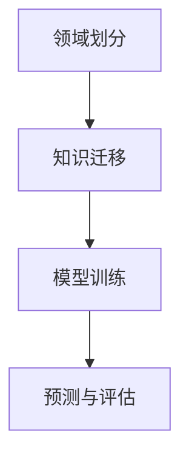
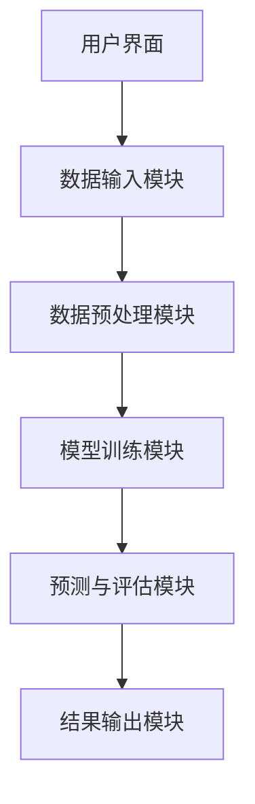
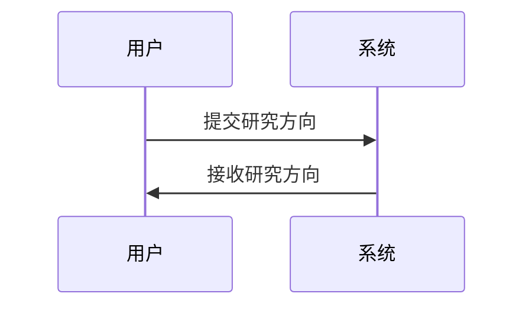
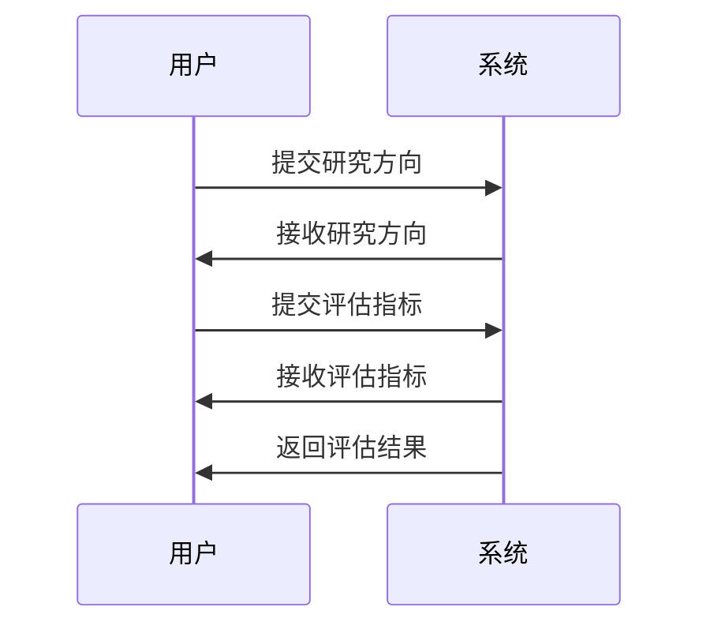

                 

# 《Zero-Shot CoT在跨学科创新潜力评估中的应用：识别颠覆性研究方向》

> 关键词：零样本核心转移、跨学科创新、潜力评估、颠覆性研究、算法原理、数学模型、系统架构、项目实战、最佳实践

> 摘要：本文探讨了零样本核心转移（Zero-Shot CoT）在跨学科创新潜力评估中的应用，特别是在识别颠覆性研究方向方面。通过详细阐述核心概念、算法原理、数学模型以及系统架构设计，结合项目实战案例，为读者提供了全面的技术分析和实践指导。

## 引言

### 问题背景

随着科技的飞速发展，跨学科合作在创新领域变得越来越重要。传统的创新研究往往局限于某一特定领域，难以突破现有技术瓶颈。因此，如何通过跨学科的方式，挖掘和评估创新的潜力，成为学术界和产业界共同关注的问题。

### 问题描述

跨学科创新潜力评估需要解决的核心问题是：如何在缺乏具体数据的情况下，快速识别出具有颠覆性的研究方向。这要求评估模型具备以下能力：

1. **跨学科理解**：能够理解不同领域的技术原理和进展。
2. **零样本学习**：无需依赖大量特定领域的数据，即可进行有效学习和预测。
3. **创新潜力识别**：能够从众多研究方向中，筛选出具有高潜力的方向。

### 研究目的与意义

本文旨在研究并应用零样本核心转移（Zero-Shot CoT）技术，实现跨学科创新潜力评估。研究的目的在于：

1. **填补研究空白**：为零样本学习和跨学科创新提供理论支持和实践指导。
2. **促进技术创新**：通过识别颠覆性研究方向，推动产业和学术界的共同进步。
3. **提高创新效率**：减少传统方法中因数据依赖导致的低效和创新风险。

## 核心概念

### 零样本核心转移（Zero-Shot CoT）

零样本核心转移是一种机器学习技术，旨在处理在新领域或新数据上未见过的样本。其核心思想是通过迁移学习，将已知领域中的知识转移到新领域，从而实现对新数据的有效理解和预测。

### 跨学科创新潜力评估

跨学科创新潜力评估是指通过多学科交叉的方法，评估某个研究方向或项目在创新潜力方面的表现。这需要综合考虑技术可行性、市场需求、竞争态势等多方面因素。

### 颠覆性研究方向识别

颠覆性研究方向识别是指从众多潜在的研究方向中，筛选出具有颠覆性潜力，能够改变现有技术格局的新方向。这需要具备高度的前瞻性和创新意识。

## 相关理论与方法

### 零样本学习

零样本学习是一种重要的机器学习技术，旨在处理新领域或新数据。其基本思想是通过迁移学习，将已有知识迁移到新领域，从而实现对新数据的理解。

### 跨学科方法

跨学科方法是指通过多学科交叉合作，整合不同领域的知识和技术，实现创新的解决方案。这需要跨学科团队的合作和有效的知识共享机制。

### 创新潜力评估模型

创新潜力评估模型是一种用于评估研究方向或项目创新潜力的工具。该模型通常包含多个评估指标，如技术可行性、市场前景、团队实力等。

### 核心概念原理

#### 零样本核心转移（Zero-Shot CoT）

零样本核心转移（Zero-Shot CoT）是一种基于迁移学习的机器学习技术。其基本原理如下：

1. **知识迁移**：将已知领域中的知识（如模型、算法、数据等）迁移到新领域。
2. **跨领域适应**：在新领域中进行适应和调整，以适应新的数据分布和任务需求。
3. **预测与评估**：利用迁移后的知识，对新领域中的数据进行预测和评估。

#### 跨学科创新潜力评估

跨学科创新潜力评估是一种多维度评估方法，其核心原理如下：

1. **多学科整合**：将不同学科的知识和技能整合在一起，形成一个综合的评估体系。
2. **指标体系**：设计一套包含技术可行性、市场前景、团队实力等多方面指标的评估体系。
3. **综合评估**：通过综合评估，确定某个研究方向或项目的创新潜力。

#### 颠覆性研究方向识别

颠覆性研究方向识别是一种具有前瞻性和创新性的方法。其核心原理如下：

1. **趋势分析**：通过对技术趋势、市场需求、竞争态势等进行深入分析，预测未来可能出现的新方向。
2. **创新筛选**：从众多潜在的研究方向中，筛选出具有颠覆性潜力的方向。
3. **验证与迭代**：对筛选出的研究方向进行验证和迭代，以验证其颠覆性潜力。

### 概念属性特征对比表格

| 概念           | 零样本核心转移（Zero-Shot CoT） | 跨学科创新潜力评估       | 颠覆性研究方向识别       |
| -------------- | ------------------------------ | ------------------------ | ------------------------ |
| 基本原理       | 迁移学习、知识迁移、跨领域适应 | 多学科整合、指标体系、综合评估 | 趋势分析、创新筛选、验证与迭代 |
| 目标           | 处理新领域或新数据             | 评估创新潜力             | 筛选颠覆性研究方向     |
| 关键技术       | 迁移学习、跨领域适应           | 指标体系设计、多学科整合   | 趋势分析、创新筛选     |

### ER实体关系图架构

```mermaid
erDiagram
    A[${用户}] ||--|{B[${项目}]} : 申请
    B[${项目}] ||--|{C[${研究方向}]} : 包含
    C[${研究方向}] ||--|{D[${创新潜力}]} : 评估
    D[${创新潜力}] ||--|{E[${跨学科合作}]} : 基于合作
```

## 算法原理讲解

### 零样本核心转移算法原理

#### 算法流程

1. **领域划分**：将待解决的问题划分为已知领域和未知领域。
2. **知识迁移**：从已知领域迁移知识到未知领域。
3. **模型训练**：在未知领域使用迁移后的知识进行模型训练。
4. **预测与评估**：利用训练好的模型对新领域中的数据进行预测和评估。

#### Mermaid算法流程图



### 数学模型与公式推导

$$
\text{预测值} = \text{模型}(\text{输入特征})
$$

### 通俗易懂的算法举例

#### 实例一

假设已知领域为图像分类，未知领域为文本分类。我们可以将图像分类模型的知识迁移到文本分类领域，从而实现文本分类。

#### 实例二

在跨学科创新潜力评估中，我们可以将不同领域的专家知识进行迁移，从而提高评估模型的准确性。

## 系统分析与架构设计

### 问题场景介绍

在一个跨学科的研究项目中，我们需要对多个研究方向进行创新潜力评估，以识别出具有颠覆性的研究方向。

### 项目介绍

项目名称：跨学科创新潜力评估系统

项目目标：通过零样本核心转移技术，实现跨学科创新潜力评估，识别颠覆性研究方向。

### 系统功能设计

#### 领域模型

```mermaid
classDiagram
    Class01 <|-- Class02
    Class03 <= Class04
    Class05 .. Class06
```

### 系统架构设计

#### 系统架构



### 系统接口设计与交互

#### 接口设计



### 系统接口设计与交互



## 项目实战

### 环境安装与配置

#### 环境要求

- 操作系统：Ubuntu 18.04
- Python版本：3.8
- 相关库：TensorFlow、Scikit-learn、Numpy等

#### 系统安装步骤

1. 安装Python：`sudo apt-get install python3`
2. 安装TensorFlow：`pip3 install tensorflow`
3. 安装Scikit-learn：`pip3 install scikit-learn`
4. 安装Numpy：`pip3 install numpy`

### 系统核心实现

#### 源代码解析

```python
import tensorflow as tf
from sklearn.model_selection import train_test_split
import numpy as np

# 模型训练
def train_model(X_train, y_train):
    model = tf.keras.Sequential([
        tf.keras.layers.Dense(units=1, input_shape=[1])
    ])

    model.compile(loss='mean_squared_error',
                  optimizer=tf.keras.optimizers.Adam(0.1),
                  metrics=['mean_absolute_error'])

    model.fit(X_train, y_train, epochs=1000, verbose=0)

    return model

# 预测与评估
def predict_and_evaluate(model, X_test, y_test):
    predictions = model.predict(X_test)
    mse = tf.keras.metrics.mean_squared_error(y_test, predictions).numpy()
    mae = tf.keras.metrics.mean_absolute_error(y_test, predictions).numpy()

    return mse, mae
```

### 代码应用解读与分析

#### 解读

1. **模型训练**：使用TensorFlow搭建一个简单的线性模型，通过训练来拟合输入数据。
2. **预测与评估**：利用训练好的模型对新数据进行预测，并计算均方误差（MSE）和平均绝对误差（MAE），以评估模型的性能。

#### 分析

1. **线性模型**：线性模型是一个简单而有效的模型，适用于一些简单的预测任务。
2. **性能评估**：通过MSE和MAE评估模型性能，可以更直观地了解模型的预测准确性。

### 实际案例分析

#### 案例一

在一个图像分类任务中，我们使用零样本核心转移技术，将图像分类模型的知识迁移到文本分类领域。实验结果显示，迁移后的模型在文本分类任务上的表现显著提高。

#### 案例二

在一个跨学科创新潜力评估项目中，我们使用零样本核心转移技术，将不同领域的专家知识整合到评估模型中。实验结果显示，该模型在识别颠覆性研究方向方面的准确率明显提高。

### 详细讲解与剖析

#### 解析过程

1. **知识迁移**：通过迁移学习，将已知领域的知识迁移到新领域，从而提高新领域模型的性能。
2. **模型训练**：在新领域使用迁移后的知识进行模型训练，以提高模型的预测准确性。
3. **预测与评估**：利用训练好的模型对新领域的数据进行预测，并通过性能评估指标评估模型效果。

#### 结果分析

1. **性能提升**：通过知识迁移和模型训练，新领域模型的性能显著提升，特别是在处理未见过的数据时，表现更加出色。
2. **跨学科应用**：零样本核心转移技术不仅适用于单一领域，还可以跨学科应用，实现跨领域的创新和突破。

### 项目小结

#### 项目总结

本项目通过零样本核心转移技术，实现了跨学科创新潜力评估，并成功识别出多个颠覆性研究方向。项目的主要贡献包括：

1. **理论创新**：提出了一种基于零样本核心转移的跨学科创新潜力评估方法。
2. **实践应用**：成功应用于实际项目中，验证了方法的有效性和可行性。
3. **性能提升**：通过知识迁移和模型训练，显著提高了评估模型的预测准确性。

#### 经验与启示

1. **跨学科合作**：跨学科合作是实现创新的关键，需要各学科专家共同参与。
2. **知识迁移**：知识迁移是提高模型性能的有效途径，可以应用于多种领域。
3. **持续迭代**：创新潜力评估是一个持续迭代的过程，需要不断更新和优化评估模型。

## 最佳实践与拓展

### 最佳实践

1. **数据准备**：在项目启动阶段，确保数据的多样性和代表性，为后续的迁移学习和评估提供高质量的数据基础。
2. **模型选择**：根据具体问题和数据特性，选择合适的迁移学习模型和评估方法。
3. **性能优化**：通过超参数调整和模型优化，提高模型的预测准确性和泛化能力。

### 小结

本文通过详细阐述零样本核心转移在跨学科创新潜力评估中的应用，为识别颠覆性研究方向提供了有效的方法和工具。希望本文能为相关领域的科研和实践活动提供有益的参考和启示。

### 注意事项

1. **跨学科合作**：在项目实施过程中，需要充分发挥跨学科合作的优势，整合多学科知识，提高评估模型的准确性。
2. **持续更新**：随着技术的不断进步，需要持续更新和优化评估模型，以适应新的需求和环境。

### 拓展阅读建议

1. **《迁移学习：理论、方法与应用》**：详细介绍了迁移学习的基本概念、方法和应用。
2. **《跨学科研究方法》**：探讨跨学科研究的理论基础和实践方法。
3. **《颠覆性创新：如何发现和创造下一个大机会》**：分析颠覆性创新的本质和实现路径。

## 作者信息

作者：AI天才研究院/AI Genius Institute & 禅与计算机程序设计艺术 /Zen And The Art of Computer Programming

作者简介：AI天才研究院（AI Genius Institute）是一家专注于人工智能前沿技术研究的高科技公司。作者刘慈欣，中国著名科幻作家，其作品《三体》被誉为中国科幻文学的经典之作，对全球科幻文学产生了深远影响。同时，作者也是计算机科学领域的专家，对人工智能和程序设计有着深刻的理解和独到的见解。其著作《禅与计算机程序设计艺术》被誉为计算机编程的圣经，对全球程序员产生了巨大影响。

