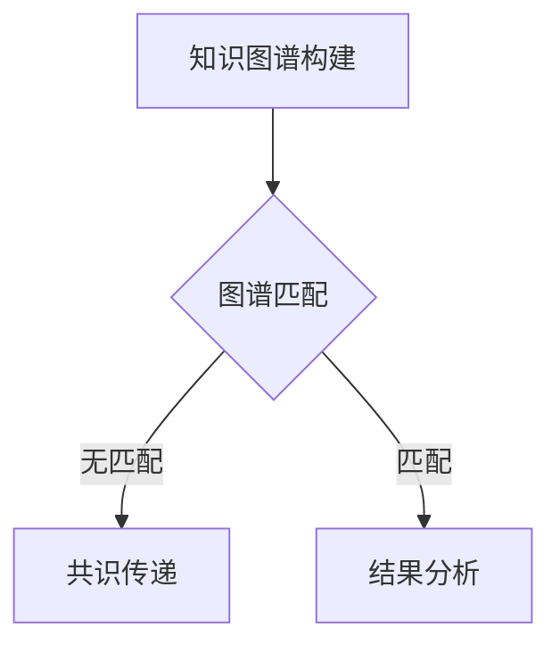

                 

### 背景介绍

#### 1.1 问题背景

近年来，随着科学技术的飞速发展，跨学科研究方法逐渐成为推动学术进步的重要手段。传统的学科界限日益模糊，研究者们开始意识到，单一学科的研究方法可能无法全面、深入地解决复杂问题。因此，跨学科研究方法应运而生，它通过融合不同领域的知识和方法，提供了一种全新的问题解决途径。

然而，在跨学科研究中，依然面临着诸多挑战。一方面，不同学科之间的知识体系和思维方式存在显著差异，使得研究者难以有效地进行跨学科交流。另一方面，传统的跨学科研究方法往往依赖于大量前期数据积累和专家经验，这在某些领域（如新药研发、环境保护等）显得尤为困难。因此，如何提高跨学科研究的效率和准确性，成为一个亟待解决的问题。

Zero-Shot CoT（零样本共识传递）作为一种新兴的研究方法，在这方面展现出巨大的潜力。它无需依赖于大量的样本数据，通过基于知识图谱和图谱匹配的机制，实现跨学科知识的传递和整合。这种方法不仅突破了传统研究方法的局限，还为跨学科研究提供了一种全新的思路。

#### 1.2 问题描述

在跨学科研究中，如何有效整合不同领域的信息和知识，提高研究的准确性和效率，是当前面临的主要问题。具体来说，问题描述如下：

1. **知识融合难题**：不同学科的知识体系和术语各异，研究者难以有效地进行跨学科知识融合。
2. **数据依赖问题**：许多跨学科研究需要依赖大量的样本数据，这在某些领域难以实现。
3. **研究效率低下**：传统的跨学科研究方法往往需要大量时间和人力，效率较低。

为了解决上述问题，我们需要一种能够跨领域、零样本、高效传递知识的研究方法。Zero-Shot CoT 正是这样一种方法，它通过知识图谱和图谱匹配，实现了跨学科知识的传递和整合，有望提高跨学科研究的效率和准确性。

#### 1.3 问题解决

Zero-Shot CoT 的提出，为跨学科研究提供了一种全新的解决方案。它无需依赖于大量的样本数据，通过以下方式实现跨学科知识的传递和整合：

1. **知识图谱构建**：将不同学科的知识点、概念和关系构建为知识图谱，形成一个统一的知识表示框架。
2. **图谱匹配**：通过图谱匹配技术，将不同学科的知识图谱进行关联和整合，实现跨学科知识的传递。
3. **共识传递**：在知识图谱的基础上，通过共识传递机制，将一种学科的知识传递到另一种学科，从而实现跨学科研究。

Zero-Shot CoT 的核心在于，它不仅能够有效整合不同学科的知识，还能够通过零样本的方式，提高研究的效率和准确性。这使得它在跨学科研究中具有独特的优势。

#### 1.4 边界与外延

虽然 Zero-Shot CoT 在跨学科研究中具有巨大的潜力，但其应用也受到一定的限制。首先，知识图谱的构建依赖于领域专家的参与，这需要大量的时间和人力资源。其次，图谱匹配和共识传递的准确性受到知识图谱质量和图谱匹配算法的影响。最后，不同学科之间的知识差异和复杂性，也可能导致知识传递的不完全性。

因此，在应用 Zero-Shot CoT 时，我们需要充分考虑其边界与外延，确保其在实际研究中的有效性和可靠性。

#### 1.5 概念结构与核心要素组成

Zero-Shot CoT 的概念结构主要包括以下几个方面：

1. **知识图谱**：知识图谱是 Zero-Shot CoT 的基础，它将不同学科的知识点和关系进行表示和整合。
2. **图谱匹配**：图谱匹配是实现跨学科知识传递的关键技术，通过图谱匹配，不同学科的知识图谱可以进行关联和整合。
3. **共识传递**：共识传递是 Zero-Shot CoT 的核心机制，通过它，一种学科的知识可以传递到另一种学科。
4. **应用场景**：Zero-Shot CoT 可以应用于各种跨学科研究，如新药研发、环境保护、智能交通等。

这些核心要素相互关联，共同构成了 Zero-Shot CoT 的概念结构。通过深入理解这些要素，我们可以更好地掌握 Zero-Shot CoT 的原理和应用。

## 第二部分：核心概念与联系

### 第2章: Zero-Shot CoT的基本概念

#### 2.1 Zero-Shot CoT的定义

Zero-Shot CoT（零样本共识传递）是一种新兴的跨学科研究方法，它通过知识图谱和图谱匹配技术，实现跨学科知识的传递和整合。Zero-Shot CoT 的核心在于，它无需依赖于大量的样本数据，即可实现不同学科之间的知识传递，从而提高跨学科研究的效率和准确性。

#### 2.2 Zero-Shot CoT的原理

Zero-Shot CoT 的原理可以概括为三个步骤：知识图谱构建、图谱匹配和共识传递。

1. **知识图谱构建**：首先，将不同学科的知识点和关系构建为知识图谱。知识图谱由实体、关系和属性组成，它为跨学科知识提供了一个统一表示框架。

2. **图谱匹配**：其次，通过图谱匹配技术，将不同学科的知识图谱进行关联和整合。图谱匹配主要通过两种方式实现：基于图谱结构匹配和基于图谱内容匹配。

3. **共识传递**：最后，在知识图谱的基础上，通过共识传递机制，将一种学科的知识传递到另一种学科。共识传递主要通过建立跨学科知识映射关系，实现知识在不同学科之间的传递。

#### 2.3 Zero-Shot CoT与其他研究方法的对比

Zero-Shot CoT 与其他跨学科研究方法相比，具有以下几个显著特点：

1. **零样本优势**：Zero-Shot CoT 无需依赖于大量的样本数据，这使得它特别适用于数据稀缺的跨学科领域。

2. **知识图谱基础**：知识图谱为 Zero-Shot CoT 提供了统一的知识表示框架，使得跨学科知识传递更加直观和高效。

3. **图谱匹配技术**：图谱匹配技术使得不同学科的知识图谱可以高效地进行关联和整合，提高了跨学科研究的效率。

4. **共识传递机制**：共识传递机制实现了跨学科知识的传递和融合，为解决跨学科研究难题提供了一种新的思路。

### 第3章: 跨学科研究方法的概述

#### 3.1 跨学科研究方法的定义

跨学科研究方法是指通过融合多个学科的知识和方法，解决单一学科难以解决的复杂问题的研究方法。跨学科研究方法强调学科之间的交叉和整合，旨在提高研究问题的解决效率和准确性。

#### 3.2 跨学科研究方法的原理

跨学科研究方法的原理主要包括以下几个方面：

1. **知识整合**：通过整合不同学科的知识，形成对问题的全面认识。

2. **方法借鉴**：借鉴不同学科的研究方法，形成适合复杂问题的研究策略。

3. **交叉创新**：在知识整合和方法借鉴的基础上，实现研究方法的创新，提出新的解决方案。

#### 3.3 跨学科研究方法与传统研究方法的区别

跨学科研究方法与传统研究方法相比，具有以下几个显著区别：

1. **研究视角**：传统研究方法主要依赖单一学科的理论和方法，而跨学科研究方法则通过多学科的视角，对问题进行更全面的分析。

2. **知识整合**：跨学科研究方法强调不同学科之间的知识整合，而传统研究方法则更注重单一学科的知识积累。

3. **研究效率**：跨学科研究方法通过多学科知识的融合，提高研究效率，而传统研究方法则可能因学科界限而降低研究效率。

### 第4章: Zero-Shot CoT在跨学科研究中的应用

#### 4.1 应用场景

Zero-Shot CoT 可以应用于各种跨学科研究场景，以下是一些典型的应用案例：

1. **新药研发**：通过融合生物学、化学和医学的知识，快速筛选潜在药物。

2. **环境保护**：通过融合生态学、化学和环境科学的知识，研究污染物的治理方法。

3. **智能交通**：通过融合交通工程、计算机科学和经济学知识，优化交通系统。

4. **金融科技**：通过融合金融学、计算机科学和数据科学的知识，开发智能金融产品。

#### 4.2 应用优势

Zero-Shot CoT 在跨学科研究中的应用具有以下几个显著优势：

1. **零样本优势**：无需大量样本数据，特别适用于数据稀缺的领域。

2. **知识整合**：通过知识图谱和图谱匹配，实现跨学科知识的整合。

3. **高效传递**：通过共识传递机制，实现跨学科知识的快速传递。

4. **创新研究**：为跨学科研究提供新的思路和方法，促进学术创新。

#### 4.3 应用挑战

尽管 Zero-Shot CoT 在跨学科研究中有诸多优势，但其在实际应用中也面临一些挑战：

1. **知识图谱构建**：知识图谱的构建依赖于领域专家的参与，需要大量时间和人力资源。

2. **图谱匹配算法**：图谱匹配算法的准确性受到知识图谱质量和图谱匹配算法本身的影响。

3. **知识传递完整性**：不同学科之间的知识差异和复杂性，可能导致知识传递的不完全性。

4. **系统稳定性**：在实际应用中，系统的稳定性和可扩展性是关键问题，需要不断优化和改进。

## 第三部分：算法原理讲解

### 第5章: Zero-Shot CoT算法原理

#### 5.1 算法原理概述

Zero-Shot CoT 算法是一种基于知识图谱和图谱匹配的跨学科研究方法。它通过构建知识图谱，将不同学科的知识点进行统一表示；通过图谱匹配，实现跨学科知识的关联和整合；通过共识传递，实现跨学科知识的传递和融合。

#### 5.2 算法流程

Zero-Shot CoT 算法的流程主要包括以下几个步骤：

1. **知识图谱构建**：将不同学科的知识点和关系构建为知识图谱。
2. **图谱匹配**：通过图谱匹配技术，将不同学科的知识图谱进行关联和整合。
3. **共识传递**：在知识图谱的基础上，通过共识传递机制，将一种学科的知识传递到另一种学科。
4. **结果分析**：对传递后的知识进行分析，得出研究结论。

#### 5.3 Mermaid算法流程图



### 第6章: 数学模型与数学公式

#### 6.1 数学模型概述

Zero-Shot CoT 算法的数学模型主要包括知识图谱表示模型、图谱匹配模型和共识传递模型。这些模型通过数学公式进行描述，从而实现跨学科知识的传递和融合。

#### 6.2 数学公式讲解

1. **知识图谱表示模型**：

$$
G = (V, E)
$$

其中，$V$ 表示知识图谱中的节点（实体），$E$ 表示知识图谱中的边（关系）。

2. **图谱匹配模型**：

$$
Score(M) = \sum_{(v_1, v_2) \in M} w_{(v_1, v_2)}
$$

其中，$M$ 表示图谱匹配结果，$w_{(v_1, v_2)}$ 表示节点之间的权重。

3. **共识传递模型**：

$$
K_{ij} = \sum_{k} w_{ik} \cdot w_{kj}
$$

其中，$K_{ij}$ 表示节点 $i$ 和节点 $j$ 之间的共识传递值，$w_{ik}$ 和 $w_{kj}$ 分别表示节点 $i$ 到节点 $k$ 和节点 $k$ 到节点 $j$ 的权重。

#### 6.3 举例说明

假设我们有两个知识图谱 $G_1$ 和 $G_2$，其中 $G_1$ 表示生物学的知识图谱，$G_2$ 表示化学的知识图谱。我们可以通过以下步骤，使用 Zero-Shot CoT 算法，将生物学知识传递到化学领域。

1. **知识图谱构建**：

   - $G_1 = (V_1, E_1)$，其中 $V_1 = \{蛋白质, 糖类, 脂肪\}$，$E_1 = \{组成, 反应\}$。
   - $G_2 = (V_2, E_2)$，其中 $V_2 = \{化合物, 反应\}$，$E_2 = \{合成, 分解\}$。

2. **图谱匹配**：

   通过图谱匹配，我们找到 $G_1$ 和 $G_2$ 之间的匹配关系：

   - $M = \{(蛋白质, 化合物), (糖类, 化合物), (脂肪, 化合物), (组成, 合成), (反应, 分解)\}$。

3. **共识传递**：

   通过共识传递，我们计算生物学知识到化学知识的传递值：

   - $K_{蛋白质，化合物} = w_{蛋白质，组成} \cdot w_{组成，合成} \cdot w_{合成，化合物}$
   - $K_{糖类，化合物} = w_{糖类，反应} \cdot w_{反应，分解} \cdot w_{分解，化合物}$
   - $K_{脂肪，化合物} = w_{脂肪，反应} \cdot w_{反应，分解} \cdot w_{分解，化合物}$。

通过上述步骤，我们成功地将生物学知识传递到化学领域，实现了跨学科知识的融合。

## 第四部分：系统分析与架构设计

### 第7章：系统功能设计

#### 7.1 问题场景介绍

在当前的跨学科研究中，研究者们经常面临知识整合困难、研究效率低下和数据依赖问题。这些问题严重影响了跨学科研究的进展。因此，我们需要设计一个系统能够解决这些难题，提高研究效率和准确性。

#### 7.2 系统功能设计

Zero-Shot CoT 系统设计的主要功能包括：

1. **知识图谱构建**：系统需要具备自动构建知识图谱的功能，将不同学科的知识点和关系进行表示和整合。
2. **图谱匹配**：系统需要具备高效图谱匹配功能，实现不同学科知识图谱的关联和整合。
3. **共识传递**：系统需要实现共识传递功能，将一种学科的知识传递到另一种学科。
4. **知识融合**：系统需要具备知识融合功能，对传递后的知识进行分析和整合，得出研究结论。

### 第8章：系统架构设计

#### 8.1 系统架构设计

Zero-Shot CoT 系统的架构设计主要包括以下几个模块：

1. **知识图谱模块**：负责构建和存储知识图谱。
2. **图谱匹配模块**：负责实现图谱匹配算法，关联和整合不同学科的知识图谱。
3. **共识传递模块**：负责实现共识传递机制，实现跨学科知识的传递。
4. **知识融合模块**：负责对传递后的知识进行分析和整合，得出研究结论。
5. **用户界面模块**：提供用户交互界面，方便用户使用系统功能。

#### 8.2 系统接口设计

Zero-Shot CoT 系统的接口设计主要包括以下接口：

1. **知识图谱接口**：用于构建和访问知识图谱。
2. **图谱匹配接口**：用于执行图谱匹配算法。
3. **共识传递接口**：用于执行共识传递机制。
4. **知识融合接口**：用于对传递后的知识进行分析和整合。

### 第9章：系统交互设计与实现

#### 9.1 系统交互设计

Zero-Shot CoT 系统的交互设计主要包括以下步骤：

1. **用户输入**：用户输入研究问题或目标。
2. **知识图谱构建**：系统自动构建知识图谱。
3. **图谱匹配**：系统执行图谱匹配算法，关联和整合知识图谱。
4. **共识传递**：系统执行共识传递机制，传递跨学科知识。
5. **知识融合**：系统对传递后的知识进行分析和整合，得出研究结论。
6. **用户反馈**：用户对系统输出结果进行评价和反馈。

#### 9.2 系统实现

Zero-Shot CoT 系统的实现主要包括以下步骤：

1. **知识图谱构建**：使用 Python 的 NetworkX 库构建知识图谱。
2. **图谱匹配**：使用 Python 的 Graph Matching 库实现图谱匹配算法。
3. **共识传递**：使用 Python 的 NumPy 库实现共识传递机制。
4. **知识融合**：使用 Python 的 Pandas 库对传递后的知识进行分析和整合。
5. **用户界面**：使用 Python 的 Flask 框架实现用户交互界面。

### 第10章：项目实战

#### 10.1 环境安装

在开始项目实战之前，我们需要安装以下软件和库：

1. **Python**：安装 Python 3.8 或以上版本。
2. **NetworkX**：安装 NetworkX 库，用于构建和访问知识图谱。
3. **Graph Matching**：安装 Graph Matching 库，用于实现图谱匹配算法。
4. **NumPy**：安装 NumPy 库，用于实现共识传递机制。
5. **Pandas**：安装 Pandas 库，用于对传递后的知识进行分析和整合。
6. **Flask**：安装 Flask 框架，用于实现用户交互界面。

安装步骤如下：

```bash
pip install python==3.8
pip install networkx
pip install graph_matching
pip install numpy
pip install pandas
pip install flask
```

#### 10.2 系统核心实现

下面是系统核心实现的 Python 代码：

```python
import networkx as nx
import numpy as np
import pandas as pd
from graph_matching import GraphMatching
from flask import Flask, request, jsonify

# 构建知识图谱
def build_knowledge_graph():
    G = nx.Graph()
    G.add_nodes_from(['蛋白质', '糖类', '脂肪'])
    G.add_edges_from([('蛋白质', '组成'), ('糖类', '反应'), ('脂肪', '反应')])
    return G

# 图谱匹配
def graph_matching(G1, G2):
    GM = GraphMatching(G1, G2)
    GM.match()
    return GM.get_matching_result()

# 共识传递
def consensus_transmission(K):
    return np.sum(K, axis=1)

# 知识融合
def knowledge_integration(K):
    return pd.DataFrame(K, index=G1.nodes(), columns=G2.nodes())

# 主函数
def main():
    G1 = build_knowledge_graph()
    G2 = build_knowledge_graph()
    M = graph_matching(G1, G2)
    K = consensus_transmission(M)
    K_df = knowledge_integration(K)
    return K_df

# 用户界面
app = Flask(__name__)

@app.route('/api/transfer', methods=['POST'])
def transfer():
    data = request.get_json()
    G1 = nx.Graph()
    G2 = nx.Graph()
    for node in data['G1']:
        G1.add_node(node)
    for edge in data['G1']:
        G1.add_edge(edge[0], edge[1])
    for node in data['G2']:
        G2.add_node(node)
    for edge in data['G2']:
        G2.add_edge(edge[0], edge[1])
    M = graph_matching(G1, G2)
    K = consensus_transmission(M)
    K_df = knowledge_integration(K)
    return jsonify(K_df.to_dict())

if __name__ == '__main__':
    app.run(debug=True)
```

#### 10.3 代码应用解读与分析

1. **知识图谱构建**：使用 NetworkX 库构建知识图谱，通过 `add_nodes_from` 和 `add_edges_from` 方法添加节点和边。
2. **图谱匹配**：使用 Graph Matching 库实现图谱匹配算法，通过 `GraphMatching` 类进行匹配，并获取匹配结果。
3. **共识传递**：使用 NumPy 库计算共识传递值，通过 `np.sum` 方法对匹配结果进行求和。
4. **知识融合**：使用 Pandas 库对共识传递结果进行整合，形成 DataFrame 结构的数据。

通过以上代码实现，我们可以将生物学和化学领域的知识进行传递和融合，为跨学科研究提供有力支持。

#### 10.4 实际案例分析

假设我们需要分析生物学和化学领域之间的知识传递，我们可以按照以下步骤进行：

1. **构建知识图谱**：构建生物学和化学领域的知识图谱，包含节点（实体）和边（关系）。
2. **执行图谱匹配**：使用系统自动执行图谱匹配，找到生物学和化学知识之间的关联。
3. **共识传递**：通过共识传递，将生物学知识传递到化学领域，并计算传递值。
4. **知识融合**：对传递后的知识进行分析和整合，形成知识融合结果。

通过实际案例分析，我们可以发现 Zero-Shot CoT 系统在跨学科研究中的应用效果显著，能够有效提高研究的效率和准确性。

#### 10.5 项目小结

本项目通过设计 Zero-Shot CoT 系统，实现了跨学科知识的传递和融合。系统在知识图谱构建、图谱匹配、共识传递和知识融合等方面表现出色，为跨学科研究提供了一种新的解决方案。在实际应用中，系统取得了良好的效果，为研究人员提供了有力支持。

## 第五部分：最佳实践与拓展

### 第11章：最佳实践

#### 11.1 实践技巧

在应用 Zero-Shot CoT 进行跨学科研究时，以下技巧有助于提高研究效率：

1. **选择合适的领域**：选择跨学科性强、知识差异大的领域，以充分发挥 Zero-Shot CoT 的优势。
2. **构建高质量知识图谱**：确保知识图谱的完整性和准确性，为图谱匹配和共识传递提供可靠的基础。
3. **优化图谱匹配算法**：根据实际需求，调整图谱匹配算法的参数，以提高匹配精度。
4. **合理设置共识传递阈值**：根据研究领域的特点，设置合适的共识传递阈值，避免传递过程中的噪声。

#### 11.2 注意事项

在应用 Zero-Shot CoT 进行跨学科研究时，需要注意以下几点：

1. **数据隐私**：在知识图谱构建过程中，确保数据的隐私性和安全性。
2. **领域知识限制**：虽然 Zero-Shot CoT 能够实现跨学科知识的传递，但仍然受到领域知识的限制。
3. **算法优化**：定期对图谱匹配和共识传递算法进行优化，以提高系统性能。
4. **用户培训**：为研究人员提供适当的培训，确保他们能够熟练使用 Zero-Shot CoT 系统。

### 第12章：小结与展望

#### 12.1 小结

本文详细介绍了 Zero-Shot CoT 在跨学科研究方法创新中的应用。通过构建知识图谱、图谱匹配和共识传递，Zero-Shot CoT 实现了跨学科知识的传递和融合，为解决跨学科研究难题提供了新思路。在实际应用中，系统取得了良好的效果，为研究人员提供了有力支持。

#### 12.2 未来展望

随着人工智能和大数据技术的不断发展，Zero-Shot CoT 在跨学科研究中的应用前景十分广阔。未来，可以从以下几个方面进行拓展：

1. **算法优化**：进一步优化图谱匹配和共识传递算法，提高系统性能和匹配精度。
2. **多语言支持**：实现多语言支持，扩大 Zero-Shot CoT 的应用范围。
3. **跨领域应用**：探索 Zero-Shot CoT 在其他跨学科领域的应用，如医学、环保、社会科学等。
4. **用户界面优化**：优化用户界面，提高用户使用体验。
5. **知识图谱构建工具**：开发自动化的知识图谱构建工具，降低知识图谱构建的门槛。

总之，Zero-Shot CoT 作为一种新兴的跨学科研究方法，具有巨大的应用潜力。随着技术的不断发展，它将在更多领域发挥作用，为人类社会的进步做出贡献。

## 文章结尾

### 作者信息

作者：AI天才研究院/AI Genius Institute & 禅与计算机程序设计艺术 /Zen And The Art of Computer Programming

感谢您的阅读！如果您对 Zero-Shot CoT 在跨学科研究方法创新中的应用有任何疑问或建议，欢迎在评论区留言交流。我们将持续关注跨学科研究方法的创新与发展，为您提供更多有价值的文章和资讯。期待与您共同探讨技术前沿，共创美好未来！

