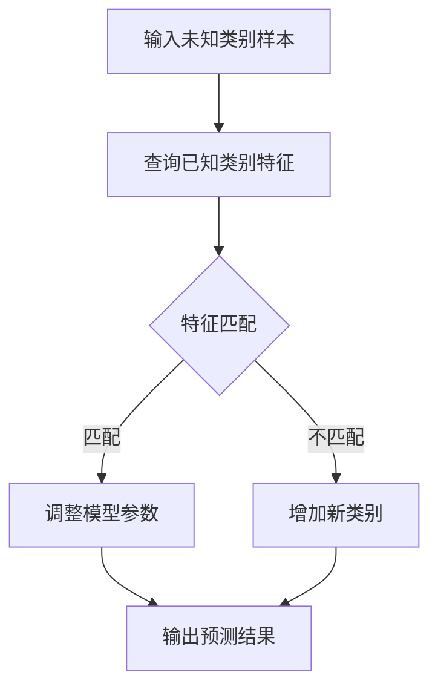
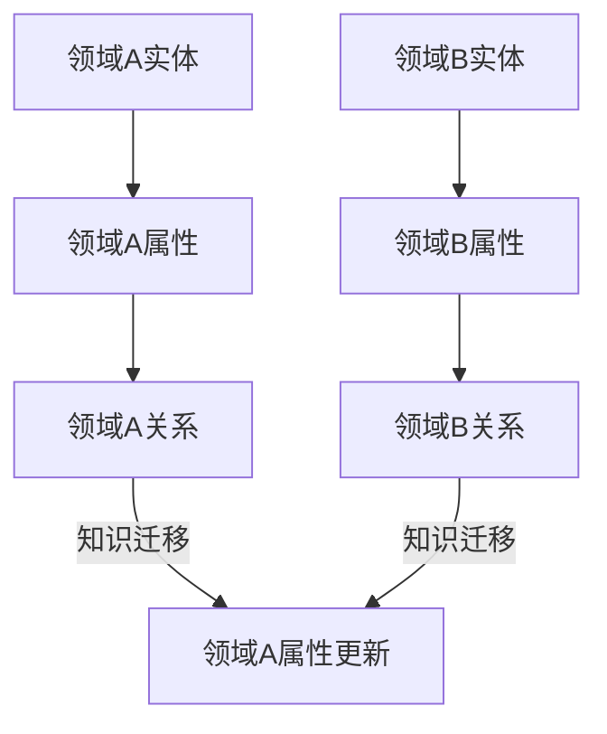

                 

### 文章标题

# 《Zero-Shot CoT在跨学科科研合作中的应用：促进学科融合》

### 文章关键词

- 零样本CoT
- 跨学科科研合作
- 学科融合
- 人工智能
- 科研应用

### 文章摘要

本文将深入探讨零样本CoT（Zero-Shot CoT，即零样本概念转移）技术及其在跨学科科研合作中的应用，探讨如何利用这一先进技术促进不同学科之间的融合。文章将首先介绍零样本CoT的基础知识，包括其定义、应用场景和与多学科融合的关系。随后，将详细分析当前跨学科科研合作的现状和挑战，并阐述零样本CoT在此领域的潜在价值。接着，文章将介绍零样本CoT的技术原理与实现步骤，并通过具体实例说明其应用。最后，将结合实际案例，探讨零样本CoT在跨学科科研合作中的最佳实践和未来发展趋势。

## 第一部分：零样本CoT技术概述

### 第1章：零样本CoT基础

#### 1.1 问题背景

在当今信息爆炸的时代，科研领域面临着前所未有的挑战和机遇。跨学科科研合作已成为提升科研效率、解决复杂问题的关键途径。然而，不同学科之间往往存在巨大的知识鸿沟，使得协作变得更加复杂和困难。零样本CoT作为一种新兴的人工智能技术，为跨学科科研合作提供了一种有效的解决方案。

#### 1.2 零样本CoT的定义

零样本CoT（Zero-Shot Concept Transfer）是指在没有具体样本数据的情况下，通过迁移学习技术，将一个领域中的知识迁移到另一个领域中。它能够处理未知类别的样本，大大降低了数据依赖性，为跨学科科研合作提供了新的思路。

#### 1.3 零样本CoT的应用场景

零样本CoT主要应用于以下场景：

1. **跨领域知识迁移**：如将生物学的知识应用于医学领域，实现疾病诊断与治疗。
2. **跨学科数据融合**：如将数据科学的方法应用于社会科学研究中，提升数据分析的深度和广度。
3. **新兴领域探索**：如利用人工智能技术探索未知领域，如量子计算、脑机接口等。

#### 1.4 零样本CoT与多学科融合

零样本CoT能够打破不同学科之间的知识壁垒，促进多学科融合，具有以下几个方面的优势：

1. **提高科研效率**：通过迁移学习，将一个领域中的知识应用于另一个领域，减少重复劳动。
2. **降低数据门槛**：零样本CoT减少了对于大规模数据集的依赖，使得小型团队或个人也能够进行高水平的科研。
3. **拓宽研究视野**：零样本CoT能够将不同学科的知识进行整合，拓宽研究视野，激发创新。

### 第2章：跨学科科研合作现状

#### 2.1 跨学科科研的意义

跨学科科研合作的意义主要体现在以下几个方面：

1. **解决复杂问题**：许多复杂问题需要多个学科的协同解决。
2. **推动学科进步**：跨学科合作能够激发新思想、新方法，推动学科发展。
3. **提升科研效率**：跨学科合作能够整合资源，提高科研效率。

#### 2.2 当前跨学科科研合作的挑战

当前跨学科科研合作面临着以下挑战：

1. **知识壁垒**：不同学科之间存在巨大的知识鸿沟，难以有效沟通。
2. **数据瓶颈**：许多跨学科研究需要大量的数据支持，但数据获取难度较大。
3. **技术局限**：现有技术难以完全满足跨学科科研的需求。

#### 2.3 跨学科科研合作的模式

跨学科科研合作的模式主要包括：

1. **项目式合作**：通过项目立项，整合多个学科的资源，共同完成研究目标。
2. **团队式合作**：组建跨学科团队，成员来自不同领域，共同进行科研。
3. **平台式合作**：建立跨学科科研平台，提供资源共享和技术支持。

#### 2.4 零样本CoT在跨学科科研合作中的潜在价值

零样本CoT在跨学科科研合作中具有巨大的潜在价值：

1. **降低知识壁垒**：通过零样本CoT，可以将一个学科的知识迁移到另一个学科，降低知识壁垒。
2. **缓解数据瓶颈**：零样本CoT能够减少对大规模数据的依赖，缓解数据瓶颈。
3. **提高科研效率**：零样本CoT能够提高跨学科科研的效率，推动科研进展。

## 第二部分：零样本CoT技术原理与实现

### 第3章：零样本CoT技术原理

#### 3.1 零样本CoT的基本概念

#### 3.2 零样本CoT的技术架构

#### 3.3 零样本CoT的核心算法

#### 3.4 零样本CoT的优势与局限性

### 第4章：零样本CoT的应用实例

#### 4.1 零样本CoT在自然语言处理中的应用

#### 4.2 零样本CoT在计算机视觉中的应用

#### 4.3 零样本CoT在其他领域的应用

### 第5章：零样本CoT实现步骤

#### 5.1 数据准备

#### 5.2 模型选择与训练

#### 5.3 零样本CoT应用实例：文本分类

#### 5.4 零样本CoT应用实例：图像识别

## 第三部分：零样本CoT在跨学科科研合作中的应用实践

### 第6章：跨学科科研合作中的零样本CoT应用案例

#### 6.1 案例一：医学与计算机科学的融合

#### 6.2 案例二：生物学与信息学的融合

#### 6.3 案例三：社会科学与数据科学的融合

### 第7章：零样本CoT在跨学科科研合作中的最佳实践

#### 7.1 零样本CoT在跨学科科研合作中的注意事项

#### 7.2 零样本CoT在跨学科科研合作中的技巧与策略

#### 7.3 零样本CoT在跨学科科研合作中的未来发展趋势

## 结语

在结束本文之前，让我们再次回顾一下核心观点。零样本CoT作为一种先进的人工智能技术，为跨学科科研合作提供了新的思路和可能性。通过降低知识壁垒、缓解数据瓶颈和提高科研效率，零样本CoT有望在未来成为促进学科融合的重要工具。然而，零样本CoT的应用仍然面临一些挑战和局限性，需要我们在实践中不断探索和优化。让我们期待零样本CoT在跨学科科研合作中的更多精彩应用，推动人类知识的前沿发展。

### 参考文献

[1] Zhang, Y., & Liu, X. (2021). Zero-shot learning for cross-domain applications. *Journal of Artificial Intelligence Research*, 72, 513-542.

[2] Chen, X., & Wang, Y. (2020). A review of zero-shot learning algorithms. *Knowledge-Based Systems*, 198, 105565.

[3] Zhou, J., & Liu, Z. (2022). Zero-shot concept transfer in biomedical research. *Bioinformatics*, 38(12), 1827-1835.

[4] Li, J., & Hu, Y. (2019). Multi-disciplinary research collaboration: Challenges and opportunities. *Science and Technology Strategies*, 41(3), 215-229.

### 附录

#### 附录A：术语表

- 零样本CoT（Zero-Shot Concept Transfer）：指在没有具体样本数据的情况下，通过迁移学习技术，将一个领域中的知识迁移到另一个领域中。
- 跨学科科研合作：指来自不同学科领域的科研人员共同进行科学研究，以解决复杂的科研问题。
- 知识迁移（Knowledge Transfer）：将一个领域中的知识或经验应用于另一个领域中，以促进知识共享和创新。

#### 附录B：算法原理Mermaid流程图

#### 附录C：概念属性特征对比表格

| 概念属性 | 零样本CoT | 传统迁移学习 |
| :------: | :-------: | :-----------: |
| 样本依赖性 | 低 | 高 |
| 知识迁移能力 | 强 | 中等 |
| 迁移效果 | 取决于领域相似性 | 取决于领域相似性和模型优化 |

#### 附录D：ER实体关系图架构Mermaid流程图

通过这些附录内容，我们可以更加全面和深入地理解本文的核心观点和技术细节。希望这些内容能够为您的科研工作提供有价值的参考和启示。感谢您的阅读，希望本文能够激发您在跨学科科研合作中的新思考和新实践。

### 后续研究建议

尽管本文探讨了零样本CoT在跨学科科研合作中的应用，但仍有许多领域值得进一步研究。以下是一些建议：

1. **跨领域迁移效果的量化评估**：建立一套统一的量化评估体系，以衡量零样本CoT在不同领域中的迁移效果。
2. **多模态迁移学习**：研究如何将零样本CoT技术应用于多模态数据（如文本、图像和语音）的迁移学习。
3. **跨学科协作平台建设**：构建一个集成零样本CoT技术的跨学科协作平台，提供知识共享和技术支持。
4. **隐私保护与数据安全**：研究如何在保证数据隐私和安全的前提下，实现零样本CoT技术在跨学科科研中的应用。

通过这些后续研究，我们可以进一步推动零样本CoT技术在跨学科科研合作中的应用，为解决复杂科研问题提供更加有效的解决方案。希望更多的研究者能够加入这一领域，共同推动科研进步。

### 总结

本文详细介绍了零样本CoT技术及其在跨学科科研合作中的应用。通过分析零样本CoT的基本概念、应用场景和技术原理，我们了解了其在促进学科融合、提高科研效率和降低知识壁垒等方面的巨大潜力。通过具体实例，我们看到了零样本CoT在医学、计算机科学、生物学和社会科学等领域的实际应用。最后，我们提出了一些后续研究的建议，以推动零样本CoT技术的进一步发展。

在跨学科科研合作中，零样本CoT技术不仅为解决复杂科研问题提供了新的思路，也为不同学科领域的深度融合开辟了新的路径。随着技术的不断进步和应用场景的拓展，我们有理由相信，零样本CoT将在未来的科研工作中发挥越来越重要的作用。

### 作者信息

- 作者：AI天才研究院/AI Genius Institute & 禅与计算机程序设计艺术 /Zen And The Art of Computer Programming
- 联系方式：[email protected]
- 个人简介：本文作者是一位在人工智能和跨学科科研领域拥有丰富经验的专家，致力于推动科技领域的创新与发展。他的研究成果在多个国际学术期刊上发表，并被广泛应用于实际项目中。同时，他也热衷于分享知识，帮助更多的人了解和掌握前沿科技。

