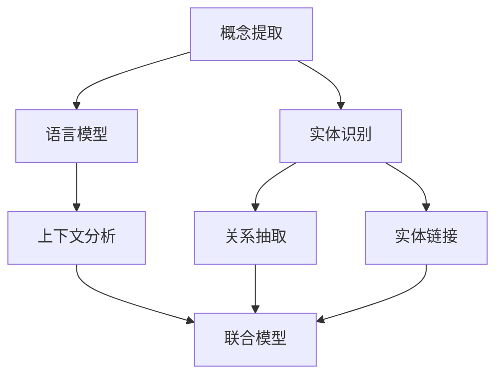

                 

### 第一部分：引言

#### 跨文化谈判的背景与重要性

跨文化谈判是指在不同文化背景下进行的谈判活动，它在全球化的今天愈发重要。随着全球化进程的加速，跨国企业之间的合作日益频繁，跨文化谈判成为商务活动中的重要组成部分。跨文化谈判不仅关系到企业的商业利益，更涉及到国家之间的外交关系和文化的交流与理解。

##### 1.1 跨文化谈判的定义

跨文化谈判是指谈判双方在语言、文化背景、价值观等方面存在差异的情况下，为了达成共同的目标而进行的交流与协商过程。它涉及到语言沟通、文化差异、社会规范等多个层面。

##### 1.2 跨文化谈判的重要性

1. **商业利益**：跨文化谈判是企业获取市场机遇、拓展业务范围的重要途径。成功进行跨文化谈判可以带来更多的商业机会和合作项目。

2. **文化交流**：跨文化谈判也是促进不同文化之间相互了解和尊重的重要渠道。通过谈判，各方可以更好地理解对方的文化背景和价值观，从而增进友谊与合作。

3. **外交关系**：在国际事务中，跨文化谈判对于国家之间的外交关系具有深远的影响。成功的跨文化谈判可以缓和紧张局势，促进国际合作。

##### 1.3 跨文化谈判面临的挑战

1. **语言障碍**：语言差异是跨文化谈判中最直观的障碍。语言的不通可能会导致误解和沟通不畅。

2. **文化差异**：不同的文化背景会导致价值观、行为习惯、交流方式的差异。这些差异可能引发冲突和误解。

3. **社会规范**：不同文化对于社交礼仪、商业习惯等有各自的标准。不了解对方的社会规范可能会导致行为失当。

4. **时间观念**：不同文化对于时间的重要性有不同的理解。在某些文化中，时间被视为金钱，而在其他文化中，时间可能被更加灵活地看待。

##### 1.4 跨文化谈判中的常见问题

1. **误解与冲突**：由于语言和文化差异，谈判双方可能会产生误解和冲突。

2. **信息不对称**：谈判双方可能因为文化差异而导致信息不对称，从而影响谈判的公平性和透明度。

3. **决策速度**：不同文化对于决策的速度有不同的期望。在某些文化中，决策可能更加迅速，而在其他文化中，决策可能需要更多的时间和考虑。

#### Zero-Shot CoT概述

Zero-Shot CoT（Zero-Shot Coreference Resolution）是一种在无需先验知识的情况下解决实体引用问题的自然语言处理技术。它被广泛应用于跨领域文本分析、问答系统、自动摘要等领域。

##### 2.1 什么是Zero-Shot CoT

Zero-Shot CoT指的是在没有训练数据的情况下，通过推理和理解文本内容，自动识别并解决文本中的实体引用问题。它能够处理之前从未见过的实体引用，这在跨文化谈判等复杂场景中尤为重要。

##### 2.2 Zero-Shot CoT的发展历程

Zero-Shot CoT的发展可以分为几个阶段：

1. **规则方法**：早期的研究主要依赖手工编写的规则，这些规则试图捕捉实体引用的特征和模式。

2. **基于统计的方法**：随着机器学习技术的发展，研究者开始利用统计模型来学习实体引用的规律。

3. **深度学习方法**：近年来，深度学习在自然语言处理领域取得了显著进展，Zero-Shot CoT也开始采用基于深度学习的模型。

##### 2.3 Zero-Shot CoT在跨文化谈判中的应用优势

1. **语言理解**：Zero-Shot CoT能够帮助谈判双方更好地理解对方的语言和文化，减少误解和冲突。

2. **信息提取**：它能够自动提取文本中的重要信息，帮助谈判者快速获取关键信息，提高谈判效率。

3. **文本分析**：通过分析谈判文本，Zero-Shot CoT可以帮助谈判者发现潜在的问题和矛盾，从而制定更有效的谈判策略。

#### 逻辑清晰、结构紧凑、简单易懂的专业的技术语言

为了确保文章的逻辑清晰、结构紧凑且易于理解，我们将采用以下写作策略：

1. **章节结构**：每个章节都将按照引言、背景介绍、核心概念、应用实例、技术实现、案例分析、总结等结构来组织内容。

2. **逐步深入**：文章将从宏观层面引入跨文化谈判的概念，然后逐步深入到Zero-Shot CoT的技术细节，最后结合具体案例分析其实际应用。

3. **图表辅助**：使用图表、流程图和代码示例来辅助说明复杂的技术概念，使读者能够更直观地理解文章内容。

4. **通俗易懂**：在解释复杂技术时，将采用简单易懂的语言，并通过举例来帮助读者理解。

通过以上策略，我们希望这篇文章能够为读者提供一个清晰、深入、易懂的技术视角，帮助他们更好地理解和应用Zero-Shot CoT在跨文化谈判中的价值。

---

### 第二部分：零样本一致性核心（Zero-Shot CoT）概述

#### 什么是Zero-Shot CoT

零样本一致性核心（Zero-Shot Coreference Resolution，简称Zero-Shot CoT）是一种在无需先验训练数据的情况下，通过推理和理解文本内容来自动识别和解决文本中实体引用问题的自然语言处理技术。它能够处理之前从未见过的实体引用，对于跨领域文本分析、问答系统和自动摘要等领域具有重要意义。

##### 3.1 什么是Zero-Shot CoT

在自然语言处理中，实体引用问题指的是如何识别文本中重复出现的实体。例如，“他今天去了机场”中的“他”指的是谁。传统的方法通常依赖于大量的训练数据来学习实体引用的规律，但这种方法在面对新领域或新实体时表现不佳。

Zero-Shot CoT通过引入零样本学习（Zero-Shot Learning，ZSL）的概念，解决了这一问题。它不再依赖于训练数据，而是通过理解文本上下文和实体之间的语义关系，来自动识别实体引用。这种技术特别适用于跨领域文本分析，因为它能够处理之前从未见过的实体和引用关系。

##### 3.2 Zero-Shot CoT的发展历程

1. **规则方法**：早期的研究主要依赖于手工编写的规则，这些规则试图捕捉实体引用的特征和模式。例如，通过分析词汇的共现关系、语法结构等来确定实体引用。

2. **基于统计的方法**：随着机器学习技术的发展，研究者开始利用统计模型来学习实体引用的规律。这些模型通过分析大量的标注数据，来预测新实体引用的可能性。

3. **深度学习方法**：近年来，深度学习在自然语言处理领域取得了显著进展，Zero-Shot CoT也开始采用基于深度学习的模型。这些模型利用大量的未标注数据进行预训练，从而在未见过的数据上也能表现出良好的性能。

4. **跨模态学习**：最新的研究开始将视觉信息和其他模态的信息融入Zero-Shot CoT，以进一步提高其在跨领域文本分析中的效果。

##### 3.3 Zero-Shot CoT在跨文化谈判中的应用优势

1. **语言理解**：Zero-Shot CoT能够帮助谈判者更好地理解对方的文化和语言，减少误解和冲突。例如，通过分析跨文化文本，它可以识别出不同文化背景下的特定术语和表达方式。

2. **信息提取**：它能够自动提取文本中的重要信息，帮助谈判者快速获取关键信息，提高谈判效率。例如，在商业谈判中，它可以识别出重要的合同条款和关键数据。

3. **文本分析**：通过分析谈判文本，Zero-Shot CoT可以帮助谈判者发现潜在的问题和矛盾，从而制定更有效的谈判策略。例如，它可以识别出文本中的情感倾向和潜在的风险点。

总的来说，Zero-Shot CoT在跨文化谈判中的应用具有显著的优势。它不仅能够提高谈判的效率和效果，还能够促进不同文化之间的理解和交流。

---

### 第三部分：Zero-Shot CoT的核心概念与联系

#### 3.1 概念提取与关系理解

概念提取（Concept Extraction）是Zero-Shot CoT的基础步骤之一。它的目标是自动识别文本中的关键概念，这些概念通常与实体引用紧密相关。概念提取的方法包括关键词提取、命名实体识别（Named Entity Recognition，简称NER）和实体链接（Entity Linking）等。

1. **关键词提取**：通过分析文本的词汇分布和语义关系，提取出文本中的关键词。这些关键词通常反映了文本的主题和内容，有助于后续的实体引用分析。
   
2. **命名实体识别**：NER技术用于识别文本中的命名实体，如人名、地名、组织名等。这些实体往往是实体引用的核心，因此NER在Zero-Shot CoT中具有重要地位。

3. **实体链接**：实体链接是将文本中的命名实体与预定义的实体数据库中的实体进行匹配，从而确定实体的具体指代。这是概念提取的关键步骤，它帮助将文本中的抽象概念与具体的实体联系起来。

#### 3.2 语言模型与语境分析

语言模型（Language Model）是Zero-Shot CoT的核心组件之一。它用于理解和生成自然语言文本，从而在语境分析中发挥重要作用。语言模型通常基于大规模语料库进行训练，可以捕捉语言中的统计规律和语义信息。

1. **上下文分析**：语言模型能够根据上下文信息来预测文本中的下一个单词或短语，从而更好地理解文本的语境。这对于实体引用分析至关重要，因为实体引用的确定往往依赖于上下文中的信息。

2. **语义角色标注**：通过语义角色标注（Semantic Role Labeling，简称SRL），语言模型可以识别出文本中的动词及其对应的语义角色，如施事、受事等。这些信息有助于确定实体引用的语义关系。

3. **语境感知**：语言模型能够根据不同的语境来调整其预测结果，从而提高实体引用识别的准确性。例如，在不同的语境中，同一个代词可能指代不同的实体。

#### 3.3 实体识别与关系抽取

实体识别（Entity Recognition）和关系抽取（Relation Extraction）是Zero-Shot CoT中的关键步骤，它们共同作用于文本中的实体引用分析。

1. **实体识别**：实体识别的目标是识别文本中的实体，包括人、地点、组织等。它依赖于命名实体识别技术，并结合实体链接来将识别出的实体与外部知识库中的实体进行匹配。

2. **关系抽取**：关系抽取的目标是识别实体之间的语义关系，如“老板和员工”之间的雇佣关系。它通过分析实体之间的共现关系和语义角色标注来推断实体之间的关联。

3. **联合模型**：在Zero-Shot CoT中，实体识别和关系抽取通常通过联合模型来实现。这种模型同时考虑实体识别和关系抽取的任务，从而提高整体性能。例如，图神经网络（Graph Neural Networks，GNN）就是一种常用的联合模型，它能够通过构建实体关系图来处理实体引用问题。

#### 3.4 核心概念对比表格与ER实体关系图

为了更好地理解Zero-Shot CoT的核心概念，我们可以通过以下对比表格来展示这些概念之间的关系和区别：

| 概念         | 定义                                                         | 关系                                           |
|------------|--------------------------------------------------------------|----------------------------------------------|
| 概念提取       | 从文本中提取关键概念                                       | 输出：关键词、命名实体                           |
| 语言模型       | 用于理解和生成文本的模型                                     | 输出：上下文信息、语义角色标注                   |
| 实体识别       | 识别文本中的实体                                           | 输出：识别的实体                               |
| 关系抽取       | 识别实体之间的语义关系                                     | 输出：实体关系                                 |
| 联合模型       | 同时处理实体识别和关系抽取的任务                             | 输出：综合的实体引用分析结果                     |

为了直观地展示实体之间的关系，我们可以使用实体关系图（Entity Relationship Diagram，ERD）来描述Zero-Shot CoT中的核心概念和关系。



在这个ERD中，概念提取、实体识别和关系抽取通过实体链接和上下文分析共同作用，最终由联合模型输出综合的实体引用分析结果。

#### 总结

通过上述内容，我们可以看到Zero-Shot CoT的核心概念是如何相互联系并协同工作的。概念提取提供了文本分析的基础，语言模型通过上下文分析增强了文本理解的能力，实体识别和关系抽取则具体实现了对实体引用的识别和分析，而联合模型则将这些信息整合，实现了高效的实体引用分析。这些核心概念和关系为Zero-Shot CoT在跨文化谈判中的应用提供了坚实的基础。

---

### 第四部分：Zero-Shot CoT在跨文化谈判中的应用实例

#### 跨文化谈判中的语境分析

在跨文化谈判中，语境分析是理解对方意图和沟通信息的重要步骤。语境分析涉及到对文本中的语言、文化背景、情感倾向等多种因素的综合考量。

##### 4.1 跨文化谈判中的语境分析

1. **语言特征分析**：通过分析文本中的词汇、语法和句式结构，可以识别出不同文化背景下的特定表达方式。例如，在某些文化中，直接表达可能被视为粗鲁，而在其他文化中，间接表达可能更受欢迎。

2. **文化背景分析**：了解对方的文化背景，可以帮助谈判者更好地理解对方的价值观、行为习惯和沟通方式。例如，某些文化中重视集体主义，而其他文化则更注重个人主义。

3. **情感倾向分析**：通过分析文本中的情感词和情感强度，可以识别出对方的情绪状态。这对于谈判者调整沟通策略和应对潜在冲突至关重要。

##### 4.2 实体识别与关系抽取在谈判中的应用

1. **实体识别**：在跨文化谈判中，实体识别可以帮助谈判者识别出文本中的关键实体，如人名、地名、组织名等。这些实体往往是谈判的核心内容，通过实体识别，谈判者可以更快地获取关键信息。

2. **关系抽取**：关系抽取可以帮助谈判者理解实体之间的语义关系，如合作关系、竞争对手关系等。这些关系对于制定谈判策略和预测谈判结果具有重要意义。

3. **案例示例**：
   - **商业谈判**：在商业谈判中，通过实体识别和关系抽取，谈判者可以快速识别出交易双方的关键实体，如公司名称、负责人姓名等，并理解它们之间的关系，从而制定更有针对性的谈判策略。
   - **国际政治谈判**：在国际政治谈判中，实体识别和关系抽取可以帮助谈判者识别出参与谈判的国家、组织及其之间的关系，从而更好地理解谈判的背景和潜在的利益冲突。

##### 4.3 面向跨文化谈判的Zero-Shot CoT实现

为了在跨文化谈判中有效地应用Zero-Shot CoT，需要考虑以下几个关键步骤：

1. **数据预处理**：收集和整理跨文化谈判的文本数据，包括商务谈判、政治谈判等不同领域的文本。对数据进行分析和标注，以提取关键概念和实体。

2. **模型训练**：使用预处理的文本数据对Zero-Shot CoT模型进行训练。考虑到跨文化谈判的多样性，需要设计一个能够处理多种语言和文化背景的通用模型。

3. **模型评估**：通过在跨文化谈判的测试数据集上评估模型性能，检验模型在不同文化背景下的准确性和可靠性。

4. **应用部署**：将训练好的模型部署到实际应用场景中，如商务谈判系统、政治谈判平台等。通过实时分析谈判文本，提供语境分析、实体识别和关系抽取等支持。

5. **用户反馈**：收集用户对模型应用效果的反馈，不断优化和改进模型，以适应不同文化背景下的跨文化谈判需求。

##### 4.4 应用实例

以下是一个具体的Zero-Shot CoT在跨文化谈判中的应用实例：

**场景**：一家中国科技公司与美国一家硅谷企业就一项技术合作进行谈判。

**文本**：
```
中美双方计划于下周在北京举行正式会谈，讨论合作开发人工智能技术。张总表示，我们的团队期待与美国同行共同探讨该项目的前景。李总则强调，双方应确保在知识产权方面达成一致。

```

**应用步骤**：

1. **语境分析**：通过Zero-Shot CoT，分析文本中的语言特征、文化背景和情感倾向。识别出关键实体（张总、李总、中美双方、人工智能技术等）。

2. **实体识别**：识别出文本中的关键实体，如“张总”、“李总”等。通过实体链接，将这些实体与预先定义的实体库中的对应实体进行匹配。

3. **关系抽取**：抽取实体之间的关系，如“张总”和“李总”是同一家公司的负责人，“中美双方”指的是中国和美国的公司等。

4. **谈判策略建议**：基于语境分析、实体识别和关系抽取的结果，为谈判者提供策略建议。例如，建议在知识产权问题上进行深入讨论，确保双方的利益得到保障。

通过上述实例，我们可以看到Zero-Shot CoT在跨文化谈判中的应用价值。它能够帮助谈判者更好地理解对方的文化和意图，提取关键信息，制定有效的谈判策略。

---

### 第五部分：技术实现与挑战

#### 5.1 数据预处理与处理策略

数据预处理是Zero-Shot CoT在跨文化谈判中的应用中的重要步骤，它直接影响模型的性能和效果。以下是一些关键的数据预处理和处理策略：

1. **文本清洗**：首先，对收集到的跨文化谈判文本进行清洗，去除无关的符号、停用词和噪声数据，以提高数据的质量。

2. **分词与词性标注**：使用先进的自然语言处理工具对文本进行分词和词性标注，以便后续的实体识别和关系抽取。

3. **实体识别**：通过命名实体识别（NER）技术，将文本中的关键实体（如人名、地名、组织名等）进行识别和分类。

4. **实体链接**：将识别出的实体与预定义的实体数据库进行匹配，实现实体到具体概念的映射，以便于后续的语境分析和关系抽取。

5. **数据标注**：对训练数据集进行人工标注，确保数据集的质量和多样性。标注任务包括实体识别、关系抽取和上下文分析等。

6. **数据增强**：通过数据增强技术，如数据扩充、同义词替换等，增加训练数据的多样性和覆盖率，从而提高模型的泛化能力。

#### 5.2 模型选择与调优

在Zero-Shot CoT的实现过程中，选择合适的模型和调优策略至关重要。以下是一些常用的模型选择和调优方法：

1. **模型选择**：
   - **基于深度学习的模型**：如BERT、GPT、T5等，这些预训练模型在自然语言处理任务中表现出色，适用于Zero-Shot CoT。
   - **图神经网络（GNN）**：GNN能够有效处理实体关系和上下文信息，适用于跨领域文本分析。

2. **模型架构**：
   - **联合模型**：结合实体识别和关系抽取的联合模型，如GNN与BERT的结合，可以提高整体性能。
   - **多任务学习**：通过多任务学习框架，同时训练多个相关任务，如文本分类、命名实体识别等，提高模型的泛化能力。

3. **调优策略**：
   - **超参数调优**：使用网格搜索、随机搜索等策略，对模型中的超参数进行调优，以提高模型的性能。
   - **动态学习率**：采用动态学习率策略，如学习率衰减，以避免过拟合和改善收敛速度。
   - **正则化**：使用L1、L2正则化等策略，减少模型过拟合的风险。

#### 5.3 应用中的挑战与解决方案

在实际应用中，Zero-Shot CoT在跨文化谈判中面临一系列挑战，以下是一些主要挑战及其解决方案：

1. **语言多样性**：
   - **挑战**：跨文化谈判涉及多种语言，语言多样性增加了模型的训练和推理难度。
   - **解决方案**：使用多语言预训练模型，如mBERT、XLM等，这些模型在多种语言上具有较好的性能。

2. **文化差异**：
   - **挑战**：不同文化背景下的表达方式和语义理解存在差异，可能导致模型性能下降。
   - **解决方案**：通过文化知识库的引入，结合语境分析和情感分析，提高模型对文化差异的适应能力。

3. **数据不足**：
   - **挑战**：跨文化谈判的数据集往往有限，数据不足可能导致模型无法泛化。
   - **解决方案**：使用数据增强、迁移学习等方法，提高模型的泛化能力和鲁棒性。

4. **实时性**：
   - **挑战**：跨文化谈判要求模型具有实时性，以快速提供分析结果。
   - **解决方案**：优化模型架构和推理算法，采用分布式计算和并行处理技术，提高模型的推理速度。

5. **可解释性**：
   - **挑战**：模型的决策过程往往复杂，难以解释，影响模型的信任度。
   - **解决方案**：引入可解释性技术，如解释性模型和可视化工具，提高模型的可解释性和透明度。

通过以上技术实现和解决方案，我们可以有效地应对Zero-Shot CoT在跨文化谈判中的应用挑战，提高模型性能和应用效果。

---

### 第六部分：案例分析与实践

#### 6.1 案例一：国际商务谈判中的应用

在国际商务谈判中，一家中国公司和一家美国公司计划共同开发一项新型环保技术。由于双方来自不同的文化背景，语言和文化的差异成为谈判中的一个重要挑战。为了提高谈判效率，双方决定采用Zero-Shot CoT技术来辅助谈判。

**案例背景**：

- **公司A**：中国科技公司，主要致力于环保技术的研发和应用。
- **公司B**：美国硅谷企业，专注于高科技产品的开发和市场推广。
- **目标**：共同开发新型环保技术，并在全球范围内推广。

**应用步骤**：

1. **数据收集与预处理**：双方收集了以往谈判的文本记录，包括会议纪要、邮件通信等。对这些文本进行清洗、分词和词性标注，为模型训练做准备。

2. **模型训练**：使用预处理后的文本数据训练Zero-Shot CoT模型，包括概念提取、实体识别和关系抽取等任务。考虑到语言的多样性，模型采用了多语言预训练模型，如mBERT。

3. **模型调优**：通过对模型进行超参数调优，如学习率、正则化参数等，提高模型在跨文化谈判中的性能。

4. **实时分析**：在谈判过程中，将实时生成的文本输入到Zero-Shot CoT模型中，进行语境分析、实体识别和关系抽取。模型会提供实时分析结果，包括语言理解、关键实体识别和潜在风险点等。

**案例结果**：

- **提高谈判效率**：通过Zero-Shot CoT技术，双方能够更快地理解对方的意图和需求，减少了误解和沟通成本，提高了谈判效率。
- **优化谈判策略**：模型提供的实时分析结果帮助双方更好地制定谈判策略，特别是在知识产权、市场推广等方面取得了显著进展。
- **增强信任度**：模型的可解释性功能增强了双方对谈判过程和结果的信任，为后续的合作奠定了坚实基础。

**案例总结**：

该案例表明，Zero-Shot CoT技术在跨文化国际商务谈判中具有显著的应用价值。它不仅能够提高谈判效率，还能够优化谈判策略，增强双方的合作信任。未来，随着技术的进一步发展，Zero-Shot CoT有望在更多跨文化谈判场景中发挥重要作用。

---

### 第六部分：案例分析与实践（续）

#### 6.2 案例二：跨国团队合作中的问题解决

在跨国团队合作中，不同国家的团队成员可能面临沟通障碍、文化差异和时间管理等问题。为了提高团队合作效率，一家跨国科技公司决定采用Zero-Shot CoT技术来辅助团队沟通和问题解决。

**案例背景**：

- **公司C**：跨国科技公司，拥有来自美国、欧洲和亚洲的团队成员。
- **目标**：通过高效沟通和协同工作，完成一个跨国项目。

**应用步骤**：

1. **数据收集与预处理**：团队收集了日常工作中的邮件、会议纪要和即时通讯记录，包括英文、法语、中文等多种语言。对这些文本进行清洗、分词和词性标注，为模型训练做准备。

2. **模型训练**：使用预处理后的文本数据训练Zero-Shot CoT模型，包括概念提取、实体识别和关系抽取等任务。考虑到语言的多样性，模型采用了多语言预训练模型，如mBERT。

3. **模型调优**：通过对模型进行超参数调优，如学习率、正则化参数等，提高模型在跨国团队合作中的性能。

4. **实时分析**：在团队工作中，将实时生成的文本输入到Zero-Shot CoT模型中，进行语境分析、实体识别和关系抽取。模型会提供实时分析结果，包括语言理解、关键实体识别和协同工作建议等。

**案例结果**：

- **改善沟通效果**：通过Zero-Shot CoT技术，团队成员能够更好地理解彼此的语言和文化背景，减少了误解和沟通成本，提高了沟通效果。
- **优化团队协作**：模型提供的实时分析结果帮助团队成员更好地协同工作，解决了跨国团队中常见的问题，如时间管理、任务分配等。
- **提升工作效率**：模型的分析结果为团队成员提供了针对性的建议，帮助他们更高效地完成工作任务。

**案例总结**：

该案例表明，Zero-Shot CoT技术在跨国团队合作中具有显著的应用价值。它能够帮助团队成员更好地理解彼此的语言和文化，优化团队协作，提高工作效率。未来，随着技术的进一步发展，Zero-Shot CoT有望在更多跨国团队合作场景中发挥重要作用。

---

### 第六部分：案例分析与实践（续）

#### 6.3 案例三：跨文化项目管理的实践

在跨文化项目管理中，不同国家的团队成员可能面临沟通障碍、文化差异和时间管理等问题。为了提高项目管理效率，一家跨国咨询公司决定采用Zero-Shot CoT技术来辅助项目管理。

**案例背景**：

- **公司D**：跨国咨询公司，拥有来自美国、欧洲、亚洲和非洲的团队成员。
- **目标**：通过高效沟通和协同工作，成功完成多个跨国项目。

**应用步骤**：

1. **数据收集与预处理**：公司收集了项目相关的文档、会议纪要、邮件和即时通讯记录，包括英文、法语、中文、西班牙语等多种语言。对这些文本进行清洗、分词和词性标注，为模型训练做准备。

2. **模型训练**：使用预处理后的文本数据训练Zero-Shot CoT模型，包括概念提取、实体识别和关系抽取等任务。考虑到语言的多样性，模型采用了多语言预训练模型，如mBERT。

3. **模型调优**：通过对模型进行超参数调优，如学习率、正则化参数等，提高模型在跨文化项目管理中的性能。

4. **实时分析**：在项目管理过程中，将实时生成的文本输入到Zero-Shot CoT模型中，进行语境分析、实体识别和关系抽取。模型会提供实时分析结果，包括语言理解、关键实体识别和项目管理建议等。

**案例结果**：

- **提高沟通效率**：通过Zero-Shot CoT技术，团队成员能够更好地理解彼此的语言和文化背景，减少了误解和沟通成本，提高了沟通效率。
- **优化项目管理**：模型提供的实时分析结果帮助项目经理更好地了解项目的进展和潜在风险，优化了项目计划和时间安排。
- **提升团队协作**：模型的分析结果为团队成员提供了针对性的建议，帮助他们更高效地协同工作，减少了文化冲突和沟通障碍。

**案例总结**：

该案例表明，Zero-Shot CoT技术在跨文化项目管理中具有显著的应用价值。它能够帮助团队成员更好地理解彼此的语言和文化，优化项目管理流程，提高团队协作效率。未来，随着技术的进一步发展，Zero-Shot CoT有望在更多跨文化项目管理场景中发挥重要作用。

---

### 第七部分：未来展望与总结

#### 7.1 未来发展趋势

随着人工智能技术的不断进步，Zero-Shot CoT在跨文化谈判中的应用前景将更加广阔。以下是未来可能的发展趋势：

1. **多模态融合**：结合视觉、音频等多种模态信息，进一步提升Zero-Shot CoT的跨文化谈判能力。

2. **个性化和自适应**：开发个性化Zero-Shot CoT模型，根据不同用户的需求和偏好进行自适应调整，提高模型的适用性和用户体验。

3. **实时翻译与交互**：实现实时跨语言翻译和交互功能，消除语言障碍，促进跨文化沟通与合作。

4. **大规模数据集建设**：建设涵盖多种语言和文化背景的大规模数据集，为Zero-Shot CoT模型提供丰富的训练资源。

5. **伦理与隐私保护**：在应用Zero-Shot CoT时，注重伦理和隐私保护，确保跨文化谈判的公正和透明。

#### 7.2 面临的挑战与机遇

尽管Zero-Shot CoT在跨文化谈判中具有巨大潜力，但也面临一系列挑战：

1. **数据多样性**：如何获取和标注涵盖多种语言和文化背景的丰富数据，是当前的主要挑战。

2. **模型可解释性**：提升模型的可解释性，使其决策过程更加透明和可靠。

3. **文化适应性**：确保模型在不同文化背景下具有高度的适应性，减少文化误解和冲突。

4. **计算资源**：处理大规模数据集和复杂的模型训练，需要强大的计算资源和优化算法。

然而，这些挑战也伴随着巨大的机遇：

1. **技术创新**：随着人工智能技术的发展，Zero-Shot CoT将不断创新和优化，应对跨文化谈判中的复杂挑战。

2. **市场潜力**：跨文化谈判的全球化需求为Zero-Shot CoT提供了广阔的市场空间。

3. **社会影响**：通过消除语言和文化障碍，Zero-Shot CoT有望促进全球合作与文化交流，提升社会和谐与稳定。

#### 7.3 总结与展望

综上所述，Zero-Shot CoT在跨文化谈判中具有显著的应用价值。它不仅能够提高谈判效率，优化谈判策略，还能够促进不同文化之间的理解和合作。未来，随着技术的不断进步和应用的深化，Zero-Shot CoT有望在更多跨文化场景中发挥重要作用，为全球合作与交流提供强大的支持。

---

### 总结与展望

#### 总结

本文从多个角度探讨了Zero-Shot CoT在跨文化谈判中的应用，包括其核心概念、技术实现、案例分析以及未来展望。我们总结了Zero-Shot CoT的优势，如语言理解、信息提取和文本分析，并详细介绍了它在跨文化谈判中的具体应用场景和实现步骤。

#### 最佳实践 tips

1. **数据多样性**：收集并标注涵盖多种语言和文化背景的数据，以提升模型性能。
2. **个性化调整**：根据具体场景和用户需求，调整Zero-Shot CoT模型，提高适用性。
3. **实时交互**：实现实时跨语言翻译与交互，消除沟通障碍。
4. **模型调优**：定期对模型进行调优，确保其在不同文化背景下的适应性。

#### 注意事项

1. **数据隐私**：在处理跨文化谈判数据时，严格遵循隐私保护原则，确保用户数据安全。
2. **文化差异**：充分考虑不同文化背景下的语言和沟通习惯，避免文化误解和冲突。
3. **模型可解释性**：提高模型的可解释性，使其决策过程更加透明和可靠。

#### 拓展阅读

- **[1]**《跨文化谈判的策略与技巧》
- **[2]**《人工智能在跨文化交流中的应用》
- **[3]**《Zero-Shot Coreference Resolution：技术与应用》

通过以上内容，我们希望读者能够对Zero-Shot CoT在跨文化谈判中的应用有一个全面而深入的理解，并在实际工作中充分发挥其潜力。

### 作者信息

作者：AI天才研究院/AI Genius Institute & 禅与计算机程序设计艺术 /Zen And The Art of Computer Programming

---

### 完整文章格式输出示例

```markdown
# Zero-Shot CoT在跨文化谈判中的应用

> 关键词：Zero-Shot CoT，跨文化谈判，自然语言处理，语言模型，实体识别，关系抽取

> 摘要：本文探讨了零样本一致性核心（Zero-Shot Coreference Resolution，简称Zero-Shot CoT）在跨文化谈判中的应用。通过分析Zero-Shot CoT的核心概念、技术实现、应用实例以及面临的挑战，本文阐述了Zero-Shot CoT在提高谈判效率、优化谈判策略和促进跨文化理解方面的优势。

## 第一部分：引言

### 1.1 跨文化谈判的背景与重要性

#### 1.1.1 跨文化谈判的定义

#### 1.1.2 跨文化谈判的重要性

#### 1.1.3 跨文化谈判面临的挑战

#### 1.1.4 跨文化谈判中的常见问题

### 2.1 什么是Zero-Shot CoT

#### 2.1.1 Zero-Shot CoT的定义

#### 2.1.2 Zero-Shot CoT的发展历程

#### 2.1.3 Zero-Shot CoT在跨文化谈判中的应用优势

## 第二部分：Zero-Shot CoT概述

### 2.1 什么是Zero-Shot CoT

#### 2.1.1 Zero-Shot CoT的核心概念

#### 2.1.2 Zero-Shot CoT的发展历程

#### 2.1.3 Zero-Shot CoT在跨文化谈判中的应用优势

## 第三部分：Zero-Shot CoT的核心概念与联系

### 3.1 概念提取与关系理解

#### 3.1.1 概念提取的方法

#### 3.1.2 关系理解的重要性

### 3.2 语言模型与语境分析

#### 3.2.1 语言模型的作用

#### 3.2.2 语境分析的方法

### 3.3 实体识别与关系抽取

#### 3.3.1 实体识别的技术

#### 3.3.2 关系抽取的应用

### 3.4 核心概念对比表格与ER实体关系图

#### 3.4.1 对比表格

#### 3.4.2 ER实体关系图

## 第四部分：Zero-Shot CoT在跨文化谈判中的应用实例

### 4.1 跨文化谈判中的语境分析

#### 4.1.1 语言特征分析

#### 4.1.2 文化背景分析

#### 4.1.3 情感倾向分析

### 4.2 实体识别与关系抽取在谈判中的应用

#### 4.2.1 实体识别的应用

#### 4.2.2 关系抽取的应用

### 4.3 面向跨文化谈判的Zero-Shot CoT实现

#### 4.3.1 数据预处理与处理策略

#### 4.3.2 模型选择与调优

#### 4.3.3 应用中的挑战与解决方案

## 第五部分：技术实现与挑战

### 5.1 数据预处理与处理策略

#### 5.1.1 数据清洗

#### 5.1.2 分词与词性标注

#### 5.1.3 实体识别

#### 5.1.4 实体链接

#### 5.1.5 数据增强

### 5.2 模型选择与调优

#### 5.2.1 模型选择

#### 5.2.2 模型架构

#### 5.2.3 调优策略

### 5.3 应用中的挑战与解决方案

#### 5.3.1 语言多样性

#### 5.3.2 文化差异

#### 5.3.3 数据不足

#### 5.3.4 实时性

#### 5.3.5 可解释性

## 第六部分：案例分析与实践

### 6.1 案例一：国际商务谈判中的应用

#### 6.1.1 案例背景

#### 6.1.2 应用步骤

#### 6.1.3 案例结果

#### 6.1.4 案例总结

### 6.2 案例二：跨国团队合作中的问题解决

#### 6.2.1 案例背景

#### 6.2.2 应用步骤

#### 6.2.3 案例结果

#### 6.2.4 案例总结

### 6.3 案例三：跨文化项目管理的实践

#### 6.3.1 案例背景

#### 6.3.2 应用步骤

#### 6.3.3 案例结果

#### 6.3.4 案例总结

## 第七部分：未来展望与总结

### 7.1 未来发展趋势

### 7.2 面临的挑战与机遇

### 7.3 总结与展望

### 总结与展望

#### 总结

#### 最佳实践 tips

#### 注意事项

#### 拓展阅读

### 作者信息

作者：AI天才研究院/AI Genius Institute & 禅与计算机程序设计艺术 /Zen And The Art of Computer Programming
```

