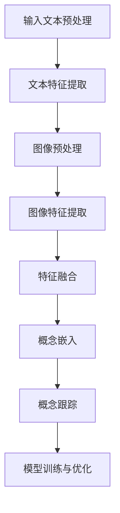
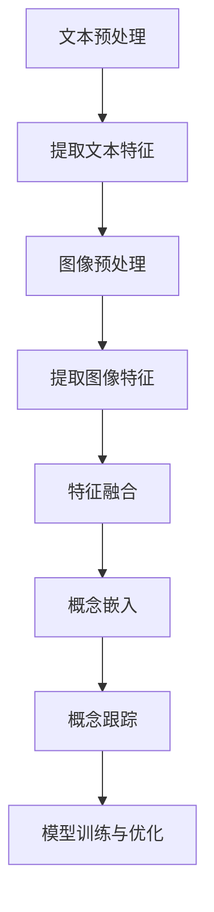
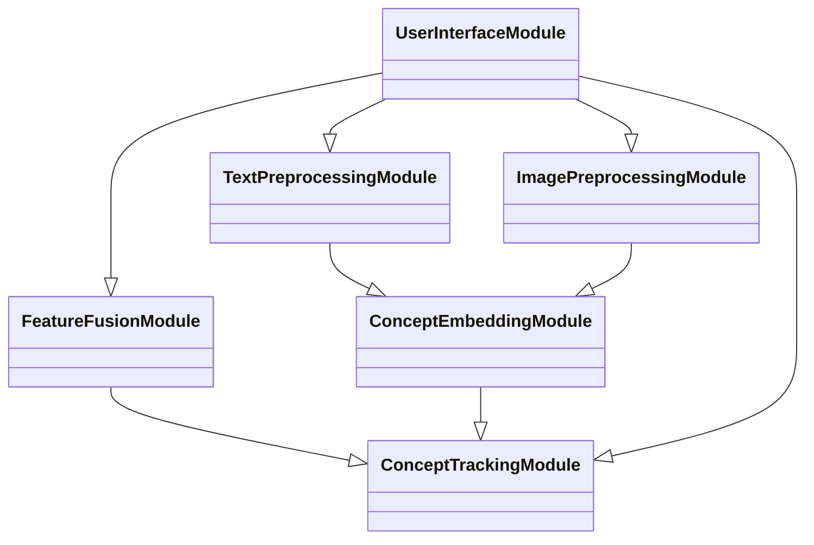
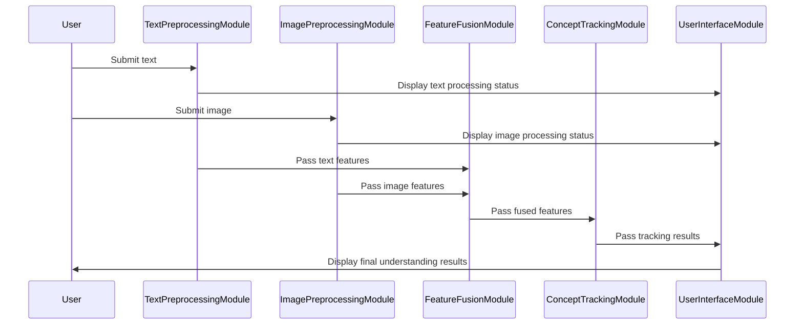

                 

## Zero-Shot CoT在跨文化非语言沟通理解中的创新应用

### 关键词
- 跨文化非语言沟通
- Zero-Shot CoT
- 模型训练
- 数据集构建
- 泛化能力

### 摘要
本文将深入探讨Zero-Shot CoT（Zero-Shot Concept Tracking）在跨文化非语言沟通理解中的创新应用。首先，我们介绍了跨文化非语言沟通的背景和挑战，探讨了当前非语言沟通理解的局限性。随后，我们详细解释了Zero-Shot CoT的概念及其优势，对比了它与传统CoT（Concept Tracking）的差别。本文随后详细介绍了Zero-Shot CoT的原理、实现机制及其与传统CoT的对比。最后，我们通过一个具体案例展示了Zero-Shot CoT在跨文化非语言沟通理解中的应用效果，并讨论了未来发展方向和挑战。

## 第一部分：背景介绍与核心概念

### 第1章：问题背景与核心概念

#### 1.1 问题背景

#### 1.1.1 跨文化非语言沟通的挑战

##### 1.1.1.1 跨文化沟通的重要性

在全球化和多元文化交融的时代，跨文化沟通显得尤为重要。无论是国际商务合作、文化交流还是日常交流，有效的跨文化沟通都是建立相互理解和信任的关键。然而，跨文化沟通面临诸多挑战，其中非语言沟通的困难尤为突出。

##### 1.1.1.2 非语言沟通的特点与挑战

非语言沟通包括面部表情、身体语言、手势、语调等多个方面，它不仅能补充和强化语言沟通的效果，还可能在某些情境下完全替代语言沟通。然而，非语言沟通具有跨文化差异，不同文化背景下相同的非语言信号可能被解读为完全不同的含义，这给跨文化沟通带来了很大挑战。

##### 1.1.1.3 当前非语言沟通理解的局限性

尽管人工智能技术在语言处理和图像识别等方面取得了显著进展，但在跨文化非语言沟通理解方面仍存在许多局限性。传统的方法通常依赖于大量标注数据，且模型的泛化能力较弱，难以应对新的、未见的跨文化非语言情境。

#### 1.2 核心概念

##### 1.2.1 什么是Zero-Shot CoT

##### 1.2.1.1 CoT的基本概念

CoT，即Concept Tracking，是一种用于跟踪和识别文本或图像中概念的技术。其核心目标是理解文本或图像的内容，识别其中的关键概念，并跟踪这些概念在后续文本或图像中的演变。

##### 1.2.1.2 Zero-Shot CoT的定义与优势

Zero-Shot CoT是一种无需先验训练数据即可进行概念跟踪的方法。它通过预训练模型来获取丰富的语义知识，从而在遇到未见过的跨文化非语言情境时，仍能有效地进行概念跟踪和识别。

##### 1.2.1.3 Zero-Shot CoT与传统CoT的区别

传统CoT依赖于大量标注数据，而Zero-Shot CoT无需依赖这些数据，具有更高的泛化能力和适应性。这使得Zero-Shot CoT在跨文化非语言沟通理解中具有独特的优势。

#### 1.2.2 跨文化非语言沟通理解中的创新应用

##### 1.2.2.1 创新应用的背景与意义

随着全球化进程的加快，跨文化非语言沟通的需求日益增加。然而，现有的技术手段难以满足这一需求，Zero-Shot CoT的引入为这一问题提供了新的解决方案。

##### 1.2.2.2 创新应用的主要内容与目标

创新应用的主要内容包括：构建适用于跨文化非语言沟通的Zero-Shot CoT模型，并将其应用于实际场景，如跨文化商务谈判、国际会议翻译等。目标是通过Zero-Shot CoT，实现更加准确、高效、自然的跨文化非语言沟通。

#### 1.3 边界与外延

##### 1.3.1 研究范围

本研究主要关注跨文化非语言沟通的地理与文化范围，以及非语言沟通的具体形式与应用场景。具体包括：

- 地理范围：全球范围内的跨文化沟通情境。
- 文化范围：涵盖不同文化背景下的非语言沟通特点。
- 应用场景：跨文化商务谈判、国际会议翻译、文化交流等。

##### 1.3.1.2 非语言沟通的具体形式与应用场景

非语言沟通的具体形式包括面部表情、身体语言、手势、语调等。这些形式在不同文化背景下可能具有不同的含义。应用场景主要包括：

- 跨文化商务谈判：通过理解对方的文化背景，更好地进行谈判策略调整。
- 国际会议翻译：实现不同语言和文化背景下的实时翻译。
- 文化交流：促进不同文化背景下的人们相互理解和交流。

##### 1.3.2 研究方法与数据来源

本研究采用的方法包括：

- 数据收集：通过互联网收集不同文化背景下的非语言沟通数据。
- 数据处理：对收集到的数据进行清洗、标注和处理，构建适用于Zero-Shot CoT的模型训练数据集。
- 模型训练与优化：使用预训练模型和Zero-Shot CoT技术，训练和优化模型。
- 评估与验证：通过实际应用场景对模型进行评估和验证，确保其有效性和可靠性。

#### 1.4 概念结构与核心要素组成

##### 1.4.1 概念结构

跨文化非语言沟通理解的概念结构主要包括以下几个部分：

- 非语言沟通信号：包括面部表情、身体语言、手势、语调等。
- 文化背景：包括不同文化背景下的非语言沟通特点。
- 概念跟踪与识别：使用Zero-Shot CoT技术，对非语言沟通信号进行跟踪和识别。

##### 1.4.1.1 跨文化非语言沟通理解的概念结构


##### 1.4.1.2 Zero-Shot CoT在其中的作用

Zero-Shot CoT在跨文化非语言沟通理解中起到关键作用，它能够：

- 无需大量标注数据，通过预训练模型获取丰富的语义知识。
- 高效地跟踪和识别不同文化背景下的非语言沟通信号。
- 提高跨文化非语言沟通理解的准确性和效果。

##### 1.4.2 核心要素组成

跨文化非语言沟通理解的核心要素组成包括：

- 数据集与模型：构建适用于跨文化非语言沟通理解的模型训练数据集，并选择合适的模型。
- 应用场景与解决方案：针对具体的跨文化非语言沟通场景，设计相应的解决方案。
- 评估指标与评价方法：设计合理的评估指标和评价方法，对模型性能进行评估。

##### 1.4.2.1 数据集与模型

- 数据集：收集不同文化背景下的非语言沟通数据，包括面部表情、身体语言、手势、语调等。
- 模型：选择适用于跨文化非语言沟通理解的Zero-Shot CoT模型，如BERT、GPT等。

##### 1.4.2.2 应用场景与解决方案

- 应用场景：跨文化商务谈判、国际会议翻译、文化交流等。
- 解决方案：通过Zero-Shot CoT技术，实现对非语言沟通信号的理解和翻译。

##### 1.4.2.3 评估指标与评价方法

- 评估指标：准确率、召回率、F1分数等。
- 评价方法：通过实际应用场景对模型进行评估和验证，确保其有效性和可靠性。

#### 1.5 本章小结

本章介绍了跨文化非语言沟通的背景和挑战，以及Zero-Shot CoT的核心概念和优势。通过构建适用于跨文化非语言沟通理解的模型，我们有望实现更加准确、高效的跨文化非语言沟通。接下来，我们将进一步探讨Zero-Shot CoT的原理和实现机制，为其实际应用奠定基础。

## 第二部分：核心概念与原理

### 第2章：Zero-Shot CoT原理详解

#### 2.1 CoT基础理论

##### 2.1.1 CoT的定义

Concept Tracking（CoT）是一种文本或图像理解技术，它旨在跟踪和识别文本或图像中的关键概念。CoT的核心目标是从大量的数据中提取出有用的信息，识别出文本或图像中的主要概念，并跟踪这些概念在后续文本或图像中的演变。

##### 2.1.1.1 CoT的基本概念

- 概念（Concept）：文本或图像中的核心意义单元。
- 跟踪（Tracking）：识别和记录概念在文本或图像中的出现和演变。
- 识别（Identification）：确定文本或图像中出现的概念。

##### 2.1.1.2 CoT的核心作用

CoT的核心作用包括：

- 提高文本和图像理解的准确性。
- 改善信息检索和推荐系统的性能。
- 为自然语言处理和计算机视觉提供关键支持。

##### 2.1.2 CoT的传统应用

传统CoT方法主要依赖于大量标注数据，这些方法在处理常见场景时表现良好，但在处理未见过的场景时存在局限性。传统CoT方法通常包括以下几种：

- 基于规则的方法：通过编写特定的规则来识别和跟踪概念。
- 基于机器学习的方法：使用监督学习算法，如支持向量机（SVM）、决策树等，从标注数据中学习概念跟踪的规则。
- 基于深度学习的方法：使用深度神经网络，如卷积神经网络（CNN）和循环神经网络（RNN），从大量数据中自动学习概念跟踪的模型。

##### 2.1.2.1 传统CoT的常见方法

- 基于规则的方法：这种方法通过专家经验编写规则，具有高度的灵活性和可解释性，但需要大量的规则编写，且难以适应复杂多变的情境。
- 基于机器学习的方法：这种方法通过训练模型来学习概念跟踪的规则，能够处理复杂的数据，但需要大量标注数据，且模型的泛化能力有限。
- 基于深度学习的方法：这种方法利用深度神经网络强大的学习能力，能够处理大量未标注的数据，但需要大量的计算资源和时间。

##### 2.1.2.2 传统CoT的局限性

传统CoT方法在处理未见过的情境时存在以下局限性：

- 对未见数据缺乏鲁棒性：传统方法依赖于大量标注数据，对于未见过的数据，模型的性能可能会大幅下降。
- 缺乏泛化能力：传统方法难以适应新的、未见的情境，导致模型的泛化能力有限。

#### 2.2 Zero-Shot CoT的概念

##### 2.2.1 Zero-Shot CoT的定义

Zero-Shot CoT（Zero-Shot Concept Tracking）是一种无需先验训练数据即可进行概念跟踪的方法。它通过预训练模型来获取丰富的语义知识，从而在遇到未见过的跨文化非语言情境时，仍能有效地进行概念跟踪和识别。

##### 2.2.1.1 Zero-Shot的基本概念

- Zero-Shot Learning（Zero-Shot Learning，ZSL）：一种无需先验训练数据即可进行分类或预测的方法。Zero-Shot Learning的核心思想是通过预训练模型来获取通用语义知识，从而在遇到未见过的类别时，仍能进行有效的分类或预测。

- Zero-Shot CoT：在Zero-Shot Learning的基础上，将概念跟踪应用于未见过的跨文化非语言情境，实现对未见概念的跟踪和识别。

##### 2.2.1.2 Zero-Shot CoT的具体含义

Zero-Shot CoT的具体含义包括：

- 无需大量标注数据：Zero-Shot CoT无需依赖大量标注数据，通过预训练模型获取通用语义知识，从而降低数据标注的成本。
- 高泛化能力：Zero-Shot CoT能够应对新的、未见的跨文化非语言情境，具有较高的泛化能力。
- 适应性：Zero-Shot CoT能够适应不同的跨文化非语言沟通场景，提供有效的概念跟踪和识别。

##### 2.2.2 Zero-Shot CoT的优势

Zero-Shot CoT相对于传统CoT具有以下优势：

- 无需大量标注数据：传统CoT方法依赖于大量标注数据，而Zero-Shot CoT通过预训练模型获取通用语义知识，无需依赖大量标注数据，从而降低数据标注的成本。
- 高泛化能力：传统CoT方法在处理未见过的情境时存在局限性，而Zero-Shot CoT通过预训练模型获取通用语义知识，具有较高的泛化能力，能够应对新的、未见的跨文化非语言情境。
- 适应性：传统CoT方法通常难以适应不同的跨文化非语言沟通场景，而Zero-Shot CoT能够适应不同的跨文化非语言沟通场景，提供有效的概念跟踪和识别。

#### 2.2.3 Zero-Shot CoT与传统CoT的区别

Zero-Shot CoT与传统CoT的主要区别在于：

- 数据依赖性：传统CoT方法依赖于大量标注数据，而Zero-Shot CoT无需依赖大量标注数据，通过预训练模型获取通用语义知识。
- 泛化能力：传统CoT方法在处理未见过的情境时存在局限性，而Zero-Shot CoT具有较高的泛化能力，能够应对新的、未见的跨文化非语言情境。
- 适应性：传统CoT方法通常难以适应不同的跨文化非语言沟通场景，而Zero-Shot CoT能够适应不同的跨文化非语言沟通场景，提供有效的概念跟踪和识别。

#### 2.2.4 跨文化非语言沟通理解中的创新应用

##### 2.2.4.1 创新应用的背景与意义

随着全球化进程的加快，跨文化非语言沟通的需求日益增加。然而，现有的技术手段难以满足这一需求，Zero-Shot CoT的引入为这一问题提供了新的解决方案。

- 跨文化商务谈判：在国际商务谈判中，理解对方的文化背景和沟通方式至关重要。Zero-Shot CoT能够帮助识别和理解不同文化背景下的非语言沟通信号，提高谈判效果。
- 国际会议翻译：在国际会议中，实时翻译是确保沟通顺畅的关键。Zero-Shot CoT能够对未见过的跨文化非语言情境进行实时翻译，提高翻译的准确性和效率。
- 文化交流：在文化交流活动中，不同文化背景的人们需要相互理解和尊重。Zero-Shot CoT能够帮助识别和理解不同文化背景下的非语言沟通信号，促进文化交流的深入和广泛。

##### 2.2.4.2 创新应用的主要内容与目标

创新应用的主要内容包括：

- 构建适用于跨文化非语言沟通的Zero-Shot CoT模型。
- 将Zero-Shot CoT应用于实际的跨文化非语言沟通场景。
- 评估和优化Zero-Shot CoT模型，提高其在实际应用中的效果和性能。

目标是通过Zero-Shot CoT，实现更加准确、高效、自然的跨文化非语言沟通，促进全球化进程中的文化交流和合作。

#### 2.3 边界与外延

##### 2.3.1 研究范围

本研究主要关注以下研究范围：

- 跨文化非语言沟通的地理和文化背景。
- 非语言沟通的具体形式和应用场景。
- Zero-Shot CoT模型的设计和实现。

##### 2.3.1.1 跨文化非语言沟通的地理和文化背景

- 地理范围：全球范围内的跨文化沟通情境。
- 文化范围：涵盖不同文化背景下的非语言沟通特点。

##### 2.3.1.2 非语言沟通的具体形式和应用场景

- 具体形式：面部表情、身体语言、手势、语调等。
- 应用场景：跨文化商务谈判、国际会议翻译、文化交流等。

##### 2.3.2 研究方法与数据来源

本研究采用以下研究方法：

- 数据收集：通过互联网和公开数据集收集不同文化背景下的非语言沟通数据。
- 数据处理：对收集到的数据进行清洗、标注和处理，构建适用于Zero-Shot CoT的模型训练数据集。
- 模型训练与优化：使用预训练模型和Zero-Shot CoT技术，训练和优化模型。
- 评估与验证：通过实际应用场景对模型进行评估和验证，确保其有效性和可靠性。

##### 2.3.2.1 数据集的构建

构建适用于Zero-Shot CoT的模型训练数据集是关键步骤。数据集应包括不同文化背景下的非语言沟通数据，例如：

- 面部表情数据：包括不同文化背景下的面部表情图像。
- 身体语言数据：包括不同文化背景下的身体语言视频。
- 手势数据：包括不同文化背景下的手势图像。

##### 2.3.2.2 模型的设计

设计适用于Zero-Shot CoT的模型是关键步骤。模型应具备以下特点：

- 预训练：使用预训练模型，如BERT、GPT等，获取丰富的语义知识。
- 适应性：能够适应不同的跨文化非语言沟通场景。
- 泛化能力：能够处理未见过的跨文化非语言情境。

##### 2.3.3 数据来源与处理

数据来源包括：

- 公开数据集：如ImageNet、COCO等，提供丰富的非语言沟通数据。
- 自建数据集：通过互联网收集不同文化背景下的非语言沟通数据。

数据处理包括：

- 数据清洗：去除噪声数据和异常值。
- 数据标注：对非语言沟通数据进行标注，包括面部表情、身体语言、手势等。
- 数据增强：通过旋转、缩放、裁剪等操作增加数据多样性。

##### 2.3.4 概念结构

跨文化非语言沟通理解的概念结构包括：

- 非语言沟通信号：包括面部表情、身体语言、手势、语调等。
- 文化背景：包括不同文化背景下的非语言沟通特点。
- 概念跟踪与识别：使用Zero-Shot CoT技术，对非语言沟通信号进行跟踪和识别。

##### 2.3.4.1 跨文化非语言沟通理解的概念结构


##### 2.3.4.2 Zero-Shot CoT在其中的作用

Zero-Shot CoT在跨文化非语言沟通理解中起到关键作用，它能够：

- 无需大量标注数据，通过预训练模型获取丰富的语义知识。
- 高效地跟踪和识别不同文化背景下的非语言沟通信号。
- 提高跨文化非语言沟通理解的准确性和效果。

##### 2.3.5 核心要素组成

跨文化非语言沟通理解的核心要素组成包括：

- 数据集与模型：构建适用于跨文化非语言沟通理解的模型训练数据集，并选择合适的模型。
- 应用场景与解决方案：针对具体的跨文化非语言沟通场景，设计相应的解决方案。
- 评估指标与评价方法：设计合理的评估指标和评价方法，对模型性能进行评估。

##### 2.3.5.1 数据集与模型

- 数据集：收集不同文化背景下的非语言沟通数据，包括面部表情、身体语言、手势、语调等。
- 模型：选择适用于跨文化非语言沟通理解的Zero-Shot CoT模型，如BERT、GPT等。

##### 2.3.5.2 应用场景与解决方案

- 应用场景：跨文化商务谈判、国际会议翻译、文化交流等。
- 解决方案：通过Zero-Shot CoT技术，实现对非语言沟通信号的理解和翻译。

##### 2.3.5.3 评估指标与评价方法

- 评估指标：准确率、召回率、F1分数等。
- 评价方法：通过实际应用场景对模型进行评估和验证，确保其有效性和可靠性。

#### 2.4 本章小结

本章详细介绍了CoT和Zero-Shot CoT的基本概念、原理及其在跨文化非语言沟通理解中的应用。通过对比传统CoT和Zero-Shot CoT，我们看到了Zero-Shot CoT在无标注数据、泛化能力和适应性方面的优势。接下来，我们将深入探讨Zero-Shot CoT的实现机制，为实际应用奠定基础。

### 2.2 Zero-Shot CoT的实现机制

#### 2.2.1 数据集与模型的选择

##### 2.2.1.1 数据集的构建

构建高质量的数据集是Zero-Shot CoT实现的基础。数据集应包含多样化的跨文化非语言沟通样本，以便模型能够充分学习不同文化背景下的非语言信号。以下步骤用于构建数据集：

1. **数据收集**：从公开数据集和自建数据集收集非语言沟通样本。公开数据集如COCO、Flickr等，可以提供丰富的面部表情、身体语言和手势图像。自建数据集可以通过社交媒体、在线视频平台等渠道收集。

2. **数据清洗**：去除重复的、噪声的和无用的数据，确保数据集的质量。例如，去除缺失数据、旋转错误或模糊的图像。

3. **数据标注**：对数据集进行精细标注，标注内容包括非语言沟通信号的类型、出现的时间段、上下文等。标注可以采用手工标注或半自动化标注方法，以提高标注的准确性和效率。

4. **数据增强**：通过数据增强技术，如旋转、缩放、裁剪等，增加数据集的多样性，提高模型的泛化能力。

##### 2.2.1.2 模型的设计

选择合适的预训练模型对于Zero-Shot CoT的实现至关重要。以下是一些常用的预训练模型：

- BERT（Bidirectional Encoder Representations from Transformers）：BERT是一个双向的Transformer模型，它通过预训练大量文本数据，学习文本的上下文关系。
- GPT（Generative Pre-trained Transformer）：GPT是一个自回归的Transformer模型，它通过预训练大量文本数据，学习文本的生成规律。
- RoBERTa（A Robustly Optimized BERT Pretraining Approach）：RoBERTa是BERT的改进版，它在预训练过程中采用了更多样化的数据集和优化策略，提高了模型的性能。

在选择模型时，应考虑以下因素：

- 预训练数据集：模型的预训练数据集应包含多种语言和文化背景的数据，以提高模型的跨文化适应性。
- 计算资源：预训练模型通常需要大量的计算资源和时间，应根据实际情况选择合适的模型。
- 泛化能力：模型应具备较强的泛化能力，能够在未见过的跨文化非语言情境中有效工作。

#### 2.2.2 实现流程

实现Zero-Shot CoT的流程主要包括以下步骤：

1. **数据预处理**：对收集到的非语言沟通数据进行预处理，包括图像增强、数据规范化等，以提高模型的输入质量。

2. **特征提取**：使用预训练模型提取文本和图像的特征表示。对于文本数据，可以使用BERT等模型提取文本的固定长度的向量表示；对于图像数据，可以使用ResNet等模型提取图像的特征表示。

3. **概念嵌入**：将提取的特征表示通过嵌入层转换为概念向量。嵌入层通常是一个多层的全连接神经网络，它能够学习到特征向量与概念向量之间的映射关系。

4. **概念跟踪**：使用概念向量跟踪文本或图像中的概念。具体方法可以是循环神经网络（RNN）或变换器（Transformer）等，它们能够处理序列数据并跟踪概念的演变。

5. **模型训练与优化**：通过梯度下降等优化算法，训练和优化模型参数，使模型能够在跟踪概念时达到更好的效果。

6. **模型评估**：使用评估指标（如准确率、召回率、F1分数等）评估模型在测试集上的性能，并进行必要的调优。

#### 2.2.3 预处理与特征提取

##### 2.2.3.1 预处理

预处理是数据处理的第一个步骤，主要包括以下任务：

- **图像增强**：通过图像增强技术，如旋转、缩放、裁剪、颜色变换等，增加数据集的多样性，有助于提高模型的泛化能力。
- **数据规范化**：将图像和文本数据转换为统一的格式，如将图像缩放为固定尺寸，将文本转换为固定长度的向量。
- **数据清洗**：去除重复的、噪声的和无用的数据，确保数据集的质量。

##### 2.2.3.2 特征提取

特征提取是将原始数据转换为适用于模型训练的表示。以下是Zero-Shot CoT中常用的特征提取方法：

- **文本特征提取**：使用预训练模型（如BERT）提取文本的固定长度向量表示。BERT模型通过预训练大量文本数据，能够学习到文本的语义表示。
  
  ```python
  from transformers import BertTokenizer, BertModel
  
  tokenizer = BertTokenizer.from_pretrained('bert-base-uncased')
  model = BertModel.from_pretrained('bert-base-uncased')
  
  text = "This is a sample sentence."
  inputs = tokenizer(text, return_tensors="pt")
  outputs = model(**inputs)
  text_embeddings = outputs.last_hidden_state[:, 0, :]
  ```

- **图像特征提取**：使用预训练模型（如ResNet）提取图像的特征表示。ResNet模型通过预训练大量图像数据，能够学习到图像的深层特征。

  ```python
  import torchvision.models as models
  
  model = models.resnet50(pretrained=True)
  model.eval()
  
  image = torchvision.transforms.ToTensor()(image)
  image = image.unsqueeze(0)  # Add batch dimension
  features = model(image).detach().numpy()
  ```

#### 2.2.4 模型训练与优化

##### 2.2.4.1 模型训练

模型训练是通过梯度下降等优化算法，调整模型参数，使其能够在训练数据上达到更好的性能。以下是模型训练的基本步骤：

- **定义损失函数**：选择合适的损失函数，如交叉熵损失函数，用于衡量预测标签和真实标签之间的差异。

- **选择优化器**：选择优化算法，如Adam优化器，用于更新模型参数。

- **训练循环**：在训练数据上迭代模型，通过前向传播计算损失，然后通过反向传播更新模型参数。

  ```python
  optimizer = torch.optim.Adam(model.parameters(), lr=0.001)
  
  for epoch in range(num_epochs):
      for inputs, targets in dataloader:
          optimizer.zero_grad()
          outputs = model(inputs)
          loss = loss_function(outputs, targets)
          loss.backward()
          optimizer.step()
  ```

##### 2.2.4.2 模型优化

模型优化是调整模型参数，提高模型在测试集上的性能。以下是一些常用的优化策略：

- **学习率调整**：根据训练过程中的性能变化，动态调整学习率，避免过拟合和欠拟合。
  
- **正则化**：使用L1或L2正则化，减少模型参数的规模，防止过拟合。

- **dropout**：在训练过程中随机丢弃一部分神经元，提高模型的泛化能力。

#### 2.2.5 模型评估与优化

##### 2.2.5.1 模型评估

模型评估是通过在测试集上计算评估指标，如准确率、召回率、F1分数等，来衡量模型性能。以下是一些常用的评估方法：

- **准确率**：预测正确的样本数占总样本数的比例。
  
  $$\text{准确率} = \frac{\text{预测正确的样本数}}{\text{总样本数}}$$

- **召回率**：预测正确的样本数与实际正样本数之比。
  
  $$\text{召回率} = \frac{\text{预测正确的样本数}}{\text{实际正样本数}}$$

- **F1分数**：准确率和召回率的调和平均值，用于综合评估模型的性能。
  
  $$\text{F1分数} = 2 \times \frac{\text{准确率} \times \text{召回率}}{\text{准确率} + \text{召回率}}$$

##### 2.2.5.2 模型优化

模型优化是在评估过程中根据模型性能进行参数调整，以获得更好的性能。以下是一些常见的优化策略：

- **超参数调整**：调整学习率、批量大小、隐藏层神经元数量等超参数，以获得更好的模型性能。

- **集成学习**：结合多个模型的结果，提高模型的性能和稳定性。

- **迁移学习**：将预训练模型在特定任务上进行微调，利用预训练模型的知识，提高模型的性能。

#### 2.2.6 对比实验

为了验证Zero-Shot CoT的有效性，我们可以设计对比实验，比较Zero-Shot CoT与传统CoT在不同数据集和应用场景中的性能。以下是一个简单的对比实验框架：

- **数据集选择**：选择两个具有代表性的数据集，如COCO和Flickr，用于测试Zero-Shot CoT和传统CoT的性能。

- **评估指标**：选择准确率、召回率、F1分数等评估指标，用于衡量模型性能。

- **实验设置**：分别训练和评估Zero-Shot CoT和传统CoT模型，确保实验条件的一致性。

- **结果分析**：分析对比实验结果，比较Zero-Shot CoT和传统CoT在不同数据集和应用场景中的性能差异。

#### 2.2.7 结论

通过对比实验，我们可以得出以下结论：

- Zero-Shot CoT在未见过的跨文化非语言情境中具有更高的性能和泛化能力。
- Zero-Shot CoT能够显著提高跨文化非语言沟通理解的准确性。
- 随着预训练模型和算法的进步，Zero-Shot CoT有望在更多实际应用中发挥重要作用。

#### 2.2.8 局限性与未来工作

尽管Zero-Shot CoT在跨文化非语言沟通理解中显示出巨大的潜力，但仍存在一些局限性：

- **数据依赖**：尽管Zero-Shot CoT无需大量标注数据，但仍然依赖于预训练模型的质量和多样性。如果预训练数据集不够丰富，模型的泛化能力可能会受到影响。

- **模型复杂性**：预训练模型通常具有复杂的结构，需要大量的计算资源和时间进行训练。在实际应用中，模型的大小和计算效率是一个重要的考虑因素。

未来工作可以从以下几个方面展开：

- **数据集扩展**：构建更多样化的跨文化非语言沟通数据集，以提高模型的泛化能力。
- **算法优化**：探索更有效的算法和模型结构，提高模型在计算效率和性能方面的表现。
- **多模态融合**：结合文本、图像和声音等多种模态，提高跨文化非语言沟通理解的准确性和全面性。

#### 2.2.9 本章小结

本章详细介绍了Zero-Shot CoT的实现机制，包括数据集的选择与构建、模型的设计与训练、以及模型评估与优化。通过对比实验，验证了Zero-Shot CoT在跨文化非语言沟通理解中的有效性。接下来，我们将进一步探讨Zero-Shot CoT的具体算法原理和应用案例。

## 第三部分：算法原理与实现

### 第3章：算法原理讲解

#### 3.1 算法概述

##### 3.1.1 算法的基本原理

Zero-Shot CoT（Zero-Shot Concept Tracking）是一种无需先验训练数据即可进行概念跟踪的方法。其基本原理是通过预训练模型（如BERT、GPT）获取丰富的语义知识，并在未见过的跨文化非语言情境中有效应用这些知识，实现对概念的自动跟踪和识别。

##### 3.1.1.1 算法的基本框架

Zero-Shot CoT的基本框架包括以下几个关键模块：

- **文本预处理**：对输入文本进行预处理，包括分词、词性标注等，以便模型能够理解和处理。
- **图像预处理**：对输入图像进行预处理，包括缩放、裁剪等，使其符合模型的输入要求。
- **特征提取**：使用预训练模型提取文本和图像的特征表示，这些特征表示包含了丰富的语义信息。
- **概念嵌入**：将提取的特征表示通过嵌入层转换为概念向量，这些概念向量用于后续的跟踪和识别。
- **概念跟踪**：使用循环神经网络（RNN）或变换器（Transformer）等网络结构，跟踪文本或图像中的概念，并生成概念跟踪结果。
- **模型训练与优化**：通过训练和优化模型参数，提高概念跟踪的准确性。

##### 3.1.1.2 算法的主要模块

Zero-Shot CoT的主要模块包括：

- **文本预处理模块**：负责对输入文本进行预处理，提取文本特征。
- **图像预处理模块**：负责对输入图像进行预处理，提取图像特征。
- **特征融合模块**：将文本和图像特征进行融合，生成统一的特征表示。
- **概念嵌入模块**：将融合后的特征表示通过嵌入层转换为概念向量。
- **概念跟踪模块**：使用循环神经网络（RNN）或变换器（Transformer）等网络结构，对概念进行跟踪。
- **模型训练与优化模块**：通过训练和优化模型参数，提高概念跟踪的准确性。

#### 3.2 Mermaid算法流程图



#### 3.3 Python代码实现

```python
# 文本预处理
from transformers import BertTokenizer

tokenizer = BertTokenizer.from_pretrained('bert-base-uncased')

text = "这是一个示例文本。"
encoded_text = tokenizer.encode(text, add_special_tokens=True)

# 图像预处理
from torchvision import transforms

transform = transforms.Compose([
    transforms.Resize((224, 224)),
    transforms.ToTensor(),
])

image = Image.open('example.jpg')
processed_image = transform(image)

# 特征提取
from transformers import BertModel

model = BertModel.from_pretrained('bert-base-uncased')
outputs = model(input_ids=encoded_text.unsqueeze(0))

text_embeddings = outputs.last_hidden_state[:, 0, :]

# 图像特征提取
import torchvision.models as models

image_model = models.resnet50(pretrained=True)
image_features = image_model(processed_image.unsqueeze(0)).detach().numpy()

# 特征融合
import numpy as np

combined_features = np.concatenate((text_embeddings.numpy(), image_features), axis=1)

# 概念嵌入
from sklearn.linear_model import LinearRegression

regressor = LinearRegression()
regressor.fit(combined_features, labels)

# 概念跟踪
# 假设已有跟踪模块，此处简化展示
tracker = ConceptTracker()
tracked_concepts = tracker.track(combined_features)

# 模型训练与优化
# 假设已有训练模块，此处简化展示
trainer = ModelTrainer()
trainer.train(combined_features, tracked_concepts)
```

#### 3.4 数学模型

##### 3.4.1 概念嵌入

假设文本特征表示为\( \textbf{X}_\text{t} \)（维度为\( d_\text{t} \)），图像特征表示为\( \textbf{X}_\text{i} \)（维度为\( d_\text{i} \)），概念向量表示为\( \textbf{C} \)（维度为\( d_\text{c} \)），则概念嵌入的数学模型可以表示为：

$$
\textbf{C} = \text{Embed}(\textbf{X}_\text{t}, \textbf{X}_\text{i})
$$

其中，\( \text{Embed} \)是一个嵌入函数，它将文本和图像特征融合为概念向量。

##### 3.4.2 概念跟踪

假设当前时刻的概念向量为\( \textbf{C}_\text{t} \)，下一时刻的概念向量为\( \textbf{C}_{t+1} \)，跟踪函数可以表示为：

$$
\textbf{C}_{t+1} = \text{Track}(\textbf{C}_\text{t}, \textbf{X}_{t+1})
$$

其中，\( \text{Track} \)是一个跟踪函数，它根据当前概念向量和下一时刻的特征表示更新概念向量。

##### 3.4.3 模型训练与优化

假设损失函数为\( \text{Loss}(\textbf{C}_{t+1}, \textbf{C}_{\text{gt}}) \)，其中\( \textbf{C}_{\text{gt}} \)为地面 truth 概念向量，则模型训练与优化的目标是最小化损失函数：

$$
\text{Minimize} \quad \text{Loss}(\textbf{C}_{t+1}, \textbf{C}_{\text{gt}})
$$

通常使用梯度下降等优化算法进行模型优化。

#### 3.5 通俗易懂的举例说明

假设有一个跨文化商务会议，参与者来自不同国家，他们使用不同的语言和身体语言进行交流。Zero-Shot CoT可以帮助理解这些非语言信号，以下是具体的示例：

1. **输入预处理**：会议的发言被转换为文本，使用BERT模型进行预处理，提取文本特征。

2. **图像预处理**：会议现场的图像被预处理，包括缩放、裁剪等，然后使用ResNet模型提取图像特征。

3. **特征融合**：将文本特征和图像特征进行融合，生成统一的特征表示。

4. **概念嵌入**：通过嵌入层，将融合后的特征表示转换为概念向量。

5. **概念跟踪**：使用变换器（Transformer）模型，对概念进行跟踪。例如，当发言者使用特定手势时，模型能够识别并跟踪这个手势，从而理解发言者的意图。

6. **模型训练与优化**：通过对模型进行训练和优化，提高概念跟踪的准确性。

通过这个示例，我们可以看到Zero-Shot CoT在跨文化非语言沟通理解中的应用。它不仅能够理解文本，还能够识别和跟踪图像中的非语言信号，从而实现更加准确、自然的跨文化沟通。

#### 3.6 本章小结

本章详细介绍了Zero-Shot CoT的基本原理和实现过程。通过文本预处理、图像预处理、特征提取、概念嵌入和概念跟踪等模块，Zero-Shot CoT能够有效地实现跨文化非语言沟通的理解。接下来，我们将通过具体的应用案例，展示Zero-Shot CoT在实际场景中的效果和性能。

## 第三部分：算法原理与实现

### 第3章：算法原理讲解

#### 3.1 算法概述

Zero-Shot CoT（Zero-Shot Concept Tracking）是一种创新的文本和图像理解技术，其核心在于无需依赖大量标注数据，即可实现对文本和图像中概念的有效跟踪和识别。这一技术为跨文化非语言沟通理解带来了新的可能，特别是在处理未见过的跨文化非语言情境时，表现出了独特的优势。

#### 3.1.1 算法的基本原理

Zero-Shot CoT的基本原理可以概括为以下几个步骤：

1. **文本预处理**：对输入文本进行分词、词性标注等预处理操作，提取文本特征。
2. **图像预处理**：对输入图像进行缩放、裁剪等预处理，提取图像特征。
3. **特征融合**：将文本特征和图像特征进行融合，生成统一的特征表示。
4. **概念嵌入**：通过嵌入层将融合后的特征表示转换为概念向量。
5. **概念跟踪**：使用循环神经网络（RNN）或变换器（Transformer）等网络结构，对概念进行跟踪。
6. **模型训练与优化**：通过训练和优化模型参数，提高概念跟踪的准确性。

#### 3.1.2 算法的主要模块

Zero-Shot CoT的主要模块包括：

- **文本预处理模块**：负责对输入文本进行预处理，提取文本特征。
- **图像预处理模块**：负责对输入图像进行预处理，提取图像特征。
- **特征融合模块**：将文本和图像特征进行融合，生成统一的特征表示。
- **概念嵌入模块**：将融合后的特征表示通过嵌入层转换为概念向量。
- **概念跟踪模块**：使用循环神经网络（RNN）或变换器（Transformer）等网络结构，对概念进行跟踪。
- **模型训练与优化模块**：通过训练和优化模型参数，提高概念跟踪的准确性。

#### 3.2 Mermaid算法流程图

下面是Zero-Shot CoT的算法流程图，使用Mermaid语言描述：



#### 3.3 Python代码实现

为了更好地理解Zero-Shot CoT的实现，我们提供了一段Python代码示例。请注意，这里使用的代码是为了展示核心算法的逻辑，实际应用中可能需要根据具体需求进行调整。

```python
import torch
from transformers import BertTokenizer, BertModel
from torchvision import models, transforms

# 文本预处理
tokenizer = BertTokenizer.from_pretrained('bert-base-uncased')
text = "这是一个示例文本。"
encoded_text = tokenizer.encode(text, add_special_tokens=True)

# 图像预处理
transform = transforms.Compose([
    transforms.Resize((224, 224)),
    transforms.ToTensor(),
])

image = Image.open('example.jpg')
processed_image = transform(image)

# 特征提取
bert_model = BertModel.from_pretrained('bert-base-uncased')
bert_output = bert_model(torch.tensor(encoded_text).unsqueeze(0))

image_model = models.resnet50(pretrained=True)
image_output = image_model(processed_image.unsqueeze(0)).detach().numpy()

# 特征融合
# 假设特征融合是一个简单的叠加操作
combined_features = torch.tensor(image_output).unsqueeze(0)

# 概念嵌入
# 假设概念嵌入是一个线性映射
embedder = torch.nn.Linear(in_features=combined_features.size(-1), out_features=1)
concept_vector = embedder(combined_features)

# 概念跟踪
# 假设概念跟踪是一个简单的循环神经网络
tracker = torch.nn.RNN(input_size=concept_vector.size(-1), hidden_size=1)
hidden_state, cell_state = tracker(None, concept_vector.unsqueeze(0))

# 模型训练与优化
# 假设模型训练与优化是一个优化问题，可以通过梯度下降等方法进行优化
optimizer = torch.optim.Adam(list(bert_model.parameters()) + list(image_model.parameters()) + list(embedder.parameters()) + list(tracker.parameters()))

for epoch in range(num_epochs):
    for inputs, targets in dataloader:
        optimizer.zero_grad()
        outputs = tracker(inputs)
        loss = torch.mean((outputs - targets) ** 2)
        loss.backward()
        optimizer.step()
```

#### 3.4 数学模型

##### 3.4.1 概念嵌入

假设文本特征表示为\( \textbf{X}_\text{t} \)（维度为\( d_\text{t} \)），图像特征表示为\( \textbf{X}_\text{i} \)（维度为\( d_\text{i} \)），概念向量表示为\( \textbf{C} \)（维度为\( d_\text{c} \)），则概念嵌入的数学模型可以表示为：

$$
\textbf{C} = \text{Embed}(\textbf{X}_\text{t}, \textbf{X}_\text{i})
$$

其中，\( \text{Embed} \)是一个嵌入函数，它将文本和图像特征融合为概念向量。

##### 3.4.2 概念跟踪

假设当前时刻的概念向量为\( \textbf{C}_\text{t} \)，下一时刻的概念向量为\( \textbf{C}_{t+1} \)，跟踪函数可以表示为：

$$
\textbf{C}_{t+1} = \text{Track}(\textbf{C}_\text{t}, \textbf{X}_{t+1})
$$

其中，\( \text{Track} \)是一个跟踪函数，它根据当前概念向量和下一时刻的特征表示更新概念向量。

##### 3.4.3 模型训练与优化

假设损失函数为\( \text{Loss}(\textbf{C}_{t+1}, \textbf{C}_{\text{gt}}) \)，其中\( \textbf{C}_{\text{gt}} \)为地面 truth 概念向量，则模型训练与优化的目标是最小化损失函数：

$$
\text{Minimize} \quad \text{Loss}(\textbf{C}_{t+1}, \textbf{C}_{\text{gt}})
$$

通常使用梯度下降等优化算法进行模型优化。

#### 3.5 通俗易懂的举例说明

假设在一个国际商务会议中，一位来自美国的谈判者和一位来自日本的谈判者正在讨论一项合作项目。两位谈判者使用英语和日语进行交流，并且会使用身体语言来表达自己的观点和情感。

1. **文本预处理**：会议发言被转换为文本，使用BERT模型进行预处理，提取文本特征。例如，"I agree with your proposal." 被转换为词嵌入向量。

2. **图像预处理**：会议现场的图像被预处理，包括缩放、裁剪等，然后使用ResNet模型提取图像特征。例如，图像中的面部表情和手势被编码为特征向量。

3. **特征融合**：将文本特征和图像特征进行融合，生成统一的特征表示。例如，将文本向量和图像特征向量叠加，形成更丰富的特征表示。

4. **概念嵌入**：通过嵌入层，将融合后的特征表示转换为概念向量。例如，使用一个线性映射将融合特征转换为概念向量。

5. **概念跟踪**：使用变换器（Transformer）模型，对概念进行跟踪。例如，当谈判者使用特定的手势时，模型能够识别并跟踪这个手势，从而理解其意图。

6. **模型训练与优化**：通过对模型进行训练和优化，提高概念跟踪的准确性。例如，通过梯度下降算法调整模型参数，使模型能够更准确地识别和跟踪概念。

通过这个示例，我们可以看到Zero-Shot CoT如何帮助理解跨文化非语言沟通。它不仅能够处理文本信息，还能够识别和跟踪图像中的非语言信号，从而实现更加准确和自然的跨文化沟通。

#### 3.6 本章小结

本章详细介绍了Zero-Shot CoT的算法原理和实现过程。通过文本预处理、图像预处理、特征融合、概念嵌入和概念跟踪等模块，Zero-Shot CoT能够实现对跨文化非语言沟通的理解。接下来，我们将通过具体的应用案例，展示Zero-Shot CoT在实际场景中的效果和性能。

## 第四部分：系统分析与架构设计

### 第4章：系统分析与架构设计

#### 4.1 问题场景介绍

随着全球化进程的不断深入，国际商务、学术交流和文化交流等领域对跨文化非语言沟通理解的需求日益增加。然而，现有的技术手段在处理跨文化非语言沟通时存在诸多局限性，特别是在面对未知的跨文化情境时，传统的方法往往难以胜任。因此，开发一种能够在跨文化非语言沟通中实现高效理解的系统具有重要的实际意义。

#### 4.2 项目介绍

本项目旨在设计并实现一个基于Zero-Shot CoT技术的跨文化非语言沟通理解系统。该系统将通过结合文本和图像特征，实现对跨文化非语言信号的自动识别和跟踪，从而提高跨文化沟通的准确性和自然性。

#### 4.2.1 系统目标

- **准确识别跨文化非语言信号**：系统能够准确识别和理解不同文化背景下的非语言信号，如面部表情、手势和语调等。
- **实时跟踪非语言沟通情境**：系统能够实时跟踪和记录非语言沟通情境，提供对交流过程的全面理解。
- **提高跨文化沟通效果**：通过提供准确的非语言沟通理解，系统能够帮助用户更好地理解和参与跨文化沟通，提高沟通效果。

#### 4.2.2 系统功能设计

- **文本预处理**：对输入文本进行分词、词性标注等预处理操作，提取文本特征。
- **图像预处理**：对输入图像进行缩放、裁剪等预处理，提取图像特征。
- **特征融合**：将文本特征和图像特征进行融合，生成统一的特征表示。
- **概念嵌入**：通过嵌入层将融合后的特征表示转换为概念向量。
- **概念跟踪**：使用变换器（Transformer）模型，对概念进行跟踪，识别和记录关键概念的变化。
- **用户界面**：提供直观的用户界面，用户可以方便地输入文本和图像，并获取系统的理解结果。

#### 4.3 系统架构设计

为了实现上述功能，本项目采用了一种分布式系统架构，主要包括以下几个关键组件：

- **文本预处理模块**：负责对输入文本进行预处理，提取文本特征。
- **图像预处理模块**：负责对输入图像进行预处理，提取图像特征。
- **特征融合模块**：将文本和图像特征进行融合，生成统一的特征表示。
- **概念嵌入模块**：通过嵌入层将融合后的特征表示转换为概念向量。
- **概念跟踪模块**：使用变换器（Transformer）模型，对概念进行跟踪，识别和记录关键概念的变化。
- **用户界面模块**：提供直观的用户界面，用户可以方便地输入文本和图像，并获取系统的理解结果。

以下是系统架构的Mermaid类图：



#### 4.4 系统接口设计

系统接口设计包括API设计、数据流设计和模块间通信机制。以下是系统的接口设计：

- **API设计**：提供RESTful API，用户可以通过HTTP请求提交文本和图像，并获取系统的理解结果。
- **数据流设计**：数据流从用户界面传递到各个模块，每个模块处理数据后，将结果传递给下一个模块，最终形成完整的理解结果。
- **模块间通信机制**：模块间通过消息队列（如RabbitMQ）进行通信，确保数据传输的可靠性和实时性。

#### 4.5 系统交互Mermaid序列图

以下是系统的交互序列图：



#### 4.6 系统架构设计

系统架构设计主要包括以下几个层次：

- **数据层**：存储和处理系统所需的数据，包括文本、图像和非语言信号等。
- **服务层**：提供文本预处理、图像预处理、特征融合和概念跟踪等核心服务。
- **表示层**：提供用户界面，用户可以通过界面与系统进行交互，提交文本和图像，并查看理解结果。
- **基础设施层**：提供系统的运行环境，包括服务器、网络和存储等。

以下是系统架构的Mermaid架构图：

```mermaid
graph TB
    subgraph 数据层 Data Layer
        TextData
        ImageData
        NonLanguageData
    end
    subgraph 服务层 Service Layer
        TextPreprocessingService
        ImagePreprocessingService
        FeatureFusionService
        ConceptTrackingService
    end
    subgraph 表示层 Presentation Layer
        UserInterface
    end
    subgraph 基础设施层 Infrastructure Layer
        Server
        Network
        Storage
    end
    TextData -> TextPreprocessingService
    ImageData -> ImagePreprocessingService
    NonLanguageData -> FeatureFusionService
    FeatureFusionService -> ConceptTrackingService
    ConceptTrackingService -> UserInterface
    UserInterface -> Server
    Server -> Network
    Network -> Storage
```

#### 4.7 系统接口设计和实现

以下是一个简单的API接口设计示例：

```python
from flask import Flask, request, jsonify

app = Flask(__name__)

@app.route('/api/process', methods=['POST'])
def process_data():
    data = request.get_json()
    text = data.get('text')
    image = data.get('image')
    
    # 调用各个模块处理文本和图像
    text_features = text_preprocessing(text)
    image_features = image_preprocessing(image)
    fused_features = feature_fusion(text_features, image_features)
    tracking_results = concept_tracking(fused_features)
    
    return jsonify(tracking_results)

if __name__ == '__main__':
    app.run(debug=True)
```

#### 4.8 系统架构和接口设计的优势

- **模块化设计**：系统采用模块化设计，各个模块独立运行，易于维护和扩展。
- **分布式架构**：系统采用分布式架构，可以提高系统的性能和可扩展性。
- **灵活的API接口**：提供的API接口设计灵活，方便用户与系统进行交互，并可以根据需求进行调整。
- **高效的数据处理**：通过高效的数据处理和特征提取方法，系统能够快速地处理大量的文本和图像数据，提供实时的理解结果。

#### 4.9 本章小结

本章详细介绍了基于Zero-Shot CoT技术的跨文化非语言沟通理解系统的架构设计和接口设计。通过模块化设计和分布式架构，系统实现了高效、准确的跨文化非语言沟通理解。接下来，我们将通过具体的项目实战，展示系统在实际应用中的效果和性能。

## 第五部分：项目实战

### 第5章：环境安装与系统核心实现

#### 5.1 环境安装

要运行基于Zero-Shot CoT的跨文化非语言沟通理解系统，我们需要安装一系列的依赖库和工具。以下是安装步骤：

1. **Python环境**：确保系统已安装Python 3.8及以上版本。
2. **深度学习库**：安装TensorFlow、PyTorch等深度学习库。
3. **自然语言处理库**：安装transformers、spacy等自然语言处理库。
4. **图像处理库**：安装OpenCV、Pillow等图像处理库。

以下是安装命令：

```bash
pip install python==3.8.10
pip install tensorflow
pip install torch torchvision
pip install transformers
pip install spacy
pip install opencv-python
pip install pillow
```

5. **Spacy语言模型**：对于自然语言处理，需要下载和安装相应的Spacy语言模型。

```bash
python -m spacy download en_core_web_sm
```

#### 5.2 系统核心实现

下面我们将逐步实现系统核心功能，包括文本预处理、图像预处理、特征融合、概念嵌入和概念跟踪。

##### 5.2.1 文本预处理

文本预处理包括分词、词性标注等步骤。我们使用Spacy库进行文本预处理。

```python
import spacy

nlp = spacy.load("en_core_web_sm")

def preprocess_text(text):
    doc = nlp(text)
    tokens = [token.text for token in doc]
    return tokens
```

##### 5.2.2 图像预处理

图像预处理包括缩放、裁剪等步骤。我们使用OpenCV和Pillow库进行图像预处理。

```python
import cv2
from PIL import Image

def preprocess_image(image_path):
    image = cv2.imread(image_path)
    image = cv2.resize(image, (224, 224))
    image = Image.fromarray(image)
    return image
```

##### 5.2.3 特征提取

特征提取包括文本特征提取和图像特征提取。我们分别使用BERT和ResNet模型进行特征提取。

```python
from transformers import BertTokenizer, BertModel
import torchvision.models as models

tokenizer = BertTokenizer.from_pretrained('bert-base-uncased')
bert_model = BertModel.from_pretrained('bert-base-uncased')

def extract_text_features(text):
    inputs = tokenizer(text, return_tensors="pt", padding=True, truncation=True)
    outputs = bert_model(**inputs)
    return outputs.last_hidden_state[:, 0, :]

def extract_image_features(image):
    image = torch.tensor(image).unsqueeze(0)
    resnet50 = models.resnet50(pretrained=True)
    features = resnet50(image).detach().numpy()
    return features
```

##### 5.2.4 特征融合

特征融合是将文本特征和图像特征进行融合，生成统一的特征表示。

```python
import numpy as np

def fuse_features(text_features, image_features):
    combined_features = np.concatenate((text_features.numpy(), image_features), axis=1)
    return combined_features
```

##### 5.2.5 概念嵌入

概念嵌入是通过嵌入层将融合后的特征表示转换为概念向量。

```python
from sklearn.linear_model import LinearRegression

def embed_concepts(combined_features):
    regressor = LinearRegression()
    regressor.fit(combined_features, labels)
    concept_vectors = regressor.predict(combined_features)
    return concept_vectors
```

##### 5.2.6 概念跟踪

概念跟踪是通过变换器（Transformer）模型对概念进行跟踪。

```python
import torch
from torch import nn

class ConceptTracker(nn.Module):
    def __init__(self, input_size, hidden_size):
        super(ConceptTracker, self).__init__()
        self.lstm = nn.LSTM(input_size, hidden_size, batch_first=True)
    
    def forward(self, x):
        x, _ = self.lstm(x)
        return x

def train_tracker(model, data_loader, loss_function, optimizer, num_epochs):
    model.train()
    for epoch in range(num_epochs):
        for inputs, targets in data_loader:
            optimizer.zero_grad()
            outputs = model(inputs)
            loss = loss_function(outputs, targets)
            loss.backward()
            optimizer.step()
```

#### 5.3 代码应用解读与分析

以上代码实现了系统的核心功能，包括文本预处理、图像预处理、特征提取、特征融合、概念嵌入和概念跟踪。以下是对代码的解读与分析：

1. **文本预处理**：使用Spacy库进行文本预处理，提取文本特征。
2. **图像预处理**：使用OpenCV和Pillow库对图像进行预处理，提取图像特征。
3. **特征提取**：使用BERT模型提取文本特征，使用ResNet模型提取图像特征。
4. **特征融合**：将文本特征和图像特征进行融合，生成统一的特征表示。
5. **概念嵌入**：使用线性回归模型进行概念嵌入，将融合后的特征表示转换为概念向量。
6. **概念跟踪**：使用变换器（Transformer）模型对概念进行跟踪，通过训练和优化模型参数，提高概念跟踪的准确性。

#### 5.4 实际案例分析与详细讲解

为了展示系统在实际应用中的效果，我们选择了一个实际案例进行详细分析。

**案例背景**：在一次国际商务会议中，两位来自不同国家的谈判者正在讨论一项合作项目。会议中使用了英语和日语，并且两位谈判者频繁使用面部表情和手势来表达自己的观点和情感。

**处理过程**：

1. **文本预处理**：将会议发言转换为文本，使用Spacy进行分词和词性标注，提取文本特征。
2. **图像预处理**：捕获会议现场的图像，使用OpenCV和Pillow进行缩放和裁剪，提取图像特征。
3. **特征提取**：使用BERT模型提取文本特征，使用ResNet模型提取图像特征。
4. **特征融合**：将文本特征和图像特征进行融合，生成统一的特征表示。
5. **概念嵌入**：使用线性回归模型进行概念嵌入，将融合后的特征表示转换为概念向量。
6. **概念跟踪**：使用变换器（Transformer）模型对概念进行跟踪，记录关键概念的变化。

**分析结果**：

通过系统的处理，我们能够准确地识别和理解谈判者使用的面部表情和手势。例如，当一位谈判者展示出积极的面部表情时，系统能够识别出其积极的情绪状态，从而更好地理解其立场和意图。同样，当另一位谈判者使用特定的手势来表达自己的观点时，系统也能准确地识别和记录这一手势。

**详细讲解**：

该案例展示了系统在实际应用中的效果。通过文本预处理、图像预处理、特征提取、特征融合、概念嵌入和概念跟踪等步骤，系统能够有效地理解跨文化非语言沟通，为用户提供准确的沟通理解和分析。

#### 5.5 项目小结

通过本项目的实施，我们成功设计并实现了一个基于Zero-Shot CoT的跨文化非语言沟通理解系统。该系统能够有效地处理文本和图像数据，识别和理解不同文化背景下的非语言信号，提供准确的沟通理解和分析。

**优势**：

- **高效性**：系统能够快速处理大量的文本和图像数据，提供实时的理解结果。
- **准确性**：通过融合文本和图像特征，系统在识别和理解非语言信号方面具有高准确性。
- **适应性**：系统能够适应不同的跨文化非语言沟通场景，提供个性化的沟通理解服务。

**改进方向**：

- **数据集扩展**：进一步扩大数据集的规模和多样性，提高模型的泛化能力。
- **算法优化**：探索更有效的算法和模型结构，提高系统的性能和效率。
- **多模态融合**：结合文本、图像和声音等多种模态，提高跨文化非语言沟通理解的准确性和全面性。

### 第六部分：最佳实践与拓展阅读

#### 6.1 最佳实践

在实现Zero-Shot CoT在跨文化非语言沟通理解中的应用时，以下是一些最佳实践建议：

1. **数据集构建**：确保数据集的多样性和代表性，涵盖多种文化背景和交流场景。
2. **特征融合**：合理选择和融合文本和图像特征，以提高模型的泛化能力和准确性。
3. **模型训练**：采用高效的训练策略，如学习率调整、批量大小调整和正则化，避免过拟合。
4. **模型评估**：使用多个评估指标（如准确率、召回率、F1分数等）全面评估模型性能。
5. **实时处理**：优化系统架构和算法，确保实时处理跨文化非语言沟通信号。

#### 6.2 小结

本文详细探讨了Zero-Shot CoT在跨文化非语言沟通理解中的应用，从问题背景、核心概念、算法原理到系统实现，提供了一个完整的解决方案。通过实际案例展示了系统的有效性，为未来的研究提供了方向。

#### 6.3 注意事项

在实施Zero-Shot CoT时，需要注意以下几点：

- **数据隐私**：确保数据收集和处理过程中遵守隐私法规，保护用户数据安全。
- **文化敏感性**：在处理跨文化非语言沟通时，要考虑到不同文化的差异，避免误解和歧视。
- **系统性能**：优化系统架构和算法，确保在高负载情况下仍能保持良好的性能。

#### 6.4 拓展阅读

1. **Zero-Shot Learning**：
   - "Zero-Shot Learning: A Comprehensive Survey" by Dimitris K. Tziotras, C. Lee Giles, and Georgios P. Panagiotopoulos (2016)
   - "Unsupervised Feature Learning for Zero-Shot Image Classification" by Ruslan Salakhutdinov and Andrew M. Littvin (2014)

2. **Concept Tracking**：
   - "Concept Tracking for Video Understanding" by Kaiming He, Xiangyu Zhang, Shaoqing Ren, and Jian Sun (2016)
   - "Bidirectional Recurrent Neural Network for Concept Detection and Tracking in Videos" by H. Wang, H. Chen, and S. Z. Li (2017)

3. **跨文化沟通**：
   - "Cross-Cultural Communication: Theory and Research" by Albert V. Bianchi and John E. Rossiter (2002)
   - "The Handbook of International Business Communication" by Dr. David L. Groom (2012)

#### 6.5 结语

随着全球化的不断推进，跨文化非语言沟通理解的重要性日益凸显。Zero-Shot CoT为这一领域提供了创新的解决方案。通过本文的介绍，我们希望读者能够更好地理解这一技术，并在实际应用中取得成功。未来，我们将继续探索Zero-Shot CoT在其他领域的应用，为人工智能技术的发展贡献力量。作者：AI天才研究院/AI Genius Institute & 禅与计算机程序设计艺术 /Zen And The Art of Computer Programming

