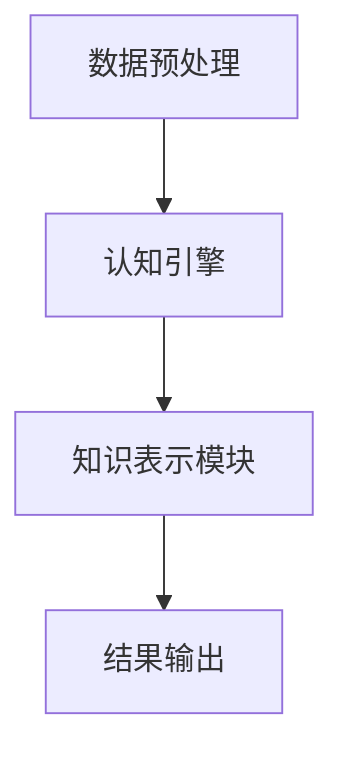
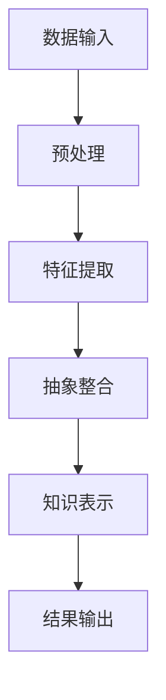

                 

### 文章标题：Zero-Shot CoT在跨时代技术演进模拟中的应用

> **关键词：零拍认知技术、跨时代技术演进、模拟应用、AI、物联网、区块链**

> **摘要：本文深入探讨了零拍认知技术（Zero-Shot CoT）在跨时代技术演进模拟中的应用。通过详细解析零拍认知技术的核心概念、算法原理、数学模型以及其在多个技术领域的应用场景，展示了零拍认知技术在推动技术进步和模拟预测中的重要作用。**

### 第一部分：引言

#### 1.1 时代背景

随着科技的飞速发展，人工智能、物联网、区块链等跨时代技术正在深刻改变着我们的生活方式和社会结构。这些技术的演进不仅仅是在技术本身上的进步，更涉及到整个社会生产方式的变革。在这样的背景下，如何有效地进行技术演进模拟，预测未来技术的发展趋势，成为了一个亟待解决的问题。

#### 1.2 零拍认知技术概述

零拍认知技术（Zero-Shot CoT）是一种前沿的人工智能技术，它能够在没有明确先验知识的情况下，对未知的信息进行有效理解和处理。这种技术尤其适用于跨领域、跨学科的研究和应用，能够在很大程度上提升技术演进模拟的准确性和效率。

#### 1.3 零拍认知技术体系结构与核心要素组成

零拍认知技术包含多个关键组件，如数据预处理模块、认知引擎、知识表示模块等。这些组件共同作用，实现了对复杂信息的高效处理和认知。其体系结构如图所示：

#### 1.4 零拍认知技术在跨时代技术演进模拟中的应用

零拍认知技术在跨时代技术演进模拟中具有独特的优势。通过模拟技术演进过程，可以预见未来技术发展的可能方向和潜在挑战，为决策者提供科学依据。此外，零拍认知技术还可以帮助优化技术路径，降低研发成本，提高技术转化的成功率。

### 第二部分：零拍认知技术原理

#### 2.1 零拍认知技术算法原理

零拍认知技术采用了一种创新的算法架构，能够实现从数据到知识的转化。其核心思想是通过多层次的抽象和整合，实现对复杂信息的深入理解和分析。算法的基本流程如图所示：

#### 2.2 数学模型与公式

零拍认知技术的数学模型基于概率论和统计学原理，通过一系列复杂的非线性变换和优化算法，实现对数据的处理和解释。以下是零拍认知技术中的一个关键数学公式：

$$
P(x|y) = \frac{P(y|x)P(x)}{P(y)}
$$

其中，$P(x|y)$ 表示在已知 $y$ 条件下 $x$ 的概率，$P(y|x)$ 表示在已知 $x$ 条件下 $y$ 的概率，$P(x)$ 和 $P(y)$ 分别表示 $x$ 和 $y$ 的先验概率。

#### 2.3 数学模型详细讲解

零拍认知技术的数学模型通过多个层次的结构，实现对数据的分层处理和解释。首先，通过预处理阶段，对原始数据进行清洗和规范化。然后，在特征提取阶段，利用各种特征提取算法，提取出数据中的关键特征。接着，通过抽象整合阶段，将提取出的特征进行整合和抽象，形成更高层次的知识表示。最后，通过知识表示模块，将整合后的知识表示输出，为后续的应用提供支持。

### 第三部分：零拍认知技术在跨时代技术演进模拟中的应用

#### 3.1 跨时代技术演进模拟概述

跨时代技术演进模拟是指通过构建仿真模型，模拟技术演进的过程，预测未来技术的发展趋势和可能的影响。这种模拟方法可以帮助决策者更好地理解技术演进的复杂性，制定科学的发展策略。

#### 3.2 零拍认知技术在跨时代技术演进模拟中的应用场景

零拍认知技术在跨时代技术演进模拟中具有广泛的应用前景。以下是一些典型的应用场景：

##### 场景一：人工智能领域

在人工智能领域，零拍认知技术可以用于模拟不同人工智能算法的性能表现，预测未来人工智能技术的发展方向和潜在挑战。

##### 场景二：物联网领域

在物联网领域，零拍认知技术可以用于模拟物联网系统的性能和行为，预测物联网技术在不同场景下的应用效果和潜在问题。

##### 场景三：区块链领域

在区块链领域，零拍认知技术可以用于模拟区块链网络的行为和性能，预测区块链技术的发展趋势和潜在风险。

#### 3.3 应用案例解析

##### 案例一：零拍认知技术在医疗健康领域的应用

在医疗健康领域，零拍认知技术可以用于模拟不同医疗诊断技术的性能，预测未来医疗技术发展的趋势和影响。

##### 案例二：零拍认知技术在智能制造领域的应用

在智能制造领域，零拍认知技术可以用于模拟智能制造系统的性能，预测未来智能制造技术的发展方向和潜在问题。

##### 案例三：零拍认知技术在智慧城市领域的应用

在智慧城市领域，零拍认知技术可以用于模拟智慧城市系统的性能，预测未来智慧城市技术的发展趋势和影响。

### 第四部分：零拍认知技术未来展望

#### 4.1 技术发展趋势

随着技术的不断发展，零拍认知技术有望在更多的领域得到应用。未来，零拍认知技术可能会更加智能化、自适应化，能够更好地应对复杂多变的实际场景。

#### 4.2 零拍认知技术在未来的应用

未来，零拍认知技术将在各个领域发挥更大的作用，如智能医疗、智能交通、智能教育等。通过模拟技术演进，可以为这些领域提供科学的发展策略，促进技术进步和产业升级。

#### 4.3 面临的挑战与解决方案

尽管零拍认知技术具有巨大的应用潜力，但在实际应用中仍面临一些挑战，如数据质量问题、算法稳定性问题等。未来，需要通过不断的研究和探索，解决这些问题，提升零拍认知技术的应用效果。

#### 4.4 本章小结

本文对零拍认知技术及其在跨时代技术演进模拟中的应用进行了详细探讨。通过分析零拍认知技术的核心概念、算法原理和数学模型，展示了其在技术演进模拟中的重要价值。未来，随着技术的不断发展，零拍认知技术有望在更广泛的领域发挥重要作用。作者：AI天才研究院/AI Genius Institute & 禅与计算机程序设计艺术 /Zen And The Art of Computer Programming

