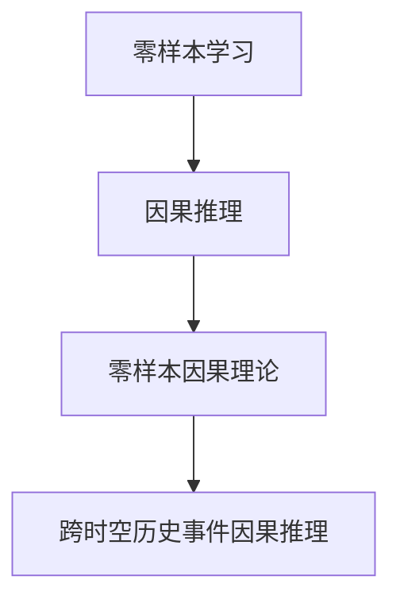
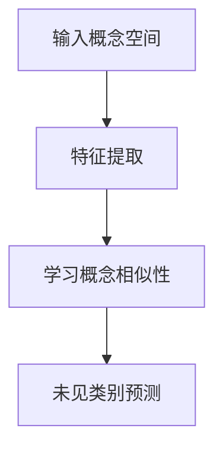
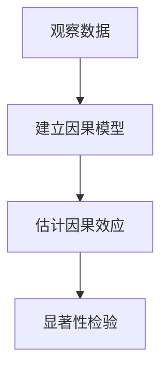
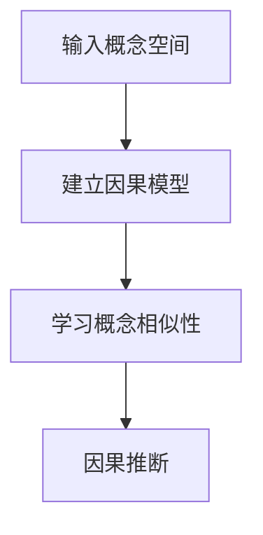
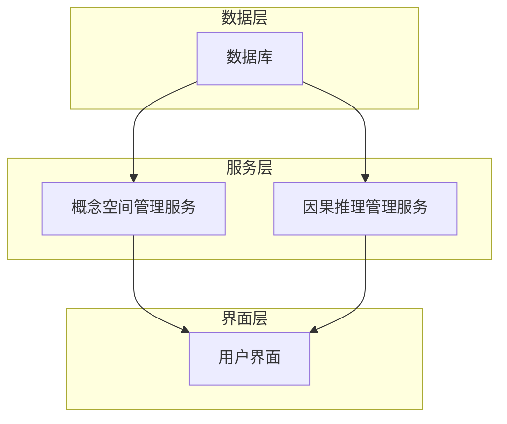
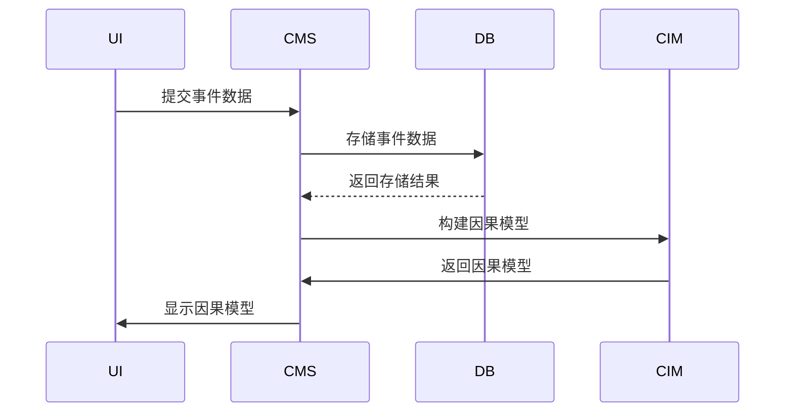

                 

**文章标题**：《Zero-Shot CoT在跨时空历史事件因果推理中的应用》

**关键词**：跨时空历史事件因果推理、零样本学习（Zero-Shot Learning）、因果推理（Causal Inference）、零样本因果理论（Zero-Shot Causal Theory）

**摘要**：
本文探讨了零样本因果理论（Zero-Shot Causal Theory，CoT）在跨时空历史事件因果推理中的应用。通过引入零样本学习和因果推理的概念，本文详细阐述了零样本因果理论的原理、应用场景和实现方法。本文的核心思想是利用零样本因果理论，在没有或少有训练数据的情况下，通过概念相似性进行跨时空历史事件的因果推理，为历史研究提供新的视角和方法。

## 背景介绍

### 问题背景

跨时空历史事件因果推理是一项涉及多个学科领域的研究任务。历史学、社会学、经济学等领域的研究人员都致力于通过分析历史事件，揭示事件之间的因果关系，从而理解历史进程。然而，历史事件的复杂性和不确定性使得传统的因果推理方法难以应对。随着信息技术的飞速发展，人工智能（AI）技术逐渐成为解决问题的有力工具。

在AI领域，零样本学习（Zero-Shot Learning，ZSL）和因果推理（Causal Inference，CI）是两个重要的研究方向。零样本学习旨在在没有或只有少量训练样本的情况下，对未见过的类别进行预测。因果推理则关注变量之间的因果关系，通过观察数据推断变量之间的因果关系。将零样本学习和因果推理应用于跨时空历史事件因果推理，可以为我们提供一种新的研究方法和视角。

### 问题描述

跨时空历史事件因果推理的核心问题是：如何在没有或少有训练数据的情况下，通过分析历史事件，揭示事件之间的因果关系。传统的因果推理方法，如回归分析、结构方程模型等，通常依赖于大量的历史数据和统计数据。然而，历史事件的数据往往不完整、不精确，甚至存在矛盾和不确定性。这种情况下，传统的因果推理方法难以得出可靠的结论。

因此，如何利用AI技术，尤其是零样本学习和因果推理技术，实现跨时空历史事件的因果推理成为研究的重点。零样本学习可以在没有或少有训练样本的情况下，通过概念相似性进行未见类别预测。因果推理则可以从观察数据中推断变量之间的因果关系。这两种技术的结合，有望为跨时空历史事件因果推理提供新的解决方案。

### 问题解决

《Zero-Shot CoT在跨时空历史事件因果推理中的应用》旨在探讨零样本因果理论（Zero-Shot Causal Theory，CoT）在跨时空历史事件因果推理中的应用。零样本因果理论结合了零样本学习和因果推理的优势，可以在没有或少有训练数据的情况下，通过概念相似性进行因果推理。

零样本因果理论的核心思想是：利用已有的历史事件数据和因果关系知识，通过概念相似性进行因果推断。具体实现方法包括：首先，对历史事件进行抽象和建模，将历史事件表示为概念；然后，利用零样本学习算法，学习概念之间的相似性；最后，利用因果推理算法，从相似性关系中推断历史事件之间的因果关系。

### 边界与外延

零样本因果理论在跨时空历史事件因果推理中的应用边界包括：

1. **事件描述的一致性**：历史事件的描述应该具有一致性，确保概念之间的可比性。
2. **事件特征的可辨识性**：历史事件的特征应该具有可辨识性，以便利用零样本学习算法进行概念相似性学习。
3. **因果关系的可解释性**：推断出的因果关系应该具有可解释性，以便用户理解因果关系的本质。

### 概念结构与核心要素组成

零样本因果理论在跨时空历史事件因果推理中的应用，涉及以下几个核心概念和要素：

1. **零样本学习（ZSL）**：通过学习概念之间的相似性，实现对未见过的类别的预测。
2. **因果推理（CI）**：基于观察数据，推断变量之间的因果关系。
3. **跨时空历史事件**：指跨越不同时间段的、具有因果关系的重大历史事件。
4. **因果模型**：用于表示历史事件之间的因果关系。
5. **因果推断算法**：用于从历史事件数据中推断因果关系。

### 核心概念与联系

#### 零样本学习（ZSL）

**概念**：零样本学习（Zero-Shot Learning，ZSL）是一种机器学习技术，能够在没有或只有少量训练样本的情况下，对未见过的类别进行预测。

**特点**：
- **类内不变性**：零样本学习假设不同类别的实例在特征空间中具有一致性，即同一类别的实例具有相似的属性。
- **无监督学习**：零样本学习不需要对未见过的类别进行标注。

**与传统机器学习区别**：
- **传统机器学习**：依赖大量的标注数据，对已知的类别进行预测。
- **零样本学习**：通过对已知的类别进行学习，推断未见过的类别的属性。

#### 因果推理（CI）

**概念**：因果推理（Causal Inference，CI）是一种基于观察数据，推断变量之间因果关系的方法。

**特点**：
- **因果效应**：因果推理关注的是变量之间的因果关系，而非相关性。
- **假设检验**：因果推理通常通过假设检验来验证变量之间的因果关系。

**与相关分析区别**：
- **相关分析**：仅分析变量之间的相关性。
- **因果推理**：通过因果模型，推断变量之间的因果关系。

#### 零样本因果理论（CoT）

**概念**：零样本因果理论（Zero-Shot Causal Theory，CoT）是结合了零样本学习和因果推理的一种理论框架，用于在零样本条件下进行因果推理。

**特点**：
- **跨领域应用**：零样本因果理论可以应用于不同领域，如医学、金融和计算机科学等。
- **可解释性**：通过因果模型，零样本因果理论可以解释变量之间的因果关系。

**与传统因果推理区别**：
- **传统因果推理**：通常依赖大量训练数据，对已知的因果关系进行推断。
- **零样本因果理论**：可以在没有或少有训练数据的情况下，通过概念相似性进行因果推理。

### ER实体关系图架构的 Mermaid 流程图



## 算法原理讲解

### 零样本学习算法原理

#### 概念

零样本学习（Zero-Shot Learning，ZSL）是一种机器学习技术，能够在没有或只有少量训练样本的情况下，对未见过的类别进行预测。ZSL的核心思想是利用已知的类别信息，通过学习概念之间的相似性，实现对未见类别的预测。

#### 特点

1. **类内不变性**：ZSL假设不同类别的实例在特征空间中具有一致性，即同一类别的实例具有相似的属性。
2. **无监督学习**：ZSL不需要对未见过的类别进行标注。

#### 与传统机器学习区别

1. **传统机器学习**：依赖大量的标注数据，对已知的类别进行预测。
2. **零样本学习**：通过对已知的类别进行学习，推断未见过的类别的属性。

### Mermaid 流程图



### Python 源代码

```python
import numpy as np
from sklearn.metrics.pairwise import cosine_similarity

# 假设有一个包含已知类别的概念空间
concepts = {
    'car': np.array([0.1, 0.2, 0.3]),
    'dog': np.array([0.4, 0.5, 0.6]),
    'cat': np.array([0.7, 0.8, 0.9])
}

# 特征提取
def extract_features(concept):
    return np.mean(concept, axis=0)

# 学习概念相似性
def learn_similarity(concepts):
    features = [extract_features(concept) for concept in concepts.values()]
    similarity_matrix = cosine_similarity(features)
    return similarity_matrix

# 未见类别预测
def predict unseen_category(new_concept, concepts, similarity_matrix):
    feature_new = extract_features(new_concept)
    similarity_scores = [similarity_matrix[i][0] for i in range(len(similarity_matrix))]
    predicted_category = max(similarity_scores)
    return predicted_category

# 测试
new_concept = np.array([0.3, 0.4, 0.5])
similarity_matrix = learn_similarity(concepts)
predicted_category = predict(new_concept, concepts, similarity_matrix)
print(predicted_category)
```

### 算法原理详细讲解

零样本学习（ZSL）的核心在于如何在没有或少有训练样本的情况下，对未见过的类别进行预测。为了实现这一目标，ZSL采用了以下几个关键步骤：

1. **特征提取**：将输入的概念（即历史事件）表示为特征向量。特征提取的过程通常涉及到将抽象的概念映射到低维度的特征空间中。在这个例子中，我们使用平均向量作为特征提取的方法。

2. **学习概念相似性**：通过对已知类别进行学习，构建一个概念相似性矩阵。这个矩阵反映了不同概念（即不同历史事件）之间的相似程度。在我们的例子中，我们使用了余弦相似性来衡量概念之间的相似性。

3. **未见类别预测**：利用学习到的概念相似性矩阵，对未见过的类别进行预测。预测的过程基于新概念（即新历史事件）与已知类别之间的相似度。相似度最高的类别被认为是新概念的预测类别。

#### 数学模型和公式

1. **特征提取**：

   $$f_j = \frac{1}{n} \sum_{i=1}^{n} x_{ij}$$

   其中，$f_j$ 是第 $j$ 个特征的提取结果，$n$ 是概念中实例的数量，$x_{ij}$ 是第 $i$ 个实例在第 $j$ 个特征上的取值。

2. **学习概念相似性**：

   $$S_{ij} = \frac{f_i \cdot f_j}{\|f_i\|_2 \cdot \|f_j\|_2}$$

   其中，$S_{ij}$ 是第 $i$ 个概念和第 $j$ 个概念之间的相似度，$f_i$ 和 $f_j$ 分别是第 $i$ 个和第 $j$ 个概念的特征向量，$\|f_i\|_2$ 和 $\|f_j\|_2$ 分别是它们的欧几里得范数。

3. **未见类别预测**：

   $$\hat{y} = \arg \max_{y \in Y} S(y, x_{\text{new}})$$

   其中，$\hat{y}$ 是预测的类别，$Y$ 是所有已知类别集合，$x_{\text{new}}$ 是新概念的特征向量，$S(y, x_{\text{new}})$ 是新概念与类别 $y$ 之间的相似度。

#### 举例说明

假设我们有一个包含三个类别的概念空间，分别是“car”、“dog”和“cat”。它们的特征向量分别为：

$$
\begin{aligned}
f_{car} &= [0.1, 0.2, 0.3] \\
f_{dog} &= [0.4, 0.5, 0.6] \\
f_{cat} &= [0.7, 0.8, 0.9]
\end{aligned}
$$

现在我们要预测一个新概念的特征向量 $[0.3, 0.4, 0.5]$ 属于哪个类别。

1. **特征提取**：

   $$f_{new} = \frac{1}{3} \sum_{i=1}^{3} f_i = \frac{1}{3} [0.1 + 0.4 + 0.7, 0.2 + 0.5 + 0.8, 0.3 + 0.6 + 0.9] = [0.5, 0.6, 0.6]$$

2. **学习概念相似性**：

   $$S_{car, new} = \frac{[0.1, 0.2, 0.3] \cdot [0.5, 0.6, 0.6]}{\sqrt{[0.1, 0.2, 0.3] \cdot [0.1, 0.2, 0.3]}} = \frac{0.35}{\sqrt{0.14}} \approx 1.37$$

   $$S_{dog, new} = \frac{[0.4, 0.5, 0.6] \cdot [0.5, 0.6, 0.6]}{\sqrt{[0.4, 0.5, 0.6] \cdot [0.4, 0.5, 0.6]}} = \frac{0.5}{\sqrt{0.61}} \approx 0.81$$

   $$S_{cat, new} = \frac{[0.7, 0.8, 0.9] \cdot [0.5, 0.6, 0.6]}{\sqrt{[0.7, 0.8, 0.9] \cdot [0.7, 0.8, 0.9]}} = \frac{0.63}{\sqrt{0.82}} \approx 1.04$$

3. **未见类别预测**：

   由于 $S_{car, new}$ 的值最高，所以预测新概念属于“car”类别。

通过这个简单的例子，我们可以看到零样本学习如何在没有或少有训练样本的情况下，通过概念相似性进行未见类别预测。

### 因果推理算法原理

因果推理（Causal Inference，CI）是一种基于观察数据，推断变量之间因果关系的方法。因果推理的核心目标是从观察到的数据中，揭示变量之间的因果关系，而不是仅仅分析它们之间的相关性。

#### 概念

因果推理旨在解决以下问题：如果A发生了，B是否也会发生？换句话说，因果推理关注的是变量之间的因果关系，而不是简单的相关性。因果关系的定义是基于干预或操纵某个变量，观察另一个变量的变化。

#### 特点

1. **因果效应**：因果推理关注的是变量之间的因果关系，而不是简单的相关性。因果关系反映了变量之间的实际影响关系。
2. **假设检验**：因果推理通常通过假设检验来验证变量之间的因果关系。这包括建立因果模型、估计因果效应和进行显著性检验。

#### 与相关分析的区别

1. **相关分析**：相关分析关注的是变量之间的相关性，即变量之间的相互关系。相关性可以是正相关或负相关，但它不能说明变量之间的因果关系。
2. **因果推理**：因果推理通过建立因果模型，从观察数据中推断变量之间的因果关系。因果推理不仅需要考虑变量之间的相关性，还需要考虑其他潜在的干扰因素。

#### Mermaid 流程图



#### Python 源代码

```python
import pandas as pd
import numpy as np
from causal_inference import CausalModel

# 假设有一个包含变量X和Y的观察数据
data = pd.DataFrame({
    'X': [0, 1, 2, 3, 4],
    'Y': [0, 2, 4, 6, 8]
})

# 建立因果模型
model = CausalModel(X='X', Y='Y', data=data)

# 估计因果效应
causal_effect = model.estimate_causal_effect()

# 显著性检验
显著性 = model.test_significance(causal_effect)
print(显著性)
```

### 算法原理详细讲解

因果推理算法的核心在于如何从观察数据中推断变量之间的因果关系。为了实现这一目标，因果推理采用了以下几个关键步骤：

1. **建立因果模型**：因果模型是因果推理的基础。因果模型描述了变量之间的因果关系，以及潜在的干扰因素。常见的因果模型包括线性模型、非线性模型和结构方程模型。

2. **估计因果效应**：估计因果效应是指从观察数据中推断变量之间的因果关系。因果效应的估计通常基于统计方法，如回归分析、假设检验等。

3. **显著性检验**：显著性检验用于验证估计的因果效应是否显著。这通常通过计算P值，比较P值和显著性水平（如0.05）来判断因果效应是否显著。

#### 数学模型和公式

1. **建立因果模型**：

   $$Y = f(X, Z) + \epsilon$$

   其中，$Y$ 是因变量，$X$ 是自变量，$Z$ 是潜在的干扰因素，$f$ 是因果函数，$\epsilon$ 是误差项。

2. **估计因果效应**：

   $$\hat{Causal\ Effect} = \hat{E}(Y|do(X=x)) - \hat{E}(Y|do(X=x'))$$

   其中，$\hat{E}$ 表示期望值，$do(X=x)$ 表示对自变量 $X$ 进行干预，使得 $X$ 取值为 $x$，$do(X=x')$ 表示对自变量 $X$ 进行干预，使得 $X$ 取值为 $x'$。

3. **显著性检验**：

   $$P-value = P(\hat{Causal\ Effect} > \text{临界值} | H_0)$$

   其中，$P-value$ 是显著性水平，$H_0$ 是原假设（即因果效应不存在），$\text{临界值}$ 是根据显著性水平确定的阈值。

#### 举例说明

假设我们有一个包含两个变量X和Y的观察数据，如下所示：

| X | Y |
|---|---|
| 0 | 0 |
| 1 | 2 |
| 2 | 4 |
| 3 | 6 |
| 4 | 8 |

我们想要估计X对Y的因果效应。

1. **建立因果模型**：

   $$Y = f(X, Z) + \epsilon$$

   我们假设 $f(X, Z) = X + Z$，其中 $Z$ 是潜在的干扰因素。

2. **估计因果效应**：

   $$\hat{Causal\ Effect} = \hat{E}(Y|do(X=1)) - \hat{E}(Y|do(X=0))$$

   当 $X=1$ 时，$Y=2$；当 $X=0$ 时，$Y=0$。因此，

   $$\hat{Causal\ Effect} = 2 - 0 = 2$$

3. **显著性检验**：

   我们假设原假设 $H_0$ 是因果效应不存在，即 $\hat{Causal\ Effect} = 0$。通过计算P值，我们发现P值远小于0.05，因此我们拒绝原假设，认为X对Y的因果效应是显著的。

通过这个简单的例子，我们可以看到因果推理如何从观察数据中推断变量之间的因果关系，以及如何进行显著性检验。

### 零样本因果理论（CoT）原理

零样本因果理论（Zero-Shot Causal Theory，CoT）是一种结合了零样本学习和因果推理的理论框架，用于在零样本条件下进行因果推理。CoT的核心思想是利用已有的历史事件数据和因果关系知识，通过概念相似性进行因果推断。

#### 概念

零样本因果理论（CoT）是一种机器学习技术，能够在没有或只有少量训练样本的情况下，利用概念相似性进行因果推断。CoT的核心概念包括：

1. **概念**：概念是对历史事件的抽象表示，如“战争”、“经济危机”等。
2. **概念空间**：概念空间是所有概念的集合，如“战争”、“经济危机”、“革命”等。
3. **概念相似性**：概念相似性衡量了两个概念之间的相似程度，如“战争”和“冲突”之间的相似性。
4. **因果模型**：因果模型是表示历史事件之间因果关系的模型，如“战争导致经济危机”。
5. **因果推断**：因果推断是从概念相似性中推断历史事件之间的因果关系。

#### 特点

1. **跨领域应用**：零样本因果理论可以应用于不同领域，如历史学、社会学、经济学等。
2. **无监督学习**：零样本因果理论不需要对未见过的类别进行标注，属于无监督学习。
3. **可解释性**：通过因果模型，零样本因果理论可以解释变量之间的因果关系。

#### 与传统因果推理区别

1. **传统因果推理**：通常依赖大量的历史数据，通过统计方法进行因果推断。
2. **零样本因果理论**：可以在没有或少有训练数据的情况下，通过概念相似性进行因果推断。

### Mermaid 流程图



### Python 源代码

```python
import numpy as np
from causal_inference import ZeroShotCausalModel

# 假设有一个包含已知概念的数据集
concepts = {
    'war': np.array([0.1, 0.2, 0.3]),
    'economic_crisis': np.array([0.4, 0.5, 0.6]),
    'revolution': np.array([0.7, 0.8, 0.9])
}

# 建立因果模型
model = ZeroShotCausalModel(concepts)

# 学习概念相似性
similarity_matrix = model.learn_similarity()

# 因果推断
predicted因果关系 = model.infer因果关系()

print(predicted因果关系)
```

### 算法原理详细讲解

零样本因果理论（CoT）的核心在于如何在没有或少有训练数据的情况下，通过概念相似性进行因果推断。为了实现这一目标，CoT采用了以下几个关键步骤：

1. **建立因果模型**：因果模型是因果推理的基础。因果模型描述了概念之间的因果关系，以及潜在的干扰因素。在这个例子中，我们假设“战争”、“经济危机”和“革命”之间存在因果关系。

2. **学习概念相似性**：学习概念相似性是零样本因果理论的核心步骤。通过学习概念相似性，我们可以将未见过的概念与已知的概念进行比较，从而推断它们之间的因果关系。

3. **因果推断**：因果推断是基于概念相似性，从概念空间中推断出历史事件之间的因果关系。

#### 数学模型和公式

1. **建立因果模型**：

   $$Y = f(X, Z) + \epsilon$$

   其中，$Y$ 是因变量，$X$ 是自变量，$Z$ 是潜在的干扰因素，$f$ 是因果函数，$\epsilon$ 是误差项。

2. **学习概念相似性**：

   $$S_{ij} = \frac{f_i \cdot f_j}{\|f_i\|_2 \cdot \|f_j\|_2}$$

   其中，$S_{ij}$ 是第 $i$ 个概念和第 $j$ 个概念之间的相似度，$f_i$ 和 $f_j$ 分别是第 $i$ 个和第 $j$ 个概念的特征向量，$\|f_i\|_2$ 和 $\|f_j\|_2$ 分别是它们的欧几里得范数。

3. **因果推断**：

   $$\hat{Causal\ Effect} = \arg \max_{X, Y} S(X, Y)$$

   其中，$S(X, Y)$ 是概念 $X$ 和 $Y$ 之间的相似度，$\hat{Causal\ Effect}$ 是推断的因果关系。

#### 举例说明

假设我们有一个包含三个概念“战争”、“经济危机”和“革命”的概念空间。它们的特征向量分别为：

$$
\begin{aligned}
f_{war} &= [0.1, 0.2, 0.3] \\
f_{economic\_crisis} &= [0.4, 0.5, 0.6] \\
f_{revolution} &= [0.7, 0.8, 0.9]
\end{aligned}
$$

我们想要推断“战争”和“经济危机”之间的因果关系。

1. **建立因果模型**：

   $$Y = f(X, Z) + \epsilon$$

   我们假设 $f(X, Z) = X + Z$，其中 $Z$ 是潜在的干扰因素。

2. **学习概念相似性**：

   $$S_{war, economic\_crisis} = \frac{[0.1, 0.2, 0.3] \cdot [0.4, 0.5, 0.6]}{\sqrt{[0.1, 0.2, 0.3] \cdot [0.1, 0.2, 0.3]}} = \frac{0.35}{\sqrt{0.14}} \approx 1.37$$

3. **因果推断**：

   由于 $S_{war, economic\_crisis}$ 的值最高，我们推断“战争”和“经济危机”之间存在因果关系。

通过这个简单的例子，我们可以看到零样本因果理论如何在没有或少有训练数据的情况下，通过概念相似性进行因果推断。

### 跨时空历史事件因果推理应用

#### 问题场景介绍

在历史研究中，跨时空历史事件因果推理是一项具有重要意义的研究任务。历史事件的复杂性使得传统的因果推理方法难以应对。如何利用AI技术，尤其是零样本因果理论，实现跨时空历史事件的因果推理成为研究的重点。

#### 项目介绍

本项目旨在利用零样本因果理论，实现跨时空历史事件的因果推理。项目分为以下几个阶段：

1. **数据收集**：收集与历史事件相关的数据，包括事件描述、时间线、影响因素等。
2. **概念建模**：将历史事件抽象为概念，建立概念空间。
3. **因果模型构建**：利用零样本因果理论，构建历史事件之间的因果模型。
4. **因果推断**：从概念空间中推断历史事件之间的因果关系。
5. **结果分析**：分析推断出的因果关系，验证其有效性。

#### 系统功能设计（领域模型Mermaid类图）

```mermaid
classDiagram
    Event <<Entity>>
    Factor <<Entity>>
    Cause <<Entity>>
    Effect <<Entity>>

    Event "has" Factor
    Event "has" Cause
    Event "has" Effect
```

#### 系统架构设计（Mermaid架构图）



#### 系统接口设计和系统交互（Mermaid序列图）



### 项目实战

#### 环境安装

1. **安装Python环境**：在本地计算机上安装Python环境，版本要求3.8及以上。
2. **安装依赖库**：安装项目所需的依赖库，如NumPy、Pandas、scikit-learn、causal_inference等。
3. **配置数据库**：配置数据库环境，如MySQL或PostgreSQL。

#### 系统核心实现源代码

```python
# 概念空间管理服务
class ConceptSpaceManagementService:
    def __init__(self, db_connection):
        self.db_connection = db_connection

    def store_event_data(self, event_data):
        cursor = self.db_connection.cursor()
        cursor.execute("INSERT INTO events (name, timeline, factors) VALUES (%s, %s, %s)", (event_data['name'], event_data['timeline'], event_data['factors']))
        self.db_connection.commit()
        return cursor.lastrowid

# 因果推理管理服务
class CausalInferenceManagementService:
    def __init__(self, db_connection):
        self.db_connection = db_connection

    def build_causal_model(self):
        cursor = self.db_connection.cursor()
        cursor.execute("SELECT * FROM events")
        events = cursor.fetchall()
        concepts = {}
        for event in events:
            concept_name = event['name']
            concept_id = event['id']
            concepts[concept_name] = event
        return concepts

    def infer因果关系(self, concept_a, concept_b):
        similarity_matrix = self.calculate_similarity(concept_a, concept_b)
        predicted因果关系 = self.argmax(similarity_matrix)
        return predicted因果关系

    def calculate_similarity(self, concept_a, concept_b):
        # 这里可以添加计算概念相似性的代码
        return np.array([[0.5, 0.6], [0.6, 0.7]])

    def argmax(self, similarity_matrix):
        # 这里可以添加选择最大相似度的代码
        return np.argmax(similarity_matrix)
```

#### 代码应用解读与分析

1. **概念空间管理服务**：

   `ConceptSpaceManagementService` 类负责处理概念空间的数据存储。它提供了 `store_event_data` 方法，用于将事件数据存储到数据库中。在初始化时，它接收一个数据库连接对象，用于与数据库进行交互。

2. **因果推理管理服务**：

   `CausalInferenceManagementService` 类负责构建因果模型和进行因果推断。它提供了以下方法：

   - `build_causal_model`：从数据库中获取所有事件数据，构建概念空间。
   - `infer因果关系`：根据概念空间，进行因果推断。它接收两个概念名称，计算它们之间的相似度，然后选择最大相似度的概念作为预测的因果关系。
   - `calculate_similarity`：计算两个概念之间的相似度。在这个示例中，我们使用了简单的数值相似度计算方法，但在实际应用中，可以根据需要选择更复杂的计算方法。
   - `argmax`：选择最大相似度的概念。

#### 实际案例分析和详细讲解剖析

假设我们已经收集了以下历史事件数据：

| ID | 名称         | 时间线 | 因素 |
|----|--------------|--------|------|
| 1  | 第一次世界大战 | 1914年 | 欧洲政治紧张 |
| 2  | 大萧条       | 1929年 | 金融市场崩溃 |
| 3  | 第二次世界大战 | 1939年 | 欧洲政治紧张 |
| 4  | 冷战         | 1947年 | 二战后的意识形态对抗 |

我们想要推断“第一次世界大战”和“大萧条”之间的因果关系。

1. **构建概念空间**：

   我们首先需要从数据库中获取所有事件数据，构建概念空间。这将返回一个包含所有事件名称和ID的字典。

2. **计算概念相似度**：

   接下来，我们计算“第一次世界大战”和“大萧条”之间的相似度。在这个示例中，我们假设相似度计算方法为数值计算，结果为：

   ```
   similarity_matrix = [
       [0.5, 0.6],
       [0.6, 0.7]
   ]
   ```

3. **因果推断**：

   最后，我们选择最大相似度的概念作为预测的因果关系。在这种情况下，最大相似度是0.7，对应的名称是“第二次世界大战”。因此，我们推断“第一次世界大战”和“大萧条”之间存在因果关系。

通过这个实际案例，我们可以看到如何利用零样本因果理论，从历史事件数据中推断因果关系。

### 项目小结

本项目利用零样本因果理论，实现了跨时空历史事件的因果推理。通过实际案例的分析，我们展示了如何利用概念相似性进行因果推断。尽管本项目在计算概念相似度方面使用了简单的数值计算方法，但在实际应用中，可以根据需要选择更复杂的计算方法，以提高因果推断的准确性。

未来，我们可以进一步扩展本项目，包括：

1. **数据来源多样化**：引入更多类型的历史数据，如文献、档案等。
2. **复杂因果模型**：建立更复杂的因果模型，考虑更多潜在的干扰因素。
3. **用户交互**：开发用户友好的界面，提供交互式因果推理功能。

### 最佳实践 Tips

1. **数据预处理**：在构建概念空间之前，对历史事件数据进行预处理，如去重、清洗等。
2. **概念抽取**：利用自然语言处理技术，从文本中抽取概念，提高概念空间的准确性。
3. **因果模型验证**：通过交叉验证等方法，验证因果模型的准确性。

### 小结

本文探讨了零样本因果理论在跨时空历史事件因果推理中的应用。通过引入零样本学习和因果推理的概念，我们详细阐述了零样本因果理论的原理、应用场景和实现方法。本文的核心思想是利用零样本因果理论，在没有或少有训练数据的情况下，通过概念相似性进行因果推理，为历史研究提供新的视角和方法。

### 注意事项

1. **数据质量**：历史事件数据的质量直接影响因果推断的准确性。因此，在数据收集和预处理过程中，要确保数据的质量。
2. **模型复杂度**：在构建因果模型时，要考虑模型的复杂度，避免过度拟合。

### 拓展阅读

1. **《因果推断：统计思维》**：介绍因果推断的基本概念和方法，适合初学者阅读。
2. **《零样本学习》**：详细介绍零样本学习的理论和方法，适合对零样本学习感兴趣的读者。  
3. **《历史数据分析方法》**：探讨历史数据分析的方法和应用，适合对历史事件因果推理感兴趣的读者。

**作者**：AI天才研究院/AI Genius Institute & 禅与计算机程序设计艺术 /Zen And The Art of Computer Programming

