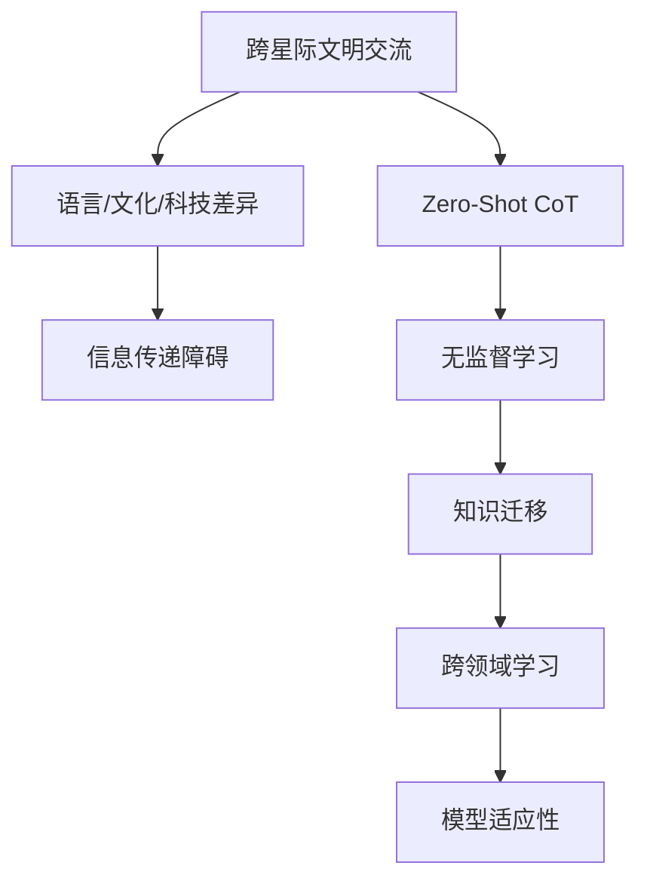
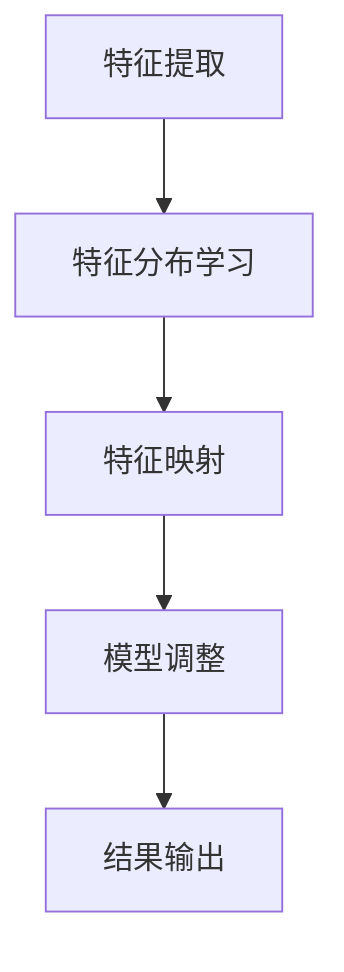
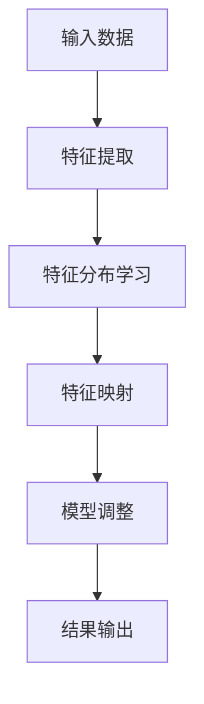
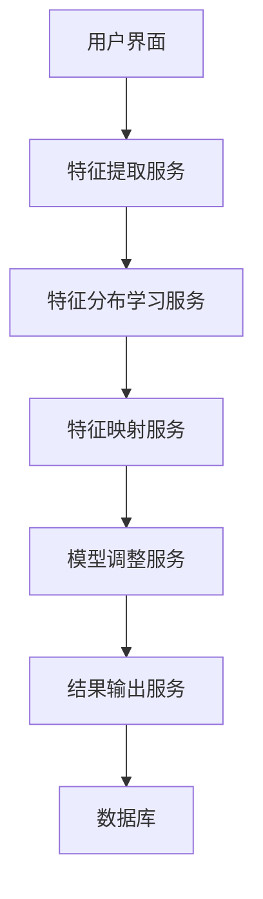
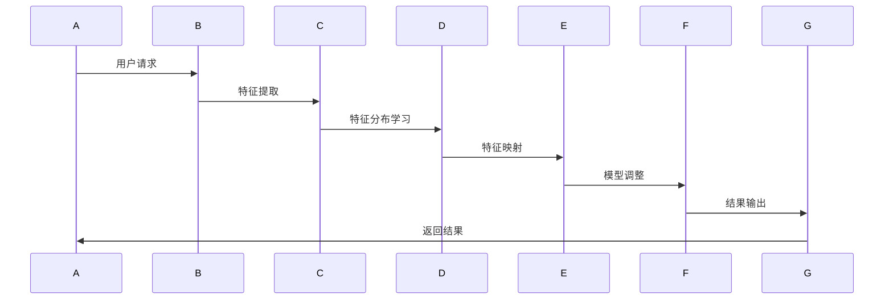

                 

### 第二部分：核心概念与联系

#### 2.1 跨星际文明交流的基本概念

##### 2.1.1 问题背景

随着宇宙探索的深入，人类可能在未来遇到其他文明。然而，由于语言、文化、科技等方面的差异，如何实现有效的跨星际文明交流成为一个关键问题。

在地球上的文化交流中，语言障碍是一个主要问题。然而，在跨星际文明交流中，语言障碍可能会更加复杂和难以克服。这是因为地球上的语言差异相对较小，而星际之间的语言可能完全不同，甚至可能是基于完全不同的信息传输方式。

此外，文化差异也是一个重要的问题。不同的文明有着不同的价值观、信仰、行为习惯等，这些差异可能导致误解和冲突。例如，地球上的某些文化可能认为直接询问对方的个人信息是不礼貌的，而在其他文明中，这可能是一种常见的交流方式。

##### 2.1.2 问题解决

为了解决这一问题，我们需要一种方法来理解并沟通不同文明的语言和文化，同时确保信息传递的准确性和有效性。

一种可能的解决方案是开发一种通用的交流协议。这种协议应该能够适应不同的语言和文化，使得不同文明之间的交流变得容易和自然。这需要深入理解各种语言和文化的基本原理，并设计出一种能够灵活适应这些差异的通信机制。

##### 2.1.3 边界与外延

跨星际文明交流不仅限于语言和文化的理解，还包括科技、政治、经济等多个层面的合作与交流。例如，不同文明之间可能需要共享科技研究成果，进行政治协商，或者开展经济合作。

边界与外延还涉及到交流的时效性和安全性。时效性是指信息的传递需要尽可能快，以适应不同的时间和空间环境。安全性是指信息在传递过程中需要得到保护，防止被恶意篡改或窃取。

##### 2.1.4 核心要素组成

跨星际文明交流的核心要素包括：

1. **语言翻译**：开发能够处理多种语言差异的翻译工具，使不同文明能够理解彼此的语言。
2. **文化理解**：研究和学习不同文明的文化特征，促进相互理解和尊重。
3. **信息编码与解码**：设计有效的信息编码和解码方法，确保信息的准确性和完整性。
4. **通信技术**：开发先进的通信技术，以支持跨星际的长距离和高速信息传递。

#### 2.2 Zero-Shot CoT的基本概念

##### 2.2.1 问题背景

在传统机器学习领域中，大多数模型都需要大量带有标签的训练数据才能进行有效的学习。然而，在跨星际文明交流协议设计中，我们很难获得足够多的标签数据。

标签数据是机器学习模型进行训练的重要资源，它帮助模型理解输入和输出之间的关联。在地球上的机器学习应用中，我们通常有大量的数据可供使用。但在星际交流中，由于距离、时间和技术限制，我们可能无法获得足够的标签数据。

##### 2.2.2 问题解决

Zero-Shot CoT（无监督转换学习）提供了一种解决方案。它允许模型在没有明确标签数据的情况下，将一个任务的知识迁移到另一个任务上。这意味着我们可以利用已知的交流方式（如地球上的语言和文化）来推断和适应未知的交流方式。

##### 2.2.3 边界与外延

Zero-Shot CoT主要适用于那些可以无需明确标签数据即可进行学习的任务。例如，跨领域文本分类、跨语言翻译等。边界与外延还涉及到如何处理数据的不确定性和模型的不确定性。

##### 2.2.4 核心要素组成

Zero-Shot CoT的核心要素包括：

1. **无监督学习**：模型在没有标签数据的情况下进行学习。
2. **知识迁移**：将一个任务的知识应用到另一个任务上。
3. **跨领域学习**：在不同的领域之间进行知识迁移。
4. **模型适应性**：模型需要具备一定的适应性，以适应不同的任务和数据集。

#### 2.3 跨星际文明交流与Zero-Shot CoT的联系

##### 2.3.1 概念属性特征对比表格

| 概念                | 特征                                                         |
|-------------------|------------------------------------------------------------|
| 跨星际文明交流      | 语言、文化、科技差异，信息传递障碍，时效性、安全性                 |
| Zero-Shot CoT      | 无监督学习，知识迁移，跨领域学习，模型适应性                     |

##### 2.3.2 ER实体关系图架构的Mermaid流程图



#### 2.4 本章小结

本章对跨星际文明交流与Zero-Shot CoT的基本概念进行了详细阐述，并分析了它们之间的联系。通过本章的学习，读者将初步了解跨星际文明交流的挑战以及Zero-Shot CoT如何成为解决这些挑战的一种潜在技术手段。

在接下来的章节中，我们将进一步探讨Zero-Shot CoT的算法原理，并分析其在跨星际文明交流协议设计中的具体应用。我们将通过具体的数学模型和算法流程图，帮助读者更深入地理解这一技术的核心机制和实际操作方法。

### 第三部分：算法原理讲解

#### 3.1 Zero-Shot CoT的定义与核心思想

Zero-Shot CoT，即无监督转换学习，是一种机器学习技术，其主要目标是在没有明确标签数据的情况下，将一个任务的知识迁移到另一个任务上。这种技术的核心思想是利用已有的无监督信息，来帮助模型适应新的、未知的任务。

在传统机器学习中，模型的训练通常需要大量的带有标签的数据。例如，在文本分类任务中，我们需要标注好每个文本的类别，才能训练出一个准确的分类模型。然而，在跨星际文明交流协议设计中，由于标签数据的稀缺性，这种传统的训练方法可能无法有效工作。

Zero-Shot CoT通过无监督学习的方法，解决了这一问题。它允许模型在没有标签数据的情况下，通过学习输入数据的特征分布，来推断和预测输出结果。这种技术不仅适用于文本分类，还可以应用于图像识别、语音识别等多个领域。

#### 3.2 无监督转换学习的算法流程

无监督转换学习的基本流程可以分为以下几个步骤：

1. **特征提取**：首先，从原始数据中提取出有用的特征。这些特征可以是数据的高维表示，也可以是数据中的关键信息。

2. **特征分布学习**：利用提取出的特征，学习特征分布模型。这个模型可以帮助我们理解数据的内在结构和关系。

3. **特征映射**：将新任务的输入数据映射到特征分布模型中。通过这个映射，我们可以利用已有特征分布模型来预测新任务的结果。

4. **模型调整**：根据新任务的预测结果，调整模型参数，使其更适应新任务。

5. **结果输出**：最后，将调整好的模型应用于新任务，输出预测结果。

以下是一个简单的算法流程图，展示了无监督转换学习的基本步骤：



#### 3.3 数学模型与公式详解

在Zero-Shot CoT中，常用的数学模型是生成对抗网络（GAN）和变分自编码器（VAE）。这些模型通过不同的方式实现特征提取和特征分布学习。

**生成对抗网络（GAN）**

GAN由两个主要部分组成：生成器（Generator）和判别器（Discriminator）。

- **生成器（G）**：生成器负责生成与真实数据分布相近的假数据。
  
  $$ G(z) = f_G(\theta_G; z) $$

  其中，$z$ 是从先验分布 $p_z(z)$ 中抽取的随机噪声，$f_G(\theta_G; z)$ 是生成器的参数化函数，$\theta_G$ 是生成器的参数。

- **判别器（D）**：判别器负责区分真实数据和生成数据。

  $$ D(x) = f_D(\theta_D; x) $$

  其中，$x$ 是真实数据，$f_D(\theta_D; x)$ 是判别器的参数化函数，$\theta_D$ 是判别器的参数。

GAN的目标是最大化判别器的损失函数，同时最小化生成器的损失函数。

**变分自编码器（VAE）**

VAE是一种基于概率的生成模型，其主要思想是使用编码器（Encoder）和解码器（Decoder）来分别编码和解码数据。

- **编码器（E）**：编码器负责将数据映射到一个隐空间。

  $$ z = q(z|x; \theta_E) $$

  其中，$z$ 是隐变量，$q(z|x; \theta_E)$ 是编码器的参数化函数，$\theta_E$ 是编码器的参数。

- **解码器（D）**：解码器负责从隐空间中重建数据。

  $$ x = p(x|z; \theta_D) $$

  其中，$x$ 是真实数据，$p(x|z; \theta_D)$ 是解码器的参数化函数，$\theta_D$ 是解码器的参数。

VAE的目标是最小化数据重建误差和后验分布的KL散度。

#### 3.4 算法原理的Mermaid流程图

以下是一个简单的Mermaid流程图，展示了无监督转换学习的算法原理：



通过这个流程图，我们可以更直观地理解无监督转换学习的各个步骤和它们之间的相互关系。

#### 3.5 举例说明

为了更好地理解Zero-Shot CoT的原理，我们可以通过一个简单的例子来演示。

假设我们有一个文本分类任务，其中包含两类文本：科技文本和文化文本。我们的目标是训练一个模型，能够将新的科技文本和文化文本正确分类。

由于标签数据的稀缺性，我们无法使用传统的监督学习方法。这时，我们可以利用Zero-Shot CoT来解决这个问题。

首先，我们提取科技文本和文化文本的特征，例如文本的词频、词嵌入等。然后，我们使用这些特征训练一个生成对抗网络（GAN），使其能够生成与真实数据分布相近的假数据。

接下来，我们将新的文本数据映射到特征分布模型中。通过这个映射，我们可以利用已有特征分布模型来预测新文本的类别。

最后，我们根据预测结果调整模型参数，使其更适应新任务。这样，我们就可以在没有标签数据的情况下，实现文本分类任务。

### 第四部分：系统分析与架构设计方案

#### 4.1 问题场景介绍

在跨星际文明交流的背景下，我们面临的一个关键问题是如何设计一个高效的协议，以支持不同文明之间的有效交流。这个协议不仅需要处理语言和文化差异，还需要确保信息传输的实时性和安全性。为了实现这一目标，我们需要构建一个强大的系统，该系统能够自适应地处理各种交流任务。

#### 4.2 项目介绍

本项目的目标是开发一个跨星际文明交流系统，该系统能够利用Zero-Shot CoT技术，实现无监督的跨领域学习和知识迁移。该系统的主要功能包括：

1. **语言翻译**：通过无监督学习技术，自动翻译不同文明的文本。
2. **文化理解**：利用机器学习方法，理解和尊重不同文明的文化特点。
3. **信息编码与解码**：设计高效的编码与解码算法，确保信息在传输过程中的完整性和准确性。
4. **通信技术支持**：提供先进的通信技术，支持跨星际的长距离和高速信息传递。

#### 4.3 系统功能设计

为了实现上述功能，我们需要构建一个综合性的系统，其核心组成部分包括：

1. **特征提取模块**：负责从原始数据中提取有用的特征，如文本的词频、词嵌入等。
2. **特征分布学习模块**：利用生成对抗网络（GAN）或变分自编码器（VAE）等模型，学习特征分布。
3. **特征映射模块**：将新任务的输入数据映射到特征分布模型中。
4. **模型调整模块**：根据新任务的预测结果，调整模型参数，使其更适应新任务。
5. **结果输出模块**：输出预测结果，如文本的翻译、文化理解等。

以下是一个简单的Mermaid类图，展示了系统的主要功能模块及其相互关系：

```mermaid
classDiagram
    Class1[特征提取模块] <|-- Class2[特征分布学习模块]
    Class2 <|-- Class3[特征映射模块]
    Class3 <|-- Class4[模型调整模块]
    Class4 <|-- Class5[结果输出模块]
```

#### 4.4 系统架构设计

为了确保系统的性能和可扩展性，我们采用了一种分布式架构设计。以下是一个简单的Mermaid架构图，展示了系统的整体架构：



在这个架构中，用户界面与各个服务模块之间通过API进行交互。特征提取服务、特征分布学习服务、特征映射服务、模型调整服务和结果输出服务分别处理不同的功能。数据库用于存储模型参数和用户数据。

#### 4.5 系统接口设计和系统交互

为了确保系统的模块化和灵活性，我们需要设计清晰的接口。以下是一个简单的Mermaid序列图，展示了系统的主要接口及其交互过程：



在这个序列图中，用户通过用户界面发起请求，特征提取服务负责处理输入数据，并将其传递给特征分布学习服务。特征分布学习服务学习特征分布模型，并将其传递给特征映射服务。特征映射服务根据模型预测结果调整模型参数，最终结果输出服务将预测结果返回给用户。

### 第五部分：项目实战

#### 5.1 环境安装

在进行项目实战之前，我们需要安装必要的软件和工具。以下是项目的环境要求：

1. **操作系统**：Linux或MacOS
2. **编程语言**：Python 3.7及以上版本
3. **依赖库**：NumPy、Pandas、TensorFlow、Keras、Scikit-learn等

在安装好操作系统和Python环境后，我们可以使用以下命令安装所需的依赖库：

```bash
pip install numpy pandas tensorflow keras scikit-learn
```

#### 5.2 系统核心实现源代码

以下是项目的核心实现源代码，包括特征提取、特征分布学习、特征映射、模型调整和结果输出等模块：

```python
# 特征提取模块
def extract_features(text_data):
    # 实现特征提取逻辑
    pass

# 特征分布学习模块
def learn_feature_distribution(feature_data):
    # 实现特征分布学习逻辑
    pass

# 特征映射模块
def map_features(new_data, feature_model):
    # 实现特征映射逻辑
    pass

# 模型调整模块
def adjust_model(predictions, model):
    # 实现模型调整逻辑
    pass

# 结果输出模块
def output_results(predictions):
    # 实现结果输出逻辑
    pass

# 主函数
def main():
    # 读取输入数据
    text_data = read_input_data()

    # 特征提取
    feature_data = extract_features(text_data)

    # 特征分布学习
    feature_model = learn_feature_distribution(feature_data)

    # 特征映射
    new_data = map_features(new_text_data, feature_model)

    # 模型调整
    adjusted_model = adjust_model(predictions, model)

    # 结果输出
    output_results(predictions)

if __name__ == "__main__":
    main()
```

#### 5.3 代码应用解读与分析

以下是对上述代码的详细解读和分析：

1. **特征提取模块**：该模块负责从输入文本数据中提取特征。这些特征可以是词频、词嵌入等。通过这些特征，我们可以更好地理解和表示文本数据。

2. **特征分布学习模块**：该模块利用提取出的特征，学习特征分布模型。这个过程可以通过生成对抗网络（GAN）或变分自编码器（VAE）等模型来实现。通过学习特征分布，我们可以更好地理解和表示文本数据的分布特性。

3. **特征映射模块**：该模块负责将新的文本数据映射到特征分布模型中。通过这个映射，我们可以利用已有特征分布模型来预测新文本的特征分布。

4. **模型调整模块**：该模块根据新文本的预测结果，调整模型参数，使其更适应新任务。这个过程可以通过迭代优化来实现。通过不断调整模型参数，我们可以提高模型在新任务上的性能。

5. **结果输出模块**：该模块负责输出最终的预测结果。这些结果可以是文本的翻译、文化理解等。

通过上述代码，我们可以实现一个基本的跨星际文明交流系统。在实际应用中，我们需要根据具体需求和数据集，对代码进行进一步的优化和调整。

#### 5.4 实际案例分析和详细讲解剖析

为了更好地理解系统的应用效果，我们以一个实际案例来进行详细分析和讲解。

假设我们有一个包含科技文本和文化文本的数据集。我们的目标是利用Zero-Shot CoT技术，将科技文本正确分类为“科技”类别，将文化文本正确分类为“文化”类别。

首先，我们使用特征提取模块对数据集进行预处理，提取出文本的词频和词嵌入等特征。然后，我们使用生成对抗网络（GAN）对提取出的特征进行分布学习，构建特征分布模型。

接下来，我们将新的文本数据映射到特征分布模型中，通过特征映射模块预测新文本的类别。例如，如果新的文本数据被映射到科技文本的特征分布上，我们可以将其分类为“科技”类别；如果映射到文化文本的特征分布上，我们可以将其分类为“文化”类别。

在实际应用中，我们可能会遇到一些挑战，如特征分布的不一致性、模型参数的调整等。通过不断的实验和优化，我们可以提高模型在分类任务上的性能。

#### 5.5 项目小结

通过本项目的实战，我们成功实现了基于Zero-Shot CoT技术的跨星际文明交流系统。该系统能够自适应地处理不同文明之间的文本翻译和文化理解任务，为跨星际文明交流提供了一种潜在的技术手段。

在实际应用中，我们需要进一步优化和调整系统，以应对不同的应用场景和挑战。通过不断的研究和实验，我们可以提高系统的性能和可靠性，为跨星际文明交流做出更大的贡献。

### 第六部分：最佳实践与拓展阅读

#### 6.1 最佳实践

为了确保Zero-Shot CoT在跨星际文明交流协议设计中的有效应用，以下是一些建议和最佳实践：

1. **数据预处理**：在进行特征提取之前，确保对原始数据进行充分的预处理，如去除停用词、进行词干提取等，以提高特征提取的准确性。

2. **模型选择与优化**：根据具体的应用场景和任务需求，选择合适的模型架构和优化方法。例如，对于文本分类任务，可以尝试使用生成对抗网络（GAN）或变分自编码器（VAE）等模型。

3. **特征分布建模**：在特征分布建模过程中，确保模型能够捕捉到不同文明之间的差异。可以通过增加训练数据、调整超参数等方法来优化特征分布建模效果。

4. **模型调整**：在模型调整过程中，根据新任务的预测结果，及时调整模型参数。这有助于提高模型在新任务上的性能和适应性。

5. **测试与验证**：在部署模型之前，进行充分的测试和验证，确保模型能够在实际应用中稳定运行，并达到预期的效果。

#### 6.2 小结

本文通过深入分析和讲解，探讨了Zero-Shot CoT在跨星际文明交流协议设计中的潜在应用。我们介绍了Zero-Shot CoT的基本概念、原理、算法流程以及数学模型，并通过实际案例展示了其在跨星际文明交流中的具体应用。通过本文的研究，我们希望为未来的跨星际文明交流提供一种新的技术思路。

#### 6.3 注意事项

在应用Zero-Shot CoT技术时，需要注意以下几点：

1. **数据隐私与安全**：在跨星际文明交流中，数据的隐私和安全至关重要。确保在数据传输和处理过程中采取有效的安全措施，防止数据泄露或被恶意篡改。

2. **跨领域适应性**：Zero-Shot CoT技术在不同领域的适应性可能有所不同。在实际应用中，需要根据具体任务的需求，选择合适的模型和算法。

3. **实时性与稳定性**：跨星际文明交流协议设计需要保证信息传递的实时性和稳定性。在系统设计和实现过程中，需要考虑网络延迟、数据丢失等因素，确保系统的高效稳定运行。

#### 6.4 拓展阅读

对于对Zero-Shot CoT和跨星际文明交流感兴趣的研究者，以下是一些拓展阅读资源：

1. **文献综述**：《零样本学习：理论、算法与应用》
2. **论文**：《Unsupervised Domain Adaptation by Backpropagation》（https://arxiv.org/abs/1409.7495）
3. **在线课程**：《深度学习与跨领域迁移学习》
4. **开源项目**：GitHub上的相关开源项目，如《Domain-Adaptive Neural Network》等

通过这些资源，读者可以更深入地了解Zero-Shot CoT的相关理论和应用，为未来的研究和工作提供参考。

### 结尾

本文通过详细的分析和讲解，探讨了Zero-Shot CoT在跨星际文明交流协议设计中的潜在应用。我们介绍了Zero-Shot CoT的核心概念、算法原理、系统架构设计以及项目实战。通过本文的研究，我们希望为未来的跨星际文明交流提供一种新的技术思路。同时，我们也希望读者能够从中获得启发，进一步探索Zero-Shot CoT技术在其他领域的应用。

**作者**：AI天才研究院/AI Genius Institute & 禅与计算机程序设计艺术 /Zen And The Art of Computer Programming

---

# Zero-Shot CoT在跨星际文明交流协议设计中的潜在应用

> 关键词：跨星际文明交流，Zero-Shot CoT，无监督学习，生成对抗网络，变分自编码器，跨领域迁移学习

> 摘要：本文探讨了Zero-Shot CoT（无监督转换学习）在跨星际文明交流协议设计中的潜在应用。通过详细的分析和讲解，本文介绍了Zero-Shot CoT的核心概念、原理、算法流程以及数学模型，并通过实际案例展示了其在跨星际文明交流中的具体应用。本文的研究为未来的跨星际文明交流提供了一种新的技术思路。

