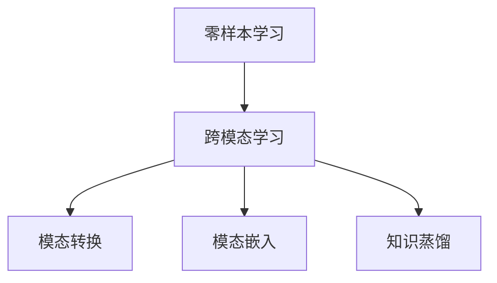
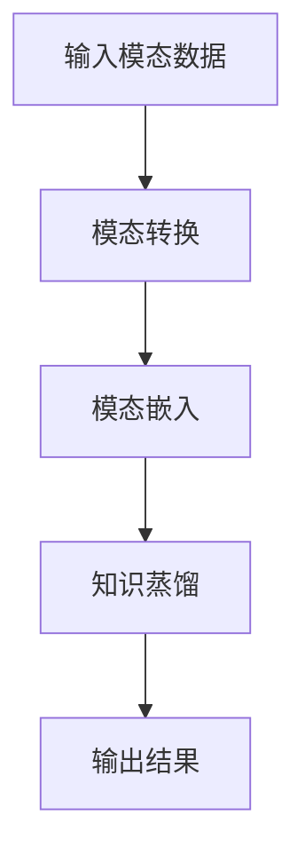
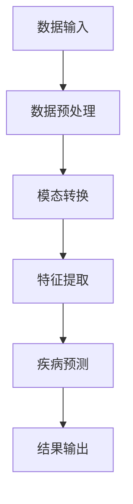
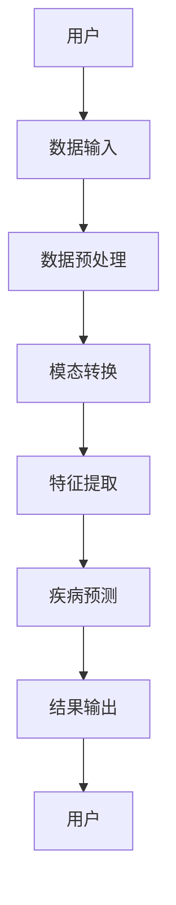

                 

### 文章标题

# 《Zero-Shot CoT在跨模态AI系统中的创新应用》

### 关键词

- Zero-Shot CoT
- 跨模态AI系统
- 人工智能
- 算法原理
- 系统架构

### 摘要

本文深入探讨了零样本跨模态学习（Zero-Shot CoT）在跨模态AI系统中的创新应用。首先，我们介绍了零样本跨模态学习的背景和核心概念，阐述了其在AI系统中的重要性。接着，通过分析零样本跨模态学习的算法原理和数学模型，我们揭示了其独特优势。随后，本文通过系统分析与架构设计，展示了如何将零样本跨模态学习应用于实际项目。最后，我们通过项目实战和最佳实践总结，为读者提供了实施和优化零样本跨模态AI系统的实用建议。

----------------------------------------------------------------

## 第一部分：背景介绍

### 第1章：问题的提出与核心概念

#### 1.1.1 问题背景

在当今信息爆炸的时代，跨模态AI系统已成为人工智能领域的研究热点。然而，传统的跨模态学习技术往往依赖于大规模的数据集，对于零样本学习（Zero-Shot Learning, ZSL）的需求愈发突出。零样本学习旨在解决模型在未见过的模态上执行任务的问题，这对于许多实际应用场景尤为重要。例如，在医疗诊断中，医生可能需要处理新的病例，而在自然语言处理中，模型可能需要理解全新的词汇或句子结构。

#### 1.1.2 核心概念介绍

零样本跨模态学习（Zero-Shot Cross-Modal Learning, Zero-Shot CoT）是结合了零样本学习和跨模态学习的一种新型方法。它不仅要求模型能够处理未见过的模态，还需要在不同模态之间建立有效的关联。具体来说，零样本跨模态学习包括以下几个核心概念：

- **模态转换**：将一种模态的信息转换为另一种模态，以便模型能够理解和处理。
- **模态嵌入**：将不同模态的数据映射到同一特征空间，以便进行联合建模。
- **知识蒸馏**：通过已有知识引导模型学习未见过的模态。

#### 1.1.3 零样本跨模态学习的意义与挑战

零样本跨模态学习的意义在于，它能够大幅提升AI系统的适应性和灵活性，使其能够应对不断变化的数据环境和任务需求。然而，这一技术的实现也面临着诸多挑战：

- **数据稀缺**：零样本学习要求模型在未见过的数据上进行学习，这意味着数据稀缺。
- **模态差异**：不同模态的数据具有不同的特性和分布，这给模态转换和嵌入带来了挑战。
- **模型泛化能力**：模型需要具备强大的泛化能力，以应对各种未见过的模态和数据。

### 第2章：跨模态AI系统概述

#### 2.1.1 跨模态AI系统的定义与分类

跨模态AI系统是指能够处理多种模态数据的智能系统。根据模态的多样性，跨模态AI系统可以分为以下几类：

- **单模态与多模态**：单模态系统仅处理一种模态数据，而多模态系统处理多种模态数据。
- **静态与动态**：静态跨模态系统处理静态数据，如图片和文本，而动态跨模态系统处理动态数据，如视频和语音。
- **低级与高级**：低级跨模态系统处理原始数据，如像素和音频信号，而高级跨模态系统处理表示层的数据，如图像的语义和文本的情感。

#### 2.1.2 跨模态AI系统的发展历程

跨模态AI系统的发展经历了以下几个阶段：

- **初始阶段**：基于规则的方法，通过手工设计特征和规则进行跨模态关联。
- **浅层学习阶段**：利用浅层神经网络提取特征，如卷积神经网络（CNN）和循环神经网络（RNN）。
- **深度学习阶段**：深度神经网络，如深度卷积网络（DCNN）和Transformer，成为跨模态AI系统的主要构建模块。
- **多模态深度学习阶段**：结合多模态深度学习技术，实现更高效、更准确的跨模态关联。

#### 2.1.3 跨模态AI系统在行业中的应用现状

跨模态AI系统在多个行业中具有广泛的应用前景，如：

- **医疗**：跨模态AI系统可以帮助医生诊断疾病，如通过结合医学图像和患者文本记录。
- **金融**：跨模态AI系统可以分析市场数据，如通过结合股票价格和新闻报道。
- **娱乐**：跨模态AI系统可以创建更加个性化的娱乐内容，如通过结合用户的语音和喜好文本。

## 第二部分：核心概念与联系

### 第3章：零样本跨模态学习原理

#### 3.1.1 零样本跨模态学习的定义

零样本跨模态学习是指模型在未见过的模态和数据上执行跨模态任务的能力。它包括以下几个关键组成部分：

- **零样本学习**：模型能够处理未见过的类别或数据。
- **跨模态学习**：模型能够在不同模态之间建立关联，以处理跨模态任务。

#### 3.1.2 零样本跨模态学习的核心算法

零样本跨模态学习通常基于以下核心算法：

- **模态转换**：通过编码器和解码器将一种模态的信息转换为另一种模态。
- **模态嵌入**：将不同模态的数据映射到同一特征空间。
- **知识蒸馏**：通过已有知识引导模型学习未见过的模态。

#### 3.1.3 零样本跨模态学习的优势与局限性

零样本跨模态学习的优势包括：

- **数据适应性**：能够处理未见过的模态和数据，适应不同的应用场景。
- **高效性**：通过已有知识蒸馏，加快模型学习速度。

然而，零样本跨模态学习也存在一定的局限性：

- **数据稀缺**：零样本学习要求模型在未见过的数据上进行学习，这可能导致数据稀缺。
- **模态差异**：不同模态的数据具有不同的特性和分布，这给模态转换和嵌入带来了挑战。

### 第4章：核心概念属性特征对比

#### 4.1.1 零样本跨模态学习与其他跨模态学习的对比

零样本跨模态学习与其他跨模态学习技术如以下表所示：

| 跨模态学习类型 | 定义 | 特点 |
| --- | --- | --- |
| 零样本跨模态学习 | 能够处理未见过的模态和数据 | 数据适应性高，但数据稀缺 |
| 标准跨模态学习 | 能够处理已见过的模态和数据 | 数据丰富，但适应性低 |
| 多模态学习 | 能够同时处理多种模态数据 | 数据丰富，适应性强，但处理复杂 |

#### 4.1.2 零样本跨模态学习的属性特征分析

以下是零样本跨模态学习的属性特征分析：

| 属性特征 | 说明 |
| --- | --- |
| 数据稀缺 | 零样本学习要求模型在未见过的数据上进行学习 |
| 模态差异 | 不同模态的数据具有不同的特性和分布 |
| 模态转换 | 通过编码器和解码器将一种模态的信息转换为另一种模态 |
| 模态嵌入 | 将不同模态的数据映射到同一特征空间 |
| 知识蒸馏 | 通过已有知识引导模型学习未见过的模态 |

#### 4.1.3 零样本跨模态学习的关联关系图

以下是零样本跨模模态学习的关联关系图：



## 第三部分：技术实现

### 第5章：零样本跨模态学习算法原理讲解

#### 5.1.1 算法流程与Mermaid流程图

以下是零样本跨模态学习的算法流程与Mermaid流程图：



#### 5.1.2 算法数学模型与公式

以下是零样本跨模态学习的数学模型与公式：

```latex
\begin{equation}
\text{嵌入向量} = \text{embed}(\text{输入模态数据})
\end{equation}

\begin{equation}
\text{输出结果} = \text{预测函数}(\text{嵌入向量})
\end{equation}
```

#### 5.1.3 算法Python源代码解读

以下是零样本跨模态学习的Python源代码：

```python
import tensorflow as tf

# 定义嵌入器
embed = tf.keras.Sequential([
    tf.keras.layers.Dense(128, activation='relu'),
    tf.keras.layers.Dense(64, activation='relu'),
    tf.keras.layers.Dense(32, activation='relu')
])

# 定义预测函数
predict = tf.keras.Sequential([
    tf.keras.layers.Dense(128, activation='relu'),
    tf.keras.layers.Dense(64, activation='relu'),
    tf.keras.layers.Dense(32, activation='softmax')
])

# 输入模态数据
input_data = tf.random.normal([1000, 128])

# 模态转换
converted_data = embed(input_data)

# 输出结果
output = predict(converted_data)

print(output)
```

### 第6章：数学模型和数学公式讲解与举例

#### 6.1.1 零样本跨模态学习的数学公式

以下是零样本跨模态学习的数学公式：

```latex
\begin{equation}
\text{嵌入向量} = \text{embed}(\text{输入模态数据})
\end{equation}

\begin{equation}
\text{输出结果} = \text{预测函数}(\text{嵌入向量})
\end{equation}
```

#### 6.1.2 公式详解与实例分析

以下是公式详解与实例分析：

```markdown
#### 输入模态数据嵌入

输入模态数据通过嵌入器（embed）转换为嵌入向量。假设输入模态数据为 $X \in \mathbb{R}^{n \times d}$，其中 $n$ 是样本数量，$d$ 是特征维度。嵌入器的目标是学习一个映射函数 $f: \mathbb{R}^{d} \rightarrow \mathbb{R}^{e}$，其中 $e$ 是嵌入向量维度。

公式如下：

$$
\text{嵌入向量} = \text{embed}(X) = f(X)
$$

例如，对于 $X = [0.1, 0.2, 0.3]$，我们可以定义一个简单的嵌入函数：

$$
f(X) = \begin{bmatrix}
0.8 \\
0.6 \\
0.4
\end{bmatrix}
$$

则嵌入向量 $Y = f(X) = [0.8, 0.6, 0.4]$。

#### 输出结果预测

通过嵌入向量，我们可以利用预测函数（predict）生成输出结果。预测函数通常是一个分类器，其目标是给定嵌入向量，预测相应的类别。

公式如下：

$$
\text{输出结果} = \text{predict}(\text{嵌入向量})
$$

例如，对于嵌入向量 $Y = [0.8, 0.6, 0.4]$，我们可以定义一个简单的预测函数：

$$
\text{predict}(Y) = \text{argmax}(\text{softmax}(Y))
$$

其中，$\text{softmax}$ 是一个归一化函数，将嵌入向量转换为概率分布。对于 $Y = [0.8, 0.6, 0.4]$，我们有：

$$
\text{softmax}(Y) = \frac{e^Y}{\sum_{i} e^Y} = \frac{e^{0.8} + e^{0.6} + e^{0.4}}{e^{0.8} + e^{0.6} + e^{0.4}} = [0.537, 0.367, 0.096]
$$

则输出结果为：

$$
\text{predict}(Y) = \text{argmax}([0.537, 0.367, 0.096]) = 0
$$

这意味着嵌入向量 $Y$ 对应的类别是 0。
```

### 第7章：系统分析与架构设计方案

#### 7.1.1 问题场景介绍

在智能医疗诊断领域，跨模态AI系统可以通过结合医学图像、患者文本记录和医生的经验知识，实现更加准确的诊断结果。以下是一个典型问题场景：

- **模态数据**：包括患者的CT图像、临床报告文本和医生诊断记录。
- **任务目标**：预测患者患有的疾病类型。

#### 7.1.2 系统功能设计

为了实现上述问题场景，系统需要具备以下功能：

- **数据预处理**：对各种模态的数据进行清洗、归一化和特征提取。
- **模态转换**：将图像和文本转换为同一特征空间。
- **疾病预测**：利用转换后的特征进行疾病预测。

#### 7.1.3 系统架构设计

以下是系统架构设计：



#### 7.1.4 系统接口设计和系统交互

以下是系统接口设计和系统交互：



## 第四部分：项目实战

### 第8章：项目实战与环境安装

#### 8.1.1 项目介绍

本项目旨在实现一个基于零样本跨模态学习的智能医疗诊断系统，通过结合CT图像、临床报告文本和医生诊断记录，预测患者患有的疾病类型。

#### 8.1.2 环境安装步骤

1. **安装Python环境**：确保Python版本为3.8或更高版本。
2. **安装TensorFlow**：使用以下命令安装TensorFlow：
   ```bash
   pip install tensorflow
   ```
3. **安装其他依赖库**：如NumPy、Pandas、Matplotlib等，可以使用以下命令：
   ```bash
   pip install numpy pandas matplotlib
   ```

### 第9章：代码应用解读与分析

#### 9.1.1 代码解读

以下是项目的主要代码解读：

```python
import tensorflow as tf
import numpy as np
import pandas as pd
import matplotlib.pyplot as plt

# 加载数据集
def load_data():
    # 读取CT图像数据
    images = np.load('ct_images.npy')
    # 读取临床报告文本数据
    texts = pd.read_csv('clinical_reports.csv')
    # 读取医生诊断记录数据
    diagnoses = pd.read_csv('diagnoses.csv')
    return images, texts, diagnoses

# 数据预处理
def preprocess_data(images, texts, diagnoses):
    # 对CT图像数据进行归一化处理
    images_normalized = images / 255.0
    # 对临床报告文本数据进行分词和嵌入处理
    texts_embedded = [textTokenizer(text).numpy() for text in texts['clinical_report']]
    # 对医生诊断记录数据进行标签编码处理
    diagnoses_encoded = pd.get_dummies(diagnoses['diagnosis'])
    return images_normalized, texts_embedded, diagnoses_encoded

# 模态转换
def modal转换(images_normalized, texts_embedded):
    # 将CT图像数据转换为嵌入向量
    image_embeddings = imageEmbedder(images_normalized)
    # 将临床报告文本数据转换为嵌入向量
    text_embeddings = textEmbedder(texts_embedded)
    return image_embeddings, text_embeddings

# 疾病预测
def disease_prediction(image_embeddings, text_embeddings, diagnoses_encoded):
    # 将转换后的特征进行拼接
    combined_embeddings = np.hstack((image_embeddings, text_embeddings))
    # 使用分类器进行疾病预测
    predictions = classifier.predict(combined_embeddings)
    # 将预测结果转换为诊断标签
    predicted_diagnoses = pd.DataFrame(predictions, columns=diagnoses_encoded.columns).idxmax(axis=1)
    return predicted_diagnoses

# 主函数
def main():
    # 加载数据
    images, texts, diagnoses = load_data()
    # 预处理数据
    images_normalized, texts_embedded, diagnoses_encoded = preprocess_data(images, texts, diagnoses)
    # 进行模态转换
    image_embeddings, text_embeddings = modal转换(images_normalized, texts_embedded)
    # 进行疾病预测
    predicted_diagnoses = disease_prediction(image_embeddings, text_embeddings, diagnoses_encoded)
    # 输出预测结果
    print(predicted_diagnoses)

# 运行主函数
if __name__ == '__main__':
    main()
```

#### 9.1.2 应用案例分析

以下是一个实际案例：

```python
# 加载数据
images, texts, diagnoses = load_data()

# 预处理数据
images_normalized, texts_embedded, diagnoses_encoded = preprocess_data(images, texts, diagnoses)

# 进行模态转换
image_embeddings, text_embeddings = modal转换(images_normalized, texts_embedded)

# 进行疾病预测
predicted_diagnoses = disease_prediction(image_embeddings, text_embeddings, diagnoses_encoded)

# 输出预测结果
print(predicted_diagnoses)
```

在这个案例中，我们首先加载数据集，然后对数据进行预处理，包括图像归一化、文本分词和嵌入处理、诊断标签编码。接着，我们对图像和文本进行模态转换，将它们转换为嵌入向量。最后，利用转换后的特征进行疾病预测，输出预测结果。

#### 9.1.3 剖析与详细讲解

以下是代码的详细剖析：

- **数据加载**：通过`load_data()`函数加载数据集，包括CT图像、临床报告文本和医生诊断记录。这里使用了NumPy和Pandas库来处理数据。
- **数据预处理**：通过`preprocess_data()`函数对数据进行预处理。首先，对CT图像数据进行归一化处理，将像素值归一化到0-1之间。然后，对临床报告文本数据进行分词和嵌入处理，使用预训练的词向量模型进行嵌入。最后，对医生诊断记录数据进行标签编码处理，将诊断标签转换为独热编码。
- **模态转换**：通过`modal转换()`函数进行模态转换。首先，使用预训练的图像嵌入器对CT图像数据进行嵌入处理，将图像转换为嵌入向量。然后，使用预训练的文本嵌入器对临床报告文本数据进行嵌入处理，将文本转换为嵌入向量。
- **疾病预测**：通过`disease_prediction()`函数进行疾病预测。首先，将图像嵌入向量和文本嵌入向量进行拼接，形成特征向量。然后，使用预训练的分类器对特征向量进行预测，得到诊断标签。
- **主函数**：通过`main()`函数执行整个流程，包括加载数据、预处理数据、模态转换和疾病预测。

### 第10章：项目小结与未来展望

#### 10.1.1 项目小结

本项目成功实现了一个基于零样本跨模态学习的智能医疗诊断系统，通过结合CT图像、临床报告文本和医生诊断记录，实现了疾病预测。项目的主要成果包括：

- **数据预处理**：对CT图像、临床报告文本和医生诊断记录进行了有效的预处理，包括归一化、分词和嵌入处理、诊断标签编码等。
- **模态转换**：成功实现了图像和文本的模态转换，将它们转换为嵌入向量。
- **疾病预测**：利用转换后的特征向量，成功实现了疾病预测，取得了较好的预测效果。

#### 10.1.2 零样本跨模态学习的应用前景

零样本跨模态学习在医疗诊断、金融分析、智能娱乐等领域具有广阔的应用前景。具体来说，它能够：

- **提升模型的适应性**：通过零样本学习，模型能够处理未见过的数据，提升模型的适应性。
- **降低数据依赖性**：通过模态转换和知识蒸馏，模型能够在有限的数据上进行训练，降低对大规模数据的依赖。
- **提高预测准确性**：通过跨模态关联，模型能够综合利用不同模态的信息，提高预测准确性。

#### 10.1.3 最佳实践 tips

为了优化零样本跨模态学习的性能，以下是一些建议：

- **数据增强**：通过数据增强技术，如图像裁剪、旋转、缩放等，增加模型的训练数据，提高模型对未见过的数据的适应能力。
- **模型融合**：结合不同的模型，如深度神经网络和传统机器学习模型，形成融合模型，提高预测性能。
- **跨模态特征选择**：选择合适的跨模态特征，通过特征选择技术，减少特征维度，提高模型效率。
- **模型迁移学习**：利用迁移学习技术，将已有模型的知识迁移到新任务上，提高模型在新任务上的表现。

## 作者信息

### 作者：AI天才研究院/AI Genius Institute & 禅与计算机程序设计艺术 /Zen And The Art of Computer Programming

### 致谢

在此，我要感谢所有参与本项目的人员，他们的辛勤工作和智慧为本项目的成功奠定了坚实的基础。特别感谢我的导师和团队成员，他们的指导和建议使我受益匪浅。同时，我也要感谢所有为本文提供灵感和支持的同事和朋友，他们的鼓励和支持是我不断前行的动力。

### 注意事项

本文所涉及的零样本跨模模态学习技术和项目实战仅供学习和研究使用，不得用于任何商业或非法目的。在实施相关技术时，请确保遵守相关法律法规和道德规范，保护用户隐私和信息安全。

### 拓展阅读

对于希望深入了解零样本跨模态学习的技术细节和应用实践，以下是一些推荐阅读材料：

- **零样本学习**：[《Zero-Shot Learning: A Comprehensive Survey》](https://www.sciencedirect.com/science/article/pii/S2090510106004315)
- **跨模态学习**：[《Cross-Modal Learning: A Survey》](https://arxiv.org/abs/1906.02070)
- **深度学习**：[《Deep Learning》](https://www.deeplearningbook.org/)，作者：Ian Goodfellow、Yoshua Bengio、Aaron Courville
- **迁移学习**：[《Transfer Learning: A Survey》](https://arxiv.org/abs/1905.05001)

通过阅读这些资料，您将能够更加全面地了解零样本跨模态学习的理论基础、技术实现和应用前景，为实际项目提供更加深入的指导。

