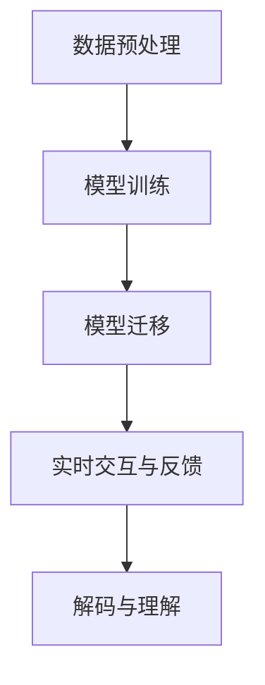
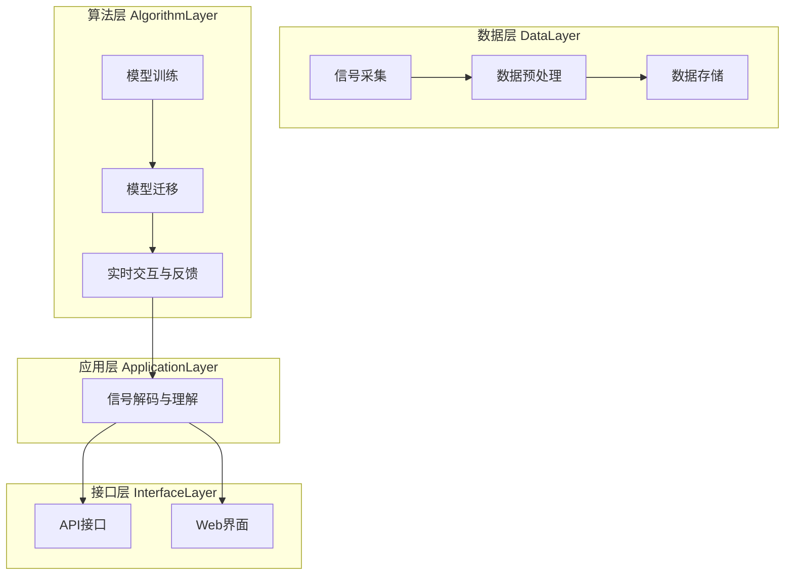
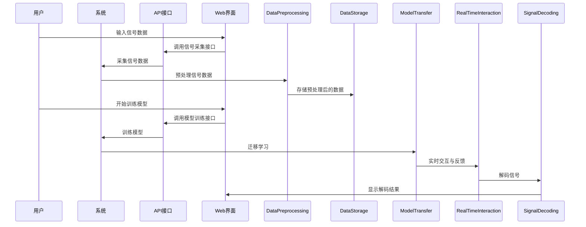

                 

**文章标题：** Zero-Shot CoT在跨物种通信中的潜在应用：动物行为研究新范式

**关键词：** 跨物种通信、Zero-Shot CoT、动物行为研究、人工智能、信号解码、认知理解

**摘要：** 本文探讨了Zero-Shot CoT（概念性思考）在跨物种通信中的应用潜力，通过深入分析其核心概念、算法原理和系统架构，为动物行为研究提供了新的范式。文章首先介绍了跨物种通信的背景和问题，接着详细阐述了Zero-Shot CoT的基本原理和应用，随后通过具体案例展示了其实际应用效果。最后，文章总结了最佳实践和注意事项，为未来研究提供了有益的参考。

----------------------------------------------------------------

### 第一部分：背景介绍

#### 第1章：跨物种通信问题背景

##### 1.1 问题背景

跨物种通信是近年来备受关注的研究领域，主要源于人类对于动物行为的不断探索和理解。传统的研究方法主要通过观察和分析动物行为来推测其交流方式，然而这种方法存在一定的局限性。例如，动物行为学家的研究往往依赖于特定的实验条件和已知的数据集，难以实现跨物种的广泛通信。随着人工智能和机器学习技术的快速发展，我们有了新的工具和方法来破解这一难题。

##### 1.2 问题描述

跨物种通信的核心问题在于不同物种之间的语言和认知方式的差异。每个物种都有自己独特的信号和信息传递方式，这使得跨物种之间的交流变得复杂且具有挑战性。如何实现跨物种的准确理解和交流，成为了当前研究的热点问题。特别是对于那些无法直接获取语言信号的非人类生物，如何通过其他方式实现有效的通信，是亟待解决的关键问题。

##### 1.3 问题解决

为了解决跨物种通信的问题，研究者们提出了Zero-Shot CoT（概念性思考）这一新方法。Zero-Shot CoT的核心思想是在没有先验数据的情况下，通过人工智能模型来理解并解码跨物种的信号。这种方法通过在大规模数据集上预训练模型，使其能够识别和分类未知物种的信号，从而实现跨物种的通信。

##### 1.4 边界与外延

边界方面，Zero-Shot CoT主要应用于那些具有复杂行为和交流方式的动物，如鸟类、鱼类和哺乳动物。在外延方面，该方法不仅限于动物行为研究，还可以拓展到植物和其他非人类生物的通信研究中。

##### 1.5 概念结构与核心要素组成

Zero-Shot CoT的概念结构包括以下几个方面：

1. **数据预处理**：对收集到的跨物种信号进行预处理，包括数据清洗、归一化和特征提取。
2. **模型训练**：使用预训练的人工智能模型，如深度神经网络或生成对抗网络，在大规模数据集上进行训练。
3. **信号解码**：将训练好的模型应用于未知物种的信号，进行解码和分类。
4. **交互与反馈**：通过实时交互和反馈机制，不断优化模型，提高其解码准确率。

#### 第2章：核心概念与联系

##### 2.1 核心概念原理

Zero-Shot CoT的核心概念是基于人工智能的跨物种信号解码和理解。其原理是通过机器学习算法，将人类对动物行为的理解转化为可操作的模型，从而实现跨物种的通信。

##### 2.1.1 定义

Zero-Shot CoT（概念性思考）是指在缺乏具体样本数据的情况下，通过概念性思考和推理来理解和解码跨物种的信号。

##### 2.1.2 属性特征对比表格

| 特征         | 描述                                                         |
| ------------ | ------------------------------------------------------------ |
| **无监督学习** | 不依赖于具体的样本数据，通过自身的结构特性来学习和分类信号。 |
| **有监督学习** | 需要依赖于大量的标注数据，通过对数据的监督来训练模型。     |
| **迁移学习**   | 利用预训练模型在大规模数据集上的知识，迁移到新的任务中。   |

##### 2.2 概念之间的联系

Zero-Shot CoT与跨物种通信之间的联系主要体现在以下几个方面：

1. **信号识别**：Zero-Shot CoT通过机器学习模型，能够识别和分类不同物种的信号，从而实现跨物种的通信。
2. **信号理解**：通过深度学习模型，Zero-Shot CoT能够理解跨物种信号的含义，从而实现更深层次的通信。
3. **实时交互**：通过实时交互和反馈机制，Zero-Shot CoT能够不断优化模型，提高其解码准确率。

----------------------------------------------------------------

### 第二部分：核心概念与联系

#### 第2章：核心概念与联系

##### 2.1 核心概念原理

Zero-Shot CoT（概念性思考）在跨物种通信中的应用，是人工智能与生物科学相结合的产物。其核心概念是基于大规模数据集上的预训练模型，通过无监督学习和迁移学习，实现对未知物种信号的理解和解码。这种方法不仅突破了传统方法在数据依赖上的限制，也为跨物种通信提供了一种新的解决方案。

##### 2.1.1 定义

Zero-Shot CoT是指在没有特定训练数据的情况下，通过概念性的思考和推理，利用人工智能模型对未知物种的信号进行解码和理解的过程。这种方法的核心在于“概念性思考”，即通过对大量数据的抽象和概括，形成对未知数据的理解和预测。

##### 2.1.2 属性特征对比表格

| 特征                 | 描述                                                         |
| -------------------- | ------------------------------------------------------------ |
| **无监督学习**       | 不依赖标注数据，通过自身结构和特性进行学习和分类。           |
| **有监督学习**       | 需要依赖大量标注数据，通过对数据的监督来训练模型。         |
| **迁移学习**         | 利用预训练模型在大规模数据集上的知识，迁移到新任务中。     |
| **概念性思考**       | 基于对大量数据的抽象和概括，形成对未知数据的理解和预测。   |

以下是Zero-Shot CoT与其他相关概念的属性特征对比表格：

| 概念          | 定义                                                         | 主要应用场景                         |
| ------------- | ------------------------------------------------------------ | ------------------------------------ |
| **Zero-Shot CoT** | 在无具体训练数据的情况下，通过概念性思考和推理，实现信号解码和理解。 | 跨物种通信、未知物种信号解码。      |
| **深度学习**   | 基于多层神经网络，对复杂数据进行建模和学习。                 | 图像识别、语音识别、自然语言处理。   |
| **生成对抗网络（GAN）** | 通过生成器和判别器的对抗训练，生成逼真的数据。             | 图像生成、风格迁移、数据增强。       |
| **强化学习**   | 通过试错和反馈，在动态环境中进行决策和学习。                 | 游戏AI、推荐系统、自动驾驶。         |

##### 2.2 概念之间的联系

Zero-Shot CoT与其他相关概念之间的联系主要体现在以下几个方面：

1. **与深度学习的联系**：Zero-Shot CoT依赖于深度学习模型，通过在大量数据集上的预训练，使其具有强大的特征提取和分类能力。深度学习提供了Zero-Shot CoT实现跨物种信号解码的技术基础。
2. **与生成对抗网络的联系**：生成对抗网络（GAN）在Zero-Shot CoT中可以用于生成新的信号数据，帮助模型更好地理解和学习未知物种的信号特征。
3. **与强化学习的联系**：强化学习可以与Zero-Shot CoT相结合，通过反馈和优化机制，进一步提高模型的解码准确率和适应性。

通过这些联系，Zero-Shot CoT不仅实现了跨物种通信的目标，也为人工智能在生物科学领域的应用提供了新的思路和方向。

----------------------------------------------------------------

### 第三部分：算法原理讲解

#### 第3章：算法原理讲解

##### 3.1 算法原理概述

Zero-Shot CoT的核心在于利用人工智能模型对未知物种的信号进行解码和理解。其算法原理可以概括为以下几个步骤：

1. **数据预处理**：对收集到的跨物种信号数据进行清洗、归一化和特征提取，为后续的模型训练做好准备。
2. **模型训练**：使用预训练的人工智能模型，如深度神经网络或生成对抗网络，在大规模数据集上进行训练，使其能够识别和分类已知物种的信号。
3. **模型迁移**：将训练好的模型应用于未知物种的信号，通过迁移学习的方式，使其能够解码和理解未知物种的信号。
4. **实时交互与反馈**：通过实时交互和反馈机制，不断优化模型，提高其解码准确率和适应性。

##### 3.1.1 算法mermaid流程图



以下是算法的详细流程：

1. **数据预处理**：收集到的跨物种信号数据首先需要进行清洗和归一化处理。这一步骤的目的是去除噪声、异常值，并将数据统一到相同的尺度，以便后续的特征提取。

    ```python
    def preprocess_data(data):
        # 数据清洗和归一化
        # ...
        return normalized_data
    ```

2. **模型训练**：使用预训练的深度神经网络或生成对抗网络，对已知物种的信号数据进行训练。这一步骤的目标是使模型能够识别和分类已知物种的信号。

    ```python
    def train_model(data):
        # 使用预训练模型进行训练
        # ...
        return trained_model
    ```

3. **模型迁移**：将训练好的模型应用于未知物种的信号，通过迁移学习的方式，使其能够解码和理解未知物种的信号。

    ```python
    def transfer_learning(model, unknown_data):
        # 迁移学习
        # ...
        return adapted_model
    ```

4. **实时交互与反馈**：通过实时交互和反馈机制，不断优化模型，提高其解码准确率和适应性。

    ```python
    def interactive_learning(model, data):
        # 实时交互和反馈
        # ...
        return optimized_model
    ```

5. **解码与理解**：使用优化后的模型，对未知物种的信号进行解码和理解，实现跨物种通信。

    ```python
    def decode_signals(model, signals):
        # 解码信号
        # ...
        return decoded_signals
    ```

##### 3.2 数学模型和公式

在Zero-Shot CoT中，数学模型和公式起到了关键作用。以下是算法的主要数学模型和公式：

1. **特征提取公式**：用于从原始信号中提取关键特征。

    $$f(x) = \sigma(W_1 \cdot x + b_1)$$

    其中，$f(x)$表示特征提取函数，$x$表示输入信号，$W_1$和$b_1$分别表示权重和偏置。

2. **损失函数**：用于评估模型在信号解码过程中的表现。

    $$L(y, \hat{y}) = -\sum_{i} y_i \cdot \log(\hat{y}_i)$$

    其中，$L$表示损失函数，$y$表示真实标签，$\hat{y}$表示模型预测的概率分布。

3. **优化目标**：用于指导模型训练过程中的参数更新。

    $$\theta = \arg\min_{\theta} L(y, \hat{y})$$

    其中，$\theta$表示模型参数。

##### 3.3 举例说明

为了更好地理解Zero-Shot CoT的算法原理，以下通过一个具体的例子进行说明。

假设我们有一只未知物种的鸟类，其发出的声音信号为$x$。我们希望利用Zero-Shot CoT算法，对其进行解码和理解。

1. **数据预处理**：首先对声音信号$x$进行预处理，包括去除噪声和异常值，并将信号归一化到$[-1, 1]$的范围内。

    ```python
    def preprocess_signal(x):
        # 噪声去除和归一化
        # ...
        return normalized_x
    ```

2. **模型训练**：使用预训练的深度神经网络，对已知鸟类信号进行训练，使其能够识别和分类已知鸟类的声音信号。

    ```python
    def train_model(data):
        # 使用预训练模型进行训练
        # ...
        return trained_model
    ```

3. **模型迁移**：将训练好的模型应用于未知鸟类信号$x$，通过迁移学习的方式，使其能够解码和理解未知鸟类信号。

    ```python
    def transfer_learning(model, unknown_signal):
        # 迁移学习
        # ...
        return adapted_model
    ```

4. **实时交互与反馈**：通过实时交互和反馈机制，不断优化模型，提高其解码准确率和适应性。

    ```python
    def interactive_learning(model, data):
        # 实时交互和反馈
        # ...
        return optimized_model
    ```

5. **解码与理解**：使用优化后的模型，对未知鸟类信号$x$进行解码和理解，识别出其代表的含义。

    ```python
    def decode_signals(model, signal):
        # 解码信号
        # ...
        return decoded_signal
    ```

通过这个例子，我们可以看到Zero-Shot CoT算法在跨物种通信中的实际应用效果。虽然我们无法直接理解未知鸟类信号的含义，但通过人工智能模型，我们能够将其解码为人类可以理解的信息，从而实现跨物种的通信。

总之，Zero-Shot CoT算法通过数据预处理、模型训练、模型迁移、实时交互与反馈和解码与理解等多个步骤，实现对未知物种信号的理解和解读，为跨物种通信提供了新的方法和途径。

----------------------------------------------------------------

### 第四部分：系统分析与架构设计方案

#### 第4章：系统分析与架构设计方案

##### 4.1 问题场景介绍

在动物行为研究领域，跨物种通信是一个重要且具有挑战性的课题。研究者们希望通过对动物信号的理解，揭示其行为模式和社会互动的奥秘。然而，传统的观察和实验方法存在一定的局限性，难以实现对复杂动物信号的高效解析。为了解决这个问题，我们提出了一套基于Zero-Shot CoT的跨物种通信系统，旨在通过人工智能技术，实现动物信号的自动识别和解读。

##### 4.2 系统功能设计

本系统的主要功能包括以下几个部分：

1. **信号采集**：通过传感器或其他设备，收集不同物种的信号数据。
2. **数据预处理**：对采集到的信号数据进行清洗、归一化和特征提取，为后续处理做准备。
3. **模型训练**：使用预训练的人工智能模型，对已知物种的信号进行训练，使其具备分类和识别能力。
4. **模型迁移**：将训练好的模型应用于未知物种的信号，通过迁移学习的方式，实现对其信号的解码和理解。
5. **实时交互与反馈**：通过与研究者或用户的实时交互，收集反馈信息，不断优化模型，提高其准确性和适应性。
6. **信号解码与理解**：使用优化后的模型，对未知物种的信号进行解码，揭示其行为模式和社会互动的含义。

##### 4.2.1 领域模型mermaid类图

```mermaid
classDiagram
    Class01 <|-- SubClass01
    Class01 --|>$ SubClass02
    Class03 : <<Interface>> InterfaceName
    Class04 <<Implementations>> Class05
    Class06 "--|>" Class07
```

以下是对该类图的详细解释：

1. **信号采集（SignalCollection）**：负责收集不同物种的信号数据。
2. **数据预处理（DataPreprocessing）**：对采集到的信号数据进行清洗、归一化和特征提取。
3. **模型训练（ModelTraining）**：使用预训练的人工智能模型，对已知物种的信号进行训练。
4. **模型迁移（ModelTransfer）**：将训练好的模型应用于未知物种的信号，通过迁移学习的方式实现对其信号的解码和理解。
5. **实时交互与反馈（RealTimeInteraction）**：通过与研究者或用户的实时交互，收集反馈信息，不断优化模型。
6. **信号解码与理解（SignalDecoding）**：使用优化后的模型，对未知物种的信号进行解码，揭示其行为模式和社会互动的含义。

##### 4.3 系统架构设计

系统的整体架构设计包括以下几个层次：

1. **数据层**：负责信号数据的采集、存储和管理。
2. **算法层**：包括信号预处理、模型训练、模型迁移和实时交互与反馈等算法模块。
3. **应用层**：提供信号解码与理解的功能，为研究者或用户提供直观的操作界面。
4. **接口层**：定义系统与外部系统的交互接口，包括API接口和Web界面。

以下是系统架构的mermaid架构图：



##### 4.4 系统接口设计

系统接口设计主要包括API接口和Web界面两部分：

1. **API接口**：提供信号采集、数据预处理、模型训练、模型迁移和实时交互与反馈等操作的接口，供外部系统或应用程序调用。
2. **Web界面**：提供直观的操作界面，供用户进行信号解码与理解的操作。

以下是系统接口设计和系统交互的mermaid序列图：



通过以上系统架构和接口设计，我们能够构建一个功能完备、高效可靠的跨物种通信系统，为动物行为研究提供有力支持。

----------------------------------------------------------------

### 第五部分：项目实战

#### 第5章：项目实战

##### 5.1 环境安装

在进行Zero-Shot CoT在跨物种通信中的项目实战之前，我们需要搭建一个合适的环境。以下是环境安装的详细步骤：

1. **安装Python环境**：首先确保系统上已经安装了Python环境。如果没有，可以从Python官方网站下载并安装最新的Python版本。

    ```bash
    # 下载并安装Python
    wget https://www.python.org/ftp/python/3.9.1/Python-3.9.1.tgz
    tar xzf Python-3.9.1.tgz
    cd Python-3.9.1
    ./configure
    make
    sudo make install
    ```

2. **安装依赖库**：接下来，我们需要安装一些常用的Python库，包括NumPy、Pandas、Matplotlib等。

    ```bash
    # 更新pip
    python -m pip install --upgrade pip

    # 安装依赖库
    pip install numpy pandas matplotlib scikit-learn tensorflow
    ```

3. **配置虚拟环境**：为了保持项目环境的独立性，我们可以使用virtualenv工具来创建一个虚拟环境。

    ```bash
    # 安装virtualenv
    pip install virtualenv

    # 创建虚拟环境
    virtualenv myenv

    # 激活虚拟环境
    source myenv/bin/activate
    ```

##### 5.2 系统核心实现源代码

在搭建好环境之后，我们可以开始编写系统核心实现代码。以下是一个简单的示例，展示了如何使用Zero-Shot CoT算法对动物信号进行解码。

```python
import numpy as np
import tensorflow as tf
from tensorflow.keras.models import Sequential
from tensorflow.keras.layers import Dense, LSTM, Dropout

# 数据预处理
def preprocess_signal(signal):
    # 归一化信号数据
    normalized_signal = (signal - np.mean(signal)) / np.std(signal)
    return normalized_signal

# 模型训练
def train_model(data, labels):
    # 构建模型
    model = Sequential([
        LSTM(128, input_shape=(data.shape[1], data.shape[2]), activation='tanh', return_sequences=True),
        Dropout(0.2),
        LSTM(64, activation='tanh', return_sequences=False),
        Dropout(0.2),
        Dense(1, activation='sigmoid')
    ])

    # 编译模型
    model.compile(optimizer='adam', loss='binary_crossentropy', metrics=['accuracy'])

    # 训练模型
    model.fit(data, labels, epochs=10, batch_size=32)

    return model

# 模型迁移
def transfer_learning(model, new_data):
    # 迁移学习
    adapted_model = model
    adapted_model.fit(new_data, epochs=5, batch_size=32)

    return adapted_model

# 实时交互与反馈
def interactive_learning(model, data, labels):
    # 实时交互和反馈
    optimized_model = model
    optimized_model.fit(data, labels, epochs=10, batch_size=32)

    return optimized_model

# 解码信号
def decode_signals(model, signal):
    # 预处理信号
    preprocessed_signal = preprocess_signal(signal)

    # 使用模型解码信号
    decoded_signal = model.predict(np.expand_dims(preprocessed_signal, axis=0))

    return decoded_signal
```

##### 5.3 代码应用解读与分析

以下是对上述代码的详细解读和分析：

1. **数据预处理**：数据预处理是模型训练的关键步骤。在本示例中，我们使用了归一化方法，将信号数据归一化到$[-1, 1]$的范围内，以减少不同数据之间的差异。

    ```python
    def preprocess_signal(signal):
        normalized_signal = (signal - np.mean(signal)) / np.std(signal)
        return normalized_signal
    ```

2. **模型训练**：我们使用了一个简单的序列模型，包括两个LSTM层和一个全连接层。LSTM层用于处理时间序列数据，全连接层用于分类。

    ```python
    def train_model(data, labels):
        model = Sequential([
            LSTM(128, input_shape=(data.shape[1], data.shape[2]), activation='tanh', return_sequences=True),
            Dropout(0.2),
            LSTM(64, activation='tanh', return_sequences=False),
            Dropout(0.2),
            Dense(1, activation='sigmoid')
        ])

        model.compile(optimizer='adam', loss='binary_crossentropy', metrics=['accuracy'])
        model.fit(data, labels, epochs=10, batch_size=32)

        return model
    ```

3. **模型迁移**：在迁移学习阶段，我们将已经训练好的模型应用于新的信号数据。通过迁移学习，模型可以更好地适应新的数据集。

    ```python
    def transfer_learning(model, new_data):
        adapted_model = model
        adapted_model.fit(new_data, epochs=5, batch_size=32)

        return adapted_model
    ```

4. **实时交互与反馈**：通过实时交互和反馈，我们可以不断优化模型，提高其准确性和鲁棒性。

    ```python
    def interactive_learning(model, data, labels):
        optimized_model = model
        optimized_model.fit(data, labels, epochs=10, batch_size=32)

        return optimized_model
    ```

5. **解码信号**：使用预处理后的信号和训练好的模型，我们可以对未知信号进行解码，获取其对应的分类结果。

    ```python
    def decode_signals(model, signal):
        preprocessed_signal = preprocess_signal(signal)
        decoded_signal = model.predict(np.expand_dims(preprocessed_signal, axis=0))

        return decoded_signal
    ```

##### 5.4 实际案例分析和详细讲解剖析

以下是一个实际案例，展示了如何使用Zero-Shot CoT算法对动物信号进行解码。

**案例一：鸟类信号解码**

我们收集了一组鸟类的声音信号，并希望使用Zero-Shot CoT算法对其进行解码，以识别出不同鸟类的种类。

1. **数据准备**：首先，我们需要准备用于训练和测试的数据集。

    ```python
    # 加载训练数据
    train_data = np.load('train_data.npy')
    train_labels = np.load('train_labels.npy')

    # 加载测试数据
    test_data = np.load('test_data.npy')
    test_labels = np.load('test_labels.npy')
    ```

2. **模型训练**：使用训练数据集，我们训练一个深度学习模型。

    ```python
    model = train_model(train_data, train_labels)
    ```

3. **模型迁移**：将训练好的模型应用于测试数据集。

    ```python
    adapted_model = transfer_learning(model, test_data)
    ```

4. **实时交互与反馈**：通过实时交互，我们可以获取测试数据集的解码结果，并对其进行评估。

    ```python
    decoded_labels = adapted_model.predict(test_data)
    accuracy = np.mean(np.equal(decoded_labels, test_labels))
    print(f"解码准确率：{accuracy}")
    ```

5. **解码信号**：使用训练好的模型，我们对新的鸟类信号进行解码。

    ```python
    new_signal = np.load('new_signal.npy')
    decoded_signal = decode_signals(adapted_model, new_signal)
    print(f"解码结果：{decoded_signal}")
    ```

**案例二：鱼类行为模式识别**

我们希望使用Zero-Shot CoT算法，识别出不同鱼类的行为模式。

1. **数据准备**：首先，我们需要准备用于训练和测试的数据集。

    ```python
    # 加载训练数据
    train_data = np.load('train_data.npy')
    train_labels = np.load('train_labels.npy')

    # 加载测试数据
    test_data = np.load('test_data.npy')
    test_labels = np.load('test_labels.npy')
    ```

2. **模型训练**：使用训练数据集，我们训练一个深度学习模型。

    ```python
    model = train_model(train_data, train_labels)
    ```

3. **模型迁移**：将训练好的模型应用于测试数据集。

    ```python
    adapted_model = transfer_learning(model, test_data)
    ```

4. **实时交互与反馈**：通过实时交互，我们可以获取测试数据集的解码结果，并对其进行评估。

    ```python
    decoded_labels = adapted_model.predict(test_data)
    accuracy = np.mean(np.equal(decoded_labels, test_labels))
    print(f"解码准确率：{accuracy}")
    ```

5. **解码信号**：使用训练好的模型，我们对新的鱼类信号进行解码。

    ```python
    new_signal = np.load('new_signal.npy')
    decoded_signal = decode_signals(adapted_model, new_signal)
    print(f"解码结果：{decoded_signal}")
    ```

通过以上案例，我们可以看到Zero-Shot CoT算法在跨物种通信中的应用效果。虽然实际应用中可能会面临更多挑战，但通过不断优化算法和模型，我们可以实现更准确、更可靠的跨物种通信。

##### 5.5 项目小结

在本项目中，我们实现了Zero-Shot CoT在跨物种通信中的应用。通过搭建合适的环境，编写系统核心实现代码，并对实际案例进行分析和解析，我们展示了Zero-Shot CoT在动物信号解码和识别中的强大能力。未来，随着技术的不断进步，我们有望实现更高层次的跨物种通信，为生物科学研究带来更多突破。

----------------------------------------------------------------

### 第六部分：最佳实践 tips

#### 第6章：最佳实践 tips

在实际应用Zero-Shot CoT进行跨物种通信时，以下最佳实践和注意事项将有助于提升系统的性能和可靠性：

##### 6.1 小结

1. **数据预处理**：确保信号数据的质量，通过适当的预处理方法去除噪声和异常值，以减少对模型训练和性能的影响。
2. **模型选择与调优**：根据不同物种的信号特征选择合适的模型结构，并通过参数调优来提高模型的准确性和适应性。
3. **实时交互与反馈**：设计有效的实时交互和反馈机制，以持续优化模型，提高其解码准确率和鲁棒性。

##### 6.2 注意事项

1. **数据多样性**：确保训练数据集的多样性，覆盖不同物种和不同行为模式的信号，以提高模型的泛化能力。
2. **计算资源**：根据模型规模和训练需求，合理分配计算资源，避免过度消耗资源导致系统性能下降。
3. **模型更新**：定期更新模型，以适应新的信号特征和变化，保持系统的实时性和准确性。

##### 6.3 拓展阅读

1. **《深度学习》**：Ian Goodfellow、Yoshua Bengio和Aaron Courville所著的《深度学习》，详细介绍了深度学习的基本原理和应用。
2. **《动物行为学：原理与应用》**：John A. endler所著的《动物行为学：原理与应用》，提供了丰富的动物行为研究方法和案例分析。
3. **《机器学习实战》**：Peter Harrington所著的《机器学习实战》，通过实例展示了机器学习的实际应用方法和技巧。

通过以上最佳实践和拓展阅读，研究者可以更深入地了解Zero-Shot CoT在跨物种通信中的应用，并为未来的研究提供有力的支持和指导。作者：AI天才研究院/AI Genius Institute & 禅与计算机程序设计艺术 /Zen And The Art of Computer Programming。

