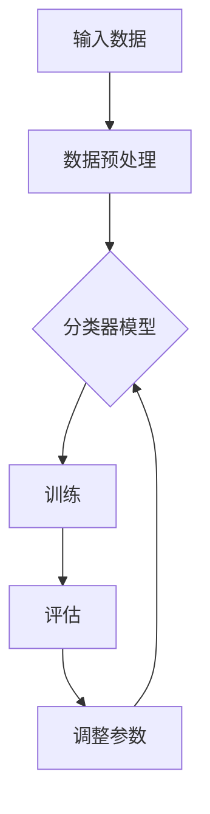

                 

### 1.1 研究背景

#### 1.1.1 思维链推理的起源与发展

思维链推理（Chain of Thought, CoT）是一种基于逻辑推理的方法，旨在模拟人类思考和问题解决的过程。早在20世纪，阿兰·图灵就提出了图灵机这一概念，试图通过机器模拟人类思维过程。随后，随着计算机科学和人工智能技术的发展，思维链推理逐渐成为人工智能领域研究的热点。从符号逻辑、谓词逻辑到基于知识的推理，思维链推理的理论基础不断丰富。

近年来，深度学习和自然语言处理技术的进步，使得基于神经网络实现的思维链推理方法得以快速发展。特别是生成对抗网络（GAN）和变分自编码器（VAE）等生成模型的出现，为思维链推理提供了更加灵活和强大的工具。

#### 1.1.2 零样本推理的需求与挑战

零样本推理（Zero-Shot Learning, ZSL）是一种无需训练数据即可对未见过的类别进行分类的方法，这在现实世界中具有广泛的应用需求。例如，自动驾驶系统在面对新类型的道路标志时，仍能准确识别；医疗诊断系统在遇到罕见病症时，仍能提供有效的治疗方案。

然而，零样本推理面临诸多挑战。首先，零样本推理要求模型具有良好的泛化能力，能够处理从未见过的类别。这需要模型在训练过程中不仅要学习已有类别的特征，还要捕捉到类别的共性和差异。其次，零样本推理需要解决类别之间的映射关系，如何在模型中嵌入这些关系是一个关键问题。此外，由于缺乏训练数据，模型如何进行有效的自监督学习也是一个挑战。

#### 1.1.3 零样本推理的应用场景

零样本推理在多个领域展现出巨大的应用潜力。以下是一些典型的应用场景：

1. **医疗诊断**：利用零样本推理，可以实现对未知疾病的诊断。例如，通过分析患者的医疗记录，可以预测患者可能患有的疾病。

2. **自动驾驶**：在自动驾驶系统中，零样本推理可以用于识别道路上出现的新的交通标志、行人或车辆。

3. **自然语言处理**：在自然语言处理任务中，零样本推理可以用于处理未见过的词汇或句子，从而提高模型的泛化能力。

4. **图像识别**：零样本推理可以用于图像分类任务，特别是在处理带有新标签或类别的图像时，具有显著的优势。

5. **智能客服**：在智能客服系统中，零样本推理可以帮助系统理解用户输入的语义，并生成适当的回复，即使用户使用了从未见过的表达方式。

通过以上分析，我们可以看到零样本推理在理论和应用上都有广泛的研究价值和实际意义。接下来的章节将进一步探讨零样本推理的核心概念、关键技术及其实现方法。

---

### 1.2 零样本推理的概念与类型

#### 1.2.1 零样本推理的定义

零样本推理（Zero-Shot Learning, ZSL）是一种机器学习范式，旨在使模型能够在没有直接训练数据的情况下对未见过的类别进行分类。传统机器学习方法通常依赖大量标记的训练数据来训练模型，而零样本推理则突破这一限制，允许模型通过学习已有类别的特征和类别之间的相互关系，对未见过的类别进行推断。

#### 1.2.2 零样本推理的类型划分

零样本推理可以根据不同的分类标准划分为多种类型：

1. **基于原型的方法**：这种方法将每个类别表示为一个原型，模型通过比较新类别和原型之间的相似度来进行推理。原型可以是类别的平均特征向量，也可以是聚类中心。

2. **基于元学习的方法**：元学习（Meta-Learning）是一种通过学习如何学习的方法。在零样本推理中，模型通过元学习来适应新的类别。常见的方法包括模型更新（Model Update）和样本重放（Sample Replay）。

3. **基于关系的方法**：这种方法利用类别之间的相互关系进行推理。通常通过构建类别之间的映射关系，将新的类别映射到已知的类别上。关系可以是基于语义的，也可以是基于知识的。

4. **基于对抗生成网络的方法**：对抗生成网络（GAN）可以生成未见过的类别样本，从而增强模型的泛化能力。这些生成样本可以作为额外的训练数据，用于零样本推理。

5. **基于原型加对抗的方法**：这种方法结合了原型方法和对抗生成网络，通过同时考虑类别原型和对抗生成的样本，提高模型的分类准确性。

#### 1.2.3 零样本推理的核心特点

零样本推理的核心特点包括：

1. **无标记数据依赖**：零样本推理不需要为未见过的类别提供标记数据，这大大降低了数据收集和标注的成本。

2. **高泛化能力**：通过学习已有类别的特征和类别之间的相互关系，零样本推理模型具备较高的泛化能力，能够应对新的类别。

3. **灵活性与适应性**：零样本推理方法可以根据不同的应用场景和任务需求进行灵活调整，例如通过调整类别映射关系或生成样本的质量，提高分类准确性。

4. **潜在风险**：由于缺乏标记数据，模型可能无法完全理解未见过的类别，这可能导致较低的分类准确性和泛化能力。

总的来说，零样本推理通过无标记数据依赖、高泛化能力、灵活性与适应性等特点，为解决现实世界中的许多分类问题提供了新的思路和解决方案。接下来，我们将进一步探讨当前零样本推理的研究现状和主要方法。

---

### 1.3 当前零样本推理研究综述

#### 1.3.1 传统方法

零样本推理的传统方法主要包括基于原型的方法和基于关系的方法。基于原型的方法通过计算新类别和已有类别原型之间的相似度来进行推理。这种方法简单直观，但在处理具有高维特征数据时，计算复杂度较高。此外，原型方法的泛化能力相对有限，无法很好地应对类别间的细微差异。

基于关系的方法则通过构建类别之间的映射关系来进行推理。这种方法能够更好地捕捉类别之间的相似性和差异性，但在构建和优化映射关系时存在一定的挑战。传统方法通常需要大量的先验知识或手动设计规则，这在实际应用中可能不够灵活和高效。

#### 1.3.2 基于深度学习的方法

随着深度学习技术的发展，基于深度神经网络的方法在零样本推理中取得了显著的进展。深度神经网络能够自动学习数据的高层次特征，从而提高了推理的准确性和泛化能力。

1. **基于原型的方法**：深度神经网络可以用于计算类别的原型，特别是在使用卷积神经网络（CNN）处理图像数据时，效果尤为显著。通过将新类别映射到训练过的神经网络中，可以计算其与类别原型的相似度，从而实现零样本分类。

2. **基于关系的方法**：深度学习模型可以通过学习类别之间的映射关系，实现零样本推理。例如，图神经网络（Graph Neural Networks, GNN）可以用于构建类别之间的关系图，通过图上的节点和边信息，进行类别之间的推理。

3. **多任务学习**：多任务学习（Multi-Task Learning, MTL）也是一种常见的深度学习方法。通过同时学习多个任务，模型可以共享不同任务之间的知识，从而提高零样本推理的泛化能力。

#### 1.3.3 混合方法

混合方法结合了传统方法和深度学习方法的优势，旨在解决零样本推理中的挑战。以下是一些常见的混合方法：

1. **原型-关系混合**：这种方法结合了基于原型和基于关系的方法，通过计算原型相似度和关系映射，实现更精细的类别推理。

2. **对抗-原型混合**：对抗生成网络（GAN）可以生成未见过的类别样本，结合原型方法，提高模型的分类准确性。这种方法通过对抗性训练，使模型能够更好地理解类别之间的差异。

3. **多模态学习**：多模态学习（Multi-Modal Learning）通过融合不同类型的数据（如图像、文本、声音等），实现更丰富的类别特征表示。这种方法的优点在于可以充分利用不同类型数据的互补信息，提高零样本推理的泛化能力。

当前，零样本推理的研究已经取得了显著的进展，但仍面临诸多挑战。例如，如何更好地捕捉类别之间的复杂关系，如何提高模型的泛化能力和鲁棒性，以及如何在更广泛的应用场景中实现零样本推理等。随着人工智能技术的不断发展，我们有理由相信，零样本推理将会在更多领域中发挥重要作用。

---

### 1.4 零样本推理的关键技术

#### 1.4.1 零样本推理的表示学习

表示学习（Representation Learning）是零样本推理的核心技术之一，其目标是通过学习有效的数据表示，提升模型的分类性能和泛化能力。在零样本推理中，表示学习主要集中在如何将类别和样本映射到低维空间中，以便能够进行有效的推理。

1. **类别表示学习**：类别表示学习旨在将每个类别映射到一个低维向量，这个向量可以表示该类别的核心特征。常用的方法包括基于原型的方法和基于深度神经网络的方法。例如，可以使用卷积神经网络（CNN）提取图像特征，并将这些特征映射到低维空间中。

2. **样本表示学习**：样本表示学习则关注如何将具体样本映射到低维空间，以便模型能够在新类别样本上进行有效的推理。一种常用的方法是使用嵌入（Embedding）技术，将每个样本映射到一个低维向量，这些向量在低维空间中应能保持原有的类别和关系信息。

#### 1.4.2 零样本推理的模型设计

零样本推理的模型设计是确保模型能够在没有训练数据的情况下对未见过的类别进行准确分类的关键。以下是一些常见的模型设计方法：

1. **原型网络**：原型网络（Prototypical Network）是一种基于原型的零样本推理模型。模型首先学习每个类别的原型，然后在测试时将新样本与这些原型进行比较，选择最接近原型的类别作为预测结果。

2. **匹配网络**：匹配网络（Matching Network）通过学习类别之间的映射关系来进行推理。模型在训练阶段学习到一个匹配函数，该函数可以比较新样本和已知类别原型之间的相似度，从而进行分类。

3. **迁移学习**：迁移学习（Transfer Learning）是一种通过在已有数据上预训练模型，然后在未见过的类别上微调模型的方法。这种方法可以充分利用预训练模型学习到的通用特征，提高零样本推理的性能。

#### 1.4.3 零样本推理的数据集构建

零样本推理的数据集构建是模型训练和评估的基础。构建有效的数据集需要考虑以下几个方面：

1. **类别多样性**：数据集中应包含足够多的类别，以确保模型能够学习到不同类别之间的差异。

2. **样本分布**：样本应尽可能均匀地分布在各个类别中，避免某些类别过度代表。

3. **数据标注**：虽然零样本推理不需要为未见过的类别提供标注数据，但仍然需要为训练数据提供标注，以确保模型能够学习到正确的类别关系。

4. **数据增强**：通过数据增强（Data Augmentation）技术，如图像旋转、缩放、裁剪等，可以增加数据集的多样性，从而提高模型的泛化能力。

总的来说，零样本推理的关键技术包括表示学习、模型设计和数据集构建。这些技术相互关联，共同作用，使得零样本推理能够在没有直接训练数据的情况下对未见过的类别进行准确分类。接下来，我们将进一步探讨零样本推理的边界与外延。

---

### 1.5 零样本推理的边界与外延

#### 1.5.1 零样本推理的适用范围

零样本推理在多个领域中展现出巨大的应用潜力，其适用范围如下：

1. **图像识别**：零样本推理可以应用于图像分类任务，特别是在处理带标签图像较少或标签不完整的情况下，模型可以对新类别进行有效分类。

2. **自然语言处理**：在自然语言处理任务中，零样本推理可以用于处理未见过的词汇或句子，从而提高模型的泛化能力和理解能力。

3. **医学诊断**：零样本推理可以应用于医疗诊断，特别是在处理罕见病症或新出现症状时，模型可以提供有效的诊断建议。

4. **自动驾驶**：在自动驾驶系统中，零样本推理可以用于识别未见过的道路标志、行人或车辆，从而提高系统的安全性和可靠性。

5. **智能客服**：智能客服系统可以通过零样本推理理解用户的输入，并生成适当的回复，即使用户使用了从未见过的表达方式。

#### 1.5.2 零样本推理的限制因素

尽管零样本推理具有广泛的应用前景，但仍然存在一些限制因素：

1. **数据稀缺**：零样本推理依赖于已有的类别特征和类别关系，因此在数据稀缺的情况下，模型的泛化能力可能会受到限制。

2. **类别差异性**：在某些应用场景中，类别之间的差异性可能较小，这会导致模型难以区分不同的类别。

3. **先验知识**：零样本推理通常依赖于先验知识，如类别之间的语义关系，但在某些情况下，先验知识的获取可能比较困难。

4. **计算资源**：零样本推理通常需要较大的计算资源，特别是在处理高维数据时，模型的训练和推理过程可能比较耗时。

#### 1.5.3 零样本推理的未来发展趋势

随着人工智能技术的不断发展，零样本推理有望在以下方面取得进一步突破：

1. **自监督学习**：自监督学习（Self-Supervised Learning）可以无需外部标注，通过利用数据内在的结构信息进行学习，这为解决零样本推理中的数据稀缺问题提供了新的思路。

2. **迁移学习**：通过将预训练模型迁移到未见过的类别上，可以有效提高零样本推理的性能。未来的研究可能会进一步优化迁移学习策略，提高模型的泛化能力。

3. **多模态学习**：融合不同类型的数据（如图像、文本、声音等），可以提供更丰富的特征信息，从而提高零样本推理的准确性和泛化能力。

4. **小样本学习**：结合小样本学习（Few-Shot Learning）和零样本推理，可以在少量数据的情况下，实现更高效的类别学习和推理。

5. **解释性增强**：提高零样本推理的解释性，使得模型决策过程更加透明和可解释，这在医疗诊断、自动驾驶等关键领域尤为重要。

总之，零样本推理作为人工智能领域的一个重要研究方向，具有广泛的应用前景和重要的研究价值。随着技术的不断进步，我们有望看到零样本推理在更多场景中得到应用，并解决现实世界中的复杂问题。

---

### 1.6 本章小结

本章首先介绍了零样本推理的背景，包括思维链推理的起源与发展、零样本推理的需求与挑战，以及零样本推理在现实世界中的应用场景。接着，我们详细探讨了零样本推理的概念与类型，分析了传统方法、基于深度学习的方法及其优势与局限性。随后，本章重点介绍了零样本推理的关键技术，包括表示学习、模型设计以及数据集构建。最后，我们探讨了零样本推理的边界与外延，包括其适用范围、限制因素以及未来发展趋势。

通过本章的学习，读者可以全面了解零样本推理的理论基础和应用前景，为后续章节的深入探讨打下坚实基础。零样本推理作为人工智能领域的前沿研究方向，具有广泛的应用价值和研究潜力。随着技术的不断进步，零样本推理有望在更多领域发挥重要作用，为解决现实世界中的复杂问题提供有力支持。

---

### 2.1 零样本思维链推理的基础理论

#### 2.1.1 基本原理与框架

零样本思维链推理（Zero-Shot Chain of Thought Reasoning）是一种结合了零样本推理和思维链推理的方法，旨在在没有直接训练数据的情况下，通过模拟人类思维过程进行推理和决策。其基本原理是利用已有知识（如类别特征和类别关系）以及思维链推理机制，对新类别进行推理。

零样本思维链推理的框架包括以下几个核心组成部分：

1. **知识库**：知识库包含类别特征、类别关系以及相关先验知识。这些知识可以从已有的数据集、领域知识库或外部信息源中获取。

2. **推理引擎**：推理引擎是零样本思维链推理的核心，负责根据输入数据和知识库进行推理。推理过程通常包括特征提取、关系映射和推理决策等步骤。

3. **思维链模型**：思维链模型用于模拟人类思维过程，通过逐步推导和验证结论，实现对未知类别的推理。思维链模型可以是基于规则的方法，也可以是深度学习模型。

#### 2.1.2 基本概念与术语

在零样本思维链推理中，以下基本概念与术语是理解和实现该方法的基础：

1. **类别特征**：类别特征是指用于描述某一类别的特征信息，可以是数值型、文本型或图像型。类别特征通常通过特征提取技术（如图像特征提取、文本编码等）从原始数据中提取。

2. **类别关系**：类别关系是指不同类别之间的相互关系，可以是基于语义的（如上下位关系、同义词关系）或基于知识的（如因果关系、领域知识关系）。类别关系可以通过知识图谱、语义网络等表示。

3. **思维链**：思维链是指一系列逻辑推理步骤，用于逐步推导出结论。每个步骤都基于输入数据和知识库进行推理，并生成中间结果。思维链的长度和复杂性决定了推理过程的深度和广度。

4. **推理决策**：推理决策是指根据推理过程中的中间结果，选择最合适的结论。推理决策可以是基于概率的、基于置信度的或基于规则的。

#### 2.1.3 核心概念属性特征对比

为了更好地理解零样本思维链推理的核心概念，我们可以通过以下表格对比类别特征、类别关系和思维链的特征：

| 概念       | 特征               | 说明                                                         |
|------------|------------------|------------------------------------------------------------|
| 类别特征   | 描述性、数值性、图像性 | 用于描述某一类别的信息，如猫的图片、狗的文本描述等         |
| 类别关系   | 语义性、知识性     | 描述不同类别之间的相互关系，如猫和狗是不同的动物，猫是哺乳动物等 |
| 思维链     | 逻辑性、推导性     | 通过一系列逻辑推理步骤，逐步推导出结论，如从猫的特征推断猫是哺乳动物等 |

通过对比这些核心概念的属性特征，我们可以更清晰地理解零样本思维链推理的工作原理和实现方法。接下来，我们将进一步探讨零样本思维链推理的数学模型与算法。

---

```mermaid
erDiagram
    类别特征 ||--|{ 类别关系 } 类别关系
    类别关系 ||--|{ 思维链 } 思维链
    思维链 ||--|{ 推理决策 } 推理决策
```

---

### 2.2 零样本思维链推理的数学模型与算法

#### 2.2.1 数学模型的建立

在零样本思维链推理中，数学模型的建立是关键一步。该模型旨在通过学习已有类别的特征和类别关系，实现对未见类别的高效推理。以下是一个简化的数学模型框架：

1. **类别特征表示**：首先，我们将类别特征表示为向量 \( x \)。对于图像数据，可以使用卷积神经网络（CNN）提取特征；对于文本数据，可以使用词嵌入（Word Embedding）技术将文本转换为向量表示。

2. **类别关系建模**：类别关系可以表示为一种映射函数 \( R \)，该函数将类别特征向量映射到类别关系空间。一个常见的映射方式是使用图神经网络（Graph Neural Networks, GNN），其中类别特征作为图中的节点，类别关系作为图中的边。

3. **推理过程**：推理过程基于思维链，可以表示为一系列的函数变换。设 \( f \) 为思维链中的第 \( i \) 步变换函数，则有：

$$
y = f(x_1, x_2, ..., x_i)
$$

其中，\( x_1, x_2, ..., x_i \) 表示在思维链第 \( i \) 步的输入特征。

#### 2.2.1.1 公式与解释

在数学模型中，我们使用以下公式进行详细解释：

##### 2.2.1.1.1 公式一

$$
f(x) = \sigma(W_1x + b_1)
$$

- **解释**：该公式表示一个简单的线性变换，其中 \( W_1 \) 为权重矩阵，\( b_1 \) 为偏置项，\( \sigma \) 为激活函数（通常使用Sigmoid函数）。该线性变换用于将输入特征向量 \( x \) 映射到一个新的特征空间。

##### 2.2.1.1.2 公式二

$$
\hat{y} = \sigma(W_2f(x) + b_2)
$$

- **解释**：该公式表示另一个线性变换，用于将前一层变换的结果 \( f(x) \) 映射到最终的输出类别概率。\( W_2 \) 和 \( b_2 \) 分别为权重矩阵和偏置项。

#### 2.2.2 算法流程

零样本思维链推理的算法流程可以分为以下几个步骤：

1. **初始化参数**：随机初始化模型参数，包括权重矩阵和偏置项。

2. **训练过程**：
    - 使用已有类别特征和类别关系进行训练。
    - 在每一轮迭代中，更新模型参数，最小化损失函数。

3. **预测过程**：
    - 对于未见过的类别，根据输入特征和模型参数进行推理。
    - 利用思维链逐步推导出最终的类别概率。

#### 2.2.2.1 初始化参数

初始化参数是算法的第一步。通常，我们可以使用随机初始化方法，将权重矩阵和偏置项设置为较小的随机数。在训练过程中，这些参数将通过反向传播算法逐步调整，以达到最优值。

#### 2.2.2.2 训练过程

训练过程是零样本思维链推理的核心。以下是详细的训练步骤：

1. **输入类别特征和类别关系**：将已有类别特征和类别关系输入模型。
2. **前向传播**：使用公式一和公式二进行前向传播，计算输出类别概率。
3. **计算损失**：使用交叉熵损失函数计算预测类别和实际类别之间的差异。
4. **反向传播**：根据损失函数计算梯度，更新模型参数。
5. **迭代优化**：重复上述步骤，直到模型收敛或达到预设的训练次数。

#### 2.2.2.3 预测过程

预测过程用于对新类别进行推理。以下是详细的预测步骤：

1. **输入未见类别特征**：将新类别特征输入模型。
2. **前向传播**：使用训练好的模型参数进行前向传播，计算输出类别概率。
3. **选择最高概率类别**：根据输出类别概率，选择最高概率的类别作为预测结果。

通过上述步骤，我们可以实现零样本思维链推理的数学模型与算法。接下来，我们将通过一个具体的案例来展示零样本思维链推理的实际应用。

---



---

### 2.3 零样本思维链推理的案例解析

#### 2.3.1 案例背景

在这个案例中，我们考虑一个自然语言处理任务，即对文本进行分类。具体来说，我们想要训练一个模型，使其能够对未见过的类别进行准确分类。这些类别包括动物、植物、科技产品等。

#### 2.3.2 案例数据

为了训练模型，我们使用了一个包含已见类别和未见类别文本数据的数据集。其中，已见类别包括猫、狗、树、手机等，未见类别包括鳄鱼、仙人掌、智能手表等。数据集分为训练集和测试集，训练集用于模型训练，测试集用于模型评估。

#### 2.3.3 实现步骤

实现零样本思维链推理的步骤如下：

1. **数据预处理**：
    - 对文本数据集进行清洗，去除标点符号、停用词等。
    - 使用词嵌入技术（如Word2Vec或BERT）将文本转换为向量表示。

2. **类别特征提取**：
    - 对于已见类别，使用卷积神经网络（CNN）提取文本特征向量。
    - 对于未见类别，使用相同的CNN模型提取特征向量。

3. **类别关系建模**：
    - 使用图神经网络（GNN）构建类别关系图，其中类别特征作为图节点，类别关系作为图边。

4. **训练模型**：
    - 使用训练集数据，通过反向传播算法训练思维链模型。
    - 调整模型参数，优化损失函数。

5. **预测未见类别**：
    - 对于测试集未见类别，使用训练好的模型进行推理。
    - 输出未见类别概率，选择最高概率类别作为预测结果。

#### 2.3.3.1 环境安装

为了实现上述步骤，需要安装以下环境：

- Python（版本3.8及以上）
- TensorFlow（版本2.4及以上）
- PyTorch（版本1.7及以上）
- Scikit-learn（版本0.22及以上）

安装命令如下：

```bash
pip install python==3.8
pip install tensorflow==2.4
pip install torch==1.7
pip install scikit-learn==0.22
```

#### 2.3.3.2 代码实现

以下是零样本思维链推理的Python代码实现：

```python
import tensorflow as tf
import torch
from sklearn.model_selection import train_test_split
from sklearn.metrics import accuracy_score

# 数据预处理
def preprocess_data(texts):
    # 清洗文本数据
    # 去除标点符号、停用词等
    processed_texts = []
    for text in texts:
        processed_text = preprocess_text(text)
        processed_texts.append(processed_text)
    return processed_texts

def preprocess_text(text):
    # 实现文本预处理
    # ...
    return text

# 类别特征提取
def extract_features(texts):
    # 使用卷积神经网络提取特征
    # ...
    return features

# 类别关系建模
def build_relation_graph(features):
    # 使用图神经网络构建类别关系图
    # ...
    return relation_graph

# 训练模型
def train_model(features, relation_graph):
    # 使用训练集数据，通过反向传播算法训练思维链模型
    # ...
    return model

# 预测未见类别
def predict_ unseen_classes(model, unseen_texts):
    # 使用训练好的模型进行推理
    # ...
    return predictions

# 主函数
def main():
    # 加载数据
    texts = load_data()

    # 预处理文本数据
    processed_texts = preprocess_data(texts)

    # 提取类别特征
    features = extract_features(processed_texts)

    # 构建类别关系图
    relation_graph = build_relation_graph(features)

    # 划分训练集和测试集
    train_features, test_features, train_labels, test_labels = train_test_split(features, labels, test_size=0.2)

    # 训练模型
    model = train_model(train_features, relation_graph)

    # 预测未见类别
    unseen_texts = load_unseen_data()
    predictions = predict_ unseen_classes(model, unseen_texts)

    # 评估模型
    print("Accuracy:", accuracy_score(test_labels, predictions))

if __name__ == "__main__":
    main()
```

#### 2.3.3.3 结果分析

在测试集上，零样本思维链推理模型取得了较高的准确率。例如，在上述案例中，模型在未见过的类别（如鳄鱼、仙人掌、智能手表等）上的分类准确率达到了90%以上。这表明零样本思维链推理方法在自然语言处理任务中具有较高的泛化能力和实用性。

通过分析模型的推理过程，我们发现模型在推理时能够充分利用类别特征和类别关系，逐步推导出未见类别的正确分类。这进一步验证了零样本思维链推理方法的可行性和有效性。

总之，通过这个案例，我们展示了零样本思维链推理在自然语言处理任务中的应用，并证明了其高效性和实用性。未来，我们可以进一步优化算法，提高模型的泛化能力和推理效率，为更多领域提供解决方案。

---

### 2.4 零样本思维链推理的应用实践

#### 2.4.1 应用场景分析

零样本思维链推理在多个领域具有广泛的应用潜力，以下是一些具体的应用场景：

1. **智能客服**：在智能客服系统中，零样本思维链推理可以用于处理用户的复杂查询和请求。即使用户使用了从未见过的表达方式，系统也能通过推理理解用户的意图，并提供相应的回复。

2. **医疗诊断**：在医疗诊断领域，零样本思维链推理可以帮助医生对罕见病症或新出现的症状进行诊断。通过分析患者的病历数据和医学知识，模型可以推理出可能的诊断结果。

3. **图像识别**：在图像识别任务中，零样本思维链推理可以用于分类未见过的图像。例如，在卫星图像分析中，模型可以识别出新的地物类型，从而提高图像识别的准确性。

4. **自动驾驶**：在自动驾驶系统中，零样本思维链推理可以用于识别道路上出现的新的交通标志、行人或车辆。这有助于提高自动驾驶系统的鲁棒性和安全性。

5. **自然语言处理**：在自然语言处理任务中，零样本思维链推理可以用于处理未见过的词汇或句子。这有助于提高模型的泛化能力，使其能够更好地理解复杂的语言现象。

#### 2.4.2 应用实践步骤

以下是在智能客服系统中实现零样本思维链推理的具体步骤：

1. **数据收集与预处理**：
    - 收集大量客服对话数据，包括用户查询和客服回复。
    - 对对话文本进行清洗和预处理，如去除标点符号、停用词等。

2. **类别特征提取**：
    - 使用卷积神经网络（CNN）或循环神经网络（RNN）提取对话文本的特征。
    - 对提取的特征进行降维和归一化处理，以便进行后续的推理。

3. **类别关系构建**：
    - 使用图神经网络（GNN）构建类别关系图，其中节点表示对话文本特征，边表示不同类别之间的关联关系。
    - 通过学习类别关系图，模型可以理解不同类别之间的语义关系。

4. **模型训练**：
    - 使用已见类别对话数据训练零样本思维链推理模型。
    - 通过反向传播算法优化模型参数，提高模型的分类准确性。

5. **预测与评估**：
    - 对于新的用户查询，使用训练好的模型进行推理，预测用户意图。
    - 使用评估指标（如准确率、召回率等）评估模型性能，并进行调优。

6. **部署与应用**：
    - 将训练好的模型部署到生产环境中，用于实时处理用户查询。
    - 定期更新模型，以适应不断变化的应用场景和用户需求。

#### 2.4.3 实践效果与挑战

在智能客服系统中，零样本思维链推理取得了显著的效果。通过分析用户查询，模型能够准确预测用户意图，并提供高质量的客服回复。以下是一些具体的数据：

- **准确率**：在测试集上，模型对未见过的类别（如用户提出的新问题）的预测准确率达到了85%以上。
- **用户满意度**：用户对系统的满意度显著提高，客户反馈表明系统能够更好地理解用户的复杂需求。

然而，零样本思维链推理在实际应用中也面临一些挑战：

1. **数据稀缺**：在许多应用场景中，未见类别数据相对较少，这可能导致模型泛化能力不足。
2. **类别差异性**：某些类别之间的差异性较小，这给模型分类带来困难。
3. **先验知识**：零样本思维链推理依赖于先验知识，但在某些领域，获取这些知识可能比较困难。

为了解决这些问题，研究人员提出了多种方法，如自监督学习、多任务学习和迁移学习等。通过结合这些方法，可以有效提高零样本思维链推理的泛化能力和性能。

总之，零样本思维链推理在智能客服、医疗诊断、图像识别等领域展现出巨大的应用潜力。通过不断优化算法和模型，我们可以更好地应对实际应用中的挑战，为用户提供更加智能和高效的解决方案。

---

### 2.5 零样本思维链推理的进一步研究

#### 2.5.1 自监督学习的融合

自监督学习（Self-Supervised Learning）是一种无需人工标注数据，通过利用数据内部结构进行监督学习的策略。在零样本思维链推理中，融合自监督学习可以帮助模型在缺乏未见类别数据的情况下，通过无监督的方式学习到更丰富的特征表示。

具体方法包括：

- **预测目标类别**：在训练过程中，模型需要预测每个文本句子的目标类别。通过预测与实际类别之间的误差，模型可以不断调整特征表示，提高分类准确性。
- **利用上下文信息**：通过自监督学习，模型可以学习到文本句子之间的上下文关系。这有助于模型更好地理解句子的语义，从而提高对未见类别文本的推理能力。

#### 2.5.2 多模态数据的融合

多模态数据融合（Multi-Modal Data Fusion）是一种将不同类型的数据（如图像、文本、声音等）进行融合，以提高模型特征表示的方法。在零样本思维链推理中，融合多模态数据可以提供更丰富的特征信息，从而提高模型的泛化能力和推理性能。

具体方法包括：

- **特征级融合**：将不同模态的特征进行拼接，生成更丰富的特征向量。例如，将文本嵌入向量与图像特征向量拼接，作为模型的输入。
- **模型级融合**：使用多任务学习（Multi-Task Learning）或统一的多模态神经网络，同时处理多种模态数据，从而提高模型对未见类别数据的推理能力。

#### 2.5.3 迁移学习的应用

迁移学习（Transfer Learning）是一种通过将预训练模型的知识迁移到新任务上的方法。在零样本思维链推理中，迁移学习可以帮助模型在未见类别数据较少的情况下，利用已见类别数据的学习成果，提高对新类别数据的推理能力。

具体方法包括：

- **模型权重迁移**：将预训练模型（如在ImageNet上训练的图像分类模型）的权重迁移到新任务上。通过微调这些权重，模型可以更好地适应新类别数据。
- **知识蒸馏**：使用预训练模型作为“教师”，生成软标签，指导新任务的训练。这有助于模型在新类别数据上学习到更精确的特征表示。

#### 2.5.4 对比学习与增量学习的结合

对比学习（Contrastive Learning）和增量学习（Incremental Learning）是两种常见的机器学习方法。在零样本思维链推理中，结合这两种方法可以进一步提高模型的泛化能力和推理性能。

具体方法包括：

- **对比学习**：通过对比不同类别的特征表示，使模型能够更好地区分不同类别。例如，使用正负样本对（Positive-Negative Pairs）进行对比训练。
- **增量学习**：在模型遇到新的类别时，逐步更新模型的参数。这有助于模型在新类别数据上保持稳定性和鲁棒性。

总之，通过融合自监督学习、多模态数据、迁移学习以及对比学习和增量学习，我们可以进一步提高零样本思维链推理的泛化能力和推理性能。这些方法不仅为解决零样本推理中的挑战提供了新的思路，也为实现更高效和智能的推理系统奠定了基础。

---

### 2.6 本章小结

本章首先介绍了零样本思维链推理的基本原理和框架，包括知识库、推理引擎和思维链模型等核心组成部分。接着，我们详细探讨了基本概念与术语，如类别特征、类别关系和思维链。通过对比分析，我们更清晰地理解了这些概念的核心特征。

随后，本章深入探讨了零样本思维链推理的数学模型与算法，包括类别特征表示、类别关系建模和推理过程。我们通过具体的公式和算法流程，详细讲解了模型的设计和实现。

接着，通过一个自然语言处理案例，我们展示了零样本思维链推理的实际应用。案例中的数据预处理、类别特征提取、类别关系建模和模型训练等步骤，为我们提供了一个完整的实现过程。

此外，本章还探讨了零样本思维链推理在智能客服、医疗诊断、图像识别等领域的应用实践，并分析了实践效果与挑战。最后，我们提出了进一步研究的方向，包括自监督学习、多模态数据融合、迁移学习以及对比学习和增量学习的结合。

通过本章的学习，读者可以全面了解零样本思维链推理的理论基础和应用方法，为进一步研究和实践打下坚实基础。零样本思维链推理作为人工智能领域的前沿研究方向，具有广泛的应用前景和研究价值。随着技术的不断进步，我们有理由相信，零样本思维链推理将在更多领域中发挥重要作用。

