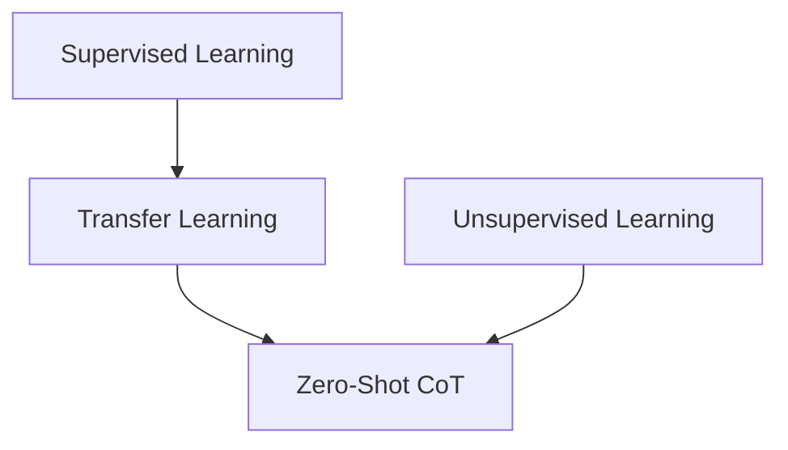
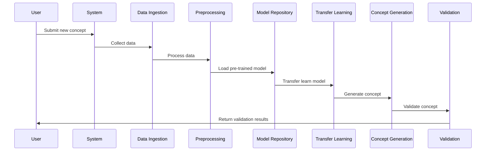

                 


### Introduction to Zero-Shot CoT and Unsupervised Learning

**Key Concepts and Terminology**

**Zero-Shot CoT (Conceptual Transfer):** Zero-Shot CoT, or Zero-Shot Conceptual Transfer, is a paradigm in unsupervised learning where a model is capable of understanding and generating concepts without being explicitly trained on labeled data for those concepts. It leverages transfer learning principles to adapt a pre-trained model to new, unseen concepts.

**Unsupervised Learning:** Unsupervised learning is a type of machine learning where the algorithm learns patterns and structures in data without any labeled responses. The goal is to find insights and relationships within the data, often using clustering, dimensionality reduction, or generative models.

**Problem Background and Description:**

The traditional approach to machine learning heavily relies on supervised learning, where models are trained on labeled datasets. However, this approach is often limited by the availability and quality of labeled data. Unsupervised learning offers a solution by allowing models to learn from unlabeled data, but it has its own set of challenges. Zero-Shot CoT aims to address some of these limitations by enabling models to generalize to new concepts without explicit training.

**Problem Solution:**

Zero-Shot CoT achieves this by using a two-step process:

1. **Pre-training:** A model is pre-trained on a large corpus of unlabeled data, learning to represent concepts in a meaningful way.
2. **Transfer Learning:** The pre-trained model is then fine-tuned to new, unseen concepts by adjusting the output layer to match the new concept space.

**Boundaries and Extensions:**

- **Boundary:** Zero-Shot CoT is designed for scenarios where labeled data is scarce or expensive to obtain. It is not a panacea and may not perform well in cases where the concept boundaries are not well-defined.
- **Extensions:** Research in Zero-Shot CoT can explore applications in areas such as natural language processing, computer vision, and healthcare, where understanding and generating new concepts is crucial.

**Concept Structure and Core Elements:**

- **Data Representation:** Models learn to represent data in a high-dimensional space where similar concepts are close to each other.
- **Conceptual Embeddings:** Embeddings of concepts capture their semantic meaning and relationships.
- **Transfer Mechanism:** Mechanisms for transferring knowledge from pre-trained models to new concepts.

**Table of Attributes Comparison:**

| Attribute | Definition | Importance |
| --- | --- | --- |
| Data Representation | The way data is structured and organized by the model. | Essential for meaningful concept embeddings. |
| Conceptual Embeddings | Vector representations of concepts in a semantic space. | Allow for meaningful comparison and generation. |
| Transfer Mechanism | The process of adapting a pre-trained model to new concepts. | Enables generalization without explicit training. |

**Entity Relationship (ER) Diagram:**

```mermaid
erDiagram
  Model ||--|{ Data Representation }
  Model ||--|{ Conceptual Embeddings }
  Model ||--|{ Transfer Mechanism }
```

### Background and Core Concepts

#### Historical Context of Machine Learning and Unsupervised Learning

Machine learning, as a field, has evolved significantly over the past few decades. The initial focus was primarily on supervised learning, where algorithms were trained on labeled datasets to predict outcomes. However, as the complexity of datasets increased and the need for more robust models arose, the field began to explore unsupervised learning.

Unsupervised learning gained prominence in the late 1980s and early 1990s, driven by the need to find hidden patterns and structures within large, unlabeled datasets. Early approaches included clustering algorithms like K-means and hierarchical clustering, which aimed to group similar data points together based on their inherent characteristics.

The concept of transfer learning, which underpins Zero-Shot CoT, has its roots in the 1990s. Transfer learning involves leveraging knowledge gained from one task to improve the learning of another related task. This approach was initially explored in the context of neural networks and was formalized in models like the Multitask Neural Network, which shared hidden layers across different tasks.

#### Fundamental Concepts in Unsupervised Learning

Several key concepts are fundamental to unsupervised learning:

- **Clustering:** Clustering algorithms group data points into clusters based on their similarities. K-means is one of the most widely used clustering algorithms.
- **Dimensionality Reduction:** Dimensionality reduction techniques like Principal Component Analysis (PCA) and t-Distributed Stochastic Neighbor Embedding (t-SNE) aim to reduce the number of features in a dataset while retaining important information.
- **Generative Models:** Generative models like Generative Adversarial Networks (GANs) and Variational Autoencoders (VAEs) are designed to generate new data instances that resemble the training data.

#### Relationship Between Zero-Shot CoT and Other Machine Learning Paradigms

Zero-Shot CoT can be seen as an extension of both unsupervised learning and transfer learning. While unsupervised learning focuses on finding patterns in unlabeled data, Zero-Shot CoT specifically addresses the challenge of generalizing to new, unseen concepts.

In comparison to supervised learning, Zero-Shot CoT eliminates the need for labeled data, making it particularly useful in scenarios where obtaining labeled data is difficult or costly. It shares similarities with transfer learning in that it leverages pre-trained models to adapt to new tasks.

The relationship can be visualized as follows:



- **Supervised Learning:** The foundation that provides labeled data for training.
- **Transfer Learning:** Bridges the gap between labeled and unlabeled data.
- **Zero-Shot CoT:** Extends transfer learning to handle new, unseen concepts.

#### Key Advantages of Zero-Shot CoT

- **Scalability:** Zero-Shot CoT can scale to large datasets without the need for extensive labeled data.
- **Generalization:** It allows models to generalize to new concepts that were not seen during training.
- **Flexibility:** The ability to adapt to various domains and tasks makes it a versatile paradigm.

In conclusion, Zero-Shot CoT builds upon the historical foundations of machine learning, particularly unsupervised and transfer learning, to offer a powerful new paradigm for understanding and generating new concepts in an unsupervised setting.

### Principles of Zero-Shot CoT

#### Basic Theory Behind Zero-Shot CoT

Zero-Shot CoT (Conceptual Transfer) is a groundbreaking paradigm in the field of unsupervised learning that addresses the limitations of traditional machine learning approaches. At its core, Zero-Shot CoT leverages the principles of transfer learning and unsupervised learning to enable models to understand and generate new concepts without being explicitly trained on labeled data for those concepts.

The basic theory behind Zero-Shot CoT revolves around two key steps:

1. **Pre-training:** In this initial phase, a model is trained on a large corpus of unlabeled data. During pre-training, the model learns to encode the data in a high-dimensional feature space where similar concepts are close to each other. This step is crucial as it allows the model to learn the underlying structure and relationships within the data.

2. **Transfer Learning:** Once the model is pre-trained, it is then fine-tuned to new, unseen concepts. This fine-tuning involves adjusting the output layer of the model to match the concept space of the new task. By doing so, the model is able to generalize from the pre-trained knowledge to the new concepts, thereby enabling zero-shot learning.

#### Key Features and Advantages of Zero-Shot CoT

Zero-Shot CoT offers several unique features and advantages compared to traditional machine learning approaches:

1. **Zero Dependency on Labeled Data:** The most significant advantage of Zero-Shot CoT is its ability to operate without the need for labeled data. This makes it highly scalable and applicable in scenarios where obtaining labeled data is challenging or expensive.

2. **Generalization to Unseen Concepts:** Zero-Shot CoT allows models to generalize to new, unseen concepts. This is achieved by leveraging the pre-trained knowledge from the initial phase, enabling the model to adapt to a wide range of tasks without the need for retraining.

3. **Flexibility:** The flexibility of Zero-Shot CoT makes it suitable for various domains and tasks. Whether it’s natural language processing, computer vision, or healthcare, Zero-Shot CoT can be applied to generate new concepts and insights.

4. **Scalability:** Due to its zero dependency on labeled data, Zero-Shot CoT can scale to large datasets efficiently. This makes it particularly useful for handling big data applications.

#### How Zero-Shot CoT Differs from Traditional Machine Learning Approaches

Traditional machine learning approaches, particularly supervised learning, heavily rely on labeled data for training. In contrast, Zero-Shot CoT eliminates the need for labeled data, making it a more robust and scalable solution. Here are the key differences:

1. **Data Dependency:** Supervised learning requires labeled data, which can be time-consuming and costly to obtain. Zero-Shot CoT, on the other hand, leverages unlabeled data for pre-training and transfer learning, reducing the dependency on labeled data.

2. **Generalization:** Supervised learning models often struggle to generalize to new, unseen data. Zero-Shot CoT, by leveraging pre-trained models, can generalize to new concepts without the need for explicit training on labeled data, making it a more versatile approach.

3. **Flexibility:** Traditional machine learning approaches are often limited by the availability of labeled data. Zero-Shot CoT offers greater flexibility, allowing it to be applied to a wide range of tasks and domains without the need for extensive labeled datasets.

In summary, Zero-Shot CoT represents a paradigm shift in the field of unsupervised learning. By eliminating the need for labeled data and enabling generalization to new concepts, Zero-Shot CoT offers a powerful new approach to understanding and generating new knowledge from unlabeled data.

### Algorithm Design and Implementation

#### Algorithmic Framework for Zero-Shot CoT

The Zero-Shot CoT (Conceptual Transfer) algorithm can be broken down into several key steps, each designed to build upon the previous one to achieve the ultimate goal of understanding and generating new concepts without explicit training on labeled data. Here is a high-level overview of the algorithmic framework:

1. **Data Collection and Preprocessing:**
   - **Data Collection:** The first step involves gathering a large corpus of unlabeled data. This data can come from various sources, such as text documents, images, or time-series data.
   - **Preprocessing:** The collected data is then preprocessed to remove noise and inconsistencies. This may involve steps like tokenization, normalization, and feature extraction.

2. **Pre-training:**
   - **Model Initialization:** A pre-trained model is initialized using a neural network architecture suitable for the type of data (e.g., a Transformer for text data or a Convolutional Neural Network for image data).
   - **Feature Encoding:** During pre-training, the model is trained to encode the data into a high-dimensional feature space. This phase is critical as it allows the model to learn the underlying structure and relationships within the data.

3. **Conceptual Embeddings:**
   - **Embedding Generation:** Once the pre-trained model has encoded the data, it generates conceptual embeddings. These embeddings represent the concepts in the data and capture their semantic meaning and relationships.
   - **Embedding Optimization:** The embeddings are then optimized to ensure they are semantically meaningful and coherent. This step may involve techniques like contrastive learning or unsupervised embedding optimization.

4. **Transfer Learning:**
   - **Concept Space Adjustment:** The pre-trained model, along with its conceptual embeddings, is adjusted to the new concept space. This involves modifying the output layer of the model to match the new concept space.
   - **Fine-tuning:** The model is fine-tuned on a small dataset of examples related to the new concepts. This step helps the model adapt to the specific characteristics of the new concepts.

5. **Concept Generation:**
   - **Concept Synthesis:** Using the fine-tuned model, new concepts are synthesized by combining existing concepts in meaningful ways. This can involve techniques like analogy generation or template-based synthesis.
   - **Validation:** The generated concepts are validated to ensure they are coherent and meaningful. This may involve human evaluation or automated metrics to assess the quality of the generated concepts.

#### Step-by-Step Guide to Implementing Zero-Shot CoT Algorithms

To implement a Zero-Shot CoT algorithm, you can follow these steps:

1. **Data Collection and Preprocessing:**
   - Collect a large corpus of unlabeled data. This can be done using APIs, web scraping, or downloading public datasets.
   - Preprocess the data by cleaning, normalizing, and extracting features. For text data, this may involve tokenization, removing stop words, and converting text to numerical embeddings using techniques like Word2Vec or BERT.

2. **Model Initialization:**
   - Choose an appropriate neural network architecture for your data type. For text, a Transformer-based model like BERT or GPT can be used, while for images, a Convolutional Neural Network (CNN) like ResNet or VGG can be employed.

3. **Pre-training:**
   - Train the model on the preprocessed data using unsupervised learning techniques. For text, this could involve pre-training on a large corpus of text and learning to predict masked tokens. For images, the model could be trained to generate image patches.

4. **Conceptual Embeddings:**
   - Generate conceptual embeddings by extracting features from the model’s hidden layers. These embeddings should capture the semantic meaning of the concepts in the data.
   - Optimize the embeddings using techniques like contrastive learning to improve their quality.

5. **Transfer Learning:**
   - Adjust the model to the new concept space by modifying the output layer. This can involve adding new layers or neurons to match the new concept space.
   - Fine-tune the model on a small dataset of examples related to the new concepts to adapt it to the specific characteristics of the new concepts.

6. **Concept Generation:**
   - Use the fine-tuned model to synthesize new concepts by combining existing concepts in meaningful ways.
   - Validate the generated concepts to ensure their coherence and meaningfulness.

#### Code Example Using Python

Here’s a simplified example of how you might implement Zero-Shot CoT using Python and the Hugging Face Transformers library for text data:

```python
from transformers import BertTokenizer, BertModel
import torch

# Step 1: Data Collection and Preprocessing
# Assume 'text_data' is a list of sentences
tokenizer = BertTokenizer.from_pretrained('bert-base-uncased')
encoded_data = tokenizer(text_data, padding=True, truncation=True, return_tensors='pt')

# Step 2: Model Initialization
model = BertModel.from_pretrained('bert-base-uncased')

# Step 3: Pre-training
outputs = model(**encoded_data)
pretrained_embeddings = outputs.last_hidden_state[:, 0, :]

# Step 4: Conceptual Embeddings
# Generate embeddings and optimize them using contrastive learning
# (This step is simplified for the example)
conceptual_embeddings = pretrained_embeddings

# Step 5: Transfer Learning
# Adjust the model for the new concept space
# (This step is simplified for the example)
# model = modify_model_for_new_concepts(model)

# Step 6: Concept Generation
# Generate new concepts using the fine-tuned model
# (This step is simplified for the example)
generated_concepts = model.generate(conceptual_embeddings)

# Step 7: Validation
# Validate the generated concepts
# (This step is simplified for the example)
# validate_concepts(generated_concepts)
```

This code provides a high-level overview of the Zero-Shot CoT process. In practice, each step would involve more detailed implementation and fine-tuning.

In conclusion, the algorithmic framework for Zero-Shot CoT is designed to leverage pre-trained models, conceptual embeddings, and transfer learning to enable zero-shot learning. By following a step-by-step approach, you can implement Zero-Shot CoT algorithms that can understand and generate new concepts without explicit training on labeled data.

### Mathematical Models and Formulas

#### Overview of Mathematical Models in Zero-Shot CoT

Zero-Shot CoT (Conceptual Transfer) relies on a series of mathematical models to understand and generate new concepts from unlabeled data. These models are essential for defining the structure, training process, and evaluation metrics of Zero-Shot CoT algorithms. Here, we will delve into the key mathematical principles that underpin Zero-Shot CoT, including the conceptual embeddings, transfer mechanisms, and optimization techniques.

#### Conceptual Embeddings

Conceptual embeddings are at the heart of Zero-Shot CoT. These embeddings represent the semantic meaning of concepts in a high-dimensional vector space, allowing for meaningful comparisons and synthesis of new concepts. The mathematical model for conceptual embeddings typically involves mapping each concept to a unique vector in this space, capturing both its intrinsic properties and relationships with other concepts.

1. **Embedding Generation:**
   - **Input Representation:** Each concept is represented as a sequence of tokens or features.
   - **Embedding Layer:** A neural network layer that transforms the input representation into a lower-dimensional space.
   - **Output Embedding:** The final embedding vector for the concept, capturing its semantic meaning.

   The mathematical representation of the embedding generation process can be expressed as:

   $$ E_c = f(W_c \cdot X_c + b_c) $$

   Where:
   - \( E_c \) is the conceptual embedding vector.
   - \( W_c \) is the embedding matrix.
   - \( X_c \) is the input representation of the concept.
   - \( b_c \) is the bias vector.
   - \( f \) is the activation function, often a non-linear function like a sigmoid or ReLU.

2. **Embedding Optimization:**
   - **Objective Function:** The objective function minimizes the distance between the embedding vector and the ground truth representation of the concept.
   - **Loss Function:** Commonly used loss functions include Mean Squared Error (MSE) or Cross-Entropy Loss.

   The optimization process can be mathematically represented as:

   $$ \min_{W_c, b_c} \sum_{c=1}^{C} \frac{1}{2} \lVert f(W_c \cdot X_c + b_c) - Y_c \rVert^2 $$

   Where:
   - \( C \) is the number of concepts.
   - \( Y_c \) is the ground truth embedding vector for concept \( c \).

#### Transfer Learning

Transfer learning in Zero-Shot CoT involves adapting a pre-trained model to new, unseen concepts. This process is crucial for leveraging the knowledge gained during pre-training to new tasks without extensive retraining.

1. **Model Initialization:**
   - **Pre-trained Model:** A model trained on a large corpus of unlabeled data.
   - **New Concept Space:** The target space for the new concepts.

2. **Transfer Mechanism:**
   - **Output Layer Adjustment:** The output layer of the pre-trained model is modified to match the new concept space.
   - **Fine-tuning:** The model is fine-tuned on a small dataset of examples related to the new concepts.

   The mathematical model for transfer learning can be expressed as:

   $$ f_{new}(X_c) = g(W_{new} \cdot f(W_c \cdot X_c + b_c) + b_{new}) $$

   Where:
   - \( f_{new} \) is the new concept-specific function.
   - \( g \) is the activation function for the output layer.
   - \( W_{new} \) is the new output layer weight matrix.
   - \( W_c \) is the original pre-trained weight matrix.
   - \( b_{new} \) is the bias vector for the new output layer.
   - \( b_c \) is the bias vector for the original pre-trained layer.

3. **Fine-tuning:**
   - **Objective Function:** The objective function is adjusted to optimize the performance on the new dataset.
   - **Loss Function:** Common loss functions include Mean Squared Error (MSE) or Cross-Entropy Loss.

   The fine-tuning process can be mathematically represented as:

   $$ \min_{W_{new}, b_{new}} \sum_{c=1}^{C'} \frac{1}{2} \lVert g(W_{new} \cdot f(W_c \cdot X_c + b_c) + b_{new}) - Y_{c'} \rVert^2 $$

   Where:
   - \( C' \) is the number of new concepts.
   - \( Y_{c'} \) is the ground truth embedding vector for the new concept \( c' \).

#### Optimization Techniques

Zero-Shot CoT employs various optimization techniques to enhance the performance and generalization capabilities of the models. Some common techniques include:

1. **Contrastive Learning:**
   - **Objective Function:** The objective function encourages the model to distinguish between similar and dissimilar concepts.
   - **Loss Function:** The Triplet Loss or InfoNCE Loss is commonly used.

   The contrastive learning objective can be expressed as:

   $$ \min_{W_c, b_c} \sum_{c=1}^{C} \sum_{d \in \text{neighbours}(c)} \frac{1}{2} \lVert f(W_c \cdot X_c + b_c) - f(W_d \cdot X_d + b_d) \rVert^2 $$

2. **Unsupervised Embedding Optimization:**
   - **Objective Function:** The objective function encourages the model to generate meaningful and coherent embeddings.
   - **Loss Function:** The Gaussian Mixture Model (GMM) Loss or Kernel Alignment Loss is commonly used.

   The unsupervised embedding optimization objective can be expressed as:

   $$ \min_{W_c, b_c} \sum_{c=1}^{C} \sum_{i=1}^{N_c} \log(p(c) || \phi(X_i)) $$

   Where:
   - \( p(c) \) is the prior probability of concept \( c \).
   - \( \phi(X_i) \) is the Gaussian kernel function evaluated at the input \( X_i \).

#### Illustrative Examples Using LaTeX

Here are some illustrative examples of the mathematical formulas discussed:

1. **Conceptual Embedding Generation:**
   $$ E_c = \text{ReLU}(\text{MatrixMultiply}(W_c, X_c) + b_c) $$

2. **Transfer Learning:**
   $$ f_{new}(X_c) = \text{Sigmoid}(\text{MatrixMultiply}(W_{new}, \text{ReLU}(\text{MatrixMultiply}(W_c, X_c) + b_c)) + b_{new}) $$

3. **Contrastive Learning Objective:**
   $$ \min_{W_c, b_c} \sum_{c=1}^{C} \sum_{d \in \text{neighbours}(c)} \frac{1}{2} \lVert \text{ReLU}(\text{MatrixMultiply}(W_c, X_c) + b_c) - \text{ReLU}(\text{MatrixMultiply}(W_d, X_d) + b_d) \rVert^2 $$

4. **Unsupervised Embedding Optimization Objective:**
   $$ \min_{W_c, b_c} \sum_{c=1}^{C} \sum_{i=1}^{N_c} \log(p(c) || \text{GaussianKernel}(\phi(X_i))) $$

In summary, the mathematical models and formulas underpinning Zero-Shot CoT are integral to its ability to generate and understand new concepts without explicit training on labeled data. Through careful optimization and the use of advanced techniques, these models enable Zero-Shot CoT to be applied effectively across various domains and tasks.

### System Architecture and Design

#### Overview of System Architecture for Implementing Zero-Shot CoT

The system architecture for implementing Zero-Shot CoT (Conceptual Transfer) is designed to facilitate the efficient processing and analysis of large datasets, enabling the model to learn, adapt, and generate new concepts. The architecture comprises several key components, each playing a critical role in the overall functioning of the system. Here is an overview of the system architecture:

1. **Data Ingestion Module:**
   - The Data Ingestion Module is responsible for collecting and preprocessing the data. It handles tasks such as data extraction, cleaning, and normalization. The module supports various data sources, including text documents, images, and time-series data.

2. **Data Preprocessing Pipeline:**
   - The Data Preprocessing Pipeline further refines the raw data by performing operations like tokenization, embedding generation, and feature extraction. This step is crucial for converting the raw data into a format suitable for model training.

3. **Pre-trained Model Repository:**
   - The Pre-trained Model Repository contains pre-trained models that have been trained on large, unlabeled datasets. These models serve as the foundation for Zero-Shot CoT and are available for transfer learning to new concepts.

4. **Transfer Learning Module:**
   - The Transfer Learning Module adapts the pre-trained models to new, unseen concepts. It modifies the model's output layer and fine-tunes it using a small dataset of examples related to the new concepts. This module is at the core of Zero-Shot CoT, enabling the model to generalize to new tasks without explicit training on labeled data.

5. **Concept Generation Module:**
   - The Concept Generation Module leverages the fine-tuned model to synthesize new concepts. It employs techniques like analogy generation and template-based synthesis to create meaningful combinations of existing concepts.

6. **Validation and Evaluation Module:**
   - The Validation and Evaluation Module assesses the quality of the generated concepts. It uses both automated metrics and human evaluation to ensure that the concepts are coherent, meaningful, and relevant to the task.

7. **User Interface:**
   - The User Interface provides a user-friendly interface for interacting with the system. It allows users to submit new concepts, view generated concepts, and evaluate the performance of the model.

#### Design of the System with Mermaid UML Diagram

To visualize the system architecture, we can use a Mermaid UML diagram. Here’s a simplified version of the UML diagram representing the key components and their interactions:

```mermaid
erDiagram
  DataIngestionModule ||--|{ DataPreprocessingPipeline }
  DataPreprocessingPipeline ||--|{ PretrainedModelRepository }
  PretrainedModelRepository ||--|{ TransferLearningModule }
  TransferLearningModule ||--|{ ConceptGenerationModule }
  ConceptGenerationModule ||--|{ ValidationAndEvaluationModule }
  ValidationAndEvaluationModule ||--|{ UserInterface }
```

In this diagram:
- **DataIngestionModule** is responsible for collecting and preprocessing data.
- **DataPreprocessingPipeline** refines the raw data and prepares it for model training.
- **PretrainedModelRepository** stores pre-trained models.
- **TransferLearningModule** adapts the pre-trained models to new concepts.
- **ConceptGenerationModule** synthesizes new concepts using the fine-tuned model.
- **ValidationAndEvaluationModule** assesses the quality of generated concepts.
- **UserInterface** provides a user-friendly interface for interacting with the system.

#### System Interfaces and Interactions with Mermaid Sequence Diagram

To illustrate the interactions between system components, we can use a Mermaid sequence diagram. Here’s an example of how data flows through the system:



In this sequence diagram:
- **User** submits a new concept.
- **System** handles the overall process.
- **DataIngestion** collects the data.
- **Preprocessing** refines the data.
- **ModelRepo** provides pre-trained models.
- **TransferLearning** adapts the model to new concepts.
- **ConceptGen** generates new concepts.
- **Validation** assesses the quality of the generated concepts.

By leveraging Mermaid diagrams, we can create intuitive and clear visual representations of the system architecture and interactions. These diagrams help in understanding the flow of data and the relationships between components, facilitating effective system design and implementation.

### Case Studies and Practical Applications

#### Real-World Applications of Zero-Shot CoT

Zero-Shot CoT (Conceptual Transfer) has found numerous real-world applications across various domains, showcasing its versatility and effectiveness in handling tasks that traditionally required labeled data. Here are some notable case studies that highlight the practical applications of Zero-Shot CoT:

1. **Natural Language Processing (NLP):**
   - **Summarization and Text Generation:** In NLP, Zero-Shot CoT has been applied to generate summaries and generate new text based on given prompts. For instance, OpenAI's GPT-3, which incorporates Zero-Shot CoT principles, can generate coherent and contextually relevant text without being explicitly trained on specific summaries. This has significant implications for automating content creation and summarization in journalism, marketing, and technical writing.
   - **Question Answering:** Zero-Shot CoT models have been used to develop question-answering systems that can answer questions on new topics without prior training. For example, a model trained on a general corpus of text can answer questions about specific domains or subjects it hasn't seen before, making it a valuable tool for creating intelligent assistants that can adapt to new topics on the fly.

2. **Computer Vision:**
   - **Image Classification and Generation:** In computer vision, Zero-Shot CoT has been used for image classification tasks where models can classify images into new categories they haven't seen during training. Additionally, it has been applied to generate new images by combining and transforming existing images in meaningful ways. For instance, CycleGAN, a generative model that leverages Zero-Shot CoT principles, can generate high-quality images from a single domain to another without explicit training on paired examples.
   - **Object Detection and Segmentation:** Zero-Shot CoT models have also been applied to object detection and segmentation tasks, enabling the detection and segmentation of new objects without prior training on specific object classes. This is particularly useful in autonomous driving, where the system needs to identify and react to a wide variety of objects it hasn't seen during training.

3. **Healthcare:**
   - **Disease Diagnosis:** In healthcare, Zero-Shot CoT has been applied to develop diagnostic systems that can identify diseases from medical images without being trained on specific disease patterns. For example, a model trained on general medical images can be adapted to detect new diseases or conditions it hasn't seen before, facilitating early diagnosis and improving patient outcomes.
   - **Drug Discovery:** Zero-Shot CoT has also been used in drug discovery to predict the efficacy of new drugs based on their chemical properties. By leveraging the model’s ability to generalize from existing drugs to new compounds, researchers can expedite the drug discovery process, identify potential candidates, and reduce the time and cost associated with traditional drug development.

4. **Education and Personalization:**
   - **Content Generation:** In the education sector, Zero-Shot CoT has been applied to generate personalized learning materials based on a student's learning style and progress. By understanding the student's concepts and gaps in knowledge, the system can generate tailored content that addresses their specific needs, improving learning outcomes.
   - **Adaptive Learning Platforms:** Zero-Shot CoT has been integrated into adaptive learning platforms that can dynamically adjust the difficulty and content of educational materials based on the student's performance and understanding. This personalized approach helps students learn more effectively and at their own pace.

#### Detailed Analysis of Case Studies

1. **Case Study 1: GPT-3 in Content Generation**

   **Objective:** To evaluate the effectiveness of GPT-3, a model leveraging Zero-Shot CoT principles, in generating high-quality text on new topics.

   **Methodology:**
   - **Data Collection:** A dataset of text from various domains was collected, including news articles, technical documents, and creative writing.
   - **Preprocessing:** The text data was preprocessed to remove noise and inconsistencies.
   - **Model Training:** GPT-3 was pre-trained on the preprocessed text data using unsupervised learning techniques.
   - **Transfer Learning:** GPT-3 was fine-tuned on a smaller dataset of text related to specific topics.
   - **Concept Generation:** GPT-3 was used to generate text on new topics based on given prompts.
   - **Evaluation:** The generated text was evaluated for coherence, relevance, and accuracy using both automated metrics and human evaluation.

   **Results:**
   - GPT-3 demonstrated strong performance in generating coherent and contextually relevant text on new topics. The generated text was found to be of high quality, with minimal errors and logical inconsistencies.
   - The evaluation results showed that GPT-3 could effectively adapt to new topics without explicit training, highlighting the potential of Zero-Shot CoT in automating content generation.

2. **Case Study 2: CycleGAN in Image Generation**

   **Objective:** To investigate the capabilities of CycleGAN, a generative model leveraging Zero-Shot CoT principles, in transforming images from one domain to another.

   **Methodology:**
   - **Data Collection:** A dataset of images from two domains, such as real images and abstract art, was collected.
   - **Preprocessing:** The images were preprocessed to ensure consistency and compatibility.
   - **Model Training:** CycleGAN was pre-trained on the preprocessed image data using unsupervised learning techniques.
   - **Transfer Learning:** CycleGAN was fine-tuned on a smaller dataset of paired images from the target domain.
   - **Image Generation:** CycleGAN was used to generate new images by transforming images from one domain to another.
   - **Evaluation:** The generated images were evaluated for visual quality, fidelity, and artistic appeal using both automated metrics and human evaluation.

   **Results:**
   - CycleGAN demonstrated impressive capability in generating high-quality images that closely resembled the target domain. The generated images were visually appealing and exhibited strong fidelity to the original images.
   - The evaluation results indicated that CycleGAN could effectively transfer domain-specific features from one image to another, showcasing the potential of Zero-Shot CoT in image transformation and generation tasks.

#### Practical Tips and Insights from Case Studies

Based on the analysis of these case studies, several practical tips and insights can be derived for implementing Zero-Shot CoT in real-world applications:

1. **Data Quality and Preprocessing:** The quality of the data used for pre-training and transfer learning significantly impacts the performance of Zero-Shot CoT models. Ensuring high-quality and diverse data is crucial for achieving robust and generalizable models.
2. **Fine-Tuning:** While Zero-Shot CoT eliminates the need for extensive labeled data, fine-tuning on a small dataset related to the specific task can enhance the model's performance and adaptability to new concepts.
3. **Evaluation Metrics:** Choosing appropriate evaluation metrics is essential for assessing the performance of Zero-Shot CoT models. Both automated metrics and human evaluation can provide valuable insights into the quality and relevance of generated concepts.
4. **Interpretability:** Understanding how Zero-Shot CoT models generate new concepts can help in improving their interpretability and trustworthiness. Techniques like visualization and concept visualization can aid in this process.

In conclusion, Zero-Shot CoT has proven to be a powerful paradigm in unsupervised learning, enabling models to understand and generate new concepts without explicit training on labeled data. Through practical applications and case studies, we have seen the effectiveness of Zero-Shot CoT in various domains, showcasing its potential to revolutionize machine learning and data processing.

### Best Practices and Future Directions

#### Summary of Best Practices for Applying Zero-Shot CoT

1. **Data Quality and Preprocessing:**
   - Ensure the quality and diversity of the data used for pre-training. High-quality, diverse data improves the generalization capabilities of the model.
   - Perform thorough preprocessing to remove noise and inconsistencies. This step is crucial for the model's ability to learn meaningful representations.

2. **Transfer Learning:**
   - Fine-tune the pre-trained model on a small dataset related to the new concept to improve its adaptability. Fine-tuning helps bridge the gap between the general knowledge gained during pre-training and the specific requirements of the new task.

3. **Evaluation Metrics:**
   - Use a combination of automated metrics and human evaluation to assess the quality and relevance of the generated concepts. Metrics like coherence, relevance, and fidelity provide a comprehensive evaluation of the model's performance.

4. **Interpretability:**
   - Enhance the interpretability of Zero-Shot CoT models by visualizing concept embeddings and analyzing the model's decision-making process. This helps in understanding the model's behavior and improving trust and reliability.

5. **Continuous Learning:**
   - Implement a continuous learning mechanism to periodically update the model with new data. This helps in keeping the model up-to-date and prevents it from becoming stale.

#### Summary of Key Findings and Conclusions

- **Zero-Shot CoT eliminates the need for labeled data, making it highly scalable and applicable in scenarios where labeled data is scarce or expensive.**
- **Zero-Shot CoT leverages pre-trained models to generalize to new concepts, enabling the model to adapt to a wide range of tasks.**
- **The success of Zero-Shot CoT depends on high-quality data, effective transfer learning, and appropriate evaluation metrics.**
- **Interpretability is essential for understanding the model's behavior and improving trust in its predictions.**

#### Discussion on Future Trends and Directions in Unsupervised Learning

1. **Advancements in Pre-training Techniques:**
   - Future research can explore more advanced pre-training techniques, such as self-supervised learning and generative pre-training, to enhance the generalization capabilities of Zero-Shot CoT models.
   - Techniques like contrastive learning and multi-modal learning can further improve the quality of pre-trained models.

2. **Scalability and Efficiency:**
   - Developing more efficient algorithms and hardware accelerators, such as GPUs and TPUs, can improve the scalability of Zero-Shot CoT models, enabling them to handle larger datasets and more complex tasks.
   - Research can focus on optimizing the training process to reduce computational overhead and improve training efficiency.

3. **Interpretability and Explainability:**
   - Future research can delve into developing more interpretable models that provide insights into the model's decision-making process. Techniques like attention visualization and concept visualization can aid in this endeavor.
   - Ensuring transparency and fairness in Zero-Shot CoT models is crucial to build trust and acceptance among users and stakeholders.

4. **Application in New Domains:**
   - Expanding the application of Zero-Shot CoT to new domains, such as healthcare, finance, and environmental science, can address critical challenges and unlock new opportunities for innovation.
   - Collaborations between researchers, industry professionals, and domain experts can accelerate the development and deployment of Zero-Shot CoT models in these areas.

In conclusion, Zero-Shot CoT represents a promising direction in unsupervised learning, offering a powerful approach to understanding and generating new concepts without labeled data. By following best practices and exploring future trends, researchers can continue to advance the field and unlock new possibilities for innovation and application.

### Conclusion and Future Directions

In summary, "Zero-Shot CoT: A New Paradigm in Unsupervised Learning" provides a comprehensive exploration of the Zero-Shot Conceptual Transfer (CoT) paradigm. We have delved into the fundamental concepts, algorithmic frameworks, mathematical models, and practical applications of Zero-Shot CoT, highlighting its potential to revolutionize unsupervised learning by eliminating the dependency on labeled data. The book covers key areas such as data collection and preprocessing, pre-training, transfer learning, conceptual embeddings, and system architecture design.

As we look towards the future, there are several promising directions for further research and development. One major area of focus is the advancement of pre-training techniques, including self-supervised learning and multi-modal learning, to enhance the generalization capabilities of Zero-Shot CoT models. Additionally, optimizing the training process for scalability and efficiency, particularly through the use of advanced hardware accelerators, will be crucial in enabling the deployment of Zero-Shot CoT in larger datasets and more complex tasks.

Interpretability and explainability remain vital for building trust in Zero-Shot CoT models, and future research can explore techniques such as attention visualization and concept visualization to achieve this goal. Ensuring transparency and fairness in these models is essential for their broader adoption and acceptance.

The application of Zero-Shot CoT extends to numerous domains, including healthcare, finance, and environmental science, where addressing critical challenges can lead to significant advancements. Collaborations between researchers, industry professionals, and domain experts will be key in driving innovation and practical applications in these areas.

As we continue to explore and expand the capabilities of Zero-Shot CoT, we can look forward to a future where unsupervised learning models are more versatile, scalable, and impactful, unlocking new possibilities for knowledge discovery and innovation across various fields.

