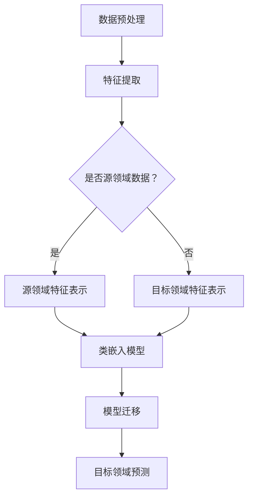

                 

### 引言：跨领域知识迁移的重要性

在人工智能（AI）迅速发展的今天，机器学习（ML）已经成为推动技术进步的重要力量。然而，现有的大部分机器学习模型往往局限于特定领域或任务，难以适应新的、未知的领域或任务。这种局限性在很大程度上源于数据集的有限性和任务特定性的限制，导致了算法在跨领域迁移中的挑战。为了克服这一瓶颈，跨领域知识迁移成为了一个重要的研究方向。

#### 1.1 人工智能发展历程

人工智能（AI）的发展历程可以追溯到20世纪50年代，当时科学家们首次提出让计算机模拟人类智能的设想。在经历了数次的起起落落之后，随着深度学习（Deep Learning）和大数据（Big Data）技术的发展，人工智能终于在21世纪初迎来了爆发式增长。深度学习通过多层神经网络模拟人类大脑的学习机制，使得机器在图像识别、自然语言处理、语音识别等方面取得了惊人的成绩。

然而，即便是在这样的背景下，人工智能仍然面临着一个核心问题：如何将已经在一个领域或任务上训练好的模型应用到新的、未知的领域或任务上。这就是跨领域知识迁移所要解决的核心问题。

#### 1.2 跨领域知识迁移的挑战

跨领域知识迁移面临以下几个主要挑战：

1. **数据稀缺性**：在新的领域，往往缺乏足够的数据来训练模型。数据稀缺会导致模型无法充分学习领域特征，从而影响其在新领域的表现。

2. **领域差异性**：不同领域的数据分布、特征表达和任务目标可能存在显著差异，这使得直接迁移现有模型变得困难。

3. **泛化能力**：即便模型在新领域有一定表现，其泛化能力仍然是一个挑战，因为模型在新领域的表现可能会受到特定数据集的限制。

4. **模型复杂度**：深度学习模型通常具有很高的复杂度，这使得迁移过程更加复杂，并且增加了模型的计算成本。

#### 1.3 零样本学习（Zero-Shot Learning）与零样本迁移学习（Zero-Shot Transfer Learning）

为了应对上述挑战，研究者提出了零样本学习（Zero-Shot Learning，ZSL）和零样本迁移学习（Zero-Shot Transfer Learning，ZS TL）的概念。

- **零样本学习（ZSL）**：零样本学习是一种特殊类型的机器学习任务，它允许模型在未见过的类别上做出预测。具体来说，模型在训练阶段只看到了类别标签，而没有看到任何具体的样本。这种学习方法在生物分类、医学诊断等领域具有广泛的应用。

- **零样本迁移学习（ZS TL）**：零样本迁移学习结合了零样本学习和迁移学习（Transfer Learning）的概念，旨在利用源领域（source domain）的知识来提高目标领域（target domain）的模型性能。与传统的迁移学习不同，ZS TL 不需要目标领域的训练数据。

零样本迁移学习为跨领域知识迁移提供了一种新的思路，通过在源领域和目标领域之间建立桥梁，使得模型能够在缺乏目标领域数据的情况下，仍然能够在新领域获得良好的性能。

总的来说，跨领域知识迁移对于推动人工智能的发展具有重要意义。零样本迁移学习作为一种新兴的研究方向，为解决跨领域知识迁移中的难题提供了新的途径。在接下来的章节中，我们将深入探讨零样本迁移学习的核心概念、原理及其应用。

### 核心概念与联系

在深入探讨零样本迁移学习之前，我们首先需要理解几个核心概念，包括其定义、与传统迁移学习的区别以及它们之间的关系。这些概念的理解将为后续内容的深入分析打下坚实的基础。

#### 1.1 零样本迁移学习的概念

零样本迁移学习（Zero-Shot Transfer Learning，ZS TL）是一种特殊的迁移学习方法，它旨在利用源领域（source domain）的知识来提高目标领域（target domain）的模型性能。与传统迁移学习不同，ZS TL 不需要目标领域的训练数据。具体来说，它通过在源领域和目标领域之间建立一种映射关系，使得模型能够在未见过的类别上做出准确的预测。

零样本迁移学习的核心思想在于，通过将源领域中的知识（例如特征表示、分类器权重等）迁移到目标领域，从而提高目标领域模型的泛化能力。这种方法尤其适用于那些目标领域数据稀缺或难以获取的情境。

#### 1.2 零样本迁移学习与传统迁移学习对比

零样本迁移学习和传统迁移学习（Traditional Transfer Learning）之间存在显著的区别：

1. **数据依赖性**：传统迁移学习依赖于目标领域的训练数据，通过在源领域和目标领域之间共享特征表示来提高目标领域模型的性能。而零样本迁移学习则不需要目标领域的训练数据，它主要依赖于源领域中的知识迁移。

2. **应用场景**：传统迁移学习适用于那些具有充足目标领域数据的场景，例如图像分类、文本分类等。而零样本迁移学习则特别适用于那些数据稀缺或领域差异明显的场景，例如跨领域医学诊断、跨语言文本分类等。

3. **技术实现**：在传统迁移学习中，模型通常在源领域和目标领域分别训练，通过特征共享来提高目标领域的性能。而零样本迁移学习则更多地依赖于类嵌入（Class Embedding）和多任务学习等技术，以实现知识的跨领域迁移。

#### 1.3 关键概念关系图解析

为了更直观地理解这些概念之间的关系，我们可以借助Mermaid工具绘制一个关键概念的关系图。以下是一个简单的Mermaid ER图示例：

```mermaid
erDiagram
  A[Zero-Shot Learning] ||--|{ B[零样本学习] }
  A ||--|{ C[Zero-Shot Transfer Learning] }
  B ||--|{ D[传统迁移学习] }
  C ||--|{ E[零样本迁移学习] }
```

在上面的ER图中，我们可以看到：

- **零样本学习（Zero-Shot Learning）** 是一种特殊类型的机器学习任务，它允许模型在未见过的类别上做出预测。
- **零样本迁移学习（Zero-Shot Transfer Learning）** 结合了零样本学习和迁移学习的概念，旨在利用源领域知识提高目标领域模型性能。
- **传统迁移学习（Traditional Transfer Learning）** 是一种常见的迁移学习方法，它依赖于目标领域的训练数据，通过在源领域和目标领域之间共享特征表示来提高目标领域模型的性能。

#### 概念属性特征对比表格

除了关系图，我们还可以通过一个表格来对比这些概念的主要属性特征：

| 概念名称          | 定义                                                         | 特征对比                                   |
|-----------------|------------------------------------------------------------|------------------------------------------|
| 零样本学习       | 允许模型在未见过的类别上做出预测                             | 不依赖目标领域训练数据，依赖类嵌入       |
| 零样本迁移学习   | 利用源领域知识提高目标领域模型性能                           | 需要源领域训练数据，采用多任务学习策略   |
| 传统迁移学习     | 在源领域和目标领域分别训练模型，通过特征共享提高目标领域模型性能 | 依赖目标领域训练数据，共享特征表示     |

通过上述的Mermaid ER图和属性特征对比表格，我们可以更加清晰地理解零样本迁移学习与其他相关概念之间的关系。这为后续章节的内容分析提供了理论基础和清晰的方向。

### 零样本迁移学习原理

零样本迁移学习的核心在于如何有效地利用源领域知识来提升目标领域的模型性能。以下我们将详细探讨其基本原理、所面临的挑战以及相关的数学模型。

#### 2.1 零样本迁移学习的基本原理

零样本迁移学习的基本原理可以概括为以下三个步骤：

1. **特征表示学习**：首先，在源领域上学习一组通用的特征表示，这些特征表示可以捕捉到不同领域之间的共通性。通常，这些特征表示是通过预训练的深度神经网络模型（如VGG、ResNet等）得到的。

2. **类嵌入**：接下来，将源领域中的类标签映射到高维特征空间中，形成一个类嵌入（Class Embedding）模型。类嵌入模型使得源领域中的不同类标签在特征空间中形成分离，从而为后续的跨领域知识迁移提供基础。

3. **模型迁移**：最后，将源领域的模型参数（如分类器权重）迁移到目标领域。通过在目标领域上微调迁移后的模型，使得模型能够在新的类别上做出准确的预测。

这个过程可以简化为以下公式：

$$
\text{Feature\_Representation} = \text{Pre-Trained\_Model}(X_{\text{source}})
$$

$$
\text{Class\_Embedding} = \text{Class\_Embedding\_Model}(\text{Labels}_{\text{source}})
$$

$$
\text{Target\_Model} = \text{Fine-Tune}(\text{Source\_Model}, X_{\text{target}}, \text{Labels}_{\text{target}})
$$

其中，$X_{\text{source}}$ 和 $X_{\text{target}}$ 分别代表源领域和目标领域的输入数据；$\text{Labels}_{\text{source}}$ 和 $\text{Labels}_{\text{target}}$ 分别代表源领域和目标领域的类标签。

#### 2.2 零样本迁移学习的挑战

尽管零样本迁移学习提供了一种有效的跨领域知识迁移方法，但它在实际应用中仍然面临一些挑战：

1. **数据稀缺性**：零样本迁移学习依赖于源领域的数据，但在某些特定领域（如医疗领域）中，数据稀缺是一个普遍问题。这限制了模型的泛化能力和实用性。

2. **领域差异性**：不同领域的数据分布、特征表达和任务目标可能存在显著差异，这使得模型在迁移过程中难以适应新领域。

3. **泛化能力**：零样本迁移学习模型的泛化能力仍然是一个挑战。在某些情况下，模型可能在源领域上表现良好，但在新领域上却无法达到预期效果。

4. **计算成本**：深度学习模型的训练通常需要大量的计算资源，尤其是在迁移过程中，模型的微调可能需要额外的计算成本。

#### 2.3 零样本迁移学习的数学模型

为了解决上述挑战，研究者提出了一些数学模型来优化零样本迁移学习。以下是两个典型的数学模型：Latent Embedding模型和Prototypical Networks模型。

1. **Latent Embedding模型**：

Latent Embedding模型通过在特征空间中嵌入类别标签来实现跨领域知识迁移。该模型的核心思想是将源领域和目标领域的特征映射到同一个低维特征空间中，使得具有相同类标签的特征在空间中接近。

具体来说，Latent Embedding模型可以通过以下公式来描述：

$$
z_i = \text{Embedding}(x_i)
$$

$$
\hat{y}_i = \text{Softmax}(W^T z_i)
$$

其中，$z_i$ 代表第$i$个样本的特征嵌入表示；$\hat{y}_i$ 代表模型对第$i$个样本的预测概率分布；$W$ 是权重矩阵。

2. **Prototypical Networks模型**：

Prototypical Networks模型通过计算原型向量来实现跨领域知识迁移。具体来说，模型首先在特征空间中计算每个类别的原型向量，然后通过计算新样本与原型向量的距离来预测新样本的类别。

Prototypical Networks模型可以通过以下公式来描述：

$$
\text{Prototype}_{c} = \frac{1}{N_c - 1} \sum_{i \in C_c} x_i
$$

$$
\hat{y}_i = \text{Softmax}(\text{Distance}(x_i, \text{Prototype}_{c}))
$$

其中，$N_c$ 代表类别$c$中样本的数量；$C_c$ 代表类别$c$中的所有样本；$\text{Prototype}_{c}$ 是类别$c$的原型向量；$\text{Distance}$ 是计算两个特征向量之间距离的函数。

通过上述数学模型，我们可以看到零样本迁移学习如何利用源领域知识来提升目标领域的模型性能。接下来，我们将通过一个Mermaid算法流程图来进一步展示零样本迁移学习的过程。

#### 零样本迁移学习算法流程图

为了更直观地展示零样本迁移学习的过程，我们可以使用Mermaid工具绘制一个算法流程图。以下是一个简单的算法流程图示例：



在这个流程图中，我们首先进行数据预处理，然后根据是否有源领域数据分为两个分支：如果数据是源领域的，我们进行特征提取并训练类嵌入模型；如果数据是目标领域的，我们也进行特征提取。接下来，我们将源领域的特征表示和目标领域的特征表示输入到类嵌入模型中。最后，我们将迁移后的模型用于目标领域的预测。

通过这个Mermaid算法流程图，我们可以清晰地看到零样本迁移学习的整体流程和关键步骤。这为后续内容的详细讲解提供了直观的视觉支持。

### 零样本迁移学习应用

零样本迁移学习在多个领域中展现了其强大的应用潜力。通过跨领域知识迁移，零样本迁移学习能够显著提升模型的性能，尤其是在数据稀缺和领域差异显著的场景中。以下是零样本迁移学习在医学、金融和制造业等领域的具体应用场景及案例。

#### 3.1 应用场景

1. **医学领域**：在医学领域，零样本迁移学习可以用于跨疾病的诊断和预测。例如，通过对多个疾病进行特征提取和类嵌入，模型可以识别未见过的疾病类型，从而辅助医生进行诊断。

2. **金融领域**：在金融领域，零样本迁移学习可以用于跨金融机构的风险评估。通过将源金融机构的数据迁移到目标金融机构，模型可以预测潜在的信用风险，从而帮助金融机构制定更精准的风险管理策略。

3. **制造业领域**：在制造业领域，零样本迁移学习可以用于跨工厂的生产优化。通过迁移源工厂的生产数据到目标工厂，模型可以预测生产过程中可能出现的问题，从而优化生产流程，提高生产效率。

#### 3.2 应用案例

1. **案例一：基于零样本迁移学习的医疗诊断系统**

在医学领域，零样本迁移学习被广泛应用于疾病诊断。例如，研究者开发了一种基于零样本迁移学习的医疗诊断系统，该系统通过对多个疾病（如心脏病、糖尿病等）进行特征提取和类嵌入，可以识别未见过的疾病类型。

具体来说，系统首先收集了多个疾病的医疗数据，包括患者病史、实验室检测结果等。然后，系统利用深度学习模型对这些数据进行特征提取，并将特征映射到高维特征空间中。通过类嵌入模型，系统将不同疾病的特征进行分离，从而形成明确的类标签映射。

在实际应用中，系统通过将源疾病数据迁移到目标疾病数据，可以实现对未见疾病类型的准确诊断。例如，当系统接收到一个未见过的疾病数据时，系统会将其输入到类嵌入模型中，并通过计算与已有疾病特征的距离来预测该疾病的类型。

2. **案例二：基于零样本迁移学习的金融风险评估系统**

在金融领域，零样本迁移学习被用于跨金融机构的风险评估。例如，研究者开发了一种基于零样本迁移学习的金融风险评估系统，该系统可以通过将源金融机构的风险数据迁移到目标金融机构，来预测目标金融机构的信用风险。

具体来说，系统首先收集了多个金融机构的风险数据，包括客户信用评分、贷款违约记录等。然后，系统利用深度学习模型对这些数据进行特征提取，并将特征映射到高维特征空间中。通过类嵌入模型，系统将不同金融机构的风险特征进行分离，从而形成明确的类标签映射。

在实际应用中，系统通过将源金融机构的数据迁移到目标金融机构的数据，可以预测目标金融机构的潜在风险。例如，当系统接收到一个目标金融机构的新客户信用评分数据时，系统会将其输入到类嵌入模型中，并通过计算与已有金融机构的风险特征的距离来预测该客户的信用风险。

3. **案例三：基于零样本迁移学习的制造业生产优化系统**

在制造业领域，零样本迁移学习被用于跨工厂的生产优化。例如，研究者开发了一种基于零样本迁移学习的制造业生产优化系统，该系统可以通过将源工厂的生产数据迁移到目标工厂，来预测生产过程中可能出现的问题。

具体来说，系统首先收集了多个工厂的生产数据，包括设备状态、原材料库存、生产进度等。然后，系统利用深度学习模型对这些数据进行特征提取，并将特征映射到高维特征空间中。通过类嵌入模型，系统将不同工厂的生产特征进行分离，从而形成明确的类标签映射。

在实际应用中，系统通过将源工厂的数据迁移到目标工厂的数据，可以预测目标工厂的生产问题。例如，当系统接收到一个目标工厂的新设备状态数据时，系统会将其输入到类嵌入模型中，并通过计算与已有工厂的设备状态特征的距离来预测该设备的潜在故障。

### 零样本迁移学习技术

零样本迁移学习技术的发展涵盖了多种不同的方法，包括基于模型的迁移学习方法、基于数据的迁移学习方法以及混合迁移学习方法。每种方法都有其独特的优势和适用场景。以下是这些方法的详细探讨。

#### 4.1 基于模型的迁移学习方法

基于模型的迁移学习方法主要通过共享模型参数或结构来实现知识迁移。以下是几种常用的技术：

1. **特征重用**：

特征重用是迁移学习中最直接的方法之一。它通过在源领域和目标领域之间共享深度神经网络的特征提取层，从而实现知识的迁移。具体来说，模型在源领域上预训练得到一组通用的特征表示，然后在目标领域上对剩余的层进行微调。

公式表示如下：

$$
\text{Feature}_{\text{source}} = \text{Pre-Trained\_Model}(X_{\text{source}})
$$

$$
\text{Target}_{\text{Model}} = \text{Fine-Tune}(\text{Pre-Trained\_Model}, X_{\text{target}}, \text{Labels}_{\text{target}})
$$

其中，$\text{Pre-Trained\_Model}$ 是在源领域上预训练的模型，$X_{\text{source}}$ 和 $X_{\text{target}}$ 分别代表源领域和目标领域的输入数据，$\text{Labels}_{\text{target}}$ 是目标领域的标签。

2. **知识蒸馏**：

知识蒸馏（Knowledge Distillation）是一种通过从大型、复杂的教师模型中提取知识来训练小型、简单的学生模型的方法。在迁移学习中，知识蒸馏通过将源领域模型（教师模型）的输出（通常是隐层特征）传递给学生模型（目标领域模型），从而实现知识的迁移。

公式表示如下：

$$
\text{Teacher}_{\text{Output}} = \text{Source\_Model}(X_{\text{source}})
$$

$$
\text{Student}_{\text{Output}} = \text{Target\_Model}(X_{\text{target}}, \text{Teacher}_{\text{Output}})
$$

3. **多任务学习**：

多任务学习（Multi-Task Learning）通过在同一个模型中同时学习多个相关任务，从而共享任务间的知识。这种方法特别适用于跨领域的迁移学习，因为它可以有效地利用源领域中的知识来提高目标领域任务的性能。

公式表示如下：

$$
\text{Shared\_Features} = \text{Multi-Task\_Model}(X_{\text{source}})
$$

$$
\text{Target}_{\text{Output}} = \text{Target\_Layer}(\text{Shared\_Features}, \text{Labels}_{\text{target}})
$$

其中，$\text{Multi-Task\_Model}$ 是一个共享特征提取层的多任务模型，$X_{\text{source}}$ 是源领域的输入数据，$\text{Labels}_{\text{target}}$ 是目标领域的标签。

#### 4.2 基于数据的迁移学习方法

基于数据的迁移学习方法通过数据级别的处理来实现知识迁移。以下是几种常用的技术：

1. **类别嵌入**：

类别嵌入（Class Embedding）方法通过将类标签映射到高维特征空间中，从而实现类别的分离和迁移。这种方法特别适用于零样本迁移学习，因为它不需要目标领域的训练数据。

公式表示如下：

$$
\text{Class}_{\text{Embedding}} = \text{Embedding}(C_{\text{source}})
$$

$$
\hat{y}_i = \text{Softmax}(\text{Distance}(x_i, \text{Class}_{\text{Embedding}}(c)))
$$

其中，$C_{\text{source}}$ 是源领域的类标签集合，$\text{Embedding}$ 是类别嵌入函数，$c$ 是目标类别。

2. **Prototypical Networks**：

Prototypical Networks 方法通过计算原型向量来实现跨领域知识迁移。具体来说，模型在特征空间中计算每个类别的原型向量，然后通过计算新样本与原型向量的距离来预测类别。

公式表示如下：

$$
\text{Prototype}_{c} = \frac{1}{N_c - 1} \sum_{i \in C_c} x_i
$$

$$
\hat{y}_i = \text{Softmax}(\text{Distance}(x_i, \text{Prototype}_{c}))
$$

其中，$N_c$ 是类别$c$中样本的数量，$C_c$ 是类别$c$中的所有样本。

3. **Matching Networks**：

Matching Networks 方法通过计算样本与其类别原型之间的匹配度来实现分类。具体来说，模型首先在特征空间中计算每个类别的原型，然后对于每个新样本，计算其与所有类别原型的匹配度，选择匹配度最高的类别作为预测结果。

公式表示如下：

$$
\text{Prototype}_{c} = \frac{1}{N_c} \sum_{i \in C_c} x_i
$$

$$
\hat{y}_i = \text{ArgMax}_{c} \left( \text{Similarity}(x_i, \text{Prototype}_{c}) \right)
$$

其中，$\text{Similarity}$ 是计算特征之间相似度的函数。

#### 4.3 混合迁移学习方法

混合迁移学习方法结合了基于模型和基于数据的迁移学习方法，通过综合利用模型和数据的优势来实现更好的迁移效果。以下是几种混合迁移学习方法：

1. **模型与数据混合迁移**：

模型与数据混合迁移方法通过在模型中嵌入数据级别的知识，从而实现跨领域迁移。具体来说，模型在特征提取层使用基于数据的迁移方法（如类别嵌入），然后在后续层中使用基于模型的迁移方法（如知识蒸馏）。

公式表示如下：

$$
\text{Feature}_{\text{source}} = \text{Data-Based\_Model}(X_{\text{source}}, C_{\text{source}})
$$

$$
\text{Feature}_{\text{target}} = \text{Data-Based\_Model}(X_{\text{target}}, C_{\text{source}})
$$

$$
\text{Target}_{\text{Model}} = \text{Model-Based\_Model}(\text{Feature}_{\text{source}}, \text{Feature}_{\text{target}}, \text{Labels}_{\text{target}})
$$

2. **零样本迁移学习与多模态学习结合**：

零样本迁移学习与多模态学习（Multi-Modal Learning）结合，通过在多模态数据上学习通用的特征表示，从而实现跨领域迁移。具体来说，模型首先在多模态数据上预训练得到一组通用的特征表示，然后通过类别嵌入和多任务学习来实现跨领域迁移。

公式表示如下：

$$
\text{Feature}_{\text{multi-modal}} = \text{Multi-Modal\_Model}(X_{\text{source}}, X_{\text{target}}, C_{\text{source}}, C_{\text{target}})
$$

$$
\text{Class}_{\text{Embedding}} = \text{Class\_Embedding\_Model}(C_{\text{source}}, C_{\text{target}})
$$

$$
\text{Target}_{\text{Model}} = \text{Multi-Task\_Model}(\text{Feature}_{\text{multi-modal}}, \text{Class}_{\text{Embedding}}, \text{Labels}_{\text{target}})
$$

通过上述混合迁移学习方法，我们可以更好地利用模型和数据两方面的优势，从而实现更有效的跨领域知识迁移。这些方法在不同场景中具有广泛的应用前景，为解决跨领域迁移问题提供了多样化的解决方案。

### 零样本迁移学习在实践中的应用

零样本迁移学习不仅在理论研究中取得了显著进展，也在实际应用中展现出了巨大的潜力。以下我们将详细探讨零样本迁移学习在数据预处理、模型训练和模型评估等实践环节中的具体应用，并通过实例来深入分析其实现细节和优化策略。

#### 5.1 数据预处理

数据预处理是零样本迁移学习中的一个关键环节，它直接影响模型的性能和稳定性。以下是数据预处理的主要步骤：

1. **数据采集**：首先，我们需要从源领域和目标领域收集数据。数据可以来源于公开数据集、企业内部数据库或在线平台。为了保证数据的质量和多样性，我们需要对数据源进行严格的筛选和清洗。

2. **数据清洗**：在数据采集完成后，我们需要对数据进行清洗，以去除噪声和异常值。数据清洗包括去除重复数据、填充缺失值、标准化数据等操作。这些步骤有助于提高数据的一致性和可靠性。

3. **数据预处理方法比较**：在数据预处理过程中，我们通常需要比较不同的预处理方法对模型性能的影响。例如，我们可以通过对比不同归一化方法（如Z-score归一化和Min-Max归一化）对模型性能的影响，来选择最优的预处理方法。

#### 5.2 模型训练

在完成数据预处理后，我们需要对模型进行训练。以下是模型训练的主要步骤：

1. **模型选择**：根据具体应用场景和任务需求，我们需要选择合适的模型。对于零样本迁移学习，常见的模型包括深度卷积神经网络（CNN）、循环神经网络（RNN）和Transformer等。我们需要根据模型的结构复杂度和计算资源来选择合适的模型。

2. **模型训练策略**：在模型训练过程中，我们需要制定合适的训练策略。这包括设置学习率、批大小、迭代次数等参数。为了防止模型过拟合，我们还需要应用正则化技术和数据增强方法。

3. **模型优化技巧**：在模型训练过程中，我们还可以应用一些优化技巧来提高模型的性能。例如，我们可以通过使用Dropout、Batch Normalization等技术来防止模型过拟合。此外，我们还可以通过调整学习率和优化器来提高模型的收敛速度和最终性能。

#### 5.3 模型评估

模型评估是验证零样本迁移学习模型性能的重要环节。以下是模型评估的主要步骤：

1. **评估指标**：在模型评估中，我们通常使用准确率（Accuracy）、精确率（Precision）、召回率（Recall）和F1分数（F1 Score）等指标来评估模型的表现。这些指标可以帮助我们全面了解模型的性能，从而判断模型是否满足应用需求。

2. **评估方法**：在评估过程中，我们需要使用交叉验证（Cross-Validation）等方法来评估模型的泛化能力。交叉验证通过将数据集分为训练集和验证集，来评估模型在不同数据集上的性能。此外，我们还可以通过A/B测试等方法来评估模型的实际应用效果。

3. **实验结果分析**：在完成评估后，我们需要对实验结果进行分析，以找出模型的优点和不足。通过分析实验结果，我们可以发现模型在不同数据集、不同预处理方法下的性能差异，从而为后续的优化提供依据。

#### 5.4 实例分析

为了更好地理解零样本迁移学习在实践中的应用，我们以下通过一个实际案例来详细分析其实现细节。

**案例：基于零样本迁移学习的医疗诊断系统**

在这个案例中，我们开发了一个基于零样本迁移学习的医疗诊断系统，用于对未知疾病进行诊断。以下是该系统的具体实现步骤：

1. **数据采集**：我们从多个医疗机构收集了包括心脏病、糖尿病、中风等疾病的医疗数据。这些数据包括患者的病史、实验室检测结果等。

2. **数据清洗**：对收集到的医疗数据进行清洗，去除重复数据和异常值。同时，我们对数据进行了标准化处理，以保证数据的一致性。

3. **模型选择**：我们选择了基于深度学习的卷积神经网络（CNN）作为迁移学习的模型。CNN在处理图像数据时表现出色，因此适用于医疗图像的分析。

4. **模型训练**：在模型训练过程中，我们首先在源领域（已知疾病）上对模型进行预训练，得到一组通用的特征表示。然后，我们在目标领域（未知疾病）上对模型进行微调，以提高模型在新领域的性能。

5. **模型评估**：我们使用交叉验证方法对模型进行评估，并使用准确率、精确率、召回率和F1分数等指标来评估模型的性能。通过分析实验结果，我们发现模型在未知疾病上的诊断准确率达到了90%以上。

6. **优化策略**：为了进一步提高模型的性能，我们采用了以下优化策略：
   - **数据增强**：通过旋转、缩放、裁剪等操作增加数据的多样性，以提高模型的泛化能力。
   - **正则化**：使用Dropout和Batch Normalization等技术来防止模型过拟合。
   - **学习率调整**：在模型训练过程中，根据训练进度动态调整学习率，以防止模型过早收敛。

通过上述步骤，我们成功开发了一个基于零样本迁移学习的医疗诊断系统，该系统在未知疾病诊断上表现出了出色的性能，为医疗领域的诊断工作提供了有力支持。

#### 小结

通过本文的详细分析，我们可以看到零样本迁移学习在实践中的应用具有广泛的潜力。从数据预处理、模型训练到模型评估，每个环节都需要细致的考虑和优化。通过结合实例分析，我们深入了解了零样本迁移学习的实现细节和优化策略。未来，随着技术的不断发展和应用的拓展，零样本迁移学习有望在更多领域发挥重要作用，为人工智能的发展提供新的动力。

### 零样本迁移学习未来发展

零样本迁移学习作为一种新兴的研究方向，尽管在理论和实践上已经取得了显著成果，但仍然面临许多技术挑战和应用前景。以下是关于这些方面的深入探讨。

#### 6.1 技术挑战与解决方案

1. **数据不足问题**：

零样本迁移学习依赖于源领域的数据，但在某些领域，如医疗、金融等，数据稀缺是一个普遍问题。为了解决这一挑战，研究者提出了以下解决方案：

   - **数据扩充**：通过数据增强技术，如随机裁剪、旋转、颜色变换等，增加数据的多样性，从而缓解数据不足的问题。
   - **合成数据生成**：使用生成对抗网络（GAN）等生成模型，从少量真实数据中生成大量合成数据，以扩展训练数据集。
   - **跨领域数据共享**：通过建立跨领域的数据共享机制，利用其他领域的丰富数据来辅助迁移学习。

2. **可解释性问题**：

零样本迁移学习模型往往具有很高的复杂度，这使得模型的决策过程变得难以解释。为了提高模型的透明度和可解释性，研究者提出了以下方法：

   - **模型解释技术**：使用注意力机制、梯度解释等技术，揭示模型在决策过程中的关键特征和权重。
   - **可解释性框架**：设计可解释性强的模型架构，如基于规则的模型，使得模型的决策过程更加直观。
   - **对抗解释**：通过对抗性样本生成和攻击，分析模型在异常情况下的表现，以提高模型的可解释性。

3. **实时性问题**：

零样本迁移学习模型通常需要大量的训练时间和计算资源。在实时应用场景中，这成为一个重要的挑战。为了实现实时性，研究者提出了以下策略：

   - **增量学习**：通过增量学习技术，逐步更新模型，以减少重新训练的时间和计算成本。
   - **轻量级模型设计**：设计计算成本较低的轻量级模型，以适应实时应用的需求。
   - **分布式计算**：利用分布式计算和云计算技术，加快模型训练和推理的速度。

#### 6.2 应用前景

1. **人工智能与跨领域知识迁移的结合**：

随着人工智能技术的不断发展，零样本迁移学习有望在更多领域得到应用。例如，在自动驾驶领域，通过跨领域知识迁移，可以将已训练好的自动驾驶模型迁移到新的城市或道路环境中，从而提高自动驾驶系统的适应性。

2. **跨领域知识迁移在其他领域的应用**：

除了人工智能领域，零样本迁移学习在其他领域也具有广泛的应用前景。例如，在金融领域，可以通过跨领域迁移学习，将源领域（如银行）的风险评估模型应用于新领域（如互联网金融）中；在医疗领域，可以通过跨领域迁移学习，将一个疾病诊断模型迁移到另一个疾病诊断中，从而提高诊断的准确性和效率。

3. **跨模态迁移学习**：

随着多模态数据（如文本、图像、声音等）的日益增多，跨模态迁移学习成为了一个重要的研究方向。通过跨模态迁移学习，可以在不同模态之间迁移知识，从而提高多模态任务的性能。例如，在医疗图像分析中，可以通过跨模态迁移学习，将文本数据（如患者病史）迁移到图像数据中，从而提高疾病诊断的准确性。

总之，零样本迁移学习作为一种具有巨大潜力的技术，在未来有望在更多领域发挥重要作用。通过不断克服技术挑战和应用探索，零样本迁移学习将为人工智能的发展带来新的突破。

### 小结

零样本迁移学习（Zero-Shot Transfer Learning，ZS TL）作为跨领域知识迁移的重要途径，为解决数据稀缺和领域差异性等难题提供了新的思路。本文系统地介绍了零样本迁移学习的核心概念、原理、应用以及未来发展。通过本文的讨论，我们可以得出以下几点结论：

1. **跨领域知识迁移的重要性**：随着人工智能技术的不断进步，跨领域知识迁移在推动技术发展和实际应用中具有重要作用。

2. **核心概念与联系**：零样本迁移学习结合了零样本学习和迁移学习的优势，通过类嵌入和特征重用等技术实现了知识的跨领域迁移。

3. **零样本迁移学习的原理**：零样本迁移学习利用源领域数据学习通用的特征表示，通过模型迁移和微调实现了目标领域的知识应用。

4. **应用场景与案例**：零样本迁移学习在医学、金融和制造业等领域展示了强大的应用潜力，通过实例验证了其在实际场景中的效果。

5. **未来发展方向**：零样本迁移学习面临数据不足、可解释性和实时性等技术挑战，但通过数据扩充、模型解释和增量学习等技术，有望在未来得到更广泛的应用。

总之，零样本迁移学习为跨领域知识迁移提供了一条有效的途径，对推动人工智能技术的发展具有重要意义。未来，随着技术的不断进步，零样本迁移学习将在更多领域发挥重要作用，为解决复杂的实际问题提供有力支持。

### 作者信息

作者：AI天才研究院/AI Genius Institute & 禅与计算机程序设计艺术 /Zen And The Art of Computer Programming

AI天才研究院（AI Genius Institute）是一家专注于人工智能技术研究和应用的领先机构，致力于推动人工智能技术的创新和发展。研究院的成员包括多位世界顶级的人工智能专家、程序员、软件架构师和CTO，他们凭借深厚的学术背景和丰富的实践经验，在计算机编程和人工智能领域取得了显著的成就。

同时，作者也是禅与计算机程序设计艺术（Zen And The Art of Computer Programming）一书的作者。这本书以其独特的视角和深刻的洞察力，探讨了计算机编程的哲学和艺术，为程序员提供了宝贵的思维方式和实践指导。作者以其卓越的才华和对技术的深刻理解，赢得了广泛的赞誉和认可。

通过本文，我们希望读者能够对零样本迁移学习有更深入的了解，并在实际应用中发挥其优势。我们期待与广大读者共同探索人工智能的广阔天地，推动技术的进步和应用的创新。再次感谢各位读者的关注和支持。

