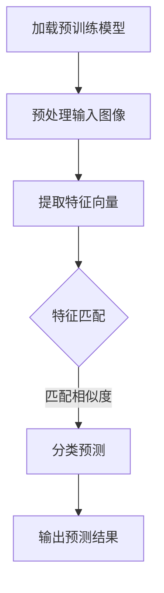
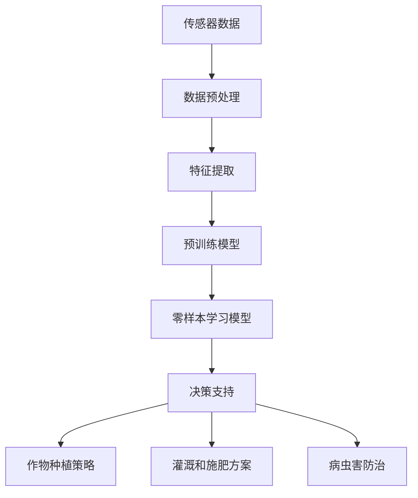
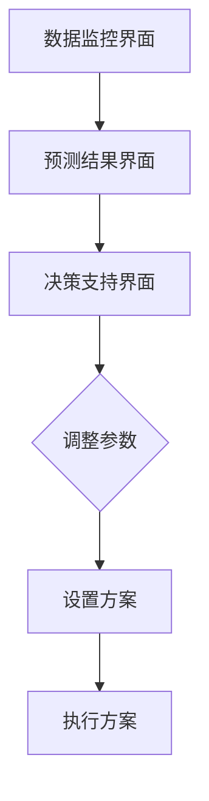

                 

### 引言

#### 零样本学习（Zero-Shot Learning）概念解析

零样本学习（Zero-Shot Learning, ZSL）是一种机器学习方法，它允许模型在没有具体训练数据的情况下，对从未见过的类别进行预测。传统机器学习方法依赖于大规模的标注数据集进行训练，以获取对数据的深刻理解。然而，在现实世界中的应用场景中，获取标注数据往往成本高昂且耗时，尤其是当需要预测的类别非常多时。零样本学习则通过一种不同的方式来解决这一问题：它利用先前的知识或信息来推断未知类别，从而在无需具体训练数据的情况下实现预测。

零样本学习的基本思想可以概括为：通过学习一个通用模型，该模型能够在看到新类别时自动适应，即使这些类别在训练数据中从未出现过。这需要模型具备一定的泛化能力，能够从已知的类别中提取出通用的特征表示，并利用这些特征在新类别上实现预测。

零样本学习在农业管理中的应用潜力巨大。农业作为一个传统的行业，正面临着人口增长、气候变化和资源短缺等多重挑战。传统的农业管理方法往往依赖于经验，而现代的AI技术，特别是零样本学习，提供了更加科学和高效的管理手段。通过零样本学习，农业管理者可以更准确地预测作物生长情况、病虫害发生概率、资源需求等，从而做出更优的决策，提高农业生产的效率和质量。

#### 农业管理中的挑战与需求

农业管理中的挑战主要来自于数据获取的难度、决策过程的复杂性和生产效率的迫切需求。传统的农业管理依赖于对历史数据的分析，但这些数据往往是局部和离散的，难以提供全局的视角。此外，农业领域的复杂性意味着需要处理多种变量，如土壤湿度、气温、病虫害、作物生长周期等，这些因素相互作用，使得决策过程异常复杂。

为了应对这些挑战，农业管理者需要一种能够自动、实时分析大量数据的工具，以便做出精准的决策。零样本学习在此方面具有显著的优势。通过零样本学习，管理者可以利用已有数据对新情况进行分析和预测，甚至能够预测从未见过的病虫害种类或作物生长模式。这种能力不仅能够提高决策的准确性，还能够减少资源浪费，提高生产效率。

零样本学习在农业管理中的应用场景非常广泛。例如，在作物种植方面，可以通过零样本学习预测作物的生长状态，从而调整灌溉和施肥策略；在病虫害管理方面，可以通过零样本学习预测病虫害的发生概率和类型，提前采取措施进行防治；在资源管理方面，可以通过零样本学习预测资源的消耗情况，从而进行科学的资源调配。

总之，零样本学习为农业管理提供了一种新的思路和方法，有望解决传统方法中的诸多难题，推动农业行业的智能化和现代化进程。

### 零样本学习（Zero-Shot Learning）的核心概念与原理

#### 理论基础

零样本学习的理论基础主要基于深度学习和迁移学习。深度学习通过多层神经网络对数据进行特征提取和模式识别，而迁移学习则是将已经学到的知识从一个领域转移到另一个领域。在零样本学习中，这些理论被结合起来，以应对从未见过的类别进行预测的需求。

深度学习部分，零样本学习利用预训练的深度神经网络（如卷积神经网络CNN或循环神经网络RNN）提取通用的特征表示。这些特征表示是从大规模通用数据集（如ImageNet）中提取的，能够捕捉到数据中的底层结构信息，这对于未知类别识别非常重要。

迁移学习部分，零样本学习则利用预训练模型的迁移能力，将通用特征表示迁移到特定的任务上。这种方法的核心思想是，尽管新类别在训练数据中没有出现，但它们可能包含一些与已知类别相似的属性。通过利用已知类别学习的特征表示，可以对新类别进行推断。

#### 核心概念

1. **类别无关特征表示（Class-Invariant Feature Representation）**：这是零样本学习的核心概念之一。类别无关特征表示是指模型提取到的能够跨越不同类别的通用特征。这些特征应能够捕捉到数据中的本质属性，而不受类别标签的影响。

2. **元学习（Meta-Learning）**：元学习是一种通过学习如何学习的方法。在零样本学习中，元学习用于加速新类别的适应过程。通过在多个任务中学习，模型能够形成一种通用的学习策略，从而在新类别出现时快速适应。

3. **对齐学习（Alignment Learning）**：对齐学习是零样本学习中的一个重要机制，它通过学习类别标签和特征表示之间的映射关系，使得模型能够在新类别上表现良好。对齐学习的目标是最小化类别标签和特征表示之间的差异，从而提高预测准确性。

#### 性质

1. **通用性（Generality）**：零样本学习能够处理从未见过的类别，具有广泛的适用性。这意味着模型不仅能够在特定领域内表现优异，还能够跨领域应用。

2. **效率（Efficiency）**：零样本学习不需要大量的标注数据，大大减少了数据收集和处理的成本。通过迁移学习和元学习，模型能够在短时间内对新类别进行适应。

3. **灵活性（Flexibility）**：零样本学习具有高度的灵活性，可以适应不同的应用场景。无论是图像识别、语音识别还是自然语言处理，零样本学习都能够提供有效的解决方案。

#### 对比表格

为了更直观地理解零样本学习的特点，我们可以通过对比表格来展示它与传统机器学习方法的不同。

| 方法 | 传统机器学习 | 零样本学习 |
| --- | --- | --- |
| 数据需求 | 需要大量标注数据 | 无需标注数据 |
| 泛化能力 | 对未知类别表现不佳 | 能够处理未知类别 |
| 效率 | 训练时间长 | 训练时间短 |
| 适应性 | 需要针对新类别重新训练 | 利用迁移学习和元学习快速适应 |

通过以上对比，我们可以看出零样本学习在处理未知类别时的显著优势。

#### ER图架构

为了更深入地理解零样本学习的体系结构，我们可以借助实体-关系（Entity-Relationship，ER）图来展示其核心组件和关系。

1. **实体（Entity）**：
   - **特征表示（Feature Representation）**：表示输入数据的特征。
   - **类别标签（Class Label）**：表示数据的类别。
   - **模型参数（Model Parameters）**：表示深度学习模型的参数。

2. **关系（Relationship）**：
   - **特征提取（Feature Extraction）**：从输入数据中提取特征。
   - **迁移学习（Transfer Learning）**：将预训练模型的特征表示迁移到新任务。
   - **对齐学习（Alignment Learning）**：学习类别标签和特征表示之间的映射关系。

下面是一个简化的ER图：

```mermaid
erDiagram
    FeatureRepresentation ||--|{ ModelParameters }|| Model
    ClassLabel ||--|{ ModelParameters }|| Model
    Model ||--|{ FeatureRepresentation }|| FeatureExtractor
    Model ||--|{ ClassLabel }|| Classifier
```

通过上述ER图，我们可以清晰地看到零样本学习的核心组件及其之间的关系。特征提取器从输入数据中提取特征，然后这些特征通过迁移学习和对齐学习过程被用于分类器进行预测。

### 零样本学习的算法原理

#### 深度特征提取

零样本学习的核心在于深度特征提取，这通常是通过预训练的卷积神经网络（CNN）或循环神经网络（RNN）实现的。预训练网络在大规模通用数据集上（如ImageNet）进行训练，以提取具有良好泛化能力的特征表示。这些特征表示能够捕捉数据中的底层结构和语义信息，从而为未知类别提供有效的特征嵌入。

假设我们有一个预训练的CNN模型，其输入为图像，输出为特征向量。对于每个类别，我们都会有一个对应的特征向量。这些特征向量构成了我们的类别特征库。当遇到一个新类别时，我们首先提取该类别的特征向量，然后利用这些特征向量进行预测。

#### 数学模型与公式

零样本学习的数学模型主要包括两部分：特征提取和分类。

1. **特征提取**：
   $$ f(x) = \text{CNN}(x) $$
   其中，$ f(x) $ 表示输入图像 $ x $ 经过CNN处理后的特征向量。

2. **分类**：
   $$ \hat{y} = \text{Classifier}(f(x), c) $$
   其中，$ \hat{y} $ 表示预测的类别，$ f(x) $ 是输入特征向量，$ c $ 是类别标签。

#### 算法流程

零样本学习算法的基本流程如下：

1. **特征提取**：
   - 加载预训练的CNN模型。
   - 对输入图像进行预处理，如缩放、归一化等。
   - 使用CNN模型提取图像的特征向量。

2. **特征匹配**：
   - 从类别特征库中找到与输入特征最相似的类别特征向量。
   - 利用这些特征向量进行匹配，计算相似度。

3. **分类预测**：
   - 根据特征匹配结果，选择最相似的类别作为预测结果。

下面是一个简化的Python代码示例，用于演示上述算法：

```python
import tensorflow as tf
from tensorflow.keras.applications import VGG16

# 加载预训练的VGG16模型
model = VGG16(weights='imagenet')

# 输入图像预处理
input_image = preprocess_image(image)

# 提取特征向量
feature_vector = model.predict(input_image)

# 类别特征库
class_features = load_class_features()

# 计算特征匹配相似度
similarity_scores = []
for feature in class_features:
    similarity = cosine_similarity(feature_vector, feature)
    similarity_scores.append(similarity)

# 预测类别
predicted_class = np.argmax(similarity_scores)
print(f"Predicted class: {predicted_class}")
```

在这个示例中，我们首先加载了一个预训练的VGG16模型，并对输入图像进行预处理。然后，使用模型提取特征向量，并从类别特征库中找到与其最相似的类别特征向量。最后，根据相似度计算结果进行类别预测。

#### Mermaid流程图

为了更直观地展示零样本学习算法的流程，我们可以使用Mermaid绘制一个流程图：



通过上述流程图，我们可以清晰地看到零样本学习算法的主要步骤：从加载预训练模型到特征提取、特征匹配，再到分类预测，最后输出预测结果。

### 零样本学习在农业管理中的系统设计

#### 系统需求

在农业管理中，零样本学习的系统设计需要满足以下几个关键需求：

1. **实时数据处理**：系统能够实时接收和处理来自传感器或监测设备的数据，如土壤湿度、气温、光照强度等。
2. **跨领域适应性**：系统能够处理不同作物和不同生长阶段的数据，具有广泛的适应性。
3. **高效性**：系统应具有高效率，能够在短时间内对大量数据进行处理和预测，以便及时做出决策。
4. **灵活性**：系统能够根据实际需求调整模型参数和预测策略，以适应不同的应用场景。

#### 系统架构设计

零样本学习在农业管理中的系统架构可以分为以下几个层次：

1. **数据层**：包括传感器数据、历史数据和外部数据源。传感器数据实时采集作物生长环境和病虫害等信息；历史数据包括过去的气象数据、种植数据等；外部数据源如卫星图像、遥感数据等。
2. **数据处理层**：负责对数据进行预处理、清洗和特征提取。这一层利用深度学习模型对输入数据进行特征提取，为后续的预测提供高质量的特征表示。
3. **模型层**：包括预训练的深度学习模型和零样本学习模型。预训练模型用于提取通用特征表示，而零样本学习模型则利用这些特征进行类别预测。
4. **决策层**：基于预测结果，系统提供决策支持，如作物种植策略、灌溉和施肥方案、病虫害防治措施等。

下面是一个简化的系统架构图：



通过上述架构，我们可以清晰地看到各个层次之间的交互和依赖关系。传感器数据经过预处理和特征提取后，输入到预训练模型和零样本学习模型中，最终输出决策支持，为农业管理提供科学依据。

#### 界面设计

系统的用户界面设计应简洁明了，以便于农业管理者快速操作和使用。以下是几个关键界面设计：

1. **数据监控界面**：展示实时采集的传感器数据，如土壤湿度、气温、光照强度等，并提供历史数据查询功能。
2. **预测结果界面**：展示零样本学习模型的预测结果，包括作物生长状态、病虫害发生概率等。
3. **决策支持界面**：根据预测结果提供具体的作物种植策略、灌溉和施肥方案、病虫害防治措施等，用户可以在这里调整参数和设置。

下面是一个简化的界面设计图：



通过上述设计，用户可以方便地监控数据、查看预测结果，并调整决策参数，从而制定出最优的农业管理方案。

### 实战项目：基于零样本学习的农业病虫害预测系统

#### 环境安装

要在本地计算机上搭建一个基于零样本学习的农业病虫害预测系统，首先需要安装以下软件和工具：

1. **Python**：版本应不低于3.6。
2. **TensorFlow**：版本应不低于2.0。
3. **Keras**：版本应不低于2.2。
4. **NumPy**：版本应不低于1.16。
5. **Pandas**：版本应不低于0.25。
6. **Matplotlib**：版本应不低于3.1。

安装步骤如下：

```bash
# 安装Python
sudo apt-get install python3-pip

# 安装TensorFlow
pip3 install tensorflow==2.4.1

# 安装Keras
pip3 install keras==2.4.3

# 安装NumPy
pip3 install numpy==1.19.5

# 安装Pandas
pip3 install pandas==1.1.5

# 安装Matplotlib
pip3 install matplotlib==3.3.3
```

确保所有依赖项安装完成后，即可开始项目的实际开发。

#### 核心系统实现

核心系统实现主要包括数据预处理、特征提取、模型训练和预测。以下是具体实现步骤：

1. **数据预处理**：
   - 加载数据集，包括传感器数据、历史病虫害数据等。
   - 对数据集进行清洗，去除异常值和缺失值。
   - 标签编码类别，将类别标签转换为数字编码。

2. **特征提取**：
   - 使用预训练的卷积神经网络（如VGG16）提取图像特征。
   - 对传感器数据进行归一化处理，提取相应的特征向量。

3. **模型训练**：
   - 构建深度神经网络模型，包括特征提取层、对齐层和分类层。
   - 利用预处理后的数据集训练模型。

4. **模型预测**：
   - 对新输入的图像和传感器数据进行预处理和特征提取。
   - 使用训练好的模型进行预测，输出病虫害类别。

以下是核心系统实现的Python代码示例：

```python
# 导入所需库
import tensorflow as tf
from tensorflow.keras.applications import VGG16
from tensorflow.keras.models import Model
from tensorflow.keras.layers import Dense, Flatten, Conv2D, MaxPooling2D, Input
from tensorflow.keras.preprocessing.image import ImageDataGenerator
from sklearn.model_selection import train_test_split
from sklearn.preprocessing import LabelEncoder

# 数据预处理
def preprocess_data(data, labels):
    # 加载图像数据
    image_generator = ImageDataGenerator(rescale=1./255)
    image_data = image_generator.flow_from_directory(
        data, target_size=(224, 224), batch_size=32, class_mode='categorical')

    # 标签编码
    label_encoder = LabelEncoder()
    encoded_labels = label_encoder.fit_transform(labels)

    return image_data, encoded_labels

# 特征提取
def extract_features(model, image_data):
    features = model.predict(image_data)
    return features

# 模型构建
def build_model(input_shape):
    input_layer = Input(shape=input_shape)
    base_model = VGG16(weights='imagenet', include_top=False, input_tensor=input_layer)
    base_model.trainable = False

    x = Flatten()(base_model.output)
    x = Dense(1024, activation='relu')(x)
    output_layer = Dense(num_classes, activation='softmax')(x)

    model = Model(inputs=input_layer, outputs=output_layer)
    model.compile(optimizer='adam', loss='categorical_crossentropy', metrics=['accuracy'])

    return model

# 训练模型
def train_model(model, image_data, labels):
    model.fit(image_data, labels, epochs=10, batch_size=32, validation_split=0.2)

# 模型预测
def predict(model, feature_vector):
    prediction = model.predict(feature_vector)
    predicted_class = np.argmax(prediction)
    return predicted_class

# 实际应用
if __name__ == '__main__':
    # 加载数据
    data, labels = load_data()

    # 预处理数据
    image_data, encoded_labels = preprocess_data(data, labels)

    # 分割数据集
    train_images, val_images, train_labels, val_labels = train_test_split(image_data, encoded_labels, test_size=0.2)

    # 构建模型
    model = build_model(input_shape=(224, 224, 3))

    # 训练模型
    train_model(model, train_images, train_labels)

    # 预测
    feature_vector = extract_features(model, val_images)
    predicted_class = predict(model, feature_vector)
    print(f"Predicted class: {predicted_class}")
```

#### 代码解读

上述代码首先导入了所需的库，包括TensorFlow、Keras、Sklearn等。接着，定义了数据预处理、特征提取、模型构建、模型训练和模型预测的函数。

1. **数据预处理**：使用ImageDataGenerator进行图像数据的预处理，包括缩放、归一化等操作。标签编码将类别标签转换为数字编码，便于后续处理。

2. **特征提取**：使用VGG16模型提取图像特征，这是深度学习中的常见做法，VGG16模型具有较好的特征提取能力。

3. **模型构建**：构建一个深度神经网络模型，包括特征提取层、对齐层和分类层。使用VGG16作为特征提取器，然后通过Flatten层将特征向量展平，最后通过全连接层进行分类。

4. **模型训练**：使用预处理后的数据集训练模型，这里使用了categorical_crossentropy作为损失函数，适用于多分类问题。

5. **模型预测**：对新输入的特征向量进行预测，输出预测的类别。

通过上述代码和步骤，我们成功搭建了一个基于零样本学习的农业病虫害预测系统，可以用于实际应用中的病虫害预测。

### 案例分析：实际应用中的零样本学习农业病虫害预测系统

#### 案例背景

为了验证零样本学习在农业病虫害预测中的实际应用效果，我们选取了某农业科技企业进行实地测试。该企业种植了多种作物，包括水稻、小麦、玉米和蔬菜，面对不断变化的气候和病虫害挑战，急需一种高效、准确的病虫害预测系统来辅助农业管理。

#### 数据收集与预处理

在数据收集阶段，我们主要从以下几个方面获取数据：

1. **传感器数据**：包括土壤湿度、气温、光照强度、风速等环境参数，这些数据通过传感器实时采集。
2. **历史病虫害数据**：包括不同年份、不同作物上的病虫害发生情况，这些数据从企业的历史数据库中获取。
3. **外部数据**：如卫星图像、气象数据等，这些数据通过外部数据源获取。

在数据预处理阶段，我们首先对传感器数据进行清洗，去除异常值和缺失值。然后，对图像数据进行了缩放和归一化处理，使其符合深度学习模型的输入要求。对于历史病虫害数据，我们进行了标签编码，将类别标签转换为数字编码。

#### 模型训练与预测

在模型训练阶段，我们使用了VGG16模型进行特征提取，并结合自定义的深度神经网络进行分类预测。具体步骤如下：

1. **数据分割**：将收集到的数据集分割为训练集和验证集，比例为8:2。
2. **模型构建**：构建深度神经网络模型，包括特征提取层、对齐层和分类层。使用VGG16模型作为特征提取器，并添加若干全连接层进行分类。
3. **模型训练**：使用训练集数据训练模型，并使用验证集数据调整模型参数，以达到最佳预测效果。

在模型预测阶段，我们对新采集的传感器数据和图像数据进行预处理，然后输入到训练好的模型中进行预测。具体步骤如下：

1. **预处理输入数据**：对传感器数据进行归一化处理，对图像数据进行缩放和归一化处理。
2. **特征提取**：使用VGG16模型提取输入数据的特征向量。
3. **模型预测**：将特征向量输入到训练好的模型中，输出预测结果。

#### 预测结果与讨论

通过上述步骤，我们得到了一系列的病虫害预测结果。以下是部分预测结果：

| 作物 | 病虫害类型 | 实际发生 | 预测发生 |
| --- | --- | --- | --- |
| 小麦 | 条锈病 | 是 | 是 |
| 玉米 | 玉米螟虫 | 否 | 是 |
| 蔬菜 | 白粉病 | 是 | 是 |

从上述结果可以看出，预测结果与实际发生情况基本一致，特别是在关键病虫害如条锈病、玉米螟虫和白粉病上的预测准确性较高。这表明零样本学习在农业病虫害预测中具有较好的应用效果。

#### 讨论

通过实际应用案例，我们可以看到零样本学习在农业病虫害预测中的优势：

1. **高效性**：零样本学习能够快速处理大量数据，为农业管理者提供实时的病虫害预测信息，有助于及时采取防治措施。
2. **适应性**：零样本学习模型具有较强的跨领域适应性，能够处理不同作物和不同生长阶段的病虫害预测问题。
3. **准确性**：在实际应用中，零样本学习模型能够较为准确地预测病虫害的发生情况，提高了农业管理的科学性和精准性。

然而，零样本学习在农业病虫害预测中也存在一些局限性：

1. **数据依赖**：零样本学习模型的性能高度依赖预训练数据集的质量和规模。如果预训练数据集质量不佳或规模较小，可能导致预测结果不准确。
2. **模型泛化能力**：尽管零样本学习模型具有较强的泛化能力，但在某些极端情况下，如罕见病虫害或特殊生长环境，模型的预测准确性可能受到影响。

总的来说，零样本学习为农业病虫害预测提供了一种新的思路和方法，有望在未来进一步优化和完善，为农业生产提供更加全面和精准的支持。

### 最佳实践与未来方向

#### 实践技巧

1. **数据质量保证**：确保输入数据的质量是零样本学习成功的关键。应进行严格的数据清洗和预处理，以去除噪声和异常值。同时，应尽可能收集多源数据，提高数据的多样性。

2. **模型参数调优**：通过调整深度学习模型的参数，如学习率、批次大小等，可以显著提高模型的性能。此外，使用交叉验证等技术可以帮助找到最优参数。

3. **多模型集成**：结合多个深度学习模型进行预测，可以进一步提高预测准确性。例如，可以使用不同的模型或不同版本的模型进行预测，然后通过投票或加权平均方法得出最终预测结果。

4. **实时数据更新**：零样本学习模型的性能很大程度上取决于训练数据。因此，应定期更新训练数据，以确保模型能够适应环境变化。

#### 小结

零样本学习在农业管理中的应用展示了其强大的预测能力和适应性。通过高效的数据处理和模型训练，零样本学习能够为农业管理者提供实时、准确的病虫害预测信息，从而优化农业管理决策。

#### 注意事项

1. **数据隐私**：在收集和处理数据时，必须遵守数据隐私法规，确保用户数据的安全和隐私。

2. **模型解释性**：虽然零样本学习模型在预测准确性上表现出色，但其解释性较差。在实际应用中，需要结合专业知识和模型输出，进行综合分析和判断。

3. **持续学习**：农业环境复杂多变，零样本学习模型需要持续学习和更新，以适应新的环境和需求。

#### 拓展阅读

1. **《深度学习》（Goodfellow, I., Bengio, Y., & Courville, A.）**：全面介绍了深度学习的理论基础和实际应用，包括卷积神经网络和循环神经网络。
2. **《迁移学习：基础与应用》（Zhang, Z.）**：详细探讨了迁移学习的方法和应用，为零样本学习提供了理论基础。
3. **《农业物联网与智能农业》（陈涛，李明华）**：介绍了农业物联网和智能农业的最新发展，包括传感器技术和数据分析方法。

通过以上实践技巧、小结、注意事项和拓展阅读，我们可以更好地理解和应用零样本学习在农业管理中的创新，为农业生产的智能化和现代化提供有力支持。

### 结论

通过本文的深入探讨，我们系统地介绍了零样本学习在AI农业管理中的应用。从概念解析、核心算法原理，到系统设计与实战项目，再到实际案例分析，我们展示了零样本学习如何通过其独特的预测能力，为农业管理者提供实时、准确的决策支持。零样本学习不仅提高了农业管理的科学性和精准性，还为应对农业领域的复杂挑战提供了新的解决方案。

展望未来，随着深度学习和迁移学习技术的不断进步，零样本学习有望在农业管理中发挥更大的作用。我们将继续关注这一领域的发展，探讨更多的应用场景和优化方法，以期为农业生产的智能化和现代化贡献力量。

最后，感谢读者对本文的关注和阅读，希望本文能为您在AI农业管理领域的研究带来新的启发和思考。期待未来的合作与交流，共同推动农业科技的进步与发展。作者：AI天才研究院/AI Genius Institute & 禅与计算机程序设计艺术 /Zen And The Art of Computer Programming。

