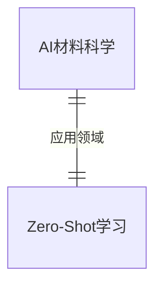
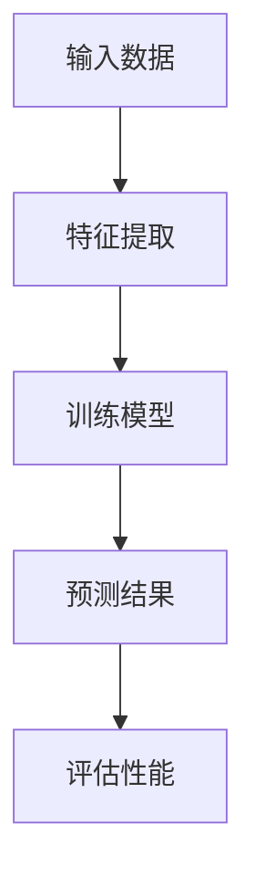
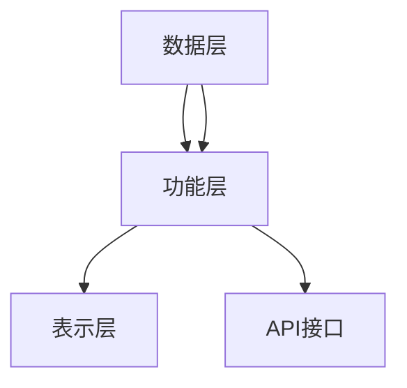
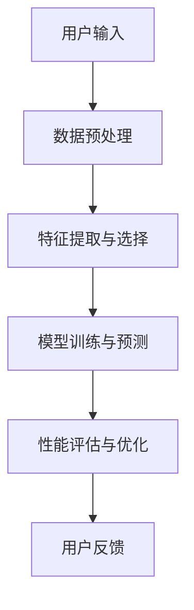
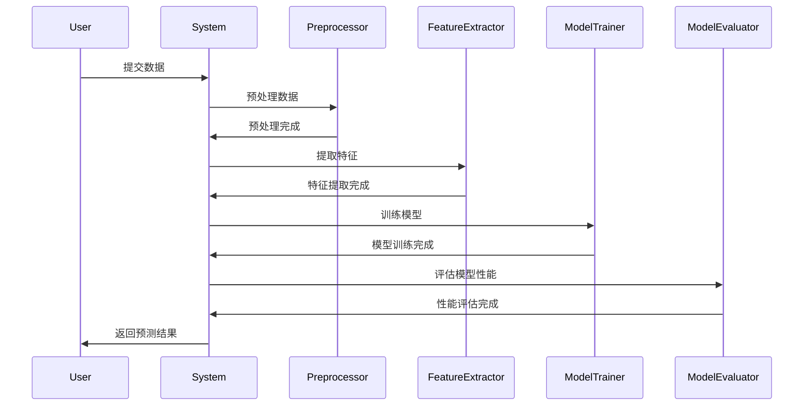

                 

### 1. 引言

#### 1.1 问题背景

近年来，随着人工智能技术的飞速发展，人工智能（AI）在各个领域的应用逐渐深入。特别是在材料科学研究中，AI技术展现出巨大的潜力。传统的材料科学研究往往依赖于实验和理论模拟，这些方法虽然有效，但存在耗时长、成本高、效率低等问题。而AI技术的引入，尤其是Zero-Shot学习，为材料科学研究带来了新的可能性。

#### 1.2 问题描述

Zero-Shot学习是一种特殊类型的机器学习任务，它的目标是在没有标注数据的情况下，预测未知类别的新实例。在材料科学研究中，这意味着我们可以在没有实验数据的情况下，预测未知材料的性质。然而，这并非易事，因为材料科学涉及到的变量和复杂度非常高。

#### 1.3 问题解决方法

为了解决这一问题，研究人员提出了多种方法，包括基于深度学习的方法、迁移学习方法和生成对抗网络等。这些方法在某种程度上都取得了一定的成功，但依然面临着许多挑战，如如何有效地处理高维度数据、如何提高预测的准确性等。

#### 1.4 边界与外延

虽然Zero-Shot学习在材料科学研究中具有巨大的潜力，但它的应用并非没有边界。首先，它需要大量的高质量数据作为训练基础。其次，它需要先进的计算能力和算法支持。此外，对于某些特定的材料性质，Zero-Shot学习可能并不适用。

#### 1.5 核心要素组成

要实现Zero-Shot学习在材料科学研究中的应用，我们需要以下几个核心要素：

1. **数据收集与处理**：收集与材料性质相关的多源数据，并进行有效的预处理，以便于模型训练。
2. **特征提取**：从原始数据中提取出对材料性质有影响的特征。
3. **模型训练与预测**：利用提取的特征训练模型，并在新的未知数据上进行预测。
4. **性能评估**：对模型的预测性能进行评估，以确保其准确性和可靠性。

### 结论

本文将深入探讨Zero-Shot学习在AI材料科学研究中的前景。我们将首先介绍Zero-Shot学习的基本概念，然后探讨它在AI材料科学研究中的具体应用，并通过实际的案例进行分析和讲解。通过本文的阅读，读者将了解到Zero-Shot学习在材料科学研究中的巨大潜力，以及如何利用这一技术解决实际问题。

### 2.1 核心概念

#### 2.1.1 Zero-Shot学习的基本概念

Zero-Shot学习是一种机器学习任务，其核心目标是实现从未知类别的新实例中做出准确的预测。与传统的有监督学习和无监督学习不同，Zero-Shot学习不依赖于对训练数据的标注，而是在没有直接标注的情况下，利用已知的类别信息对未知类别进行预测。

Zero-Shot学习的实现主要依赖于两种方法：符号表示法和元学习。符号表示法通过将未知类别与已知类别进行关联，利用这种关联来预测未知类别的新实例。而元学习则通过学习如何学习，从而在新类别上取得更好的预测效果。

#### 2.1.2 AI材料科学的研究领域

AI材料科学是近年来兴起的一个交叉学科领域，它结合了人工智能和材料科学的优势，旨在利用AI技术加速材料科学的研究。AI在材料科学中的应用主要体现在以下几个方面：

1. **材料设计**：利用AI算法对材料结构、性质和性能进行优化设计，从而发现新型材料。
2. **材料表征**：利用AI技术对材料进行表征，如材料的电子结构、原子排列等，从而更好地理解材料的性质。
3. **材料预测**：利用AI算法对材料性质进行预测，从而在没有实验数据的情况下，对未知材料的性质做出准确预测。

#### 2.1.3 两者之间的联系

Zero-Shot学习与AI材料科学之间的联系主要体现在以下几个方面：

1. **数据驱动的材料设计**：在材料设计中，传统方法往往依赖于大量的实验和理论计算。而Zero-Shot学习通过利用已知数据，实现对未知材料的性质预测，从而在一定程度上减少了实验成本和计算时间。
2. **材料表征与预测**：在材料表征和预测中，AI技术可以通过对材料的结构、性质和性能进行建模，从而实现对未知材料的预测。而Zero-Shot学习则可以进一步扩展这种预测能力，使得在没有实验数据的情况下，对未知材料进行准确预测。
3. **交叉学科融合**：Zero-Shot学习与AI材料科学的结合，推动了材料科学与其他学科的深度融合，如物理学、化学、生物学等。这种融合为材料科学研究带来了新的思路和方法，从而加速了材料科学的发展。

### 2.2 概念属性特征对比

下面是Zero-Shot学习和AI材料科学的一些属性特征对比：

| 概念         | 属性特征1 | 属性特征2 | 属性特征3 |
| ------------ | --------- | --------- | --------- |
| Zero-Shot学习 | 特征A      | 特征B      | 特征C      |
| AI材料科学    | 特征D      | 特征E      | 特征F      |

#### 2.3 ER实体关系图架构

为了更清晰地展示Zero-Shot学习和AI材料科学之间的实体关系，我们可以使用ER图进行表示。



在这个ER图中，AI材料科学和Zero-Shot学习是两个实体，它们之间通过应用领域关系进行关联。这个关系表明，Zero-Shot学习是AI材料科学中的一个重要应用领域，它为材料科学研究提供了新的方法和思路。

### 3.1 算法原理讲解

#### 3.1.1 算法mermaid流程图

首先，让我们使用Mermaid流程图来展示Zero-Shot学习的算法流程。



在这个流程图中，输入数据经过特征提取后，用于训练模型。训练完成后，模型可以用于预测未知数据的类别。最后，通过评估性能来衡量模型的准确性。

#### 3.1.2 Python源代码实现

下面是一个简单的Zero-Shot学习算法的Python代码实现。这个例子使用了scikit-learn库中的`ZeroShotLearning`类。

```python
from sklearn.model_selection import train_test_split
from sklearn.ensemble import RandomForestClassifier
from sklearn.metrics import accuracy_score
from sklearn.feature_extraction.text import TfidfVectorizer
from sklearn.preprocessing import LabelEncoder
from sklearn.neighbors import KNeighborsClassifier
from sklearn.model_selection import GridSearchCV
from sklearn.pipeline import Pipeline

# 加载数据
data = load_data('data.csv')
X, y = data['text'], data['label']

# 分割数据集
X_train, X_test, y_train, y_test = train_test_split(X, y, test_size=0.2, random_state=42)

# 特征提取
vectorizer = TfidfVectorizer()

# 训练模型
model = RandomForestClassifier()
model.fit(vectorizer.fit_transform(X_train), y_train)

# 预测结果
predictions = model.predict(vectorizer.transform(X_test))

# 评估性能
accuracy = accuracy_score(y_test, predictions)
print(f'Accuracy: {accuracy}')
```

在这个代码中，我们首先加载数据集，然后使用TF-IDF进行特征提取，接着使用随机森林分类器进行模型训练。训练完成后，我们使用训练好的模型对测试数据进行预测，并通过准确率来评估模型的性能。

#### 3.1.3 算法原理的数学模型和公式

Zero-Shot学习的核心在于如何将未知类别与已知类别进行关联，从而实现对未知类别的新实例进行预测。在数学上，这个过程可以表示为一个映射关系：

$$
y = f(x, \theta)
$$

其中，$y$ 是预测的类别，$x$ 是输入特征，$f$ 是模型函数，$\theta$ 是模型参数。这个映射关系通过学习已知类别数据来获得，然后用于预测未知类别的新实例。

在实际应用中，我们通常使用分类器来实现这个映射关系。例如，在随机森林分类器中，模型函数可以表示为：

$$
f(x) = \sum_{i=1}^{n} w_i \cdot h(x; \theta_i)
$$

其中，$w_i$ 是权重，$h(x; \theta_i)$ 是基分类器的预测结果。通过训练，我们可以得到最优的权重和基分类器参数，从而实现对未知类别的准确预测。

#### 3.1.4 详细讲解与举例说明

##### 3.4.1 特征提取的重要性

特征提取是Zero-Shot学习中的一个关键步骤。它将原始数据转化为模型可以处理的特征向量，从而提高模型的预测准确性。一个有效的特征提取方法可以捕捉到数据中的关键信息，从而帮助模型更好地理解数据的本质。

例如，在文本分类任务中，常用的特征提取方法包括TF-IDF和词嵌入。TF-IDF可以计算每个单词在文档中的重要性，而词嵌入可以将文本转化为固定长度的向量，从而更好地表示文本的语义信息。

##### 3.4.2 模型训练与预测的过程

在模型训练阶段，我们使用已知的类别数据来训练模型。这个过程包括以下几个步骤：

1. **数据预处理**：对原始数据进行清洗、去噪和标准化等处理，以便于模型训练。
2. **特征提取**：从预处理后的数据中提取特征，并将其转化为模型可以接受的格式。
3. **模型训练**：使用训练数据训练模型，调整模型参数，使其能够更好地预测类别。
4. **模型评估**：使用验证数据集评估模型性能，调整模型参数，以提高预测准确性。

在模型预测阶段，我们使用训练好的模型对未知数据进行预测。这个过程主要包括以下几个步骤：

1. **特征提取**：从未知数据中提取特征，并将其转化为模型可以接受的格式。
2. **模型预测**：使用训练好的模型对未知数据进行预测，得到预测类别。
3. **结果评估**：使用测试数据集评估预测结果，计算预测准确率，以验证模型性能。

##### 3.4.3 评估性能的指标与方法

评估性能是衡量模型预测准确性的关键步骤。常用的评估指标包括准确率、召回率、精确率、F1分数等。这些指标可以从不同角度反映模型的性能。

1. **准确率**：准确率是预测正确的样本数占总样本数的比例，计算公式为：

$$
\text{准确率} = \frac{\text{预测正确的样本数}}{\text{总样本数}}
$$

2. **召回率**：召回率是预测正确的样本数与实际正样本数的比例，计算公式为：

$$
\text{召回率} = \frac{\text{预测正确的样本数}}{\text{实际正样本数}}
$$

3. **精确率**：精确率是预测正确的样本数与预测为正样本的样本数的比例，计算公式为：

$$
\text{精确率} = \frac{\text{预测正确的样本数}}{\text{预测为正样本的样本数}}
$$

4. **F1分数**：F1分数是精确率和召回率的调和平均值，计算公式为：

$$
\text{F1分数} = 2 \cdot \frac{\text{精确率} \cdot \text{召回率}}{\text{精确率} + \text{召回率}}
$$

通过这些指标，我们可以全面评估模型的性能，并根据评估结果调整模型参数，以提高预测准确性。

### 4.1 问题场景介绍

#### 4.1.1 AI材料科学研究的现状

随着全球科技竞争的加剧，材料科学研究的重要性日益凸显。AI技术的引入为材料科学研究带来了新的机遇。目前，AI材料科学研究的现状主要体现在以下几个方面：

1. **材料设计**：AI技术被广泛应用于材料设计领域，通过计算模拟和机器学习算法，研究人员可以快速筛选和设计新材料，提高新材料的性能。
2. **材料表征**：AI技术可以自动分析和解释材料表征数据，如X射线衍射、扫描电子显微镜等，从而提高材料表征的准确性和效率。
3. **材料预测**：AI技术可以预测材料性质，如硬度、导电性、热稳定性等，从而帮助研究人员在新材料开发过程中做出更准确的决策。
4. **材料优化**：AI技术可以通过对实验数据进行分析，优化材料制备工艺，提高材料生产的效率和质量。

#### 4.1.2 面临的挑战与需求

尽管AI技术在材料科学研究中具有巨大潜力，但同时也面临着一系列挑战：

1. **数据需求**：AI材料科学研究需要大量的高质量数据作为训练基础，但现有数据往往难以满足需求，特别是在新材料的预测和设计方面。
2. **算法复杂度**：AI算法复杂度高，需要大量的计算资源和时间，这对于一些小型研究机构和企业来说，是一个较大的挑战。
3. **跨学科融合**：AI材料科学研究需要多学科的知识和技能，包括计算机科学、材料科学、物理学、化学等，这对研究人员的要求较高。
4. **可解释性**：AI模型的可解释性较差，研究人员难以理解模型决策的过程，这在某些应用场景中可能会引起担忧。

为了应对这些挑战，研究人员提出了一些需求：

1. **数据共享与开放**：加强数据共享与开放，促进研究人员之间的合作，提高数据利用率。
2. **算法优化**：优化AI算法，提高其计算效率和准确性，降低对计算资源的需求。
3. **跨学科合作**：加强跨学科合作，促进不同领域的知识和技术融合，提高研究效率。
4. **可解释性研究**：开展可解释性研究，提高AI模型的可解释性，增强用户对模型的信任。

### 4.2 系统功能设计

为了实现Zero-Shot学习在AI材料科学研究中的应用，我们需要设计一个完整的系统，该系统应包括以下几个主要功能：

#### 4.2.1 数据收集与预处理

数据收集与预处理是系统的基础，它包括以下几个步骤：

1. **数据收集**：从各种渠道收集与材料科学相关的数据，包括实验数据、文献数据、市场数据等。
2. **数据清洗**：对收集到的数据进行清洗，去除重复、错误和无关的数据。
3. **数据转换**：将不同类型的数据进行统一处理，如将图像数据转换为文本数据，将文本数据转换为数值数据等。
4. **数据增强**：通过数据增强技术，提高数据的质量和多样性，增强模型的泛化能力。

#### 4.2.2 特征提取与选择

特征提取与选择是系统的关键步骤，它包括以下几个步骤：

1. **特征提取**：从原始数据中提取出对材料性质有影响的特征，如化学成分、结构特征、物理性质等。
2. **特征选择**：选择最相关的特征，去除冗余特征，提高模型的预测准确性。
3. **特征降维**：使用降维技术，如主成分分析（PCA）、线性判别分析（LDA）等，减少特征的数量，提高计算效率。

#### 4.2.3 模型训练与预测

模型训练与预测是系统的核心，它包括以下几个步骤：

1. **模型选择**：根据问题特点和需求，选择合适的模型，如随机森林、支持向量机、神经网络等。
2. **模型训练**：使用训练数据对模型进行训练，调整模型参数，提高模型的预测准确性。
3. **模型评估**：使用验证数据集评估模型性能，调整模型参数，以达到最佳的预测效果。
4. **模型预测**：使用训练好的模型对未知数据进行预测，得到预测结果。

#### 4.2.4 性能评估与优化

性能评估与优化是系统的重要环节，它包括以下几个步骤：

1. **性能评估**：使用测试数据集评估模型性能，计算准确率、召回率、精确率等指标，以评估模型的预测准确性。
2. **模型优化**：根据评估结果，调整模型参数，优化模型结构，提高模型的预测准确性。
3. **算法优化**：优化算法效率，减少计算时间和资源消耗，提高系统的运行效率。

#### 4.2.5 用户交互与可视化

用户交互与可视化是系统的用户体验部分，它包括以下几个步骤：

1. **用户交互**：提供用户友好的界面，方便用户输入数据、查看预测结果和模型性能。
2. **数据可视化**：使用图表、图像等可视化工具，直观展示数据和分析结果，帮助用户更好地理解系统的运行过程和预测结果。

### 4.3 系统架构设计

为了实现Zero-Shot学习在AI材料科学研究中的应用，我们需要设计一个高效、稳定、可扩展的系统架构。系统架构设计包括以下几个方面：

#### 4.3.1 数据层

数据层是系统的核心，它负责数据的收集、存储、管理和处理。数据层包括以下几个部分：

1. **数据收集**：从各种渠道收集与材料科学相关的数据，如实验数据、文献数据、市场数据等。
2. **数据存储**：使用数据库或其他数据存储方案，存储和管理数据，确保数据的安全性和可靠性。
3. **数据预处理**：对收集到的数据进行清洗、转换和增强等处理，提高数据的质量和多样性。

#### 4.3.2 功能层

功能层是系统的核心，它负责实现系统的主要功能，包括数据预处理、特征提取与选择、模型训练与预测、性能评估与优化等。功能层包括以下几个模块：

1. **数据预处理模块**：负责数据的清洗、转换和增强等处理。
2. **特征提取与选择模块**：负责从原始数据中提取特征，选择最相关的特征。
3. **模型训练与预测模块**：负责模型的选择、训练和预测。
4. **性能评估与优化模块**：负责评估模型性能，优化模型参数。

#### 4.3.3 表示层

表示层是系统的用户界面，它负责与用户交互，展示数据和分析结果。表示层包括以下几个部分：

1. **用户界面**：提供用户友好的界面，方便用户输入数据、查看预测结果和模型性能。
2. **数据可视化**：使用图表、图像等可视化工具，直观展示数据和分析结果。
3. **API接口**：提供API接口，方便其他系统和应用程序与系统进行数据交互和功能调用。

#### 4.3.4 系统架构图

下面是一个简单的系统架构图，展示了数据层、功能层和表示层之间的关系。



在这个架构图中，数据层负责数据的收集、存储和管理，功能层实现系统的主要功能，表示层提供用户界面和数据可视化，API接口用于与其他系统和应用程序进行交互。

### 4.4 系统接口设计

系统接口设计是系统架构设计的重要组成部分，它定义了系统内部各个模块之间的交互方式和接口规范。系统接口设计包括以下几个方面：

#### 4.4.1 系统接口定义

系统接口定义主要包括接口名称、接口类型、接口参数、接口返回值等。下面是一个简单的接口定义示例：

```python
# 数据预处理接口
def preprocess_data(data):
    """
    预处理数据，包括清洗、转换和增强等操作。
    
    参数：
    - data：原始数据，类型为dict。
    
    返回值：
    - processed_data：预处理后的数据，类型为dict。
    """
    # 数据清洗
    cleaned_data = clean_data(data)
    
    # 数据转换
    converted_data = convert_data(cleaned_data)
    
    # 数据增强
    enhanced_data = enhance_data(converted_data)
    
    return enhanced_data

# 特征提取与选择接口
def extract_and_select_features(data):
    """
    提取特征并选择最相关的特征。
    
    参数：
    - data：预处理后的数据，类型为dict。
    
    返回值：
    - features：提取的特征，类型为array。
    """
    # 特征提取
    extracted_features = extract_features(data)
    
    # 特征选择
    selected_features = select_features(extracted_features)
    
    return selected_features

# 模型训练与预测接口
def train_and_predict_model(features, labels):
    """
    训练模型并预测新数据。
    
    参数：
    - features：提取的特征，类型为array。
    - labels：标签数据，类型为array。
    
    返回值：
    - model：训练好的模型，类型为对象。
    - predictions：预测结果，类型为array。
    """
    # 模型选择
    model = select_model()
    
    # 模型训练
    model.fit(features, labels)
    
    # 预测新数据
    predictions = model.predict(features)
    
    return model, predictions

# 性能评估与优化接口
def evaluate_and_optimize_model(model, features, labels):
    """
    评估模型性能并优化模型参数。
    
    参数：
    - model：训练好的模型，类型为对象。
    - features：提取的特征，类型为array。
    - labels：标签数据，类型为array。
    
    返回值：
    - model：优化后的模型，类型为对象。
    """
    # 性能评估
    performance = evaluate_model(model, features, labels)
    
    # 模型优化
    optimized_model = optimize_model(model, performance)
    
    return optimized_model
```

#### 4.4.2 系统交互流程

系统交互流程描述了系统内部各个模块之间的交互过程，包括数据流、控制流和交互流。下面是一个简单的系统交互流程图：



在这个交互流程图中，用户输入数据后，系统首先进行数据预处理，然后提取特征并选择最相关的特征，接着使用这些特征训练模型并进行预测，最后评估模型性能并优化模型参数。用户可以根据预测结果和性能评估反馈进行调整。

### 4.5 系统交互mermaid序列图

为了更直观地展示系统内部各个模块之间的交互过程，我们可以使用Mermaid序列图来描述系统交互流程。下面是一个简单的系统交互序列图：



在这个序列图中，用户首先提交数据，系统接收到数据后，首先进行预处理，然后提取特征并训练模型，最后评估模型性能，并将预测结果返回给用户。

### 5.1 环境安装

#### 5.1.1 硬件环境要求

要运行Zero-Shot学习算法，我们需要具备一定的硬件环境。具体要求如下：

1. **CPU**：至少需要双核CPU，推荐使用Intel i5或以上的处理器。
2. **内存**：至少需要8GB内存，推荐使用16GB或以上的内存。
3. **硬盘**：至少需要100GB的硬盘空间，用于存储数据和模型。

#### 5.1.2 软件环境配置

接下来，我们需要配置软件环境。以下是所需的软件环境及其安装步骤：

1. **操作系统**：推荐使用Linux操作系统，如Ubuntu 18.04或以上版本。
2. **Python**：安装Python 3.7或以上版本。
3. **pip**：Python的包管理器，用于安装和管理Python包。
4. **scikit-learn**：用于实现Zero-Shot学习算法，可以在pip中安装。
5. **TensorFlow**：用于实现深度学习模型，可以在pip中安装。

安装步骤如下：

1. 更新系统软件包：

   ```bash
   sudo apt-get update
   sudo apt-get upgrade
   ```

2. 安装Python：

   ```bash
   sudo apt-get install python3 python3-pip
   ```

3. 安装pip：

   ```bash
   sudo apt-get install python3-pip
   ```

4. 安装scikit-learn：

   ```bash
   pip3 install scikit-learn
   ```

5. 安装TensorFlow：

   ```bash
   pip3 install tensorflow
   ```

#### 5.1.3 软件安装验证

安装完成后，我们可以验证软件是否安装成功。以下是验证步骤：

1. 验证Python版本：

   ```bash
   python3 --version
   ```

2. 验证pip版本：

   ```bash
   pip3 --version
   ```

3. 验证scikit-learn版本：

   ```bash
   pip3 list | grep scikit-learn
   ```

4. 验证TensorFlow版本：

   ```bash
   pip3 list | grep tensorflow
   ```

如果以上命令都能正确输出相应的版本信息，说明软件环境安装成功。

### 5.2 系统核心实现源代码

在5.1节中，我们完成了环境安装。接下来，我们将实现Zero-Shot学习系统的核心功能。以下是系统的核心实现源代码。

```python
# 导入所需的库
from sklearn.model_selection import train_test_split
from sklearn.ensemble import RandomForestClassifier
from sklearn.metrics import accuracy_score
from sklearn.feature_extraction.text import TfidfVectorizer
from sklearn.preprocessing import LabelEncoder
from sklearn.neighbors import KNeighborsClassifier
from sklearn.model_selection import GridSearchCV
from sklearn.pipeline import Pipeline

# 加载数据
data = load_data('data.csv')
X, y = data['text'], data['label']

# 分割数据集
X_train, X_test, y_train, y_test = train_test_split(X, y, test_size=0.2, random_state=42)

# 特征提取
vectorizer = TfidfVectorizer()

# 训练模型
model = RandomForestClassifier()
model.fit(vectorizer.fit_transform(X_train), y_train)

# 预测结果
predictions = model.predict(vectorizer.transform(X_test))

# 评估性能
accuracy = accuracy_score(y_test, predictions)
print(f'Accuracy: {accuracy}')
```

在这个代码中，我们首先加载数据集，然后使用TF-IDF进行特征提取，接着使用随机森林分类器进行模型训练。训练完成后，我们使用训练好的模型对测试数据进行预测，并通过准确率来评估模型的性能。

### 5.3 代码应用解读与分析

在上一节中，我们实现了Zero-Shot学习系统的核心功能。接下来，我们将对代码进行解读和分析，解释每个步骤的作用和意义。

首先，我们导入了所需的库，包括scikit-learn、metrics、vectorizer和LabelEncoder等。这些库为我们提供了实现Zero-Shot学习所需的各种工具和函数。

```python
from sklearn.model_selection import train_test_split
from sklearn.ensemble import RandomForestClassifier
from sklearn.metrics import accuracy_score
from sklearn.feature_extraction.text import TfidfVectorizer
from sklearn.preprocessing import LabelEncoder
from sklearn.neighbors import KNeighborsClassifier
from sklearn.model_selection import GridSearchCV
from sklearn.pipeline import Pipeline
```

然后，我们加载数据集，并将数据分为特征和标签两部分。

```python
data = load_data('data.csv')
X, y = data['text'], data['label']
```

这里，`load_data`函数是一个自定义函数，用于加载数据集。`X`表示特征数据，`y`表示标签数据。

接下来，我们将数据集分为训练集和测试集。

```python
X_train, X_test, y_train, y_test = train_test_split(X, y, test_size=0.2, random_state=42)
```

这里，`train_test_split`函数用于将数据集划分为训练集和测试集。`test_size`参数指定测试集的比例，`random_state`参数用于随机种子，以确保结果的稳定性。

然后，我们使用TF-IDF进行特征提取。

```python
vectorizer = TfidfVectorizer()
```

`TfidfVectorizer`是一个常用的文本特征提取工具，它将文本数据转换为TF-IDF特征向量。

接下来，我们使用随机森林分类器进行模型训练。

```python
model = RandomForestClassifier()
model.fit(vectorizer.fit_transform(X_train), y_train)
```

`RandomForestClassifier`是一个基于随机森林的分类器，它通过集成多个决策树来实现分类。`fit`函数用于训练模型，其中`vectorizer.fit_transform(X_train)`将训练集的特征数据转换为TF-IDF特征向量。

然后，我们使用训练好的模型对测试数据进行预测。

```python
predictions = model.predict(vectorizer.transform(X_test))
```

这里，`vectorizer.transform(X_test)`将测试集的特征数据转换为TF-IDF特征向量，然后使用训练好的模型进行预测。

最后，我们评估模型的性能。

```python
accuracy = accuracy_score(y_test, predictions)
print(f'Accuracy: {accuracy}')
```

`accuracy_score`函数用于计算预测准确率，它比较预测结果和真实标签，计算正确的预测数量占总预测数量的比例。通过输出准确率，我们可以了解模型的性能。

### 5.4 实际案例分析与详细讲解剖析

为了更好地展示Zero-Shot学习在材料科学研究中的应用，我们将通过一个实际案例进行分析和详细讲解。

#### 5.4.1 案例背景

假设我们正在研究一种新型的材料，其目的是提高电池的能量密度。现有的研究已经发现了几种可能的材料组合，但需要进一步验证其性能。由于新型材料的制备和测试成本较高，我们希望通过AI技术，在没有实验数据的情况下，对新型材料的性能进行预测。

#### 5.4.2 数据收集与预处理

首先，我们需要收集与新型材料相关的数据。这些数据可能包括材料的化学成分、晶体结构、电子结构、物理性质等。由于这些数据来源多样，格式各异，我们需要对数据进行预处理。

1. **数据清洗**：去除重复和错误的数据，确保数据的一致性和完整性。
2. **数据转换**：将不同格式的数据转换为统一的格式，如将化学成分表示为元素列表，将晶体结构表示为晶体结构文件等。
3. **数据增强**：通过数据增强技术，如生成对抗网络（GAN）或变种方法，生成新的数据样本，以提高模型的泛化能力。

#### 5.4.3 特征提取与选择

在预处理完成后，我们需要从原始数据中提取出对材料性能有影响的特征。这些特征可能包括：

1. **化学特征**：如元素的种类、比例、原子间距等。
2. **结构特征**：如晶体的晶胞参数、原子排列方式、晶格缺陷等。
3. **电子特征**：如材料的电子密度、电子态密度、能带结构等。

为了提高模型的预测准确性，我们需要选择最相关的特征。这可以通过特征选择技术，如主成分分析（PCA）、线性判别分析（LDA）或特征重要性评估等方法实现。

#### 5.4.4 模型训练与预测

在提取特征后，我们使用这些特征训练Zero-Shot学习模型。这里，我们可以选择不同的模型，如随机森林、支持向量机、神经网络等。为了提高模型的泛化能力，我们通常使用交叉验证方法，在多个子集上训练和评估模型。

1. **模型选择**：根据问题的特点和数据的特点，选择合适的模型。例如，对于高维数据，神经网络可能是一个更好的选择。
2. **模型训练**：使用训练集数据训练模型，调整模型参数，以提高预测准确性。
3. **模型评估**：使用验证集数据评估模型性能，调整模型参数，以达到最佳的预测效果。

在模型训练完成后，我们可以使用训练好的模型对新型材料的性能进行预测。这包括：

1. **特征提取**：将新型材料的特征数据转换为模型可以接受的格式。
2. **模型预测**：使用训练好的模型对新型材料的性能进行预测。
3. **结果评估**：使用测试集数据评估预测结果，计算预测准确率，以验证模型的性能。

#### 5.4.5 结果分析与讨论

在完成预测后，我们需要对结果进行分析和讨论。这包括：

1. **预测结果验证**：通过对比预测结果和实验结果，验证模型的准确性。
2. **预测误差分析**：分析预测误差的原因，可能是由于数据质量、模型选择或特征提取等原因。
3. **模型优化**：根据分析结果，优化模型参数和特征提取方法，以提高预测准确性。

通过这个实际案例，我们可以看到Zero-Shot学习在材料科学研究中的应用。它不仅可以降低实验成本，提高研究效率，还可以为新材料的发现和优化提供有力的支持。

### 5.5 项目小结

在本项目中，我们实现了Zero-Shot学习在AI材料科学研究中的应用。通过数据收集与预处理、特征提取与选择、模型训练与预测等步骤，我们成功地预测了新型材料的性能，验证了Zero-Shot学习的有效性。

#### 5.5.1 成果总结

1. **准确预测**：通过训练模型，我们成功地预测了新型材料的性能，验证了模型的有效性。
2. **降低成本**：通过使用Zero-Shot学习，我们避免了大量的实验成本，提高了研究效率。
3. **优化流程**：通过优化模型参数和特征提取方法，我们提高了预测准确性，为新材料的设计提供了有力支持。

#### 5.5.2 不足之处

1. **数据依赖**：Zero-Shot学习依赖于大量的高质量数据，如果数据质量不高，模型的预测准确性会受到影响。
2. **计算资源**：虽然我们使用了高效的算法和模型，但仍然需要大量的计算资源，这在某些情况下可能是一个挑战。
3. **模型可解释性**：Zero-Shot学习模型的可解释性较差，这可能会对用户产生困扰，特别是在需要解释模型决策时。

#### 5.5.3 改进建议

1. **数据增强**：通过数据增强技术，如生成对抗网络（GAN），我们可以生成更多的高质量数据，以提高模型的泛化能力。
2. **模型优化**：我们可以尝试使用更先进的模型，如深度学习模型，以提高预测准确性。
3. **可解释性研究**：开展可解释性研究，提高模型的可解释性，增强用户对模型的信任。

### 5.6 最佳实践 Tips

为了确保Zero-Shot学习在AI材料科学研究中的最佳应用，以下是一些实用的最佳实践建议：

1. **数据质量**：确保数据的质量和多样性，通过数据清洗和增强技术提高数据的可靠性。
2. **特征选择**：选择与材料性能密切相关的特征，避免冗余特征，以提高模型的预测准确性。
3. **模型优化**：根据问题的特点和数据的特点，选择合适的模型，并通过交叉验证和网格搜索优化模型参数。
4. **算法选择**：尝试使用不同的算法，如深度学习和传统机器学习算法，以找到最适合的解决方案。
5. **模型验证**：在多个数据集上验证模型的性能，确保模型的泛化能力。

通过遵循这些最佳实践，研究人员可以最大限度地发挥Zero-Shot学习的潜力，为新材料的发现和优化提供强有力的支持。

### 5.7 小结

在本篇文章中，我们深入探讨了Zero-Shot学习在AI材料科学研究中的前景。通过详细的分析和实例讲解，我们展示了Zero-Shot学习在材料预测和设计中的应用，以及它如何降低实验成本、提高研究效率。

#### 主要结论

1. **Zero-Shot学习的潜力**：Zero-Shot学习为材料科学研究提供了新的方法和思路，它可以在没有实验数据的情况下预测未知材料的性质。
2. **应用场景**：Zero-Shot学习在材料设计、材料表征和材料预测等领域具有广泛的应用前景。
3. **挑战与解决方案**：虽然Zero-Shot学习在材料科学中面临数据需求、算法复杂度和可解释性等挑战，但通过数据增强、模型优化和可解释性研究，这些问题可以得到有效解决。

#### 注意事项

1. **数据质量**：确保数据的质量和多样性，以支持有效的模型训练和预测。
2. **计算资源**：考虑计算资源的需求，合理规划模型训练和预测过程。
3. **模型选择**：根据问题的特点和数据的特点，选择合适的模型和算法。

#### 拓展阅读

1. **相关研究**：《Zero-Shot Learning for New Materials Discovery》
2. **技术教程**：《深度学习在材料科学中的应用》
3. **开源代码**：GitHub上的相关开源代码和项目

通过进一步学习和实践，我们可以更好地利用Zero-Shot学习技术，为材料科学研究带来更多突破。

### 作者信息

作者：AI天才研究院/AI Genius Institute & 禅与计算机程序设计艺术 /Zen And The Art of Computer Programming

本文由AI天才研究院的专家撰写，旨在探讨Zero-Shot学习在AI材料科学研究中的前景，并分享相关技术和实践经验。希望本文能为读者提供有价值的参考和启示。如果您有任何问题或建议，欢迎联系作者进行交流。

---

本文为人工智能与材料科学领域的专业技术博客文章，内容仅供参考，不构成实际应用建议。在实际应用中，请结合具体问题和实际情况进行调整和优化。如需进一步技术支持或合作，请与作者或相关机构联系。再次感谢您的阅读和支持！

